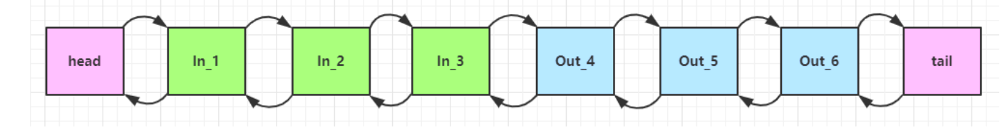
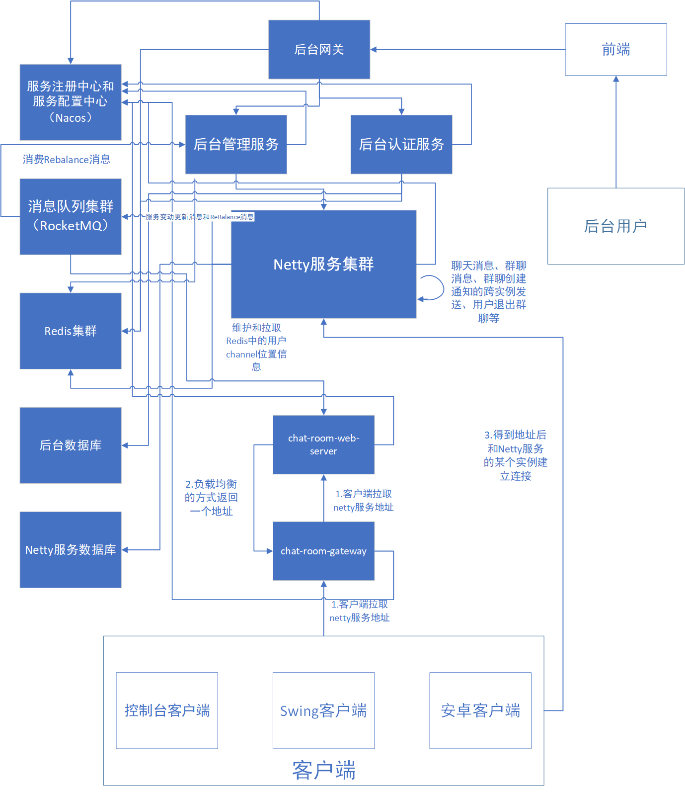

[TOC]

---


# NIO

## 三大组件

### Channel 和 Buffer

channel 有一点类似于 stream，它就是读写数据的**双向通道**，可以从 channel 将数据读入 buffer，也可以将 buffer 的数据写入 channel，而之前的 stream 要么是输入，要么是输出，channel 比 stream 更为底层


常见的 Channel 有

* FileChannel
* DatagramChannel
* SocketChannel
* ServerSocketChannel


buffer 则用来缓冲读写数据，常见的 buffer 有

* ByteBuffer
  * MappedByteBuffer
  * DirectByteBuffer
  * HeapByteBuffer
* ShortBuffer
* IntBuffer
* LongBuffer
* FloatBuffer
* DoubleBuffer
* CharBuffer


### Selector

选择器

selector 的作用就是配合一个线程来管理多个 channel，获取这些 channel 上发生的事件，这些 channel 工作在非阻塞模式下，不会让线程吊死在一个 channel 上。适合连接数特别多，但流量低的场景（low traffic）


调用 selector 的 select() 会阻塞直到 channel 发生了读写就绪事件，这些事件发生，select 方法就会返回这些事件交给 thread 来处理


## ByteBuffer

### 使用流程

1. 向 buffer 写入数据，例如调用 channel.read(buffer)
2. 调用 flip() 切换至**读模式**
3. 从 buffer 读取数据，例如调用 buffer.get()
4. 调用 clear() 或 compact() 切换至**写模式**
5. 重复 1~4 步骤


Buffer 是**非线程安全的**


### 入门

有一普通文本文件 data.txt，内容为

```sh
1234567890abcdef12345678

```


现在需要从文件里读取数据，要求：使用 FileChannel 来读取文件内容


```java
package mao.t1;

import org.slf4j.Logger;
import org.slf4j.LoggerFactory;

import java.io.RandomAccessFile;
import java.nio.ByteBuffer;
import java.nio.channels.FileChannel;

/**
 * Project name(项目名称)：Netty_ByteBuffer
 * Package(包名): mao.t1
 * Class(类名): FileChannelTest
 * Author(作者）: mao
 * Author QQ：1296193245
 * GitHub：https://github.com/maomao124/
 * Date(创建日期)： 2023/3/5
 * Time(创建时间)： 21:08
 * Version(版本): 1.0
 * Description(描述)： ByteBuffer入门，ByteBuffer一次读10个
 */

public class FileChannelTest
{
    /**
     * 日志
     */
    private static final Logger log = LoggerFactory.getLogger(FileChannelTest.class);

    /**
     * main方法
     *
     * @param args 参数
     */
    public static void main(String[] args)
    {
        //RandomAccessFile对象
        try (RandomAccessFile randomAccessFile = new RandomAccessFile("data.txt", "rw"))
        {
            //得到FileChannel
            FileChannel fileChannel = randomAccessFile.getChannel();
            //ByteBuffer，大小为10
            ByteBuffer byteBuffer = ByteBuffer.allocate(10);
            do
            {
                //写入，并记录长度
                int len = fileChannel.read(byteBuffer);
                log.debug("读到字节数：{}", len);
                //如果长度为-1，就是后面没有了
                if (len == -1)
                {
                    break;
                }
                //切换到读模式，开始打印
                byteBuffer.flip();
                //判断后面是否还有，如果有，打印
                while (byteBuffer.hasRemaining())
                {
                    log.debug("{}", (char) byteBuffer.get());
                }
                //ByteBuffer读到最后面了
                //切换到写模式
                byteBuffer.clear();
            }
            while (true);
        }
        catch (Exception e)
        {
            e.printStackTrace();
        }
    }
}

```


运行结果：

```sh
2023-03-05  21:28:08.337  [main] DEBUG mao.t1.FileChannelTest:  读到字节数：10
2023-03-05  21:28:08.338  [main] DEBUG mao.t1.FileChannelTest:  1
2023-03-05  21:28:08.338  [main] DEBUG mao.t1.FileChannelTest:  2
2023-03-05  21:28:08.338  [main] DEBUG mao.t1.FileChannelTest:  3
2023-03-05  21:28:08.338  [main] DEBUG mao.t1.FileChannelTest:  4
2023-03-05  21:28:08.338  [main] DEBUG mao.t1.FileChannelTest:  5
2023-03-05  21:28:08.338  [main] DEBUG mao.t1.FileChannelTest:  6
2023-03-05  21:28:08.339  [main] DEBUG mao.t1.FileChannelTest:  7
2023-03-05  21:28:08.339  [main] DEBUG mao.t1.FileChannelTest:  8
2023-03-05  21:28:08.339  [main] DEBUG mao.t1.FileChannelTest:  9
2023-03-05  21:28:08.339  [main] DEBUG mao.t1.FileChannelTest:  0
2023-03-05  21:28:08.339  [main] DEBUG mao.t1.FileChannelTest:  读到字节数：10
2023-03-05  21:28:08.339  [main] DEBUG mao.t1.FileChannelTest:  a
2023-03-05  21:28:08.339  [main] DEBUG mao.t1.FileChannelTest:  b
2023-03-05  21:28:08.339  [main] DEBUG mao.t1.FileChannelTest:  c
2023-03-05  21:28:08.339  [main] DEBUG mao.t1.FileChannelTest:  d
2023-03-05  21:28:08.339  [main] DEBUG mao.t1.FileChannelTest:  e
2023-03-05  21:28:08.339  [main] DEBUG mao.t1.FileChannelTest:  f
2023-03-05  21:28:08.339  [main] DEBUG mao.t1.FileChannelTest:  1
2023-03-05  21:28:08.339  [main] DEBUG mao.t1.FileChannelTest:  2
2023-03-05  21:28:08.339  [main] DEBUG mao.t1.FileChannelTest:  3
2023-03-05  21:28:08.339  [main] DEBUG mao.t1.FileChannelTest:  4
2023-03-05  21:28:08.340  [main] DEBUG mao.t1.FileChannelTest:  读到字节数：6
2023-03-05  21:28:08.340  [main] DEBUG mao.t1.FileChannelTest:  5
2023-03-05  21:28:08.340  [main] DEBUG mao.t1.FileChannelTest:  6
2023-03-05  21:28:08.340  [main] DEBUG mao.t1.FileChannelTest:  7
2023-03-05  21:28:08.340  [main] DEBUG mao.t1.FileChannelTest:  8
2023-03-05  21:28:08.340  [main] DEBUG mao.t1.FileChannelTest:  
2023-03-05  21:28:08.340  [main] DEBUG mao.t1.FileChannelTest:  

2023-03-05  21:28:08.340  [main] DEBUG mao.t1.FileChannelTest:  读到字节数：-1
```


### ByteBuffer 结构

ByteBuffer 有以下重要属性

* capacity
* position
* limit


一开始


写模式下，position 是写入位置，limit 等于容量

写入4字节后


flip 动作发生后，position 切换为读取位置，limit 切换为读取限制


读取 4 个字节后，状态


clear 动作发生后，状态


compact 方法，是把未读完的部分向前压缩，然后切换至写模式


### 工具类

需要两个依赖

```xml
<dependency>
    <groupId>io.netty</groupId>
    <artifactId>netty-all</artifactId>
    <version>4.1.39.Final</version>
</dependency>

<dependency>
    <groupId>com.google.guava</groupId>
    <artifactId>guava</artifactId>
    <version>20.0</version>
</dependency>
```


```java
package mao.utils;


import io.netty.util.internal.StringUtil;

import java.nio.ByteBuffer;

import static io.netty.util.internal.MathUtil.isOutOfBounds;
import static io.netty.util.internal.StringUtil.NEWLINE;

/**
 * Project name(项目名称)：Netty_ByteBuffer
 * Package(包名): mao.utils
 * Class(类名): ByteBufferUtil
 * Author(作者）: mao
 * Author QQ：1296193245
 * GitHub：https://github.com/maomao124/
 * Date(创建日期)： 2023/3/5
 * Time(创建时间)： 21:34
 * Version(版本): 1.0
 * Description(描述)： 工具类
 */

public class ByteBufferUtil
{
    private static final char[] BYTE2CHAR = new char[256];
    private static final char[] HEXDUMP_TABLE = new char[256 * 4];
    private static final String[] HEXPADDING = new String[16];
    private static final String[] HEXDUMP_ROWPREFIXES = new String[65536 >>> 4];
    private static final String[] BYTE2HEX = new String[256];
    private static final String[] BYTEPADDING = new String[16];

    static
    {
        final char[] DIGITS = "0123456789abcdef".toCharArray();
        for (int i = 0; i < 256; i++)
        {
            HEXDUMP_TABLE[i << 1] = DIGITS[i >>> 4 & 0x0F];
            HEXDUMP_TABLE[(i << 1) + 1] = DIGITS[i & 0x0F];
        }

        int i;

        // Generate the lookup table for hex dump paddings
        for (i = 0; i < HEXPADDING.length; i++)
        {
            int padding = HEXPADDING.length - i;
            StringBuilder buf = new StringBuilder(padding * 3);
            for (int j = 0; j < padding; j++)
            {
                buf.append("   ");
            }
            HEXPADDING[i] = buf.toString();
        }

        // Generate the lookup table for the start-offset header in each row (up to 64KiB).
        for (i = 0; i < HEXDUMP_ROWPREFIXES.length; i++)
        {
            StringBuilder buf = new StringBuilder(12);
            buf.append(NEWLINE);
            buf.append(Long.toHexString(i << 4 & 0xFFFFFFFFL | 0x100000000L));
            buf.setCharAt(buf.length() - 9, '|');
            buf.append('|');
            HEXDUMP_ROWPREFIXES[i] = buf.toString();
        }

        // Generate the lookup table for byte-to-hex-dump conversion
        for (i = 0; i < BYTE2HEX.length; i++)
        {
            BYTE2HEX[i] = ' ' + StringUtil.byteToHexStringPadded(i);
        }

        // Generate the lookup table for byte dump paddings
        for (i = 0; i < BYTEPADDING.length; i++)
        {
            int padding = BYTEPADDING.length - i;
            StringBuilder buf = new StringBuilder(padding);
            for (int j = 0; j < padding; j++)
            {
                buf.append(' ');
            }
            BYTEPADDING[i] = buf.toString();
        }

        // Generate the lookup table for byte-to-char conversion
        for (i = 0; i < BYTE2CHAR.length; i++)
        {
            if (i <= 0x1f || i >= 0x7f)
            {
                BYTE2CHAR[i] = '.';
            }
            else
            {
                BYTE2CHAR[i] = (char) i;
            }
        }
    }

    /**
     * 打印所有内容
     *
     * @param buffer 缓冲
     */
    public static void debugAll(ByteBuffer buffer)
    {
        int oldlimit = buffer.limit();
        buffer.limit(buffer.capacity());
        StringBuilder origin = new StringBuilder(256);
        appendPrettyHexDump(origin, buffer, 0, buffer.capacity());
        System.out.println("+--------+-------------------- all ------------------------+----------------+");
        System.out.printf("position: [%d], limit: [%d]\n", buffer.position(), oldlimit);
        System.out.println(origin);
        buffer.limit(oldlimit);
    }

    /**
     * 打印可读取内容
     *
     * @param buffer 缓冲
     */
    public static void debugRead(ByteBuffer buffer)
    {
        StringBuilder builder = new StringBuilder(256);
        appendPrettyHexDump(builder, buffer, buffer.position(), buffer.limit() - buffer.position());
        System.out.println("+--------+-------------------- read -----------------------+----------------+");
        System.out.printf("position: [%d], limit: [%d]\n", buffer.position(), buffer.limit());
        System.out.println(builder);
    }

    private static void appendPrettyHexDump(StringBuilder dump, ByteBuffer buf, int offset, int length)
    {
        if (isOutOfBounds(offset, length, buf.capacity()))
        {
            throw new IndexOutOfBoundsException(
                    "expected: " + "0 <= offset(" + offset + ") <= offset + length(" + length
                            + ") <= " + "buf.capacity(" + buf.capacity() + ')');
        }
        if (length == 0)
        {
            return;
        }
        dump.append("         +-------------------------------------------------+").append(NEWLINE).append("         |  0  1  2  3  4  5  6  7  8  9  a  b  c  d  e  f |").append(NEWLINE).append("+--------+-------------------------------------------------+----------------+");

        final int startIndex = offset;
        final int fullRows = length >>> 4;
        final int remainder = length & 0xF;

        // Dump the rows which have 16 bytes.
        for (int row = 0; row < fullRows; row++)
        {
            int rowStartIndex = (row << 4) + startIndex;

            // Per-row prefix.
            appendHexDumpRowPrefix(dump, row, rowStartIndex);

            // Hex dump
            int rowEndIndex = rowStartIndex + 16;
            for (int j = rowStartIndex; j < rowEndIndex; j++)
            {
                dump.append(BYTE2HEX[getUnsignedByte(buf, j)]);
            }
            dump.append(" |");

            // ASCII dump
            for (int j = rowStartIndex; j < rowEndIndex; j++)
            {
                dump.append(BYTE2CHAR[getUnsignedByte(buf, j)]);
            }
            dump.append('|');
        }

        // Dump the last row which has less than 16 bytes.
        if (remainder != 0)
        {
            int rowStartIndex = (fullRows << 4) + startIndex;
            appendHexDumpRowPrefix(dump, fullRows, rowStartIndex);

            // Hex dump
            int rowEndIndex = rowStartIndex + remainder;
            for (int j = rowStartIndex; j < rowEndIndex; j++)
            {
                dump.append(BYTE2HEX[getUnsignedByte(buf, j)]);
            }
            dump.append(HEXPADDING[remainder]);
            dump.append(" |");

            // Ascii dump
            for (int j = rowStartIndex; j < rowEndIndex; j++)
            {
                dump.append(BYTE2CHAR[getUnsignedByte(buf, j)]);
            }
            dump.append(BYTEPADDING[remainder]);
            dump.append('|');
        }

        dump.append(NEWLINE +
                "+--------+-------------------------------------------------+----------------+");
    }

    /**
     * 将十六进制转储行前缀
     *
     * @param dump          转储
     * @param row           行
     * @param rowStartIndex 行开始指数
     */
    private static void appendHexDumpRowPrefix(StringBuilder dump, int row, int rowStartIndex)
    {
        if (row < HEXDUMP_ROWPREFIXES.length)
        {
            dump.append(HEXDUMP_ROWPREFIXES[row]);
        }
        else
        {
            dump.append(NEWLINE);
            dump.append(Long.toHexString(rowStartIndex & 0xFFFFFFFFL | 0x100000000L));
            dump.setCharAt(dump.length() - 9, '|');
            dump.append('|');
        }
    }

    /**
     * 得到无符号字节
     *
     * @param buffer 缓冲
     * @param index  指数
     * @return short
     */
    public static short getUnsignedByte(ByteBuffer buffer, int index)
    {
        return (short) (buffer.get(index) & 0xFF);
    }
}
```


### ByteBuffer常见方法

#### 分配空间

可以使用 allocate 方法为 ByteBuffer 分配空间，其它 buffer 类也有该方法

```java
//ByteBuffer分配空间，大小为10
ByteBuffer byteBuffer = ByteBuffer.allocate(10);
```


#### 向ByteBuffer写入数据

有两种办法

* 调用 channel 的 read 方法
* 调用 buffer 自己的 put 方法


```java
package mao.t2;

import mao.utils.ByteBufferUtil;
import org.slf4j.Logger;
import org.slf4j.LoggerFactory;

import java.nio.ByteBuffer;

/**
 * Project name(项目名称)：Netty_ByteBuffer
 * Package(包名): mao.t2
 * Class(类名): ByteBufferPutTest
 * Author(作者）: mao
 * Author QQ：1296193245
 * GitHub：https://github.com/maomao124/
 * Date(创建日期)： 2023/3/5
 * Time(创建时间)： 21:50
 * Version(版本): 1.0
 * Description(描述)： 无
 */

public class ByteBufferPutTest
{
    private static final Logger log = LoggerFactory.getLogger(ByteBufferPutTest.class);

    public static void main(String[] args)
    {
        ByteBuffer byteBuffer = ByteBuffer.allocate(10);
        //调用put方法
        byteBuffer.put(new byte[]{'1', '2', '3', '4'});
        //打印
        ByteBufferUtil.debugAll(byteBuffer);

        //调用put方法
        byteBuffer.put(new byte[]{'5', '6'});
        //打印
        ByteBufferUtil.debugAll(byteBuffer);
    }
}

```


运行结果：

```sh
+--------+-------------------- all ------------------------+----------------+
position: [4], limit: [10]
         +-------------------------------------------------+
         |  0  1  2  3  4  5  6  7  8  9  a  b  c  d  e  f |
+--------+-------------------------------------------------+----------------+
|00000000| 31 32 33 34 00 00 00 00 00 00                   |1234......      |
+--------+-------------------------------------------------+----------------+
+--------+-------------------- all ------------------------+----------------+
position: [6], limit: [10]
         +-------------------------------------------------+
         |  0  1  2  3  4  5  6  7  8  9  a  b  c  d  e  f |
+--------+-------------------------------------------------+----------------+
|00000000| 31 32 33 34 35 36 00 00 00 00                   |123456....      |
+--------+-------------------------------------------------+----------------+
```


#### 从ByteBuffer读取数据

同样有两种办法

* 调用 channel 的 write 方法
* 调用 buffer 自己的 get 方法


```java
int writeBytes = channel.write(byteBuffer);
```

或者

```java
byte b = byteBuffer.get();
```


get 方法会让 position 读指针向后走，如果想重复读取数据

* 可以调用 rewind 方法将 position 重新置为 0
* 或者调用 get(int i) 方法获取索引 i 的内容，它不会移动读指针


```java
package mao.t2;

import mao.utils.ByteBufferUtil;
import org.slf4j.Logger;
import org.slf4j.LoggerFactory;

import java.nio.ByteBuffer;

/**
 * Project name(项目名称)：Netty_ByteBuffer
 * Package(包名): mao.t2
 * Class(类名): ByteBufferGetTest
 * Author(作者）: mao
 * Author QQ：1296193245
 * GitHub：https://github.com/maomao124/
 * Date(创建日期)： 2023/3/5
 * Time(创建时间)： 21:59
 * Version(版本): 1.0
 * Description(描述)： 无
 */

public class ByteBufferGetTest
{
    private static final Logger log = LoggerFactory.getLogger(ByteBufferPutTest.class);

    public static void main(String[] args)
    {
        ByteBuffer byteBuffer = ByteBuffer.allocate(10);
        //调用put方法
        byteBuffer.put(new byte[]{'1', '2', '3', '4'});

        //调用put方法
        byteBuffer.put(new byte[]{'5', '6'});

        //打印
        ByteBufferUtil.debugAll(byteBuffer);

        //按索引位置读取
        byte b = byteBuffer.get(2);
        System.out.println((char) b);
        //打印
        ByteBufferUtil.debugAll(byteBuffer);
        //按索引位置读取
        b = byteBuffer.get(4);
        System.out.println((char) b);
        //打印
        ByteBufferUtil.debugAll(byteBuffer);

        //调用get方法读取
        b = byteBuffer.get();
        System.out.println((char) b);
        //打印
        ByteBufferUtil.debugAll(byteBuffer);

        //调用get方法读取
        b = byteBuffer.get();
        System.out.println((char) b);
        //打印
        ByteBufferUtil.debugAll(byteBuffer);

        //调用rewind方法，将 position 重新置为 0
        byteBuffer.rewind();
        //打印
        ByteBufferUtil.debugAll(byteBuffer);

        //调用get方法读取
        b = byteBuffer.get();
        System.out.println((char) b);
        //打印
        ByteBufferUtil.debugAll(byteBuffer);
    }
}
```


运行结果：

```sh
+--------+-------------------- all ------------------------+----------------+
position: [6], limit: [10]
         +-------------------------------------------------+
         |  0  1  2  3  4  5  6  7  8  9  a  b  c  d  e  f |
+--------+-------------------------------------------------+----------------+
|00000000| 31 32 33 34 35 36 00 00 00 00                   |123456....      |
+--------+-------------------------------------------------+----------------+
3
+--------+-------------------- all ------------------------+----------------+
position: [6], limit: [10]
         +-------------------------------------------------+
         |  0  1  2  3  4  5  6  7  8  9  a  b  c  d  e  f |
+--------+-------------------------------------------------+----------------+
|00000000| 31 32 33 34 35 36 00 00 00 00                   |123456....      |
+--------+-------------------------------------------------+----------------+
5
+--------+-------------------- all ------------------------+----------------+
position: [6], limit: [10]
         +-------------------------------------------------+
         |  0  1  2  3  4  5  6  7  8  9  a  b  c  d  e  f |
+--------+-------------------------------------------------+----------------+
|00000000| 31 32 33 34 35 36 00 00 00 00                   |123456....      |
+--------+-------------------------------------------------+----------------+
 
+--------+-------------------- all ------------------------+----------------+
position: [7], limit: [10]
         +-------------------------------------------------+
         |  0  1  2  3  4  5  6  7  8  9  a  b  c  d  e  f |
+--------+-------------------------------------------------+----------------+
|00000000| 31 32 33 34 35 36 00 00 00 00                   |123456....      |
+--------+-------------------------------------------------+----------------+
 
+--------+-------------------- all ------------------------+----------------+
position: [8], limit: [10]
         +-------------------------------------------------+
         |  0  1  2  3  4  5  6  7  8  9  a  b  c  d  e  f |
+--------+-------------------------------------------------+----------------+
|00000000| 31 32 33 34 35 36 00 00 00 00                   |123456....      |
+--------+-------------------------------------------------+----------------+
+--------+-------------------- all ------------------------+----------------+
position: [0], limit: [10]
         +-------------------------------------------------+
         |  0  1  2  3  4  5  6  7  8  9  a  b  c  d  e  f |
+--------+-------------------------------------------------+----------------+
|00000000| 31 32 33 34 35 36 00 00 00 00                   |123456....      |
+--------+-------------------------------------------------+----------------+
1
+--------+-------------------- all ------------------------+----------------+
position: [1], limit: [10]
         +-------------------------------------------------+
         |  0  1  2  3  4  5  6  7  8  9  a  b  c  d  e  f |
+--------+-------------------------------------------------+----------------+
|00000000| 31 32 33 34 35 36 00 00 00 00                   |123456....      |
+--------+-------------------------------------------------+----------------+
```


#### mark 和 reset

mark 是在读取时，做一个标记，即使 position 改变，只要调用 reset 就能回到 mark 的位置


```java
package mao.t2;

import mao.utils.ByteBufferUtil;
import org.slf4j.Logger;
import org.slf4j.LoggerFactory;

import java.nio.ByteBuffer;

/**
 * Project name(项目名称)：Netty_ByteBuffer
 * Package(包名): mao.t2
 * Class(类名): ByteBufferMarkAndResetTest
 * Author(作者）: mao
 * Author QQ：1296193245
 * GitHub：https://github.com/maomao124/
 * Date(创建日期)： 2023/3/5
 * Time(创建时间)： 22:04
 * Version(版本): 1.0
 * Description(描述)： mark 和 reset
 */

public class ByteBufferMarkAndResetTest
{
    private static final Logger log = LoggerFactory.getLogger(ByteBufferPutTest.class);

    public static void main(String[] args)
    {
        ByteBuffer byteBuffer = ByteBuffer.allocate(10);
        //调用put方法
        byteBuffer.put(new byte[]{'1', '2', '3', '4'});
        //调用put方法
        byteBuffer.put(new byte[]{'5', '6'});

        //打印
        ByteBufferUtil.debugAll(byteBuffer);

        //调用mark方法
        byteBuffer.mark();

        //调用两次get方法
        byteBuffer.get();
        byteBuffer.get();

        //打印
        ByteBufferUtil.debugAll(byteBuffer);

        //调用reset方法
        byteBuffer.reset();

        //打印
        ByteBufferUtil.debugAll(byteBuffer);

    }
}
```


运行结果：

```sh
+--------+-------------------- all ------------------------+----------------+
position: [6], limit: [10]
         +-------------------------------------------------+
         |  0  1  2  3  4  5  6  7  8  9  a  b  c  d  e  f |
+--------+-------------------------------------------------+----------------+
|00000000| 31 32 33 34 35 36 00 00 00 00                   |123456....      |
+--------+-------------------------------------------------+----------------+
+--------+-------------------- all ------------------------+----------------+
position: [8], limit: [10]
         +-------------------------------------------------+
         |  0  1  2  3  4  5  6  7  8  9  a  b  c  d  e  f |
+--------+-------------------------------------------------+----------------+
|00000000| 31 32 33 34 35 36 00 00 00 00                   |123456....      |
+--------+-------------------------------------------------+----------------+
+--------+-------------------- all ------------------------+----------------+
position: [6], limit: [10]
         +-------------------------------------------------+
         |  0  1  2  3  4  5  6  7  8  9  a  b  c  d  e  f |
+--------+-------------------------------------------------+----------------+
|00000000| 31 32 33 34 35 36 00 00 00 00                   |123456....      |
+--------+-------------------------------------------------+----------------+
```


**rewind 和 flip 都会清除 mark 位置**


#### 字符串与ByteBuffer互转

```java
package mao.t2;

import mao.utils.ByteBufferUtil;

import java.nio.ByteBuffer;
import java.nio.charset.Charset;
import java.nio.charset.StandardCharsets;

/**
 * Project name(项目名称)：Netty_ByteBuffer
 * Package(包名): mao.t2
 * Class(类名): StringToByteBufferTest
 * Author(作者）: mao
 * Author QQ：1296193245
 * GitHub：https://github.com/maomao124/
 * Date(创建日期)： 2023/3/5
 * Time(创建时间)： 22:13
 * Version(版本): 1.0
 * Description(描述)： 字符串转ByteBuffer
 */

public class StringToByteBufferTest
{
    public static void main(String[] args)
    {
        String s = "hello\0你好";

        //第1种
        ByteBuffer byteBuffer1 = StandardCharsets.UTF_8.encode(s);
        //第2种
        ByteBuffer byteBuffer2 = Charset.forName("utf-8").encode(s);

        ByteBufferUtil.debugAll(byteBuffer1);
        ByteBufferUtil.debugAll(byteBuffer2);
    }
}
```


运行结果：

```sh
+--------+-------------------- all ------------------------+----------------+
position: [0], limit: [12]
         +-------------------------------------------------+
         |  0  1  2  3  4  5  6  7  8  9  a  b  c  d  e  f |
+--------+-------------------------------------------------+----------------+
|00000000| 68 65 6c 6c 6f 00 e4 bd a0 e5 a5 bd 00 00 00 00 |hello...........|
|00000010| 00                                              |.               |
+--------+-------------------------------------------------+----------------+
+--------+-------------------- all ------------------------+----------------+
position: [0], limit: [12]
         +-------------------------------------------------+
         |  0  1  2  3  4  5  6  7  8  9  a  b  c  d  e  f |
+--------+-------------------------------------------------+----------------+
|00000000| 68 65 6c 6c 6f 00 e4 bd a0 e5 a5 bd 00 00 00 00 |hello...........|
|00000010| 00                                              |.               |
+--------+-------------------------------------------------+----------------+
```


**ByteBuffer转String**

```java
package mao.t2;

import mao.utils.ByteBufferUtil;
import org.slf4j.Logger;
import org.slf4j.LoggerFactory;

import java.nio.ByteBuffer;
import java.nio.CharBuffer;
import java.nio.charset.Charset;
import java.nio.charset.StandardCharsets;

/**
 * Project name(项目名称)：Netty_ByteBuffer
 * Package(包名): mao.t2
 * Class(类名): ByteBufferToStringTest
 * Author(作者）: mao
 * Author QQ：1296193245
 * GitHub：https://github.com/maomao124/
 * Date(创建日期)： 2023/3/5
 * Time(创建时间)： 22:22
 * Version(版本): 1.0
 * Description(描述)： ByteBuffer转String
 */

public class ByteBufferToStringTest
{
    private static final Logger log = LoggerFactory.getLogger(ByteBufferToStringTest.class);

    public static void main(String[] args)
    {
        String s = "1234 hello 你好";

        //第1种
        ByteBuffer byteBuffer1 = StandardCharsets.UTF_8.encode(s);
        //第2种
        ByteBuffer byteBuffer2 = Charset.forName("utf-8").encode(s);

        ByteBufferUtil.debugAll(byteBuffer1);
        ByteBufferUtil.debugAll(byteBuffer2);

        CharBuffer charBuffer1 = StandardCharsets.UTF_8.decode(byteBuffer1);
        CharBuffer charBuffer2 = StandardCharsets.UTF_8.decode(byteBuffer2);

        String s1 = charBuffer1.toString();
        String s2 = charBuffer2.toString();

        log.info(s1);
        log.info(s2);
    }
}
```


运行结果：

```sh
+--------+-------------------- all ------------------------+----------------+
position: [0], limit: [17]
         +-------------------------------------------------+
         |  0  1  2  3  4  5  6  7  8  9  a  b  c  d  e  f |
+--------+-------------------------------------------------+----------------+
|00000000| 31 32 33 34 20 68 65 6c 6c 6f 20 e4 bd a0 e5 a5 |1234 hello .....|
|00000010| bd 00 00 00 00 00 00 00 00 00 00 00 00          |.............   |
+--------+-------------------------------------------------+----------------+
+--------+-------------------- all ------------------------+----------------+
position: [0], limit: [17]
         +-------------------------------------------------+
         |  0  1  2  3  4  5  6  7  8  9  a  b  c  d  e  f |
+--------+-------------------------------------------------+----------------+
|00000000| 31 32 33 34 20 68 65 6c 6c 6f 20 e4 bd a0 e5 a5 |1234 hello .....|
|00000010| bd 00 00 00 00 00 00 00 00 00 00 00 00          |.............   |
+--------+-------------------------------------------------+----------------+
2023-03-05  22:26:02.809  [main] INFO  mao.t2.ByteBufferToStringTest:  1234 hello 你好
2023-03-05  22:26:02.810  [main] INFO  mao.t2.ByteBufferToStringTest:  1234 hello 你好
```


### Scattering Reads

现在有以下文件data2.txt，文件内容为：

```sh
onetwothreefour
```


现在要将这4个单词读按顺序读到4个ByteBuffer里，已知每个单词的长度


```java
package mao.t3;

import mao.utils.ByteBufferUtil;

import java.io.RandomAccessFile;
import java.nio.ByteBuffer;
import java.nio.channels.FileChannel;

/**
 * Project name(项目名称)：Netty_ByteBuffer
 * Package(包名): mao.t3
 * Class(类名): ScatteringReadsTest
 * Author(作者）: mao
 * Author QQ：1296193245
 * GitHub：https://github.com/maomao124/
 * Date(创建日期)： 2023/3/5
 * Time(创建时间)： 22:39
 * Version(版本): 1.0
 * Description(描述)： Scattering Reads
 */

public class ScatteringReadsTest
{
    public static void main(String[] args)
    {
        try (RandomAccessFile randomAccessFile = new RandomAccessFile("data2.txt", "rw"))
        {
            FileChannel fileChannel = randomAccessFile.getChannel();

            //构建4个ByteBuffer
            ByteBuffer byteBuffer1 = ByteBuffer.allocate(3);
            ByteBuffer byteBuffer2 = ByteBuffer.allocate(3);
            ByteBuffer byteBuffer3 = ByteBuffer.allocate(5);
            ByteBuffer byteBuffer4 = ByteBuffer.allocate(4);

            //ByteBuffer数组
            ByteBuffer[] byteBuffers = new ByteBuffer[]{byteBuffer1, byteBuffer2, byteBuffer3, byteBuffer4};

            //读取，并写入到4个ByteBuffer中
            fileChannel.read(byteBuffers);

            //打印
            ByteBufferUtil.debugAll(byteBuffer1);
            ByteBufferUtil.debugAll(byteBuffer2);
            ByteBufferUtil.debugAll(byteBuffer3);
            ByteBufferUtil.debugAll(byteBuffer4);

        }
        catch (Exception e)
        {
            e.printStackTrace();
        }
    }
}
```


运行结果：

```sh
+--------+-------------------- all ------------------------+----------------+
position: [3], limit: [3]
         +-------------------------------------------------+
         |  0  1  2  3  4  5  6  7  8  9  a  b  c  d  e  f |
+--------+-------------------------------------------------+----------------+
|00000000| 6f 6e 65                                        |one             |
+--------+-------------------------------------------------+----------------+
+--------+-------------------- all ------------------------+----------------+
position: [3], limit: [3]
         +-------------------------------------------------+
         |  0  1  2  3  4  5  6  7  8  9  a  b  c  d  e  f |
+--------+-------------------------------------------------+----------------+
|00000000| 74 77 6f                                        |two             |
+--------+-------------------------------------------------+----------------+
+--------+-------------------- all ------------------------+----------------+
position: [5], limit: [5]
         +-------------------------------------------------+
         |  0  1  2  3  4  5  6  7  8  9  a  b  c  d  e  f |
+--------+-------------------------------------------------+----------------+
|00000000| 74 68 72 65 65                                  |three           |
+--------+-------------------------------------------------+----------------+
+--------+-------------------- all ------------------------+----------------+
position: [4], limit: [4]
         +-------------------------------------------------+
         |  0  1  2  3  4  5  6  7  8  9  a  b  c  d  e  f |
+--------+-------------------------------------------------+----------------+
|00000000| 66 6f 75 72                                     |four            |
+--------+-------------------------------------------------+----------------+
```


### Gathering Writes

需求：将多个 ByteBuffer 的数据填充至 channel


```java
package mao.t3;

import mao.utils.ByteBufferUtil;

import java.io.RandomAccessFile;
import java.nio.ByteBuffer;
import java.nio.channels.FileChannel;
import java.nio.charset.StandardCharsets;

/**
 * Project name(项目名称)：Netty_ByteBuffer
 * Package(包名): mao.t3
 * Class(类名): GatheringWritesTest
 * Author(作者）: mao
 * Author QQ：1296193245
 * GitHub：https://github.com/maomao124/
 * Date(创建日期)： 2023/3/5
 * Time(创建时间)： 22:47
 * Version(版本): 1.0
 * Description(描述)： Gathering Writes
 */

public class GatheringWritesTest
{
    public static void main(String[] args)
    {
        try (RandomAccessFile randomAccessFile = new RandomAccessFile("data4.txt", "rw"))
        {
            FileChannel fileChannel = randomAccessFile.getChannel();

            ByteBuffer byteBuffer1 = ByteBuffer.allocate(4);
            ByteBuffer byteBuffer2 = ByteBuffer.allocate(3);

            byteBuffer1.put("five".getBytes(StandardCharsets.UTF_8));
            byteBuffer2.put("six".getBytes(StandardCharsets.UTF_8));

            ByteBuffer[] byteBuffers = new ByteBuffer[]{byteBuffer1, byteBuffer2};

            ByteBufferUtil.debugAll(byteBuffer1);
            ByteBufferUtil.debugAll(byteBuffer2);

            //切换到读模式
            byteBuffer1.flip();
            byteBuffer2.flip();

            ByteBufferUtil.debugAll(byteBuffer1);
            ByteBufferUtil.debugAll(byteBuffer2);

            //写入
            fileChannel.write(byteBuffers);
        }
        catch (Exception e)
        {
            e.printStackTrace();
        }
    }
}
```


运行结果：

```sh
+--------+-------------------- all ------------------------+----------------+
position: [4], limit: [4]
         +-------------------------------------------------+
         |  0  1  2  3  4  5  6  7  8  9  a  b  c  d  e  f |
+--------+-------------------------------------------------+----------------+
|00000000| 66 69 76 65                                     |five            |
+--------+-------------------------------------------------+----------------+
+--------+-------------------- all ------------------------+----------------+
position: [3], limit: [3]
         +-------------------------------------------------+
         |  0  1  2  3  4  5  6  7  8  9  a  b  c  d  e  f |
+--------+-------------------------------------------------+----------------+
|00000000| 73 69 78                                        |six             |
+--------+-------------------------------------------------+----------------+
+--------+-------------------- all ------------------------+----------------+
position: [0], limit: [4]
         +-------------------------------------------------+
         |  0  1  2  3  4  5  6  7  8  9  a  b  c  d  e  f |
+--------+-------------------------------------------------+----------------+
|00000000| 66 69 76 65                                     |five            |
+--------+-------------------------------------------------+----------------+
+--------+-------------------- all ------------------------+----------------+
position: [0], limit: [3]
         +-------------------------------------------------+
         |  0  1  2  3  4  5  6  7  8  9  a  b  c  d  e  f |
+--------+-------------------------------------------------+----------------+
|00000000| 73 69 78                                        |six             |
+--------+-------------------------------------------------+----------------+
```


文件内容：

```sh
fivesix
```


### 黏包和半包

#### 说明

网络上有多条数据发送给服务端，数据之间使用 \n 进行分隔
但由于某种原因这些数据在接收时，被进行了重新组合，例如原始数据有3条为

* Hello,world\n
* I'm zhangsan\n
* How are you?\n

变成了下面的两个 byteBuffer (黏包，半包)

* Hello,world\nI'm zhangsan\nHo
* w are you?\n


现在要求你编写程序，将错乱的数据恢复成原始的按 \n 分隔的数据


#### 解决

```java
package mao.t4;

import mao.utils.ByteBufferUtil;
import org.slf4j.Logger;
import org.slf4j.LoggerFactory;

import java.nio.ByteBuffer;
import java.nio.charset.StandardCharsets;

/**
 * Project name(项目名称)：Netty_ByteBuffer
 * Package(包名): mao.t4
 * Class(类名): StickyAndHalfPackedTest
 * Author(作者）: mao
 * Author QQ：1296193245
 * GitHub：https://github.com/maomao124/
 * Date(创建日期)： 2023/3/8
 * Time(创建时间)： 21:41
 * Version(版本): 1.0
 * Description(描述)： 黏包和半包
 */

public class StickyAndHalfPackedTest
{

    private static final Logger log = LoggerFactory.getLogger(StickyAndHalfPackedTest.class);

    public static void main(String[] args)
    {
        ByteBuffer byteBuffer = ByteBuffer.allocate(64);
        byteBuffer.put("Hello,world\nI'm zhangsan\nHo".getBytes(StandardCharsets.UTF_8));
        split(byteBuffer);
        byteBuffer.put("w are you?\nhaha!\n".getBytes(StandardCharsets.UTF_8));
        split(byteBuffer);
    }


    /**
     * 分割
     *
     * @param byteBuffer 字节缓冲区
     */
    private static void split(ByteBuffer byteBuffer)
    {
        //切换到读模式
        byteBuffer.flip();
        //得到limit
        int limit = byteBuffer.limit();
        for (int i = 0; i < limit; i++)
        {
            //判断是否遇到了换换行符
            if (byteBuffer.get(i) == '\n')
            {
                //换行符
                log.debug(String.valueOf(i));
                //开辟一个一行长度的ByteBuffer
                ByteBuffer target = ByteBuffer.allocate(i + 1 - byteBuffer.position());
                //设置limit
                byteBuffer.limit(i + 1);
                //从byteBuffer读，向target写
                target.put(byteBuffer);
                //打印
                ByteBufferUtil.debugAll(target);
                byteBuffer.limit(limit);
            }
        }
        //切换到写模式，未读完的部分继续
        byteBuffer.compact();
    }
}
```


运行结果：

```sh
+--------+-------------------- all ------------------------+----------------+
position: [12], limit: [12]
         +-------------------------------------------------+
         |  0  1  2  3  4  5  6  7  8  9  a  b  c  d  e  f |
+--------+-------------------------------------------------+----------------+
|00000000| 48 65 6c 6c 6f 2c 77 6f 72 6c 64 0a             |Hello,world.    |
+--------+-------------------------------------------------+----------------+
2023-03-08  21:58:18.919  [main] DEBUG mao.t4.StickyAndHalfPackedTest:  24
+--------+-------------------- all ------------------------+----------------+
position: [13], limit: [13]
         +-------------------------------------------------+
         |  0  1  2  3  4  5  6  7  8  9  a  b  c  d  e  f |
+--------+-------------------------------------------------+----------------+
|00000000| 49 27 6d 20 7a 68 61 6e 67 73 61 6e 0a          |I'm zhangsan.   |
+--------+-------------------------------------------------+----------------+
2023-03-08  21:58:18.919  [main] DEBUG mao.t4.StickyAndHalfPackedTest:  12
+--------+-------------------- all ------------------------+----------------+
position: [13], limit: [13]
         +-------------------------------------------------+
         |  0  1  2  3  4  5  6  7  8  9  a  b  c  d  e  f |
+--------+-------------------------------------------------+----------------+
|00000000| 48 6f 77 20 61 72 65 20 79 6f 75 3f 0a          |How are you?.   |
+--------+-------------------------------------------------+----------------+
2023-03-08  21:58:18.920  [main] DEBUG mao.t4.StickyAndHalfPackedTest:  18
+--------+-------------------- all ------------------------+----------------+
position: [6], limit: [6]
         +-------------------------------------------------+
         |  0  1  2  3  4  5  6  7  8  9  a  b  c  d  e  f |
+--------+-------------------------------------------------+----------------+
|00000000| 68 61 68 61 21 0a                               |haha!.          |
+--------+-------------------------------------------------+----------------+
```


## 文件编程

### FileChannel

FileChannel 只能工作在阻塞模式下


#### 获取

不能直接打开 FileChannel，必须通过 FileInputStream、FileOutputStream 或者 RandomAccessFile 来获取 FileChannel，它们都有 getChannel 方法

* 通过 FileInputStream 获取的 channel 只能读
* 通过 FileOutputStream 获取的 channel 只能写
* 通过 RandomAccessFile 是否能读写根据构造 RandomAccessFile 时的读写模式决定


```java
package mao.t1;

import mao.utils.ByteBufferUtil;
import org.slf4j.Logger;
import org.slf4j.LoggerFactory;

import java.io.FileInputStream;
import java.io.FileOutputStream;
import java.io.RandomAccessFile;
import java.nio.ByteBuffer;
import java.nio.channels.FileChannel;
import java.nio.charset.StandardCharsets;

/**
 * Project name(项目名称)：Netty_File_Programming
 * Package(包名): mao.t1
 * Class(类名): FileChannelGetTest
 * Author(作者）: mao
 * Author QQ：1296193245
 * GitHub：https://github.com/maomao124/
 * Date(创建日期)： 2023/3/8
 * Time(创建时间)： 22:10
 * Version(版本): 1.0
 * Description(描述)： 得到FileChannel
 */

public class FileChannelGetTest
{
    /**
     * 日志
     */
    private static final Logger log = LoggerFactory.getLogger(FileChannelGetTest.class);

    /**
     * main方法
     *
     * @param args 参数
     */
    public static void main(String[] args)
    {
        //第一种方法，通过 FileInputStream 获取
        try (FileInputStream fileInputStream = new FileInputStream("test.txt"))
        {
            FileChannel fileChannel = fileInputStream.getChannel();
            log.debug(fileChannel.toString());
            //尝试读
            ByteBuffer byteBuffer = ByteBuffer.allocate(10);
            fileChannel.read(byteBuffer);
            byteBuffer.flip();
            byte b = byteBuffer.get(2);
            log.debug(String.valueOf((char) b));
            //打印
            ByteBufferUtil.debugAll(byteBuffer);

            //尝试写
            byteBuffer.clear();
            byteBuffer.put("abc".getBytes(StandardCharsets.UTF_8));
            //打印
            ByteBufferUtil.debugAll(byteBuffer);
            try
            {
                fileChannel.write(byteBuffer);
            }
            catch (Exception e)
            {
                log.error("写入失败：", e);
            }
        }
        catch (Exception e)
        {
            e.printStackTrace();
        }


        //第二种方法，通过 FileOutputStream 获取
        try (FileOutputStream fileOutputStream = new FileOutputStream("test.txt"))
        {
            FileChannel fileChannel = fileOutputStream.getChannel();
            log.debug(fileChannel.toString());
            //尝试读
            ByteBuffer byteBuffer = ByteBuffer.allocate(10);
            try
            {
                fileChannel.read(byteBuffer);
                byteBuffer.flip();
                byte b = byteBuffer.get(2);
                log.debug(String.valueOf((char) b));
                //打印
                ByteBufferUtil.debugAll(byteBuffer);
            }
            catch (Exception e)
            {
                log.error("读失败：", e);
            }

            //尝试写
            byteBuffer.clear();
            byteBuffer.put("abc".getBytes(StandardCharsets.UTF_8));
            //打印
            ByteBufferUtil.debugAll(byteBuffer);
            try
            {
                //切换读模式
                byteBuffer.flip();
                fileChannel.write(byteBuffer);
            }
            catch (Exception e)
            {
                log.error("写入失败：", e);
            }
        }
        catch (Exception e)
        {
            e.printStackTrace();
        }


       //第三种方法，通过 FileInputStream 获取
        try (RandomAccessFile randomAccessFile = new RandomAccessFile("test.txt","rw"))
        {
            FileChannel fileChannel = randomAccessFile.getChannel();
            log.debug(fileChannel.toString());
            //尝试读
            ByteBuffer byteBuffer = ByteBuffer.allocate(10);
            try
            {
                fileChannel.read(byteBuffer);
                byteBuffer.flip();
                byte b = byteBuffer.get(2);
                log.debug(String.valueOf((char) b));
                //打印
                ByteBufferUtil.debugAll(byteBuffer);
            }
            catch (Exception e)
            {
                log.error("读失败：", e);
            }

            //尝试写
            byteBuffer.clear();
            byteBuffer.put("abcdefg".getBytes(StandardCharsets.UTF_8));
            //打印
            ByteBufferUtil.debugAll(byteBuffer);
            try
            {
                //切换读模式
                byteBuffer.flip();
                fileChannel.write(byteBuffer);
            }
            catch (Exception e)
            {
                log.error("写入失败：", e);
            }
        }
        catch (Exception e)
        {
            e.printStackTrace();
        }
    }
}
```


运行结果：

```sh
2023-03-08  22:36:45.992  [main] DEBUG mao.t1.FileChannelGetTest:  sun.nio.ch.FileChannelImpl@22ef9844
2023-03-08  22:36:45.993  [main] DEBUG mao.t1.FileChannelGetTest:  3
2023-03-08  22:36:45.995  [main] DEBUG io.netty.util.internal.logging.InternalLoggerFactory:  Using SLF4J as the default logging framework
+--------+-------------------- all ------------------------+----------------+
position: [0], limit: [8]
         +-------------------------------------------------+
         |  0  1  2  3  4  5  6  7  8  9  a  b  c  d  e  f |
+--------+-------------------------------------------------+----------------+
|00000000| 31 32 33 34 35 36 0d 0a 00 00                   |123456....      |
+--------+-------------------------------------------------+----------------+
+--------+-------------------- all ------------------------+----------------+
position: [3], limit: [10]
         +-------------------------------------------------+
         |  0  1  2  3  4  5  6  7  8  9  a  b  c  d  e  f |
+--------+-------------------------------------------------+----------------+
|00000000| 61 62 63 34 35 36 0d 0a 00 00                   |abc456....      |
+--------+-------------------------------------------------+----------------+
2023-03-08  22:36:45.999  [main] ERROR mao.t1.FileChannelGetTest:  写入失败：
java.nio.channels.NonWritableChannelException: null
	at sun.nio.ch.FileChannelImpl.write(FileChannelImpl.java:273) ~[?:?]
	at mao.t1.FileChannelGetTest.main(FileChannelGetTest.java:62) [classes/:?]
2023-03-08  22:36:46.007  [main] DEBUG mao.t1.FileChannelGetTest:  sun.nio.ch.FileChannelImpl@73e9cf30
2023-03-08  22:36:46.007  [main] ERROR mao.t1.FileChannelGetTest:  读失败：
java.nio.channels.NonReadableChannelException: null
	at sun.nio.ch.FileChannelImpl.read(FileChannelImpl.java:217) ~[?:?]
	at mao.t1.FileChannelGetTest.main(FileChannelGetTest.java:86) [classes/:?]
+--------+-------------------- all ------------------------+----------------+
position: [3], limit: [10]
         +-------------------------------------------------+
         |  0  1  2  3  4  5  6  7  8  9  a  b  c  d  e  f |
+--------+-------------------------------------------------+----------------+
|00000000| 61 62 63 00 00 00 00 00 00 00                   |abc.......      |
+--------+-------------------------------------------------+----------------+
2023-03-08  22:36:46.007  [main] DEBUG mao.t1.FileChannelGetTest:  sun.nio.ch.FileChannelImpl@242b836
2023-03-08  22:36:46.008  [main] DEBUG mao.t1.FileChannelGetTest:  c
+--------+-------------------- all ------------------------+----------------+
position: [0], limit: [3]
         +-------------------------------------------------+
         |  0  1  2  3  4  5  6  7  8  9  a  b  c  d  e  f |
+--------+-------------------------------------------------+----------------+
|00000000| 61 62 63 00 00 00 00 00 00 00                   |abc.......      |
+--------+-------------------------------------------------+----------------+
+--------+-------------------- all ------------------------+----------------+
position: [7], limit: [10]
         +-------------------------------------------------+
         |  0  1  2  3  4  5  6  7  8  9  a  b  c  d  e  f |
+--------+-------------------------------------------------+----------------+
|00000000| 61 62 63 64 65 66 67 00 00 00                   |abcdefg...      |
+--------+-------------------------------------------------+----------------+
```


#### 读取

会从 channel 读取数据填充 ByteBuffer，返回值表示读到了多少字节，-1 表示到达了文件的末尾


```java
package mao.t1;

import mao.utils.ByteBufferUtil;
import org.slf4j.Logger;
import org.slf4j.LoggerFactory;

import java.io.RandomAccessFile;
import java.nio.ByteBuffer;
import java.nio.channels.FileChannel;

/**
 * Project name(项目名称)：Netty_File_Programming
 * Package(包名): mao.t1
 * Class(类名): FileChannelReadTest
 * Author(作者）: mao
 * Author QQ：1296193245
 * GitHub：https://github.com/maomao124/
 * Date(创建日期)： 2023/3/8
 * Time(创建时间)： 22:39
 * Version(版本): 1.0
 * Description(描述)： FileChannel读
 */

public class FileChannelReadTest
{
    /**
     * 日志
     */
    private static final Logger log = LoggerFactory.getLogger(FileChannelReadTest.class);


    public static void main(String[] args)
    {
        try (RandomAccessFile randomAccessFile = new RandomAccessFile("test.txt", "rw"))
        {
            FileChannel fileChannel = randomAccessFile.getChannel();
            ByteBuffer byteBuffer = ByteBuffer.allocate(16);
            //读
            int length = fileChannel.read(byteBuffer);
            log.debug("长度：" + length);
            ByteBufferUtil.debugAll(byteBuffer);
            length = fileChannel.read(byteBuffer);
            log.debug("长度：" + length);
        }
        catch (Exception e)
        {
            e.printStackTrace();
        }
    }
}
```


运行结果：

```sh
2023-03-10  22:51:57.481  [main] DEBUG mao.t1.FileChannelReadTest:  长度：10
2023-03-10  22:51:57.484  [main] DEBUG io.netty.util.internal.logging.InternalLoggerFactory:  Using SLF4J as the default logging framework
+--------+-------------------- all ------------------------+----------------+
position: [10], limit: [16]
         +-------------------------------------------------+
         |  0  1  2  3  4  5  6  7  8  9  a  b  c  d  e  f |
+--------+-------------------------------------------------+----------------+
|00000000| 61 62 63 61 62 63 64 65 66 67 00 00 00 00 00 00 |abcabcdefg......|
+--------+-------------------------------------------------+----------------+
2023-03-10  22:51:57.490  [main] DEBUG mao.t1.FileChannelReadTest:  长度：-1
```


#### 写入

```java
package mao.t1;

import mao.utils.ByteBufferUtil;
import org.slf4j.Logger;
import org.slf4j.LoggerFactory;

import java.io.RandomAccessFile;
import java.nio.ByteBuffer;
import java.nio.channels.FileChannel;
import java.nio.charset.StandardCharsets;

/**
 * Project name(项目名称)：Netty_File_Programming
 * Package(包名): mao.t1
 * Class(类名): FileChannelWriteTest
 * Author(作者）: mao
 * Author QQ：1296193245
 * GitHub：https://github.com/maomao124/
 * Date(创建日期)： 2023/3/10
 * Time(创建时间)： 22:54
 * Version(版本): 1.0
 * Description(描述)： 无
 */

public class FileChannelWriteTest
{

    /**
     * 日志
     */
    private static final Logger log = LoggerFactory.getLogger(FileChannelWriteTest.class);

    public static void main(String[] args)
    {
        try (RandomAccessFile randomAccessFile = new RandomAccessFile("test.txt", "rw"))
        {
            FileChannel fileChannel = randomAccessFile.getChannel();
            ByteBuffer byteBuffer = ByteBuffer.allocate(16);
            byteBuffer.put("hello.".getBytes(StandardCharsets.UTF_8));
            ByteBufferUtil.debugAll(byteBuffer);
            //切换读模式
            byteBuffer.flip();
            ByteBufferUtil.debugAll(byteBuffer);
            //写
            if (byteBuffer.hasRemaining())
            {
                fileChannel.write(byteBuffer);
            }
        }
        catch (Exception e)
        {
            e.printStackTrace();
        }
    }
}
```


运行结果：

```sh
+--------+-------------------- all ------------------------+----------------+
position: [6], limit: [16]
         +-------------------------------------------------+
         |  0  1  2  3  4  5  6  7  8  9  a  b  c  d  e  f |
+--------+-------------------------------------------------+----------------+
|00000000| 68 65 6c 6c 6f 2e 00 00 00 00 00 00 00 00 00 00 |hello...........|
+--------+-------------------------------------------------+----------------+
+--------+-------------------- all ------------------------+----------------+
position: [0], limit: [6]
         +-------------------------------------------------+
         |  0  1  2  3  4  5  6  7  8  9  a  b  c  d  e  f |
+--------+-------------------------------------------------+----------------+
|00000000| 68 65 6c 6c 6f 2e 00 00 00 00 00 00 00 00 00 00 |hello...........|
+--------+-------------------------------------------------+----------------+
```


文件内容：

```sh
hello.defg
```


#### 关闭

channel 必须关闭，不过调用了 FileInputStream、FileOutputStream 或者 RandomAccessFile 的 close 方法会间接地调用 channel 的 close 方法


#### 位置

获取当前位置

```sh
channel.position();
```


设置当前位置

```sh
channel.position(newPos);
```


设置当前位置时，如果设置为文件的末尾

* 这时读取会返回 -1 
* 这时写入，会追加内容，但要注意如果 position 超过了文件末尾，再写入时在新内容和原末尾之间会有空洞（00）


```java
package mao.t1;

import mao.utils.ByteBufferUtil;
import org.slf4j.Logger;
import org.slf4j.LoggerFactory;

import java.io.RandomAccessFile;
import java.nio.ByteBuffer;
import java.nio.channels.FileChannel;
import java.nio.charset.StandardCharsets;

/**
 * Project name(项目名称)：Netty_File_Programming
 * Package(包名): mao.t1
 * Class(类名): FileChannelPositionTest
 * Author(作者）: mao
 * Author QQ：1296193245
 * GitHub：https://github.com/maomao124/
 * Date(创建日期)： 2023/3/10
 * Time(创建时间)： 23:01
 * Version(版本): 1.0
 * Description(描述)： 位置操作
 */

public class FileChannelPositionTest
{
    /**
     * 日志
     */
    private static final Logger log = LoggerFactory.getLogger(FileChannelPositionTest.class);

    public static void main(String[] args)
    {
        try (RandomAccessFile randomAccessFile = new RandomAccessFile("test.txt", "rw"))
        {
            FileChannel fileChannel = randomAccessFile.getChannel();
            ByteBuffer byteBuffer = ByteBuffer.allocate(16);
            System.out.println("当前位置：" + fileChannel.position());
            byteBuffer.put("123456789456".getBytes(StandardCharsets.UTF_8));
            ByteBufferUtil.debugAll(byteBuffer);
            byteBuffer.flip();
            fileChannel.write(byteBuffer);
            System.out.println("当前位置：" + fileChannel.position());

            byteBuffer = ByteBuffer.allocate(16);
            byteBuffer.put("abc".getBytes(StandardCharsets.UTF_8));
            ByteBufferUtil.debugAll(byteBuffer);
            byteBuffer.flip();
            fileChannel.write(byteBuffer);
            System.out.println("当前位置：" + fileChannel.position());

            //设置位置
            fileChannel.position(20);

            byteBuffer = ByteBuffer.allocate(16);
            byteBuffer.put("def".getBytes(StandardCharsets.UTF_8));
            ByteBufferUtil.debugAll(byteBuffer);
            byteBuffer.flip();
            fileChannel.write(byteBuffer);
            System.out.println("当前位置：" + fileChannel.position());

            //设置位置
            fileChannel.position(3);

            byteBuffer = ByteBuffer.allocate(16);
            byteBuffer.put("-".getBytes(StandardCharsets.UTF_8));
            ByteBufferUtil.debugAll(byteBuffer);
            byteBuffer.flip();
            fileChannel.write(byteBuffer);
            System.out.println("当前位置：" + fileChannel.position());
        }
        catch (Exception e)
        {
            e.printStackTrace();
        }
    }
}
```


运行结果：

```sh
当前位置：0
2023-03-10  23:11:23.139  [main] DEBUG io.netty.util.internal.logging.InternalLoggerFactory:  Using SLF4J as the default logging framework
+--------+-------------------- all ------------------------+----------------+
position: [12], limit: [16]
         +-------------------------------------------------+
         |  0  1  2  3  4  5  6  7  8  9  a  b  c  d  e  f |
+--------+-------------------------------------------------+----------------+
|00000000| 31 32 33 34 35 36 37 38 39 34 35 36 00 00 00 00 |123456789456....|
+--------+-------------------------------------------------+----------------+
当前位置：12
+--------+-------------------- all ------------------------+----------------+
position: [3], limit: [16]
         +-------------------------------------------------+
         |  0  1  2  3  4  5  6  7  8  9  a  b  c  d  e  f |
+--------+-------------------------------------------------+----------------+
|00000000| 61 62 63 00 00 00 00 00 00 00 00 00 00 00 00 00 |abc.............|
+--------+-------------------------------------------------+----------------+
当前位置：15
+--------+-------------------- all ------------------------+----------------+
position: [3], limit: [16]
         +-------------------------------------------------+
         |  0  1  2  3  4  5  6  7  8  9  a  b  c  d  e  f |
+--------+-------------------------------------------------+----------------+
|00000000| 64 65 66 00 00 00 00 00 00 00 00 00 00 00 00 00 |def.............|
+--------+-------------------------------------------------+----------------+
当前位置：23
+--------+-------------------- all ------------------------+----------------+
position: [1], limit: [16]
         +-------------------------------------------------+
         |  0  1  2  3  4  5  6  7  8  9  a  b  c  d  e  f |
+--------+-------------------------------------------------+----------------+
|00000000| 2d 00 00 00 00 00 00 00 00 00 00 00 00 00 00 00 |-...............|
+--------+-------------------------------------------------+----------------+
当前位置：4
```


文件内容：

```sh
123-56789456abc     def
```


#### 大小

```java
package mao.t1;

import mao.utils.ByteBufferUtil;
import org.slf4j.Logger;
import org.slf4j.LoggerFactory;

import java.io.RandomAccessFile;
import java.nio.ByteBuffer;
import java.nio.channels.FileChannel;
import java.nio.charset.StandardCharsets;

/**
 * Project name(项目名称)：Netty_File_Programming
 * Package(包名): mao.t1
 * Class(类名): FileChannelSizeTest
 * Author(作者）: mao
 * Author QQ：1296193245
 * GitHub：https://github.com/maomao124/
 * Date(创建日期)： 2023/3/10
 * Time(创建时间)： 23:13
 * Version(版本): 1.0
 * Description(描述)： 无
 */

public class FileChannelSizeTest
{
    /**
     * 日志
     */
    private static final Logger log = LoggerFactory.getLogger(FileChannelSizeTest.class);

    public static void main(String[] args)
    {
        try (RandomAccessFile randomAccessFile = new RandomAccessFile("test.txt", "rw"))
        {
            FileChannel fileChannel = randomAccessFile.getChannel();
            ByteBuffer byteBuffer = ByteBuffer.allocate(16);

            log.debug("文件大小：" + fileChannel.size());

            byteBuffer.put("def".getBytes(StandardCharsets.UTF_8));
            ByteBufferUtil.debugAll(byteBuffer);
            byteBuffer.flip();
            fileChannel.write(byteBuffer);
            log.debug("文件大小：" + fileChannel.size());


            //设置位置
            fileChannel.position(30);

            byteBuffer = ByteBuffer.allocate(16);
            byteBuffer.put("-".getBytes(StandardCharsets.UTF_8));
            ByteBufferUtil.debugAll(byteBuffer);
            byteBuffer.flip();
            fileChannel.write(byteBuffer);
            log.debug("文件大小：" + fileChannel.size());
        }
        catch (Exception e)
        {
            e.printStackTrace();
        }
    }
}
```


运行结果：

```sh
2023-03-10  23:16:55.236  [main] DEBUG mao.t1.FileChannelSizeTest:  文件大小：0
2023-03-10  23:16:55.239  [main] DEBUG io.netty.util.internal.logging.InternalLoggerFactory:  Using SLF4J as the default logging framework
+--------+-------------------- all ------------------------+----------------+
position: [3], limit: [16]
         +-------------------------------------------------+
         |  0  1  2  3  4  5  6  7  8  9  a  b  c  d  e  f |
+--------+-------------------------------------------------+----------------+
|00000000| 64 65 66 00 00 00 00 00 00 00 00 00 00 00 00 00 |def.............|
+--------+-------------------------------------------------+----------------+
2023-03-10  23:16:55.243  [main] DEBUG mao.t1.FileChannelSizeTest:  文件大小：3
+--------+-------------------- all ------------------------+----------------+
position: [1], limit: [16]
         +-------------------------------------------------+
         |  0  1  2  3  4  5  6  7  8  9  a  b  c  d  e  f |
+--------+-------------------------------------------------+----------------+
|00000000| 2d 00 00 00 00 00 00 00 00 00 00 00 00 00 00 00 |-...............|
+--------+-------------------------------------------------+----------------+
2023-03-10  23:16:55.243  [main] DEBUG mao.t1.FileChannelSizeTest:  文件大小：31
```


#### 强制写入

操作系统出于性能的考虑，会将数据缓存，不是立刻写入磁盘。可以调用 force(true)  方法将文件内容和元数据（文件的权限等信息）立刻写入磁盘


### 两个 Channel 传输数据


```java
package mao.t2;

import org.slf4j.Logger;
import org.slf4j.LoggerFactory;

import java.io.FileInputStream;
import java.io.FileOutputStream;
import java.nio.channels.FileChannel;
import java.nio.charset.StandardCharsets;

/**
 * Project name(项目名称)：Netty_File_Programming
 * Package(包名): mao.t2
 * Class(类名): FileChannelTransferToTest
 * Author(作者）: mao
 * Author QQ：1296193245
 * GitHub：https://github.com/maomao124/
 * Date(创建日期)： 2023/3/10
 * Time(创建时间)： 23:25
 * Version(版本): 1.0
 * Description(描述)： 文件拷贝测试
 */

public class FileChannelTransferToTest
{
    private static final Logger log = LoggerFactory.getLogger(FileChannelTransferToTest.class);

    public static void main(String[] args)
    {
        String inputFilePath = "./input.txt";
        String outputFilePath = "./output.txt";

        //准备输入文件
        writeInputFile(inputFilePath);

        try (FileChannel fileInputChannel = new FileInputStream(inputFilePath).getChannel();
             FileChannel fileOutputChannel = new FileOutputStream(outputFilePath).getChannel())
        {
            log.info("开始拷贝");
            long start = System.currentTimeMillis();
            //拷贝
            fileInputChannel.transferTo(0, fileInputChannel.size(), fileOutputChannel);
            log.info("拷贝完成，耗时" + (System.currentTimeMillis() - start) + "毫秒");
        }
        catch (Exception e)
        {
            e.printStackTrace();
        }
    }


    /**
     * 写输入文件
     *
     * @param inputFilePath 输入文件路径
     */
    private static void writeInputFile(String inputFilePath)
    {
        long start = System.currentTimeMillis();
        try (FileOutputStream fileOutputStream = new FileOutputStream(inputFilePath))
        {
            byte[] bytes = "1234567890".getBytes(StandardCharsets.UTF_8);
            for (int i = 0; i < 1000000; i++)
            {
                fileOutputStream.write(bytes);
            }
            log.info("文件准备完成，耗时" + (System.currentTimeMillis() - start) + "毫秒");
        }
        catch (Exception e)
        {
            log.error("失败：", e);
        }
    }
}
```


运行结果：

```sh
2023-03-10  23:41:02.050  [main] INFO  mao.t2.FileChannelTransferToTest:  文件准备完成，耗时1301毫秒
2023-03-10  23:41:02.064  [main] INFO  mao.t2.FileChannelTransferToTest:  开始拷贝
2023-03-10  23:41:02.069  [main] INFO  mao.t2.FileChannelTransferToTest:  拷贝完成，耗时5毫秒
```


**注意：一次不能拷贝超过2个G的大小**，如果文件超过2G，可以考虑分多次拷贝


### Path

jdk7 引入了 Path 和 Paths 类

* Path 用来表示文件路径
* Paths 是工具类，用来获取 Path 实例


```java
package mao.t3;

import java.nio.file.Path;
import java.nio.file.Paths;

/**
 * Project name(项目名称)：Netty_File_Programming
 * Package(包名): mao.t3
 * Class(类名): PathTest
 * Author(作者）: mao
 * Author QQ：1296193245
 * GitHub：https://github.com/maomao124/
 * Date(创建日期)： 2023/3/11
 * Time(创建时间)： 21:28
 * Version(版本): 1.0
 * Description(描述)： 无
 */

public class PathTest
{
    public static void main(String[] args)
    {
        //得到path
        Path path = Paths.get("./test.txt");
        System.out.println(path);
        Path path2 = Paths.get("./", "test.txt");
        System.out.println(path2);
        //文件系统
        System.out.println(path.getFileSystem());
        //比较
        System.out.println(path.compareTo(path2));
        //判断文件名
        System.out.println(path.endsWith("test.txt"));
        System.out.println(path.endsWith("est.txt"));
        System.out.println(path.endsWith("txt"));

        System.out.println(path.startsWith("./"));
        System.out.println(path.startsWith("D:\\"));

        //得到文件名
        System.out.println(path.getFileName());

        //路径中的元素数，如果此路径仅表示根组件，则为 0
        System.out.println(path.getNameCount());

        //得到上级
        System.out.println(path.getParent());

        //将此路径的根组件作为 Path 对象返回，如果此路径没有根组件，则返回 null。
        System.out.println(path.getRoot());

        //说明此路径是否为绝对路径。
        //绝对路径是完整的，因为它不需要与其他路径信息组合即可找到文件。
        System.out.println(path.isAbsolute());

        //转绝对路径
        System.out.println(path = path.toAbsolutePath());

        //说明此路径是否为绝对路径。
        //绝对路径是完整的，因为它不需要与其他路径信息组合即可找到文件。
        System.out.println(path.isAbsolute());

        //正常化路径
        System.out.println(path.normalize());
    }
}
```


运行结果：

```sh
.\test.txt
.\test.txt
sun.nio.fs.WindowsFileSystem@2d98a335
0
true
false
false
true
false
test.txt
2
.
null
false
D:\程序\大四下期\Netty_File_Programming\.\test.txt
true
D:\程序\大四下期\Netty_File_Programming\test.txt
```


### Files

#### 检查文件是否存在

```java
Files.exists(path)
```


```java
package mao.t4;


import java.nio.file.Files;
import java.nio.file.Path;
import java.nio.file.Paths;

/**
 * Project name(项目名称)：Netty_File_Programming
 * Package(包名): mao.t4
 * Class(类名): FilesTest1
 * Author(作者）: mao
 * Author QQ：1296193245
 * GitHub：https://github.com/maomao124/
 * Date(创建日期)： 2023/3/11
 * Time(创建时间)： 21:48
 * Version(版本): 1.0
 * Description(描述)： 检查文件是否存在
 */

public class FilesTest1
{
    public static void main(String[] args)
    {
        Path path1 = Paths.get("./test.txt");
        Path path2 = Paths.get("./test2.txt");
        //检查文件是否存在
        System.out.println(Files.exists(path1));
        System.out.println(Files.exists(path2));
    }
}
```


运行结果：

```sh
true
false
```


#### 创建一级目录

```java
Files.createDirectory(path);
```


```java
package mao.t4;

import java.io.IOException;
import java.nio.file.Files;
import java.nio.file.Path;
import java.nio.file.Paths;

/**
 * Project name(项目名称)：Netty_File_Programming
 * Package(包名): mao.t4
 * Class(类名): FilesTest2
 * Author(作者）: mao
 * Author QQ：1296193245
 * GitHub：https://github.com/maomao124/
 * Date(创建日期)： 2023/3/11
 * Time(创建时间)： 21:51
 * Version(版本): 1.0
 * Description(描述)： 创建一级目录
 */

public class FilesTest2
{
    public static void main(String[] args) throws IOException
    {
        Path path = Paths.get("./abc");
        //创建一级目录
        Path directory = Files.createDirectory(path);
        System.out.println(directory);
    }
}
```


运行结果：

```sh
.\abc
```


* 如果目录已存在，会抛异常 FileAlreadyExistsException
* 不能一次创建多级目录，否则会抛异常 NoSuchFileException


```java
package mao.t4;

import java.io.IOException;
import java.nio.file.Files;
import java.nio.file.Path;
import java.nio.file.Paths;

/**
 * Project name(项目名称)：Netty_File_Programming
 * Package(包名): mao.t4
 * Class(类名): FilesTest2
 * Author(作者）: mao
 * Author QQ：1296193245
 * GitHub：https://github.com/maomao124/
 * Date(创建日期)： 2023/3/11
 * Time(创建时间)： 21:51
 * Version(版本): 1.0
 * Description(描述)： 创建一级目录
 */

public class FilesTest2
{
    public static void main(String[] args) throws IOException
    {
        Path path = Paths.get("./abc");
        //创建一级目录
        Path directory = Files.createDirectory(path);
        System.out.println(directory);

        try
        {
            //如果目录已存在，会抛异常 FileAlreadyExistsException
            path = Paths.get("./abc");
            //创建一级目录
            directory = Files.createDirectory(path);
            System.out.println(directory);
        }
        catch (Exception e)
        {
            e.printStackTrace();
        }

        try
        {
            //不能一次创建多级目录，否则会抛异常NoSuchFileException
            path = Paths.get("./abc/de/f/gh");
            //创建一级目录
            directory = Files.createDirectory(path);
            System.out.println(directory);
        }
        catch (Exception e)
        {
            e.printStackTrace();
        }
    }
}
```


运行结果：

```sh
.\abc
java.nio.file.FileAlreadyExistsException: .\abc
	at java.base/sun.nio.fs.WindowsException.translateToIOException(WindowsException.java:87)
	at java.base/sun.nio.fs.WindowsException.rethrowAsIOException(WindowsException.java:103)
	at java.base/sun.nio.fs.WindowsException.rethrowAsIOException(WindowsException.java:108)
	at java.base/sun.nio.fs.WindowsFileSystemProvider.createDirectory(WindowsFileSystemProvider.java:519)
	at java.base/java.nio.file.Files.createDirectory(Files.java:694)
	at mao.t4.FilesTest2.main(FilesTest2.java:35)
java.nio.file.NoSuchFileException: .\abc\de\f\gh
	at java.base/sun.nio.fs.WindowsException.translateToIOException(WindowsException.java:85)
	at java.base/sun.nio.fs.WindowsException.rethrowAsIOException(WindowsException.java:103)
	at java.base/sun.nio.fs.WindowsException.rethrowAsIOException(WindowsException.java:108)
	at java.base/sun.nio.fs.WindowsFileSystemProvider.createDirectory(WindowsFileSystemProvider.java:519)
	at java.base/java.nio.file.Files.createDirectory(Files.java:694)
	at mao.t4.FilesTest2.main(FilesTest2.java:48)
```


#### 创建多级目录

```java
Files.createDirectories(path);
```


```java
package mao.t4;

import java.io.IOException;
import java.nio.file.Files;
import java.nio.file.Path;
import java.nio.file.Paths;

/**
 * Project name(项目名称)：Netty_File_Programming
 * Package(包名): mao.t4
 * Class(类名): FilesTest3
 * Author(作者）: mao
 * Author QQ：1296193245
 * GitHub：https://github.com/maomao124/
 * Date(创建日期)： 2023/3/11
 * Time(创建时间)： 21:58
 * Version(版本): 1.0
 * Description(描述)： 创建多级目录
 */

public class FilesTest3
{
    public static void main(String[] args) throws IOException
    {
        Path path = Paths.get("./abc/d/e/f/g/h");
        //创建多级目录
        Path directories = Files.createDirectories(path);
        System.out.println(directories);

        //再次创建
        path = Paths.get("./abc/d/e/f/g/h");
        directories = Files.createDirectories(path);
        System.out.println(directories);
    }
}
```


运行结果：

```sh
D:\程序\大四下期\Netty_File_Programming\.\abc\d\e\f\g\h
.\abc\d\e\f\g\h
```


#### 拷贝文件

```sh
Files.copy(source, target);
```


如果文件已存在，会抛异常 FileAlreadyExistsException


如果希望用 source 覆盖掉 target，需要用 StandardCopyOption 来控制

```sh
Files.copy(source, target, StandardCopyOption.REPLACE_EXISTING);
```


```java
package mao.t4;

import java.io.IOException;
import java.nio.file.Files;
import java.nio.file.Path;
import java.nio.file.Paths;
import java.nio.file.StandardCopyOption;

/**
 * Project name(项目名称)：Netty_File_Programming
 * Package(包名): mao.t4
 * Class(类名): FilesTest4
 * Author(作者）: mao
 * Author QQ：1296193245
 * GitHub：https://github.com/maomao124/
 * Date(创建日期)： 2023/3/11
 * Time(创建时间)： 22:02
 * Version(版本): 1.0
 * Description(描述)： 拷贝文件
 */

public class FilesTest4
{
    public static void main(String[] args) throws InterruptedException
    {
        Path path1 = Paths.get("./test.txt");
        Path path2 = Paths.get("./test2.txt");

        try
        {
            //拷贝文件
            Path path = Files.copy(path1, path2);
            System.out.println(path);
        }
        catch (IOException e)
        {
            e.printStackTrace();
        }

        try
        {
            //再次尝试拷贝文件，如果文件已存在，会抛异常 FileAlreadyExistsException
            Files.copy(path1, path2);
        }
        catch (IOException e)
        {
            e.printStackTrace();
        }

        Thread.sleep(100);

        try
        {
            //拷贝文件
            Path path = Files.copy(path1, path2, StandardCopyOption.REPLACE_EXISTING);
            System.out.println("文件覆盖成功");
            System.out.println(path);
        }
        catch (IOException e)
        {
            e.printStackTrace();
        }
    }
}

```


运行结果：

```sh
.\test2.txt
java.nio.file.FileAlreadyExistsException: .\test2.txt
	at java.base/sun.nio.fs.WindowsFileCopy.copy(WindowsFileCopy.java:123)
	at java.base/sun.nio.fs.WindowsFileSystemProvider.copy(WindowsFileSystemProvider.java:284)
	at java.base/java.nio.file.Files.copy(Files.java:1299)
	at mao.t4.FilesTest4.main(FilesTest4.java:43)
文件覆盖成功
.\test2.txt
```


#### 移动文件

```java
Files.move(path, path1);
```

StandardCopyOption.ATOMIC_MOVE 保证文件移动的原子性


```java
package mao.t4;

import org.slf4j.Logger;
import org.slf4j.LoggerFactory;

import java.io.IOException;
import java.nio.file.Files;
import java.nio.file.Path;
import java.nio.file.Paths;

/**
 * Project name(项目名称)：Netty_File_Programming
 * Package(包名): mao.t4
 * Class(类名): FilesTest6
 * Author(作者）: mao
 * Author QQ：1296193245
 * GitHub：https://github.com/maomao124/
 * Date(创建日期)： 2023/3/12
 * Time(创建时间)： 14:28
 * Version(版本): 1.0
 * Description(描述)： 移动文件
 */

public class FilesTest6
{
    private static final Logger log = LoggerFactory.getLogger(FilesTest6.class);

    public static void main(String[] args) throws IOException
    {
        Path path = Paths.get("test.txt");
        Path path1 = Paths.get("test3.txt");
        log.info(path.toString() + " to " + path1.toString());
        Path path2 = Files.move(path, path1);
        log.info(path2.toString());
    }
}
```


运行结果：

```sh
2023-03-12  14:31:35.995  [main] INFO  mao.t4.FilesTest6:  test.txt to test3.txt
2023-03-12  14:31:35.997  [main] INFO  mao.t4.FilesTest6:  test3.txt
```


#### 删除文件

```java
Files.delete(target);
```


如果文件不存在，会抛异常 NoSuchFileException


```java
package mao.t4;

import org.slf4j.Logger;
import org.slf4j.LoggerFactory;

import java.nio.file.Files;
import java.nio.file.Path;
import java.nio.file.Paths;

/**
 * Project name(项目名称)：Netty_File_Programming
 * Package(包名): mao.t4
 * Class(类名): FilesTest7
 * Author(作者）: mao
 * Author QQ：1296193245
 * GitHub：https://github.com/maomao124/
 * Date(创建日期)： 2023/3/12
 * Time(创建时间)： 14:34
 * Version(版本): 1.0
 * Description(描述)： 删除文件
 */

public class FilesTest7
{
    /**
     * 日志
     */
    private static final Logger log = LoggerFactory.getLogger(FilesTest7.class);

    /**
     * main方法
     *
     * @param args 参数
     */
    public static void main(String[] args)
    {
        Path path = Paths.get("./test3.txt");
        try
        {
            Files.delete(path);
            log.info("第一次删除成功");
        }
        catch (Exception e)
        {
            e.printStackTrace();
        }

        try
        {
            //如果文件不存在，会抛异常 NoSuchFileException
            Files.delete(path);
            log.info("第二次删除成功");
        }
        catch (Exception e)
        {
            log.info("第二次删除失败");
            e.printStackTrace();
        }
    }
}
```


运行结果：

```sh
2023-03-12  14:37:43.127  [main] INFO  mao.t4.FilesTest7:  第一次删除成功
2023-03-12  14:37:43.129  [main] INFO  mao.t4.FilesTest7:  第二次删除失败
java.nio.file.NoSuchFileException: .\test3.txt
	at java.base/sun.nio.fs.WindowsException.translateToIOException(WindowsException.java:85)
	at java.base/sun.nio.fs.WindowsException.rethrowAsIOException(WindowsException.java:103)
	at java.base/sun.nio.fs.WindowsException.rethrowAsIOException(WindowsException.java:108)
	at java.base/sun.nio.fs.WindowsFileSystemProvider.implDelete(WindowsFileSystemProvider.java:275)
	at java.base/sun.nio.fs.AbstractFileSystemProvider.delete(AbstractFileSystemProvider.java:105)
	at java.base/java.nio.file.Files.delete(Files.java:1146)
	at mao.t4.FilesTest7.main(FilesTest7.java:51)
```


#### 遍历目录文件

```java
Files.walkFileTree(path, new SimpleFileVisitor<Path>()
```


```java
package mao.t4;

import org.slf4j.Logger;
import org.slf4j.LoggerFactory;

import java.io.IOException;
import java.nio.file.*;
import java.nio.file.attribute.BasicFileAttributes;

/**
 * Project name(项目名称)：Netty_File_Programming
 * Package(包名): mao.t4
 * Class(类名): FilesTest8
 * Author(作者）: mao
 * Author QQ：1296193245
 * GitHub：https://github.com/maomao124/
 * Date(创建日期)： 2023/3/12
 * Time(创建时间)： 14:39
 * Version(版本): 1.0
 * Description(描述)： 遍历目录文件
 */

public class FilesTest8
{

    private static final Logger log = LoggerFactory.getLogger(FilesTest8.class);

    public static void main(String[] args) throws IOException
    {
        Path path = Paths.get("./");
        path = path.toAbsolutePath();
        path = path.normalize();
        log.info("遍历的目录：" + path);
        Files.walkFileTree(path, new SimpleFileVisitor<Path>()
        {
            /**
             * 访问目录之前的回调方法
             *
             * @param dir   dir
             * @param attrs attrs
             * @return {@link FileVisitResult}
             * @throws IOException ioexception
             */
            @Override
            public FileVisitResult preVisitDirectory(Path dir, BasicFileAttributes attrs) throws IOException
            {
                if (dir.endsWith(".git"))
                {
                    log.info("去除.git目录：" + dir);
                    return FileVisitResult.SKIP_SUBTREE;
                }
                log.info("-------进入目录：" + dir);
                return FileVisitResult.CONTINUE;
            }

            /**
             * 访问文件
             *
             * @param file  文件
             * @param attrs attrs
             * @return {@link FileVisitResult}
             * @throws IOException ioexception
             */
            @Override
            public FileVisitResult visitFile(Path file, BasicFileAttributes attrs) throws IOException
            {
                log.info(file.toString());
                return FileVisitResult.CONTINUE;
            }

            /**
             * 访问文件失败
             *
             * @param file 文件
             * @param exc  exc
             * @return {@link FileVisitResult}
             * @throws IOException ioexception
             */
            @Override
            public FileVisitResult visitFileFailed(Path file, IOException exc) throws IOException
            {
                log.warn("访问文件失败:" + file);
                return FileVisitResult.CONTINUE;
            }

            /**
             * 访问目录之后的回调方法
             *
             * @param dir dir
             * @param exc exc
             * @return {@link FileVisitResult}
             * @throws IOException ioexception
             */
            @Override
            public FileVisitResult postVisitDirectory(Path dir, IOException exc) throws IOException
            {
                log.info("-------退出目录：" + dir);
                return FileVisitResult.CONTINUE;
            }
        });
    }
}
```


运行结果：

```sh
2023-03-12  14:54:23.163  [main] INFO  mao.t4.FilesTest8:  遍历的目录：D:\程序\大四下期\Netty_File_Programming
2023-03-12  14:54:23.174  [main] INFO  mao.t4.FilesTest8:  -------进入目录：D:\程序\大四下期\Netty_File_Programming
2023-03-12  14:54:23.174  [main] INFO  mao.t4.FilesTest8:  去除.git目录：D:\程序\大四下期\Netty_File_Programming\.git
2023-03-12  14:54:23.174  [main] INFO  mao.t4.FilesTest8:  -------进入目录：D:\程序\大四下期\Netty_File_Programming\.idea
2023-03-12  14:54:23.175  [main] INFO  mao.t4.FilesTest8:  D:\程序\大四下期\Netty_File_Programming\.idea\.gitignore
2023-03-12  14:54:23.175  [main] INFO  mao.t4.FilesTest8:  D:\程序\大四下期\Netty_File_Programming\.idea\compiler.xml
2023-03-12  14:54:23.175  [main] INFO  mao.t4.FilesTest8:  D:\程序\大四下期\Netty_File_Programming\.idea\dictionaries
2023-03-12  14:54:23.175  [main] INFO  mao.t4.FilesTest8:  D:\程序\大四下期\Netty_File_Programming\.idea\encodings.xml
2023-03-12  14:54:23.175  [main] INFO  mao.t4.FilesTest8:  D:\程序\大四下期\Netty_File_Programming\.idea\git_toolbox_prj.xml
2023-03-12  14:54:23.175  [main] INFO  mao.t4.FilesTest8:  D:\程序\大四下期\Netty_File_Programming\.idea\intellij-javadocs-4.0.1.xml
2023-03-12  14:54:23.175  [main] INFO  mao.t4.FilesTest8:  D:\程序\大四下期\Netty_File_Programming\.idea\jarRepositories.xml
2023-03-12  14:54:23.175  [main] INFO  mao.t4.FilesTest8:  D:\程序\大四下期\Netty_File_Programming\.idea\misc.xml
2023-03-12  14:54:23.175  [main] INFO  mao.t4.FilesTest8:  D:\程序\大四下期\Netty_File_Programming\.idea\runConfigurations.xml
2023-03-12  14:54:23.175  [main] INFO  mao.t4.FilesTest8:  D:\程序\大四下期\Netty_File_Programming\.idea\vcs.xml
2023-03-12  14:54:23.175  [main] INFO  mao.t4.FilesTest8:  D:\程序\大四下期\Netty_File_Programming\.idea\workspace.xml
2023-03-12  14:54:23.176  [main] INFO  mao.t4.FilesTest8:  -------退出目录：D:\程序\大四下期\Netty_File_Programming\.idea
2023-03-12  14:54:23.176  [main] INFO  mao.t4.FilesTest8:  -------进入目录：D:\程序\大四下期\Netty_File_Programming\abc
2023-03-12  14:54:23.176  [main] INFO  mao.t4.FilesTest8:  -------进入目录：D:\程序\大四下期\Netty_File_Programming\abc\d
2023-03-12  14:54:23.176  [main] INFO  mao.t4.FilesTest8:  -------进入目录：D:\程序\大四下期\Netty_File_Programming\abc\d\e
2023-03-12  14:54:23.176  [main] INFO  mao.t4.FilesTest8:  -------进入目录：D:\程序\大四下期\Netty_File_Programming\abc\d\e\f
2023-03-12  14:54:23.176  [main] INFO  mao.t4.FilesTest8:  -------进入目录：D:\程序\大四下期\Netty_File_Programming\abc\d\e\f\g
2023-03-12  14:54:23.177  [main] INFO  mao.t4.FilesTest8:  -------进入目录：D:\程序\大四下期\Netty_File_Programming\abc\d\e\f\g\h
2023-03-12  14:54:23.177  [main] INFO  mao.t4.FilesTest8:  -------退出目录：D:\程序\大四下期\Netty_File_Programming\abc\d\e\f\g\h
2023-03-12  14:54:23.177  [main] INFO  mao.t4.FilesTest8:  -------退出目录：D:\程序\大四下期\Netty_File_Programming\abc\d\e\f\g
2023-03-12  14:54:23.177  [main] INFO  mao.t4.FilesTest8:  -------退出目录：D:\程序\大四下期\Netty_File_Programming\abc\d\e\f
2023-03-12  14:54:23.177  [main] INFO  mao.t4.FilesTest8:  -------退出目录：D:\程序\大四下期\Netty_File_Programming\abc\d\e
2023-03-12  14:54:23.177  [main] INFO  mao.t4.FilesTest8:  -------退出目录：D:\程序\大四下期\Netty_File_Programming\abc\d
2023-03-12  14:54:23.177  [main] INFO  mao.t4.FilesTest8:  -------退出目录：D:\程序\大四下期\Netty_File_Programming\abc
2023-03-12  14:54:23.177  [main] INFO  mao.t4.FilesTest8:  D:\程序\大四下期\Netty_File_Programming\pom.xml
2023-03-12  14:54:23.177  [main] INFO  mao.t4.FilesTest8:  -------进入目录：D:\程序\大四下期\Netty_File_Programming\src
2023-03-12  14:54:23.178  [main] INFO  mao.t4.FilesTest8:  -------进入目录：D:\程序\大四下期\Netty_File_Programming\src\main
2023-03-12  14:54:23.178  [main] INFO  mao.t4.FilesTest8:  -------进入目录：D:\程序\大四下期\Netty_File_Programming\src\main\java
2023-03-12  14:54:23.178  [main] INFO  mao.t4.FilesTest8:  -------进入目录：D:\程序\大四下期\Netty_File_Programming\src\main\java\mao
2023-03-12  14:54:23.178  [main] INFO  mao.t4.FilesTest8:  -------进入目录：D:\程序\大四下期\Netty_File_Programming\src\main\java\mao\t1
2023-03-12  14:54:23.178  [main] INFO  mao.t4.FilesTest8:  D:\程序\大四下期\Netty_File_Programming\src\main\java\mao\t1\FileChannelGetTest.java
2023-03-12  14:54:23.178  [main] INFO  mao.t4.FilesTest8:  D:\程序\大四下期\Netty_File_Programming\src\main\java\mao\t1\FileChannelPositionTest.java
2023-03-12  14:54:23.178  [main] INFO  mao.t4.FilesTest8:  D:\程序\大四下期\Netty_File_Programming\src\main\java\mao\t1\FileChannelReadTest.java
2023-03-12  14:54:23.178  [main] INFO  mao.t4.FilesTest8:  D:\程序\大四下期\Netty_File_Programming\src\main\java\mao\t1\FileChannelSizeTest.java
2023-03-12  14:54:23.178  [main] INFO  mao.t4.FilesTest8:  D:\程序\大四下期\Netty_File_Programming\src\main\java\mao\t1\FileChannelWriteTest.java
2023-03-12  14:54:23.178  [main] INFO  mao.t4.FilesTest8:  -------退出目录：D:\程序\大四下期\Netty_File_Programming\src\main\java\mao\t1
2023-03-12  14:54:23.178  [main] INFO  mao.t4.FilesTest8:  -------进入目录：D:\程序\大四下期\Netty_File_Programming\src\main\java\mao\t2
2023-03-12  14:54:23.178  [main] INFO  mao.t4.FilesTest8:  D:\程序\大四下期\Netty_File_Programming\src\main\java\mao\t2\FileChannelTransferToTest.java
2023-03-12  14:54:23.178  [main] INFO  mao.t4.FilesTest8:  -------退出目录：D:\程序\大四下期\Netty_File_Programming\src\main\java\mao\t2
2023-03-12  14:54:23.180  [main] INFO  mao.t4.FilesTest8:  -------进入目录：D:\程序\大四下期\Netty_File_Programming\src\main\java\mao\t3
2023-03-12  14:54:23.180  [main] INFO  mao.t4.FilesTest8:  D:\程序\大四下期\Netty_File_Programming\src\main\java\mao\t3\PathTest.java
2023-03-12  14:54:23.180  [main] INFO  mao.t4.FilesTest8:  -------退出目录：D:\程序\大四下期\Netty_File_Programming\src\main\java\mao\t3
2023-03-12  14:54:23.180  [main] INFO  mao.t4.FilesTest8:  -------进入目录：D:\程序\大四下期\Netty_File_Programming\src\main\java\mao\t4
2023-03-12  14:54:23.180  [main] INFO  mao.t4.FilesTest8:  D:\程序\大四下期\Netty_File_Programming\src\main\java\mao\t4\FilesTest1.java
2023-03-12  14:54:23.180  [main] INFO  mao.t4.FilesTest8:  D:\程序\大四下期\Netty_File_Programming\src\main\java\mao\t4\FilesTest2.java
2023-03-12  14:54:23.180  [main] INFO  mao.t4.FilesTest8:  D:\程序\大四下期\Netty_File_Programming\src\main\java\mao\t4\FilesTest3.java
2023-03-12  14:54:23.180  [main] INFO  mao.t4.FilesTest8:  D:\程序\大四下期\Netty_File_Programming\src\main\java\mao\t4\FilesTest4.java
2023-03-12  14:54:23.180  [main] INFO  mao.t4.FilesTest8:  D:\程序\大四下期\Netty_File_Programming\src\main\java\mao\t4\FilesTest5.java
2023-03-12  14:54:23.180  [main] INFO  mao.t4.FilesTest8:  D:\程序\大四下期\Netty_File_Programming\src\main\java\mao\t4\FilesTest6.java
2023-03-12  14:54:23.180  [main] INFO  mao.t4.FilesTest8:  D:\程序\大四下期\Netty_File_Programming\src\main\java\mao\t4\FilesTest7.java
2023-03-12  14:54:23.180  [main] INFO  mao.t4.FilesTest8:  D:\程序\大四下期\Netty_File_Programming\src\main\java\mao\t4\FilesTest8.java
2023-03-12  14:54:23.181  [main] INFO  mao.t4.FilesTest8:  -------退出目录：D:\程序\大四下期\Netty_File_Programming\src\main\java\mao\t4
2023-03-12  14:54:23.181  [main] INFO  mao.t4.FilesTest8:  -------进入目录：D:\程序\大四下期\Netty_File_Programming\src\main\java\mao\utils
2023-03-12  14:54:23.181  [main] INFO  mao.t4.FilesTest8:  D:\程序\大四下期\Netty_File_Programming\src\main\java\mao\utils\ByteBufferUtil.java
2023-03-12  14:54:23.181  [main] INFO  mao.t4.FilesTest8:  -------退出目录：D:\程序\大四下期\Netty_File_Programming\src\main\java\mao\utils
2023-03-12  14:54:23.181  [main] INFO  mao.t4.FilesTest8:  -------退出目录：D:\程序\大四下期\Netty_File_Programming\src\main\java\mao
2023-03-12  14:54:23.181  [main] INFO  mao.t4.FilesTest8:  -------退出目录：D:\程序\大四下期\Netty_File_Programming\src\main\java
2023-03-12  14:54:23.181  [main] INFO  mao.t4.FilesTest8:  -------进入目录：D:\程序\大四下期\Netty_File_Programming\src\main\resources
2023-03-12  14:54:23.181  [main] INFO  mao.t4.FilesTest8:  D:\程序\大四下期\Netty_File_Programming\src\main\resources\log4j2.xml
2023-03-12  14:54:23.181  [main] INFO  mao.t4.FilesTest8:  -------退出目录：D:\程序\大四下期\Netty_File_Programming\src\main\resources
2023-03-12  14:54:23.182  [main] INFO  mao.t4.FilesTest8:  -------退出目录：D:\程序\大四下期\Netty_File_Programming\src\main
2023-03-12  14:54:23.182  [main] INFO  mao.t4.FilesTest8:  -------进入目录：D:\程序\大四下期\Netty_File_Programming\src\test
2023-03-12  14:54:23.182  [main] INFO  mao.t4.FilesTest8:  -------进入目录：D:\程序\大四下期\Netty_File_Programming\src\test\java
2023-03-12  14:54:23.182  [main] INFO  mao.t4.FilesTest8:  -------退出目录：D:\程序\大四下期\Netty_File_Programming\src\test\java
2023-03-12  14:54:23.182  [main] INFO  mao.t4.FilesTest8:  -------退出目录：D:\程序\大四下期\Netty_File_Programming\src\test
2023-03-12  14:54:23.182  [main] INFO  mao.t4.FilesTest8:  -------退出目录：D:\程序\大四下期\Netty_File_Programming\src
2023-03-12  14:54:23.183  [main] INFO  mao.t4.FilesTest8:  -------进入目录：D:\程序\大四下期\Netty_File_Programming\target
2023-03-12  14:54:23.183  [main] INFO  mao.t4.FilesTest8:  -------进入目录：D:\程序\大四下期\Netty_File_Programming\target\classes
2023-03-12  14:54:23.183  [main] INFO  mao.t4.FilesTest8:  D:\程序\大四下期\Netty_File_Programming\target\classes\log4j2.xml
2023-03-12  14:54:23.183  [main] INFO  mao.t4.FilesTest8:  -------进入目录：D:\程序\大四下期\Netty_File_Programming\target\classes\mao
2023-03-12  14:54:23.183  [main] INFO  mao.t4.FilesTest8:  -------进入目录：D:\程序\大四下期\Netty_File_Programming\target\classes\mao\t1
2023-03-12  14:54:23.183  [main] INFO  mao.t4.FilesTest8:  D:\程序\大四下期\Netty_File_Programming\target\classes\mao\t1\FileChannelGetTest.class
2023-03-12  14:54:23.183  [main] INFO  mao.t4.FilesTest8:  D:\程序\大四下期\Netty_File_Programming\target\classes\mao\t1\FileChannelPositionTest.class
2023-03-12  14:54:23.183  [main] INFO  mao.t4.FilesTest8:  D:\程序\大四下期\Netty_File_Programming\target\classes\mao\t1\FileChannelReadTest.class
2023-03-12  14:54:23.183  [main] INFO  mao.t4.FilesTest8:  D:\程序\大四下期\Netty_File_Programming\target\classes\mao\t1\FileChannelSizeTest.class
2023-03-12  14:54:23.183  [main] INFO  mao.t4.FilesTest8:  D:\程序\大四下期\Netty_File_Programming\target\classes\mao\t1\FileChannelWriteTest.class
2023-03-12  14:54:23.184  [main] INFO  mao.t4.FilesTest8:  -------退出目录：D:\程序\大四下期\Netty_File_Programming\target\classes\mao\t1
2023-03-12  14:54:23.184  [main] INFO  mao.t4.FilesTest8:  -------进入目录：D:\程序\大四下期\Netty_File_Programming\target\classes\mao\t2
2023-03-12  14:54:23.184  [main] INFO  mao.t4.FilesTest8:  D:\程序\大四下期\Netty_File_Programming\target\classes\mao\t2\FileChannelTransferToTest.class
2023-03-12  14:54:23.184  [main] INFO  mao.t4.FilesTest8:  -------退出目录：D:\程序\大四下期\Netty_File_Programming\target\classes\mao\t2
2023-03-12  14:54:23.184  [main] INFO  mao.t4.FilesTest8:  -------进入目录：D:\程序\大四下期\Netty_File_Programming\target\classes\mao\t3
2023-03-12  14:54:23.184  [main] INFO  mao.t4.FilesTest8:  D:\程序\大四下期\Netty_File_Programming\target\classes\mao\t3\PathTest.class
2023-03-12  14:54:23.184  [main] INFO  mao.t4.FilesTest8:  -------退出目录：D:\程序\大四下期\Netty_File_Programming\target\classes\mao\t3
2023-03-12  14:54:23.185  [main] INFO  mao.t4.FilesTest8:  -------进入目录：D:\程序\大四下期\Netty_File_Programming\target\classes\mao\t4
2023-03-12  14:54:23.185  [main] INFO  mao.t4.FilesTest8:  D:\程序\大四下期\Netty_File_Programming\target\classes\mao\t4\FilesTest1.class
2023-03-12  14:54:23.185  [main] INFO  mao.t4.FilesTest8:  D:\程序\大四下期\Netty_File_Programming\target\classes\mao\t4\FilesTest2.class
2023-03-12  14:54:23.185  [main] INFO  mao.t4.FilesTest8:  D:\程序\大四下期\Netty_File_Programming\target\classes\mao\t4\FilesTest3.class
2023-03-12  14:54:23.185  [main] INFO  mao.t4.FilesTest8:  D:\程序\大四下期\Netty_File_Programming\target\classes\mao\t4\FilesTest4.class
2023-03-12  14:54:23.185  [main] INFO  mao.t4.FilesTest8:  D:\程序\大四下期\Netty_File_Programming\target\classes\mao\t4\FilesTest5.class
2023-03-12  14:54:23.185  [main] INFO  mao.t4.FilesTest8:  D:\程序\大四下期\Netty_File_Programming\target\classes\mao\t4\FilesTest6.class
2023-03-12  14:54:23.185  [main] INFO  mao.t4.FilesTest8:  D:\程序\大四下期\Netty_File_Programming\target\classes\mao\t4\FilesTest7.class
2023-03-12  14:54:23.185  [main] INFO  mao.t4.FilesTest8:  D:\程序\大四下期\Netty_File_Programming\target\classes\mao\t4\FilesTest8$1.class
2023-03-12  14:54:23.185  [main] INFO  mao.t4.FilesTest8:  D:\程序\大四下期\Netty_File_Programming\target\classes\mao\t4\FilesTest8.class
2023-03-12  14:54:23.185  [main] INFO  mao.t4.FilesTest8:  -------退出目录：D:\程序\大四下期\Netty_File_Programming\target\classes\mao\t4
2023-03-12  14:54:23.186  [main] INFO  mao.t4.FilesTest8:  -------进入目录：D:\程序\大四下期\Netty_File_Programming\target\classes\mao\utils
2023-03-12  14:54:23.186  [main] INFO  mao.t4.FilesTest8:  D:\程序\大四下期\Netty_File_Programming\target\classes\mao\utils\ByteBufferUtil.class
2023-03-12  14:54:23.186  [main] INFO  mao.t4.FilesTest8:  -------退出目录：D:\程序\大四下期\Netty_File_Programming\target\classes\mao\utils
2023-03-12  14:54:23.186  [main] INFO  mao.t4.FilesTest8:  -------退出目录：D:\程序\大四下期\Netty_File_Programming\target\classes\mao
2023-03-12  14:54:23.186  [main] INFO  mao.t4.FilesTest8:  -------退出目录：D:\程序\大四下期\Netty_File_Programming\target\classes
2023-03-12  14:54:23.186  [main] INFO  mao.t4.FilesTest8:  -------进入目录：D:\程序\大四下期\Netty_File_Programming\target\generated-sources
2023-03-12  14:54:23.186  [main] INFO  mao.t4.FilesTest8:  -------进入目录：D:\程序\大四下期\Netty_File_Programming\target\generated-sources\annotations
2023-03-12  14:54:23.186  [main] INFO  mao.t4.FilesTest8:  -------退出目录：D:\程序\大四下期\Netty_File_Programming\target\generated-sources\annotations
2023-03-12  14:54:23.186  [main] INFO  mao.t4.FilesTest8:  -------退出目录：D:\程序\大四下期\Netty_File_Programming\target\generated-sources
2023-03-12  14:54:23.186  [main] INFO  mao.t4.FilesTest8:  -------退出目录：D:\程序\大四下期\Netty_File_Programming\target
2023-03-12  14:54:23.187  [main] INFO  mao.t4.FilesTest8:  D:\程序\大四下期\Netty_File_Programming\test2.txt
2023-03-12  14:54:23.187  [main] INFO  mao.t4.FilesTest8:  -------退出目录：D:\程序\大四下期\Netty_File_Programming
```


#### 统计某一类型文件的数目


```java
package mao.t4;

import org.slf4j.Logger;
import org.slf4j.LoggerFactory;

import java.io.IOException;
import java.nio.file.*;
import java.nio.file.attribute.BasicFileAttributes;
import java.util.concurrent.atomic.AtomicInteger;

/**
 * Project name(项目名称)：Netty_File_Programming
 * Package(包名): mao.t4
 * Class(类名): FilesTest9
 * Author(作者）: mao
 * Author QQ：1296193245
 * GitHub：https://github.com/maomao124/
 * Date(创建日期)： 2023/3/12
 * Time(创建时间)： 14:59
 * Version(版本): 1.0
 * Description(描述)： 统计某一类型文件的数目
 */

public class FilesTest9
{
    /**
     * 日志
     */
    private static final Logger log = LoggerFactory.getLogger(FilesTest9.class);

    /**
     * main方法
     *
     * @param args 参数
     */
    public static void main(String[] args) throws IOException
    {
        Path path = Paths.get("./");
        path = path.toAbsolutePath();
        path = path.normalize();
        log.info("统计.java文件的数量");
        AtomicInteger atomicInteger = new AtomicInteger();

        Files.walkFileTree(path, new FileVisitor<Path>()
        {
            @Override
            public FileVisitResult preVisitDirectory(Path dir, BasicFileAttributes attrs) throws IOException
            {
                return FileVisitResult.CONTINUE;
            }

            /**
             * 访问文件
             *
             * @param file  文件
             * @param attrs attrs
             * @return {@link FileVisitResult}
             * @throws IOException ioexception
             */
            @Override
            public FileVisitResult visitFile(Path file, BasicFileAttributes attrs) throws IOException
            {
                if (file.toFile().getName().endsWith(".java"))
                {
                    log.debug(file.toString());
                    atomicInteger.incrementAndGet();
                }
                return FileVisitResult.CONTINUE;
            }

            @Override
            public FileVisitResult visitFileFailed(Path file, IOException exc) throws IOException
            {
                return FileVisitResult.CONTINUE;
            }

            @Override
            public FileVisitResult postVisitDirectory(Path dir, IOException exc) throws IOException
            {
                return FileVisitResult.CONTINUE;
            }
        });

        log.info("总数量：" + atomicInteger.get());
    }
}
```


运行结果：

```sh
2023-03-12  15:03:41.242  [main] INFO  mao.t4.FilesTest9:  统计.java文件的数量
2023-03-12  15:03:41.262  [main] DEBUG mao.t4.FilesTest9:  D:\程序\大四下期\Netty_File_Programming\src\main\java\mao\t1\FileChannelGetTest.java
2023-03-12  15:03:41.262  [main] DEBUG mao.t4.FilesTest9:  D:\程序\大四下期\Netty_File_Programming\src\main\java\mao\t1\FileChannelPositionTest.java
2023-03-12  15:03:41.262  [main] DEBUG mao.t4.FilesTest9:  D:\程序\大四下期\Netty_File_Programming\src\main\java\mao\t1\FileChannelReadTest.java
2023-03-12  15:03:41.262  [main] DEBUG mao.t4.FilesTest9:  D:\程序\大四下期\Netty_File_Programming\src\main\java\mao\t1\FileChannelSizeTest.java
2023-03-12  15:03:41.262  [main] DEBUG mao.t4.FilesTest9:  D:\程序\大四下期\Netty_File_Programming\src\main\java\mao\t1\FileChannelWriteTest.java
2023-03-12  15:03:41.262  [main] DEBUG mao.t4.FilesTest9:  D:\程序\大四下期\Netty_File_Programming\src\main\java\mao\t2\FileChannelTransferToTest.java
2023-03-12  15:03:41.262  [main] DEBUG mao.t4.FilesTest9:  D:\程序\大四下期\Netty_File_Programming\src\main\java\mao\t3\PathTest.java
2023-03-12  15:03:41.262  [main] DEBUG mao.t4.FilesTest9:  D:\程序\大四下期\Netty_File_Programming\src\main\java\mao\t4\FilesTest1.java
2023-03-12  15:03:41.262  [main] DEBUG mao.t4.FilesTest9:  D:\程序\大四下期\Netty_File_Programming\src\main\java\mao\t4\FilesTest2.java
2023-03-12  15:03:41.263  [main] DEBUG mao.t4.FilesTest9:  D:\程序\大四下期\Netty_File_Programming\src\main\java\mao\t4\FilesTest3.java
2023-03-12  15:03:41.263  [main] DEBUG mao.t4.FilesTest9:  D:\程序\大四下期\Netty_File_Programming\src\main\java\mao\t4\FilesTest4.java
2023-03-12  15:03:41.263  [main] DEBUG mao.t4.FilesTest9:  D:\程序\大四下期\Netty_File_Programming\src\main\java\mao\t4\FilesTest5.java
2023-03-12  15:03:41.263  [main] DEBUG mao.t4.FilesTest9:  D:\程序\大四下期\Netty_File_Programming\src\main\java\mao\t4\FilesTest6.java
2023-03-12  15:03:41.263  [main] DEBUG mao.t4.FilesTest9:  D:\程序\大四下期\Netty_File_Programming\src\main\java\mao\t4\FilesTest7.java
2023-03-12  15:03:41.263  [main] DEBUG mao.t4.FilesTest9:  D:\程序\大四下期\Netty_File_Programming\src\main\java\mao\t4\FilesTest8.java
2023-03-12  15:03:41.263  [main] DEBUG mao.t4.FilesTest9:  D:\程序\大四下期\Netty_File_Programming\src\main\java\mao\t4\FilesTest9.java
2023-03-12  15:03:41.263  [main] DEBUG mao.t4.FilesTest9:  D:\程序\大四下期\Netty_File_Programming\src\main\java\mao\utils\ByteBufferUtil.java
2023-03-12  15:03:41.264  [main] INFO  mao.t4.FilesTest9:  总数量：17
```


#### 删除多级目录

先删除目录中的文件，再删除目录

```java
package mao.t4;

import org.slf4j.Logger;
import org.slf4j.LoggerFactory;

import java.io.IOException;
import java.nio.file.*;
import java.nio.file.attribute.BasicFileAttributes;

/**
 * Project name(项目名称)：Netty_File_Programming
 * Package(包名): mao.t4
 * Class(类名): FilesTest10
 * Author(作者）: mao
 * Author QQ：1296193245
 * GitHub：https://github.com/maomao124/
 * Date(创建日期)： 2023/3/12
 * Time(创建时间)： 15:11
 * Version(版本): 1.0
 * Description(描述)： 删除多级目录
 */

public class FilesTest10
{
    /**
     * 日志
     */
    private static final Logger log = LoggerFactory.getLogger(FilesTest10.class);

    /**
     * main方法
     *
     * @param args 参数
     */
    public static void main(String[] args) throws IOException
    {
        Path path = Paths.get("./0/");
        path = path.toAbsolutePath();
        path = path.normalize();
        log.info("删除目录：" + path);
        Files.walkFileTree(path, new FileVisitor<Path>()
        {
            @Override
            public FileVisitResult preVisitDirectory(Path dir, BasicFileAttributes attrs) throws IOException
            {
                return FileVisitResult.CONTINUE;
            }

            @Override
            public FileVisitResult visitFile(Path file, BasicFileAttributes attrs) throws IOException
            {
                log.debug("删除文件：" + file);
                Files.delete(file);
                return FileVisitResult.CONTINUE;
            }

            @Override
            public FileVisitResult visitFileFailed(Path file, IOException exc) throws IOException
            {
                return FileVisitResult.CONTINUE;
            }

            @Override
            public FileVisitResult postVisitDirectory(Path dir, IOException exc) throws IOException
            {
                log.debug("删除目录：" + dir);
                Files.delete(dir);
                return FileVisitResult.CONTINUE;
            }
        });
    }
}
```


运行结果：

```sh
2023-03-12  15:15:09.996  [main] INFO  mao.t4.FilesTest10:  删除目录：D:\程序\大四下期\Netty_File_Programming\0
2023-03-12  15:15:10.007  [main] DEBUG mao.t4.FilesTest10:  删除目录：D:\程序\大四下期\Netty_File_Programming\0\0\0\0\0
2023-03-12  15:15:10.007  [main] DEBUG mao.t4.FilesTest10:  删除目录：D:\程序\大四下期\Netty_File_Programming\0\0\0\0\1
2023-03-12  15:15:10.008  [main] DEBUG mao.t4.FilesTest10:  删除目录：D:\程序\大四下期\Netty_File_Programming\0\0\0\0
2023-03-12  15:15:10.008  [main] DEBUG mao.t4.FilesTest10:  删除目录：D:\程序\大四下期\Netty_File_Programming\0\0\0\1\0
2023-03-12  15:15:10.008  [main] DEBUG mao.t4.FilesTest10:  删除目录：D:\程序\大四下期\Netty_File_Programming\0\0\0\1\1
2023-03-12  15:15:10.008  [main] DEBUG mao.t4.FilesTest10:  删除目录：D:\程序\大四下期\Netty_File_Programming\0\0\0\1
2023-03-12  15:15:10.008  [main] DEBUG mao.t4.FilesTest10:  删除目录：D:\程序\大四下期\Netty_File_Programming\0\0\0
2023-03-12  15:15:10.008  [main] DEBUG mao.t4.FilesTest10:  删除目录：D:\程序\大四下期\Netty_File_Programming\0\0\1\0\0
2023-03-12  15:15:10.008  [main] DEBUG mao.t4.FilesTest10:  删除文件：D:\程序\大四下期\Netty_File_Programming\0\0\1\0\1\test2.txt
2023-03-12  15:15:10.010  [main] DEBUG mao.t4.FilesTest10:  删除目录：D:\程序\大四下期\Netty_File_Programming\0\0\1\0\1
2023-03-12  15:15:10.010  [main] DEBUG mao.t4.FilesTest10:  删除文件：D:\程序\大四下期\Netty_File_Programming\0\0\1\0\test2.txt
2023-03-12  15:15:10.010  [main] DEBUG mao.t4.FilesTest10:  删除目录：D:\程序\大四下期\Netty_File_Programming\0\0\1\0
2023-03-12  15:15:10.010  [main] DEBUG mao.t4.FilesTest10:  删除目录：D:\程序\大四下期\Netty_File_Programming\0\0\1\1\0
2023-03-12  15:15:10.010  [main] DEBUG mao.t4.FilesTest10:  删除目录：D:\程序\大四下期\Netty_File_Programming\0\0\1\1\1
2023-03-12  15:15:10.010  [main] DEBUG mao.t4.FilesTest10:  删除目录：D:\程序\大四下期\Netty_File_Programming\0\0\1\1
2023-03-12  15:15:10.010  [main] DEBUG mao.t4.FilesTest10:  删除目录：D:\程序\大四下期\Netty_File_Programming\0\0\1
2023-03-12  15:15:10.010  [main] DEBUG mao.t4.FilesTest10:  删除目录：D:\程序\大四下期\Netty_File_Programming\0\0
2023-03-12  15:15:10.011  [main] DEBUG mao.t4.FilesTest10:  删除文件：D:\程序\大四下期\Netty_File_Programming\0\1\0\0\0\test2.txt
2023-03-12  15:15:10.011  [main] DEBUG mao.t4.FilesTest10:  删除目录：D:\程序\大四下期\Netty_File_Programming\0\1\0\0\0
2023-03-12  15:15:10.011  [main] DEBUG mao.t4.FilesTest10:  删除目录：D:\程序\大四下期\Netty_File_Programming\0\1\0\0\1
2023-03-12  15:15:10.011  [main] DEBUG mao.t4.FilesTest10:  删除目录：D:\程序\大四下期\Netty_File_Programming\0\1\0\0
2023-03-12  15:15:10.012  [main] DEBUG mao.t4.FilesTest10:  删除目录：D:\程序\大四下期\Netty_File_Programming\0\1\0\1\0
2023-03-12  15:15:10.012  [main] DEBUG mao.t4.FilesTest10:  删除目录：D:\程序\大四下期\Netty_File_Programming\0\1\0\1\1
2023-03-12  15:15:10.012  [main] DEBUG mao.t4.FilesTest10:  删除目录：D:\程序\大四下期\Netty_File_Programming\0\1\0\1
2023-03-12  15:15:10.012  [main] DEBUG mao.t4.FilesTest10:  删除文件：D:\程序\大四下期\Netty_File_Programming\0\1\0\test2.txt
2023-03-12  15:15:10.013  [main] DEBUG mao.t4.FilesTest10:  删除目录：D:\程序\大四下期\Netty_File_Programming\0\1\0
2023-03-12  15:15:10.013  [main] DEBUG mao.t4.FilesTest10:  删除目录：D:\程序\大四下期\Netty_File_Programming\0\1\1\0\0
2023-03-12  15:15:10.013  [main] DEBUG mao.t4.FilesTest10:  删除目录：D:\程序\大四下期\Netty_File_Programming\0\1\1\0\1
2023-03-12  15:15:10.013  [main] DEBUG mao.t4.FilesTest10:  删除目录：D:\程序\大四下期\Netty_File_Programming\0\1\1\0
2023-03-12  15:15:10.014  [main] DEBUG mao.t4.FilesTest10:  删除目录：D:\程序\大四下期\Netty_File_Programming\0\1\1\1\0
2023-03-12  15:15:10.014  [main] DEBUG mao.t4.FilesTest10:  删除目录：D:\程序\大四下期\Netty_File_Programming\0\1\1\1\1
2023-03-12  15:15:10.014  [main] DEBUG mao.t4.FilesTest10:  删除目录：D:\程序\大四下期\Netty_File_Programming\0\1\1\1
2023-03-12  15:15:10.014  [main] DEBUG mao.t4.FilesTest10:  删除目录：D:\程序\大四下期\Netty_File_Programming\0\1\1
2023-03-12  15:15:10.014  [main] DEBUG mao.t4.FilesTest10:  删除目录：D:\程序\大四下期\Netty_File_Programming\0\1
2023-03-12  15:15:10.015  [main] DEBUG mao.t4.FilesTest10:  删除文件：D:\程序\大四下期\Netty_File_Programming\0\test2.txt
2023-03-12  15:15:10.015  [main] DEBUG mao.t4.FilesTest10:  删除目录：D:\程序\大四下期\Netty_File_Programming\0
```


## 网络编程

### 非阻塞和阻塞

#### 阻塞

* 阻塞模式下，相关方法都会导致线程暂停
  * ServerSocketChannel.accept 会在没有连接建立时让线程暂停
  * SocketChannel.read 会在没有数据可读时让线程暂停
  * 阻塞的表现其实就是线程暂停了，暂停期间不会占用 cpu，但线程相当于闲置
* 单线程下，阻塞方法之间相互影响，几乎不能正常工作，需要多线程支持
* 但多线程下，有新的问题，体现在以下方面
  * 32 位 jvm 一个线程 320k，64 位 jvm 一个线程 1024k，如果连接数过多，必然导致 OOM，并且线程太多，反而会因为频繁上下文切换导致性能降低
  * 可以采用线程池技术来减少线程数和线程上下文切换，但治标不治本，如果有很多连接建立，但长时间 inactive，会阻塞线程池中所有线程，因此不适合长连接，只适合短连接


服务器端

```java
package mao.t1;

import mao.utils.ByteBufferUtil;
import org.slf4j.Logger;
import org.slf4j.LoggerFactory;

import java.io.IOException;
import java.net.InetSocketAddress;
import java.nio.ByteBuffer;
import java.nio.channels.ServerSocketChannel;
import java.nio.channels.SocketChannel;
import java.util.ArrayList;
import java.util.List;

/**
 * Project name(项目名称)：Netty_Net_Programming
 * Package(包名): mao.t1
 * Class(类名): Server
 * Author(作者）: mao
 * Author QQ：1296193245
 * GitHub：https://github.com/maomao124/
 * Date(创建日期)： 2023/3/13
 * Time(创建时间)： 19:28
 * Version(版本): 1.0
 * Description(描述)： 阻塞模式 - 服务器端
 */

public class Server
{

    /**
     * 日志
     */
    private static final Logger log = LoggerFactory.getLogger(Server.class);

    /**
     * main方法
     *
     * @param args 参数
     */
    public static void main(String[] args) throws IOException
    {
        ByteBuffer byteBuffer = ByteBuffer.allocate(16);
        //创建服务器
        ServerSocketChannel serverSocketChannel = ServerSocketChannel.open();
        //绑定
        serverSocketChannel.bind(new InetSocketAddress(8080));
        //连接集合
        List<SocketChannel> socketChannelList = new ArrayList<>();

        while (true)
        {
            log.debug("等待客户端连接...");
            SocketChannel socketChannel = serverSocketChannel.accept();
            log.debug("客户端已连接：" + socketChannel);
            //放入连接集合
            socketChannelList.add(socketChannel);

            //遍历连接集合
            for (SocketChannel channel : socketChannelList)
            {
                log.debug("等待读：" + channel);
                int read = channel.read(byteBuffer);
                byteBuffer.flip();
                ByteBufferUtil.debugAll(byteBuffer);
                byteBuffer.clear();
                log.debug("读取成功：" + channel);
            }
        }
    }
}
```


客户端

```java
package mao.t1;

import org.slf4j.Logger;
import org.slf4j.LoggerFactory;

import java.io.IOException;
import java.net.InetSocketAddress;
import java.nio.ByteBuffer;
import java.nio.channels.SocketChannel;
import java.nio.charset.StandardCharsets;
import java.util.Scanner;

/**
 * Project name(项目名称)：Netty_Net_Programming
 * Package(包名): mao.t1
 * Class(类名): Client
 * Author(作者）: mao
 * Author QQ：1296193245
 * GitHub：https://github.com/maomao124/
 * Date(创建日期)： 2023/3/13
 * Time(创建时间)： 19:29
 * Version(版本): 1.0
 * Description(描述)： 阻塞模式 - 客户端
 */

public class Client
{
    /**
     * 日志
     */
    private static final Logger log = LoggerFactory.getLogger(Client.class);

    /**
     * main方法
     *
     * @param args 参数
     */
    public static void main(String[] args) throws IOException
    {
        SocketChannel socketChannel = SocketChannel.open();
        socketChannel.connect(new InetSocketAddress("127.0.0.1", 8080));
        Scanner input = new Scanner(System.in);
        input.nextLine();
        socketChannel.write(ByteBuffer.wrap("hello".getBytes(StandardCharsets.UTF_8)));
        input.nextLine();
        socketChannel.close();
    }
}
```


运行结果：

```sh
2023-03-13  19:55:29.913  [main] DEBUG mao.t1.Server:  等待客户端连接...
2023-03-13  19:55:34.369  [main] DEBUG mao.t1.Server:  客户端已连接：java.nio.channels.SocketChannel[connected local=/127.0.0.1:8080 remote=/127.0.0.1:52287]
2023-03-13  19:55:34.369  [main] DEBUG mao.t1.Server:  等待读：java.nio.channels.SocketChannel[connected local=/127.0.0.1:8080 remote=/127.0.0.1:52287]
2023-03-13  19:55:47.916  [main] DEBUG io.netty.util.internal.logging.InternalLoggerFactory:  Using SLF4J as the default logging framework
+--------+-------------------- all ------------------------+----------------+
position: [0], limit: [5]
         +-------------------------------------------------+
         |  0  1  2  3  4  5  6  7  8  9  a  b  c  d  e  f |
+--------+-------------------------------------------------+----------------+
|00000000| 68 65 6c 6c 6f 00 00 00 00 00 00 00 00 00 00 00 |hello...........|
+--------+-------------------------------------------------+----------------+
2023-03-13  19:55:47.924  [main] DEBUG mao.t1.Server:  读取成功：java.nio.channels.SocketChannel[connected local=/127.0.0.1:8080 remote=/127.0.0.1:52287]
2023-03-13  19:55:47.924  [main] DEBUG mao.t1.Server:  等待客户端连接...
```


如果在等待客户端读的过程中有另一个客户端建立连接，那么必须要等到第一个客户端发送数据后才能建立连接


```sh
2023-03-13  19:56:50.020  [main] DEBUG mao.t1.Server:  等待客户端连接...
2023-03-13  19:56:55.019  [main] DEBUG mao.t1.Server:  客户端已连接：java.nio.channels.SocketChannel[connected local=/127.0.0.1:8080 remote=/127.0.0.1:52309]
2023-03-13  19:56:55.019  [main] DEBUG mao.t1.Server:  等待读：java.nio.channels.SocketChannel[connected local=/127.0.0.1:8080 remote=/127.0.0.1:52309]
2023-03-13  19:57:14.891  [main] DEBUG io.netty.util.internal.logging.InternalLoggerFactory:  Using SLF4J as the default logging framework
+--------+-------------------- all ------------------------+----------------+
position: [0], limit: [5]
         +-------------------------------------------------+
         |  0  1  2  3  4  5  6  7  8  9  a  b  c  d  e  f |
+--------+-------------------------------------------------+----------------+
|00000000| 68 65 6c 6c 6f 00 00 00 00 00 00 00 00 00 00 00 |hello...........|
+--------+-------------------------------------------------+----------------+
2023-03-13  19:57:14.895  [main] DEBUG mao.t1.Server:  读取成功：java.nio.channels.SocketChannel[connected local=/127.0.0.1:8080 remote=/127.0.0.1:52309]
2023-03-13  19:57:14.895  [main] DEBUG mao.t1.Server:  等待客户端连接...
2023-03-13  19:57:14.895  [main] DEBUG mao.t1.Server:  客户端已连接：java.nio.channels.SocketChannel[connected local=/127.0.0.1:8080 remote=/127.0.0.1:52314]
2023-03-13  19:57:14.895  [main] DEBUG mao.t1.Server:  等待读：java.nio.channels.SocketChannel[connected local=/127.0.0.1:8080 remote=/127.0.0.1:52309]
```


#### 非阻塞

* 非阻塞模式下，相关方法都会不会让线程暂停
  * 在 ServerSocketChannel.accept 在没有连接建立时，会返回 null，继续运行
  * SocketChannel.read 在没有数据可读时，会返回 0，但线程不必阻塞，可以去执行其它 SocketChannel 的 read 或是去执行 ServerSocketChannel.accept 
  * 写数据时，线程只是等待数据写入 Channel 即可，无需等 Channel 通过网络把数据发送出去
* 但非阻塞模式下，即使没有连接建立，和可读数据，线程仍然在不断运行，白白浪费了 cpu
* 数据复制过程中，线程实际还是阻塞的（AIO 改进的地方）


服务器端

```java
package mao.t2;

import mao.utils.ByteBufferUtil;
import org.slf4j.Logger;
import org.slf4j.LoggerFactory;

import java.io.IOException;
import java.net.InetSocketAddress;
import java.nio.ByteBuffer;
import java.nio.channels.ServerSocketChannel;
import java.nio.channels.SocketChannel;
import java.util.ArrayList;
import java.util.List;

/**
 * Project name(项目名称)：Netty_Net_Programming
 * Package(包名): mao.t2
 * Class(类名): Server
 * Author(作者）: mao
 * Author QQ：1296193245
 * GitHub：https://github.com/maomao124/
 * Date(创建日期)： 2023/3/13
 * Time(创建时间)： 20:08
 * Version(版本): 1.0
 * Description(描述)： 非阻塞模式 - 服务器端
 */

public class Server
{
    /**
     * 日志
     */
    private static final Logger log = LoggerFactory.getLogger(mao.t1.Server.class);

    /**
     * main方法
     *
     * @param args 参数
     */
    public static void main(String[] args) throws IOException, InterruptedException
    {
        ByteBuffer byteBuffer = ByteBuffer.allocate(16);
        //创建服务器
        ServerSocketChannel serverSocketChannel = ServerSocketChannel.open();
        //设置成非阻塞模式
        serverSocketChannel.configureBlocking(false);
        //绑定
        serverSocketChannel.bind(new InetSocketAddress(8080));
        //连接集合
        List<SocketChannel> socketChannelList = new ArrayList<>();


        while (true)
        {
            //log.debug("等待客户端连接...");
            SocketChannel socketChannel = serverSocketChannel.accept();
            if (socketChannel != null)
            {
                log.debug("客户端已连接：" + socketChannel);
                //设置成非阻塞模式
                socketChannel.configureBlocking(false);
                //放入连接集合
                socketChannelList.add(socketChannel);
            }

            //遍历连接集合
            for (SocketChannel channel : socketChannelList)
            {
                int read = channel.read(byteBuffer);
                if (read > 0)
                {
                    log.debug("等待读：" + channel);
                    byteBuffer.flip();
                    ByteBufferUtil.debugAll(byteBuffer);
                    byteBuffer.clear();
                    log.debug("读取成功：" + channel);
                }
            }
        }
    }
}
```


运行结果：

```sh
2023-03-13  20:21:36.165  [main] DEBUG mao.t1.Server:  客户端已连接：java.nio.channels.SocketChannel[connected local=/127.0.0.1:8080 remote=/127.0.0.1:52663]
2023-03-13  20:22:00.145  [main] DEBUG mao.t1.Server:  客户端已连接：java.nio.channels.SocketChannel[connected local=/127.0.0.1:8080 remote=/127.0.0.1:52674]
2023-03-13  20:22:15.488  [main] DEBUG mao.t1.Server:  等待读：java.nio.channels.SocketChannel[connected local=/127.0.0.1:8080 remote=/127.0.0.1:52663]
2023-03-13  20:22:15.490  [main] DEBUG io.netty.util.internal.logging.InternalLoggerFactory:  Using SLF4J as the default logging framework
+--------+-------------------- all ------------------------+----------------+
position: [0], limit: [5]
         +-------------------------------------------------+
         |  0  1  2  3  4  5  6  7  8  9  a  b  c  d  e  f |
+--------+-------------------------------------------------+----------------+
|00000000| 68 65 6c 6c 6f 00 00 00 00 00 00 00 00 00 00 00 |hello...........|
+--------+-------------------------------------------------+----------------+
2023-03-13  20:22:15.494  [main] DEBUG mao.t1.Server:  读取成功：java.nio.channels.SocketChannel[connected local=/127.0.0.1:8080 remote=/127.0.0.1:52663]
2023-03-13  20:22:28.888  [main] DEBUG mao.t1.Server:  客户端已连接：java.nio.channels.SocketChannel[connected local=/127.0.0.1:8080 remote=/127.0.0.1:52683]
2023-03-13  20:22:35.359  [main] DEBUG mao.t1.Server:  等待读：java.nio.channels.SocketChannel[connected local=/127.0.0.1:8080 remote=/127.0.0.1:52683]
+--------+-------------------- all ------------------------+----------------+
position: [0], limit: [5]
         +-------------------------------------------------+
         |  0  1  2  3  4  5  6  7  8  9  a  b  c  d  e  f |
+--------+-------------------------------------------------+----------------+
|00000000| 68 65 6c 6c 6f 00 00 00 00 00 00 00 00 00 00 00 |hello...........|
+--------+-------------------------------------------------+----------------+
2023-03-13  20:22:35.359  [main] DEBUG mao.t1.Server:  读取成功：java.nio.channels.SocketChannel[connected local=/127.0.0.1:8080 remote=/127.0.0.1:52683]
2023-03-13  20:22:47.549  [main] DEBUG mao.t1.Server:  等待读：java.nio.channels.SocketChannel[connected local=/127.0.0.1:8080 remote=/127.0.0.1:52674]
+--------+-------------------- all ------------------------+----------------+
position: [0], limit: [5]
         +-------------------------------------------------+
         |  0  1  2  3  4  5  6  7  8  9  a  b  c  d  e  f |
+--------+-------------------------------------------------+----------------+
|00000000| 68 65 6c 6c 6f 00 00 00 00 00 00 00 00 00 00 00 |hello...........|
+--------+-------------------------------------------------+----------------+
2023-03-13  20:22:47.549  [main] DEBUG mao.t1.Server:  读取成功：java.nio.channels.SocketChannel[connected local=/127.0.0.1:8080 remote=/127.0.0.1:52674]
```


#### 多路复用

单线程可以配合 Selector 完成对多个 Channel 可读写事件的监控，这称之为多路复用

* 多路复用仅针对网络 IO、普通文件 IO 没法利用多路复用
* 如果不用 Selector 的非阻塞模式，线程大部分时间都在做无用功，而 Selector 能够保证
  * 有可连接事件时才去连接
  * 有可读事件才去读取
  * 有可写事件才去写入
    * 限于网络传输能力，Channel 未必时时可写，一旦 Channel 可写，会触发 Selector 的可写事件


### Selector


好处

* 一个线程配合 selector 就可以监控多个 channel 的事件，事件发生线程才去处理。避免非阻塞模式下所做无用功
* 让这个线程能够被充分利用
* 节约了线程的数量
* 减少了线程上下文切换


#### 创建

```java
Selector selector = Selector.open();
```


#### 绑定 Channel 事件

也称之为注册事件

```java
channel.configureBlocking(false);
SelectionKey key = channel.register(selector, 绑定事件);
```


* channel 必须工作在非阻塞模式
* FileChannel 没有非阻塞模式，因此不能配合 selector 一起使用
* 绑定的事件类型可以有
  * connect - 客户端连接成功时触发
  * accept - 服务器端成功接受连接时触发
  * read - 数据可读入时触发，有因为接收能力弱，数据暂不能读入的情况
  * write - 数据可写出时触发，有因为发送能力弱，数据暂不能写出的情况


#### 监听 Channel 事件

可以通过下面三种方法来监听是否有事件发生，方法的返回值代表有多少 channel 发生了事件


方法1，阻塞直到绑定事件发生

```java
int count = selector.select();
```


方法2，阻塞直到绑定事件发生，或是超时（时间单位为 ms）

```java
int count = selector.select(long timeout);
```


方法3，不会阻塞，也就是不管有没有事件，立刻返回，自己根据返回值检查是否有事件

```sh
int count = selector.selectNow();
```


**select 何时不阻塞?**

* 事件发生时
  * 客户端发起连接请求，会触发 accept 事件
  * 客户端发送数据过来，客户端正常、异常关闭时，都会触发 read 事件，另外如果发送的数据大于 buffer 缓冲区，会触发多次读取事件
  * channel 可写，会触发 write 事件
  * 在 linux 下 nio bug 发生时
* 调用 selector.wakeup()
* 调用 selector.close()
* selector 所在线程 interrupt


#### 处理 accept 事件


```java
package mao.t3;

import mao.utils.ByteBufferUtil;
import org.slf4j.Logger;
import org.slf4j.LoggerFactory;

import java.io.IOException;
import java.net.InetSocketAddress;
import java.nio.ByteBuffer;
import java.nio.channels.*;
import java.util.ArrayList;
import java.util.Iterator;
import java.util.List;
import java.util.Set;

/**
 * Project name(项目名称)：Netty_Net_Programming
 * Package(包名): mao.t3
 * Class(类名): Server
 * Author(作者）: mao
 * Author QQ：1296193245
 * GitHub：https://github.com/maomao124/
 * Date(创建日期)： 2023/3/13
 * Time(创建时间)： 20:50
 * Version(版本): 1.0
 * Description(描述)： select - 服务端
 */

public class Server
{
    /**
     * 日志
     */
    private static final Logger log = LoggerFactory.getLogger(mao.t3.Server.class);

    /**
     * main方法
     *
     * @param args 参数
     */
    public static void main(String[] args) throws IOException, InterruptedException
    {
        ByteBuffer byteBuffer = ByteBuffer.allocate(16);
        //创建服务器
        ServerSocketChannel serverSocketChannel = ServerSocketChannel.open();
        //设置成非阻塞模式
        serverSocketChannel.configureBlocking(false);
        //绑定
        serverSocketChannel.bind(new InetSocketAddress(8080));

        //Selector
        Selector selector = Selector.open();
        //注册，事件为OP_WRITE
        serverSocketChannel.register(selector, SelectionKey.OP_ACCEPT);

        Runtime.getRuntime().addShutdownHook(new Thread(new Runnable()
        {
            @Override
            public void run()
            {
                try
                {
                    serverSocketChannel.close();
                }
                catch (IOException e)
                {
                    e.printStackTrace();
                }
                try
                {
                    selector.close();
                }
                catch (IOException e)
                {
                    e.printStackTrace();
                }

            }
        }));

        while (true)
        {
            int count = selector.select();
            log.debug("事件总数：" + count);

            //获取所有事件
            Set<SelectionKey> selectionKeys = selector.selectedKeys();

            Iterator<SelectionKey> iterator = selectionKeys.iterator();
            while (iterator.hasNext())
            {
                //获得SelectionKey
                SelectionKey selectionKey = iterator.next();
                //判断事件类型

                //连接服务器
                if (selectionKey.isAcceptable())
                {
                    ServerSocketChannel ssc = (ServerSocketChannel) selectionKey.channel();
                    //处理连接事件
                    SocketChannel socketChannel = ssc.accept();
                    log.debug("连接事件：" + socketChannel);
                }

                // 处理完毕，必须将事件移除
                iterator.remove();
            }
        }
    }
}
```


运行结果：

```sh
2023-03-13  21:21:39.835  [main] DEBUG mao.t3.Server:  事件总数：1
2023-03-13  21:21:39.837  [main] DEBUG mao.t3.Server:  连接事件：java.nio.channels.SocketChannel[connected local=/127.0.0.1:8080 remote=/127.0.0.1:62918]
2023-03-13  21:21:41.854  [main] DEBUG mao.t3.Server:  事件总数：1
2023-03-13  21:21:41.854  [main] DEBUG mao.t3.Server:  连接事件：java.nio.channels.SocketChannel[connected local=/127.0.0.1:8080 remote=/127.0.0.1:62922]
2023-03-13  21:21:47.043  [main] DEBUG mao.t3.Server:  事件总数：1
2023-03-13  21:21:47.044  [main] DEBUG mao.t3.Server:  连接事件：java.nio.channels.SocketChannel[connected local=/127.0.0.1:8080 remote=/127.0.0.1:62927]
```


#### 处理 read 事件

```java
package mao.t3;

import mao.utils.ByteBufferUtil;
import org.slf4j.Logger;
import org.slf4j.LoggerFactory;

import java.io.IOException;
import java.net.InetSocketAddress;
import java.nio.ByteBuffer;
import java.nio.channels.*;
import java.util.ArrayList;
import java.util.Iterator;
import java.util.List;
import java.util.Set;

/**
 * Project name(项目名称)：Netty_Net_Programming
 * Package(包名): mao.t3
 * Class(类名): Server
 * Author(作者）: mao
 * Author QQ：1296193245
 * GitHub：https://github.com/maomao124/
 * Date(创建日期)： 2023/3/13
 * Time(创建时间)： 20:50
 * Version(版本): 1.0
 * Description(描述)： select - 服务端
 */

public class Server
{
    /**
     * 日志
     */
    private static final Logger log = LoggerFactory.getLogger(mao.t3.Server.class);

    /**
     * main方法
     *
     * @param args 参数
     */
    public static void main(String[] args) throws IOException, InterruptedException
    {
        ByteBuffer byteBuffer = ByteBuffer.allocate(16);
        //创建服务器
        ServerSocketChannel serverSocketChannel = ServerSocketChannel.open();
        //设置成非阻塞模式
        serverSocketChannel.configureBlocking(false);
        //绑定
        serverSocketChannel.bind(new InetSocketAddress(8080));

        //Selector
        Selector selector = Selector.open();
        //注册，事件为OP_WRITE
        serverSocketChannel.register(selector, SelectionKey.OP_ACCEPT);

        Runtime.getRuntime().addShutdownHook(new Thread(new Runnable()
        {
            @Override
            public void run()
            {
                try
                {
                    serverSocketChannel.close();
                }
                catch (IOException e)
                {
                    e.printStackTrace();
                }
                try
                {
                    selector.close();
                }
                catch (IOException e)
                {
                    e.printStackTrace();
                }

            }
        }));

        while (true)
        {
            int count = selector.select();
            log.debug("事件总数：" + count);

            //获取所有事件
            Set<SelectionKey> selectionKeys = selector.selectedKeys();

            Iterator<SelectionKey> iterator = selectionKeys.iterator();
            while (iterator.hasNext())
            {
                //获得SelectionKey
                SelectionKey selectionKey = iterator.next();
                //判断事件类型

                //连接服务器
                if (selectionKey.isAcceptable())
                {
                    ServerSocketChannel ssc = (ServerSocketChannel) selectionKey.channel();
                    //处理连接事件
                    SocketChannel socketChannel = ssc.accept();
                    log.debug("连接事件：" + socketChannel);
                    //非阻塞
                    socketChannel.configureBlocking(false);
                    //注册，事件为OP_WRITE
                    socketChannel.register(selector, SelectionKey.OP_READ);
                    log.debug("连接已注册到selector");
                }

                //读事件
                else if (selectionKey.isReadable())
                {
                    SocketChannel socketChannel = (SocketChannel) selectionKey.channel();
                    //处理读事件
                    log.debug("读事件：" + socketChannel);
                    int read = socketChannel.read(byteBuffer);
                    if (read == -1)
                    {
                        selectionKey.cancel();
                        socketChannel.close();
                    }
                    else
                    {
                        byteBuffer.flip();
                        ByteBufferUtil.debugAll(byteBuffer);
                        byteBuffer.clear();
                    }

                }

                // 处理完毕，必须将事件移除
                iterator.remove();
            }
        }
    }
}
```


运行结果：

```sh
2023-03-13  21:40:39.869  [main] DEBUG mao.t3.Server:  事件总数：1
2023-03-13  21:40:39.871  [main] DEBUG mao.t3.Server:  连接事件：java.nio.channels.SocketChannel[connected local=/127.0.0.1:8080 remote=/127.0.0.1:63466]
2023-03-13  21:40:39.871  [main] DEBUG mao.t3.Server:  连接已注册到selector
2023-03-13  21:40:56.924  [main] DEBUG mao.t3.Server:  事件总数：1
2023-03-13  21:40:56.925  [main] DEBUG mao.t3.Server:  读事件：java.nio.channels.SocketChannel[connected local=/127.0.0.1:8080 remote=/127.0.0.1:63466]
2023-03-13  21:40:56.929  [main] DEBUG io.netty.util.internal.logging.InternalLoggerFactory:  Using SLF4J as the default logging framework
+--------+-------------------- all ------------------------+----------------+
position: [0], limit: [5]
         +-------------------------------------------------+
         |  0  1  2  3  4  5  6  7  8  9  a  b  c  d  e  f |
+--------+-------------------------------------------------+----------------+
|00000000| 68 65 6c 6c 6f 00 00 00 00 00 00 00 00 00 00 00 |hello...........|
+--------+-------------------------------------------------+----------------+
2023-03-13  21:41:11.388  [main] DEBUG mao.t3.Server:  事件总数：1
2023-03-13  21:41:11.388  [main] DEBUG mao.t3.Server:  读事件：java.nio.channels.SocketChannel[connected local=/127.0.0.1:8080 remote=/127.0.0.1:63466]
2023-03-13  21:41:23.993  [main] DEBUG mao.t3.Server:  事件总数：1
2023-03-13  21:41:23.994  [main] DEBUG mao.t3.Server:  连接事件：java.nio.channels.SocketChannel[connected local=/127.0.0.1:8080 remote=/127.0.0.1:63475]
2023-03-13  21:41:23.994  [main] DEBUG mao.t3.Server:  连接已注册到selector
2023-03-13  21:41:36.106  [main] DEBUG mao.t3.Server:  事件总数：1
2023-03-13  21:41:36.106  [main] DEBUG mao.t3.Server:  读事件：java.nio.channels.SocketChannel[connected local=/127.0.0.1:8080 remote=/127.0.0.1:63475]
+--------+-------------------- all ------------------------+----------------+
position: [0], limit: [5]
         +-------------------------------------------------+
         |  0  1  2  3  4  5  6  7  8  9  a  b  c  d  e  f |
+--------+-------------------------------------------------+----------------+
|00000000| 68 65 6c 6c 6f 00 00 00 00 00 00 00 00 00 00 00 |hello...........|
+--------+-------------------------------------------------+----------------+
2023-03-13  21:41:46.074  [main] DEBUG mao.t3.Server:  事件总数：1
2023-03-13  21:41:46.074  [main] DEBUG mao.t3.Server:  读事件：java.nio.channels.SocketChannel[connected local=/127.0.0.1:8080 remote=/127.0.0.1:63475]
```


**为何要 iter.remove()?**

因为 select 在事件发生后，就会将相关的 key 放入 selectedKeys 集合，但不会在处理完后从 selectedKeys 集合中移除，需要我们自己编码删除。例如

* 第一次触发了 ssckey 上的 accept 事件，没有移除 ssckey 
* 第二次触发了 sckey 上的 read 事件，但这时 selectedKeys 中还有上次的 ssckey ，在处理时因为没有真正的 serverSocket 连上了，就会导致空指针异常


**cancel 的作用**

cancel 会取消注册在 selector 上的 channel，并从 keys 集合中删除 key 后续不会再监听事件


#### 处理消息的边界

如果客户端一次发送的消息过长，则会出现以下情况

```java
package mao.t4;

import org.slf4j.Logger;
import org.slf4j.LoggerFactory;

import java.io.IOException;
import java.net.InetSocketAddress;
import java.nio.ByteBuffer;
import java.nio.channels.SocketChannel;
import java.nio.charset.StandardCharsets;
import java.util.Scanner;

/**
 * Project name(项目名称)：Netty_Net_Programming
 * Package(包名): mao.t4
 * Class(类名): Client
 * Author(作者）: mao
 * Author QQ：1296193245
 * GitHub：https://github.com/maomao124/
 * Date(创建日期)： 2023/3/13
 * Time(创建时间)： 21:55
 * Version(版本): 1.0
 * Description(描述)： 处理消息的边界
 */

public class Client
{
    /**
     * 日志
     */
    private static final Logger log = LoggerFactory.getLogger(mao.t4.Client.class);

    /**
     * main方法
     *
     * @param args 参数
     */
    public static void main(String[] args) throws IOException
    {
        SocketChannel socketChannel = SocketChannel.open();
        socketChannel.connect(new InetSocketAddress("127.0.0.1", 8080));
        Scanner input = new Scanner(System.in);
        input.nextLine();
        socketChannel.write(ByteBuffer.wrap("hellohellohellohellohellohello\nhellohellohellohellohello".getBytes(StandardCharsets.UTF_8)));
        input.nextLine();
        socketChannel.write(ByteBuffer.wrap("88888888888888888888888889".getBytes(StandardCharsets.UTF_8)));
        input.nextLine();
        socketChannel.close();
    }
}

```


服务端运行结果：

```sh
2023-03-14  13:15:41.805  [main] DEBUG mao.t4.Server:  事件总数：1
2023-03-14  13:15:41.807  [main] DEBUG mao.t4.Server:  连接事件：java.nio.channels.SocketChannel[connected local=/127.0.0.1:8080 remote=/127.0.0.1:58367]
2023-03-14  13:15:41.807  [main] DEBUG mao.t4.Server:  连接已注册到selector
2023-03-14  13:15:45.156  [main] DEBUG mao.t4.Server:  事件总数：1
2023-03-14  13:15:45.157  [main] DEBUG mao.t4.Server:  读事件：java.nio.channels.SocketChannel[connected local=/127.0.0.1:8080 remote=/127.0.0.1:58367]
2023-03-14  13:15:45.161  [main] DEBUG io.netty.util.internal.logging.InternalLoggerFactory:  Using SLF4J as the default logging framework
+--------+-------------------- all ------------------------+----------------+
position: [0], limit: [16]
         +-------------------------------------------------+
         |  0  1  2  3  4  5  6  7  8  9  a  b  c  d  e  f |
+--------+-------------------------------------------------+----------------+
|00000000| 68 65 6c 6c 6f 68 65 6c 6c 6f 68 65 6c 6c 6f 68 |hellohellohelloh|
+--------+-------------------------------------------------+----------------+
2023-03-14  13:15:45.166  [main] DEBUG mao.t4.Server:  事件总数：1
2023-03-14  13:15:45.166  [main] DEBUG mao.t4.Server:  读事件：java.nio.channels.SocketChannel[connected local=/127.0.0.1:8080 remote=/127.0.0.1:58367]
+--------+-------------------- all ------------------------+----------------+
position: [0], limit: [16]
         +-------------------------------------------------+
         |  0  1  2  3  4  5  6  7  8  9  a  b  c  d  e  f |
+--------+-------------------------------------------------+----------------+
|00000000| 65 6c 6c 6f 68 65 6c 6c 6f 68 65 6c 6c 6f 0a 68 |ellohellohello.h|
+--------+-------------------------------------------------+----------------+
2023-03-14  13:15:45.166  [main] DEBUG mao.t4.Server:  事件总数：1
2023-03-14  13:15:45.166  [main] DEBUG mao.t4.Server:  读事件：java.nio.channels.SocketChannel[connected local=/127.0.0.1:8080 remote=/127.0.0.1:58367]
+--------+-------------------- all ------------------------+----------------+
position: [0], limit: [16]
         +-------------------------------------------------+
         |  0  1  2  3  4  5  6  7  8  9  a  b  c  d  e  f |
+--------+-------------------------------------------------+----------------+
|00000000| 65 6c 6c 6f 68 65 6c 6c 6f 68 65 6c 6c 6f 68 65 |ellohellohellohe|
+--------+-------------------------------------------------+----------------+
2023-03-14  13:15:45.166  [main] DEBUG mao.t4.Server:  事件总数：1
2023-03-14  13:15:45.166  [main] DEBUG mao.t4.Server:  读事件：java.nio.channels.SocketChannel[connected local=/127.0.0.1:8080 remote=/127.0.0.1:58367]
+--------+-------------------- all ------------------------+----------------+
position: [0], limit: [8]
         +-------------------------------------------------+
         |  0  1  2  3  4  5  6  7  8  9  a  b  c  d  e  f |
+--------+-------------------------------------------------+----------------+
|00000000| 6c 6c 6f 68 65 6c 6c 6f 6f 68 65 6c 6c 6f 68 65 |llohelloohellohe|
+--------+-------------------------------------------------+----------------+
2023-03-14  13:15:46.576  [main] DEBUG mao.t4.Server:  事件总数：1
2023-03-14  13:15:46.576  [main] DEBUG mao.t4.Server:  读事件：java.nio.channels.SocketChannel[connected local=/127.0.0.1:8080 remote=/127.0.0.1:58367]
+--------+-------------------- all ------------------------+----------------+
position: [0], limit: [16]
         +-------------------------------------------------+
         |  0  1  2  3  4  5  6  7  8  9  a  b  c  d  e  f |
+--------+-------------------------------------------------+----------------+
|00000000| 38 38 38 38 38 38 38 38 38 38 38 38 38 38 38 38 |8888888888888888|
+--------+-------------------------------------------------+----------------+
2023-03-14  13:15:46.576  [main] DEBUG mao.t4.Server:  事件总数：1
2023-03-14  13:15:46.577  [main] DEBUG mao.t4.Server:  读事件：java.nio.channels.SocketChannel[connected local=/127.0.0.1:8080 remote=/127.0.0.1:58367]
+--------+-------------------- all ------------------------+----------------+
position: [0], limit: [10]
         +-------------------------------------------------+
         |  0  1  2  3  4  5  6  7  8  9  a  b  c  d  e  f |
+--------+-------------------------------------------------+----------------+
|00000000| 38 38 38 38 38 38 38 38 38 39 38 38 38 38 38 38 |8888888889888888|
+--------+-------------------------------------------------+----------------+
```


**解决思路：**

* 一种思路是固定消息长度，数据包大小一样，服务器按预定长度读取，缺点是浪费带宽
* 另一种思路是按分隔符拆分，缺点是效率低
* TLV 格式，即 Type 类型、Length 长度、Value 数据，类型和长度已知的情况下，就可以方便获取消息大小，分配合适的 buffer，缺点是 buffer 需要提前分配，如果内容过大，则影响 server 吞吐量
  * Http 1.1 是 TLV 格式
  * Http 2.0 是 LTV 格式


服务端：

```java
package mao.t4;

import mao.utils.ByteBufferUtil;
import org.slf4j.Logger;
import org.slf4j.LoggerFactory;

import java.io.IOException;
import java.net.InetSocketAddress;
import java.nio.ByteBuffer;
import java.nio.channels.SelectionKey;
import java.nio.channels.Selector;
import java.nio.channels.ServerSocketChannel;
import java.nio.channels.SocketChannel;
import java.util.Iterator;
import java.util.Set;

/**
 * Project name(项目名称)：Netty_Net_Programming
 * Package(包名): mao.t4
 * Class(类名): Server
 * Author(作者）: mao
 * Author QQ：1296193245
 * GitHub：https://github.com/maomao124/
 * Date(创建日期)： 2023/3/13
 * Time(创建时间)： 21:54
 * Version(版本): 1.0
 * Description(描述)： 处理消息的边界
 */

public class Server
{
    /**
     * 日志
     */
    private static final Logger log = LoggerFactory.getLogger(mao.t4.Server.class);

    /**
     * main方法
     *
     * @param args 参数
     */
    public static void main(String[] args) throws IOException, InterruptedException
    {
        ByteBuffer byteBuffer = ByteBuffer.allocate(16);
        //创建服务器
        ServerSocketChannel serverSocketChannel = ServerSocketChannel.open();
        //设置成非阻塞模式
        serverSocketChannel.configureBlocking(false);
        //绑定
        serverSocketChannel.bind(new InetSocketAddress(8080));

        //Selector
        Selector selector = Selector.open();
        //注册，事件为OP_WRITE
        SelectionKey selectionKey1 = serverSocketChannel.register(selector, SelectionKey.OP_ACCEPT);
        selectionKey1.interestOps(SelectionKey.OP_ACCEPT);
        log.debug("SelectionKey:" + selectionKey1);


        Runtime.getRuntime().addShutdownHook(new Thread(new Runnable()
        {
            @Override
            public void run()
            {
                try
                {
                    serverSocketChannel.close();
                }
                catch (IOException e)
                {
                    e.printStackTrace();
                }
                try
                {
                    selector.close();
                }
                catch (IOException e)
                {
                    e.printStackTrace();
                }

            }
        }));

        while (true)
        {
            int count = selector.select();
            log.debug("事件总数：" + count);

            //获取所有事件
            Set<SelectionKey> selectionKeys = selector.selectedKeys();

            Iterator<SelectionKey> iterator = selectionKeys.iterator();
            while (iterator.hasNext())
            {
                //获得SelectionKey
                SelectionKey selectionKey = iterator.next();
                //判断事件类型

                //连接服务器
                if (selectionKey.isAcceptable())
                {
                    ServerSocketChannel ssc = (ServerSocketChannel) selectionKey.channel();
                    //处理连接事件
                    SocketChannel socketChannel = ssc.accept();
                    log.debug("连接事件：" + socketChannel);
                    //非阻塞
                    socketChannel.configureBlocking(false);
                    //注册，事件为OP_WRITE
                    socketChannel.register(selector, SelectionKey.OP_READ);
                    log.debug("连接已注册到selector");
                }

                //读事件
                else if (selectionKey.isReadable())
                {
                    try
                    {
                        SocketChannel socketChannel = (SocketChannel) selectionKey.channel();
                        // 获取 selectionKey 上关联的附件
                        ByteBuffer buffer = (ByteBuffer) selectionKey.attachment();
                        if (buffer == null)
                        {
                            buffer = byteBuffer;
                        }
                        //处理读事件
                        log.debug("读事件：" + socketChannel);
                        int read = socketChannel.read(buffer);
                        if (read == -1)
                        {
                            selectionKey.cancel();
                            //socketChannel.close();
                        }
                        else
                        {
                            split(buffer);
                            if (buffer.position() == buffer.limit())
                            {
                                //需要扩容
                                ByteBuffer newByteBuffer = ByteBuffer.allocate(buffer.capacity() * 2);
                                buffer.flip();
                                newByteBuffer.put(buffer);
                                selectionKey.attach(newByteBuffer);
                            }

                        }
                    }
                    catch (Exception e)
                    {
                        e.printStackTrace();
                        selectionKey.cancel();
                    }
                }

                // 处理完毕，必须将事件移除
                iterator.remove();
            }
        }
    }

    private static void split(ByteBuffer source)
    {
        //切换到读模式
        source.flip();
        for (int i = 0; i < source.limit(); i++)
        {
            //找到一条完整消息
            if (source.get(i) == '\n')
            {
                int length = i + 1 - source.position();
                // 把这条完整消息存入新的 ByteBuffer
                ByteBuffer target = ByteBuffer.allocate(length);
                // 从 source 读，向 target 写
                for (int j = 0; j < length; j++)
                {
                    target.put(source.get());
                }
                ByteBufferUtil.debugAll(target);
            }
        }
        //切换到写模式，没读完的部分继续
        source.compact();
    }
}
```


客户端：

```java
package mao.t4;

import org.slf4j.Logger;
import org.slf4j.LoggerFactory;

import java.io.IOException;
import java.net.InetSocketAddress;
import java.nio.ByteBuffer;
import java.nio.channels.SocketChannel;
import java.nio.charset.StandardCharsets;
import java.util.Scanner;

/**
 * Project name(项目名称)：Netty_Net_Programming
 * Package(包名): mao.t4
 * Class(类名): Client
 * Author(作者）: mao
 * Author QQ：1296193245
 * GitHub：https://github.com/maomao124/
 * Date(创建日期)： 2023/3/13
 * Time(创建时间)： 21:55
 * Version(版本): 1.0
 * Description(描述)： 处理消息的边界
 */

public class Client
{
    /**
     * 日志
     */
    private static final Logger log = LoggerFactory.getLogger(mao.t4.Client.class);

    /**
     * main方法
     *
     * @param args 参数
     */
    public static void main(String[] args) throws IOException
    {
        SocketChannel socketChannel = SocketChannel.open();
        socketChannel.connect(new InetSocketAddress("127.0.0.1", 8080));
        Scanner input = new Scanner(System.in);
        input.nextLine();
        socketChannel.write(ByteBuffer.wrap("hellohellohellohellohellohello\nhellohellohellohellohello".getBytes(StandardCharsets.UTF_8)));
        input.nextLine();
        socketChannel.write(ByteBuffer.wrap("88888888888888888888888889\n".getBytes(StandardCharsets.UTF_8)));
        input.nextLine();
        socketChannel.write(ByteBuffer.wrap("1234\n0000000\n".getBytes(StandardCharsets.UTF_8)));
        input.nextLine();
        socketChannel.close();
    }
}
```


服务端运行结果：

```sh
2023-03-14  13:39:12.533  [main] DEBUG mao.t4.Server:  SelectionKey:channel=sun.nio.ch.ServerSocketChannelImpl[/[0:0:0:0:0:0:0:0]:8080], selector=sun.nio.ch.WindowsSelectorImpl@563f38c4, interestOps=16, readyOps=0
2023-03-14  13:39:15.063  [main] DEBUG mao.t4.Server:  事件总数：1
2023-03-14  13:39:15.063  [main] DEBUG mao.t4.Server:  连接事件：java.nio.channels.SocketChannel[connected local=/127.0.0.1:8080 remote=/127.0.0.1:58911]
2023-03-14  13:39:15.063  [main] DEBUG mao.t4.Server:  连接已注册到selector
2023-03-14  13:39:21.462  [main] DEBUG mao.t4.Server:  事件总数：1
2023-03-14  13:39:21.462  [main] DEBUG mao.t4.Server:  读事件：java.nio.channels.SocketChannel[connected local=/127.0.0.1:8080 remote=/127.0.0.1:58911]
2023-03-14  13:39:21.463  [main] DEBUG mao.t4.Server:  事件总数：1
2023-03-14  13:39:21.463  [main] DEBUG mao.t4.Server:  读事件：java.nio.channels.SocketChannel[connected local=/127.0.0.1:8080 remote=/127.0.0.1:58911]
2023-03-14  13:39:21.467  [main] DEBUG io.netty.util.internal.logging.InternalLoggerFactory:  Using SLF4J as the default logging framework
+--------+-------------------- all ------------------------+----------------+
position: [31], limit: [31]
         +-------------------------------------------------+
         |  0  1  2  3  4  5  6  7  8  9  a  b  c  d  e  f |
+--------+-------------------------------------------------+----------------+
|00000000| 68 65 6c 6c 6f 68 65 6c 6c 6f 68 65 6c 6c 6f 68 |hellohellohelloh|
|00000010| 65 6c 6c 6f 68 65 6c 6c 6f 68 65 6c 6c 6f 0a    |ellohellohello. |
+--------+-------------------------------------------------+----------------+
2023-03-14  13:39:21.473  [main] DEBUG mao.t4.Server:  事件总数：1
2023-03-14  13:39:21.473  [main] DEBUG mao.t4.Server:  读事件：java.nio.channels.SocketChannel[connected local=/127.0.0.1:8080 remote=/127.0.0.1:58911]
2023-03-14  13:39:25.573  [main] DEBUG mao.t4.Server:  事件总数：1
2023-03-14  13:39:25.573  [main] DEBUG mao.t4.Server:  读事件：java.nio.channels.SocketChannel[connected local=/127.0.0.1:8080 remote=/127.0.0.1:58911]
2023-03-14  13:39:25.573  [main] DEBUG mao.t4.Server:  事件总数：1
2023-03-14  13:39:25.574  [main] DEBUG mao.t4.Server:  读事件：java.nio.channels.SocketChannel[connected local=/127.0.0.1:8080 remote=/127.0.0.1:58911]
+--------+-------------------- all ------------------------+----------------+
position: [52], limit: [52]
         +-------------------------------------------------+
         |  0  1  2  3  4  5  6  7  8  9  a  b  c  d  e  f |
+--------+-------------------------------------------------+----------------+
|00000000| 68 65 6c 6c 6f 68 65 6c 6c 6f 68 65 6c 6c 6f 68 |hellohellohelloh|
|00000010| 65 6c 6c 6f 68 65 6c 6c 6f 38 38 38 38 38 38 38 |ellohello8888888|
|00000020| 38 38 38 38 38 38 38 38 38 38 38 38 38 38 38 38 |8888888888888888|
|00000030| 38 38 39 0a                                     |889.            |
+--------+-------------------------------------------------+----------------+
2023-03-14  13:39:30.963  [main] DEBUG mao.t4.Server:  事件总数：1
2023-03-14  13:39:30.963  [main] DEBUG mao.t4.Server:  读事件：java.nio.channels.SocketChannel[connected local=/127.0.0.1:8080 remote=/127.0.0.1:58911]
+--------+-------------------- all ------------------------+----------------+
position: [5], limit: [5]
         +-------------------------------------------------+
         |  0  1  2  3  4  5  6  7  8  9  a  b  c  d  e  f |
+--------+-------------------------------------------------+----------------+
|00000000| 31 32 33 34 0a                                  |1234.           |
+--------+-------------------------------------------------+----------------+
+--------+-------------------- all ------------------------+----------------+
position: [8], limit: [8]
         +-------------------------------------------------+
         |  0  1  2  3  4  5  6  7  8  9  a  b  c  d  e  f |
+--------+-------------------------------------------------+----------------+
|00000000| 30 30 30 30 30 30 30 0a                         |0000000.        |
+--------+-------------------------------------------------+----------------+
```


#### ByteBuffer 大小分配

* 每个 channel 都需要记录可能被切分的消息，因为 ByteBuffer 不能被多个 channel 共同使用，因此需要为每个 channel 维护一个独立的 ByteBuffer
* ByteBuffer 不能太大，比如一个 ByteBuffer 1Mb 的话，要支持百万连接就要 1Tb 内存，因此需要设计大小可变的 ByteBuffer
  * 一种思路是首先分配一个较小的 buffer，例如 4k，如果发现数据不够，再分配 8k 的 buffer，将 4k buffer 内容拷贝至 8k buffer，优点是消息连续容易处理，缺点是数据拷贝耗费性能
  * 另一种思路是用多个数组组成 buffer，一个数组不够，把多出来的内容写入新的数组，与前面的区别是消息存储不连续解析复杂，优点是避免了拷贝引起的性能损耗


#### 处理 write 事件

* 非阻塞模式下，无法保证把 buffer 中所有数据都写入 channel，因此需要追踪 write 方法的返回值（代表实际写入字节数）
* 用 selector 监听所有 channel 的可写事件，每个 channel 都需要一个 key 来跟踪 buffer，但这样又会导致占用内存过多，就有两阶段策略
  * 当消息处理器第一次写入消息时，才将 channel 注册到 selector 上
  * selector 检查 channel 上的可写事件，如果所有的数据写完了，就取消 channel 的注册
  * 如果不取消，会每次可写均会触发 write 事件


服务端：

```java
package mao.t5;

import mao.utils.ByteBufferUtil;
import org.slf4j.Logger;
import org.slf4j.LoggerFactory;

import java.io.IOException;
import java.net.InetSocketAddress;
import java.nio.ByteBuffer;
import java.nio.channels.*;
import java.nio.charset.Charset;
import java.util.Iterator;
import java.util.Set;
import java.util.concurrent.atomic.AtomicLong;

/**
 * Project name(项目名称)：Netty_Net_Programming
 * Package(包名): mao.t5
 * Class(类名): Server
 * Author(作者）: mao
 * Author QQ：1296193245
 * GitHub：https://github.com/maomao124/
 * Date(创建日期)： 2023/3/14
 * Time(创建时间)： 13:46
 * Version(版本): 1.0
 * Description(描述)： 处理 write 事件
 */

public class Server
{
    /**
     * 日志
     */
    private static final Logger log = LoggerFactory.getLogger(mao.t5.Server.class);

    /**
     * main方法
     *
     * @param args 参数
     */
    public static void main(String[] args) throws IOException, InterruptedException
    {
        AtomicLong atomicLong = new AtomicLong(0);
        ByteBuffer byteBuffer = ByteBuffer.allocate(16);
        //创建服务器
        ServerSocketChannel serverSocketChannel = ServerSocketChannel.open();
        //设置成非阻塞模式
        serverSocketChannel.configureBlocking(false);
        //绑定
        serverSocketChannel.bind(new InetSocketAddress(8080));

        //Selector
        Selector selector = Selector.open();
        //注册，事件为OP_WRITE
        SelectionKey selectionKey1 = serverSocketChannel.register(selector, SelectionKey.OP_ACCEPT);
        selectionKey1.interestOps(SelectionKey.OP_ACCEPT);
        log.debug("SelectionKey:" + selectionKey1);


        Runtime.getRuntime().addShutdownHook(new Thread(new Runnable()
        {
            @Override
            public void run()
            {
                try
                {
                    serverSocketChannel.close();
                }
                catch (IOException e)
                {
                    e.printStackTrace();
                }
                try
                {
                    selector.close();
                }
                catch (IOException e)
                {
                    e.printStackTrace();
                }

            }
        }));

        while (true)
        {
            int count = selector.select();
            log.debug("事件总数：" + count);

            //获取所有事件
            Set<SelectionKey> selectionKeys = selector.selectedKeys();

            Iterator<SelectionKey> iterator = selectionKeys.iterator();
            while (iterator.hasNext())
            {
                //获得SelectionKey
                SelectionKey selectionKey = iterator.next();
                //判断事件类型

                //连接服务器
                if (selectionKey.isAcceptable())
                {
                    ServerSocketChannel ssc = (ServerSocketChannel) selectionKey.channel();
                    //处理连接事件
                    SocketChannel socketChannel = ssc.accept();
                    log.debug("连接事件：" + socketChannel);
                    //非阻塞
                    socketChannel.configureBlocking(false);
                    //注册，事件为OP_WRITE
                    SelectionKey selectionKey2 = socketChannel.register(selector, SelectionKey.OP_READ);
                    log.debug("连接已注册到selector");
                    StringBuilder stringBuilder = new StringBuilder();
                    for (int i = 0; i < 10000000; i++)
                    {
                        stringBuilder.append("0");
                    }
                    ByteBuffer buffer = Charset.defaultCharset().encode(stringBuilder.toString());
                    //写
                    int write = socketChannel.write(buffer);
                    log.debug("写入的字节数：" + write);
                    atomicLong.set(write);
                    //判断是否写完
                    if (buffer.hasRemaining())
                    {
                        //没有一次写完
                        //再关注写事件
                        selectionKey2.interestOps(SelectionKey.OP_WRITE);
                        //加入到附件
                        selectionKey2.attach(buffer);
                    }
                }

                //读事件
                else if (selectionKey.isReadable())
                {
                    try
                    {
                        SocketChannel socketChannel = (SocketChannel) selectionKey.channel();
                        // 获取 selectionKey 上关联的附件
                        ByteBuffer buffer = (ByteBuffer) selectionKey.attachment();
                        if (buffer == null)
                        {
                            buffer = byteBuffer;
                        }
                        //处理读事件
                        log.debug("读事件：" + socketChannel);
                        int read = socketChannel.read(buffer);
                        if (read == -1)
                        {
                            selectionKey.cancel();
                            //socketChannel.close();
                        }
                        else
                        {
                            split(buffer);
                            if (buffer.position() == buffer.limit())
                            {
                                //需要扩容
                                ByteBuffer newByteBuffer = ByteBuffer.allocate(buffer.capacity() * 2);
                                buffer.flip();
                                newByteBuffer.put(buffer);
                                selectionKey.attach(newByteBuffer);
                            }

                        }
                    }
                    catch (Exception e)
                    {
                        e.printStackTrace();
                        selectionKey.cancel();
                    }
                }

                //写事件
                else if (selectionKey.isWritable())
                {
                    try
                    {
                        //取附件
                        ByteBuffer buffer = (ByteBuffer) selectionKey.attachment();
                        //SocketChannel
                        SocketChannel socketChannel = (SocketChannel) selectionKey.channel();
                        //继续写
                        log.debug("写事件：" + socketChannel);
                        int write = socketChannel.write(buffer);
                        log.debug("写入的字节数：" + write);
                        atomicLong.getAndAdd(write);
                        //判断是否读完
                        if (!buffer.hasRemaining())
                        {
                            //写完了
                            //取消关注写事件
                            selectionKey.interestOps(SelectionKey.OP_READ);
                            //加入到附件
                            selectionKey.attach(null);
                            log.debug("写完成，总字节数：" + atomicLong.get());
                        }
                    }
                    catch (Exception e)
                    {
                        e.printStackTrace();
                        selectionKey.cancel();
                    }
                }

                // 处理完毕，必须将事件移除
                iterator.remove();
            }
        }
    }

    private static void split(ByteBuffer source)
    {
        //切换到读模式
        source.flip();
        for (int i = 0; i < source.limit(); i++)
        {
            //找到一条完整消息
            if (source.get(i) == '\n')
            {
                int length = i + 1 - source.position();
                // 把这条完整消息存入新的 ByteBuffer
                ByteBuffer target = ByteBuffer.allocate(length);
                // 从 source 读，向 target 写
                for (int j = 0; j < length; j++)
                {
                    target.put(source.get());
                }
                ByteBufferUtil.debugAll(target);
            }
        }
        //切换到写模式，没读完的部分继续
        source.compact();
    }
}

```


客户端：

```java
package mao.t5;

import mao.utils.ByteBufferUtil;
import org.slf4j.Logger;
import org.slf4j.LoggerFactory;

import java.io.IOException;
import java.net.InetSocketAddress;
import java.nio.ByteBuffer;
import java.nio.channels.SelectionKey;
import java.nio.channels.Selector;
import java.nio.channels.SocketChannel;
import java.nio.charset.StandardCharsets;
import java.util.Iterator;
import java.util.Scanner;

/**
 * Project name(项目名称)：Netty_Net_Programming
 * Package(包名): mao.t5
 * Class(类名): Client
 * Author(作者）: mao
 * Author QQ：1296193245
 * GitHub：https://github.com/maomao124/
 * Date(创建日期)： 2023/3/14
 * Time(创建时间)： 13:47
 * Version(版本): 1.0
 * Description(描述)： 处理 write 事件
 */

public class Client
{
    /**
     * 日志
     */
    private static final Logger log = LoggerFactory.getLogger(mao.t5.Client.class);

    /**
     * main方法
     *
     * @param args 参数
     */
    public static void main(String[] args) throws IOException
    {
        Selector selector = Selector.open();
        SocketChannel socketChannel = SocketChannel.open();
        socketChannel.configureBlocking(false);
        socketChannel.register(selector, SelectionKey.OP_CONNECT | SelectionKey.OP_READ);
        socketChannel.connect(new InetSocketAddress("localhost", 8080));
        int count = 0;
        while (true)
        {
            selector.select();
            Iterator<SelectionKey> iterator = selector.selectedKeys().iterator();
            while (iterator.hasNext())
            {
                SelectionKey selectionKey = iterator.next();
                if (selectionKey.isConnectable())
                {
                    log.debug(String.valueOf(socketChannel.finishConnect()));
                }
                //可读
                else if (selectionKey.isReadable())
                {
                    ByteBuffer buffer = ByteBuffer.allocate(1024 * 1024);
                    count += socketChannel.read(buffer);
                    //ByteBufferUtil.debugAll(buffer);
                    buffer.clear();
                    log.info("已读完：" + count + "字节");
                }
                iterator.remove();
            }
        }
    }
}
```


服务端运行结果：

```sh
2023-03-14  14:42:56.197  [main] DEBUG mao.t5.Server:  SelectionKey:channel=sun.nio.ch.ServerSocketChannelImpl[/[0:0:0:0:0:0:0:0]:8080], selector=sun.nio.ch.WindowsSelectorImpl@563f38c4, interestOps=16, readyOps=0
2023-03-14  14:42:59.202  [main] DEBUG mao.t5.Server:  事件总数：1
2023-03-14  14:42:59.203  [main] DEBUG mao.t5.Server:  连接事件：java.nio.channels.SocketChannel[connected local=/127.0.0.1:8080 remote=/127.0.0.1:58802]
2023-03-14  14:42:59.203  [main] DEBUG mao.t5.Server:  连接已注册到selector
2023-03-14  14:42:59.286  [main] DEBUG mao.t5.Server:  写入的字节数：3669988
2023-03-14  14:42:59.289  [main] DEBUG mao.t5.Server:  事件总数：1
2023-03-14  14:42:59.289  [main] DEBUG mao.t5.Server:  写事件：java.nio.channels.SocketChannel[connected local=/127.0.0.1:8080 remote=/127.0.0.1:58802]
2023-03-14  14:42:59.291  [main] DEBUG mao.t5.Server:  写入的字节数：2490349
2023-03-14  14:42:59.298  [main] DEBUG mao.t5.Server:  事件总数：1
2023-03-14  14:42:59.298  [main] DEBUG mao.t5.Server:  写事件：java.nio.channels.SocketChannel[connected local=/127.0.0.1:8080 remote=/127.0.0.1:58802]
2023-03-14  14:42:59.300  [main] DEBUG mao.t5.Server:  写入的字节数：3669988
2023-03-14  14:42:59.303  [main] DEBUG mao.t5.Server:  事件总数：1
2023-03-14  14:42:59.303  [main] DEBUG mao.t5.Server:  写事件：java.nio.channels.SocketChannel[connected local=/127.0.0.1:8080 remote=/127.0.0.1:58802]
2023-03-14  14:42:59.304  [main] DEBUG mao.t5.Server:  写入的字节数：169675
2023-03-14  14:42:59.305  [main] DEBUG mao.t5.Server:  写完成，总字节数：10000000
```


客户端运行结果：

```sh
2023-03-14  14:42:59.204  [main] DEBUG mao.t5.Client:  true
2023-03-14  14:42:59.285  [main] INFO  mao.t5.Client:  已读完：131071字节
2023-03-14  14:42:59.285  [main] INFO  mao.t5.Client:  已读完：262142字节
2023-03-14  14:42:59.286  [main] INFO  mao.t5.Client:  已读完：393213字节
2023-03-14  14:42:59.286  [main] INFO  mao.t5.Client:  已读完：524284字节
2023-03-14  14:42:59.286  [main] INFO  mao.t5.Client:  已读完：655355字节
2023-03-14  14:42:59.287  [main] INFO  mao.t5.Client:  已读完：786426字节
2023-03-14  14:42:59.287  [main] INFO  mao.t5.Client:  已读完：917497字节
2023-03-14  14:42:59.287  [main] INFO  mao.t5.Client:  已读完：1048568字节
2023-03-14  14:42:59.288  [main] INFO  mao.t5.Client:  已读完：1179639字节
2023-03-14  14:42:59.289  [main] INFO  mao.t5.Client:  已读完：1310710字节
2023-03-14  14:42:59.289  [main] INFO  mao.t5.Client:  已读完：1441781字节
2023-03-14  14:42:59.290  [main] INFO  mao.t5.Client:  已读完：1572852字节
2023-03-14  14:42:59.290  [main] INFO  mao.t5.Client:  已读完：1703923字节
2023-03-14  14:42:59.291  [main] INFO  mao.t5.Client:  已读完：1834994字节
2023-03-14  14:42:59.292  [main] INFO  mao.t5.Client:  已读完：1966065字节
2023-03-14  14:42:59.292  [main] INFO  mao.t5.Client:  已读完：2097136字节
2023-03-14  14:42:59.296  [main] INFO  mao.t5.Client:  已读完：2228207字节
2023-03-14  14:42:59.296  [main] INFO  mao.t5.Client:  已读完：2359278字节
2023-03-14  14:42:59.296  [main] INFO  mao.t5.Client:  已读完：2490349字节
2023-03-14  14:42:59.297  [main] INFO  mao.t5.Client:  已读完：2621420字节
2023-03-14  14:42:59.297  [main] INFO  mao.t5.Client:  已读完：2752491字节
2023-03-14  14:42:59.297  [main] INFO  mao.t5.Client:  已读完：2883562字节
2023-03-14  14:42:59.297  [main] INFO  mao.t5.Client:  已读完：3014633字节
2023-03-14  14:42:59.297  [main] INFO  mao.t5.Client:  已读完：3145704字节
2023-03-14  14:42:59.297  [main] INFO  mao.t5.Client:  已读完：3276775字节
2023-03-14  14:42:59.298  [main] INFO  mao.t5.Client:  已读完：3407846字节
2023-03-14  14:42:59.298  [main] INFO  mao.t5.Client:  已读完：3538917字节
2023-03-14  14:42:59.299  [main] INFO  mao.t5.Client:  已读完：3669988字节
2023-03-14  14:42:59.299  [main] INFO  mao.t5.Client:  已读完：3801059字节
2023-03-14  14:42:59.299  [main] INFO  mao.t5.Client:  已读完：3932130字节
2023-03-14  14:42:59.299  [main] INFO  mao.t5.Client:  已读完：4063201字节
2023-03-14  14:42:59.300  [main] INFO  mao.t5.Client:  已读完：4194272字节
2023-03-14  14:42:59.300  [main] INFO  mao.t5.Client:  已读完：4325343字节
2023-03-14  14:42:59.300  [main] INFO  mao.t5.Client:  已读完：4456414字节
2023-03-14  14:42:59.301  [main] INFO  mao.t5.Client:  已读完：4587485字节
2023-03-14  14:42:59.301  [main] INFO  mao.t5.Client:  已读完：4718556字节
2023-03-14  14:42:59.301  [main] INFO  mao.t5.Client:  已读完：4849627字节
2023-03-14  14:42:59.301  [main] INFO  mao.t5.Client:  已读完：4980698字节
2023-03-14  14:42:59.302  [main] INFO  mao.t5.Client:  已读完：5111769字节
2023-03-14  14:42:59.302  [main] INFO  mao.t5.Client:  已读完：5242840字节
2023-03-14  14:42:59.302  [main] INFO  mao.t5.Client:  已读完：5373911字节
2023-03-14  14:42:59.304  [main] INFO  mao.t5.Client:  已读完：5504982字节
2023-03-14  14:42:59.304  [main] INFO  mao.t5.Client:  已读完：5636053字节
2023-03-14  14:42:59.304  [main] INFO  mao.t5.Client:  已读完：5767124字节
2023-03-14  14:42:59.304  [main] INFO  mao.t5.Client:  已读完：5898195字节
2023-03-14  14:42:59.304  [main] INFO  mao.t5.Client:  已读完：6029266字节
2023-03-14  14:42:59.305  [main] INFO  mao.t5.Client:  已读完：6160337字节
2023-03-14  14:42:59.306  [main] INFO  mao.t5.Client:  已读完：6291408字节
2023-03-14  14:42:59.306  [main] INFO  mao.t5.Client:  已读完：6422479字节
2023-03-14  14:42:59.307  [main] INFO  mao.t5.Client:  已读完：6553550字节
2023-03-14  14:42:59.308  [main] INFO  mao.t5.Client:  已读完：6684621字节
2023-03-14  14:42:59.308  [main] INFO  mao.t5.Client:  已读完：6815692字节
2023-03-14  14:42:59.309  [main] INFO  mao.t5.Client:  已读完：6946763字节
2023-03-14  14:42:59.310  [main] INFO  mao.t5.Client:  已读完：7077834字节
2023-03-14  14:42:59.311  [main] INFO  mao.t5.Client:  已读完：7208905字节
2023-03-14  14:42:59.311  [main] INFO  mao.t5.Client:  已读完：7339976字节
2023-03-14  14:42:59.312  [main] INFO  mao.t5.Client:  已读完：7471047字节
2023-03-14  14:42:59.313  [main] INFO  mao.t5.Client:  已读完：7602118字节
2023-03-14  14:42:59.313  [main] INFO  mao.t5.Client:  已读完：7733189字节
2023-03-14  14:42:59.314  [main] INFO  mao.t5.Client:  已读完：7864260字节
2023-03-14  14:42:59.314  [main] INFO  mao.t5.Client:  已读完：7995331字节
2023-03-14  14:42:59.315  [main] INFO  mao.t5.Client:  已读完：8126402字节
2023-03-14  14:42:59.316  [main] INFO  mao.t5.Client:  已读完：8257473字节
2023-03-14  14:42:59.316  [main] INFO  mao.t5.Client:  已读完：8388544字节
2023-03-14  14:42:59.317  [main] INFO  mao.t5.Client:  已读完：8519615字节
2023-03-14  14:42:59.317  [main] INFO  mao.t5.Client:  已读完：8650686字节
2023-03-14  14:42:59.318  [main] INFO  mao.t5.Client:  已读完：8781757字节
2023-03-14  14:42:59.318  [main] INFO  mao.t5.Client:  已读完：8912828字节
2023-03-14  14:42:59.319  [main] INFO  mao.t5.Client:  已读完：9043899字节
2023-03-14  14:42:59.319  [main] INFO  mao.t5.Client:  已读完：9174970字节
2023-03-14  14:42:59.320  [main] INFO  mao.t5.Client:  已读完：9306041字节
2023-03-14  14:42:59.320  [main] INFO  mao.t5.Client:  已读完：9437112字节
2023-03-14  14:42:59.321  [main] INFO  mao.t5.Client:  已读完：9568183字节
2023-03-14  14:42:59.321  [main] INFO  mao.t5.Client:  已读完：9699254字节
2023-03-14  14:42:59.322  [main] INFO  mao.t5.Client:  已读完：9830325字节
2023-03-14  14:42:59.322  [main] INFO  mao.t5.Client:  已读完：9961396字节
2023-03-14  14:42:59.323  [main] INFO  mao.t5.Client:  已读完：10000000字节
```


### 多线程优化

现在都是多核 cpu，设计时要充分考虑别让 cpu 的力量被白白浪费

* 单线程配一个选择器，专门处理 accept 事件
* 创建 cpu 核心数的线程，每个线程配一个选择器，轮流处理 read 事件


```java
package mao.t6;

import org.slf4j.Logger;
import org.slf4j.LoggerFactory;

import java.io.IOException;
import java.net.InetSocketAddress;
import java.nio.channels.*;
import java.util.Iterator;
import java.util.concurrent.atomic.AtomicLong;

/**
 * Project name(项目名称)：Netty_Net_Programming
 * Package(包名): mao.t6
 * Class(类名): AcceptHandler
 * Author(作者）: mao
 * Author QQ：1296193245
 * GitHub：https://github.com/maomao124/
 * Date(创建日期)： 2023/3/14
 * Time(创建时间)： 22:23
 * Version(版本): 1.0
 * Description(描述)： 无
 */

public class AcceptHandler implements Runnable
{

    /**
     * 日志
     */
    private static final Logger log = LoggerFactory.getLogger(AcceptHandler.class);

    /**
     * 选择器
     */
    private Selector selector;

    /**
     * 工人处理程序
     */
    private WorkerHandler[] workerHandlers;

    /**
     * 是否已经注册
     */
    private volatile boolean isRegister = false;

    /**
     * 原子Long，cas方式累加
     */
    private final AtomicLong atomicLong = new AtomicLong(0);

    /**
     * 注册
     *
     * @param port 端口号
     * @throws IOException ioexception
     */
    public void register(int port) throws IOException
    {
        //判断是否已经注册过
        if (!isRegister)
        {
            //还没有注册过
            ServerSocketChannel serverSocketChannel = ServerSocketChannel.open();
            //绑定端口
            serverSocketChannel.bind(new InetSocketAddress(port));
            //非阻塞
            serverSocketChannel.configureBlocking(false);
            //创建Selector
            selector = Selector.open();
            //注册到Selector
            serverSocketChannel.register(selector, SelectionKey.OP_ACCEPT);
            //创建WorkerHandler
            workerHandlers = initWorkerHandlers();
            log.debug("服务启动");
            new Thread(this, "Accept").start();
            isRegister = true;
        }
    }

    public WorkerHandler[] initWorkerHandlers()
    {
        int processors = Runtime.getRuntime().availableProcessors();
        log.debug("线程数量：" + processors);
        WorkerHandler[] workerHandlers = new WorkerHandler[processors];
        for (int i = 0; i < processors; i++)
        {
            log.debug("初始化WorkerHandler" + i);
            workerHandlers[i] = new WorkerHandler(i);
        }
        return workerHandlers;
    }

    @Override
    public void run()
    {
        while (true)
        {
            try
            {
                int select = selector.select();
                //iterator
                Iterator<SelectionKey> iterator = selector.selectedKeys().iterator();
                while (iterator.hasNext())
                {
                    //得到selectionKey
                    SelectionKey selectionKey = iterator.next();

                    //连接事件
                    if (selectionKey.isAcceptable())
                    {
                        try
                        {
                            //得到ServerSocketChannel
                            ServerSocketChannel serverSocketChannel = (ServerSocketChannel) selectionKey.channel();
                            log.debug("注册事件：" + serverSocketChannel);
                            //得到SocketChannel
                            SocketChannel socketChannel = serverSocketChannel.accept();
                            //非阻塞
                            socketChannel.configureBlocking(false);
                            //轮询负载均衡注册到每个workerHandler
                            workerHandlers[Math.toIntExact((atomicLong.getAndIncrement() %
                                    workerHandlers.length))].register(socketChannel);
                        }
                        catch (Exception e)
                        {
                            selectionKey.cancel();
                        }
                    }
                    //移除
                    iterator.remove();
                }
            }
            catch (Exception e)
            {
                e.printStackTrace();
            }
        }
    }
}
```


```java
package mao.t6;

import mao.utils.ByteBufferUtil;
import org.slf4j.Logger;
import org.slf4j.LoggerFactory;

import java.io.IOException;
import java.nio.ByteBuffer;
import java.nio.channels.SelectionKey;
import java.nio.channels.Selector;
import java.nio.channels.SocketChannel;
import java.util.Iterator;
import java.util.concurrent.ConcurrentLinkedQueue;

/**
 * Project name(项目名称)：Netty_Net_Programming
 * Package(包名): mao.t6
 * Class(类名): WorkerHandler
 * Author(作者）: mao
 * Author QQ：1296193245
 * GitHub：https://github.com/maomao124/
 * Date(创建日期)： 2023/3/14
 * Time(创建时间)： 22:25
 * Version(版本): 1.0
 * Description(描述)： 无
 */

public class WorkerHandler implements Runnable
{

    /**
     * 日志
     */
    private static final Logger log = LoggerFactory.getLogger(WorkerHandler.class);

    /**
     * 索引
     */
    private final int index;

    /**
     * 选择器
     */
    private Selector selector;

    /**
     * 线程安全的任务队列
     */
    private final ConcurrentLinkedQueue<Runnable> tasks = new ConcurrentLinkedQueue<>();

    /**
     * 是否已经注册
     */
    private volatile boolean isRegister = false;

    /**
     * 构造方法
     *
     * @param index 索引
     */
    public WorkerHandler(int index)
    {
        this.index = index;
    }


    /**
     * 注册
     *
     * @param socketChannel 套接字通道
     */
    public void register(SocketChannel socketChannel) throws IOException
    {
        //判断是否已经注册过
        if (!isRegister)
        {
            //创建selector
            selector = Selector.open();
            //开启线程
            new Thread(this, "Worker-" + index).start();
            log.debug("启动工作线程：Worker-" + index + " ,监听读事件");
            isRegister = true;
        }
        //添加一个任务到队列
        tasks.add(() ->
        {
            try
            {
                //注册
                SelectionKey selectionKey = socketChannel.register(selector, SelectionKey.OP_READ);
                selector.selectNow();
            }
            catch (Exception e)
            {
                e.printStackTrace();
            }
        });
        //唤醒阻塞的selector
        selector.wakeup();
    }

    @Override
    public void run()
    {
        while (true)
        {
            try
            {
                selector.select();
                //取得任务，非阻塞取
                Runnable runnable = tasks.poll();
                //判断是否为空
                if (runnable != null)
                {
                    //直接调用run方法，不启动新线程
                    runnable.run();
                }
                Iterator<SelectionKey> iterator = selector.selectedKeys().iterator();
                while (iterator.hasNext())
                {
                    SelectionKey selectionKey = iterator.next();
                    //读事件
                    if (selectionKey.isReadable())
                    {
                        try
                        {
                            SocketChannel socketChannel = (SocketChannel) selectionKey.channel();
                            log.debug("读事件：" + socketChannel);
                            ByteBuffer buffer = ByteBuffer.allocate(32);
                            int read = socketChannel.read(buffer);
                            if (read == -1)
                            {
                                selectionKey.cancel();
                                socketChannel.close();
                            }
                            else
                            {
                                //切换到读模式
                                buffer.flip();
                                ByteBufferUtil.debugAll(buffer);
                            }
                        }
                        catch (Exception e)
                        {
                            e.printStackTrace();
                            selectionKey.cancel();
                        }

                    }
                    //移除
                    iterator.remove();
                }
            }
            catch (Exception e)
            {
                e.printStackTrace();
            }
        }
    }
}
```


```java
package mao.t6;

import org.slf4j.Logger;
import org.slf4j.LoggerFactory;

import java.io.IOException;

/**
 * Project name(项目名称)：Netty_Net_Programming
 * Package(包名): mao.t6
 * Class(类名): Server
 * Author(作者）: mao
 * Author QQ：1296193245
 * GitHub：https://github.com/maomao124/
 * Date(创建日期)： 2023/3/14
 * Time(创建时间)： 22:22
 * Version(版本): 1.0
 * Description(描述)： 多线程优化
 */

public class Server
{
    /**
     * 日志
     */
    private static final Logger log = LoggerFactory.getLogger(Server.class);

    public static void main(String[] args) throws IOException
    {
        AcceptHandler acceptHandler = new AcceptHandler();
        acceptHandler.register(8080);
    }
}
```


```java
package mao.t6;

import org.slf4j.Logger;
import org.slf4j.LoggerFactory;

import java.io.IOException;
import java.net.InetSocketAddress;
import java.nio.ByteBuffer;
import java.nio.channels.SocketChannel;
import java.nio.charset.StandardCharsets;
import java.util.Scanner;

/**
 * Project name(项目名称)：Netty_Net_Programming
 * Package(包名): mao.t6
 * Class(类名): Client
 * Author(作者）: mao
 * Author QQ：1296193245
 * GitHub：https://github.com/maomao124/
 * Date(创建日期)： 2023/3/14
 * Time(创建时间)： 23:14
 * Version(版本): 1.0
 * Description(描述)： 无
 */

public class Client
{
    /**
     * 日志
     */
    private static final Logger log = LoggerFactory.getLogger(mao.t6.Client.class);

    /**
     * main方法
     *
     * @param args 参数
     */
    public static void main(String[] args) throws IOException
    {
        while (true)
        {
            try
            {
                SocketChannel socketChannel = SocketChannel.open();
                socketChannel.connect(new InetSocketAddress("127.0.0.1", 8080));
                Scanner input = new Scanner(System.in);
                input.nextLine();
                socketChannel.write(ByteBuffer.wrap("hello".getBytes(StandardCharsets.UTF_8)));
                input.nextLine();
                socketChannel.write(ByteBuffer.wrap("world".getBytes(StandardCharsets.UTF_8)));
                input.nextLine();
                socketChannel.close();
            }
            catch (Exception e)
            {
                e.printStackTrace();
            }
        }
    }
}
```


服务端运行结果：

```sh
2023-03-15  13:32:41.190  [main] DEBUG mao.t6.AcceptHandler:  线程数量：32
2023-03-15  13:32:41.191  [main] DEBUG mao.t6.AcceptHandler:  初始化WorkerHandler0
2023-03-15  13:32:41.192  [main] DEBUG mao.t6.AcceptHandler:  初始化WorkerHandler1
2023-03-15  13:32:41.192  [main] DEBUG mao.t6.AcceptHandler:  初始化WorkerHandler2
2023-03-15  13:32:41.192  [main] DEBUG mao.t6.AcceptHandler:  初始化WorkerHandler3
2023-03-15  13:32:41.192  [main] DEBUG mao.t6.AcceptHandler:  初始化WorkerHandler4
2023-03-15  13:32:41.192  [main] DEBUG mao.t6.AcceptHandler:  初始化WorkerHandler5
2023-03-15  13:32:41.192  [main] DEBUG mao.t6.AcceptHandler:  初始化WorkerHandler6
2023-03-15  13:32:41.192  [main] DEBUG mao.t6.AcceptHandler:  初始化WorkerHandler7
2023-03-15  13:32:41.192  [main] DEBUG mao.t6.AcceptHandler:  初始化WorkerHandler8
2023-03-15  13:32:41.192  [main] DEBUG mao.t6.AcceptHandler:  初始化WorkerHandler9
2023-03-15  13:32:41.192  [main] DEBUG mao.t6.AcceptHandler:  初始化WorkerHandler10
2023-03-15  13:32:41.192  [main] DEBUG mao.t6.AcceptHandler:  初始化WorkerHandler11
2023-03-15  13:32:41.193  [main] DEBUG mao.t6.AcceptHandler:  初始化WorkerHandler12
2023-03-15  13:32:41.193  [main] DEBUG mao.t6.AcceptHandler:  初始化WorkerHandler13
2023-03-15  13:32:41.193  [main] DEBUG mao.t6.AcceptHandler:  初始化WorkerHandler14
2023-03-15  13:32:41.193  [main] DEBUG mao.t6.AcceptHandler:  初始化WorkerHandler15
2023-03-15  13:32:41.193  [main] DEBUG mao.t6.AcceptHandler:  初始化WorkerHandler16
2023-03-15  13:32:41.193  [main] DEBUG mao.t6.AcceptHandler:  初始化WorkerHandler17
2023-03-15  13:32:41.193  [main] DEBUG mao.t6.AcceptHandler:  初始化WorkerHandler18
2023-03-15  13:32:41.193  [main] DEBUG mao.t6.AcceptHandler:  初始化WorkerHandler19
2023-03-15  13:32:41.193  [main] DEBUG mao.t6.AcceptHandler:  初始化WorkerHandler20
2023-03-15  13:32:41.193  [main] DEBUG mao.t6.AcceptHandler:  初始化WorkerHandler21
2023-03-15  13:32:41.193  [main] DEBUG mao.t6.AcceptHandler:  初始化WorkerHandler22
2023-03-15  13:32:41.193  [main] DEBUG mao.t6.AcceptHandler:  初始化WorkerHandler23
2023-03-15  13:32:41.193  [main] DEBUG mao.t6.AcceptHandler:  初始化WorkerHandler24
2023-03-15  13:32:41.193  [main] DEBUG mao.t6.AcceptHandler:  初始化WorkerHandler25
2023-03-15  13:32:41.194  [main] DEBUG mao.t6.AcceptHandler:  初始化WorkerHandler26
2023-03-15  13:32:41.194  [main] DEBUG mao.t6.AcceptHandler:  初始化WorkerHandler27
2023-03-15  13:32:41.194  [main] DEBUG mao.t6.AcceptHandler:  初始化WorkerHandler28
2023-03-15  13:32:41.194  [main] DEBUG mao.t6.AcceptHandler:  初始化WorkerHandler29
2023-03-15  13:32:41.194  [main] DEBUG mao.t6.AcceptHandler:  初始化WorkerHandler30
2023-03-15  13:32:41.194  [main] DEBUG mao.t6.AcceptHandler:  初始化WorkerHandler31
2023-03-15  13:32:41.194  [main] DEBUG mao.t6.AcceptHandler:  服务启动
2023-03-15  13:32:47.588  [Accept] DEBUG mao.t6.AcceptHandler:  注册事件：sun.nio.ch.ServerSocketChannelImpl[/[0:0:0:0:0:0:0:0]:8080]
2023-03-15  13:32:47.590  [Accept] DEBUG mao.t6.WorkerHandler:  启动工作线程：Worker-0 ,监听读事件
2023-03-15  13:33:13.363  [Worker-0] DEBUG mao.t6.WorkerHandler:  读事件：java.nio.channels.SocketChannel[connected local=/127.0.0.1:8080 remote=/127.0.0.1:51773]
2023-03-15  13:33:13.367  [Worker-0] DEBUG io.netty.util.internal.logging.InternalLoggerFactory:  Using SLF4J as the default logging framework
+--------+-------------------- all ------------------------+----------------+
position: [0], limit: [10]
         +-------------------------------------------------+
         |  0  1  2  3  4  5  6  7  8  9  a  b  c  d  e  f |
+--------+-------------------------------------------------+----------------+
|00000000| 68 65 6c 6c 6f 77 6f 72 6c 64 00 00 00 00 00 00 |helloworld......|
|00000010| 00 00 00 00 00 00 00 00 00 00 00 00 00 00 00 00 |................|
+--------+-------------------------------------------------+----------------+
2023-03-15  13:33:27.341  [Worker-0] DEBUG mao.t6.WorkerHandler:  读事件：java.nio.channels.SocketChannel[connected local=/127.0.0.1:8080 remote=/127.0.0.1:51773]
2023-03-15  13:33:27.341  [Accept] DEBUG mao.t6.AcceptHandler:  注册事件：sun.nio.ch.ServerSocketChannelImpl[/[0:0:0:0:0:0:0:0]:8080]
2023-03-15  13:33:27.343  [Accept] DEBUG mao.t6.WorkerHandler:  启动工作线程：Worker-1 ,监听读事件
2023-03-15  13:33:44.701  [Worker-1] DEBUG mao.t6.WorkerHandler:  读事件：java.nio.channels.SocketChannel[connected local=/127.0.0.1:8080 remote=/127.0.0.1:51784]
+--------+-------------------- all ------------------------+----------------+
position: [0], limit: [5]
         +-------------------------------------------------+
         |  0  1  2  3  4  5  6  7  8  9  a  b  c  d  e  f |
+--------+-------------------------------------------------+----------------+
|00000000| 68 65 6c 6c 6f 00 00 00 00 00 00 00 00 00 00 00 |hello...........|
|00000010| 00 00 00 00 00 00 00 00 00 00 00 00 00 00 00 00 |................|
+--------+-------------------------------------------------+----------------+
2023-03-15  13:33:51.335  [Worker-1] DEBUG mao.t6.WorkerHandler:  读事件：java.nio.channels.SocketChannel[connected local=/127.0.0.1:8080 remote=/127.0.0.1:51784]
+--------+-------------------- all ------------------------+----------------+
position: [0], limit: [5]
         +-------------------------------------------------+
         |  0  1  2  3  4  5  6  7  8  9  a  b  c  d  e  f |
+--------+-------------------------------------------------+----------------+
|00000000| 77 6f 72 6c 64 00 00 00 00 00 00 00 00 00 00 00 |world...........|
|00000010| 00 00 00 00 00 00 00 00 00 00 00 00 00 00 00 00 |................|
+--------+-------------------------------------------------+----------------+
2023-03-15  13:34:09.064  [Worker-1] DEBUG mao.t6.WorkerHandler:  读事件：java.nio.channels.SocketChannel[connected local=/127.0.0.1:8080 remote=/127.0.0.1:51784]
2023-03-15  13:34:09.064  [Accept] DEBUG mao.t6.AcceptHandler:  注册事件：sun.nio.ch.ServerSocketChannelImpl[/[0:0:0:0:0:0:0:0]:8080]
2023-03-15  13:34:09.066  [Accept] DEBUG mao.t6.WorkerHandler:  启动工作线程：Worker-2 ,监听读事件
2023-03-15  13:34:17.957  [Worker-2] DEBUG mao.t6.WorkerHandler:  读事件：java.nio.channels.SocketChannel[connected local=/127.0.0.1:8080 remote=/127.0.0.1:51796]
+--------+-------------------- all ------------------------+----------------+
position: [0], limit: [5]
         +-------------------------------------------------+
         |  0  1  2  3  4  5  6  7  8  9  a  b  c  d  e  f |
+--------+-------------------------------------------------+----------------+
|00000000| 68 65 6c 6c 6f 00 00 00 00 00 00 00 00 00 00 00 |hello...........|
|00000010| 00 00 00 00 00 00 00 00 00 00 00 00 00 00 00 00 |................|
+--------+-------------------------------------------------+----------------+
2023-03-15  13:34:29.808  [Worker-2] DEBUG mao.t6.WorkerHandler:  读事件：java.nio.channels.SocketChannel[connected local=/127.0.0.1:8080 remote=/127.0.0.1:51796]
+--------+-------------------- all ------------------------+----------------+
position: [0], limit: [5]
         +-------------------------------------------------+
         |  0  1  2  3  4  5  6  7  8  9  a  b  c  d  e  f |
+--------+-------------------------------------------------+----------------+
|00000000| 77 6f 72 6c 64 00 00 00 00 00 00 00 00 00 00 00 |world...........|
|00000010| 00 00 00 00 00 00 00 00 00 00 00 00 00 00 00 00 |................|
+--------+-------------------------------------------------+----------------+
2023-03-15  13:34:30.388  [Worker-2] DEBUG mao.t6.WorkerHandler:  读事件：java.nio.channels.SocketChannel[connected local=/127.0.0.1:8080 remote=/127.0.0.1:51796]
2023-03-15  13:34:30.389  [Accept] DEBUG mao.t6.AcceptHandler:  注册事件：sun.nio.ch.ServerSocketChannelImpl[/[0:0:0:0:0:0:0:0]:8080]
2023-03-15  13:34:30.391  [Accept] DEBUG mao.t6.WorkerHandler:  启动工作线程：Worker-3 ,监听读事件
2023-03-15  13:34:56.666  [Worker-3] DEBUG mao.t6.WorkerHandler:  读事件：java.nio.channels.SocketChannel[connected local=/127.0.0.1:8080 remote=/127.0.0.1:51799]
+--------+-------------------- all ------------------------+----------------+
position: [0], limit: [5]
         +-------------------------------------------------+
         |  0  1  2  3  4  5  6  7  8  9  a  b  c  d  e  f |
+--------+-------------------------------------------------+----------------+
|00000000| 68 65 6c 6c 6f 00 00 00 00 00 00 00 00 00 00 00 |hello...........|
|00000010| 00 00 00 00 00 00 00 00 00 00 00 00 00 00 00 00 |................|
+--------+-------------------------------------------------+----------------+
```


### UDP

* UDP 是无连接的，client 发送数据不会管 server 是否开启
* server 这边的 receive 方法会将接收到的数据存入 byte buffer，但如果数据报文超过 buffer 大小，多出来的数据会被默默抛弃


服务端

```java
package mao.t7;

import mao.utils.ByteBufferUtil;
import org.slf4j.Logger;
import org.slf4j.LoggerFactory;

import java.net.InetSocketAddress;
import java.nio.ByteBuffer;
import java.nio.channels.DatagramChannel;

/**
 * Project name(项目名称)：Netty_Net_Programming
 * Package(包名): mao.t7
 * Class(类名): Server
 * Author(作者）: mao
 * Author QQ：1296193245
 * GitHub：https://github.com/maomao124/
 * Date(创建日期)： 2023/3/15
 * Time(创建时间)： 13:40
 * Version(版本): 1.0
 * Description(描述)： UDP
 */

public class Server
{
    /**
     * 日志
     */
    private static final Logger log = LoggerFactory.getLogger(Server.class);

    public static void main(String[] args)
    {
        try (DatagramChannel datagramChannel = DatagramChannel.open())
        {
            //绑定端口
            datagramChannel.bind(new InetSocketAddress(8080));
            log.debug("服务已启动");
            ByteBuffer buffer = ByteBuffer.allocate(16);
            //等待接收数据
            datagramChannel.receive(buffer);
            buffer.flip();
            ByteBufferUtil.debugAll(buffer);
        }
        catch (Exception e)
        {
            e.printStackTrace();
        }
    }
}
```


客户端

```java
package mao.t7;

import org.slf4j.Logger;
import org.slf4j.LoggerFactory;

import java.net.InetSocketAddress;
import java.nio.ByteBuffer;
import java.nio.channels.DatagramChannel;
import java.nio.charset.StandardCharsets;

/**
 * Project name(项目名称)：Netty_Net_Programming
 * Package(包名): mao.t7
 * Class(类名): Client
 * Author(作者）: mao
 * Author QQ：1296193245
 * GitHub：https://github.com/maomao124/
 * Date(创建日期)： 2023/3/15
 * Time(创建时间)： 13:41
 * Version(版本): 1.0
 * Description(描述)： UDP
 */

public class Client
{
    private static final Logger log = LoggerFactory.getLogger(Client.class);

    public static void main(String[] args)
    {
        try (DatagramChannel datagramChannel = DatagramChannel.open())
        {
            ByteBuffer buffer = StandardCharsets.UTF_8.encode("hello");
            datagramChannel.send(buffer, new InetSocketAddress("127.0.0.1", 8080));
            log.debug("消息已发送");
        }
        catch (Exception e)
        {
            e.printStackTrace();
        }
    }
}
```


服务端运行结果：

```sh
2023-03-15  13:51:03.425  [main] DEBUG mao.t7.Server:  服务已启动
2023-03-15  13:51:06.478  [main] DEBUG io.netty.util.internal.logging.InternalLoggerFactory:  Using SLF4J as the default logging framework
+--------+-------------------- all ------------------------+----------------+
position: [0], limit: [5]
         +-------------------------------------------------+
         |  0  1  2  3  4  5  6  7  8  9  a  b  c  d  e  f |
+--------+-------------------------------------------------+----------------+
|00000000| 68 65 6c 6c 6f 00 00 00 00 00 00 00 00 00 00 00 |hello...........|
+--------+-------------------------------------------------+----------------+
```


## NIO和BIO

### stream和channel

* stream 不会自动缓冲数据，channel 会利用系统提供的发送缓冲区、接收缓冲区（更为底层）
* stream 仅支持阻塞 API，channel 同时支持阻塞、非阻塞 API，网络 channel 可配合 selector 实现多路复用
* 二者均为全双工，即读写可以同时进行


### IO 模型

同步阻塞、同步非阻塞、同步多路复用、异步阻塞（没有此情况）、异步非阻塞

* 同步：线程自己去获取结果（一个线程）
* 异步：线程自己不去获取结果，而是由其它线程送结果（至少两个线程）


当调用一次 channel.read 或 stream.read 后，会切换至操作系统内核态来完成真正数据读取，而读取又分为两个阶段，分别为：

* 等待数据阶段
* 复制数据阶段


阻塞 IO


非阻塞  IO


多路复用


异步 IO


### 零拷贝

#### 传统 IO 问题

传统的 IO 将一个文件通过 socket 写出内部工作流程是这样的：


1. java 本身并不具备 IO 读写能力，因此 read 方法调用后，要从 java 程序的**用户态**切换至**内核态**，去调用操作系统（Kernel）的读能力，将数据读入**内核缓冲区**。这期间用户线程阻塞，操作系统使用 DMA（Direct Memory Access）来实现文件读，其间也不会使用 cpu
2. 从**内核态**切换回**用户态**，将数据从**内核缓冲区**读入**用户缓冲区**（即 byte[] buf），这期间 cpu 会参与拷贝，无法利用 DMA
3. 调用 write 方法，这时将数据从**用户缓冲区**（byte[] buf）写入 **socket 缓冲区**，cpu 会参与拷贝
4. 接下来要向网卡写数据，这项能力 java 又不具备，因此又得从**用户态**切换至**内核态**，调用操作系统的写能力，使用 DMA 将 **socket 缓冲区**的数据写入网卡，不会使用 cpu


可以看到中间环节较多，java 的 IO 实际不是物理设备级别的读写，而是缓存的复制，底层的真正读写是操作系统来完成的

* 用户态与内核态的切换发生了 3 次，这个操作比较重量级
* 数据拷贝了共 4 次


#### NIO 优化

通过 DirectByteBuf 

* ByteBuffer.allocate(10)  HeapByteBuffer 使用的还是 java 内存
* ByteBuffer.allocateDirect(10)  DirectByteBuffer 使用的是操作系统内存


java 可以使用 DirectByteBuf 将堆外内存映射到 jvm 内存中来直接访问使用

* 这块内存不受 jvm 垃圾回收的影响，因此内存地址固定，有助于 IO 读写
* java 中的 DirectByteBuf 对象仅维护了此内存的虚引用，内存回收分成两步
  * DirectByteBuf 对象被垃圾回收，将虚引用加入引用队列
  * 通过专门线程访问引用队列，根据虚引用释放堆外内存
* 减少了一次数据拷贝，用户态与内核态的切换次数没有减少


进一步优化（底层采用了 linux 2.1 后提供的 sendFile 方法），java 中对应着两个 channel 调用 transferTo/transferFrom 方法拷贝数据


1. java 调用 transferTo 方法后，要从 java 程序的**用户态**切换至**内核态**，使用 DMA将数据读入**内核缓冲区**，不会使用 cpu
2. 数据从**内核缓冲区**传输到 **socket 缓冲区**，cpu 会参与拷贝
3. 最后使用 DMA 将 **socket 缓冲区**的数据写入网卡，不会使用 cpu


进一步优化（linux 2.4）

1. java 调用 transferTo 方法后，要从 java 程序的**用户态**切换至**内核态**，使用 DMA将数据读入**内核缓冲区**，不会使用 cpu
2. 只会将一些 offset 和 length 信息拷入 **socket 缓冲区**，几乎无消耗
3. 使用 DMA 将 **内核缓冲区**的数据写入网卡，不会使用 cpu


整个过程仅只发生了一次用户态与内核态的切换，数据拷贝了 2 次。所谓的【零拷贝】，并不是真正无拷贝，而是在不会拷贝重复数据到 jvm 内存中，零拷贝的优点有：

* 更少的用户态与内核态的切换
* 不利用 cpu 计算，减少 cpu 缓存伪共享
* 零拷贝适合小文件传输


# AIO

AIO 用来解决数据复制阶段的阻塞问题

* 同步意味着，在进行读写操作时，线程需要等待结果，还是相当于闲置
* 异步意味着，在进行读写操作时，线程不必等待结果，而是将来由操作系统来通过回调方式由另外的线程来获得结果


异步模型需要底层操作系统（Kernel）提供支持

* Windows 系统通过 IOCP 实现了真正的异步 IO
* Linux 系统异步 IO 在 2.6 版本引入，但其底层实现还是用多路复用模拟了异步 IO，性能没有优势


## 文件 AIO

默认文件 AIO 使用的线程都是守护线程

```java
package mao.t1;

import lombok.SneakyThrows;
import lombok.extern.slf4j.Slf4j;
import mao.utils.ByteBufferUtil;

import java.nio.ByteBuffer;
import java.nio.channels.AsynchronousFileChannel;
import java.nio.channels.CompletionHandler;
import java.nio.file.Paths;
import java.nio.file.StandardOpenOption;

/**
 * Project name(项目名称)：Netty_AIO
 * Package(包名): mao.t1
 * Class(类名): FileAIO
 * Author(作者）: mao
 * Author QQ：1296193245
 * GitHub：https://github.com/maomao124/
 * Date(创建日期)： 2023/3/16
 * Time(创建时间)： 21:24
 * Version(版本): 1.0
 * Description(描述)： 文件AIO
 */

@Slf4j
public class FileAIO
{
    @SneakyThrows
    public static void main(String[] args)
    {
        try
        {
            log.debug("开始读取...");
            AsynchronousFileChannel asynchronousFileChannel =
                    AsynchronousFileChannel.open(Paths.get("test.txt"), StandardOpenOption.READ);
            ByteBuffer buffer = ByteBuffer.allocate(16);
            asynchronousFileChannel.read(buffer, 0, null, new CompletionHandler<Integer, ByteBuffer>()
            {
                @Override
                public void completed(Integer result, ByteBuffer attachment)
                {
                    log.debug("读取完成：" + result);
                    buffer.flip();
                    ByteBufferUtil.debugAll(buffer);
                }

                @Override
                public void failed(Throwable exc, ByteBuffer attachment)
                {
                    log.warn("读取失败：", exc);
                }
            });
        }
        catch (Exception e)
        {
            e.printStackTrace();
        }

        Thread.sleep(1000);
    }
}
```


运行结果：

```sh
2023-03-16  21:36:19.104  [main] DEBUG mao.t1.FileAIO:  开始读取...
2023-03-16  21:36:19.114  [Thread-33] DEBUG mao.t1.FileAIO:  读取完成：8
2023-03-16  21:36:19.116  [Thread-33] DEBUG io.netty.util.internal.logging.InternalLoggerFactory:  Using SLF4J as the default logging framework
+--------+-------------------- all ------------------------+----------------+
position: [0], limit: [8]
         +-------------------------------------------------+
         |  0  1  2  3  4  5  6  7  8  9  a  b  c  d  e  f |
+--------+-------------------------------------------------+----------------+
|00000000| 31 32 33 34 35 36 0d 0a 00 00 00 00 00 00 00 00 |123456..........|
+--------+-------------------------------------------------+----------------+
```


## 网络 AIO

ReadHandler

```java
package mao.t2;

import lombok.extern.slf4j.Slf4j;

import java.io.IOException;
import java.nio.ByteBuffer;
import java.nio.CharBuffer;
import java.nio.channels.AsynchronousSocketChannel;
import java.nio.channels.CompletionHandler;
import java.nio.charset.Charset;

/**
 * Project name(项目名称)：Netty_AIO
 * Package(包名): mao.t2
 * Class(类名): ReadHandler
 * Author(作者）: mao
 * Author QQ：1296193245
 * GitHub：https://github.com/maomao124/
 * Date(创建日期)： 2023/3/16
 * Time(创建时间)： 21:40
 * Version(版本): 1.0
 * Description(描述)： 读事件处理器
 */

@Slf4j
public class ReadHandler implements CompletionHandler<Integer, ByteBuffer>
{

    /**
     * 异步套接字通道
     */
    private final AsynchronousSocketChannel asynchronousSocketChannel;

    /**
     * 读事件处理器构造方法
     *
     * @param asynchronousSocketChannel 异步套接字通道
     */
    public ReadHandler(AsynchronousSocketChannel asynchronousSocketChannel)
    {
        this.asynchronousSocketChannel = asynchronousSocketChannel;
    }

    @Override
    public void completed(Integer result, ByteBuffer attachment)
    {
        try
        {
            if (result == -1)
            {
                //已读完
                log.debug("读事件处理完成，关闭通道：" + asynchronousSocketChannel);
                asynchronousSocketChannel.close();
            }
            log.debug("读事件：" + asynchronousSocketChannel);
            attachment.flip();
            CharBuffer charBuffer = Charset.defaultCharset().decode(attachment);
            log.debug(charBuffer.toString());
            attachment.clear();
            //处理完第一个 read 时，需要再次调用 read 方法来处理下一个 read 事件
            asynchronousSocketChannel.read(attachment, attachment, this);
        }
        catch (Exception e)
        {
            log.warn("读取时出现异常：", e);
        }
    }

    @Override
    public void failed(Throwable exc, ByteBuffer attachment)
    {
        log.error("读取失败：", exc);
        try
        {
            asynchronousSocketChannel.close();
        }
        catch (IOException ignored)
        {
        }
    }
}
```


WriteHandler

```java
package mao.t2;

import lombok.extern.slf4j.Slf4j;

import java.nio.ByteBuffer;
import java.nio.CharBuffer;
import java.nio.channels.AsynchronousSocketChannel;
import java.nio.channels.CompletionHandler;
import java.nio.charset.Charset;

/**
 * Project name(项目名称)：Netty_AIO
 * Package(包名): mao.t2
 * Class(类名): WriteHandler
 * Author(作者）: mao
 * Author QQ：1296193245
 * GitHub：https://github.com/maomao124/
 * Date(创建日期)： 2023/3/16
 * Time(创建时间)： 21:40
 * Version(版本): 1.0
 * Description(描述)： 写事件处理器
 */

@Slf4j
public class WriteHandler implements CompletionHandler<Integer, ByteBuffer>
{

    /**
     * 异步套接字通道
     */
    private final AsynchronousSocketChannel asynchronousSocketChannel;

    /**
     * 写事件处理器构造方法
     *
     * @param asynchronousSocketChannel 异步套接字通道
     */
    public WriteHandler(AsynchronousSocketChannel asynchronousSocketChannel)
    {
        this.asynchronousSocketChannel = asynchronousSocketChannel;
    }


    @Override
    public void completed(Integer result, ByteBuffer attachment)
    {
        log.debug("写事件");
        if (attachment.hasRemaining())
        {
            //如果有剩余内容,继续写
            asynchronousSocketChannel.write(attachment);
        }
    }

    @Override
    public void failed(Throwable exc, ByteBuffer attachment)
    {
        log.error("写错误：", exc);
    }
}
```


AcceptHandler

```java
package mao.t2;

import lombok.extern.slf4j.Slf4j;

import java.nio.ByteBuffer;
import java.nio.channels.AsynchronousServerSocketChannel;
import java.nio.channels.AsynchronousSocketChannel;
import java.nio.channels.CompletionHandler;
import java.nio.charset.Charset;

/**
 * Project name(项目名称)：Netty_AIO
 * Package(包名): mao.t2
 * Class(类名): AcceptHandler
 * Author(作者）: mao
 * Author QQ：1296193245
 * GitHub：https://github.com/maomao124/
 * Date(创建日期)： 2023/3/16
 * Time(创建时间)： 21:40
 * Version(版本): 1.0
 * Description(描述)： 接收事件处理器
 */

@Slf4j
public class AcceptHandler implements CompletionHandler<AsynchronousSocketChannel, Object>
{
    /**
     * 异步服务器套接字通道
     */
    private final AsynchronousServerSocketChannel asynchronousServerSocketChannel;

    /**
     * 接收事件处理器构造方法
     *
     * @param asynchronousServerSocketChannel 异步服务器套接字通道
     */
    public AcceptHandler(AsynchronousServerSocketChannel asynchronousServerSocketChannel)
    {
        this.asynchronousServerSocketChannel = asynchronousServerSocketChannel;
    }


    @Override
    public void completed(AsynchronousSocketChannel result, Object attachment)
    {
        try
        {
            log.debug("接收事件：" + asynchronousServerSocketChannel.toString());
            ByteBuffer buffer = ByteBuffer.allocate(16);
            //读事件
            result.read(buffer, buffer, new ReadHandler(result));
            //写事件
            result.write(Charset.defaultCharset().encode("hello"),
                    ByteBuffer.allocate(16), new WriteHandler(result));
            //处理完第一个 accept事件时，需要再次调用 accept 方法来处理下一个 accept 事件
            asynchronousServerSocketChannel.accept(null, this);
        }
        catch (Exception e)
        {
            log.warn("处理接收事件时出现异常：" + e);
        }
    }

    @Override
    public void failed(Throwable exc, Object attachment)
    {
        log.error("接收异常：" + exc);
    }
}
```


AioServer

```java
package mao.t2;

import lombok.SneakyThrows;
import lombok.extern.slf4j.Slf4j;

import java.net.InetSocketAddress;
import java.nio.channels.AsynchronousServerSocketChannel;
import java.util.concurrent.locks.LockSupport;

/**
 * Project name(项目名称)：Netty_AIO
 * Package(包名): mao.t2
 * Class(类名): AioServer
 * Author(作者）: mao
 * Author QQ：1296193245
 * GitHub：https://github.com/maomao124/
 * Date(创建日期)： 2023/3/16
 * Time(创建时间)： 21:39
 * Version(版本): 1.0
 * Description(描述)： 无
 */

@Slf4j
public class AioServer
{
    @SneakyThrows
    public static void main(String[] args)
    {
        AsynchronousServerSocketChannel asynchronousServerSocketChannel = AsynchronousServerSocketChannel.open();
        asynchronousServerSocketChannel.bind(new InetSocketAddress(8080));
        asynchronousServerSocketChannel.accept(null, new AcceptHandler(asynchronousServerSocketChannel));
        log.debug("注册服务");

        //因为是异步，所以要阻塞
        LockSupport.park();
    }
}
```


Client

```java
package mao.t2;

import lombok.SneakyThrows;
import lombok.extern.slf4j.Slf4j;
import mao.utils.ByteBufferUtil;

import java.net.InetSocketAddress;
import java.nio.ByteBuffer;
import java.nio.channels.SelectionKey;
import java.nio.channels.Selector;
import java.nio.channels.SocketChannel;
import java.nio.charset.Charset;
import java.util.Iterator;

/**
 * Project name(项目名称)：Netty_AIO
 * Package(包名): mao.t2
 * Class(类名): Client
 * Author(作者）: mao
 * Author QQ：1296193245
 * GitHub：https://github.com/maomao124/
 * Date(创建日期)： 2023/3/16
 * Time(创建时间)： 22:05
 * Version(版本): 1.0
 * Description(描述)： 客户端
 */

@Slf4j
public class Client
{
    @SneakyThrows
    public static void main(String[] args)
    {
        Selector selector = Selector.open();
        SocketChannel socketChannel = SocketChannel.open();
        socketChannel.configureBlocking(false);
        socketChannel.register(selector, SelectionKey.OP_CONNECT | SelectionKey.OP_READ);
        socketChannel.connect(new InetSocketAddress("localhost", 8080));
        new Thread(new Runnable()
        {
            @SneakyThrows
            @Override
            public void run()
            {
                while (true)
                {
                    log.debug("客户端写数据");
                    socketChannel.write(Charset.defaultCharset().encode("hello server!"));
                    Thread.sleep(2000);
                }
            }
        }).start();

        int count = 0;
        while (true)
        {
            selector.select();
            Iterator<SelectionKey> iterator = selector.selectedKeys().iterator();
            while (iterator.hasNext())
            {
                SelectionKey selectionKey = iterator.next();
                if (selectionKey.isConnectable())
                {
                    log.debug(String.valueOf(socketChannel.finishConnect()));
                }
                //可读
                else if (selectionKey.isReadable())
                {
                    log.debug("客户端读事件");
                    ByteBuffer buffer = ByteBuffer.allocate(16);
                    count += socketChannel.read(buffer);
                    ByteBufferUtil.debugAll(buffer);
                    buffer.clear();
                }
                iterator.remove();
            }
        }
    }
}
```


服务端运行结果：

```sh
2023-03-16  22:17:33.929  [main] DEBUG mao.t2.AioServer:  注册服务
2023-03-16  22:17:38.058  [Thread-34] DEBUG mao.t2.AcceptHandler:  接收事件：sun.nio.ch.WindowsAsynchronousServerSocketChannelImpl[/0:0:0:0:0:0:0:0:8080]
2023-03-16  22:17:38.060  [Thread-33] DEBUG mao.t2.WriteHandler:  写事件
2023-03-16  22:17:38.061  [Thread-32] DEBUG mao.t2.ReadHandler:  读事件：sun.nio.ch.WindowsAsynchronousSocketChannelImpl[connected local=/127.0.0.1:8080 remote=/127.0.0.1:49998]
2023-03-16  22:17:38.061  [Thread-32] DEBUG mao.t2.ReadHandler:  hello server!
2023-03-16  22:17:40.074  [Thread-32] DEBUG mao.t2.ReadHandler:  读事件：sun.nio.ch.WindowsAsynchronousSocketChannelImpl[connected local=/127.0.0.1:8080 remote=/127.0.0.1:49998]
2023-03-16  22:17:40.074  [Thread-32] DEBUG mao.t2.ReadHandler:  hello server!
2023-03-16  22:17:42.089  [Thread-32] DEBUG mao.t2.ReadHandler:  读事件：sun.nio.ch.WindowsAsynchronousSocketChannelImpl[connected local=/127.0.0.1:8080 remote=/127.0.0.1:49998]
2023-03-16  22:17:42.089  [Thread-32] DEBUG mao.t2.ReadHandler:  hello server!
2023-03-16  22:17:44.093  [Thread-32] DEBUG mao.t2.ReadHandler:  读事件：sun.nio.ch.WindowsAsynchronousSocketChannelImpl[connected local=/127.0.0.1:8080 remote=/127.0.0.1:49998]
2023-03-16  22:17:44.093  [Thread-32] DEBUG mao.t2.ReadHandler:  hello server!
2023-03-16  22:17:46.106  [Thread-32] DEBUG mao.t2.ReadHandler:  读事件：sun.nio.ch.WindowsAsynchronousSocketChannelImpl[connected local=/127.0.0.1:8080 remote=/127.0.0.1:49998]
2023-03-16  22:17:46.106  [Thread-32] DEBUG mao.t2.ReadHandler:  hello server!
```


客户端运行结果：

```sh
2023-03-16  22:17:38.059  [Thread-1] DEBUG mao.t2.Client:  客户端写数据
2023-03-16  22:17:38.059  [main] DEBUG mao.t2.Client:  true
2023-03-16  22:17:38.061  [main] DEBUG mao.t2.Client:  客户端读事件
2023-03-16  22:17:38.064  [main] DEBUG io.netty.util.internal.logging.InternalLoggerFactory:  Using SLF4J as the default logging framework
+--------+-------------------- all ------------------------+----------------+
position: [16], limit: [16]
         +-------------------------------------------------+
         |  0  1  2  3  4  5  6  7  8  9  a  b  c  d  e  f |
+--------+-------------------------------------------------+----------------+
|00000000| 68 65 6c 6c 6f 00 00 00 00 00 00 00 00 00 00 00 |hello...........|
+--------+-------------------------------------------------+----------------+
2023-03-16  22:17:38.069  [main] DEBUG mao.t2.Client:  客户端读事件
+--------+-------------------- all ------------------------+----------------+
position: [5], limit: [16]
         +-------------------------------------------------+
         |  0  1  2  3  4  5  6  7  8  9  a  b  c  d  e  f |
+--------+-------------------------------------------------+----------------+
|00000000| 00 00 00 00 00 00 00 00 00 00 00 00 00 00 00 00 |................|
+--------+-------------------------------------------------+----------------+
2023-03-16  22:17:40.074  [Thread-1] DEBUG mao.t2.Client:  客户端写数据
2023-03-16  22:17:42.089  [Thread-1] DEBUG mao.t2.Client:  客户端写数据
2023-03-16  22:17:44.093  [Thread-1] DEBUG mao.t2.Client:  客户端写数据
2023-03-16  22:17:46.106  [Thread-1] DEBUG mao.t2.Client:  客户端写数据
```


# Netty概述

## Netty 是什么？

Netty 是一个异步的、基于事件驱动的网络应用框架，用于快速开发可维护、高性能的网络服务器和客户端


## Netty 的地位

Netty 在 Java 网络应用框架中的地位就好比：Spring 框架在 JavaEE 开发中的地位

以下的框架都使用了 Netty，因为它们有网络通信需求！

* Cassandra - nosql 数据库
* Spark - 大数据分布式计算框架
* Hadoop - 大数据分布式存储框架
* RocketMQ - ali 开源的消息队列
* ElasticSearch - 搜索引擎
* gRPC - rpc 框架
* Dubbo - rpc 框架
* Spring 5.x - flux api 完全抛弃了 tomcat ，使用 netty 作为服务器端
* Zookeeper - 分布式协调框架


## Netty 的优势

* 解决 TCP 传输问题，如粘包、半包
* epoll 空轮询导致 CPU 100%
* 对 API 进行增强，使之更易用，如 FastThreadLocal => ThreadLocal，ByteBuf => ByteBuffer
* Netty 的开发迭代更迅速，API 更简洁、文档更优秀
* 久经考验


# Netty入门

## 目标

开发一个简单的服务器端和客户端

* 客户端向服务器端发送 hello, world
* 服务器仅接收，不返回


## maven依赖

```xml
<!--netty-->
<dependency>
    <groupId>io.netty</groupId>
    <artifactId>netty-all</artifactId>
    <version>4.1.39.Final</version>
</dependency>
```


## 服务器端

```java
package mao.t1;

import io.netty.bootstrap.ServerBootstrap;
import io.netty.channel.Channel;
import io.netty.channel.ChannelHandlerContext;
import io.netty.channel.ChannelInitializer;
import io.netty.channel.SimpleChannelInboundHandler;
import io.netty.channel.nio.NioEventLoopGroup;
import io.netty.channel.socket.nio.NioServerSocketChannel;
import io.netty.channel.socket.nio.NioSocketChannel;
import io.netty.handler.codec.string.StringDecoder;
import lombok.extern.slf4j.Slf4j;

/**
 * Project name(项目名称)：Netty_hello_world
 * Package(包名): mao.t1
 * Class(类名): Server
 * Author(作者）: mao
 * Author QQ：1296193245
 * GitHub：https://github.com/maomao124/
 * Date(创建日期)： 2023/3/17
 * Time(创建时间)： 13:55
 * Version(版本): 1.0
 * Description(描述)： 服务端
 */

@Slf4j
public class Server
{
    public static void main(String[] args)
    {
        new ServerBootstrap()
                //创建 NioEventLoopGroup，可以简单理解为 `线程池 + Selector`
                .group(new NioEventLoopGroup())
                //选择服务 Socket 实现类，其中 NioServerSocketChannel 表示基于 NIO 的服务器端实现
                .channel(NioServerSocketChannel.class)
                //为啥方法叫 childHandler，是接下来添加的处理器都是给 SocketChannel 用的，而不是给 ServerSocketChannel。
                // ChannelInitializer 处理器（仅执行一次），
                // 它的作用是待客户端 SocketChannel 建立连接后，执行 initChannel 以便添加更多的处理器
                .childHandler(new ChannelInitializer<NioSocketChannel>()
                {
                    /**
                     * 初始化通道
                     *
                     * @param nioSocketChannel nio套接字通道
                     * @throws Exception 异常
                     */
                    @Override
                    protected void initChannel(NioSocketChannel nioSocketChannel) throws Exception
                    {
                        //SocketChannel 的处理器，解码 ByteBuf => String
                        nioSocketChannel.pipeline().addLast(new StringDecoder())
                                //SocketChannel 的业务处理器，使用上一个处理器的处理结果
                                .addLast(new SimpleChannelInboundHandler<String>()
                                {
                                    /**
                                     * 通道读
                                     *
                                     * @param channelHandlerContext 通道处理程序上下文
                                     * @param s                     字符串
                                     * @throws Exception 异常
                                     */
                                    @Override
                                    protected void channelRead0(ChannelHandlerContext channelHandlerContext, String s)
                                            throws Exception
                                    {
                                        log.debug(channelHandlerContext.toString());
                                        log.debug(s);
                                    }
                                });
                    }
                    //ServerSocketChannel 绑定的监听端口
                }).bind(8080);
    }
}
```


## 客户端

```java
package mao.t1;

import io.netty.bootstrap.Bootstrap;
import io.netty.channel.Channel;
import io.netty.channel.ChannelInitializer;
import io.netty.channel.nio.NioEventLoopGroup;
import io.netty.channel.socket.nio.NioSocketChannel;
import io.netty.handler.codec.string.StringEncoder;
import lombok.SneakyThrows;
import lombok.extern.slf4j.Slf4j;

import java.net.InetSocketAddress;

/**
 * Project name(项目名称)：Netty_hello_world
 * Package(包名): mao.t1
 * Class(类名): Client
 * Author(作者）: mao
 * Author QQ：1296193245
 * GitHub：https://github.com/maomao124/
 * Date(创建日期)： 2023/3/17
 * Time(创建时间)： 14:18
 * Version(版本): 1.0
 * Description(描述)： 客户端
 */

@Slf4j
public class Client
{
    @SneakyThrows
    public static void main(String[] args)
    {
        new Bootstrap()
                //创建 NioEventLoopGroup，同 Server
                .group(new NioEventLoopGroup())
                //选择客户 Socket 实现类，NioSocketChannel 表示基于 NIO 的客户端实现
                .channel(NioSocketChannel.class)
                //添加 SocketChannel 的处理器，ChannelInitializer 处理器（仅执行一次），
                // 它的作用是待客户端 SocketChannel 建立连接后，执行 initChannel 以便添加更多的处理器
                .handler(new ChannelInitializer<Channel>()
                {
                    /**
                     * 初始化通道
                     *
                     * @param channel 通道
                     * @throws Exception 异常
                     */
                    @Override
                    protected void initChannel(Channel channel) throws Exception
                    {
                        //消息会经过通道 handler 处理，这里是将 String => ByteBuf 发出
                        channel.pipeline().addLast(new StringEncoder());
                    }
                })
                //指定要连接的服务器和端口
                .connect(new InetSocketAddress(8080))
                //Netty 中很多方法都是异步的，如 connect，这时需要使用 sync 方法等待 connect 建立连接完毕
                .sync()
                //获取 channel 对象，它即为通道抽象，可以进行数据读写操作
                .channel()
                //写入消息并清空缓冲区
                .writeAndFlush("hello world.");
    }
}
```


服务端运行结果：

```sh
2023-03-17  14:01:23.644  [main] DEBUG io.netty.util.internal.logging.InternalLoggerFactory:  Using SLF4J as the default logging framework
2023-03-17  14:01:23.650  [main] DEBUG io.netty.channel.MultithreadEventLoopGroup:  -Dio.netty.eventLoopThreads: 64
2023-03-17  14:01:23.661  [main] DEBUG io.netty.util.internal.InternalThreadLocalMap:  -Dio.netty.threadLocalMap.stringBuilder.initialSize: 1024
2023-03-17  14:01:23.661  [main] DEBUG io.netty.util.internal.InternalThreadLocalMap:  -Dio.netty.threadLocalMap.stringBuilder.maxSize: 4096
2023-03-17  14:01:23.666  [main] DEBUG io.netty.channel.nio.NioEventLoop:  -Dio.netty.noKeySetOptimization: false
2023-03-17  14:01:23.666  [main] DEBUG io.netty.channel.nio.NioEventLoop:  -Dio.netty.selectorAutoRebuildThreshold: 512
2023-03-17  14:01:23.672  [main] DEBUG io.netty.util.internal.PlatformDependent:  Platform: Windows
2023-03-17  14:01:23.674  [main] DEBUG io.netty.util.internal.PlatformDependent0:  -Dio.netty.noUnsafe: false
2023-03-17  14:01:23.674  [main] DEBUG io.netty.util.internal.PlatformDependent0:  Java version: 16
2023-03-17  14:01:23.675  [main] DEBUG io.netty.util.internal.PlatformDependent0:  sun.misc.Unsafe.theUnsafe: available
2023-03-17  14:01:23.675  [main] DEBUG io.netty.util.internal.PlatformDependent0:  sun.misc.Unsafe.copyMemory: available
2023-03-17  14:01:23.676  [main] DEBUG io.netty.util.internal.PlatformDependent0:  java.nio.Buffer.address: available
2023-03-17  14:01:23.676  [main] DEBUG io.netty.util.internal.PlatformDependent0:  direct buffer constructor: unavailable
java.lang.UnsupportedOperationException: Reflective setAccessible(true) disabled

2023-03-17  14:01:23.684  [main] DEBUG io.netty.util.internal.PlatformDependent0:  java.nio.Bits.unaligned: available, true
2023-03-17  14:01:23.684  [main] DEBUG io.netty.util.internal.PlatformDependent0:  jdk.internal.misc.Unsafe.allocateUninitializedArray(int): unavailable
java.lang.IllegalAccessException: class io.netty.util.internal.PlatformDependent0$6 cannot access class jdk.internal.misc.Unsafe (in module java.base) because module java.base does not export jdk.internal.misc to unnamed module @70a9f84e

2023-03-17  14:01:23.685  [main] DEBUG io.netty.util.internal.PlatformDependent0:  java.nio.DirectByteBuffer.<init>(long, int): unavailable
2023-03-17  14:01:23.685  [main] DEBUG io.netty.util.internal.PlatformDependent:  sun.misc.Unsafe: available
2023-03-17  14:01:23.685  [main] DEBUG io.netty.util.internal.PlatformDependent:  maxDirectMemory: 8522825728 bytes (maybe)
2023-03-17  14:01:23.686  [main] DEBUG io.netty.util.internal.PlatformDependent:  -Dio.netty.tmpdir: C:\Users\mao\AppData\Local\Temp (java.io.tmpdir)
2023-03-17  14:01:23.686  [main] DEBUG io.netty.util.internal.PlatformDependent:  -Dio.netty.bitMode: 64 (sun.arch.data.model)
2023-03-17  14:01:23.686  [main] DEBUG io.netty.util.internal.PlatformDependent:  -Dio.netty.maxDirectMemory: -1 bytes
2023-03-17  14:01:23.687  [main] DEBUG io.netty.util.internal.PlatformDependent:  -Dio.netty.uninitializedArrayAllocationThreshold: -1
2023-03-17  14:01:23.688  [main] DEBUG io.netty.util.internal.CleanerJava9:  java.nio.ByteBuffer.cleaner(): available
2023-03-17  14:01:23.688  [main] DEBUG io.netty.util.internal.PlatformDependent:  -Dio.netty.noPreferDirect: false
2023-03-17  14:01:23.691  [main] DEBUG io.netty.util.internal.PlatformDependent:  org.jctools-core.MpscChunkedArrayQueue: available
2023-03-17  14:01:23.806  [main] DEBUG io.netty.channel.DefaultChannelId:  -Dio.netty.processId: 9908 (auto-detected)
2023-03-17  14:01:23.808  [main] DEBUG io.netty.util.NetUtil:  -Djava.net.preferIPv4Stack: false
2023-03-17  14:01:23.808  [main] DEBUG io.netty.util.NetUtil:  -Djava.net.preferIPv6Addresses: false
2023-03-17  14:01:23.816  [main] DEBUG io.netty.util.NetUtil:  Loopback interface: lo (Software Loopback Interface 1, 127.0.0.1)
2023-03-17  14:01:23.816  [main] DEBUG io.netty.util.NetUtil:  Failed to get SOMAXCONN from sysctl and file \proc\sys\net\core\somaxconn. Default: 200
2023-03-17  14:01:23.872  [main] DEBUG io.netty.channel.DefaultChannelId:  -Dio.netty.machineId: 70:d8:23:ff:fe:4a:12:94 (auto-detected)
2023-03-17  14:01:23.878  [main] DEBUG io.netty.util.ResourceLeakDetector:  -Dio.netty.leakDetection.level: simple
2023-03-17  14:01:23.878  [main] DEBUG io.netty.util.ResourceLeakDetector:  -Dio.netty.leakDetection.targetRecords: 4
2023-03-17  14:01:23.895  [main] DEBUG io.netty.buffer.PooledByteBufAllocator:  -Dio.netty.allocator.numHeapArenas: 64
2023-03-17  14:01:23.895  [main] DEBUG io.netty.buffer.PooledByteBufAllocator:  -Dio.netty.allocator.numDirectArenas: 64
2023-03-17  14:01:23.896  [main] DEBUG io.netty.buffer.PooledByteBufAllocator:  -Dio.netty.allocator.pageSize: 8192
2023-03-17  14:01:23.896  [main] DEBUG io.netty.buffer.PooledByteBufAllocator:  -Dio.netty.allocator.maxOrder: 11
2023-03-17  14:01:23.896  [main] DEBUG io.netty.buffer.PooledByteBufAllocator:  -Dio.netty.allocator.chunkSize: 16777216
2023-03-17  14:01:23.896  [main] DEBUG io.netty.buffer.PooledByteBufAllocator:  -Dio.netty.allocator.tinyCacheSize: 512
2023-03-17  14:01:23.896  [main] DEBUG io.netty.buffer.PooledByteBufAllocator:  -Dio.netty.allocator.smallCacheSize: 256
2023-03-17  14:01:23.896  [main] DEBUG io.netty.buffer.PooledByteBufAllocator:  -Dio.netty.allocator.normalCacheSize: 64
2023-03-17  14:01:23.896  [main] DEBUG io.netty.buffer.PooledByteBufAllocator:  -Dio.netty.allocator.maxCachedBufferCapacity: 32768
2023-03-17  14:01:23.896  [main] DEBUG io.netty.buffer.PooledByteBufAllocator:  -Dio.netty.allocator.cacheTrimInterval: 8192
2023-03-17  14:01:23.896  [main] DEBUG io.netty.buffer.PooledByteBufAllocator:  -Dio.netty.allocator.cacheTrimIntervalMillis: 0
2023-03-17  14:01:23.896  [main] DEBUG io.netty.buffer.PooledByteBufAllocator:  -Dio.netty.allocator.useCacheForAllThreads: true
2023-03-17  14:01:23.897  [main] DEBUG io.netty.buffer.PooledByteBufAllocator:  -Dio.netty.allocator.maxCachedByteBuffersPerChunk: 1023
2023-03-17  14:01:23.904  [main] DEBUG io.netty.buffer.ByteBufUtil:  -Dio.netty.allocator.type: pooled
2023-03-17  14:01:23.904  [main] DEBUG io.netty.buffer.ByteBufUtil:  -Dio.netty.threadLocalDirectBufferSize: 0
2023-03-17  14:01:23.904  [main] DEBUG io.netty.buffer.ByteBufUtil:  -Dio.netty.maxThreadLocalCharBufferSize: 16384
2023-03-17  14:25:15.366  [nioEventLoopGroup-2-2] DEBUG io.netty.util.Recycler:  -Dio.netty.recycler.maxCapacityPerThread: 4096
2023-03-17  14:25:15.367  [nioEventLoopGroup-2-2] DEBUG io.netty.util.Recycler:  -Dio.netty.recycler.maxSharedCapacityFactor: 2
2023-03-17  14:25:15.367  [nioEventLoopGroup-2-2] DEBUG io.netty.util.Recycler:  -Dio.netty.recycler.linkCapacity: 16
2023-03-17  14:25:15.367  [nioEventLoopGroup-2-2] DEBUG io.netty.util.Recycler:  -Dio.netty.recycler.ratio: 8
2023-03-17  14:25:15.370  [nioEventLoopGroup-2-2] DEBUG io.netty.buffer.AbstractByteBuf:  -Dio.netty.buffer.checkAccessible: true
2023-03-17  14:25:15.370  [nioEventLoopGroup-2-2] DEBUG io.netty.buffer.AbstractByteBuf:  -Dio.netty.buffer.checkBounds: true
2023-03-17  14:25:15.371  [nioEventLoopGroup-2-2] DEBUG io.netty.util.ResourceLeakDetectorFactory:  Loaded default ResourceLeakDetector: io.netty.util.ResourceLeakDetector@2283b228
2023-03-17  14:25:15.381  [nioEventLoopGroup-2-2] DEBUG mao.t1.Server:  ChannelHandlerContext(Server$1$1#0, [id: 0xef4fe496, L:/127.0.0.1:8080 - R:/127.0.0.1:54853])
2023-03-17  14:25:15.381  [nioEventLoopGroup-2-2] DEBUG mao.t1.Server:  hello world.
```


客户端运行结果：

```sh
2023-03-17  14:25:15.088  [main] DEBUG io.netty.util.internal.logging.InternalLoggerFactory:  Using SLF4J as the default logging framework
2023-03-17  14:25:15.099  [main] DEBUG io.netty.channel.MultithreadEventLoopGroup:  -Dio.netty.eventLoopThreads: 64
2023-03-17  14:25:15.110  [main] DEBUG io.netty.util.internal.InternalThreadLocalMap:  -Dio.netty.threadLocalMap.stringBuilder.initialSize: 1024
2023-03-17  14:25:15.110  [main] DEBUG io.netty.util.internal.InternalThreadLocalMap:  -Dio.netty.threadLocalMap.stringBuilder.maxSize: 4096
2023-03-17  14:25:15.115  [main] DEBUG io.netty.channel.nio.NioEventLoop:  -Dio.netty.noKeySetOptimization: false
2023-03-17  14:25:15.115  [main] DEBUG io.netty.channel.nio.NioEventLoop:  -Dio.netty.selectorAutoRebuildThreshold: 512
2023-03-17  14:25:15.127  [main] DEBUG io.netty.util.internal.PlatformDependent:  Platform: Windows
2023-03-17  14:25:15.128  [main] DEBUG io.netty.util.internal.PlatformDependent0:  -Dio.netty.noUnsafe: false
2023-03-17  14:25:15.129  [main] DEBUG io.netty.util.internal.PlatformDependent0:  Java version: 16
2023-03-17  14:25:15.130  [main] DEBUG io.netty.util.internal.PlatformDependent0:  sun.misc.Unsafe.theUnsafe: available
2023-03-17  14:25:15.131  [main] DEBUG io.netty.util.internal.PlatformDependent0:  sun.misc.Unsafe.copyMemory: available
2023-03-17  14:25:15.131  [main] DEBUG io.netty.util.internal.PlatformDependent0:  java.nio.Buffer.address: available
2023-03-17  14:25:15.131  [main] DEBUG io.netty.util.internal.PlatformDependent0:  direct buffer constructor: unavailable
java.lang.UnsupportedOperationException: Reflective setAccessible(true) disabled
2023-03-17  14:25:15.140  [main] DEBUG io.netty.util.internal.PlatformDependent0:  java.nio.Bits.unaligned: available, true
2023-03-17  14:25:15.140  [main] DEBUG io.netty.util.internal.PlatformDependent0:  jdk.internal.misc.Unsafe.allocateUninitializedArray(int): unavailable
java.lang.IllegalAccessException: class io.netty.util.internal.PlatformDependent0$6 cannot access class jdk.internal.misc.Unsafe (in module java.base) because module java.base does not export jdk.internal.misc to unnamed module @70a9f84e
2023-03-17  14:25:15.141  [main] DEBUG io.netty.util.internal.PlatformDependent0:  java.nio.DirectByteBuffer.<init>(long, int): unavailable
2023-03-17  14:25:15.141  [main] DEBUG io.netty.util.internal.PlatformDependent:  sun.misc.Unsafe: available
2023-03-17  14:25:15.141  [main] DEBUG io.netty.util.internal.PlatformDependent:  maxDirectMemory: 8522825728 bytes (maybe)
2023-03-17  14:25:15.141  [main] DEBUG io.netty.util.internal.PlatformDependent:  -Dio.netty.tmpdir: C:\Users\mao\AppData\Local\Temp (java.io.tmpdir)
2023-03-17  14:25:15.142  [main] DEBUG io.netty.util.internal.PlatformDependent:  -Dio.netty.bitMode: 64 (sun.arch.data.model)
2023-03-17  14:25:15.142  [main] DEBUG io.netty.util.internal.PlatformDependent:  -Dio.netty.maxDirectMemory: -1 bytes
2023-03-17  14:25:15.142  [main] DEBUG io.netty.util.internal.PlatformDependent:  -Dio.netty.uninitializedArrayAllocationThreshold: -1
2023-03-17  14:25:15.143  [main] DEBUG io.netty.util.internal.CleanerJava9:  java.nio.ByteBuffer.cleaner(): available
2023-03-17  14:25:15.143  [main] DEBUG io.netty.util.internal.PlatformDependent:  -Dio.netty.noPreferDirect: false
2023-03-17  14:25:15.146  [main] DEBUG io.netty.util.internal.PlatformDependent:  org.jctools-core.MpscChunkedArrayQueue: available
2023-03-17  14:25:15.259  [main] DEBUG io.netty.channel.DefaultChannelId:  -Dio.netty.processId: 2604 (auto-detected)
2023-03-17  14:25:15.261  [main] DEBUG io.netty.util.NetUtil:  -Djava.net.preferIPv4Stack: false
2023-03-17  14:25:15.261  [main] DEBUG io.netty.util.NetUtil:  -Djava.net.preferIPv6Addresses: false
2023-03-17  14:25:15.269  [main] DEBUG io.netty.util.NetUtil:  Loopback interface: lo (Software Loopback Interface 1, 127.0.0.1)
2023-03-17  14:25:15.270  [main] DEBUG io.netty.util.NetUtil:  Failed to get SOMAXCONN from sysctl and file \proc\sys\net\core\somaxconn. Default: 200
2023-03-17  14:25:15.309  [main] DEBUG io.netty.channel.DefaultChannelId:  -Dio.netty.machineId: 70:d8:23:ff:fe:4a:12:94 (auto-detected)
2023-03-17  14:25:15.315  [main] DEBUG io.netty.util.ResourceLeakDetector:  -Dio.netty.leakDetection.level: simple
2023-03-17  14:25:15.316  [main] DEBUG io.netty.util.ResourceLeakDetector:  -Dio.netty.leakDetection.targetRecords: 4
2023-03-17  14:25:15.332  [main] DEBUG io.netty.buffer.PooledByteBufAllocator:  -Dio.netty.allocator.numHeapArenas: 64
2023-03-17  14:25:15.332  [main] DEBUG io.netty.buffer.PooledByteBufAllocator:  -Dio.netty.allocator.numDirectArenas: 64
2023-03-17  14:25:15.332  [main] DEBUG io.netty.buffer.PooledByteBufAllocator:  -Dio.netty.allocator.pageSize: 8192
2023-03-17  14:25:15.332  [main] DEBUG io.netty.buffer.PooledByteBufAllocator:  -Dio.netty.allocator.maxOrder: 11
2023-03-17  14:25:15.332  [main] DEBUG io.netty.buffer.PooledByteBufAllocator:  -Dio.netty.allocator.chunkSize: 16777216
2023-03-17  14:25:15.332  [main] DEBUG io.netty.buffer.PooledByteBufAllocator:  -Dio.netty.allocator.tinyCacheSize: 512
2023-03-17  14:25:15.332  [main] DEBUG io.netty.buffer.PooledByteBufAllocator:  -Dio.netty.allocator.smallCacheSize: 256
2023-03-17  14:25:15.332  [main] DEBUG io.netty.buffer.PooledByteBufAllocator:  -Dio.netty.allocator.normalCacheSize: 64
2023-03-17  14:25:15.333  [main] DEBUG io.netty.buffer.PooledByteBufAllocator:  -Dio.netty.allocator.maxCachedBufferCapacity: 32768
2023-03-17  14:25:15.333  [main] DEBUG io.netty.buffer.PooledByteBufAllocator:  -Dio.netty.allocator.cacheTrimInterval: 8192
2023-03-17  14:25:15.333  [main] DEBUG io.netty.buffer.PooledByteBufAllocator:  -Dio.netty.allocator.cacheTrimIntervalMillis: 0
2023-03-17  14:25:15.333  [main] DEBUG io.netty.buffer.PooledByteBufAllocator:  -Dio.netty.allocator.useCacheForAllThreads: true
2023-03-17  14:25:15.333  [main] DEBUG io.netty.buffer.PooledByteBufAllocator:  -Dio.netty.allocator.maxCachedByteBuffersPerChunk: 1023
2023-03-17  14:25:15.338  [main] DEBUG io.netty.buffer.ByteBufUtil:  -Dio.netty.allocator.type: pooled
2023-03-17  14:25:15.338  [main] DEBUG io.netty.buffer.ByteBufUtil:  -Dio.netty.threadLocalDirectBufferSize: 0
2023-03-17  14:25:15.338  [main] DEBUG io.netty.buffer.ByteBufUtil:  -Dio.netty.maxThreadLocalCharBufferSize: 16384
2023-03-17  14:25:15.351  [main] DEBUG io.netty.util.Recycler:  -Dio.netty.recycler.maxCapacityPerThread: 4096
2023-03-17  14:25:15.352  [main] DEBUG io.netty.util.Recycler:  -Dio.netty.recycler.maxSharedCapacityFactor: 2
2023-03-17  14:25:15.352  [main] DEBUG io.netty.util.Recycler:  -Dio.netty.recycler.linkCapacity: 16
2023-03-17  14:25:15.352  [main] DEBUG io.netty.util.Recycler:  -Dio.netty.recycler.ratio: 8
2023-03-17  14:25:15.358  [nioEventLoopGroup-2-1] DEBUG io.netty.buffer.AbstractByteBuf:  -Dio.netty.buffer.checkAccessible: true
2023-03-17  14:25:15.358  [nioEventLoopGroup-2-1] DEBUG io.netty.buffer.AbstractByteBuf:  -Dio.netty.buffer.checkBounds: true
2023-03-17  14:25:15.359  [nioEventLoopGroup-2-1] DEBUG io.netty.util.ResourceLeakDetectorFactory:  Loaded default ResourceLeakDetector: io.netty.util.ResourceLeakDetector@43140ebb
```


## 总结

* 把 channel 理解为数据的通道
* 把 msg 理解为流动的数据，最开始输入是 ByteBuf，但经过 pipeline 的加工，会变成其它类型对象，最后输出又变成 ByteBuf
* 把 handler 理解为数据的处理工序
  * 工序有多道，合在一起就是 pipeline，pipeline 负责发布事件（读、读取完成...）传播给每个 handler， handler 对自己感兴趣的事件进行处理（重写了相应事件处理方法）
  * handler 分 Inbound 和 Outbound 两类
* 把 eventLoop 理解为处理数据的工人
  * 工人可以管理多个 channel 的 io 操作，并且一旦工人负责了某个 channel，就要负责到底（绑定）
  * 工人既可以执行 io 操作，也可以进行任务处理，每位工人有任务队列，队列里可以堆放多个 channel 的待处理任务，任务分为普通任务、定时任务
  * 工人按照 pipeline 顺序，依次按照 handler 的规划（代码）处理数据，可以为每道工序指定不同的工人


# Netty组件

## EventLoop

**事件循环对象**

EventLoop 本质是一个单线程执行器（同时维护了一个 Selector），里面有 run 方法处理 Channel 上源源不断的 io 事件。

它的继承关系比较复杂

* 一条线是继承自 j.u.c.ScheduledExecutorService 因此包含了线程池中所有的方法
* 另一条线是继承自 netty 自己的 OrderedEventExecutor，
  * 提供了 boolean inEventLoop(Thread thread) 方法判断一个线程是否属于此 EventLoop
  * 提供了 parent 方法来看看自己属于哪个 EventLoopGroup


**事件循环组**

EventLoopGroup 是一组 EventLoop，Channel 一般会调用 EventLoopGroup 的 register 方法来绑定其中一个 EventLoop，后续这个 Channel 上的 io 事件都由此 EventLoop 来处理（保证了 io 事件处理时的线程安全）

* 继承自 netty 自己的 EventExecutorGroup
  * 实现了 Iterable 接口提供遍历 EventLoop 的能力
  * 另有 next 方法获取集合中下一个 EventLoop


使用示例：

```java
package mao.t1;

import io.netty.channel.DefaultEventLoopGroup;
import lombok.SneakyThrows;
import lombok.extern.slf4j.Slf4j;

/**
 * Project name(项目名称)：Netty_Component
 * Package(包名): mao.t1
 * Class(类名): EventLoopGroupTest
 * Author(作者）: mao
 * Author QQ：1296193245
 * GitHub：https://github.com/maomao124/
 * Date(创建日期)： 2023/3/17
 * Time(创建时间)： 23:59
 * Version(版本): 1.0
 * Description(描述)： EventLoopGroup测试
 */

@Slf4j
public class EventLoopGroupTest
{
    @SneakyThrows
    public static void main(String[] args)
    {
        //内部创建了三个EventLoop,每个EventLoop维护一个线程
        DefaultEventLoopGroup defaultEventLoopGroup = new DefaultEventLoopGroup(3);
        log.debug(defaultEventLoopGroup.next().toString());
        log.debug(defaultEventLoopGroup.next().toString());
        log.debug(defaultEventLoopGroup.next().toString());
        //第4个和第一个地址一样
        log.debug(defaultEventLoopGroup.next().toString());
        defaultEventLoopGroup.submit(() -> log.debug("1"));
        Thread.sleep(100);
        defaultEventLoopGroup.submit(() -> log.debug("2"));
        Thread.sleep(100);
        defaultEventLoopGroup.submit(() -> log.debug("3"));
        Thread.sleep(100);
        //循环
        defaultEventLoopGroup.submit(() -> log.debug("4"));
        Thread.sleep(100);
        defaultEventLoopGroup.submit(() -> log.debug("5"));
        Thread.sleep(100);
        //和直接调用submit方法一样
        defaultEventLoopGroup.next().submit(() -> log.debug("6"));
    }
}
```


运行结果：

```sh
2023-03-18  00:05:25.636  [main] DEBUG io.netty.util.internal.logging.InternalLoggerFactory:  Using SLF4J as the default logging framework
2023-03-18  00:05:25.639  [main] DEBUG io.netty.channel.MultithreadEventLoopGroup:  -Dio.netty.eventLoopThreads: 64
2023-03-18  00:05:25.644  [main] DEBUG io.netty.util.internal.InternalThreadLocalMap:  -Dio.netty.threadLocalMap.stringBuilder.initialSize: 1024
2023-03-18  00:05:25.644  [main] DEBUG io.netty.util.internal.InternalThreadLocalMap:  -Dio.netty.threadLocalMap.stringBuilder.maxSize: 4096
2023-03-18  00:05:25.647  [main] DEBUG mao.t1.EventLoopGroupTest:  io.netty.channel.DefaultEventLoop@1ca3b418
2023-03-18  00:05:25.647  [main] DEBUG mao.t1.EventLoopGroupTest:  io.netty.channel.DefaultEventLoop@58cbafc2
2023-03-18  00:05:25.648  [main] DEBUG mao.t1.EventLoopGroupTest:  io.netty.channel.DefaultEventLoop@2034b64c
2023-03-18  00:05:25.648  [main] DEBUG mao.t1.EventLoopGroupTest:  io.netty.channel.DefaultEventLoop@1ca3b418
2023-03-18  00:05:25.649  [defaultEventLoopGroup-2-1] DEBUG mao.t1.EventLoopGroupTest:  1
2023-03-18  00:05:25.756  [defaultEventLoopGroup-2-2] DEBUG mao.t1.EventLoopGroupTest:  2
2023-03-18  00:05:25.867  [defaultEventLoopGroup-2-3] DEBUG mao.t1.EventLoopGroupTest:  3
2023-03-18  00:05:25.979  [defaultEventLoopGroup-2-1] DEBUG mao.t1.EventLoopGroupTest:  4
2023-03-18  00:05:26.088  [defaultEventLoopGroup-2-2] DEBUG mao.t1.EventLoopGroupTest:  5
2023-03-18  00:05:26.197  [defaultEventLoopGroup-2-3] DEBUG mao.t1.EventLoopGroupTest:  6
```


也可以使用 for 循环:

```java
package mao.t1;

import io.netty.channel.DefaultEventLoopGroup;
import io.netty.util.concurrent.EventExecutor;
import lombok.extern.slf4j.Slf4j;

/**
 * Project name(项目名称)：Netty_Component
 * Package(包名): mao.t1
 * Class(类名): EventLoopGroupTest2
 * Author(作者）: mao
 * Author QQ：1296193245
 * GitHub：https://github.com/maomao124/
 * Date(创建日期)： 2023/3/18
 * Time(创建时间)： 0:08
 * Version(版本): 1.0
 * Description(描述)： EventLoopGroup测试
 */

@Slf4j
public class EventLoopGroupTest2
{
    public static void main(String[] args)
    {
        //内部创建了三个EventLoop,每个EventLoop维护一个线程
        DefaultEventLoopGroup defaultEventLoopGroup = new DefaultEventLoopGroup(3);
        for (EventExecutor eventExecutor : defaultEventLoopGroup)
        {
            log.debug(eventExecutor.toString());
        }
        //再次调用
        for (EventExecutor eventExecutor : defaultEventLoopGroup)
        {
            log.debug(eventExecutor.toString());
        }
    }
}
```


运行结果：

```sh
2023-03-18  00:09:15.981  [main] DEBUG mao.t1.EventLoopGroupTest2:  io.netty.channel.DefaultEventLoop@1ca3b418
2023-03-18  00:09:15.981  [main] DEBUG mao.t1.EventLoopGroupTest2:  io.netty.channel.DefaultEventLoop@58cbafc2
2023-03-18  00:09:15.981  [main] DEBUG mao.t1.EventLoopGroupTest2:  io.netty.channel.DefaultEventLoop@2034b64c
2023-03-18  00:09:15.981  [main] DEBUG mao.t1.EventLoopGroupTest2:  io.netty.channel.DefaultEventLoop@1ca3b418
2023-03-18  00:09:15.981  [main] DEBUG mao.t1.EventLoopGroupTest2:  io.netty.channel.DefaultEventLoop@58cbafc2
2023-03-18  00:09:15.981  [main] DEBUG mao.t1.EventLoopGroupTest2:  io.netty.channel.DefaultEventLoop@2034b64c
```


**关闭：**

`shutdownGracefully` 方法。该方法会首先切换 `EventLoopGroup` 到关闭状态从而拒绝新的任务的加入，然后在任务队列的任务都处理完成后，停止线程的运行。从而确保整体应用是在正常有序的状态下退出的

```java
defaultEventLoopGroup.shutdownGracefully();
```


### NioEventLoop处理io事件

服务端

```java
package mao.t2;

import io.netty.bootstrap.ServerBootstrap;
import io.netty.channel.ChannelHandlerContext;
import io.netty.channel.ChannelInitializer;
import io.netty.channel.SimpleChannelInboundHandler;
import io.netty.channel.nio.NioEventLoopGroup;
import io.netty.channel.socket.nio.NioServerSocketChannel;
import io.netty.channel.socket.nio.NioSocketChannel;
import io.netty.handler.codec.string.StringDecoder;
import lombok.SneakyThrows;
import lombok.extern.slf4j.Slf4j;

/**
 * Project name(项目名称)：Netty_Component
 * Package(包名): mao.t2
 * Class(类名): Server
 * Author(作者）: mao
 * Author QQ：1296193245
 * GitHub：https://github.com/maomao124/
 * Date(创建日期)： 2023/3/18
 * Time(创建时间)： 13:57
 * Version(版本): 1.0
 * Description(描述)： NioEventLoop处理io事件
 */

@Slf4j
public class Server
{
    @SneakyThrows
    public static void main(String[] args)
    {
        new ServerBootstrap()
                //第一个参数是处理接收事件的EventLoop，线程数量为1个，第二个参数为处理读写事件的EventLoop，线程数量为3个
                .group(new NioEventLoopGroup(1), new NioEventLoopGroup(3))
                .channel(NioServerSocketChannel.class)
                .childHandler(new ChannelInitializer<NioSocketChannel>()
                {
                    @Override
                    protected void initChannel(NioSocketChannel ch) throws Exception
                    {
                        ch.pipeline().addLast(new StringDecoder())
                                .addLast(new SimpleChannelInboundHandler<String>()
                                {
                                    @Override
                                    protected void channelRead0(ChannelHandlerContext ctx, String msg) throws Exception
                                    {
                                        log.debug(ctx.toString());
                                        log.debug(msg);
                                    }
                                });
                    }
                })
                .bind(8080)
                .sync();

    }
}
```


客户端

```java
package mao.t2;

import io.netty.bootstrap.Bootstrap;
import io.netty.channel.Channel;
import io.netty.channel.ChannelInitializer;
import io.netty.channel.nio.NioEventLoopGroup;
import io.netty.channel.socket.nio.NioSocketChannel;
import io.netty.handler.codec.string.StringEncoder;
import io.netty.handler.logging.LogLevel;
import io.netty.handler.logging.LoggingHandler;
import lombok.SneakyThrows;
import lombok.extern.slf4j.Slf4j;

import java.net.InetSocketAddress;

/**
 * Project name(项目名称)：Netty_Component
 * Package(包名): mao.t2
 * Class(类名): Client
 * Author(作者）: mao
 * Author QQ：1296193245
 * GitHub：https://github.com/maomao124/
 * Date(创建日期)： 2023/3/18
 * Time(创建时间)： 14:07
 * Version(版本): 1.0
 * Description(描述)： NioEventLoop处理io事件
 */

@Slf4j
public class Client
{
    @SneakyThrows
    public static void main(String[] args)
    {

        for (int i = 0; i < 5; i++)
        {
            Channel channel = new Bootstrap()
                    .group(new NioEventLoopGroup(1))
                    .channel(NioSocketChannel.class)
                    .handler(new ChannelInitializer<NioSocketChannel>()
                    {
                        @Override
                        protected void initChannel(NioSocketChannel ch) throws Exception
                        {
                            ch.pipeline().addLast(new StringEncoder())
                                    .addLast(new LoggingHandler(LogLevel.DEBUG));
                        }
                    })
                    .connect(new InetSocketAddress(8080)).sync().channel();

            channel.writeAndFlush("客户端" + (i + 1) + " -1");
            Thread.sleep(100);
            channel.writeAndFlush("客户端" + (i + 1) + " -2");
            Thread.sleep(100);
            channel.writeAndFlush("客户端" + (i + 1) + " -3");
            Thread.sleep(100);
            channel.writeAndFlush("客户端" + (i + 1) + " -4");
            Thread.sleep(100);
            channel.writeAndFlush("客户端" + (i + 1) + " -5");
            Thread.sleep(100);
            channel.close();
        }

    }
}
```


服务端运行结果：

```sh
2023-03-18  14:18:43.716  [nioEventLoopGroup-3-1] DEBUG mao.t2.Server:  ChannelHandlerContext(Server$1$1#0, [id: 0x69e92d02, L:/127.0.0.1:8080 - R:/127.0.0.1:64288])
2023-03-18  14:18:43.716  [nioEventLoopGroup-3-1] DEBUG mao.t2.Server:  客户端1 -1
2023-03-18  14:18:43.815  [nioEventLoopGroup-3-1] DEBUG mao.t2.Server:  ChannelHandlerContext(Server$1$1#0, [id: 0x69e92d02, L:/127.0.0.1:8080 - R:/127.0.0.1:64288])
2023-03-18  14:18:43.815  [nioEventLoopGroup-3-1] DEBUG mao.t2.Server:  客户端1 -2
2023-03-18  14:18:43.928  [nioEventLoopGroup-3-1] DEBUG mao.t2.Server:  ChannelHandlerContext(Server$1$1#0, [id: 0x69e92d02, L:/127.0.0.1:8080 - R:/127.0.0.1:64288])
2023-03-18  14:18:43.928  [nioEventLoopGroup-3-1] DEBUG mao.t2.Server:  客户端1 -3
2023-03-18  14:18:44.033  [nioEventLoopGroup-3-1] DEBUG mao.t2.Server:  ChannelHandlerContext(Server$1$1#0, [id: 0x69e92d02, L:/127.0.0.1:8080 - R:/127.0.0.1:64288])
2023-03-18  14:18:44.033  [nioEventLoopGroup-3-1] DEBUG mao.t2.Server:  客户端1 -4
2023-03-18  14:18:44.144  [nioEventLoopGroup-3-1] DEBUG mao.t2.Server:  ChannelHandlerContext(Server$1$1#0, [id: 0x69e92d02, L:/127.0.0.1:8080 - R:/127.0.0.1:64288])
2023-03-18  14:18:44.144  [nioEventLoopGroup-3-1] DEBUG mao.t2.Server:  客户端1 -5
2023-03-18  14:18:44.259  [nioEventLoopGroup-3-2] DEBUG mao.t2.Server:  ChannelHandlerContext(Server$1$1#0, [id: 0xce929642, L:/127.0.0.1:8080 - R:/127.0.0.1:64289])
2023-03-18  14:18:44.259  [nioEventLoopGroup-3-2] DEBUG mao.t2.Server:  客户端2 -1
2023-03-18  14:18:44.361  [nioEventLoopGroup-3-2] DEBUG mao.t2.Server:  ChannelHandlerContext(Server$1$1#0, [id: 0xce929642, L:/127.0.0.1:8080 - R:/127.0.0.1:64289])
2023-03-18  14:18:44.362  [nioEventLoopGroup-3-2] DEBUG mao.t2.Server:  客户端2 -2
2023-03-18  14:18:44.471  [nioEventLoopGroup-3-2] DEBUG mao.t2.Server:  ChannelHandlerContext(Server$1$1#0, [id: 0xce929642, L:/127.0.0.1:8080 - R:/127.0.0.1:64289])
2023-03-18  14:18:44.471  [nioEventLoopGroup-3-2] DEBUG mao.t2.Server:  客户端2 -3
2023-03-18  14:18:44.581  [nioEventLoopGroup-3-2] DEBUG mao.t2.Server:  ChannelHandlerContext(Server$1$1#0, [id: 0xce929642, L:/127.0.0.1:8080 - R:/127.0.0.1:64289])
2023-03-18  14:18:44.581  [nioEventLoopGroup-3-2] DEBUG mao.t2.Server:  客户端2 -4
2023-03-18  14:18:44.690  [nioEventLoopGroup-3-2] DEBUG mao.t2.Server:  ChannelHandlerContext(Server$1$1#0, [id: 0xce929642, L:/127.0.0.1:8080 - R:/127.0.0.1:64289])
2023-03-18  14:18:44.690  [nioEventLoopGroup-3-2] DEBUG mao.t2.Server:  客户端2 -5
2023-03-18  14:18:44.804  [nioEventLoopGroup-3-3] DEBUG mao.t2.Server:  ChannelHandlerContext(Server$1$1#0, [id: 0xc76a17e1, L:/127.0.0.1:8080 - R:/127.0.0.1:64290])
2023-03-18  14:18:44.805  [nioEventLoopGroup-3-3] DEBUG mao.t2.Server:  客户端3 -1
2023-03-18  14:18:44.908  [nioEventLoopGroup-3-3] DEBUG mao.t2.Server:  ChannelHandlerContext(Server$1$1#0, [id: 0xc76a17e1, L:/127.0.0.1:8080 - R:/127.0.0.1:64290])
2023-03-18  14:18:44.908  [nioEventLoopGroup-3-3] DEBUG mao.t2.Server:  客户端3 -2
2023-03-18  14:18:45.015  [nioEventLoopGroup-3-3] DEBUG mao.t2.Server:  ChannelHandlerContext(Server$1$1#0, [id: 0xc76a17e1, L:/127.0.0.1:8080 - R:/127.0.0.1:64290])
2023-03-18  14:18:45.015  [nioEventLoopGroup-3-3] DEBUG mao.t2.Server:  客户端3 -3
2023-03-18  14:18:45.126  [nioEventLoopGroup-3-3] DEBUG mao.t2.Server:  ChannelHandlerContext(Server$1$1#0, [id: 0xc76a17e1, L:/127.0.0.1:8080 - R:/127.0.0.1:64290])
2023-03-18  14:18:45.126  [nioEventLoopGroup-3-3] DEBUG mao.t2.Server:  客户端3 -4
2023-03-18  14:18:45.234  [nioEventLoopGroup-3-3] DEBUG mao.t2.Server:  ChannelHandlerContext(Server$1$1#0, [id: 0xc76a17e1, L:/127.0.0.1:8080 - R:/127.0.0.1:64290])
2023-03-18  14:18:45.234  [nioEventLoopGroup-3-3] DEBUG mao.t2.Server:  客户端3 -5
2023-03-18  14:18:45.352  [nioEventLoopGroup-3-1] DEBUG mao.t2.Server:  ChannelHandlerContext(Server$1$1#0, [id: 0xdc86e43f, L:/127.0.0.1:8080 - R:/127.0.0.1:64291])
2023-03-18  14:18:45.353  [nioEventLoopGroup-3-1] DEBUG mao.t2.Server:  客户端4 -1
2023-03-18  14:18:45.451  [nioEventLoopGroup-3-1] DEBUG mao.t2.Server:  ChannelHandlerContext(Server$1$1#0, [id: 0xdc86e43f, L:/127.0.0.1:8080 - R:/127.0.0.1:64291])
2023-03-18  14:18:45.452  [nioEventLoopGroup-3-1] DEBUG mao.t2.Server:  客户端4 -2
2023-03-18  14:18:45.562  [nioEventLoopGroup-3-1] DEBUG mao.t2.Server:  ChannelHandlerContext(Server$1$1#0, [id: 0xdc86e43f, L:/127.0.0.1:8080 - R:/127.0.0.1:64291])
2023-03-18  14:18:45.562  [nioEventLoopGroup-3-1] DEBUG mao.t2.Server:  客户端4 -3
2023-03-18  14:18:45.670  [nioEventLoopGroup-3-1] DEBUG mao.t2.Server:  ChannelHandlerContext(Server$1$1#0, [id: 0xdc86e43f, L:/127.0.0.1:8080 - R:/127.0.0.1:64291])
2023-03-18  14:18:45.670  [nioEventLoopGroup-3-1] DEBUG mao.t2.Server:  客户端4 -4
2023-03-18  14:18:45.779  [nioEventLoopGroup-3-1] DEBUG mao.t2.Server:  ChannelHandlerContext(Server$1$1#0, [id: 0xdc86e43f, L:/127.0.0.1:8080 - R:/127.0.0.1:64291])
2023-03-18  14:18:45.779  [nioEventLoopGroup-3-1] DEBUG mao.t2.Server:  客户端4 -5
2023-03-18  14:18:45.886  [nioEventLoopGroup-3-2] DEBUG mao.t2.Server:  ChannelHandlerContext(Server$1$1#0, [id: 0x77c2d44c, L:/127.0.0.1:8080 - R:/127.0.0.1:64292])
2023-03-18  14:18:45.886  [nioEventLoopGroup-3-2] DEBUG mao.t2.Server:  客户端5 -1
2023-03-18  14:18:45.997  [nioEventLoopGroup-3-2] DEBUG mao.t2.Server:  ChannelHandlerContext(Server$1$1#0, [id: 0x77c2d44c, L:/127.0.0.1:8080 - R:/127.0.0.1:64292])
2023-03-18  14:18:45.997  [nioEventLoopGroup-3-2] DEBUG mao.t2.Server:  客户端5 -2
2023-03-18  14:18:46.105  [nioEventLoopGroup-3-2] DEBUG mao.t2.Server:  ChannelHandlerContext(Server$1$1#0, [id: 0x77c2d44c, L:/127.0.0.1:8080 - R:/127.0.0.1:64292])
2023-03-18  14:18:46.105  [nioEventLoopGroup-3-2] DEBUG mao.t2.Server:  客户端5 -3
2023-03-18  14:18:46.214  [nioEventLoopGroup-3-2] DEBUG mao.t2.Server:  ChannelHandlerContext(Server$1$1#0, [id: 0x77c2d44c, L:/127.0.0.1:8080 - R:/127.0.0.1:64292])
2023-03-18  14:18:46.214  [nioEventLoopGroup-3-2] DEBUG mao.t2.Server:  客户端5 -4
2023-03-18  14:18:46.323  [nioEventLoopGroup-3-2] DEBUG mao.t2.Server:  ChannelHandlerContext(Server$1$1#0, [id: 0x77c2d44c, L:/127.0.0.1:8080 - R:/127.0.0.1:64292])
2023-03-18  14:18:46.323  [nioEventLoopGroup-3-2] DEBUG mao.t2.Server:  客户端5 -5
```


可以看到三个工人轮流处理 channel，但工人与 channel 之间进行了绑定


在添加一个个人，由3个个人变成4个个人：

```sh
2023-03-18  14:25:18.883  [nioEventLoopGroup-3-1] DEBUG mao.t2.Server:  ChannelHandlerContext(Server$1$1#0, [id: 0xc25920ba, L:/127.0.0.1:8080 - R:/127.0.0.1:50228])
2023-03-18  14:25:18.883  [nioEventLoopGroup-3-1] DEBUG mao.t2.Server:  客户端1 -1
2023-03-18  14:25:18.965  [nioEventLoopGroup-3-1] DEBUG mao.t2.Server:  ChannelHandlerContext(Server$1$1#0, [id: 0xc25920ba, L:/127.0.0.1:8080 - R:/127.0.0.1:50228])
2023-03-18  14:25:18.965  [nioEventLoopGroup-3-1] DEBUG mao.t2.Server:  客户端1 -2
2023-03-18  14:25:19.088  [nioEventLoopGroup-3-1] DEBUG mao.t2.Server:  ChannelHandlerContext(Server$1$1#0, [id: 0xc25920ba, L:/127.0.0.1:8080 - R:/127.0.0.1:50228])
2023-03-18  14:25:19.088  [nioEventLoopGroup-3-1] DEBUG mao.t2.Server:  客户端1 -3
2023-03-18  14:25:19.199  [nioEventLoopGroup-3-1] DEBUG mao.t2.Server:  ChannelHandlerContext(Server$1$1#0, [id: 0xc25920ba, L:/127.0.0.1:8080 - R:/127.0.0.1:50228])
2023-03-18  14:25:19.199  [nioEventLoopGroup-3-1] DEBUG mao.t2.Server:  客户端1 -4
2023-03-18  14:25:19.310  [nioEventLoopGroup-3-1] DEBUG mao.t2.Server:  ChannelHandlerContext(Server$1$1#0, [id: 0xc25920ba, L:/127.0.0.1:8080 - R:/127.0.0.1:50228])
2023-03-18  14:25:19.311  [nioEventLoopGroup-3-1] DEBUG mao.t2.Server:  客户端1 -5
2023-03-18  14:25:19.426  [nioEventLoopGroup-3-2] DEBUG mao.t2.Server:  ChannelHandlerContext(Server$1$1#0, [id: 0x10b46bbc, L:/127.0.0.1:8080 - R:/127.0.0.1:50229])
2023-03-18  14:25:19.427  [nioEventLoopGroup-3-2] DEBUG mao.t2.Server:  客户端2 -1
2023-03-18  14:25:19.528  [nioEventLoopGroup-3-2] DEBUG mao.t2.Server:  ChannelHandlerContext(Server$1$1#0, [id: 0x10b46bbc, L:/127.0.0.1:8080 - R:/127.0.0.1:50229])
2023-03-18  14:25:19.529  [nioEventLoopGroup-3-2] DEBUG mao.t2.Server:  客户端2 -2
2023-03-18  14:25:19.637  [nioEventLoopGroup-3-2] DEBUG mao.t2.Server:  ChannelHandlerContext(Server$1$1#0, [id: 0x10b46bbc, L:/127.0.0.1:8080 - R:/127.0.0.1:50229])
2023-03-18  14:25:19.638  [nioEventLoopGroup-3-2] DEBUG mao.t2.Server:  客户端2 -3
2023-03-18  14:25:19.746  [nioEventLoopGroup-3-2] DEBUG mao.t2.Server:  ChannelHandlerContext(Server$1$1#0, [id: 0x10b46bbc, L:/127.0.0.1:8080 - R:/127.0.0.1:50229])
2023-03-18  14:25:19.746  [nioEventLoopGroup-3-2] DEBUG mao.t2.Server:  客户端2 -4
2023-03-18  14:25:19.854  [nioEventLoopGroup-3-2] DEBUG mao.t2.Server:  ChannelHandlerContext(Server$1$1#0, [id: 0x10b46bbc, L:/127.0.0.1:8080 - R:/127.0.0.1:50229])
2023-03-18  14:25:19.854  [nioEventLoopGroup-3-2] DEBUG mao.t2.Server:  客户端2 -5
2023-03-18  14:25:19.974  [nioEventLoopGroup-3-3] DEBUG mao.t2.Server:  ChannelHandlerContext(Server$1$1#0, [id: 0x6bcf6c90, L:/127.0.0.1:8080 - R:/127.0.0.1:50231])
2023-03-18  14:25:19.974  [nioEventLoopGroup-3-3] DEBUG mao.t2.Server:  客户端3 -1
2023-03-18  14:25:20.071  [nioEventLoopGroup-3-3] DEBUG mao.t2.Server:  ChannelHandlerContext(Server$1$1#0, [id: 0x6bcf6c90, L:/127.0.0.1:8080 - R:/127.0.0.1:50231])
2023-03-18  14:25:20.071  [nioEventLoopGroup-3-3] DEBUG mao.t2.Server:  客户端3 -2
2023-03-18  14:25:20.181  [nioEventLoopGroup-3-3] DEBUG mao.t2.Server:  ChannelHandlerContext(Server$1$1#0, [id: 0x6bcf6c90, L:/127.0.0.1:8080 - R:/127.0.0.1:50231])
2023-03-18  14:25:20.182  [nioEventLoopGroup-3-3] DEBUG mao.t2.Server:  客户端3 -3
2023-03-18  14:25:20.289  [nioEventLoopGroup-3-3] DEBUG mao.t2.Server:  ChannelHandlerContext(Server$1$1#0, [id: 0x6bcf6c90, L:/127.0.0.1:8080 - R:/127.0.0.1:50231])
2023-03-18  14:25:20.289  [nioEventLoopGroup-3-3] DEBUG mao.t2.Server:  客户端3 -4
2023-03-18  14:25:20.399  [nioEventLoopGroup-3-3] DEBUG mao.t2.Server:  ChannelHandlerContext(Server$1$1#0, [id: 0x6bcf6c90, L:/127.0.0.1:8080 - R:/127.0.0.1:50231])
2023-03-18  14:25:20.399  [nioEventLoopGroup-3-3] DEBUG mao.t2.Server:  客户端3 -5
2023-03-18  14:25:20.515  [nioEventLoopGroup-3-4] DEBUG mao.t2.Server:  ChannelHandlerContext(Server$1$1#0, [id: 0x28537042, L:/127.0.0.1:8080 - R:/127.0.0.1:50232])
2023-03-18  14:25:20.515  [nioEventLoopGroup-3-4] DEBUG mao.t2.Server:  客户端4 -1
2023-03-18  14:25:20.617  [nioEventLoopGroup-3-4] DEBUG mao.t2.Server:  ChannelHandlerContext(Server$1$1#0, [id: 0x28537042, L:/127.0.0.1:8080 - R:/127.0.0.1:50232])
2023-03-18  14:25:20.618  [nioEventLoopGroup-3-4] DEBUG mao.t2.Server:  客户端4 -2
2023-03-18  14:25:20.726  [nioEventLoopGroup-3-4] DEBUG mao.t2.Server:  ChannelHandlerContext(Server$1$1#0, [id: 0x28537042, L:/127.0.0.1:8080 - R:/127.0.0.1:50232])
2023-03-18  14:25:20.726  [nioEventLoopGroup-3-4] DEBUG mao.t2.Server:  客户端4 -3
2023-03-18  14:25:20.835  [nioEventLoopGroup-3-4] DEBUG mao.t2.Server:  ChannelHandlerContext(Server$1$1#0, [id: 0x28537042, L:/127.0.0.1:8080 - R:/127.0.0.1:50232])
2023-03-18  14:25:20.836  [nioEventLoopGroup-3-4] DEBUG mao.t2.Server:  客户端4 -4
2023-03-18  14:25:20.943  [nioEventLoopGroup-3-4] DEBUG mao.t2.Server:  ChannelHandlerContext(Server$1$1#0, [id: 0x28537042, L:/127.0.0.1:8080 - R:/127.0.0.1:50232])
2023-03-18  14:25:20.943  [nioEventLoopGroup-3-4] DEBUG mao.t2.Server:  客户端4 -5
2023-03-18  14:25:21.062  [nioEventLoopGroup-3-1] DEBUG mao.t2.Server:  ChannelHandlerContext(Server$1$1#0, [id: 0x65f7825d, L:/127.0.0.1:8080 - R:/127.0.0.1:50233])
2023-03-18  14:25:21.062  [nioEventLoopGroup-3-1] DEBUG mao.t2.Server:  客户端5 -1
2023-03-18  14:25:21.162  [nioEventLoopGroup-3-1] DEBUG mao.t2.Server:  ChannelHandlerContext(Server$1$1#0, [id: 0x65f7825d, L:/127.0.0.1:8080 - R:/127.0.0.1:50233])
2023-03-18  14:25:21.163  [nioEventLoopGroup-3-1] DEBUG mao.t2.Server:  客户端5 -2
2023-03-18  14:25:21.272  [nioEventLoopGroup-3-1] DEBUG mao.t2.Server:  ChannelHandlerContext(Server$1$1#0, [id: 0x65f7825d, L:/127.0.0.1:8080 - R:/127.0.0.1:50233])
2023-03-18  14:25:21.272  [nioEventLoopGroup-3-1] DEBUG mao.t2.Server:  客户端5 -3
2023-03-18  14:25:21.379  [nioEventLoopGroup-3-1] DEBUG mao.t2.Server:  ChannelHandlerContext(Server$1$1#0, [id: 0x65f7825d, L:/127.0.0.1:8080 - R:/127.0.0.1:50233])
2023-03-18  14:25:21.379  [nioEventLoopGroup-3-1] DEBUG mao.t2.Server:  客户端5 -4
2023-03-18  14:25:21.489  [nioEventLoopGroup-3-1] DEBUG mao.t2.Server:  ChannelHandlerContext(Server$1$1#0, [id: 0x65f7825d, L:/127.0.0.1:8080 - R:/127.0.0.1:50233])
2023-03-18  14:25:21.489  [nioEventLoopGroup-3-1] DEBUG mao.t2.Server:  客户端5 -5
```


### handler执行中更换工人

思路：

* 如果两个 handler 绑定的是同一个线程，那么就直接调用
* 否则，把要调用的代码封装为一个任务对象，由下一个 handler 的线程来调用


服务端

```java
package mao.t3;

import io.netty.bootstrap.ServerBootstrap;
import io.netty.channel.ChannelHandlerContext;
import io.netty.channel.ChannelInitializer;
import io.netty.channel.EventLoop;
import io.netty.channel.SimpleChannelInboundHandler;
import io.netty.channel.nio.NioEventLoopGroup;
import io.netty.channel.socket.nio.NioServerSocketChannel;
import io.netty.channel.socket.nio.NioSocketChannel;
import io.netty.handler.codec.string.StringDecoder;
import io.netty.util.concurrent.EventExecutor;
import lombok.SneakyThrows;
import lombok.extern.slf4j.Slf4j;

/**
 * Project name(项目名称)：Netty_Component
 * Package(包名): mao.t3
 * Class(类名): Server
 * Author(作者）: mao
 * Author QQ：1296193245
 * GitHub：https://github.com/maomao124/
 * Date(创建日期)： 2023/3/18
 * Time(创建时间)： 21:13
 * Version(版本): 1.0
 * Description(描述)： handler执行中更换工人
 */

@Slf4j
public class Server
{
    @SneakyThrows
    public static void main(String[] args)
    {
        NioEventLoopGroup nioEventLoopGroup = new NioEventLoopGroup(3);
        new ServerBootstrap()
                //第一个参数是处理接收事件的EventLoop，线程数量为1个，第二个参数为处理读写事件的EventLoop，线程数量为3个
                .group(new NioEventLoopGroup(1), nioEventLoopGroup)
                .channel(NioServerSocketChannel.class)
                .childHandler(new ChannelInitializer<NioSocketChannel>()
                {
                    @Override
                    protected void initChannel(NioSocketChannel ch) throws Exception
                    {
                        ch.pipeline().addLast(new StringDecoder())
                                .addLast(new SimpleChannelInboundHandler<String>()
                                {
                                    @Override
                                    protected void channelRead0(ChannelHandlerContext ctx, String msg) throws Exception
                                    {
                                        log.debug("当前处理的工人：" + Thread.currentThread().getName());
                                        EventLoop next = nioEventLoopGroup.next();
                                        //下一个 handler 的事件循环是否与当前的事件循环是同一个线程
                                        if (next.inEventLoop())
                                        {
                                            log.debug("更换工人，是同一个工人");
                                            log.debug(ctx.toString());
                                            log.debug(msg);
                                        }
                                        else
                                        {
                                            log.debug("更换工人，不是同一个工人");
                                            next.execute(new Runnable()
                                            {
                                                @Override
                                                public void run()
                                                {
                                                    log.debug("现在处理的工人：" + Thread.currentThread().getName());
                                                    log.debug(ctx.toString());
                                                    log.debug(msg);
                                                }
                                            });
                                        }
                                    }
                                });
                    }
                })
                .bind(8080)
                .sync();

    }
}

```


客户端

```java
package mao.t3;

import io.netty.bootstrap.Bootstrap;
import io.netty.channel.Channel;
import io.netty.channel.ChannelInitializer;
import io.netty.channel.nio.NioEventLoopGroup;
import io.netty.channel.socket.nio.NioSocketChannel;
import io.netty.handler.codec.string.StringEncoder;
import io.netty.handler.logging.LogLevel;
import io.netty.handler.logging.LoggingHandler;
import lombok.SneakyThrows;

import java.net.InetSocketAddress;
import java.util.Scanner;

/**
 * Project name(项目名称)：Netty_Component
 * Package(包名): mao.t3
 * Class(类名): Client
 * Author(作者）: mao
 * Author QQ：1296193245
 * GitHub：https://github.com/maomao124/
 * Date(创建日期)： 2023/3/18
 * Time(创建时间)： 21:15
 * Version(版本): 1.0
 * Description(描述)： handler执行中更换工人
 */

public class Client
{
    @SneakyThrows
    public static void main(String[] args)
    {
        while (true)
        {
            Channel channel = new Bootstrap()
                    .group(new NioEventLoopGroup(1))
                    .channel(NioSocketChannel.class)
                    .handler(new ChannelInitializer<NioSocketChannel>()
                    {
                        @Override
                        protected void initChannel(NioSocketChannel ch) throws Exception
                        {
                            ch.pipeline().addLast(new StringEncoder())
                                    .addLast(new LoggingHandler(LogLevel.DEBUG));
                        }
                    })
                    .connect(new InetSocketAddress(8080)).sync().channel();

            channel.writeAndFlush("hello");
            Thread.sleep(100);
            Scanner input = new Scanner(System.in);
            input.nextLine();
            channel.close();
        }
    }


}
```


服务端运行结果：

```sh
2023-03-18  21:30:47.807  [nioEventLoopGroup-2-1] DEBUG mao.t3.Server:  当前处理的工人：nioEventLoopGroup-2-1
2023-03-18  21:30:47.807  [nioEventLoopGroup-2-1] DEBUG mao.t3.Server:  更换工人，不是同一个工人
2023-03-18  21:30:47.808  [nioEventLoopGroup-2-2] DEBUG mao.t3.Server:  现在处理的工人：nioEventLoopGroup-2-2
2023-03-18  21:30:47.811  [nioEventLoopGroup-2-2] DEBUG mao.t3.Server:  ChannelHandlerContext(Server$1$1#0, [id: 0x280521ce, L:/127.0.0.1:8080 - R:/127.0.0.1:53483])
2023-03-18  21:30:47.811  [nioEventLoopGroup-2-2] DEBUG mao.t3.Server:  hello
2023-03-18  21:31:06.647  [nioEventLoopGroup-2-3] DEBUG mao.t3.Server:  当前处理的工人：nioEventLoopGroup-2-3
2023-03-18  21:31:06.647  [nioEventLoopGroup-2-3] DEBUG mao.t3.Server:  更换工人，不是同一个工人
2023-03-18  21:31:06.647  [nioEventLoopGroup-2-1] DEBUG mao.t3.Server:  现在处理的工人：nioEventLoopGroup-2-1
2023-03-18  21:31:06.647  [nioEventLoopGroup-2-1] DEBUG mao.t3.Server:  ChannelHandlerContext(Server$1$1#0, [id: 0xac85c1c5, L:/127.0.0.1:8080 - R:/127.0.0.1:53486])
2023-03-18  21:31:06.647  [nioEventLoopGroup-2-1] DEBUG mao.t3.Server:  hello
2023-03-18  21:31:14.819  [nioEventLoopGroup-2-2] DEBUG mao.t3.Server:  当前处理的工人：nioEventLoopGroup-2-2
2023-03-18  21:31:14.819  [nioEventLoopGroup-2-2] DEBUG mao.t3.Server:  更换工人，不是同一个工人
2023-03-18  21:31:14.819  [nioEventLoopGroup-2-3] DEBUG mao.t3.Server:  现在处理的工人：nioEventLoopGroup-2-3
2023-03-18  21:31:14.819  [nioEventLoopGroup-2-3] DEBUG mao.t3.Server:  ChannelHandlerContext(Server$1$1#0, [id: 0xefff5a5b, L:/127.0.0.1:8080 - R:/127.0.0.1:53488])
2023-03-18  21:31:14.819  [nioEventLoopGroup-2-3] DEBUG mao.t3.Server:  hello
```


### NioEventLoop处理普通任务

```java
package mao.t4;

import io.netty.channel.nio.NioEventLoopGroup;
import lombok.SneakyThrows;
import lombok.extern.slf4j.Slf4j;

/**
 * Project name(项目名称)：Netty_Component
 * Package(包名): mao.t4
 * Class(类名): NioEventLoopTest
 * Author(作者）: mao
 * Author QQ：1296193245
 * GitHub：https://github.com/maomao124/
 * Date(创建日期)： 2023/3/18
 * Time(创建时间)： 21:33
 * Version(版本): 1.0
 * Description(描述)： NioEventLoop处理普通任务
 */

@Slf4j
public class NioEventLoopTest
{
    @SneakyThrows
    public static void main(String[] args)
    {

        NioEventLoopGroup nioEventLoopGroup = new NioEventLoopGroup(3);
        log.debug("启动");
        for (int i = 0; i < 10; i++)
        {
            nioEventLoopGroup.execute(new Runnable()
            {
                @Override
                public void run()
                {
                    log.debug("当前线程：" + Thread.currentThread().getName());
                }
            });
            Thread.sleep(100);
        }
    }
}
```


运行结果：

```sh
2023-03-18  21:37:17.780  [main] DEBUG mao.t4.NioEventLoopTest:  启动
2023-03-18  21:37:17.782  [nioEventLoopGroup-2-1] DEBUG mao.t4.NioEventLoopTest:  当前线程：nioEventLoopGroup-2-1
2023-03-18  21:37:17.884  [nioEventLoopGroup-2-2] DEBUG mao.t4.NioEventLoopTest:  当前线程：nioEventLoopGroup-2-2
2023-03-18  21:37:17.993  [nioEventLoopGroup-2-3] DEBUG mao.t4.NioEventLoopTest:  当前线程：nioEventLoopGroup-2-3
2023-03-18  21:37:18.104  [nioEventLoopGroup-2-1] DEBUG mao.t4.NioEventLoopTest:  当前线程：nioEventLoopGroup-2-1
2023-03-18  21:37:18.215  [nioEventLoopGroup-2-2] DEBUG mao.t4.NioEventLoopTest:  当前线程：nioEventLoopGroup-2-2
2023-03-18  21:37:18.322  [nioEventLoopGroup-2-3] DEBUG mao.t4.NioEventLoopTest:  当前线程：nioEventLoopGroup-2-3
2023-03-18  21:37:18.432  [nioEventLoopGroup-2-1] DEBUG mao.t4.NioEventLoopTest:  当前线程：nioEventLoopGroup-2-1
2023-03-18  21:37:18.542  [nioEventLoopGroup-2-2] DEBUG mao.t4.NioEventLoopTest:  当前线程：nioEventLoopGroup-2-2
2023-03-18  21:37:18.654  [nioEventLoopGroup-2-3] DEBUG mao.t4.NioEventLoopTest:  当前线程：nioEventLoopGroup-2-3
2023-03-18  21:37:18.763  [nioEventLoopGroup-2-1] DEBUG mao.t4.NioEventLoopTest:  当前线程：nioEventLoopGroup-2-1
```


### NioEventLoop处理定时任务

```java
package mao.t4;

import io.netty.channel.nio.NioEventLoopGroup;
import lombok.extern.slf4j.Slf4j;

import java.util.concurrent.TimeUnit;
import java.util.concurrent.atomic.AtomicInteger;

/**
 * Project name(项目名称)：Netty_Component
 * Package(包名): mao.t4
 * Class(类名): NioEventLoopTest2
 * Author(作者）: mao
 * Author QQ：1296193245
 * GitHub：https://github.com/maomao124/
 * Date(创建日期)： 2023/3/18
 * Time(创建时间)： 21:41
 * Version(版本): 1.0
 * Description(描述)： NioEventLoop处理定时任务
 */

@Slf4j
public class NioEventLoopTest2
{

    public static void main(String[] args)
    {
        AtomicInteger count1 = new AtomicInteger(0);
        AtomicInteger count2 = new AtomicInteger(0);
        NioEventLoopGroup nioEventLoopGroup = new NioEventLoopGroup(2);
        nioEventLoopGroup.scheduleAtFixedRate(new Runnable()
        {
            @Override
            public void run()
            {
                log.debug("执行定时任务1，第" + count1.incrementAndGet() + "次");
            }
        }, 0, 1000, TimeUnit.MILLISECONDS);

        nioEventLoopGroup.scheduleAtFixedRate(new Runnable()
        {
            @Override
            public void run()
            {
                log.debug("执行定时任务2，第" + count2.incrementAndGet() + "次");
            }
        }, 0, 600, TimeUnit.MILLISECONDS);
    }
}
```


运行结果：

```sh
2023-03-18  21:50:07.046  [nioEventLoopGroup-2-1] DEBUG mao.t4.NioEventLoopTest2:  执行定时任务1，第1次
2023-03-18  21:50:07.055  [nioEventLoopGroup-2-2] DEBUG mao.t4.NioEventLoopTest2:  执行定时任务2，第1次
2023-03-18  21:50:07.670  [nioEventLoopGroup-2-2] DEBUG mao.t4.NioEventLoopTest2:  执行定时任务2，第2次
2023-03-18  21:50:08.059  [nioEventLoopGroup-2-1] DEBUG mao.t4.NioEventLoopTest2:  执行定时任务1，第2次
2023-03-18  21:50:08.260  [nioEventLoopGroup-2-2] DEBUG mao.t4.NioEventLoopTest2:  执行定时任务2，第3次
2023-03-18  21:50:08.856  [nioEventLoopGroup-2-2] DEBUG mao.t4.NioEventLoopTest2:  执行定时任务2，第4次
2023-03-18  21:50:09.056  [nioEventLoopGroup-2-1] DEBUG mao.t4.NioEventLoopTest2:  执行定时任务1，第3次
2023-03-18  21:50:09.464  [nioEventLoopGroup-2-2] DEBUG mao.t4.NioEventLoopTest2:  执行定时任务2，第5次
2023-03-18  21:50:10.054  [nioEventLoopGroup-2-1] DEBUG mao.t4.NioEventLoopTest2:  执行定时任务1，第4次
2023-03-18  21:50:10.070  [nioEventLoopGroup-2-2] DEBUG mao.t4.NioEventLoopTest2:  执行定时任务2，第6次
2023-03-18  21:50:10.661  [nioEventLoopGroup-2-2] DEBUG mao.t4.NioEventLoopTest2:  执行定时任务2，第7次
2023-03-18  21:50:11.051  [nioEventLoopGroup-2-1] DEBUG mao.t4.NioEventLoopTest2:  执行定时任务1，第5次
2023-03-18  21:50:11.269  [nioEventLoopGroup-2-2] DEBUG mao.t4.NioEventLoopTest2:  执行定时任务2，第8次
2023-03-18  21:50:11.861  [nioEventLoopGroup-2-2] DEBUG mao.t4.NioEventLoopTest2:  执行定时任务2，第9次
2023-03-18  21:50:12.045  [nioEventLoopGroup-2-1] DEBUG mao.t4.NioEventLoopTest2:  执行定时任务1，第6次
2023-03-18  21:50:12.465  [nioEventLoopGroup-2-2] DEBUG mao.t4.NioEventLoopTest2:  执行定时任务2，第10次
2023-03-18  21:50:13.055  [nioEventLoopGroup-2-1] DEBUG mao.t4.NioEventLoopTest2:  执行定时任务1，第7次
2023-03-18  21:50:13.055  [nioEventLoopGroup-2-2] DEBUG mao.t4.NioEventLoopTest2:  执行定时任务2，第11次
2023-03-18  21:50:13.660  [nioEventLoopGroup-2-2] DEBUG mao.t4.NioEventLoopTest2:  执行定时任务2，第12次
2023-03-18  21:50:14.048  [nioEventLoopGroup-2-1] DEBUG mao.t4.NioEventLoopTest2:  执行定时任务1，第8次
2023-03-18  21:50:14.264  [nioEventLoopGroup-2-2] DEBUG mao.t4.NioEventLoopTest2:  执行定时任务2，第13次
2023-03-18  21:50:14.869  [nioEventLoopGroup-2-2] DEBUG mao.t4.NioEventLoopTest2:  执行定时任务2，第14次
2023-03-18  21:50:15.056  [nioEventLoopGroup-2-1] DEBUG mao.t4.NioEventLoopTest2:  执行定时任务1，第9次
2023-03-18  21:50:15.460  [nioEventLoopGroup-2-2] DEBUG mao.t4.NioEventLoopTest2:  执行定时任务2，第15次
2023-03-18  21:50:16.050  [nioEventLoopGroup-2-1] DEBUG mao.t4.NioEventLoopTest2:  执行定时任务1，第10次
2023-03-18  21:50:16.066  [nioEventLoopGroup-2-2] DEBUG mao.t4.NioEventLoopTest2:  执行定时任务2，第16次
2023-03-18  21:50:16.669  [nioEventLoopGroup-2-2] DEBUG mao.t4.NioEventLoopTest2:  执行定时任务2，第17次
```


## Channel

channel 的主要作用

* close() 可以用来关闭 channel
* closeFuture() 用来处理 channel 的关闭
  * sync 方法作用是同步等待 channel 关闭
  * 而 addListener 方法是异步等待 channel 关闭
* pipeline() 方法添加处理器
* write() 方法将数据写入
* writeAndFlush() 方法将数据写入并刷出


### ChannelFuture

获得ChannelFuture：

```java
package mao.t5;

import io.netty.bootstrap.Bootstrap;
import io.netty.channel.ChannelFuture;
import io.netty.channel.ChannelHandlerContext;
import io.netty.channel.ChannelInitializer;
import io.netty.channel.SimpleChannelInboundHandler;
import io.netty.channel.nio.NioEventLoopGroup;
import io.netty.channel.socket.nio.NioSocketChannel;
import io.netty.handler.codec.string.StringEncoder;
import lombok.SneakyThrows;
import lombok.extern.slf4j.Slf4j;

import java.net.InetSocketAddress;

/**
 * Project name(项目名称)：Netty_Component
 * Package(包名): mao.t5
 * Class(类名): Client
 * Author(作者）: mao
 * Author QQ：1296193245
 * GitHub：https://github.com/maomao124/
 * Date(创建日期)： 2023/3/18
 * Time(创建时间)： 21:54
 * Version(版本): 1.0
 * Description(描述)： ChannelFuture
 */

@Slf4j
public class Client
{
    @SneakyThrows
    public static void main(String[] args)
    {
        //获得channelFuture对象
        ChannelFuture channelFuture = new Bootstrap()
                .channel(NioSocketChannel.class)
                .group(new NioEventLoopGroup())
                .handler(new ChannelInitializer<NioSocketChannel>()
                {
                    @Override
                    protected void initChannel(NioSocketChannel ch) throws Exception
                    {
                        ch.pipeline().addLast(new StringEncoder());
                    }
                })
                .connect(new InetSocketAddress(8080));

        log.debug("------------");
        log.debug(channelFuture.toString());
        channelFuture.sync();
        channelFuture.channel().writeAndFlush("hello");
    }
}
```


**connect 方法是异步的，意味着不等连接建立，方法执行就返回了。因此 channelFuture 对象中不能立刻获得到正确的 Channel 对象**


除了用 sync 方法可以让异步操作同步以外，还可以使用回调的方式：

```java
package mao.t5;

import io.netty.bootstrap.Bootstrap;
import io.netty.channel.ChannelFuture;
import io.netty.channel.ChannelFutureListener;
import io.netty.channel.ChannelInitializer;
import io.netty.channel.nio.NioEventLoopGroup;
import io.netty.channel.socket.nio.NioSocketChannel;
import io.netty.handler.codec.string.StringEncoder;
import lombok.SneakyThrows;
import lombok.extern.slf4j.Slf4j;

import java.net.InetSocketAddress;

/**
 * Project name(项目名称)：Netty_Component
 * Package(包名): mao.t5
 * Class(类名): Client2
 * Author(作者）: mao
 * Author QQ：1296193245
 * GitHub：https://github.com/maomao124/
 * Date(创建日期)： 2023/3/18
 * Time(创建时间)： 22:03
 * Version(版本): 1.0
 * Description(描述)： ChannelFuture
 */

@Slf4j
public class Client2
{
    @SneakyThrows
    public static void main(String[] args)
    {
        //获得channelFuture对象
        ChannelFuture channelFuture = new Bootstrap()
                .channel(NioSocketChannel.class)
                .group(new NioEventLoopGroup())
                .handler(new ChannelInitializer<NioSocketChannel>()
                {
                    @Override
                    protected void initChannel(NioSocketChannel ch) throws Exception
                    {
                        ch.pipeline().addLast(new StringEncoder());
                    }
                })
                .connect(new InetSocketAddress(8080));

        log.debug("------------");
        log.debug(channelFuture.toString());
        //channelFuture.sync();
        channelFuture.addListener(new ChannelFutureListener()
        {
            /**
             * 操作完成
             *
             * @param future ChannelFuture
             * @throws Exception 异常
             */
            @Override
            public void operationComplete(ChannelFuture future) throws Exception
            {
                log.debug("连接完成");
                channelFuture.channel().writeAndFlush("hello");
            }
        });

    }
}
```


### CloseFuture

需求：输入字符串q退出，输入其他字符串发送数据，要求在调用channel.close()之后处理一些关闭相关的操作

```java
package mao.t5;

import io.netty.bootstrap.Bootstrap;
import io.netty.channel.Channel;
import io.netty.channel.ChannelFuture;
import io.netty.channel.ChannelFutureListener;
import io.netty.channel.ChannelInitializer;
import io.netty.channel.nio.NioEventLoopGroup;
import io.netty.channel.socket.nio.NioSocketChannel;
import io.netty.handler.codec.string.StringEncoder;
import lombok.SneakyThrows;
import lombok.extern.slf4j.Slf4j;

import java.net.InetSocketAddress;
import java.util.Scanner;

/**
 * Project name(项目名称)：Netty_Component
 * Package(包名): mao.t5
 * Class(类名): Client3
 * Author(作者）: mao
 * Author QQ：1296193245
 * GitHub：https://github.com/maomao124/
 * Date(创建日期)： 2023/3/18
 * Time(创建时间)： 22:09
 * Version(版本): 1.0
 * Description(描述)： CloseFuture
 */

@Slf4j
public class Client3
{
    @SneakyThrows
    public static void main(String[] args)
    {
        NioEventLoopGroup nioEventLoopGroup = new NioEventLoopGroup();
        //获得channelFuture对象
        ChannelFuture channelFuture = new Bootstrap()
                .channel(NioSocketChannel.class)
                .group(nioEventLoopGroup)
                .handler(new ChannelInitializer<NioSocketChannel>()
                {
                    @Override
                    protected void initChannel(NioSocketChannel ch) throws Exception
                    {
                        ch.pipeline().addLast(new StringEncoder());
                    }
                })
                .connect(new InetSocketAddress(8080));

        log.debug("------------");
        log.debug(channelFuture.toString());
        channelFuture.sync();
        Channel channel = channelFuture.channel();

        Scanner input = new Scanner(System.in);

        new Thread(new Runnable()
        {
            @Override
            public void run()
            {
                while (true)
                {
                    String s = input.next();
                    if ("q".equals(s))
                    {
                        log.info("即将退出");
                        //调用close方法是异步操作，不能在close方法之后写关闭的业务逻辑
                        channel.close();
                    }
                    else
                    {
                        log.debug("即将发送的字符串：" + s);
                        channel.writeAndFlush(s);
                    }
                }
            }
        }, "input").start();

        //获得closeFuture
        ChannelFuture closeFuture = channel.closeFuture();
        closeFuture.addListener(new ChannelFutureListener()
        {
            /**
             * 操作完成(关闭)
             *
             * @param future ChannelFuture
             * @throws Exception 异常
             */
            @Override
            public void operationComplete(ChannelFuture future) throws Exception
            {
                log.debug("处理关闭之后的操作");
                nioEventLoopGroup.shutdownGracefully();
                log.info("关闭完成");
            }
        });

    }
}
```


运行结果：

```sh
2023-03-18  22:16:39.614  [main] DEBUG mao.t5.Client3:  ------------
2023-03-18  22:16:39.614  [main] DEBUG mao.t5.Client3:  AbstractBootstrap$PendingRegistrationPromise@60856961(incomplete)
123
2023-03-18  22:16:48.753  [input] DEBUG mao.t5.Client3:  即将发送的字符串：123
2023-03-18  22:16:48.756  [input] DEBUG io.netty.util.Recycler:  -Dio.netty.recycler.maxCapacityPerThread: 4096
2023-03-18  22:16:48.756  [input] DEBUG io.netty.util.Recycler:  -Dio.netty.recycler.maxSharedCapacityFactor: 2
2023-03-18  22:16:48.756  [input] DEBUG io.netty.util.Recycler:  -Dio.netty.recycler.linkCapacity: 16
2023-03-18  22:16:48.756  [input] DEBUG io.netty.util.Recycler:  -Dio.netty.recycler.ratio: 8
2023-03-18  22:16:48.763  [nioEventLoopGroup-2-1] DEBUG io.netty.buffer.AbstractByteBuf:  -Dio.netty.buffer.checkAccessible: true
2023-03-18  22:16:48.764  [nioEventLoopGroup-2-1] DEBUG io.netty.buffer.AbstractByteBuf:  -Dio.netty.buffer.checkBounds: true
2023-03-18  22:16:48.764  [nioEventLoopGroup-2-1] DEBUG io.netty.util.ResourceLeakDetectorFactory:  Loaded default ResourceLeakDetector: io.netty.util.ResourceLeakDetector@71d15640
58775
2023-03-18  22:17:00.772  [input] DEBUG mao.t5.Client3:  即将发送的字符串：58775
wafag
2023-03-18  22:17:11.096  [input] DEBUG mao.t5.Client3:  即将发送的字符串：wafag
q
2023-03-18  22:17:17.811  [input] INFO  mao.t5.Client3:  即将退出
2023-03-18  22:17:17.812  [nioEventLoopGroup-2-1] DEBUG mao.t5.Client3:  处理关闭之后的操作
2023-03-18  22:17:17.818  [nioEventLoopGroup-2-1] INFO  mao.t5.Client3:  关闭完成
2023-03-18  22:17:20.063  [nioEventLoopGroup-2-1] DEBUG io.netty.buffer.PoolThreadCache:  Freed 1 thread-local buffer(s) from thread: nioEventLoopGroup-2-1
```


## 异步提升的是什么

为什么不在一个线程中去执行建立连接、去执行关闭 channel，那样不是也可以吗？非要用这么复杂的异步方式：比如一个线程发起建立连接，另一个线程去真正建立连接


可以参考**CPU的指令重排**


思考下面的场景，4 个医生给人看病，每个病人花费 20 分钟，而且医生看病的过程中是以病人为单位的，一个病人看完了，才能看下一个病人。假设病人源源不断地来，可以计算一下 4 个医生一天工作 8 小时，处理的病人总数是：`4 * 8 * 3 = 96`


经研究发现，看病可以细分为四个步骤，经拆分后每个步骤需要 5 分钟


因此可以做如下优化，只有一开始，医生 2、3、4 分别要等待 5、10、15 分钟才能执行工作，但只要后续病人源源不断地来，他们就能够满负荷工作，并且处理病人的能力提高到了 `4 * 8 * 12` 效率几乎是原来的四倍


* 单线程没法异步提高效率，必须配合多线程、多核 cpu 才能发挥异步的优势
* 异步并没有缩短响应时间，反而有所增加
* 合理进行任务拆分，也是利用异步的关键


## Future和Promise

在异步处理时，经常用到这两个接口

netty 中的 Future 与 jdk 中的 Future 同名，但是是两个接口，netty 的 Future 继承自 jdk 的 Future，而 Promise 又对 netty Future 进行了扩展

* jdk Future 只能同步等待任务结束（或成功、或失败）才能得到结果
* netty Future 可以同步等待任务结束得到结果，也可以异步方式得到结果，但都是要等任务结束
* netty Promise 不仅有 netty Future 的功能，而且脱离了任务独立存在，只作为两个线程间传递结果的容器


|  功能/名称   |           jdk Future           |                         netty Future                         |   Promise    |
| :----------: | :----------------------------: | :----------------------------------------------------------: | :----------: |
|    cancel    |            取消任务            |                              -                               |      -       |
|  isCanceled  |          任务是否取消          |                              -                               |      -       |
|    isDone    | 任务是否完成，不能区分成功失败 |                              -                               |      -       |
|     get      |     获取任务结果，阻塞等待     |                              -                               |      -       |
|    getNow    |               -                |        获取任务结果，非阻塞，还未产生结果时返回 null         |      -       |
|    await     |               -                | 等待任务结束，如果任务失败，不会抛异常，而是通过 isSuccess 判断 |      -       |
|     sync     |               -                |             等待任务结束，如果任务失败，抛出异常             |      -       |
|  isSuccess   |               -                |                       判断任务是否成功                       |      -       |
|    cause     |               -                |         获取失败信息，非阻塞，如果没有失败，返回null         |      -       |
| addLinstener |               -                |                    添加回调，异步接收结果                    |      -       |
|  setSuccess  |               -                |                              -                               | 设置成功结果 |
|  setFailure  |               -                |                              -                               | 设置失败结果 |


### Future

**同步处理任务**

```java
package mao.t6;

import io.netty.channel.DefaultEventLoopGroup;
import io.netty.util.concurrent.Future;
import lombok.SneakyThrows;
import lombok.extern.slf4j.Slf4j;

import java.util.concurrent.Callable;

/**
 * Project name(项目名称)：Netty_Component
 * Package(包名): mao.t6
 * Class(类名): FutureTest
 * Author(作者）: mao
 * Author QQ：1296193245
 * GitHub：https://github.com/maomao124/
 * Date(创建日期)： 2023/3/19
 * Time(创建时间)： 22:24
 * Version(版本): 1.0
 * Description(描述)： Future测试，同步处理任务
 */

@Slf4j
public class FutureTest
{
    @SneakyThrows
    public static void main(String[] args)
    {
        DefaultEventLoopGroup defaultEventLoopGroup = new DefaultEventLoopGroup(3);
        Future<Integer> future = defaultEventLoopGroup.submit(new Callable<Integer>()
        {
            @Override
            public Integer call() throws Exception
            {
                try
                {
                    Thread.sleep(1000);
                }
                catch (InterruptedException e)
                {
                    e.printStackTrace();
                }
                log.debug("执行成功");
                return 10;
            }
        });

        log.debug(future.toString());
        //现在读取，无法读取
        Integer integer = future.getNow();
        log.debug(String.valueOf(integer));
        log.debug("开始同步等待结果");
        future.sync();
        integer = future.getNow();
        log.debug(integer.toString());
    }
}
```


运行结果：

```sh
2023-03-19  22:33:31.171  [main] DEBUG mao.t6.FutureTest:  PromiseTask@3a7442c7(incomplete, task: mao.t6.FutureTest$1@4be29ed9)
2023-03-19  22:33:31.172  [main] DEBUG mao.t6.FutureTest:  null
2023-03-19  22:33:31.172  [main] DEBUG mao.t6.FutureTest:  开始同步等待结果
2023-03-19  22:33:32.182  [defaultEventLoopGroup-2-1] DEBUG mao.t6.FutureTest:  执行成功
2023-03-19  22:33:32.182  [main] DEBUG mao.t6.FutureTest:  10
```


**异步处理任务**

```java
package mao.t6;

import io.netty.channel.DefaultEventLoopGroup;
import io.netty.util.concurrent.Future;
import io.netty.util.concurrent.GenericFutureListener;
import lombok.extern.slf4j.Slf4j;

import java.util.concurrent.Callable;

/**
 * Project name(项目名称)：Netty_Component
 * Package(包名): mao.t6
 * Class(类名): FutureTest2
 * Author(作者）: mao
 * Author QQ：1296193245
 * GitHub：https://github.com/maomao124/
 * Date(创建日期)： 2023/3/19
 * Time(创建时间)： 22:35
 * Version(版本): 1.0
 * Description(描述)： Future测试，异步处理任务
 */

@Slf4j
public class FutureTest2
{
    public static void main(String[] args)
    {
        DefaultEventLoopGroup defaultEventLoopGroup = new DefaultEventLoopGroup(3);
        Future<Integer> future = defaultEventLoopGroup.submit(new Callable<Integer>()
        {
            @Override
            public Integer call() throws Exception
            {
                try
                {
                    Thread.sleep(1000);
                }
                catch (InterruptedException e)
                {
                    e.printStackTrace();
                }
                log.debug("执行成功");
                return 20;
            }
        });

        log.debug(future.toString());
        //现在读取，无法读取
        Integer integer = future.getNow();
        log.debug(String.valueOf(integer));
        log.debug("开始异步等待结果");
        future.addListener(new GenericFutureListener<Future<? super Integer>>()
        {
            /**
             * 操作完成
             *
             * @param future Future
             * @throws Exception 异常
             */
            @Override
            public void operationComplete(Future<? super Integer> future) throws Exception
            {
                log.debug("等待完成，结果：" + future.get());
            }
        });
    }
}
```


运行结果：

```sh
2023-03-19  22:37:45.795  [main] DEBUG mao.t6.FutureTest2:  PromiseTask@3a7442c7(incomplete, task: mao.t6.FutureTest2$1@4be29ed9)
2023-03-19  22:37:45.796  [main] DEBUG mao.t6.FutureTest2:  null
2023-03-19  22:37:45.796  [main] DEBUG mao.t6.FutureTest2:  开始异步等待结果
2023-03-19  22:37:46.810  [defaultEventLoopGroup-2-1] DEBUG mao.t6.FutureTest2:  执行成功
2023-03-19  22:37:46.811  [defaultEventLoopGroup-2-1] DEBUG mao.t6.FutureTest2:  等待完成，结果：20
```


### Promise

**同步处理任务成功**

```java
package mao.t6;

import io.netty.channel.DefaultEventLoop;
import io.netty.channel.DefaultEventLoopGroup;
import io.netty.util.concurrent.DefaultPromise;
import io.netty.util.concurrent.Promise;
import lombok.SneakyThrows;
import lombok.extern.slf4j.Slf4j;

import java.util.concurrent.Callable;

/**
 * Project name(项目名称)：Netty_Component
 * Package(包名): mao.t6
 * Class(类名): PromiseTest
 * Author(作者）: mao
 * Author QQ：1296193245
 * GitHub：https://github.com/maomao124/
 * Date(创建日期)： 2023/3/19
 * Time(创建时间)： 22:39
 * Version(版本): 1.0
 * Description(描述)： Promise测试 ，同步处理任务成功
 */

@Slf4j
public class PromiseTest
{
    @SneakyThrows
    public static void main(String[] args)
    {
        DefaultEventLoop defaultEventLoop = new DefaultEventLoop();
        Promise<Integer> promise = new DefaultPromise<>(defaultEventLoop);
        defaultEventLoop.execute(new Runnable()
        {
            @Override
            public void run()
            {
                try
                {
                    Thread.sleep(1000);
                }
                catch (Exception e)
                {
                    e.printStackTrace();
                }
                log.debug("执行完成");
                promise.setSuccess(30);
            }
        });

        log.debug(promise.toString());
        log.debug("读取数据：" + promise.getNow());
        log.debug("同步等待结果");
        log.debug("结果：" + promise.get());

    }
}
```


运行结果：

```sh
2023-03-19  22:44:26.183  [main] DEBUG mao.t6.PromiseTest:  DefaultPromise@15bb5034(incomplete)
2023-03-19  22:44:26.183  [main] DEBUG mao.t6.PromiseTest:  读取数据：null
2023-03-19  22:44:26.183  [main] DEBUG mao.t6.PromiseTest:  同步等待结果
2023-03-19  22:44:27.191  [defaultEventLoop-1-1] DEBUG mao.t6.PromiseTest:  执行完成
2023-03-19  22:44:27.192  [main] DEBUG mao.t6.PromiseTest:  结果：30
```


**异步处理任务成功**

```java
package mao.t6;

import io.netty.channel.DefaultEventLoop;
import io.netty.util.concurrent.DefaultPromise;
import io.netty.util.concurrent.Future;
import io.netty.util.concurrent.GenericFutureListener;
import io.netty.util.concurrent.Promise;
import lombok.SneakyThrows;
import lombok.extern.slf4j.Slf4j;

/**
 * Project name(项目名称)：Netty_Component
 * Package(包名): mao.t6
 * Class(类名): PromiseTest2
 * Author(作者）: mao
 * Author QQ：1296193245
 * GitHub：https://github.com/maomao124/
 * Date(创建日期)： 2023/3/19
 * Time(创建时间)： 22:45
 * Version(版本): 1.0
 * Description(描述)： Promise测试 ，异步处理任务成功
 */

@Slf4j
public class PromiseTest2
{
    @SneakyThrows
    public static void main(String[] args)
    {
        DefaultEventLoop defaultEventLoop = new DefaultEventLoop();
        Promise<Integer> promise = new DefaultPromise<>(defaultEventLoop);
        defaultEventLoop.execute(new Runnable()
        {
            @Override
            public void run()
            {
                try
                {
                    Thread.sleep(1000);
                }
                catch (Exception e)
                {
                    e.printStackTrace();
                }
                log.debug("执行完成");
                promise.setSuccess(40);
            }
        });

        log.debug(promise.toString());
        log.debug("读取数据：" + promise.getNow());
        log.debug("同步等待结果");
        promise.addListener(new GenericFutureListener<Future<? super Integer>>()
        {
            @Override
            public void operationComplete(Future<? super Integer> future) throws Exception
            {
                log.debug("结果：" + promise.get());
            }
        });
    }
}
```


运行结果：

```sh
2023-03-19  22:46:58.927  [main] DEBUG mao.t6.PromiseTest2:  DefaultPromise@2eae8e6e(incomplete)
2023-03-19  22:46:58.927  [main] DEBUG mao.t6.PromiseTest2:  读取数据：null
2023-03-19  22:46:58.927  [main] DEBUG mao.t6.PromiseTest2:  同步等待结果
2023-03-19  22:46:59.942  [defaultEventLoop-1-1] DEBUG mao.t6.PromiseTest2:  执行完成
2023-03-19  22:46:59.942  [defaultEventLoop-1-1] DEBUG mao.t6.PromiseTest2:  结果：40
```


**同步处理任务失败 get**

sync() 也会出现异常，只是 get 会再用 ExecutionException 包一层异常

```java
package mao.t6;

import io.netty.channel.DefaultEventLoop;
import io.netty.util.concurrent.DefaultPromise;
import io.netty.util.concurrent.Promise;
import lombok.SneakyThrows;
import lombok.extern.slf4j.Slf4j;

/**
 * Project name(项目名称)：Netty_Component
 * Package(包名): mao.t6
 * Class(类名): PromiseTest3
 * Author(作者）: mao
 * Author QQ：1296193245
 * GitHub：https://github.com/maomao124/
 * Date(创建日期)： 2023/3/19
 * Time(创建时间)： 22:54
 * Version(版本): 1.0
 * Description(描述)： 同步处理任务失败 get
 */

@Slf4j
public class PromiseTest3
{
    @SneakyThrows
    public static void main(String[] args)
    {
        DefaultEventLoop defaultEventLoop = new DefaultEventLoop();
        Promise<Integer> promise = new DefaultPromise<>(defaultEventLoop);
        defaultEventLoop.execute(new Runnable()
        {
            @Override
            public void run()
            {
                try
                {
                    Thread.sleep(1000);
                    throw new RuntimeException("执行错误");
                    //log.debug("执行完成");
                    //promise.setSuccess(30);
                }
                catch (Exception e)
                {
                    log.debug("执行错误");
                    promise.setFailure(e);
                }
            }
        });

        log.debug(promise.toString());
        log.debug("读取数据：" + promise.getNow());
        log.debug("同步等待结果");
        log.debug("结果：" + promise.get());

    }
}

```


运行结果：

```sh
2023-03-19  22:58:02.197  [main] DEBUG mao.t6.PromiseTest3:  DefaultPromise@15bb5034(incomplete)
2023-03-19  22:58:02.198  [main] DEBUG mao.t6.PromiseTest3:  读取数据：null
2023-03-19  22:58:02.198  [main] DEBUG mao.t6.PromiseTest3:  同步等待结果
2023-03-19  22:58:03.203  [defaultEventLoop-1-1] DEBUG mao.t6.PromiseTest3:  执行错误
Exception in thread "main" java.util.concurrent.ExecutionException: java.lang.RuntimeException: 执行错误
	at io.netty.util.concurrent.AbstractFuture.get(AbstractFuture.java:41)
	at mao.t6.PromiseTest3.main(PromiseTest3.java:53)
Caused by: java.lang.RuntimeException: 执行错误
	at mao.t6.PromiseTest3$1.run(PromiseTest3.java:38)
	at io.netty.channel.DefaultEventLoop.run(DefaultEventLoop.java:54)
	at io.netty.util.concurrent.SingleThreadEventExecutor$5.run(SingleThreadEventExecutor.java:918)
	at io.netty.util.internal.ThreadExecutorMap$2.run(ThreadExecutorMap.java:74)
	at io.netty.util.concurrent.FastThreadLocalRunnable.run(FastThreadLocalRunnable.java:30)
	at java.base/java.lang.Thread.run(Thread.java:831)
```


**同步处理任务失败 sync**

```java
package mao.t6;

import io.netty.channel.DefaultEventLoop;
import io.netty.util.concurrent.DefaultPromise;
import io.netty.util.concurrent.Promise;
import lombok.SneakyThrows;
import lombok.extern.slf4j.Slf4j;

/**
 * Project name(项目名称)：Netty_Component
 * Package(包名): mao.t6
 * Class(类名): PromiseTest4
 * Author(作者）: mao
 * Author QQ：1296193245
 * GitHub：https://github.com/maomao124/
 * Date(创建日期)： 2023/3/19
 * Time(创建时间)： 22:59
 * Version(版本): 1.0
 * Description(描述)： 同步处理任务失败 sync
 */

@Slf4j
public class PromiseTest4
{
    @SneakyThrows
    public static void main(String[] args)
    {
        DefaultEventLoop defaultEventLoop = new DefaultEventLoop();
        Promise<Integer> promise = new DefaultPromise<>(defaultEventLoop);
        defaultEventLoop.execute(new Runnable()
        {
            @Override
            public void run()
            {
                try
                {
                    Thread.sleep(1000);
                    throw new RuntimeException("执行错误");
                    //log.debug("执行完成");
                    //promise.setSuccess(30);
                }
                catch (Exception e)
                {
                    log.debug("执行错误");
                    promise.setFailure(e);
                }
            }
        });

        log.debug(promise.toString());
        log.debug("读取数据：" + promise.getNow());
        log.debug("同步等待结果");
        promise.sync();
        log.debug("结果：" + promise.getNow());
    }
}
```


运行结果：

```sh
2023-03-19  23:01:02.550  [main] DEBUG mao.t6.PromiseTest4:  DefaultPromise@15bb5034(incomplete)
2023-03-19  23:01:02.552  [main] DEBUG mao.t6.PromiseTest4:  读取数据：null
2023-03-19  23:01:02.552  [main] DEBUG mao.t6.PromiseTest4:  同步等待结果
2023-03-19  23:01:03.554  [defaultEventLoop-1-1] DEBUG mao.t6.PromiseTest4:  执行错误
2023-03-19  23:01:03.562  [main] DEBUG io.netty.util.internal.PlatformDependent:  Platform: Windows
2023-03-19  23:01:03.564  [main] DEBUG io.netty.util.internal.PlatformDependent0:  -Dio.netty.noUnsafe: false
2023-03-19  23:01:03.565  [main] DEBUG io.netty.util.internal.PlatformDependent0:  Java version: 16
2023-03-19  23:01:03.566  [main] DEBUG io.netty.util.internal.PlatformDependent0:  sun.misc.Unsafe.theUnsafe: available
2023-03-19  23:01:03.566  [main] DEBUG io.netty.util.internal.PlatformDependent0:  sun.misc.Unsafe.copyMemory: available
2023-03-19  23:01:03.567  [main] DEBUG io.netty.util.internal.PlatformDependent0:  java.nio.Buffer.address: available
2023-03-19  23:01:03.568  [main] DEBUG io.netty.util.internal.PlatformDependent0:  direct buffer constructor: unavailable
java.lang.UnsupportedOperationException: Reflective setAccessible(true) disabled
	at io.netty.util.internal.ReflectionUtil.trySetAccessible(ReflectionUtil.java:31) ~[netty-all-4.1.39.Final.jar:4.1.39.Final]
	at io.netty.util.internal.PlatformDependent0$4.run(PlatformDependent0.java:224) ~[netty-all-4.1.39.Final.jar:4.1.39.Final]
	at java.security.AccessController.doPrivileged(AccessController.java:312) ~[?:?]
	at io.netty.util.internal.PlatformDependent0.<clinit>(PlatformDependent0.java:218) [netty-all-4.1.39.Final.jar:4.1.39.Final]
	at io.netty.util.internal.PlatformDependent.isAndroid(PlatformDependent.java:272) [netty-all-4.1.39.Final.jar:4.1.39.Final]
	at io.netty.util.internal.PlatformDependent.<clinit>(PlatformDependent.java:92) [netty-all-4.1.39.Final.jar:4.1.39.Final]
	at io.netty.util.concurrent.DefaultPromise.rethrowIfFailed(DefaultPromise.java:573) [netty-all-4.1.39.Final.jar:4.1.39.Final]
	at io.netty.util.concurrent.DefaultPromise.sync(DefaultPromise.java:327) [netty-all-4.1.39.Final.jar:4.1.39.Final]
	at mao.t6.PromiseTest4.main(PromiseTest4.java:53) [classes/:?]
2023-03-19  23:01:03.587  [main] DEBUG io.netty.util.internal.PlatformDependent0:  java.nio.Bits.unaligned: available, true
2023-03-19  23:01:03.588  [main] DEBUG io.netty.util.internal.PlatformDependent0:  jdk.internal.misc.Unsafe.allocateUninitializedArray(int): unavailable
java.lang.IllegalAccessException: class io.netty.util.internal.PlatformDependent0$6 cannot access class jdk.internal.misc.Unsafe (in module java.base) because module java.base does not export jdk.internal.misc to unnamed module @1188e820
	at jdk.internal.reflect.Reflection.newIllegalAccessException(Reflection.java:385) ~[?:?]
	at java.lang.reflect.AccessibleObject.checkAccess(AccessibleObject.java:687) ~[?:?]
	at java.lang.reflect.Method.invoke(Method.java:559) ~[?:?]
	at io.netty.util.internal.PlatformDependent0$6.run(PlatformDependent0.java:334) ~[netty-all-4.1.39.Final.jar:4.1.39.Final]
	at java.security.AccessController.doPrivileged(AccessController.java:312) ~[?:?]
	at io.netty.util.internal.PlatformDependent0.<clinit>(PlatformDependent0.java:325) [netty-all-4.1.39.Final.jar:4.1.39.Final]
	at io.netty.util.internal.PlatformDependent.isAndroid(PlatformDependent.java:272) [netty-all-4.1.39.Final.jar:4.1.39.Final]
	at io.netty.util.internal.PlatformDependent.<clinit>(PlatformDependent.java:92) [netty-all-4.1.39.Final.jar:4.1.39.Final]
	at io.netty.util.concurrent.DefaultPromise.rethrowIfFailed(DefaultPromise.java:573) [netty-all-4.1.39.Final.jar:4.1.39.Final]
	at io.netty.util.concurrent.DefaultPromise.sync(DefaultPromise.java:327) [netty-all-4.1.39.Final.jar:4.1.39.Final]
	at mao.t6.PromiseTest4.main(PromiseTest4.java:53) [classes/:?]
2023-03-19  23:01:03.589  [main] DEBUG io.netty.util.internal.PlatformDependent0:  java.nio.DirectByteBuffer.<init>(long, int): unavailable
2023-03-19  23:01:03.589  [main] DEBUG io.netty.util.internal.PlatformDependent:  sun.misc.Unsafe: available
2023-03-19  23:01:03.589  [main] DEBUG io.netty.util.internal.PlatformDependent:  maxDirectMemory: 8522825728 bytes (maybe)
2023-03-19  23:01:03.590  [main] DEBUG io.netty.util.internal.PlatformDependent:  -Dio.netty.tmpdir: C:\Users\mao\AppData\Local\Temp (java.io.tmpdir)
2023-03-19  23:01:03.590  [main] DEBUG io.netty.util.internal.PlatformDependent:  -Dio.netty.bitMode: 64 (sun.arch.data.model)
2023-03-19  23:01:03.590  [main] DEBUG io.netty.util.internal.PlatformDependent:  -Dio.netty.maxDirectMemory: -1 bytes
2023-03-19  23:01:03.592  [main] DEBUG io.netty.util.internal.PlatformDependent:  -Dio.netty.uninitializedArrayAllocationThreshold: -1
2023-03-19  23:01:03.592  [main] DEBUG io.netty.util.internal.CleanerJava9:  java.nio.ByteBuffer.cleaner(): available
2023-03-19  23:01:03.593  [main] DEBUG io.netty.util.internal.PlatformDependent:  -Dio.netty.noPreferDirect: false
Exception in thread "main" java.lang.RuntimeException: 执行错误
	at mao.t6.PromiseTest4$1.run(PromiseTest4.java:38)
	at io.netty.channel.DefaultEventLoop.run(DefaultEventLoop.java:54)
	at io.netty.util.concurrent.SingleThreadEventExecutor$5.run(SingleThreadEventExecutor.java:918)
	at io.netty.util.internal.ThreadExecutorMap$2.run(ThreadExecutorMap.java:74)
	at io.netty.util.concurrent.FastThreadLocalRunnable.run(FastThreadLocalRunnable.java:30)
	at java.base/java.lang.Thread.run(Thread.java:831)
```


**同步处理任务失败 await**

与 sync 和 get 区别在于，不会抛异常

```java
package mao.t6;

import io.netty.channel.DefaultEventLoop;
import io.netty.util.concurrent.DefaultPromise;
import io.netty.util.concurrent.Promise;
import lombok.SneakyThrows;
import lombok.extern.slf4j.Slf4j;

/**
 * Project name(项目名称)：Netty_Component
 * Package(包名): mao.t6
 * Class(类名): PromiseTest5
 * Author(作者）: mao
 * Author QQ：1296193245
 * GitHub：https://github.com/maomao124/
 * Date(创建日期)： 2023/3/19
 * Time(创建时间)： 23:03
 * Version(版本): 1.0
 * Description(描述)： 同步处理任务失败 await
 */

@Slf4j
public class PromiseTest5
{
    @SneakyThrows
    public static void main(String[] args)
    {
        DefaultEventLoop defaultEventLoop = new DefaultEventLoop();
        Promise<Integer> promise = new DefaultPromise<>(defaultEventLoop);
        defaultEventLoop.execute(new Runnable()
        {
            @Override
            public void run()
            {
                try
                {
                    Thread.sleep(1000);

                    if (System.currentTimeMillis() % 2 == 0)
                    {
                        throw new RuntimeException("执行错误");
                    }
                    log.debug("执行完成");
                    promise.setSuccess(100);
                }
                catch (Exception e)
                {
                    log.debug("执行错误");
                    promise.setFailure(e);
                }
            }
        });

        log.debug(promise.toString());
        log.debug("读取数据：" + promise.getNow());
        log.debug("同步等待结果");
        promise.await();
        boolean success = promise.isSuccess();
        if (success)
        {
            log.debug("结果：" + promise.getNow());
        }
        else
        {
            Throwable throwable = promise.cause();
            log.warn("处理失败", throwable);
        }

    }
}
```


运行结果：

```sh
2023-03-19  23:08:47.960  [main] DEBUG mao.t6.PromiseTest5:  DefaultPromise@15bb5034(incomplete)
2023-03-19  23:08:47.962  [main] DEBUG mao.t6.PromiseTest5:  读取数据：null
2023-03-19  23:08:47.962  [main] DEBUG mao.t6.PromiseTest5:  同步等待结果
2023-03-19  23:08:48.967  [defaultEventLoop-1-1] DEBUG mao.t6.PromiseTest5:  执行完成
2023-03-19  23:08:48.969  [main] DEBUG mao.t6.PromiseTest5:  结果：30
```

```sh
2023-03-19  23:09:25.030  [main] DEBUG mao.t6.PromiseTest5:  DefaultPromise@15bb5034(incomplete)
2023-03-19  23:09:25.032  [main] DEBUG mao.t6.PromiseTest5:  读取数据：null
2023-03-19  23:09:25.032  [main] DEBUG mao.t6.PromiseTest5:  同步等待结果
2023-03-19  23:09:26.044  [defaultEventLoop-1-1] DEBUG mao.t6.PromiseTest5:  执行错误
2023-03-19  23:09:26.045  [main] WARN  mao.t6.PromiseTest5:  处理失败
java.lang.RuntimeException: 执行错误
	at mao.t6.PromiseTest5$1.run(PromiseTest5.java:41) ~[classes/:?]
	at io.netty.channel.DefaultEventLoop.run(DefaultEventLoop.java:54) ~[netty-all-4.1.39.Final.jar:4.1.39.Final]
	at io.netty.util.concurrent.SingleThreadEventExecutor$5.run(SingleThreadEventExecutor.java:918) ~[netty-all-4.1.39.Final.jar:4.1.39.Final]
	at io.netty.util.internal.ThreadExecutorMap$2.run(ThreadExecutorMap.java:74) ~[netty-all-4.1.39.Final.jar:4.1.39.Final]
	at io.netty.util.concurrent.FastThreadLocalRunnable.run(FastThreadLocalRunnable.java:30) ~[netty-all-4.1.39.Final.jar:4.1.39.Final]
	at java.lang.Thread.run(Thread.java:831) ~[?:?]
```


**异步处理任务失败**

```java
package mao.t6;

import io.netty.channel.DefaultEventLoop;
import io.netty.util.concurrent.DefaultPromise;
import io.netty.util.concurrent.Future;
import io.netty.util.concurrent.GenericFutureListener;
import io.netty.util.concurrent.Promise;
import lombok.SneakyThrows;
import lombok.extern.slf4j.Slf4j;

/**
 * Project name(项目名称)：Netty_Component
 * Package(包名): mao.t6
 * Class(类名): PromiseTest6
 * Author(作者）: mao
 * Author QQ：1296193245
 * GitHub：https://github.com/maomao124/
 * Date(创建日期)： 2023/3/19
 * Time(创建时间)： 23:10
 * Version(版本): 1.0
 * Description(描述)： 异步处理任务失败
 */

@Slf4j
public class PromiseTest6
{
    @SneakyThrows
    public static void main(String[] args)
    {
        DefaultEventLoop defaultEventLoop = new DefaultEventLoop();
        Promise<Integer> promise = new DefaultPromise<>(defaultEventLoop);
        defaultEventLoop.execute(new Runnable()
        {
            @Override
            public void run()
            {
                try
                {
                    Thread.sleep(1000);

                    if (System.currentTimeMillis() % 2 == 0)
                    {
                        throw new RuntimeException("执行错误");
                    }
                    log.debug("执行完成");
                    promise.setSuccess(110);
                }
                catch (Exception e)
                {
                    log.debug("执行错误");
                    promise.setFailure(e);
                }
            }
        });

        log.debug(promise.toString());
        log.debug("读取数据：" + promise.getNow());
        log.debug("异步等待结果");
        promise.addListener(new GenericFutureListener<Future<? super Integer>>()
        {
            @Override
            public void operationComplete(Future<? super Integer> future) throws Exception
            {
                boolean success = promise.isSuccess();
                if (success)
                {
                    log.debug("结果：" + promise.getNow());
                }
                else
                {
                    Throwable throwable = promise.cause();
                    log.warn("处理失败", throwable);
                }
            }
        });

    }
}
```


运行结果：

```sh
2023-03-19  23:13:01.522  [main] DEBUG mao.t6.PromiseTest6:  DefaultPromise@2eae8e6e(incomplete)
2023-03-19  23:13:01.522  [main] DEBUG mao.t6.PromiseTest6:  读取数据：null
2023-03-19  23:13:01.522  [main] DEBUG mao.t6.PromiseTest6:  异步等待结果
2023-03-19  23:13:02.523  [defaultEventLoop-1-1] DEBUG mao.t6.PromiseTest6:  执行完成
2023-03-19  23:13:02.523  [defaultEventLoop-1-1] DEBUG mao.t6.PromiseTest6:  结果：110
```

```sh
2023-03-19  23:13:19.069  [main] DEBUG mao.t6.PromiseTest6:  DefaultPromise@2eae8e6e(incomplete)
2023-03-19  23:13:19.069  [main] DEBUG mao.t6.PromiseTest6:  读取数据：null
2023-03-19  23:13:19.069  [main] DEBUG mao.t6.PromiseTest6:  异步等待结果
2023-03-19  23:13:20.084  [defaultEventLoop-1-1] DEBUG mao.t6.PromiseTest6:  执行错误
2023-03-19  23:13:20.085  [defaultEventLoop-1-1] WARN  mao.t6.PromiseTest6:  处理失败
java.lang.RuntimeException: 执行错误
	at mao.t6.PromiseTest6$1.run(PromiseTest6.java:43) [classes/:?]
	at io.netty.channel.DefaultEventLoop.run(DefaultEventLoop.java:54) [netty-all-4.1.39.Final.jar:4.1.39.Final]
	at io.netty.util.concurrent.SingleThreadEventExecutor$5.run(SingleThreadEventExecutor.java:918) [netty-all-4.1.39.Final.jar:4.1.39.Final]
	at io.netty.util.internal.ThreadExecutorMap$2.run(ThreadExecutorMap.java:74) [netty-all-4.1.39.Final.jar:4.1.39.Final]
	at io.netty.util.concurrent.FastThreadLocalRunnable.run(FastThreadLocalRunnable.java:30) [netty-all-4.1.39.Final.jar:4.1.39.Final]
	at java.lang.Thread.run(Thread.java:831) [?:?]
```


## Handler和Pipeline

ChannelHandler 用来处理 Channel 上的各种事件，分为入站、出站两种。所有 ChannelHandler 被连成一串，就是 Pipeline

* 入站处理器通常是 ChannelInboundHandlerAdapter 的子类，主要用来读取客户端数据，写回结果
* 出站处理器通常是 ChannelOutboundHandlerAdapter 的子类，主要对写回结果进行加工


每个 Channel 是一个产品的加工车间，Pipeline 是车间中的流水线，ChannelHandler 就是流水线上的各道工序，而后面要讲的 ByteBuf 是原材料，经过很多工序的加工：先经过一道道入站工序，再经过一道道出站工序最终变成产品


```java
package mao.t7;

import io.netty.bootstrap.ServerBootstrap;
import io.netty.channel.*;
import io.netty.channel.nio.NioEventLoopGroup;
import io.netty.channel.socket.nio.NioServerSocketChannel;
import io.netty.channel.socket.nio.NioSocketChannel;
import lombok.extern.slf4j.Slf4j;

/**
 * Project name(项目名称)：Netty_Component
 * Package(包名): mao.t7
 * Class(类名): HandlerTest
 * Author(作者）: mao
 * Author QQ：1296193245
 * GitHub：https://github.com/maomao124/
 * Date(创建日期)： 2023/3/20
 * Time(创建时间)： 19:45
 * Version(版本): 1.0
 * Description(描述)： Handler
 */

@Slf4j
public class HandlerTest
{
    public static void main(String[] args)
    {
        new ServerBootstrap()
                .group(new NioEventLoopGroup(), new NioEventLoopGroup(3))
                .channel(NioServerSocketChannel.class)
                .childHandler(new ChannelInitializer<NioSocketChannel>()
                {
                    @Override
                    protected void initChannel(NioSocketChannel ch) throws Exception
                    {
                        ch.pipeline().addLast(new ChannelInboundHandlerAdapter()
                                {
                                    @Override
                                    public void channelRead(ChannelHandlerContext ctx, Object msg) throws Exception
                                    {
                                        log.debug("入栈处理器：1");
                                        super.channelRead(ctx, msg);
                                    }
                                })
                                .addLast(new ChannelInboundHandlerAdapter()
                                {
                                    @Override
                                    public void channelRead(ChannelHandlerContext ctx, Object msg) throws Exception
                                    {
                                        log.debug("入栈处理器：2");
                                        super.channelRead(ctx, msg);
                                    }
                                })
                                .addLast(new ChannelInboundHandlerAdapter()
                                {
                                    @Override
                                    public void channelRead(ChannelHandlerContext ctx, Object msg) throws Exception
                                    {
                                        log.debug("入栈处理器：3");
                                        super.channelRead(ctx, msg);
                                    }
                                })
                                .addLast(new ChannelInboundHandlerAdapter()
                                {
                                    @Override
                                    public void channelRead(ChannelHandlerContext ctx, Object msg) throws Exception
                                    {
                                        log.debug("入栈处理器：4");
                                        ctx.channel().write("hello");
                                    }
                                })
                                .addLast(new ChannelOutboundHandlerAdapter()
                                {
                                    @Override
                                    public void write(ChannelHandlerContext ctx, Object msg, ChannelPromise promise)
                                            throws Exception
                                    {
                                        log.debug("出栈处理器：5");
                                        super.write(ctx, msg, promise);
                                    }
                                })
                                .addLast(new ChannelOutboundHandlerAdapter()
                                {
                                    @Override
                                    public void write(ChannelHandlerContext ctx, Object msg, ChannelPromise promise)
                                            throws Exception
                                    {
                                        log.debug("出栈处理器：6");
                                        super.write(ctx, msg, promise);
                                    }
                                })
                                .addLast(new ChannelOutboundHandlerAdapter()
                                {
                                    @Override
                                    public void write(ChannelHandlerContext ctx, Object msg, ChannelPromise promise)
                                            throws Exception
                                    {
                                        log.debug("出栈处理器：7");
                                        super.write(ctx, msg, promise);
                                    }
                                })
                                .addLast(new ChannelOutboundHandlerAdapter()
                                {
                                    @Override
                                    public void write(ChannelHandlerContext ctx, Object msg, ChannelPromise promise)
                                            throws Exception
                                    {
                                        log.debug("出栈处理器：8");
                                        super.write(ctx, msg, promise);
                                    }
                                });
                    }
                })
                .bind(8080);
    }
}
```


客户端

```java
package mao.t7;

import io.netty.bootstrap.Bootstrap;
import io.netty.channel.Channel;
import io.netty.channel.ChannelInitializer;
import io.netty.channel.nio.NioEventLoopGroup;
import io.netty.channel.socket.nio.NioSocketChannel;
import io.netty.handler.codec.string.StringEncoder;
import io.netty.util.concurrent.Future;
import io.netty.util.concurrent.GenericFutureListener;
import lombok.SneakyThrows;
import lombok.extern.slf4j.Slf4j;

import java.net.InetSocketAddress;

/**
 * Project name(项目名称)：Netty_Component
 * Package(包名): mao.t7
 * Class(类名): Client
 * Author(作者）: mao
 * Author QQ：1296193245
 * GitHub：https://github.com/maomao124/
 * Date(创建日期)： 2023/3/20
 * Time(创建时间)： 20:50
 * Version(版本): 1.0
 * Description(描述)： 无
 */

@Slf4j
public class Client
{
    @SneakyThrows
    public static void main(String[] args)
    {
        Channel channel = new Bootstrap()
                .group(new NioEventLoopGroup())
                .channel(NioSocketChannel.class)
                .handler(new ChannelInitializer<Channel>()
                {
                    @Override
                    protected void initChannel(Channel ch) throws Exception
                    {
                        ch.pipeline().addLast(new StringEncoder());
                    }
                })
                .connect(new InetSocketAddress(8080)).sync().channel();
        channel.writeAndFlush("hello");
    }
}
```


运行结果：

```sh
2023-03-20  21:02:01.307  [nioEventLoopGroup-3-1] DEBUG mao.t7.HandlerTest:  入栈处理器：1
2023-03-20  21:02:01.307  [nioEventLoopGroup-3-1] DEBUG mao.t7.HandlerTest:  入栈处理器：2
2023-03-20  21:02:01.307  [nioEventLoopGroup-3-1] DEBUG mao.t7.HandlerTest:  入栈处理器：3
2023-03-20  21:02:01.307  [nioEventLoopGroup-3-1] DEBUG mao.t7.HandlerTest:  入栈处理器：4
2023-03-20  21:02:01.307  [nioEventLoopGroup-3-1] DEBUG mao.t7.HandlerTest:  出栈处理器：8
2023-03-20  21:02:01.307  [nioEventLoopGroup-3-1] DEBUG mao.t7.HandlerTest:  出栈处理器：7
2023-03-20  21:02:01.307  [nioEventLoopGroup-3-1] DEBUG mao.t7.HandlerTest:  出栈处理器：6
2023-03-20  21:02:01.307  [nioEventLoopGroup-3-1] DEBUG mao.t7.HandlerTest:  出栈处理器：5
```


可以看到，ChannelInboundHandlerAdapter 是按照 addLast 的顺序执行的，而 ChannelOutboundHandlerAdapter 是按照 addLast 的逆序执行的。ChannelPipeline 的实现是一个 ChannelHandlerContext（包装了 ChannelHandler） 组成的双向链表





如果注释掉处理器1的super.channelRead(ctx, msg)代码

```java
@Override
public void channelRead(ChannelHandlerContext ctx, Object msg) throws Exception
{
    log.debug("入栈处理器：1");
    //super.channelRead(ctx, msg);
}
```


那么只会打印1

```sh
2023-03-20  21:04:37.663  [nioEventLoopGroup-3-1] DEBUG mao.t7.HandlerTest:  入栈处理器：1
```


如果只注释掉处理器3的super.channelRead(ctx, msg)代码

```java
@Override
public void channelRead(ChannelHandlerContext ctx, Object msg) throws Exception
{
    log.debug("入栈处理器：3");
    //super.channelRead(ctx, msg);
}
```


那么会打印1、2和3

```sh
2023-03-20  21:05:28.347  [nioEventLoopGroup-3-1] DEBUG mao.t7.HandlerTest:  入栈处理器：1
2023-03-20  21:05:28.348  [nioEventLoopGroup-3-1] DEBUG mao.t7.HandlerTest:  入栈处理器：2
2023-03-20  21:05:28.348  [nioEventLoopGroup-3-1] DEBUG mao.t7.HandlerTest:  入栈处理器：3
```


处理器4的ctx.channel().write(msg) 会 **从尾部开始触发** 后续出站处理器的执行


如果注释掉处理器6的super.write(ctx, msg, promise)代码

```java
@Override
public void write(ChannelHandlerContext ctx, Object msg, ChannelPromise promise)
        throws Exception
{
    log.debug("出栈处理器：6");
    //super.write(ctx, msg, promise);
}
```


不会打印5

```sh
2023-03-20  21:08:11.394  [nioEventLoopGroup-3-1] DEBUG mao.t7.HandlerTest:  入栈处理器：1
2023-03-20  21:08:11.394  [nioEventLoopGroup-3-1] DEBUG mao.t7.HandlerTest:  入栈处理器：2
2023-03-20  21:08:11.394  [nioEventLoopGroup-3-1] DEBUG mao.t7.HandlerTest:  入栈处理器：3
2023-03-20  21:08:11.395  [nioEventLoopGroup-3-1] DEBUG mao.t7.HandlerTest:  入栈处理器：4
2023-03-20  21:08:11.395  [nioEventLoopGroup-3-1] DEBUG mao.t7.HandlerTest:  出栈处理器：8
2023-03-20  21:08:11.395  [nioEventLoopGroup-3-1] DEBUG mao.t7.HandlerTest:  出栈处理器：7
2023-03-20  21:08:11.395  [nioEventLoopGroup-3-1] DEBUG mao.t7.HandlerTest:  出栈处理器：6
```


如果处理器4更改成以下代码

```java
@Override
public void channelRead(ChannelHandlerContext ctx, Object msg) throws Exception
{
    log.debug("入栈处理器：4");
    //ctx.channel().write("hello");
    ctx.write("hello");
}
```


```sh
2023-03-20  21:10:35.279  [nioEventLoopGroup-3-1] DEBUG mao.t7.HandlerTest:  入栈处理器：1
2023-03-20  21:10:35.279  [nioEventLoopGroup-3-1] DEBUG mao.t7.HandlerTest:  入栈处理器：2
2023-03-20  21:10:35.279  [nioEventLoopGroup-3-1] DEBUG mao.t7.HandlerTest:  入栈处理器：3
2023-03-20  21:10:35.280  [nioEventLoopGroup-3-1] DEBUG mao.t7.HandlerTest:  入栈处理器：4
```


原因：4 处的 ctx.channel().write(msg) 如果改为 ctx.write(msg) 仅会打印 1 2 3  4，因为节点4之前没有其它出站处理器了


**ctx.channel().write(msg) 和 ctx.write(msg) 的区别**

* 都是触发出站处理器的执行
* ctx.channel().write(msg) 从尾部开始查找出站处理器
* ctx.write(msg) 是从当前节点找上一个出站处理器


# ByteBuf

ByteBuf是对字节数据的封装


## ByteBuf创建

```java
package mao.t1;

import io.netty.buffer.ByteBuf;
import io.netty.buffer.ByteBufAllocator;
import lombok.extern.slf4j.Slf4j;

import static io.netty.buffer.ByteBufUtil.appendPrettyHexDump;
import static io.netty.util.internal.StringUtil.NEWLINE;

/**
 * Project name(项目名称)：Netty_ByteBuf
 * Package(包名): mao.t1
 * Class(类名): ByteBufTest
 * Author(作者）: mao
 * Author QQ：1296193245
 * GitHub：https://github.com/maomao124/
 * Date(创建日期)： 2023/3/20
 * Time(创建时间)： 21:26
 * Version(版本): 1.0
 * Description(描述)： ByteBuf创建
 */

@Slf4j
public class ByteBufTest
{
    public static void main(String[] args)
    {
        //创建一个ByteBuf
        ByteBuf byteBuf = ByteBufAllocator.DEFAULT.buffer();
        log.info(byteBuf.toString());
        //创建一个ByteBuf，初始容量为20（cap）
        byteBuf = ByteBufAllocator.DEFAULT.buffer(20);
        log.info(byteBuf.toString());
    }
}
```


运行结果：

```sh
2023-03-20  21:30:27.447  [main] INFO  mao.t1.ByteBufTest:  PooledUnsafeDirectByteBuf(ridx: 0, widx: 0, cap: 256)
2023-03-20  21:30:27.447  [main] INFO  mao.t1.ByteBufTest:  PooledUnsafeDirectByteBuf(ridx: 0, widx: 0, cap: 20)
```


## 直接内存和堆内存

可以使用下面的代码来创建池化基于堆的 ByteBuf

```java
ByteBuf buffer = ByteBufAllocator.DEFAULT.heapBuffer();
```


也可以使用下面的代码来创建池化基于直接内存的 ByteBuf

```java
ByteBuf buffer = ByteBufAllocator.DEFAULT.directBuffer();
```

* 直接内存创建和销毁的代价昂贵，但读写性能高（少一次内存复制），适合配合池化功能一起用
* 直接内存对 GC 压力小，因为这部分内存不受 JVM 垃圾回收的管理，但也要注意及时主动释放


```java
package mao.t2;

import io.netty.buffer.ByteBuf;
import io.netty.buffer.ByteBufAllocator;
import lombok.extern.slf4j.Slf4j;

/**
 * Project name(项目名称)：Netty_ByteBuf
 * Package(包名): mao.t2
 * Class(类名): ByteBufTest
 * Author(作者）: mao
 * Author QQ：1296193245
 * GitHub：https://github.com/maomao124/
 * Date(创建日期)： 2023/3/20
 * Time(创建时间)： 21:38
 * Version(版本): 1.0
 * Description(描述)： 直接内存和堆内存
 */

@Slf4j
public class ByteBufTest
{
    public static void main(String[] args)
    {
        //基于堆的 ByteBuf
        ByteBuf byteBuf = ByteBufAllocator.DEFAULT.heapBuffer();
        log.info(byteBuf.toString());
        //释放
        boolean release = byteBuf.release();
        log.debug(String.valueOf(release));
        //基于直接内存的 ByteBuf
        byteBuf = ByteBufAllocator.DEFAULT.directBuffer();
        log.info(byteBuf.toString());
        //释放
        release = byteBuf.release();
        log.debug(String.valueOf(release));
        //默认ByteBuf
        byteBuf = ByteBufAllocator.DEFAULT.buffer();
        log.info(byteBuf.toString());
        //释放
        release = byteBuf.release();
        log.debug(String.valueOf(release));

        //基于堆的 ByteBuf，容量为32
        byteBuf = ByteBufAllocator.DEFAULT.heapBuffer(32);
        log.info(byteBuf.toString());
        //释放
        release = byteBuf.release();
        log.debug(String.valueOf(release));
        //基于直接内存的 ByteBuf，容量为64
        byteBuf = ByteBufAllocator.DEFAULT.directBuffer(64);
        log.info(byteBuf.toString());
        //释放
        release = byteBuf.release();
        log.debug(String.valueOf(release));
    }
}
```


运行结果：

```sh
2023-03-20  21:45:41.028  [main] INFO  mao.t2.ByteBufTest:  PooledUnsafeHeapByteBuf(ridx: 0, widx: 0, cap: 256)
2023-03-20  21:45:41.028  [main] DEBUG mao.t2.ByteBufTest:  true
2023-03-20  21:45:41.032  [main] INFO  mao.t2.ByteBufTest:  PooledUnsafeDirectByteBuf(ridx: 0, widx: 0, cap: 256)
2023-03-20  21:45:41.032  [main] DEBUG mao.t2.ByteBufTest:  true
2023-03-20  21:45:41.032  [main] INFO  mao.t2.ByteBufTest:  PooledUnsafeDirectByteBuf(ridx: 0, widx: 0, cap: 256)
2023-03-20  21:45:41.032  [main] DEBUG mao.t2.ByteBufTest:  true
2023-03-20  21:45:41.032  [main] INFO  mao.t2.ByteBufTest:  PooledUnsafeHeapByteBuf(ridx: 0, widx: 0, cap: 32)
2023-03-20  21:45:41.032  [main] DEBUG mao.t2.ByteBufTest:  true
2023-03-20  21:45:41.032  [main] INFO  mao.t2.ByteBufTest:  PooledUnsafeDirectByteBuf(ridx: 0, widx: 0, cap: 64)
2023-03-20  21:45:41.032  [main] DEBUG mao.t2.ByteBufTest:  true
```


## 池化和非池化

池化的最大意义在于可以重用 ByteBuf，优点有

* 没有池化，则每次都得创建新的 ByteBuf 实例，这个操作对直接内存代价昂贵，就算是堆内存，也会增加 GC 压力
* 有了池化，则可以重用池中 ByteBuf 实例，并且采用了与 jemalloc 类似的内存分配算法提升分配效率
* 高并发时，池化功能更节约内存，减少内存溢出的可能


池化功能是否开启，可以通过下面的系统环境变量来设置

```java
-Dio.netty.allocator.type={unpooled|pooled}
```

* 4.1 以后，非 Android 平台默认启用池化实现，Android 平台启用非池化实现
* 4.1 之前，池化功能还不成熟，默认是非池化实现


## 组成

ByteBuf 由四部分组成


最开始读写指针都在 0 位置


## 写入


|                           方法签名                           |          含义          |                    备注                     |
| :----------------------------------------------------------: | :--------------------: | :-----------------------------------------: |
|                 writeBoolean(boolean value)                  |    写入 boolean 值     |      用一字节 01\|00 代表 true\|false       |
|                     writeByte(int value)                     |      写入 byte 值      |                                             |
|                    writeShort(int value)                     |     写入 short 值      |                                             |
|                     writeInt(int value)                      |      写入 int 值       |  Big Endian，即 0x250，写入后 00 00 02 50   |
|                    writeIntLE(int value)                     |      写入 int 值       | Little Endian，即 0x250，写入后 50 02 00 00 |
|                    writeLong(long value)                     |      写入 long 值      |                                             |
|                     writeChar(int value)                     |      写入 char 值      |                                             |
|                   writeFloat(float value)                    |     写入 float 值      |                                             |
|                  writeDouble(double value)                   |     写入 double 值     |                                             |
|                   writeBytes(ByteBuf src)                    | 写入 netty 的 ByteBuf  |                                             |
|                    writeBytes(byte[] src)                    |      写入 byte[]       |                                             |
|                  writeBytes(ByteBuffer src)                  | 写入 nio 的 ByteBuffer |                                             |
| int writeCharSequence(CharSequence sequence, Charset charset) |       写入字符串       |                                             |


* 这些方法的未指明返回值的，其返回值都是 ByteBuf，意味着可以链式调用
* 网络传输，默认习惯是 Big Endian


```java
package mao.t3;

import io.netty.buffer.ByteBuf;
import io.netty.buffer.ByteBufAllocator;
import lombok.extern.slf4j.Slf4j;
import mao.utils.ByteBufUtils;

import java.nio.charset.StandardCharsets;

/**
 * Project name(项目名称)：Netty_ByteBuf
 * Package(包名): mao.t3
 * Class(类名): ByteBufTest
 * Author(作者）: mao
 * Author QQ：1296193245
 * GitHub：https://github.com/maomao124/
 * Date(创建日期)： 2023/3/22
 * Time(创建时间)： 14:23
 * Version(版本): 1.0
 * Description(描述)： 写入
 */

@Slf4j
public class ByteBufTest
{
    public static void main(String[] args)
    {
        //创建一个16字节的ByteBuf
        ByteBuf buffer = ByteBufAllocator.DEFAULT.buffer(16);
        //写入数据
        buffer.writeBoolean(false);
        //打印
        ByteBufUtils.debug(buffer);
        //写入数据
        buffer.writeBoolean(true);
        //打印
        ByteBufUtils.debug(buffer);

        System.out.println("\n\n");

        //创建一个16字节的ByteBuf
        buffer = ByteBufAllocator.DEFAULT.buffer(16);
        //写入数据
        buffer.writeByte(0x22);
        //打印
        ByteBufUtils.debug(buffer);
        //写入数据
        buffer.writeByte(66);
        //打印
        ByteBufUtils.debug(buffer);

        System.out.println("\n\n");

        //创建一个16字节的ByteBuf
        buffer = ByteBufAllocator.DEFAULT.buffer(16);
        //写入数据
        buffer.writeShort(0x6943);
        //打印
        ByteBufUtils.debug(buffer);

        System.out.println("\n\n");

        //创建一个16字节的ByteBuf
        buffer = ByteBufAllocator.DEFAULT.buffer(16);
        //写入数据
        buffer.writeInt(0x6946);
        //打印
        ByteBufUtils.debug(buffer);
        //写入数据，大端模式
        buffer.writeIntLE(0x4522);
        //打印
        ByteBufUtils.debug(buffer);

        System.out.println("\n\n");

        //创建一个16字节的ByteBuf
        buffer = ByteBufAllocator.DEFAULT.buffer(16);
        //写入数据
        buffer.writeLong(0x7547);
        //打印
        ByteBufUtils.debug(buffer);
        //写入数据，大端模式
        buffer.writeLongLE(0x379856);
        //打印
        ByteBufUtils.debug(buffer);

        System.out.println("\n\n");

        //创建一个16字节的ByteBuf
        buffer = ByteBufAllocator.DEFAULT.buffer(16);
        //写入数据
        buffer.writeChar('5');
        //打印
        ByteBufUtils.debug(buffer);

        System.out.println("\n\n");

        //创建一个16字节的ByteBuf
        buffer = ByteBufAllocator.DEFAULT.buffer(16);
        //写入数据
        buffer.writeFloat(66.3f);
        //打印
        ByteBufUtils.debug(buffer);
        //写入数据
        buffer.writeFloat(57.14f);
        //打印
        ByteBufUtils.debug(buffer);

        System.out.println("\n\n");

        //创建一个16字节的ByteBuf
        buffer = ByteBufAllocator.DEFAULT.buffer(16);
        //写入数据
        buffer.writeBytes(new byte[]{65, 66, 67, 68, 69, 70});
        //打印
        ByteBufUtils.debug(buffer);

        System.out.println("\n\n");

        //创建一个16字节的ByteBuf
        buffer = ByteBufAllocator.DEFAULT.buffer(16);
        //写入数据
        buffer.writeCharSequence("hello,world", StandardCharsets.UTF_8);
        //打印
        ByteBufUtils.debug(buffer);
    }
}
```


运行结果：

```sh
read index:0 write index:1 capacity:16
         +-------------------------------------------------+
         |  0  1  2  3  4  5  6  7  8  9  a  b  c  d  e  f |
+--------+-------------------------------------------------+----------------+
|00000000| 00                                              |.               |
+--------+-------------------------------------------------+----------------+
read index:0 write index:2 capacity:16
         +-------------------------------------------------+
         |  0  1  2  3  4  5  6  7  8  9  a  b  c  d  e  f |
+--------+-------------------------------------------------+----------------+
|00000000| 00 01                                           |..              |
+--------+-------------------------------------------------+----------------+


read index:0 write index:1 capacity:16
         +-------------------------------------------------+
         |  0  1  2  3  4  5  6  7  8  9  a  b  c  d  e  f |
+--------+-------------------------------------------------+----------------+
|00000000| 22                                              |"               |
+--------+-------------------------------------------------+----------------+
read index:0 write index:2 capacity:16
         +-------------------------------------------------+
         |  0  1  2  3  4  5  6  7  8  9  a  b  c  d  e  f |
+--------+-------------------------------------------------+----------------+
|00000000| 22 42                                           |"B              |
+--------+-------------------------------------------------+----------------+


read index:0 write index:2 capacity:16
         +-------------------------------------------------+
         |  0  1  2  3  4  5  6  7  8  9  a  b  c  d  e  f |
+--------+-------------------------------------------------+----------------+
|00000000| 69 43                                           |iC              |
+--------+-------------------------------------------------+----------------+


read index:0 write index:4 capacity:16
         +-------------------------------------------------+
         |  0  1  2  3  4  5  6  7  8  9  a  b  c  d  e  f |
+--------+-------------------------------------------------+----------------+
|00000000| 00 00 69 46                                     |..iF            |
+--------+-------------------------------------------------+----------------+
read index:0 write index:8 capacity:16
         +-------------------------------------------------+
         |  0  1  2  3  4  5  6  7  8  9  a  b  c  d  e  f |
+--------+-------------------------------------------------+----------------+
|00000000| 00 00 69 46 22 45 00 00                         |..iF"E..        |
+--------+-------------------------------------------------+----------------+


read index:0 write index:8 capacity:16
         +-------------------------------------------------+
         |  0  1  2  3  4  5  6  7  8  9  a  b  c  d  e  f |
+--------+-------------------------------------------------+----------------+
|00000000| 00 00 00 00 00 00 75 47                         |......uG        |
+--------+-------------------------------------------------+----------------+
read index:0 write index:16 capacity:16
         +-------------------------------------------------+
         |  0  1  2  3  4  5  6  7  8  9  a  b  c  d  e  f |
+--------+-------------------------------------------------+----------------+
|00000000| 00 00 00 00 00 00 75 47 56 98 37 00 00 00 00 00 |......uGV.7.....|
+--------+-------------------------------------------------+----------------+


read index:0 write index:2 capacity:16
         +-------------------------------------------------+
         |  0  1  2  3  4  5  6  7  8  9  a  b  c  d  e  f |
+--------+-------------------------------------------------+----------------+
|00000000| 00 35                                           |.5              |
+--------+-------------------------------------------------+----------------+


read index:0 write index:4 capacity:16
         +-------------------------------------------------+
         |  0  1  2  3  4  5  6  7  8  9  a  b  c  d  e  f |
+--------+-------------------------------------------------+----------------+
|00000000| 42 84 99 9a                                     |B...            |
+--------+-------------------------------------------------+----------------+
read index:0 write index:8 capacity:16
         +-------------------------------------------------+
         |  0  1  2  3  4  5  6  7  8  9  a  b  c  d  e  f |
+--------+-------------------------------------------------+----------------+
|00000000| 42 84 99 9a 42 64 8f 5c                         |B...Bd.\        |
+--------+-------------------------------------------------+----------------+


read index:0 write index:6 capacity:16
         +-------------------------------------------------+
         |  0  1  2  3  4  5  6  7  8  9  a  b  c  d  e  f |
+--------+-------------------------------------------------+----------------+
|00000000| 41 42 43 44 45 46                               |ABCDEF          |
+--------+-------------------------------------------------+----------------+


read index:0 write index:11 capacity:64
         +-------------------------------------------------+
         |  0  1  2  3  4  5  6  7  8  9  a  b  c  d  e  f |
+--------+-------------------------------------------------+----------------+
|00000000| 68 65 6c 6c 6f 2c 77 6f 72 6c 64                |hello,world     |
+--------+-------------------------------------------------+----------------+
```


还有一类方法是 set 开头的一系列方法，也可以写入数据，但不会改变写指针位置


```java
package mao.t3;

import io.netty.buffer.ByteBuf;
import io.netty.buffer.ByteBufAllocator;
import mao.utils.ByteBufUtils;

import java.nio.charset.StandardCharsets;

/**
 * Project name(项目名称)：Netty_ByteBuf
 * Package(包名): mao.t3
 * Class(类名): ByteBufTest2
 * Author(作者）: mao
 * Author QQ：1296193245
 * GitHub：https://github.com/maomao124/
 * Date(创建日期)： 2023/3/22
 * Time(创建时间)： 14:42
 * Version(版本): 1.0
 * Description(描述)： 无
 */

public class ByteBufTest2
{
    public static void main(String[] args)
    {
        //创建一个16字节的ByteBuf
        ByteBuf buffer = ByteBufAllocator.DEFAULT.buffer(16);
        buffer.writeCharSequence("12345", StandardCharsets.UTF_8);
        //打印
        ByteBufUtils.debug(buffer);
        //设置数据
        buffer.setByte(0, 0x45);
        //打印
        ByteBufUtils.debug(buffer);
        //设置数据
        buffer.setByte(2, 0x47);
        //打印
        ByteBufUtils.debug(buffer);
    }
}
```


运行结果：

```sh
read index:0 write index:5 capacity:16
         +-------------------------------------------------+
         |  0  1  2  3  4  5  6  7  8  9  a  b  c  d  e  f |
+--------+-------------------------------------------------+----------------+
|00000000| 31 32 33 34 35                                  |12345           |
+--------+-------------------------------------------------+----------------+
read index:0 write index:5 capacity:16
         +-------------------------------------------------+
         |  0  1  2  3  4  5  6  7  8  9  a  b  c  d  e  f |
+--------+-------------------------------------------------+----------------+
|00000000| 45 32 33 34 35                                  |E2345           |
+--------+-------------------------------------------------+----------------+
read index:0 write index:5 capacity:16
         +-------------------------------------------------+
         |  0  1  2  3  4  5  6  7  8  9  a  b  c  d  e  f |
+--------+-------------------------------------------------+----------------+
|00000000| 45 32 47 34 35                                  |E2G45           |
+--------+-------------------------------------------------+----------------+
```


## 扩容

再写入一个数时，如果容量不够了，这时会引发扩容

```java
package mao.t4;

import io.netty.buffer.ByteBuf;
import io.netty.buffer.ByteBufAllocator;
import lombok.extern.slf4j.Slf4j;
import mao.utils.ByteBufUtils;

import java.nio.charset.StandardCharsets;

/**
 * Project name(项目名称)：Netty_ByteBuf
 * Package(包名): mao.t4
 * Class(类名): ByteBufTest
 * Author(作者）: mao
 * Author QQ：1296193245
 * GitHub：https://github.com/maomao124/
 * Date(创建日期)： 2023/3/22
 * Time(创建时间)： 14:50
 * Version(版本): 1.0
 * Description(描述)： 扩容测试
 */

@Slf4j
public class ByteBufTest
{
    public static void main(String[] args)
    {
        ByteBuf buffer = ByteBufAllocator.DEFAULT.buffer(16);
        buffer.writeBytes("123456789012345".getBytes(StandardCharsets.UTF_8));
        ByteBufUtils.debug(buffer);
        //再次写入，发现空间不够，触发扩容
        buffer.writeInt(0x3369);
        ByteBufUtils.debug(buffer);
    }
}
```


运行结果：

```sh
read index:0 write index:15 capacity:16
         +-------------------------------------------------+
         |  0  1  2  3  4  5  6  7  8  9  a  b  c  d  e  f |
+--------+-------------------------------------------------+----------------+
|00000000| 31 32 33 34 35 36 37 38 39 30 31 32 33 34 35    |123456789012345 |
+--------+-------------------------------------------------+----------------+
read index:0 write index:19 capacity:64
         +-------------------------------------------------+
         |  0  1  2  3  4  5  6  7  8  9  a  b  c  d  e  f |
+--------+-------------------------------------------------+----------------+
|00000000| 31 32 33 34 35 36 37 38 39 30 31 32 33 34 35 00 |123456789012345.|
|00000010| 00 33 69                                        |.3i             |
+--------+-------------------------------------------------+----------------+
```


扩容规则是

* 如何写入后数据大小未超过 512，则选择下一个 16 的整数倍，例如写入后大小为 12 ，则扩容后 capacity 是 16
* 如果写入后数据大小超过 512，则选择下一个 2^n，例如写入后大小为 513，则扩容后 capacity 是 2^10=1024（2^9=512 已经不够了）
* 扩容不能超过 max capacity 会报错


## 读取

例如读了 4 次，每次一个字节

读过的内容，就属于废弃部分了，再读只能读那些尚未读取的部分


```java
package mao.t5;

import io.netty.buffer.ByteBuf;
import io.netty.buffer.ByteBufAllocator;
import lombok.extern.slf4j.Slf4j;
import mao.utils.ByteBufUtils;

import java.nio.charset.StandardCharsets;

/**
 * Project name(项目名称)：Netty_ByteBuf
 * Package(包名): mao.t5
 * Class(类名): ByteBufTest
 * Author(作者）: mao
 * Author QQ：1296193245
 * GitHub：https://github.com/maomao124/
 * Date(创建日期)： 2023/3/22
 * Time(创建时间)： 15:00
 * Version(版本): 1.0
 * Description(描述)： 读取
 */

@Slf4j
public class ByteBufTest
{
    public static void main(String[] args)
    {
        ByteBuf buffer = ByteBufAllocator.DEFAULT.buffer(16);
        buffer.writeBytes("1234567890123456".getBytes(StandardCharsets.UTF_8));
        ByteBufUtils.debug(buffer);
        //读取
        log.debug(String.valueOf(buffer.readByte()));
        log.debug(String.valueOf(buffer.readByte()));
        log.debug(String.valueOf(buffer.readByte()));
        log.debug(String.valueOf(buffer.readByte()));
        log.debug(String.valueOf(buffer.readByte()));
        ByteBufUtils.debug(buffer);
        log.debug(String.valueOf(buffer.readByte()));
        ByteBufUtils.debug(buffer);
    }
}
```


运行结果：

```sh
read index:0 write index:16 capacity:16
         +-------------------------------------------------+
         |  0  1  2  3  4  5  6  7  8  9  a  b  c  d  e  f |
+--------+-------------------------------------------------+----------------+
|00000000| 31 32 33 34 35 36 37 38 39 30 31 32 33 34 35 36 |1234567890123456|
+--------+-------------------------------------------------+----------------+
2023-03-22  15:02:10.122  [main] DEBUG mao.t5.ByteBufTest:  49
2023-03-22  15:02:10.122  [main] DEBUG mao.t5.ByteBufTest:  50
2023-03-22  15:02:10.122  [main] DEBUG mao.t5.ByteBufTest:  51
2023-03-22  15:02:10.122  [main] DEBUG mao.t5.ByteBufTest:  52
2023-03-22  15:02:10.122  [main] DEBUG mao.t5.ByteBufTest:  53
read index:5 write index:16 capacity:16
         +-------------------------------------------------+
         |  0  1  2  3  4  5  6  7  8  9  a  b  c  d  e  f |
+--------+-------------------------------------------------+----------------+
|00000000| 36 37 38 39 30 31 32 33 34 35 36                |67890123456     |
+--------+-------------------------------------------------+----------------+
2023-03-22  15:02:10.122  [main] DEBUG mao.t5.ByteBufTest:  54
read index:6 write index:16 capacity:16
         +-------------------------------------------------+
         |  0  1  2  3  4  5  6  7  8  9  a  b  c  d  e  f |
+--------+-------------------------------------------------+----------------+
|00000000| 37 38 39 30 31 32 33 34 35 36                   |7890123456      |
+--------+-------------------------------------------------+----------------+
```


如果需要重复读取 int 整数 50，可以在 read 前先做个标记 mark，这时要重复读取的话，重置到标记位置 reset


```java
package mao.t5;

import io.netty.buffer.ByteBuf;
import io.netty.buffer.ByteBufAllocator;
import lombok.extern.slf4j.Slf4j;
import mao.utils.ByteBufUtils;

import java.nio.charset.StandardCharsets;

/**
 * Project name(项目名称)：Netty_ByteBuf
 * Package(包名): mao.t5
 * Class(类名): ByteBufTest2
 * Author(作者）: mao
 * Author QQ：1296193245
 * GitHub：https://github.com/maomao124/
 * Date(创建日期)： 2023/3/22
 * Time(创建时间)： 15:03
 * Version(版本): 1.0
 * Description(描述)： 读取某一个位置的数值，mark和reset
 */

@Slf4j
public class ByteBufTest2
{
    public static void main(String[] args)
    {
        ByteBuf buffer = ByteBufAllocator.DEFAULT.buffer(16);
        buffer.writeBytes("1234567890123456".getBytes(StandardCharsets.UTF_8));
        ByteBufUtils.debug(buffer);
        //读取
        log.debug(String.valueOf(buffer.readByte()));
        //标记
        buffer.markReaderIndex();
        log.debug(String.valueOf(buffer.readByte()));
        log.debug(String.valueOf(buffer.readByte()));
        ByteBufUtils.debug(buffer);
        //重置
        buffer.resetReaderIndex();
        //再次读
        log.debug(String.valueOf(buffer.readByte()));
        ByteBufUtils.debug(buffer);
        //重置
        buffer.resetReaderIndex();
        //再次读
        log.debug(String.valueOf(buffer.readByte()));
        //重置
        buffer.resetReaderIndex();
        //再次读
        log.debug(String.valueOf(buffer.readByte()));
    }
}

```


运行结果：

```sh
read index:0 write index:16 capacity:16
         +-------------------------------------------------+
         |  0  1  2  3  4  5  6  7  8  9  a  b  c  d  e  f |
+--------+-------------------------------------------------+----------------+
|00000000| 31 32 33 34 35 36 37 38 39 30 31 32 33 34 35 36 |1234567890123456|
+--------+-------------------------------------------------+----------------+
2023-03-22  15:06:51.115  [main] DEBUG mao.t5.ByteBufTest2:  49
2023-03-22  15:06:51.115  [main] DEBUG mao.t5.ByteBufTest2:  50
2023-03-22  15:06:51.115  [main] DEBUG mao.t5.ByteBufTest2:  51
read index:3 write index:16 capacity:16
         +-------------------------------------------------+
         |  0  1  2  3  4  5  6  7  8  9  a  b  c  d  e  f |
+--------+-------------------------------------------------+----------------+
|00000000| 34 35 36 37 38 39 30 31 32 33 34 35 36          |4567890123456   |
+--------+-------------------------------------------------+----------------+
2023-03-22  15:06:51.116  [main] DEBUG mao.t5.ByteBufTest2:  50
read index:2 write index:16 capacity:16
         +-------------------------------------------------+
         |  0  1  2  3  4  5  6  7  8  9  a  b  c  d  e  f |
+--------+-------------------------------------------------+----------------+
|00000000| 33 34 35 36 37 38 39 30 31 32 33 34 35 36       |34567890123456  |
+--------+-------------------------------------------------+----------------+
2023-03-22  15:06:51.116  [main] DEBUG mao.t5.ByteBufTest2:  50
2023-03-22  15:06:51.116  [main] DEBUG mao.t5.ByteBufTest2:  50
```


还有种办法是采用 get 开头的一系列方法，这些方法不会改变 read index


```java
package mao.t5;

import io.netty.buffer.ByteBuf;
import io.netty.buffer.ByteBufAllocator;
import lombok.extern.slf4j.Slf4j;
import mao.utils.ByteBufUtils;

import java.nio.charset.StandardCharsets;

/**
 * Project name(项目名称)：Netty_ByteBuf
 * Package(包名): mao.t5
 * Class(类名): ByteBufTest3
 * Author(作者）: mao
 * Author QQ：1296193245
 * GitHub：https://github.com/maomao124/
 * Date(创建日期)： 2023/3/22
 * Time(创建时间)： 15:07
 * Version(版本): 1.0
 * Description(描述)： 读取某一个位置的数值，get方法
 */

@Slf4j
public class ByteBufTest3
{
    public static void main(String[] args)
    {
        ByteBuf buffer = ByteBufAllocator.DEFAULT.buffer(16);
        buffer.writeBytes("1234567890123456".getBytes(StandardCharsets.UTF_8));
        ByteBufUtils.debug(buffer);
        //读取
        log.debug(String.valueOf(buffer.getByte(1)));
        log.debug(String.valueOf(buffer.getByte(1)));
        log.debug(String.valueOf(buffer.getByte(1)));
        log.debug(String.valueOf(buffer.getByte(6)));
        log.debug(String.valueOf(buffer.getByte(0)));
    }
}
```


运行结果：

```sh
read index:0 write index:16 capacity:16
         +-------------------------------------------------+
         |  0  1  2  3  4  5  6  7  8  9  a  b  c  d  e  f |
+--------+-------------------------------------------------+----------------+
|00000000| 31 32 33 34 35 36 37 38 39 30 31 32 33 34 35 36 |1234567890123456|
+--------+-------------------------------------------------+----------------+
2023-03-22  15:09:51.775  [main] DEBUG mao.t5.ByteBufTest3:  50
2023-03-22  15:09:51.775  [main] DEBUG mao.t5.ByteBufTest3:  50
2023-03-22  15:09:51.775  [main] DEBUG mao.t5.ByteBufTest3:  50
2023-03-22  15:09:51.775  [main] DEBUG mao.t5.ByteBufTest3:  55
2023-03-22  15:09:51.775  [main] DEBUG mao.t5.ByteBufTest3:  49
```


## retain和release

由于 Netty 中有堆外内存的 ByteBuf 实现，堆外内存最好是手动来释放，而不是等 GC 垃圾回收。

* UnpooledHeapByteBuf 使用的是 JVM 内存，只需等 GC 回收内存即可
* UnpooledDirectByteBuf 使用的就是直接内存了，需要特殊的方法来回收内存
* PooledByteBuf 和它的子类使用了池化机制，需要更复杂的规则来回收内存


Netty 这里采用了引用计数法来控制回收内存，每个 ByteBuf 都实现了 ReferenceCounted 接口

* 每个 ByteBuf 对象的初始计数为 1
* 调用 release 方法计数减 1，如果计数为 0，ByteBuf 内存被回收
* 调用 retain 方法计数加 1，表示调用者没用完之前，其它 handler 即使调用了 release 也不会造成回收
* 当计数为 0 时，底层内存会被回收，这时即使 ByteBuf 对象还在，其各个方法均无法正常使用


谁来负责 release 呢？

因为 pipeline 的存在，一般需要将 ByteBuf 传递给下一个 ChannelHandler，如果在 finally 中 release 了，就失去了传递性，当然，如果在这个 ChannelHandler 内这个 ByteBuf 已完成了它的使命，那么便无须再传递

基本规则是，**谁是最后使用者，谁负责 release**，详细分析如下：

* 起点，对于 NIO 实现来讲，在 io.netty.channel.nio.AbstractNioByteChannel.NioByteUnsafe#read 方法中首次创建 ByteBuf 放入 pipeline（line 163 pipeline.fireChannelRead(byteBuf)）
* 入站 ByteBuf 处理原则
  * 对原始 ByteBuf 不做处理，调用 ctx.fireChannelRead(msg) 向后传递，这时无须 release
  * 将原始 ByteBuf 转换为其它类型的 Java 对象，这时 ByteBuf 就没用了，必须 release
  * 如果不调用 ctx.fireChannelRead(msg) 向后传递，那么也必须 release
  * 注意各种异常，如果 ByteBuf 没有成功传递到下一个 ChannelHandler，必须 release
  * 假设消息一直向后传，那么 TailContext 会负责释放未处理消息（原始的 ByteBuf）
* 出站 ByteBuf 处理原则
  * 出站消息最终都会转为 ByteBuf 输出，一直向前传，由 HeadContext flush 后 release
* 异常处理原则
  * 有时候不清楚 ByteBuf 被引用了多少次，但又必须彻底释放，可以循环调用 release 直到返回 true


## slice

**零拷贝**的体现之一，对原始 ByteBuf 进行切片成多个 ByteBuf，切片后的 ByteBuf 并没有发生内存复制，还是使用原始 ByteBuf 的内存，切片后的 ByteBuf 维护独立的 read，write 指针


原始 ByteBuf 进行一些初始操作

```java
ByteBuf buffer = ByteBufAllocator.DEFAULT.buffer(16);
buffer.writeBytes(new byte[]{1, 2, 3, 4});
log.debug(String.valueOf(buffer.readByte()));
ByteBufUtils.debug(buffer);
```


```sh
2023-03-22  15:32:08.032  [main] DEBUG mao.t6.ByteBufTest:  1
read index:1 write index:4 capacity:16
         +-------------------------------------------------+
         |  0  1  2  3  4  5  6  7  8  9  a  b  c  d  e  f |
+--------+-------------------------------------------------+----------------+
|00000000| 02 03 04                                        |...             |
+--------+-------------------------------------------------+----------------+
```


这时调用 slice 进行切片，无参 slice 是从原始 ByteBuf 的 read index 到 write index 之间的内容进行切片，切片后的 max capacity 被固定为这个区间的大小，因此不能追加 write

```java
//这时调用 slice 进行切片，
// 无参 slice 是从原始 ByteBuf 的 read index 到 write index 之间的内容进行切片，
// 切片后的 max capacity 被固定为这个区间的大小，因此不能追加 write
ByteBuf buffer2 = buffer.slice();
ByteBufUtils.debug(buffer2);
```


```sh
read index:0 write index:3 capacity:3
         +-------------------------------------------------+
         |  0  1  2  3  4  5  6  7  8  9  a  b  c  d  e  f |
+--------+-------------------------------------------------+----------------+
|00000000| 02 03 04                                        |...             |
+--------+-------------------------------------------------+----------------+
```


如果原始 ByteBuf 再次读操作（又读了一个字节）

```java
//如果原始 ByteBuf 再次读操作
log.debug(String.valueOf(buffer.readByte()));
ByteBufUtils.debug(buffer);
```


```sh
read index:2 write index:4 capacity:16
         +-------------------------------------------------+
         |  0  1  2  3  4  5  6  7  8  9  a  b  c  d  e  f |
+--------+-------------------------------------------------+----------------+
|00000000| 03 04                                           |..              |
+--------+-------------------------------------------------+----------------+
```


这时的slice后的ByteBuf不受影响，因为它有独立的读写指针

```java
//这时的slice后的ByteBuf不受影响，因为它有独立的读写指针
ByteBufUtils.debug(buffer2);
```


```sh
read index:0 write index:3 capacity:3
         +-------------------------------------------------+
         |  0  1  2  3  4  5  6  7  8  9  a  b  c  d  e  f |
+--------+-------------------------------------------------+----------------+
|00000000| 02 03 04                                        |...             |
+--------+-------------------------------------------------+----------------+
```


如果slice后的ByteBuf的内容发生了更改

```java
//如果slice后的ByteBuf的内容发生了更改
buffer2.setByte(1, 68);
ByteBufUtils.debug(buffer2);
```


```sh
read index:0 write index:3 capacity:3
         +-------------------------------------------------+
         |  0  1  2  3  4  5  6  7  8  9  a  b  c  d  e  f |
+--------+-------------------------------------------------+----------------+
|00000000| 02 44 04                                        |.D.             |
+--------+-------------------------------------------------+----------------+
```


这时，原始 ByteBuf 也会受影响，因为底层都是同一块内存

```java
//这时，原始ByteBuf也会受影响，因为底层都是同一块内存
ByteBufUtils.debug(buffer);
```


```sh
read index:2 write index:4 capacity:16
         +-------------------------------------------------+
         |  0  1  2  3  4  5  6  7  8  9  a  b  c  d  e  f |
+--------+-------------------------------------------------+----------------+
|00000000| 44 04                                           |D.              |
+--------+-------------------------------------------------+----------------+
```


## duplicate

**零拷贝**的体现之一，就好比截取了原始 ByteBuf 所有内容，并且没有 max capacity 的限制，也是与原始 ByteBuf 使用同一块底层内存，只是读写指针是独立的


```java
package mao.t7;

import io.netty.buffer.ByteBuf;
import io.netty.buffer.ByteBufAllocator;
import lombok.extern.slf4j.Slf4j;
import mao.utils.ByteBufUtils;

import java.nio.charset.StandardCharsets;

/**
 * Project name(项目名称)：Netty_ByteBuf
 * Package(包名): mao.t7
 * Class(类名): ByteBufTest
 * Author(作者）: mao
 * Author QQ：1296193245
 * GitHub：https://github.com/maomao124/
 * Date(创建日期)： 2023/3/22
 * Time(创建时间)： 15:43
 * Version(版本): 1.0
 * Description(描述)： duplicate
 */

@Slf4j
public class ByteBufTest
{
    public static void main(String[] args)
    {
        ByteBuf buffer = ByteBufAllocator.DEFAULT.buffer(16);
        buffer.writeBytes("123456".getBytes(StandardCharsets.UTF_8));
        ByteBufUtils.debug(buffer);
        //读取
        buffer.readByte();

        //duplicate
        ByteBuf duplicate = buffer.duplicate();
        ByteBufUtils.debug(duplicate);

        //写
        duplicate.setByte(2, 65);
        ByteBufUtils.debug(duplicate);
        ByteBufUtils.debug(buffer);
    }
}
```


运行结果：

```sh
read index:0 write index:6 capacity:16
         +-------------------------------------------------+
         |  0  1  2  3  4  5  6  7  8  9  a  b  c  d  e  f |
+--------+-------------------------------------------------+----------------+
|00000000| 31 32 33 34 35 36                               |123456          |
+--------+-------------------------------------------------+----------------+
read index:1 write index:6 capacity:16
         +-------------------------------------------------+
         |  0  1  2  3  4  5  6  7  8  9  a  b  c  d  e  f |
+--------+-------------------------------------------------+----------------+
|00000000| 32 33 34 35 36                                  |23456           |
+--------+-------------------------------------------------+----------------+
read index:1 write index:6 capacity:16
         +-------------------------------------------------+
         |  0  1  2  3  4  5  6  7  8  9  a  b  c  d  e  f |
+--------+-------------------------------------------------+----------------+
|00000000| 32 41 34 35 36                                  |2A456           |
+--------+-------------------------------------------------+----------------+
read index:1 write index:6 capacity:16
         +-------------------------------------------------+
         |  0  1  2  3  4  5  6  7  8  9  a  b  c  d  e  f |
+--------+-------------------------------------------------+----------------+
|00000000| 32 41 34 35 36                                  |2A456           |
+--------+-------------------------------------------------+----------------+
```


## copy

会将底层内存数据进行深拷贝，因此无论读写，都与原始 ByteBuf 无关


```java
package mao.t8;

import io.netty.buffer.ByteBuf;
import io.netty.buffer.ByteBufAllocator;
import lombok.extern.slf4j.Slf4j;
import mao.utils.ByteBufUtils;

import java.nio.charset.StandardCharsets;

/**
 * Project name(项目名称)：Netty_ByteBuf
 * Package(包名): mao.t8
 * Class(类名): ByteBufTest
 * Author(作者）: mao
 * Author QQ：1296193245
 * GitHub：https://github.com/maomao124/
 * Date(创建日期)： 2023/3/22
 * Time(创建时间)： 15:48
 * Version(版本): 1.0
 * Description(描述)： copy:会将底层内存数据进行深拷贝，因此无论读写，都与原始 ByteBuf 无关
 */

@Slf4j
public class ByteBufTest
{
    public static void main(String[] args)
    {
        ByteBuf buffer = ByteBufAllocator.DEFAULT.buffer(16);
        buffer.writeBytes("123456".getBytes(StandardCharsets.UTF_8));
        ByteBufUtils.debug(buffer);

        //深拷贝
        ByteBuf copy = buffer.copy();
        ByteBufUtils.debug(copy);

        //读取
        log.debug(String.valueOf(copy.readByte()));
        ByteBufUtils.debug(buffer);
        ByteBufUtils.debug(copy);

        //写入
        buffer.setByte(4, 66);
        ByteBufUtils.debug(buffer);
        ByteBufUtils.debug(copy);
    }
}
```


运行结果：

```sh
read index:0 write index:6 capacity:16
         +-------------------------------------------------+
         |  0  1  2  3  4  5  6  7  8  9  a  b  c  d  e  f |
+--------+-------------------------------------------------+----------------+
|00000000| 31 32 33 34 35 36                               |123456          |
+--------+-------------------------------------------------+----------------+
read index:0 write index:6 capacity:6
         +-------------------------------------------------+
         |  0  1  2  3  4  5  6  7  8  9  a  b  c  d  e  f |
+--------+-------------------------------------------------+----------------+
|00000000| 31 32 33 34 35 36                               |123456          |
+--------+-------------------------------------------------+----------------+
2023-03-22  15:51:35.446  [main] DEBUG mao.t8.ByteBufTest:  49
read index:0 write index:6 capacity:16
         +-------------------------------------------------+
         |  0  1  2  3  4  5  6  7  8  9  a  b  c  d  e  f |
+--------+-------------------------------------------------+----------------+
|00000000| 31 32 33 34 35 36                               |123456          |
+--------+-------------------------------------------------+----------------+
read index:1 write index:6 capacity:6
         +-------------------------------------------------+
         |  0  1  2  3  4  5  6  7  8  9  a  b  c  d  e  f |
+--------+-------------------------------------------------+----------------+
|00000000| 32 33 34 35 36                                  |23456           |
+--------+-------------------------------------------------+----------------+
read index:0 write index:6 capacity:16
         +-------------------------------------------------+
         |  0  1  2  3  4  5  6  7  8  9  a  b  c  d  e  f |
+--------+-------------------------------------------------+----------------+
|00000000| 31 32 33 34 42 36                               |1234B6          |
+--------+-------------------------------------------------+----------------+
read index:1 write index:6 capacity:6
         +-------------------------------------------------+
         |  0  1  2  3  4  5  6  7  8  9  a  b  c  d  e  f |
+--------+-------------------------------------------------+----------------+
|00000000| 32 33 34 35 36                                  |23456           |
+--------+-------------------------------------------------+----------------+
```


## CompositeByteBuf

**零拷贝**的体现之一，可以将多个 ByteBuf 合并为一个逻辑上的 ByteBuf，避免拷贝


```java
package mao.t9;

import io.netty.buffer.ByteBuf;
import io.netty.buffer.ByteBufAllocator;
import io.netty.buffer.CompositeByteBuf;
import lombok.extern.slf4j.Slf4j;
import mao.utils.ByteBufUtils;

import java.nio.charset.StandardCharsets;

/**
 * Project name(项目名称)：Netty_ByteBuf
 * Package(包名): mao.t9
 * Class(类名): ByteBufTest
 * Author(作者）: mao
 * Author QQ：1296193245
 * GitHub：https://github.com/maomao124/
 * Date(创建日期)： 2023/3/22
 * Time(创建时间)： 22:31
 * Version(版本): 1.0
 * Description(描述)： CompositeByteBuf：将多个 ByteBuf 合并为一个逻辑上的 ByteBuf
 */

@Slf4j
public class ByteBufTest
{
    public static void main(String[] args)
    {
        ByteBuf buffer1 = ByteBufAllocator.DEFAULT.buffer(10);
        ByteBuf buffer2 = ByteBufAllocator.DEFAULT.buffer(10);
        buffer1.writeBytes("12345".getBytes(StandardCharsets.UTF_8));
        buffer2.writeBytes("67890".getBytes(StandardCharsets.UTF_8));
        ByteBufUtils.debug(buffer1);
        ByteBufUtils.debug(buffer2);
        //方法一：性能不高，进行了数据的内存复制操作
        ByteBuf buffer3 = ByteBufAllocator.DEFAULT.buffer(buffer1.readableBytes()
                + buffer2.readableBytes());
        buffer3.writeBytes(buffer1);
        buffer3.writeBytes(buffer2);
        ByteBufUtils.debug(buffer3);

        //方法二：CompositeByteBuf
        CompositeByteBuf compositeByteBuf =
                ByteBufAllocator.DEFAULT.compositeBuffer()
                        // true 表示增加新的 ByteBuf 自动递增 write index, 否则 write index 会始终为 0
                        .addComponents(true,buffer1, buffer2);
        log.info(compositeByteBuf.toString());


    }
}
```


运行结果：

```sh
read index:0 write index:5 capacity:10
         +-------------------------------------------------+
         |  0  1  2  3  4  5  6  7  8  9  a  b  c  d  e  f |
+--------+-------------------------------------------------+----------------+
|00000000| 31 32 33 34 35                                  |12345           |
+--------+-------------------------------------------------+----------------+
read index:0 write index:5 capacity:10
         +-------------------------------------------------+
         |  0  1  2  3  4  5  6  7  8  9  a  b  c  d  e  f |
+--------+-------------------------------------------------+----------------+
|00000000| 36 37 38 39 30                                  |67890           |
+--------+-------------------------------------------------+----------------+
read index:0 write index:10 capacity:10
         +-------------------------------------------------+
         |  0  1  2  3  4  5  6  7  8  9  a  b  c  d  e  f |
+--------+-------------------------------------------------+----------------+
|00000000| 31 32 33 34 35 36 37 38 39 30                   |1234567890      |
+--------+-------------------------------------------------+----------------+
2023-03-22  22:47:22.579  [main] INFO  mao.t9.ByteBufTest:  CompositeByteBuf(ridx: 0, widx: 0, cap: 0, components=2)
```


CompositeByteBuf 是一个组合的 ByteBuf，它内部维护了一个 Component 数组，每个 Component 管理一个 ByteBuf，记录了这个 ByteBuf 相对于整体偏移量等信息，代表着整体中某一段的数据。

* 优点，对外是一个虚拟视图，组合这些 ByteBuf 不会产生内存复制
* 缺点，复杂了很多，多次操作会带来性能的损耗


## Unpooled

Unpooled 是一个工具类，类如其名，提供了非池化的 ByteBuf 创建、组合、复制等操作


```java
package mao.t10;

import io.netty.buffer.ByteBuf;
import io.netty.buffer.ByteBufAllocator;
import io.netty.buffer.Unpooled;
import lombok.extern.slf4j.Slf4j;
import mao.utils.ByteBufUtils;

import java.nio.charset.StandardCharsets;

/**
 * Project name(项目名称)：Netty_ByteBuf
 * Package(包名): mao.t10
 * Class(类名): ByteBufTest
 * Author(作者）: mao
 * Author QQ：1296193245
 * GitHub：https://github.com/maomao124/
 * Date(创建日期)： 2023/3/22
 * Time(创建时间)： 23:07
 * Version(版本): 1.0
 * Description(描述)： Unpooled 是一个工具类，类如其名，提供了非池化的 ByteBuf 创建、组合、复制等操作
 */

@Slf4j
public class ByteBufTest
{
    public static void main(String[] args)
    {
        ByteBuf buffer1 = ByteBufAllocator.DEFAULT.buffer(10);
        ByteBuf buffer2 = ByteBufAllocator.DEFAULT.buffer(10);
        buffer1.writeBytes("12345".getBytes(StandardCharsets.UTF_8));
        buffer2.writeBytes("67890".getBytes(StandardCharsets.UTF_8));
        ByteBufUtils.debug(buffer1);
        ByteBufUtils.debug(buffer2);
        //当包装ByteBuf个数超过一个时, 底层使用了CompositeByteBuf
        ByteBuf buffer = Unpooled.wrappedBuffer(buffer1, buffer2);
        ByteBufUtils.debug(buffer);
        buffer1.setByte(3, 68);
        ByteBufUtils.debug(buffer);
    }
}
```


运行结果：

```sh
read index:0 write index:5 capacity:10
         +-------------------------------------------------+
         |  0  1  2  3  4  5  6  7  8  9  a  b  c  d  e  f |
+--------+-------------------------------------------------+----------------+
|00000000| 31 32 33 34 35                                  |12345           |
+--------+-------------------------------------------------+----------------+
read index:0 write index:5 capacity:10
         +-------------------------------------------------+
         |  0  1  2  3  4  5  6  7  8  9  a  b  c  d  e  f |
+--------+-------------------------------------------------+----------------+
|00000000| 36 37 38 39 30                                  |67890           |
+--------+-------------------------------------------------+----------------+
read index:0 write index:10 capacity:10
         +-------------------------------------------------+
         |  0  1  2  3  4  5  6  7  8  9  a  b  c  d  e  f |
+--------+-------------------------------------------------+----------------+
|00000000| 31 32 33 34 35 36 37 38 39 30                   |1234567890      |
+--------+-------------------------------------------------+----------------+
read index:0 write index:10 capacity:10
         +-------------------------------------------------+
         |  0  1  2  3  4  5  6  7  8  9  a  b  c  d  e  f |
+--------+-------------------------------------------------+----------------+
|00000000| 31 32 33 44 35 36 37 38 39 30                   |123D567890      |
+--------+-------------------------------------------------+----------------+
```


## ByteBuf 优势

* 池化 - 可以重用池中 ByteBuf 实例，更节约内存，减少内存溢出的可能
* 读写指针分离，不需要像 ByteBuffer 一样切换读写模式
* 可以自动扩容
* 支持链式调用，使用更流畅
* 很多地方体现零拷贝，例如 slice、duplicate、CompositeByteBuf


# 双向通信

## 需求

客户端向服务器端发送一段字符串，服务器端立马响应 hello! +发送的字符串


## 服务端

```java
package mao;

import io.netty.bootstrap.ServerBootstrap;
import io.netty.buffer.ByteBuf;
import io.netty.channel.ChannelHandlerContext;
import io.netty.channel.ChannelInboundHandlerAdapter;
import io.netty.channel.ChannelInitializer;
import io.netty.channel.nio.NioEventLoopGroup;
import io.netty.channel.socket.nio.NioServerSocketChannel;
import io.netty.channel.socket.nio.NioSocketChannel;
import lombok.SneakyThrows;
import lombok.extern.slf4j.Slf4j;

import java.nio.charset.StandardCharsets;

/**
 * Project name(项目名称)：Netty_双向通信
 * Package(包名): mao
 * Class(类名): Server
 * Author(作者）: mao
 * Author QQ：1296193245
 * GitHub：https://github.com/maomao124/
 * Date(创建日期)： 2023/3/23
 * Time(创建时间)： 13:51
 * Version(版本): 1.0
 * Description(描述)： 服务端
 */

@Slf4j
public class Server
{
    @SneakyThrows
    public static void main(String[] args)
    {
        new ServerBootstrap()
                .group(new NioEventLoopGroup(), new NioEventLoopGroup(Runtime.getRuntime().availableProcessors()))
                .channel(NioServerSocketChannel.class)
                .childHandler(new ChannelInitializer<NioSocketChannel>()
                {
                    @Override
                    protected void initChannel(NioSocketChannel ch) throws Exception
                    {
                        ch.pipeline().addLast(new ChannelInboundHandlerAdapter()
                        {
                            /**
                             * 连接建立
                             *
                             * @param ctx ctx
                             * @throws Exception 异常
                             */
                            @Override
                            public void channelActive(ChannelHandlerContext ctx) throws Exception
                            {
                                log.info("连接建立：" + ctx.channel().toString());
                                super.channelActive(ctx);
                            }

                            /**
                             * 通道读
                             *
                             * @param ctx ctx
                             * @param msg 消息
                             * @throws Exception 异常
                             */
                            @Override
                            public void channelRead(ChannelHandlerContext ctx, Object msg) throws Exception
                            {
                                ByteBuf buffer = (ByteBuf) msg;
                                String s = buffer.toString(StandardCharsets.UTF_8);
                                log.debug(s);
                                String respMsg = "hello! " + s;
                                //buffer.release();
                                //建议使用ctx.alloc()创建ByteBuf
                                buffer = ctx.alloc().buffer();
                                buffer.writeCharSequence(respMsg, StandardCharsets.UTF_8);
                                ctx.writeAndFlush(buffer);
                                super.channelRead(ctx, msg);
                            }

                            @Override
                            public void channelInactive(ChannelHandlerContext ctx) throws Exception
                            {
                                log.info("连接关闭：" + ctx.channel().toString());
                                super.channelInactive(ctx);
                            }
                        });
                    }
                })
                .bind(8080)
                .sync();
        log.info("服务启动成功");
    }
}

```


## 客户端

```java
package mao;

import io.netty.bootstrap.Bootstrap;
import io.netty.buffer.ByteBuf;
import io.netty.buffer.ByteBufAllocator;
import io.netty.channel.*;
import io.netty.channel.nio.NioEventLoopGroup;
import io.netty.channel.socket.nio.NioSocketChannel;
import io.netty.util.concurrent.Future;
import io.netty.util.concurrent.GenericFutureListener;
import lombok.extern.slf4j.Slf4j;

import java.net.InetSocketAddress;
import java.nio.charset.StandardCharsets;
import java.util.Scanner;

/**
 * Project name(项目名称)：Netty_双向通信
 * Package(包名): mao
 * Class(类名): Client
 * Author(作者）: mao
 * Author QQ：1296193245
 * GitHub：https://github.com/maomao124/
 * Date(创建日期)： 2023/3/23
 * Time(创建时间)： 14:02
 * Version(版本): 1.0
 * Description(描述)： 客户端
 */

@Slf4j
public class Client
{
    public static void main(String[] args)
    {
        NioEventLoopGroup nioEventLoopGroup = new NioEventLoopGroup();
        ChannelFuture channelFuture = new Bootstrap()
                .group(nioEventLoopGroup)
                .channel(NioSocketChannel.class)
                .handler(new ChannelInitializer<NioSocketChannel>()
                {
                    @Override
                    protected void initChannel(NioSocketChannel ch) throws Exception
                    {
                        ch.pipeline().addLast(new ChannelInboundHandlerAdapter()
                        {
                            @Override
                            public void channelRead(ChannelHandlerContext ctx, Object msg) throws Exception
                            {
                                ByteBuf byteBuf = (ByteBuf) msg;
                                String respMsg = byteBuf.toString(StandardCharsets.UTF_8);
                                log.info("接收到来自服务端的响应信息：" + respMsg);
                                byteBuf.release();
                            }
                        });
                    }
                })
                .connect(new InetSocketAddress("127.0.0.1", 8080));
        Channel channel = channelFuture.channel();

        Scanner input = new Scanner(System.in);

        Thread thread = new Thread(new Runnable()
        {
            @Override
            public void run()
            {
                while (true)
                {
                    //System.out.print("请输入：");
                    String next = input.next();
                    if ("q".equals(next))
                    {
                        channel.close();
                    }
                    ByteBuf buffer = ByteBufAllocator.DEFAULT.buffer(next.length());
                    buffer.writeCharSequence(next, StandardCharsets.UTF_8);
                    channel.writeAndFlush(buffer);
                    //buffer.release();
                }
            }
        }, "input");
        thread.setDaemon(true);

        channelFuture.addListener(new GenericFutureListener<Future<? super Void>>()
        {
            /**
             * 操作完成(客户端启动完成)
             *
             * @param future future
             * @throws Exception 异常
             */
            @Override
            public void operationComplete(Future<? super Void> future) throws Exception
            {
                boolean success = future.isSuccess();
                if (!success)
                {
                    Throwable throwable = future.cause();
                    log.error("错误：" + throwable.getMessage());
                }
                else
                {
                    log.debug("服务器连接成功");
                    thread.start();
                }
            }
        });

        channel.closeFuture().addListener(new GenericFutureListener<Future<? super Void>>()
        {
            /**
             * 操作完成(关闭客户端)
             *
             * @param future Future
             * @throws Exception 异常
             */
            @Override
            public void operationComplete(Future<? super Void> future) throws Exception
            {
                log.info("关闭客户端");
                nioEventLoopGroup.shutdownGracefully();
            }
        });
    }
}

```


## 运行

启动一个服务端和3个客户端

随即发送数据

服务端

```sh
2023-03-23  14:41:24.717  [main] INFO  mao.Server:  服务启动成功
2023-03-23  14:41:29.905  [nioEventLoopGroup-3-1] INFO  mao.Server:  连接建立：[id: 0x42de88c6, L:/127.0.0.1:8080 - R:/127.0.0.1:64294]
2023-03-23  14:41:32.988  [nioEventLoopGroup-3-2] INFO  mao.Server:  连接建立：[id: 0x0d7f76af, L:/127.0.0.1:8080 - R:/127.0.0.1:64298]
2023-03-23  14:41:35.105  [nioEventLoopGroup-3-3] INFO  mao.Server:  连接建立：[id: 0x7393b555, L:/127.0.0.1:8080 - R:/127.0.0.1:64302]
2023-03-23  14:41:42.038  [nioEventLoopGroup-3-1] DEBUG io.netty.util.Recycler:  -Dio.netty.recycler.maxCapacityPerThread: 4096
2023-03-23  14:41:42.039  [nioEventLoopGroup-3-1] DEBUG io.netty.util.Recycler:  -Dio.netty.recycler.maxSharedCapacityFactor: 2
2023-03-23  14:41:42.039  [nioEventLoopGroup-3-1] DEBUG io.netty.util.Recycler:  -Dio.netty.recycler.linkCapacity: 16
2023-03-23  14:41:42.039  [nioEventLoopGroup-3-1] DEBUG io.netty.util.Recycler:  -Dio.netty.recycler.ratio: 8
2023-03-23  14:41:42.042  [nioEventLoopGroup-3-1] DEBUG io.netty.buffer.AbstractByteBuf:  -Dio.netty.buffer.checkAccessible: true
2023-03-23  14:41:42.042  [nioEventLoopGroup-3-1] DEBUG io.netty.buffer.AbstractByteBuf:  -Dio.netty.buffer.checkBounds: true
2023-03-23  14:41:42.042  [nioEventLoopGroup-3-1] DEBUG io.netty.util.ResourceLeakDetectorFactory:  Loaded default ResourceLeakDetector: io.netty.util.ResourceLeakDetector@2f39d977
2023-03-23  14:41:42.047  [nioEventLoopGroup-3-1] DEBUG mao.Server:  45326246
2023-03-23  14:41:42.048  [nioEventLoopGroup-3-1] DEBUG io.netty.channel.DefaultChannelPipeline:  Discarded inbound message PooledUnsafeDirectByteBuf(ridx: 0, widx: 8, cap: 1024) that reached at the tail of the pipeline. Please check your pipeline configuration.
2023-03-23  14:41:42.048  [nioEventLoopGroup-3-1] DEBUG io.netty.channel.DefaultChannelPipeline:  Discarded message pipeline : [Server$1$1#0, DefaultChannelPipeline$TailContext#0]. Channel : [id: 0x42de88c6, L:/127.0.0.1:8080 - R:/127.0.0.1:64294].
2023-03-23  14:41:46.462  [nioEventLoopGroup-3-1] DEBUG mao.Server:  34
2023-03-23  14:41:46.462  [nioEventLoopGroup-3-1] DEBUG io.netty.channel.DefaultChannelPipeline:  Discarded inbound message PooledUnsafeDirectByteBuf(ridx: 0, widx: 2, cap: 1024) that reached at the tail of the pipeline. Please check your pipeline configuration.
2023-03-23  14:41:46.463  [nioEventLoopGroup-3-1] DEBUG io.netty.channel.DefaultChannelPipeline:  Discarded message pipeline : [Server$1$1#0, DefaultChannelPipeline$TailContext#0]. Channel : [id: 0x42de88c6, L:/127.0.0.1:8080 - R:/127.0.0.1:64294].
2023-03-23  14:41:51.026  [nioEventLoopGroup-3-2] DEBUG mao.Server:  rtet
2023-03-23  14:41:51.026  [nioEventLoopGroup-3-2] DEBUG io.netty.channel.DefaultChannelPipeline:  Discarded inbound message PooledUnsafeDirectByteBuf(ridx: 0, widx: 4, cap: 1024) that reached at the tail of the pipeline. Please check your pipeline configuration.
2023-03-23  14:41:51.027  [nioEventLoopGroup-3-2] DEBUG io.netty.channel.DefaultChannelPipeline:  Discarded message pipeline : [Server$1$1#0, DefaultChannelPipeline$TailContext#0]. Channel : [id: 0x0d7f76af, L:/127.0.0.1:8080 - R:/127.0.0.1:64298].
2023-03-23  14:41:59.197  [nioEventLoopGroup-3-3] DEBUG mao.Server:  你好
2023-03-23  14:41:59.198  [nioEventLoopGroup-3-3] DEBUG io.netty.channel.DefaultChannelPipeline:  Discarded inbound message PooledUnsafeDirectByteBuf(ridx: 0, widx: 6, cap: 1024) that reached at the tail of the pipeline. Please check your pipeline configuration.
2023-03-23  14:41:59.198  [nioEventLoopGroup-3-3] DEBUG io.netty.channel.DefaultChannelPipeline:  Discarded message pipeline : [Server$1$1#0, DefaultChannelPipeline$TailContext#0]. Channel : [id: 0x7393b555, L:/127.0.0.1:8080 - R:/127.0.0.1:64302].
2023-03-23  14:42:06.732  [nioEventLoopGroup-3-3] DEBUG mao.Server:  sfaf
2023-03-23  14:42:06.732  [nioEventLoopGroup-3-3] DEBUG io.netty.channel.DefaultChannelPipeline:  Discarded inbound message PooledUnsafeDirectByteBuf(ridx: 0, widx: 4, cap: 1024) that reached at the tail of the pipeline. Please check your pipeline configuration.
2023-03-23  14:42:06.732  [nioEventLoopGroup-3-3] DEBUG io.netty.channel.DefaultChannelPipeline:  Discarded message pipeline : [Server$1$1#0, DefaultChannelPipeline$TailContext#0]. Channel : [id: 0x7393b555, L:/127.0.0.1:8080 - R:/127.0.0.1:64302].
2023-03-23  14:42:10.048  [nioEventLoopGroup-3-1] DEBUG mao.Server:  asf
2023-03-23  14:42:10.049  [nioEventLoopGroup-3-1] DEBUG io.netty.channel.DefaultChannelPipeline:  Discarded inbound message PooledUnsafeDirectByteBuf(ridx: 0, widx: 3, cap: 512) that reached at the tail of the pipeline. Please check your pipeline configuration.
2023-03-23  14:42:10.049  [nioEventLoopGroup-3-1] DEBUG io.netty.channel.DefaultChannelPipeline:  Discarded message pipeline : [Server$1$1#0, DefaultChannelPipeline$TailContext#0]. Channel : [id: 0x42de88c6, L:/127.0.0.1:8080 - R:/127.0.0.1:64294].
2023-03-23  14:42:14.680  [nioEventLoopGroup-3-2] DEBUG mao.Server:  asfgs
2023-03-23  14:42:14.681  [nioEventLoopGroup-3-2] DEBUG io.netty.channel.DefaultChannelPipeline:  Discarded inbound message PooledUnsafeDirectByteBuf(ridx: 0, widx: 5, cap: 1024) that reached at the tail of the pipeline. Please check your pipeline configuration.
2023-03-23  14:42:14.681  [nioEventLoopGroup-3-2] DEBUG io.netty.channel.DefaultChannelPipeline:  Discarded message pipeline : [Server$1$1#0, DefaultChannelPipeline$TailContext#0]. Channel : [id: 0x0d7f76af, L:/127.0.0.1:8080 - R:/127.0.0.1:64298].
2023-03-23  14:42:31.074  [nioEventLoopGroup-3-2] DEBUG mao.Server:  再见
2023-03-23  14:42:31.074  [nioEventLoopGroup-3-2] DEBUG io.netty.channel.DefaultChannelPipeline:  Discarded inbound message PooledUnsafeDirectByteBuf(ridx: 0, widx: 6, cap: 512) that reached at the tail of the pipeline. Please check your pipeline configuration.
2023-03-23  14:42:31.074  [nioEventLoopGroup-3-2] DEBUG io.netty.channel.DefaultChannelPipeline:  Discarded message pipeline : [Server$1$1#0, DefaultChannelPipeline$TailContext#0]. Channel : [id: 0x0d7f76af, L:/127.0.0.1:8080 - R:/127.0.0.1:64298].
2023-03-23  14:42:38.723  [nioEventLoopGroup-3-2] INFO  mao.Server:  连接关闭：[id: 0x0d7f76af, L:/127.0.0.1:8080 ! R:/127.0.0.1:64298]
2023-03-23  14:42:42.986  [nioEventLoopGroup-3-1] INFO  mao.Server:  连接关闭：[id: 0x42de88c6, L:/127.0.0.1:8080 ! R:/127.0.0.1:64294]
2023-03-23  14:42:47.697  [nioEventLoopGroup-3-3] INFO  mao.Server:  连接关闭：[id: 0x7393b555, L:/127.0.0.1:8080 ! R:/127.0.0.1:64302]
```


客户端1

```sh
2023-03-23  14:41:29.898  [nioEventLoopGroup-2-1] DEBUG mao.Client:  服务器连接成功
45326246
2023-03-23  14:41:42.025  [input] DEBUG io.netty.util.Recycler:  -Dio.netty.recycler.maxCapacityPerThread: 4096
2023-03-23  14:41:42.025  [input] DEBUG io.netty.util.Recycler:  -Dio.netty.recycler.maxSharedCapacityFactor: 2
2023-03-23  14:41:42.025  [input] DEBUG io.netty.util.Recycler:  -Dio.netty.recycler.linkCapacity: 16
2023-03-23  14:41:42.025  [input] DEBUG io.netty.util.Recycler:  -Dio.netty.recycler.ratio: 8
2023-03-23  14:41:42.029  [input] DEBUG io.netty.buffer.AbstractByteBuf:  -Dio.netty.buffer.checkAccessible: true
2023-03-23  14:41:42.029  [input] DEBUG io.netty.buffer.AbstractByteBuf:  -Dio.netty.buffer.checkBounds: true
2023-03-23  14:41:42.030  [input] DEBUG io.netty.util.ResourceLeakDetectorFactory:  Loaded default ResourceLeakDetector: io.netty.util.ResourceLeakDetector@5e3df20
2023-03-23  14:41:42.051  [nioEventLoopGroup-2-1] INFO  mao.Client:  接收到来自服务端的响应信息：hello! 45326246
34
2023-03-23  14:41:46.463  [nioEventLoopGroup-2-1] INFO  mao.Client:  接收到来自服务端的响应信息：hello! 34
asf
2023-03-23  14:42:10.049  [nioEventLoopGroup-2-1] INFO  mao.Client:  接收到来自服务端的响应信息：hello! asf
q
2023-03-23  14:42:42.986  [nioEventLoopGroup-2-1] INFO  mao.Client:  关闭客户端
2023-03-23  14:42:45.218  [nioEventLoopGroup-2-1] DEBUG io.netty.buffer.PoolThreadCache:  Freed 2 thread-local buffer(s) from thread: nioEventLoopGroup-2-1
```

客户端2

```sh
2023-03-23  14:41:32.989  [nioEventLoopGroup-2-1] DEBUG mao.Client:  服务器连接成功
rtet
2023-03-23  14:41:51.014  [input] DEBUG io.netty.util.Recycler:  -Dio.netty.recycler.maxCapacityPerThread: 4096
2023-03-23  14:41:51.014  [input] DEBUG io.netty.util.Recycler:  -Dio.netty.recycler.maxSharedCapacityFactor: 2
2023-03-23  14:41:51.014  [input] DEBUG io.netty.util.Recycler:  -Dio.netty.recycler.linkCapacity: 16
2023-03-23  14:41:51.014  [input] DEBUG io.netty.util.Recycler:  -Dio.netty.recycler.ratio: 8
2023-03-23  14:41:51.017  [input] DEBUG io.netty.buffer.AbstractByteBuf:  -Dio.netty.buffer.checkAccessible: true
2023-03-23  14:41:51.017  [input] DEBUG io.netty.buffer.AbstractByteBuf:  -Dio.netty.buffer.checkBounds: true
2023-03-23  14:41:51.017  [input] DEBUG io.netty.util.ResourceLeakDetectorFactory:  Loaded default ResourceLeakDetector: io.netty.util.ResourceLeakDetector@5e3df20
2023-03-23  14:41:51.031  [nioEventLoopGroup-2-1] INFO  mao.Client:  接收到来自服务端的响应信息：hello! rtet
asfgs
2023-03-23  14:42:14.681  [nioEventLoopGroup-2-1] INFO  mao.Client:  接收到来自服务端的响应信息：hello! asfgs
再见
2023-03-23  14:42:31.074  [nioEventLoopGroup-2-1] INFO  mao.Client:  接收到来自服务端的响应信息：hello! 再见
q
2023-03-23  14:42:38.722  [nioEventLoopGroup-2-1] INFO  mao.Client:  关闭客户端
2023-03-23  14:42:40.962  [nioEventLoopGroup-2-1] DEBUG io.netty.buffer.PoolThreadCache:  Freed 2 thread-local buffer(s) from thread: nioEventLoopGroup-2-1
```

客户端3

```sh
2023-03-23  14:41:35.106  [nioEventLoopGroup-2-1] DEBUG mao.Client:  服务器连接成功
你好
2023-03-23  14:41:59.182  [input] DEBUG io.netty.util.Recycler:  -Dio.netty.recycler.maxCapacityPerThread: 4096
2023-03-23  14:41:59.182  [input] DEBUG io.netty.util.Recycler:  -Dio.netty.recycler.maxSharedCapacityFactor: 2
2023-03-23  14:41:59.182  [input] DEBUG io.netty.util.Recycler:  -Dio.netty.recycler.linkCapacity: 16
2023-03-23  14:41:59.183  [input] DEBUG io.netty.util.Recycler:  -Dio.netty.recycler.ratio: 8
2023-03-23  14:41:59.187  [input] DEBUG io.netty.buffer.AbstractByteBuf:  -Dio.netty.buffer.checkAccessible: true
2023-03-23  14:41:59.187  [input] DEBUG io.netty.buffer.AbstractByteBuf:  -Dio.netty.buffer.checkBounds: true
2023-03-23  14:41:59.188  [input] DEBUG io.netty.util.ResourceLeakDetectorFactory:  Loaded default ResourceLeakDetector: io.netty.util.ResourceLeakDetector@5e3df20
2023-03-23  14:41:59.202  [nioEventLoopGroup-2-1] INFO  mao.Client:  接收到来自服务端的响应信息：hello! 你好
sfaf
2023-03-23  14:42:06.732  [nioEventLoopGroup-2-1] INFO  mao.Client:  接收到来自服务端的响应信息：hello! sfaf
q
2023-03-23  14:42:47.697  [nioEventLoopGroup-2-1] INFO  mao.Client:  关闭客户端
2023-03-23  14:42:49.944  [nioEventLoopGroup-2-1] DEBUG io.netty.buffer.PoolThreadCache:  Freed 1 thread-local buffer(s) from thread: nioEventLoopGroup-2-1
```


# 粘包与半包

## 粘包现象

### 服务端

```java
package mao.t1;

import io.netty.bootstrap.ServerBootstrap;
import io.netty.channel.ChannelFuture;
import io.netty.channel.ChannelHandlerContext;
import io.netty.channel.ChannelInboundHandlerAdapter;
import io.netty.channel.ChannelInitializer;
import io.netty.channel.nio.NioEventLoopGroup;
import io.netty.channel.socket.SocketChannel;
import io.netty.channel.socket.nio.NioServerSocketChannel;
import io.netty.handler.logging.LogLevel;
import io.netty.handler.logging.LoggingHandler;
import lombok.extern.slf4j.Slf4j;

/**
 * Project name(项目名称)：Netty_黏包与半包现象
 * Package(包名): mao.t1
 * Class(类名): Server
 * Author(作者）: mao
 * Author QQ：1296193245
 * GitHub：https://github.com/maomao124/
 * Date(创建日期)： 2023/3/23
 * Time(创建时间)： 22:10
 * Version(版本): 1.0
 * Description(描述)： 服务端，演示粘包现象
 */

@Slf4j
public class Server
{
    public static void main(String[] args)
    {
        new Server().start();
    }

    private void start()
    {
        NioEventLoopGroup boss = new NioEventLoopGroup(1);
        NioEventLoopGroup worker = new NioEventLoopGroup();
        try
        {
            ServerBootstrap serverBootstrap = new ServerBootstrap();
            serverBootstrap.channel(NioServerSocketChannel.class);
            serverBootstrap.group(boss, worker);
            serverBootstrap.childHandler(new ChannelInitializer<SocketChannel>()
            {
                @Override
                protected void initChannel(SocketChannel ch) throws Exception
                {
                    ch.pipeline().addLast(new LoggingHandler(LogLevel.DEBUG));
                    ch.pipeline().addLast(new ChannelInboundHandlerAdapter()
                    {
                        @Override
                        public void channelActive(ChannelHandlerContext ctx) throws Exception
                        {
                            log.debug("connected {}", ctx.channel());
                            super.channelActive(ctx);
                        }

                        @Override
                        public void channelInactive(ChannelHandlerContext ctx) throws Exception
                        {
                            log.debug("disconnect {}", ctx.channel());
                            super.channelInactive(ctx);
                        }
                    });
                }
            });
            ChannelFuture channelFuture = serverBootstrap.bind(8080);
            log.debug("{} binding...", channelFuture.channel());
            channelFuture.sync();
            log.debug("{} bound...", channelFuture.channel());
            channelFuture.channel().closeFuture().sync();
        }
        catch (InterruptedException e)
        {
            log.error("server error", e);
        }
        finally
        {
            boss.shutdownGracefully();
            worker.shutdownGracefully();
            log.debug("服务已关闭");
        }
    }
}
```


### 客户端

```java
package mao.t1;

import io.netty.bootstrap.Bootstrap;
import io.netty.bootstrap.ServerBootstrap;
import io.netty.buffer.ByteBuf;
import io.netty.channel.ChannelFuture;
import io.netty.channel.ChannelHandlerContext;
import io.netty.channel.ChannelInboundHandlerAdapter;
import io.netty.channel.ChannelInitializer;
import io.netty.channel.nio.NioEventLoopGroup;
import io.netty.channel.socket.SocketChannel;
import io.netty.channel.socket.nio.NioServerSocketChannel;
import io.netty.channel.socket.nio.NioSocketChannel;
import io.netty.handler.logging.LogLevel;
import io.netty.handler.logging.LoggingHandler;
import lombok.extern.slf4j.Slf4j;

import java.util.Random;

/**
 * Project name(项目名称)：Netty_黏包与半包现象
 * Package(包名): mao.t1
 * Class(类名): Client
 * Author(作者）: mao
 * Author QQ：1296193245
 * GitHub：https://github.com/maomao124/
 * Date(创建日期)： 2023/3/23
 * Time(创建时间)： 22:10
 * Version(版本): 1.0
 * Description(描述)： 客户端，演示粘包现象
 */

@Slf4j
public class Client
{
    public static void main(String[] args)
    {
        NioEventLoopGroup worker = new NioEventLoopGroup();
        try
        {
            Bootstrap bootstrap = new Bootstrap();
            bootstrap.channel(NioSocketChannel.class);
            bootstrap.group(worker);
            bootstrap.handler(new ChannelInitializer<SocketChannel>()
            {
                @Override
                protected void initChannel(SocketChannel ch) throws Exception
                {
                    ch.pipeline().addLast(new ChannelInboundHandlerAdapter()
                    {
                        @Override
                        public void channelActive(ChannelHandlerContext ctx) throws Exception
                        {
                            log.debug("sending...");
                            Random r = new Random();
                            char c = 'a';
                            for (int i = 0; i < 10; i++)
                            {
                                ByteBuf buffer = ctx.alloc().buffer();
                                buffer.writeBytes(new byte[]{0, 1, 2, 3, 4, 5, 6, 7, 8, 9, 10, 11, 12, 13, 14, 15});
                                ctx.writeAndFlush(buffer);
                            }
                        }
                    });
                }
            });
            ChannelFuture channelFuture = bootstrap.connect("127.0.0.1", 8080).sync();
            channelFuture.channel().closeFuture().sync();

        }
        catch (InterruptedException e)
        {
            log.error("client error", e);
        }
        finally
        {
            worker.shutdownGracefully();
        }
    }

}
```


### 服务端运行结果

```sh
2023-03-23  22:28:03.950  [nioEventLoopGroup-3-1] DEBUG io.netty.handler.logging.LoggingHandler:  [id: 0x322fbe77, L:/127.0.0.1:8080 - R:/127.0.0.1:50641] READ: 160B
         +-------------------------------------------------+
         |  0  1  2  3  4  5  6  7  8  9  a  b  c  d  e  f |
+--------+-------------------------------------------------+----------------+
|00000000| 00 01 02 03 04 05 06 07 08 09 0a 0b 0c 0d 0e 0f |................|
|00000010| 00 01 02 03 04 05 06 07 08 09 0a 0b 0c 0d 0e 0f |................|
|00000020| 00 01 02 03 04 05 06 07 08 09 0a 0b 0c 0d 0e 0f |................|
|00000030| 00 01 02 03 04 05 06 07 08 09 0a 0b 0c 0d 0e 0f |................|
|00000040| 00 01 02 03 04 05 06 07 08 09 0a 0b 0c 0d 0e 0f |................|
|00000050| 00 01 02 03 04 05 06 07 08 09 0a 0b 0c 0d 0e 0f |................|
|00000060| 00 01 02 03 04 05 06 07 08 09 0a 0b 0c 0d 0e 0f |................|
|00000070| 00 01 02 03 04 05 06 07 08 09 0a 0b 0c 0d 0e 0f |................|
|00000080| 00 01 02 03 04 05 06 07 08 09 0a 0b 0c 0d 0e 0f |................|
|00000090| 00 01 02 03 04 05 06 07 08 09 0a 0b 0c 0d 0e 0f |................|
+--------+-------------------------------------------------+----------------+
```


**服务器端的某次输出，可以看到一次就接收了 160 个字节，而非分 10 次接收**


## 半包现象

### 服务端

```java
package mao.t2;

import io.netty.bootstrap.ServerBootstrap;
import io.netty.channel.*;
import io.netty.channel.nio.NioEventLoopGroup;
import io.netty.channel.socket.SocketChannel;
import io.netty.channel.socket.nio.NioServerSocketChannel;
import io.netty.handler.logging.LogLevel;
import io.netty.handler.logging.LoggingHandler;
import lombok.extern.slf4j.Slf4j;

/**
 * Project name(项目名称)：Netty_黏包与半包现象
 * Package(包名): mao.t2
 * Class(类名): Server
 * Author(作者）: mao
 * Author QQ：1296193245
 * GitHub：https://github.com/maomao124/
 * Date(创建日期)： 2023/3/23
 * Time(创建时间)： 22:33
 * Version(版本): 1.0
 * Description(描述)： 服务端，演示半包现象
 */

@Slf4j
public class Server
{
    public static void main(String[] args)
    {
        new Server().start();
    }

    private void start()
    {
        NioEventLoopGroup boss = new NioEventLoopGroup(1);
        NioEventLoopGroup worker = new NioEventLoopGroup();
        try
        {
            ServerBootstrap serverBootstrap = new ServerBootstrap();
            serverBootstrap.channel(NioServerSocketChannel.class);
            serverBootstrap.group(boss, worker);
            //更改接收缓冲区，更改成10字节，可能没用
            serverBootstrap.option(ChannelOption.SO_RCVBUF, 10);
            serverBootstrap.childHandler(new ChannelInitializer<SocketChannel>()
            {
                @Override
                protected void initChannel(SocketChannel ch) throws Exception
                {
                    ch.pipeline().addLast(new LoggingHandler(LogLevel.DEBUG));
                    ch.pipeline().addLast(new ChannelInboundHandlerAdapter()
                    {
                        @Override
                        public void channelActive(ChannelHandlerContext ctx) throws Exception
                        {
                            log.debug("connected {}", ctx.channel());
                            super.channelActive(ctx);
                        }

                        @Override
                        public void channelInactive(ChannelHandlerContext ctx) throws Exception
                        {
                            log.debug("disconnect {}", ctx.channel());
                            super.channelInactive(ctx);
                        }
                    });
                }
            });
            ChannelFuture channelFuture = serverBootstrap.bind(8080);
            log.debug("{} binding...", channelFuture.channel());
            channelFuture.sync();
            log.debug("{} bound...", channelFuture.channel());
            channelFuture.channel().closeFuture().sync();
        }
        catch (InterruptedException e)
        {
            log.error("server error", e);
        }
        finally
        {
            boss.shutdownGracefully();
            worker.shutdownGracefully();
            log.debug("服务已关闭");
        }
    }
}
```


### 客户端

```java
package mao.t2;

import io.netty.bootstrap.Bootstrap;
import io.netty.buffer.ByteBuf;
import io.netty.channel.ChannelFuture;
import io.netty.channel.ChannelHandlerContext;
import io.netty.channel.ChannelInboundHandlerAdapter;
import io.netty.channel.ChannelInitializer;
import io.netty.channel.nio.NioEventLoopGroup;
import io.netty.channel.socket.SocketChannel;
import io.netty.channel.socket.nio.NioSocketChannel;
import lombok.extern.slf4j.Slf4j;

import java.util.Random;

/**
 * Project name(项目名称)：Netty_黏包与半包现象
 * Package(包名): mao.t2
 * Class(类名): Client
 * Author(作者）: mao
 * Author QQ：1296193245
 * GitHub：https://github.com/maomao124/
 * Date(创建日期)： 2023/3/23
 * Time(创建时间)： 22:33
 * Version(版本): 1.0
 * Description(描述)： 客户端，演示半包现象
 */

@Slf4j
public class Client
{
    public static void main(String[] args)
    {
        NioEventLoopGroup worker = new NioEventLoopGroup();
        try
        {
            Bootstrap bootstrap = new Bootstrap();
            bootstrap.channel(NioSocketChannel.class);
            bootstrap.group(worker);
            bootstrap.handler(new ChannelInitializer<SocketChannel>()
            {
                @Override
                protected void initChannel(SocketChannel ch) throws Exception
                {
                    ch.pipeline().addLast(new ChannelInboundHandlerAdapter()
                    {
                        @Override
                        public void channelActive(ChannelHandlerContext ctx) throws Exception
                        {
                            log.debug("sending...");
                            Random r = new Random();
                            char c = 'a';
                            ByteBuf buffer = ctx.alloc().buffer();
                            for (int i = 0; i < 100; i++)
                            {
                                buffer.writeBytes(new byte[]{0, 1, 2, 3, 4, 5, 6, 7, 8, 9, 10, 11, 12, 13, 14, 15});
                            }
                            ctx.writeAndFlush(buffer);
                        }
                    });
                }
            });
            ChannelFuture channelFuture = bootstrap.connect("127.0.0.1", 8080).sync();
            channelFuture.channel().closeFuture().sync();

        }
        catch (InterruptedException e)
        {
            log.error("client error", e);
        }
        finally
        {
            worker.shutdownGracefully();
        }
    }
}
```


### 服务端运行结果

```sh
2023-03-23  22:39:06.148  [nioEventLoopGroup-3-2] DEBUG io.netty.handler.logging.LoggingHandler:  [id: 0x1af629bd, L:/127.0.0.1:8080 - R:/127.0.0.1:51157] READ: 1024B
         +-------------------------------------------------+
         |  0  1  2  3  4  5  6  7  8  9  a  b  c  d  e  f |
+--------+-------------------------------------------------+----------------+
|00000000| 00 01 02 03 04 05 06 07 08 09 0a 0b 0c 0d 0e 0f |................|
|00000010| 00 01 02 03 04 05 06 07 08 09 0a 0b 0c 0d 0e 0f |................|
|00000020| 00 01 02 03 04 05 06 07 08 09 0a 0b 0c 0d 0e 0f |................|
|00000030| 00 01 02 03 04 05 06 07 08 09 0a 0b 0c 0d 0e 0f |................|
|00000040| 00 01 02 03 04 05 06 07 08 09 0a 0b 0c 0d 0e 0f |................|
|00000050| 00 01 02 03 04 05 06 07 08 09 0a 0b 0c 0d 0e 0f |................|
|00000060| 00 01 02 03 04 05 06 07 08 09 0a 0b 0c 0d 0e 0f |................|
|00000070| 00 01 02 03 04 05 06 07 08 09 0a 0b 0c 0d 0e 0f |................|
|00000080| 00 01 02 03 04 05 06 07 08 09 0a 0b 0c 0d 0e 0f |................|
|00000090| 00 01 02 03 04 05 06 07 08 09 0a 0b 0c 0d 0e 0f |................|
|000000a0| 00 01 02 03 04 05 06 07 08 09 0a 0b 0c 0d 0e 0f |................|
|000000b0| 00 01 02 03 04 05 06 07 08 09 0a 0b 0c 0d 0e 0f |................|
|000000c0| 00 01 02 03 04 05 06 07 08 09 0a 0b 0c 0d 0e 0f |................|
|000000d0| 00 01 02 03 04 05 06 07 08 09 0a 0b 0c 0d 0e 0f |................|
|000000e0| 00 01 02 03 04 05 06 07 08 09 0a 0b 0c 0d 0e 0f |................|
|000000f0| 00 01 02 03 04 05 06 07 08 09 0a 0b 0c 0d 0e 0f |................|
|00000100| 00 01 02 03 04 05 06 07 08 09 0a 0b 0c 0d 0e 0f |................|
|00000110| 00 01 02 03 04 05 06 07 08 09 0a 0b 0c 0d 0e 0f |................|
|00000120| 00 01 02 03 04 05 06 07 08 09 0a 0b 0c 0d 0e 0f |................|
|00000130| 00 01 02 03 04 05 06 07 08 09 0a 0b 0c 0d 0e 0f |................|
|00000140| 00 01 02 03 04 05 06 07 08 09 0a 0b 0c 0d 0e 0f |................|
|00000150| 00 01 02 03 04 05 06 07 08 09 0a 0b 0c 0d 0e 0f |................|
|00000160| 00 01 02 03 04 05 06 07 08 09 0a 0b 0c 0d 0e 0f |................|
|00000170| 00 01 02 03 04 05 06 07 08 09 0a 0b 0c 0d 0e 0f |................|
|00000180| 00 01 02 03 04 05 06 07 08 09 0a 0b 0c 0d 0e 0f |................|
|00000190| 00 01 02 03 04 05 06 07 08 09 0a 0b 0c 0d 0e 0f |................|
|000001a0| 00 01 02 03 04 05 06 07 08 09 0a 0b 0c 0d 0e 0f |................|
|000001b0| 00 01 02 03 04 05 06 07 08 09 0a 0b 0c 0d 0e 0f |................|
|000001c0| 00 01 02 03 04 05 06 07 08 09 0a 0b 0c 0d 0e 0f |................|
|000001d0| 00 01 02 03 04 05 06 07 08 09 0a 0b 0c 0d 0e 0f |................|
|000001e0| 00 01 02 03 04 05 06 07 08 09 0a 0b 0c 0d 0e 0f |................|
|000001f0| 00 01 02 03 04 05 06 07 08 09 0a 0b 0c 0d 0e 0f |................|
|00000200| 00 01 02 03 04 05 06 07 08 09 0a 0b 0c 0d 0e 0f |................|
|00000210| 00 01 02 03 04 05 06 07 08 09 0a 0b 0c 0d 0e 0f |................|
|00000220| 00 01 02 03 04 05 06 07 08 09 0a 0b 0c 0d 0e 0f |................|
|00000230| 00 01 02 03 04 05 06 07 08 09 0a 0b 0c 0d 0e 0f |................|
|00000240| 00 01 02 03 04 05 06 07 08 09 0a 0b 0c 0d 0e 0f |................|
|00000250| 00 01 02 03 04 05 06 07 08 09 0a 0b 0c 0d 0e 0f |................|
|00000260| 00 01 02 03 04 05 06 07 08 09 0a 0b 0c 0d 0e 0f |................|
|00000270| 00 01 02 03 04 05 06 07 08 09 0a 0b 0c 0d 0e 0f |................|
|00000280| 00 01 02 03 04 05 06 07 08 09 0a 0b 0c 0d 0e 0f |................|
|00000290| 00 01 02 03 04 05 06 07 08 09 0a 0b 0c 0d 0e 0f |................|
|000002a0| 00 01 02 03 04 05 06 07 08 09 0a 0b 0c 0d 0e 0f |................|
|000002b0| 00 01 02 03 04 05 06 07 08 09 0a 0b 0c 0d 0e 0f |................|
|000002c0| 00 01 02 03 04 05 06 07 08 09 0a 0b 0c 0d 0e 0f |................|
|000002d0| 00 01 02 03 04 05 06 07 08 09 0a 0b 0c 0d 0e 0f |................|
|000002e0| 00 01 02 03 04 05 06 07 08 09 0a 0b 0c 0d 0e 0f |................|
|000002f0| 00 01 02 03 04 05 06 07 08 09 0a 0b 0c 0d 0e 0f |................|
|00000300| 00 01 02 03 04 05 06 07 08 09 0a 0b 0c 0d 0e 0f |................|
|00000310| 00 01 02 03 04 05 06 07 08 09 0a 0b 0c 0d 0e 0f |................|
|00000320| 00 01 02 03 04 05 06 07 08 09 0a 0b 0c 0d 0e 0f |................|
|00000330| 00 01 02 03 04 05 06 07 08 09 0a 0b 0c 0d 0e 0f |................|
|00000340| 00 01 02 03 04 05 06 07 08 09 0a 0b 0c 0d 0e 0f |................|
|00000350| 00 01 02 03 04 05 06 07 08 09 0a 0b 0c 0d 0e 0f |................|
|00000360| 00 01 02 03 04 05 06 07 08 09 0a 0b 0c 0d 0e 0f |................|
|00000370| 00 01 02 03 04 05 06 07 08 09 0a 0b 0c 0d 0e 0f |................|
|00000380| 00 01 02 03 04 05 06 07 08 09 0a 0b 0c 0d 0e 0f |................|
|00000390| 00 01 02 03 04 05 06 07 08 09 0a 0b 0c 0d 0e 0f |................|
|000003a0| 00 01 02 03 04 05 06 07 08 09 0a 0b 0c 0d 0e 0f |................|
|000003b0| 00 01 02 03 04 05 06 07 08 09 0a 0b 0c 0d 0e 0f |................|
|000003c0| 00 01 02 03 04 05 06 07 08 09 0a 0b 0c 0d 0e 0f |................|
|000003d0| 00 01 02 03 04 05 06 07 08 09 0a 0b 0c 0d 0e 0f |................|
|000003e0| 00 01 02 03 04 05 06 07 08 09 0a 0b 0c 0d 0e 0f |................|
|000003f0| 00 01 02 03 04 05 06 07 08 09 0a 0b 0c 0d 0e 0f |................|
+--------+-------------------------------------------------+----------------+
2023-03-23  22:39:06.148  [nioEventLoopGroup-3-2] DEBUG io.netty.channel.DefaultChannelPipeline:  Discarded inbound message PooledUnsafeDirectByteBuf(ridx: 0, widx: 1024, cap: 1024) that reached at the tail of the pipeline. Please check your pipeline configuration.
2023-03-23  22:39:06.148  [nioEventLoopGroup-3-2] DEBUG io.netty.channel.DefaultChannelPipeline:  Discarded message pipeline : [LoggingHandler#0, Server$1$1#0, DefaultChannelPipeline$TailContext#0]. Channel : [id: 0x1af629bd, L:/127.0.0.1:8080 - R:/127.0.0.1:51157].
2023-03-23  22:39:06.149  [nioEventLoopGroup-3-2] DEBUG io.netty.handler.logging.LoggingHandler:  [id: 0x1af629bd, L:/127.0.0.1:8080 - R:/127.0.0.1:51157] READ: 576B
         +-------------------------------------------------+
         |  0  1  2  3  4  5  6  7  8  9  a  b  c  d  e  f |
+--------+-------------------------------------------------+----------------+
|00000000| 00 01 02 03 04 05 06 07 08 09 0a 0b 0c 0d 0e 0f |................|
|00000010| 00 01 02 03 04 05 06 07 08 09 0a 0b 0c 0d 0e 0f |................|
|00000020| 00 01 02 03 04 05 06 07 08 09 0a 0b 0c 0d 0e 0f |................|
|00000030| 00 01 02 03 04 05 06 07 08 09 0a 0b 0c 0d 0e 0f |................|
|00000040| 00 01 02 03 04 05 06 07 08 09 0a 0b 0c 0d 0e 0f |................|
|00000050| 00 01 02 03 04 05 06 07 08 09 0a 0b 0c 0d 0e 0f |................|
|00000060| 00 01 02 03 04 05 06 07 08 09 0a 0b 0c 0d 0e 0f |................|
|00000070| 00 01 02 03 04 05 06 07 08 09 0a 0b 0c 0d 0e 0f |................|
|00000080| 00 01 02 03 04 05 06 07 08 09 0a 0b 0c 0d 0e 0f |................|
|00000090| 00 01 02 03 04 05 06 07 08 09 0a 0b 0c 0d 0e 0f |................|
|000000a0| 00 01 02 03 04 05 06 07 08 09 0a 0b 0c 0d 0e 0f |................|
|000000b0| 00 01 02 03 04 05 06 07 08 09 0a 0b 0c 0d 0e 0f |................|
|000000c0| 00 01 02 03 04 05 06 07 08 09 0a 0b 0c 0d 0e 0f |................|
|000000d0| 00 01 02 03 04 05 06 07 08 09 0a 0b 0c 0d 0e 0f |................|
|000000e0| 00 01 02 03 04 05 06 07 08 09 0a 0b 0c 0d 0e 0f |................|
|000000f0| 00 01 02 03 04 05 06 07 08 09 0a 0b 0c 0d 0e 0f |................|
|00000100| 00 01 02 03 04 05 06 07 08 09 0a 0b 0c 0d 0e 0f |................|
|00000110| 00 01 02 03 04 05 06 07 08 09 0a 0b 0c 0d 0e 0f |................|
|00000120| 00 01 02 03 04 05 06 07 08 09 0a 0b 0c 0d 0e 0f |................|
|00000130| 00 01 02 03 04 05 06 07 08 09 0a 0b 0c 0d 0e 0f |................|
|00000140| 00 01 02 03 04 05 06 07 08 09 0a 0b 0c 0d 0e 0f |................|
|00000150| 00 01 02 03 04 05 06 07 08 09 0a 0b 0c 0d 0e 0f |................|
|00000160| 00 01 02 03 04 05 06 07 08 09 0a 0b 0c 0d 0e 0f |................|
|00000170| 00 01 02 03 04 05 06 07 08 09 0a 0b 0c 0d 0e 0f |................|
|00000180| 00 01 02 03 04 05 06 07 08 09 0a 0b 0c 0d 0e 0f |................|
|00000190| 00 01 02 03 04 05 06 07 08 09 0a 0b 0c 0d 0e 0f |................|
|000001a0| 00 01 02 03 04 05 06 07 08 09 0a 0b 0c 0d 0e 0f |................|
|000001b0| 00 01 02 03 04 05 06 07 08 09 0a 0b 0c 0d 0e 0f |................|
|000001c0| 00 01 02 03 04 05 06 07 08 09 0a 0b 0c 0d 0e 0f |................|
|000001d0| 00 01 02 03 04 05 06 07 08 09 0a 0b 0c 0d 0e 0f |................|
|000001e0| 00 01 02 03 04 05 06 07 08 09 0a 0b 0c 0d 0e 0f |................|
|000001f0| 00 01 02 03 04 05 06 07 08 09 0a 0b 0c 0d 0e 0f |................|
|00000200| 00 01 02 03 04 05 06 07 08 09 0a 0b 0c 0d 0e 0f |................|
|00000210| 00 01 02 03 04 05 06 07 08 09 0a 0b 0c 0d 0e 0f |................|
|00000220| 00 01 02 03 04 05 06 07 08 09 0a 0b 0c 0d 0e 0f |................|
|00000230| 00 01 02 03 04 05 06 07 08 09 0a 0b 0c 0d 0e 0f |................|
+--------+-------------------------------------------------+----------------+
```


服务器端的某次输出，可以看到接收的消息被分为两节，第一次 1024 字节，第二次 576 字节


**serverBootstrap.option(ChannelOption.SO_RCVBUF, 10) 影响的底层接收缓冲区（即滑动窗口）大小，仅决定了 netty 读取的最小单位，netty 实际每次读取的一般是它的整数倍**


## 现象分析

### 粘包

**现象**：发送 abc 、def两次消息，实际接收 abcdef一次消息


**原因**

* 应用层：接收方 ByteBuf 设置太大（Netty 默认 1024）
* 滑动窗口：假设发送方 256 bytes 表示一个完整报文，但由于接收方处理不及时且窗口大小足够大，这 256 bytes 字节就会缓冲在接收方的滑动窗口中，当滑动窗口中缓冲了多个报文就会粘包
* Nagle 算法：会造成粘包


### 半包

**现象**：发送 abcdef一次消息，接收 abc、 def两次消息


**原因**

* 应用层：接收方 ByteBuf 小于实际发送数据量
* 滑动窗口：假设接收方的窗口只剩了 128 bytes，发送方的报文大小是 256 bytes，这时放不下了，只能先发送前 128 bytes，等待 ack 后才能发送剩余部分，这就造成了半包
* MSS 限制：当发送的数据超过 MSS 限制后，会将数据切分发送，就会造成半包


### 滑动窗口

TCP 以一个段（segment）为单位，每发送一个段就需要进行一次确认应答（ack）处理，但如果这么做，缺点是包的往返时间越长性能就越差


为了解决此问题，引入了窗口概念，窗口大小即决定了无需等待应答而可以继续发送的数据最大值


窗口实际就起到一个缓冲区的作用，同时也能起到流量控制的作用

* 图中深色的部分即要发送的数据，高亮的部分即窗口
* 窗口内的数据才允许被发送，当应答未到达前，窗口必须停止滑动
* 如果 1001~2000 这个段的数据 ack 回来了，窗口就可以向前滑动
* 接收方也会维护一个窗口，只有落在窗口内的数据才能允许接收


### MSS限制

* 链路层对一次能够发送的最大数据有限制，这个限制称之为 MTU（maximum transmission unit），不同的链路设备的 MTU 值也有所不同，例如

 * 以太网的 MTU 是 1500
 * FDDI（光纤分布式数据接口）的 MTU 是 4352
 * 本地回环地址的 MTU 是 65535 - 本地测试不走网卡

* MSS 是最大段长度（maximum segment size），它是 MTU 刨去 tcp 头和 ip 头后剩余能够作为数据传输的字节数

 * ipv4 tcp 头占用 20 bytes，ip 头占用 20 bytes，因此以太网 MSS 的值为 1500 - 40 = 1460
 * TCP 在传递大量数据时，会按照 MSS 大小将数据进行分割发送
 * MSS 的值在三次握手时通知对方自己 MSS 的值，然后在两者之间选择一个小值作为 MSS


### Nagle算法

* 即使发送一个字节，也需要加入 tcp 头和 ip 头，也就是总字节数会使用 41 bytes，非常不经济。因此为了提高网络利用率，tcp 希望尽可能发送足够大的数据，这就是 Nagle 算法产生的缘由
* 该算法是指发送端即使还有应该发送的数据，但如果这部分数据很少的话，则进行延迟发送
  * 如果 SO_SNDBUF 的数据达到 MSS，则需要发送
  * 如果 SO_SNDBUF 中含有 FIN（表示需要连接关闭）这时将剩余数据发送，再关闭
  * 如果 TCP_NODELAY = true，则需要发送
  * 已发送的数据都收到 ack 时，则需要发送
  * 上述条件不满足，但发生超时（一般为 200ms）则需要发送
  * 除上述情况，延迟发送


## 解决方案

1. 短链接，发一个包建立一次连接，这样连接建立到连接断开之间就是消息的边界，缺点效率太低
2. 每一条消息采用固定长度，缺点浪费空间
3. 每一条消息采用分隔符，例如 \n，缺点需要转义
4. 每一条消息分为 head 和 body，head 中包含 body 的长度


### 短链接

#### 服务端

```java
package mao.t1;

import io.netty.bootstrap.ServerBootstrap;
import io.netty.buffer.ByteBuf;
import io.netty.channel.Channel;
import io.netty.channel.ChannelHandlerContext;
import io.netty.channel.ChannelInboundHandlerAdapter;
import io.netty.channel.ChannelInitializer;
import io.netty.channel.nio.NioEventLoopGroup;
import io.netty.channel.socket.nio.NioServerSocketChannel;
import io.netty.channel.socket.nio.NioSocketChannel;
import io.netty.handler.logging.LogLevel;
import io.netty.handler.logging.LoggingHandler;
import io.netty.util.concurrent.Future;
import io.netty.util.concurrent.GenericFutureListener;
import lombok.SneakyThrows;
import lombok.extern.slf4j.Slf4j;

import java.nio.charset.StandardCharsets;

/**
 * Project name(项目名称)：Netty_黏包与半包现象解决
 * Package(包名): mao.t1
 * Class(类名): Server
 * Author(作者）: mao
 * Author QQ：1296193245
 * GitHub：https://github.com/maomao124/
 * Date(创建日期)： 2023/3/24
 * Time(创建时间)： 21:00
 * Version(版本): 1.0
 * Description(描述)： 短链接方式解决黏包与半包问题，服务端
 */

@Slf4j
public class Server
{
    @SneakyThrows
    public static void main(String[] args)
    {
        NioEventLoopGroup boos = new NioEventLoopGroup();
        NioEventLoopGroup worker = new NioEventLoopGroup();
        Channel channel = new ServerBootstrap()
                .group(boos, worker)
                .channel(NioServerSocketChannel.class)
                .childHandler(new ChannelInitializer<NioSocketChannel>()
                {
                    @Override
                    protected void initChannel(NioSocketChannel ch) throws Exception
                    {
                        ch.pipeline().addLast(new LoggingHandler(LogLevel.DEBUG));
                        ch.pipeline().addLast(new ChannelInboundHandlerAdapter()
                        {
                            @Override
                            public void channelActive(ChannelHandlerContext ctx) throws Exception
                            {
                                log.debug("连接建立：" + ctx.channel());
                                super.channelActive(ctx);
                            }

                            @Override
                            public void channelRead(ChannelHandlerContext ctx, Object msg) throws Exception
                            {
                                ByteBuf byteBuf = (ByteBuf) msg;
                                log.debug("读事件:" + byteBuf);
                                super.channelRead(ctx, msg);
                            }

                            @Override
                            public void channelInactive(ChannelHandlerContext ctx) throws Exception
                            {
                                log.debug("连接关闭：" + ctx.channel());
                                super.channelInactive(ctx);
                            }
                        });
                    }
                })
                .bind(8080)
                .sync().channel();
        channel.closeFuture().addListener(new GenericFutureListener<Future<? super Void>>()
        {
            @Override
            public void operationComplete(Future<? super Void> future) throws Exception
            {
                boos.shutdownGracefully();
                worker.shutdownGracefully();
            }
        });
    }

}
```


#### 客户端

```java
package mao.t1;

import io.netty.bootstrap.Bootstrap;
import io.netty.buffer.ByteBuf;
import io.netty.channel.ChannelFuture;
import io.netty.channel.ChannelHandlerContext;
import io.netty.channel.ChannelInboundHandlerAdapter;
import io.netty.channel.ChannelInitializer;
import io.netty.channel.nio.NioEventLoopGroup;
import io.netty.channel.socket.SocketChannel;
import io.netty.channel.socket.nio.NioSocketChannel;
import io.netty.handler.logging.LogLevel;
import io.netty.handler.logging.LoggingHandler;
import lombok.extern.slf4j.Slf4j;

/**
 * Project name(项目名称)：Netty_黏包与半包现象解决
 * Package(包名): mao.t1
 * Class(类名): Client
 * Author(作者）: mao
 * Author QQ：1296193245
 * GitHub：https://github.com/maomao124/
 * Date(创建日期)： 2023/3/24
 * Time(创建时间)： 21:01
 * Version(版本): 1.0
 * Description(描述)： 短链接方式解决黏包与半包问题，客户端
 */

@Slf4j
public class Client
{
    public static void main(String[] args)
    {
        //发送5次消息
        for (int i = 0; i < 5; i++)
        {
            send();
        }
    }

    private static void send()
    {
        NioEventLoopGroup worker = new NioEventLoopGroup();
        try
        {
            Bootstrap bootstrap = new Bootstrap();
            bootstrap.channel(NioSocketChannel.class);
            bootstrap.group(worker);
            bootstrap.handler(new ChannelInitializer<SocketChannel>()
            {
                @Override
                protected void initChannel(SocketChannel ch) throws Exception
                {
                    ch.pipeline().addLast(new LoggingHandler(LogLevel.DEBUG));
                    ch.pipeline().addLast(new ChannelInboundHandlerAdapter()
                    {
                        @Override
                        public void channelActive(ChannelHandlerContext ctx) throws Exception
                        {
                            log.debug("sending...");
                            ByteBuf buffer = ctx.alloc().buffer();
                            buffer.writeBytes(new byte[]{0, 1, 2, 3, 4, 5, 6, 7, 8, 9, 10, 11, 12, 13, 14, 15});
                            ctx.writeAndFlush(buffer);
                            // 发完即关
                            ctx.close();
                        }
                    });
                }
            });
            ChannelFuture channelFuture = bootstrap.connect("localhost", 8080).sync();
            channelFuture.channel().closeFuture().sync();

        }
        catch (InterruptedException e)
        {
            log.error("client error", e);
        }
        finally
        {
            worker.shutdownGracefully();
        }
    }
}
```


#### 运行结果

客户端

```sh
2023-03-24  21:14:49.711  [nioEventLoopGroup-2-1] DEBUG io.netty.handler.logging.LoggingHandler:  [id: 0xf5854979, L:/127.0.0.1:49953 - R:localhost/127.0.0.1:8080] WRITE: 16B
         +-------------------------------------------------+
         |  0  1  2  3  4  5  6  7  8  9  a  b  c  d  e  f |
+--------+-------------------------------------------------+----------------+
|00000000| 00 01 02 03 04 05 06 07 08 09 0a 0b 0c 0d 0e 0f |................|
+--------+-------------------------------------------------+----------------+
2023-03-24  21:14:49.711  [nioEventLoopGroup-2-1] DEBUG io.netty.handler.logging.LoggingHandler:  [id: 0xf5854979, L:/127.0.0.1:49953 - R:localhost/127.0.0.1:8080] FLUSH
2023-03-24  21:14:49.712  [nioEventLoopGroup-2-1] DEBUG io.netty.handler.logging.LoggingHandler:  [id: 0xf5854979, L:/127.0.0.1:49953 - R:localhost/127.0.0.1:8080] CLOSE
2023-03-24  21:14:49.713  [nioEventLoopGroup-2-1] DEBUG io.netty.handler.logging.LoggingHandler:  [id: 0xf5854979, L:/127.0.0.1:49953 ! R:localhost/127.0.0.1:8080] INACTIVE
2023-03-24  21:14:49.713  [nioEventLoopGroup-2-1] DEBUG io.netty.handler.logging.LoggingHandler:  [id: 0xf5854979, L:/127.0.0.1:49953 ! R:localhost/127.0.0.1:8080] UNREGISTERED
2023-03-24  21:14:49.787  [nioEventLoopGroup-3-1] DEBUG io.netty.handler.logging.LoggingHandler:  [id: 0x72a58ebe] REGISTERED
2023-03-24  21:14:49.787  [nioEventLoopGroup-3-1] DEBUG io.netty.handler.logging.LoggingHandler:  [id: 0x72a58ebe] CONNECT: localhost/127.0.0.1:8080
2023-03-24  21:14:49.788  [nioEventLoopGroup-3-1] DEBUG io.netty.handler.logging.LoggingHandler:  [id: 0x72a58ebe, L:/127.0.0.1:49954 - R:localhost/127.0.0.1:8080] ACTIVE
2023-03-24  21:14:49.788  [nioEventLoopGroup-3-1] DEBUG mao.t1.Client:  sending...
2023-03-24  21:14:49.791  [nioEventLoopGroup-3-1] DEBUG io.netty.handler.logging.LoggingHandler:  [id: 0x72a58ebe, L:/127.0.0.1:49954 - R:localhost/127.0.0.1:8080] WRITE: 16B
         +-------------------------------------------------+
         |  0  1  2  3  4  5  6  7  8  9  a  b  c  d  e  f |
+--------+-------------------------------------------------+----------------+
|00000000| 00 01 02 03 04 05 06 07 08 09 0a 0b 0c 0d 0e 0f |................|
+--------+-------------------------------------------------+----------------+
2023-03-24  21:14:49.793  [nioEventLoopGroup-3-1] DEBUG io.netty.handler.logging.LoggingHandler:  [id: 0x72a58ebe, L:/127.0.0.1:49954 - R:localhost/127.0.0.1:8080] FLUSH
2023-03-24  21:14:49.794  [nioEventLoopGroup-3-1] DEBUG io.netty.handler.logging.LoggingHandler:  [id: 0x72a58ebe, L:/127.0.0.1:49954 - R:localhost/127.0.0.1:8080] CLOSE
2023-03-24  21:14:49.794  [nioEventLoopGroup-3-1] DEBUG io.netty.handler.logging.LoggingHandler:  [id: 0x72a58ebe, L:/127.0.0.1:49954 ! R:localhost/127.0.0.1:8080] INACTIVE
2023-03-24  21:14:49.795  [nioEventLoopGroup-3-1] DEBUG io.netty.handler.logging.LoggingHandler:  [id: 0x72a58ebe, L:/127.0.0.1:49954 ! R:localhost/127.0.0.1:8080] UNREGISTERED
2023-03-24  21:14:49.836  [nioEventLoopGroup-4-1] DEBUG io.netty.handler.logging.LoggingHandler:  [id: 0x416d4b44] REGISTERED
2023-03-24  21:14:49.837  [nioEventLoopGroup-4-1] DEBUG io.netty.handler.logging.LoggingHandler:  [id: 0x416d4b44] CONNECT: localhost/127.0.0.1:8080
2023-03-24  21:14:49.837  [nioEventLoopGroup-4-1] DEBUG io.netty.handler.logging.LoggingHandler:  [id: 0x416d4b44, L:/127.0.0.1:49955 - R:localhost/127.0.0.1:8080] ACTIVE
2023-03-24  21:14:49.837  [nioEventLoopGroup-4-1] DEBUG mao.t1.Client:  sending...
2023-03-24  21:14:49.844  [nioEventLoopGroup-4-1] DEBUG io.netty.handler.logging.LoggingHandler:  [id: 0x416d4b44, L:/127.0.0.1:49955 - R:localhost/127.0.0.1:8080] WRITE: 16B
         +-------------------------------------------------+
         |  0  1  2  3  4  5  6  7  8  9  a  b  c  d  e  f |
+--------+-------------------------------------------------+----------------+
|00000000| 00 01 02 03 04 05 06 07 08 09 0a 0b 0c 0d 0e 0f |................|
+--------+-------------------------------------------------+----------------+
2023-03-24  21:14:49.844  [nioEventLoopGroup-4-1] DEBUG io.netty.handler.logging.LoggingHandler:  [id: 0x416d4b44, L:/127.0.0.1:49955 - R:localhost/127.0.0.1:8080] FLUSH
2023-03-24  21:14:49.844  [nioEventLoopGroup-4-1] DEBUG io.netty.handler.logging.LoggingHandler:  [id: 0x416d4b44, L:/127.0.0.1:49955 - R:localhost/127.0.0.1:8080] CLOSE
2023-03-24  21:14:49.845  [nioEventLoopGroup-4-1] DEBUG io.netty.handler.logging.LoggingHandler:  [id: 0x416d4b44, L:/127.0.0.1:49955 ! R:localhost/127.0.0.1:8080] INACTIVE
2023-03-24  21:14:49.845  [nioEventLoopGroup-4-1] DEBUG io.netty.handler.logging.LoggingHandler:  [id: 0x416d4b44, L:/127.0.0.1:49955 ! R:localhost/127.0.0.1:8080] UNREGISTERED
2023-03-24  21:14:49.892  [nioEventLoopGroup-5-1] DEBUG io.netty.handler.logging.LoggingHandler:  [id: 0x868b830d] REGISTERED
2023-03-24  21:14:49.892  [nioEventLoopGroup-5-1] DEBUG io.netty.handler.logging.LoggingHandler:  [id: 0x868b830d] CONNECT: localhost/127.0.0.1:8080
2023-03-24  21:14:49.893  [nioEventLoopGroup-5-1] DEBUG io.netty.handler.logging.LoggingHandler:  [id: 0x868b830d, L:/127.0.0.1:49956 - R:localhost/127.0.0.1:8080] ACTIVE
2023-03-24  21:14:49.893  [nioEventLoopGroup-5-1] DEBUG mao.t1.Client:  sending...
2023-03-24  21:14:49.898  [nioEventLoopGroup-5-1] DEBUG io.netty.handler.logging.LoggingHandler:  [id: 0x868b830d, L:/127.0.0.1:49956 - R:localhost/127.0.0.1:8080] WRITE: 16B
         +-------------------------------------------------+
         |  0  1  2  3  4  5  6  7  8  9  a  b  c  d  e  f |
+--------+-------------------------------------------------+----------------+
|00000000| 00 01 02 03 04 05 06 07 08 09 0a 0b 0c 0d 0e 0f |................|
+--------+-------------------------------------------------+----------------+
2023-03-24  21:14:49.898  [nioEventLoopGroup-5-1] DEBUG io.netty.handler.logging.LoggingHandler:  [id: 0x868b830d, L:/127.0.0.1:49956 - R:localhost/127.0.0.1:8080] FLUSH
2023-03-24  21:14:49.898  [nioEventLoopGroup-5-1] DEBUG io.netty.handler.logging.LoggingHandler:  [id: 0x868b830d, L:/127.0.0.1:49956 - R:localhost/127.0.0.1:8080] CLOSE
2023-03-24  21:14:49.898  [nioEventLoopGroup-5-1] DEBUG io.netty.handler.logging.LoggingHandler:  [id: 0x868b830d, L:/127.0.0.1:49956 ! R:localhost/127.0.0.1:8080] INACTIVE
2023-03-24  21:14:49.898  [nioEventLoopGroup-5-1] DEBUG io.netty.handler.logging.LoggingHandler:  [id: 0x868b830d, L:/127.0.0.1:49956 ! R:localhost/127.0.0.1:8080] UNREGISTERED
2023-03-24  21:14:49.954  [nioEventLoopGroup-6-1] DEBUG io.netty.handler.logging.LoggingHandler:  [id: 0xe228bc61] REGISTERED
2023-03-24  21:14:49.955  [nioEventLoopGroup-6-1] DEBUG io.netty.handler.logging.LoggingHandler:  [id: 0xe228bc61] CONNECT: localhost/127.0.0.1:8080
2023-03-24  21:14:49.955  [nioEventLoopGroup-6-1] DEBUG io.netty.handler.logging.LoggingHandler:  [id: 0xe228bc61, L:/127.0.0.1:49957 - R:localhost/127.0.0.1:8080] ACTIVE
2023-03-24  21:14:49.955  [nioEventLoopGroup-6-1] DEBUG mao.t1.Client:  sending...
2023-03-24  21:14:49.960  [nioEventLoopGroup-6-1] DEBUG io.netty.handler.logging.LoggingHandler:  [id: 0xe228bc61, L:/127.0.0.1:49957 - R:localhost/127.0.0.1:8080] WRITE: 16B
         +-------------------------------------------------+
         |  0  1  2  3  4  5  6  7  8  9  a  b  c  d  e  f |
+--------+-------------------------------------------------+----------------+
|00000000| 00 01 02 03 04 05 06 07 08 09 0a 0b 0c 0d 0e 0f |................|
+--------+-------------------------------------------------+----------------+
2023-03-24  21:14:49.960  [nioEventLoopGroup-6-1] DEBUG io.netty.handler.logging.LoggingHandler:  [id: 0xe228bc61, L:/127.0.0.1:49957 - R:localhost/127.0.0.1:8080] FLUSH
2023-03-24  21:14:49.960  [nioEventLoopGroup-6-1] DEBUG io.netty.handler.logging.LoggingHandler:  [id: 0xe228bc61, L:/127.0.0.1:49957 - R:localhost/127.0.0.1:8080] CLOSE
2023-03-24  21:14:49.960  [nioEventLoopGroup-6-1] DEBUG io.netty.handler.logging.LoggingHandler:  [id: 0xe228bc61, L:/127.0.0.1:49957 ! R:localhost/127.0.0.1:8080] INACTIVE
2023-03-24  21:14:49.960  [nioEventLoopGroup-6-1] DEBUG io.netty.handler.logging.LoggingHandler:  [id: 0xe228bc61, L:/127.0.0.1:49957 ! R:localhost/127.0.0.1:8080] UNREGISTERED
2023-03-24  21:14:51.935  [nioEventLoopGroup-2-1] DEBUG io.netty.buffer.PoolThreadCache:  Freed 1 thread-local buffer(s) from thread: nioEventLoopGroup-2-1
2023-03-24  21:14:52.011  [nioEventLoopGroup-3-1] DEBUG io.netty.buffer.PoolThreadCache:  Freed 1 thread-local buffer(s) from thread: nioEventLoopGroup-3-1
2023-03-24  21:14:52.058  [nioEventLoopGroup-4-1] DEBUG io.netty.buffer.PoolThreadCache:  Freed 1 thread-local buffer(s) from thread: nioEventLoopGroup-4-1
2023-03-24  21:14:52.120  [nioEventLoopGroup-5-1] DEBUG io.netty.buffer.PoolThreadCache:  Freed 1 thread-local buffer(s) from thread: nioEventLoopGroup-5-1
2023-03-24  21:14:52.199  [nioEventLoopGroup-6-1] DEBUG io.netty.buffer.PoolThreadCache:  Freed 1 thread-local buffer(s) from thread: nioEventLoopGroup-6-1
```


服务端

```sh
2023-03-24  21:14:49.706  [nioEventLoopGroup-3-1] DEBUG io.netty.handler.logging.LoggingHandler:  [id: 0xfcb39f29, L:/127.0.0.1:8080 - R:/127.0.0.1:49953] REGISTERED
2023-03-24  21:14:49.706  [nioEventLoopGroup-3-1] DEBUG io.netty.handler.logging.LoggingHandler:  [id: 0xfcb39f29, L:/127.0.0.1:8080 - R:/127.0.0.1:49953] ACTIVE
2023-03-24  21:14:49.707  [nioEventLoopGroup-3-1] DEBUG mao.t1.Server:  连接建立：[id: 0xfcb39f29, L:/127.0.0.1:8080 - R:/127.0.0.1:49953]
2023-03-24  21:14:49.713  [nioEventLoopGroup-3-1] DEBUG io.netty.util.Recycler:  -Dio.netty.recycler.maxCapacityPerThread: 4096
2023-03-24  21:14:49.713  [nioEventLoopGroup-3-1] DEBUG io.netty.util.Recycler:  -Dio.netty.recycler.maxSharedCapacityFactor: 2
2023-03-24  21:14:49.713  [nioEventLoopGroup-3-1] DEBUG io.netty.util.Recycler:  -Dio.netty.recycler.linkCapacity: 16
2023-03-24  21:14:49.714  [nioEventLoopGroup-3-1] DEBUG io.netty.util.Recycler:  -Dio.netty.recycler.ratio: 8
2023-03-24  21:14:49.721  [nioEventLoopGroup-3-1] DEBUG io.netty.buffer.AbstractByteBuf:  -Dio.netty.buffer.checkAccessible: true
2023-03-24  21:14:49.721  [nioEventLoopGroup-3-1] DEBUG io.netty.buffer.AbstractByteBuf:  -Dio.netty.buffer.checkBounds: true
2023-03-24  21:14:49.724  [nioEventLoopGroup-3-1] DEBUG io.netty.util.ResourceLeakDetectorFactory:  Loaded default ResourceLeakDetector: io.netty.util.ResourceLeakDetector@3c539b8b
2023-03-24  21:14:49.737  [nioEventLoopGroup-3-1] DEBUG io.netty.handler.logging.LoggingHandler:  [id: 0xfcb39f29, L:/127.0.0.1:8080 - R:/127.0.0.1:49953] READ: 16B
         +-------------------------------------------------+
         |  0  1  2  3  4  5  6  7  8  9  a  b  c  d  e  f |
+--------+-------------------------------------------------+----------------+
|00000000| 00 01 02 03 04 05 06 07 08 09 0a 0b 0c 0d 0e 0f |................|
+--------+-------------------------------------------------+----------------+
2023-03-24  21:14:49.737  [nioEventLoopGroup-3-1] DEBUG mao.t1.Server:  读事件:PooledUnsafeDirectByteBuf(ridx: 0, widx: 16, cap: 1024)
2023-03-24  21:14:49.737  [nioEventLoopGroup-3-1] DEBUG io.netty.channel.DefaultChannelPipeline:  Discarded inbound message PooledUnsafeDirectByteBuf(ridx: 0, widx: 16, cap: 1024) that reached at the tail of the pipeline. Please check your pipeline configuration.
2023-03-24  21:14:49.738  [nioEventLoopGroup-3-1] DEBUG io.netty.channel.DefaultChannelPipeline:  Discarded message pipeline : [LoggingHandler#0, Server$1$1#0, DefaultChannelPipeline$TailContext#0]. Channel : [id: 0xfcb39f29, L:/127.0.0.1:8080 - R:/127.0.0.1:49953].
2023-03-24  21:14:49.738  [nioEventLoopGroup-3-1] DEBUG io.netty.handler.logging.LoggingHandler:  [id: 0xfcb39f29, L:/127.0.0.1:8080 - R:/127.0.0.1:49953] READ COMPLETE
2023-03-24  21:14:49.738  [nioEventLoopGroup-3-1] DEBUG io.netty.handler.logging.LoggingHandler:  [id: 0xfcb39f29, L:/127.0.0.1:8080 - R:/127.0.0.1:49953] READ COMPLETE
2023-03-24  21:14:49.739  [nioEventLoopGroup-3-1] DEBUG io.netty.handler.logging.LoggingHandler:  [id: 0xfcb39f29, L:/127.0.0.1:8080 ! R:/127.0.0.1:49953] INACTIVE
2023-03-24  21:14:49.739  [nioEventLoopGroup-3-1] DEBUG mao.t1.Server:  连接关闭：[id: 0xfcb39f29, L:/127.0.0.1:8080 ! R:/127.0.0.1:49953]
2023-03-24  21:14:49.739  [nioEventLoopGroup-3-1] DEBUG io.netty.handler.logging.LoggingHandler:  [id: 0xfcb39f29, L:/127.0.0.1:8080 ! R:/127.0.0.1:49953] UNREGISTERED
2023-03-24  21:14:49.788  [nioEventLoopGroup-3-2] DEBUG io.netty.handler.logging.LoggingHandler:  [id: 0x649051a8, L:/127.0.0.1:8080 - R:/127.0.0.1:49954] REGISTERED
2023-03-24  21:14:49.789  [nioEventLoopGroup-3-2] DEBUG io.netty.handler.logging.LoggingHandler:  [id: 0x649051a8, L:/127.0.0.1:8080 - R:/127.0.0.1:49954] ACTIVE
2023-03-24  21:14:49.789  [nioEventLoopGroup-3-2] DEBUG mao.t1.Server:  连接建立：[id: 0x649051a8, L:/127.0.0.1:8080 - R:/127.0.0.1:49954]
2023-03-24  21:14:49.801  [nioEventLoopGroup-3-2] DEBUG io.netty.handler.logging.LoggingHandler:  [id: 0x649051a8, L:/127.0.0.1:8080 - R:/127.0.0.1:49954] READ: 16B
         +-------------------------------------------------+
         |  0  1  2  3  4  5  6  7  8  9  a  b  c  d  e  f |
+--------+-------------------------------------------------+----------------+
|00000000| 00 01 02 03 04 05 06 07 08 09 0a 0b 0c 0d 0e 0f |................|
+--------+-------------------------------------------------+----------------+
2023-03-24  21:14:49.801  [nioEventLoopGroup-3-2] DEBUG mao.t1.Server:  读事件:PooledUnsafeDirectByteBuf(ridx: 0, widx: 16, cap: 1024)
2023-03-24  21:14:49.801  [nioEventLoopGroup-3-2] DEBUG io.netty.channel.DefaultChannelPipeline:  Discarded inbound message PooledUnsafeDirectByteBuf(ridx: 0, widx: 16, cap: 1024) that reached at the tail of the pipeline. Please check your pipeline configuration.
2023-03-24  21:14:49.802  [nioEventLoopGroup-3-2] DEBUG io.netty.channel.DefaultChannelPipeline:  Discarded message pipeline : [LoggingHandler#0, Server$1$1#0, DefaultChannelPipeline$TailContext#0]. Channel : [id: 0x649051a8, L:/127.0.0.1:8080 - R:/127.0.0.1:49954].
2023-03-24  21:14:49.802  [nioEventLoopGroup-3-2] DEBUG io.netty.handler.logging.LoggingHandler:  [id: 0x649051a8, L:/127.0.0.1:8080 - R:/127.0.0.1:49954] READ COMPLETE
2023-03-24  21:14:49.802  [nioEventLoopGroup-3-2] DEBUG io.netty.handler.logging.LoggingHandler:  [id: 0x649051a8, L:/127.0.0.1:8080 - R:/127.0.0.1:49954] READ COMPLETE
2023-03-24  21:14:49.802  [nioEventLoopGroup-3-2] DEBUG io.netty.handler.logging.LoggingHandler:  [id: 0x649051a8, L:/127.0.0.1:8080 ! R:/127.0.0.1:49954] INACTIVE
2023-03-24  21:14:49.802  [nioEventLoopGroup-3-2] DEBUG mao.t1.Server:  连接关闭：[id: 0x649051a8, L:/127.0.0.1:8080 ! R:/127.0.0.1:49954]
2023-03-24  21:14:49.802  [nioEventLoopGroup-3-2] DEBUG io.netty.handler.logging.LoggingHandler:  [id: 0x649051a8, L:/127.0.0.1:8080 ! R:/127.0.0.1:49954] UNREGISTERED
2023-03-24  21:14:49.839  [nioEventLoopGroup-3-3] DEBUG io.netty.handler.logging.LoggingHandler:  [id: 0x12c675d4, L:/127.0.0.1:8080 - R:/127.0.0.1:49955] REGISTERED
2023-03-24  21:14:49.839  [nioEventLoopGroup-3-3] DEBUG io.netty.handler.logging.LoggingHandler:  [id: 0x12c675d4, L:/127.0.0.1:8080 - R:/127.0.0.1:49955] ACTIVE
2023-03-24  21:14:49.839  [nioEventLoopGroup-3-3] DEBUG mao.t1.Server:  连接建立：[id: 0x12c675d4, L:/127.0.0.1:8080 - R:/127.0.0.1:49955]
2023-03-24  21:14:49.852  [nioEventLoopGroup-3-3] DEBUG io.netty.handler.logging.LoggingHandler:  [id: 0x12c675d4, L:/127.0.0.1:8080 - R:/127.0.0.1:49955] READ: 16B
         +-------------------------------------------------+
         |  0  1  2  3  4  5  6  7  8  9  a  b  c  d  e  f |
+--------+-------------------------------------------------+----------------+
|00000000| 00 01 02 03 04 05 06 07 08 09 0a 0b 0c 0d 0e 0f |................|
+--------+-------------------------------------------------+----------------+
2023-03-24  21:14:49.852  [nioEventLoopGroup-3-3] DEBUG mao.t1.Server:  读事件:PooledUnsafeDirectByteBuf(ridx: 0, widx: 16, cap: 1024)
2023-03-24  21:14:49.852  [nioEventLoopGroup-3-3] DEBUG io.netty.channel.DefaultChannelPipeline:  Discarded inbound message PooledUnsafeDirectByteBuf(ridx: 0, widx: 16, cap: 1024) that reached at the tail of the pipeline. Please check your pipeline configuration.
2023-03-24  21:14:49.853  [nioEventLoopGroup-3-3] DEBUG io.netty.channel.DefaultChannelPipeline:  Discarded message pipeline : [LoggingHandler#0, Server$1$1#0, DefaultChannelPipeline$TailContext#0]. Channel : [id: 0x12c675d4, L:/127.0.0.1:8080 - R:/127.0.0.1:49955].
2023-03-24  21:14:49.853  [nioEventLoopGroup-3-3] DEBUG io.netty.handler.logging.LoggingHandler:  [id: 0x12c675d4, L:/127.0.0.1:8080 - R:/127.0.0.1:49955] READ COMPLETE
2023-03-24  21:14:49.853  [nioEventLoopGroup-3-3] DEBUG io.netty.handler.logging.LoggingHandler:  [id: 0x12c675d4, L:/127.0.0.1:8080 - R:/127.0.0.1:49955] READ COMPLETE
2023-03-24  21:14:49.853  [nioEventLoopGroup-3-3] DEBUG io.netty.handler.logging.LoggingHandler:  [id: 0x12c675d4, L:/127.0.0.1:8080 ! R:/127.0.0.1:49955] INACTIVE
2023-03-24  21:14:49.853  [nioEventLoopGroup-3-3] DEBUG mao.t1.Server:  连接关闭：[id: 0x12c675d4, L:/127.0.0.1:8080 ! R:/127.0.0.1:49955]
2023-03-24  21:14:49.853  [nioEventLoopGroup-3-3] DEBUG io.netty.handler.logging.LoggingHandler:  [id: 0x12c675d4, L:/127.0.0.1:8080 ! R:/127.0.0.1:49955] UNREGISTERED
2023-03-24  21:14:49.894  [nioEventLoopGroup-3-4] DEBUG io.netty.handler.logging.LoggingHandler:  [id: 0x501aa2ea, L:/127.0.0.1:8080 - R:/127.0.0.1:49956] REGISTERED
2023-03-24  21:14:49.894  [nioEventLoopGroup-3-4] DEBUG io.netty.handler.logging.LoggingHandler:  [id: 0x501aa2ea, L:/127.0.0.1:8080 - R:/127.0.0.1:49956] ACTIVE
2023-03-24  21:14:49.894  [nioEventLoopGroup-3-4] DEBUG mao.t1.Server:  连接建立：[id: 0x501aa2ea, L:/127.0.0.1:8080 - R:/127.0.0.1:49956]
2023-03-24  21:14:49.907  [nioEventLoopGroup-3-4] DEBUG io.netty.handler.logging.LoggingHandler:  [id: 0x501aa2ea, L:/127.0.0.1:8080 - R:/127.0.0.1:49956] READ: 16B
         +-------------------------------------------------+
         |  0  1  2  3  4  5  6  7  8  9  a  b  c  d  e  f |
+--------+-------------------------------------------------+----------------+
|00000000| 00 01 02 03 04 05 06 07 08 09 0a 0b 0c 0d 0e 0f |................|
+--------+-------------------------------------------------+----------------+
2023-03-24  21:14:49.907  [nioEventLoopGroup-3-4] DEBUG mao.t1.Server:  读事件:PooledUnsafeDirectByteBuf(ridx: 0, widx: 16, cap: 1024)
2023-03-24  21:14:49.908  [nioEventLoopGroup-3-4] DEBUG io.netty.channel.DefaultChannelPipeline:  Discarded inbound message PooledUnsafeDirectByteBuf(ridx: 0, widx: 16, cap: 1024) that reached at the tail of the pipeline. Please check your pipeline configuration.
2023-03-24  21:14:49.908  [nioEventLoopGroup-3-4] DEBUG io.netty.channel.DefaultChannelPipeline:  Discarded message pipeline : [LoggingHandler#0, Server$1$1#0, DefaultChannelPipeline$TailContext#0]. Channel : [id: 0x501aa2ea, L:/127.0.0.1:8080 - R:/127.0.0.1:49956].
2023-03-24  21:14:49.908  [nioEventLoopGroup-3-4] DEBUG io.netty.handler.logging.LoggingHandler:  [id: 0x501aa2ea, L:/127.0.0.1:8080 - R:/127.0.0.1:49956] READ COMPLETE
2023-03-24  21:14:49.908  [nioEventLoopGroup-3-4] DEBUG io.netty.handler.logging.LoggingHandler:  [id: 0x501aa2ea, L:/127.0.0.1:8080 - R:/127.0.0.1:49956] READ COMPLETE
2023-03-24  21:14:49.908  [nioEventLoopGroup-3-4] DEBUG io.netty.handler.logging.LoggingHandler:  [id: 0x501aa2ea, L:/127.0.0.1:8080 ! R:/127.0.0.1:49956] INACTIVE
2023-03-24  21:14:49.908  [nioEventLoopGroup-3-4] DEBUG mao.t1.Server:  连接关闭：[id: 0x501aa2ea, L:/127.0.0.1:8080 ! R:/127.0.0.1:49956]
2023-03-24  21:14:49.908  [nioEventLoopGroup-3-4] DEBUG io.netty.handler.logging.LoggingHandler:  [id: 0x501aa2ea, L:/127.0.0.1:8080 ! R:/127.0.0.1:49956] UNREGISTERED
2023-03-24  21:14:49.956  [nioEventLoopGroup-3-5] DEBUG io.netty.handler.logging.LoggingHandler:  [id: 0x8a8ec4ee, L:/127.0.0.1:8080 - R:/127.0.0.1:49957] REGISTERED
2023-03-24  21:14:49.957  [nioEventLoopGroup-3-5] DEBUG io.netty.handler.logging.LoggingHandler:  [id: 0x8a8ec4ee, L:/127.0.0.1:8080 - R:/127.0.0.1:49957] ACTIVE
2023-03-24  21:14:49.957  [nioEventLoopGroup-3-5] DEBUG mao.t1.Server:  连接建立：[id: 0x8a8ec4ee, L:/127.0.0.1:8080 - R:/127.0.0.1:49957]
2023-03-24  21:14:49.967  [nioEventLoopGroup-3-5] DEBUG io.netty.handler.logging.LoggingHandler:  [id: 0x8a8ec4ee, L:/127.0.0.1:8080 - R:/127.0.0.1:49957] READ: 16B
         +-------------------------------------------------+
         |  0  1  2  3  4  5  6  7  8  9  a  b  c  d  e  f |
+--------+-------------------------------------------------+----------------+
|00000000| 00 01 02 03 04 05 06 07 08 09 0a 0b 0c 0d 0e 0f |................|
+--------+-------------------------------------------------+----------------+
2023-03-24  21:14:49.967  [nioEventLoopGroup-3-5] DEBUG mao.t1.Server:  读事件:PooledUnsafeDirectByteBuf(ridx: 0, widx: 16, cap: 1024)
2023-03-24  21:14:49.968  [nioEventLoopGroup-3-5] DEBUG io.netty.channel.DefaultChannelPipeline:  Discarded inbound message PooledUnsafeDirectByteBuf(ridx: 0, widx: 16, cap: 1024) that reached at the tail of the pipeline. Please check your pipeline configuration.
2023-03-24  21:14:49.968  [nioEventLoopGroup-3-5] DEBUG io.netty.channel.DefaultChannelPipeline:  Discarded message pipeline : [LoggingHandler#0, Server$1$1#0, DefaultChannelPipeline$TailContext#0]. Channel : [id: 0x8a8ec4ee, L:/127.0.0.1:8080 - R:/127.0.0.1:49957].
2023-03-24  21:14:49.968  [nioEventLoopGroup-3-5] DEBUG io.netty.handler.logging.LoggingHandler:  [id: 0x8a8ec4ee, L:/127.0.0.1:8080 - R:/127.0.0.1:49957] READ COMPLETE
2023-03-24  21:14:49.968  [nioEventLoopGroup-3-5] DEBUG io.netty.handler.logging.LoggingHandler:  [id: 0x8a8ec4ee, L:/127.0.0.1:8080 - R:/127.0.0.1:49957] READ COMPLETE
2023-03-24  21:14:49.968  [nioEventLoopGroup-3-5] DEBUG io.netty.handler.logging.LoggingHandler:  [id: 0x8a8ec4ee, L:/127.0.0.1:8080 ! R:/127.0.0.1:49957] INACTIVE
2023-03-24  21:14:49.968  [nioEventLoopGroup-3-5] DEBUG mao.t1.Server:  连接关闭：[id: 0x8a8ec4ee, L:/127.0.0.1:8080 ! R:/127.0.0.1:49957]
2023-03-24  21:14:49.968  [nioEventLoopGroup-3-5] DEBUG io.netty.handler.logging.LoggingHandler:  [id: 0x8a8ec4ee, L:/127.0.0.1:8080 ! R:/127.0.0.1:49957] UNREGISTERED
```


**半包用这种办法还是不好解决，因为接收方的缓冲区大小是有限的**


### 固定长度

让所有数据包长度固定（假设长度为 32 字节），服务器端加入

```java
ch.pipeline().addLast(new FixedLengthFrameDecoder(64));
```

采用这种方法后，客户端什么时候 flush 都可以


缺点是，数据包的大小不好把握

* 长度定的太大，浪费
* 长度定的太小，对某些数据包又显得不够


#### 服务端

```java
package mao.t2;

import io.netty.bootstrap.ServerBootstrap;
import io.netty.buffer.ByteBuf;
import io.netty.channel.Channel;
import io.netty.channel.ChannelHandlerContext;
import io.netty.channel.ChannelInboundHandlerAdapter;
import io.netty.channel.ChannelInitializer;
import io.netty.channel.nio.NioEventLoopGroup;
import io.netty.channel.socket.nio.NioServerSocketChannel;
import io.netty.channel.socket.nio.NioSocketChannel;
import io.netty.handler.codec.FixedLengthFrameDecoder;
import io.netty.handler.logging.LogLevel;
import io.netty.handler.logging.LoggingHandler;
import io.netty.util.concurrent.Future;
import io.netty.util.concurrent.GenericFutureListener;
import lombok.SneakyThrows;
import lombok.extern.slf4j.Slf4j;

/**
 * Project name(项目名称)：Netty_黏包与半包现象解决
 * Package(包名): mao.t2
 * Class(类名): Server
 * Author(作者）: mao
 * Author QQ：1296193245
 * GitHub：https://github.com/maomao124/
 * Date(创建日期)： 2023/3/24
 * Time(创建时间)： 21:30
 * Version(版本): 1.0
 * Description(描述)： 固定长度方式解决黏包与半包问题，服务端
 */

@Slf4j
public class Server
{
    @SneakyThrows
    public static void main(String[] args)
    {
        NioEventLoopGroup boos = new NioEventLoopGroup();
        NioEventLoopGroup worker = new NioEventLoopGroup();
        Channel channel = new ServerBootstrap()
                .group(boos, worker)
                .channel(NioServerSocketChannel.class)
                .childHandler(new ChannelInitializer<NioSocketChannel>()
                {
                    @Override
                    protected void initChannel(NioSocketChannel ch) throws Exception
                    {
                        ch.pipeline().addLast(new FixedLengthFrameDecoder(32));
                        ch.pipeline().addLast(new LoggingHandler(LogLevel.DEBUG));
                        ch.pipeline().addLast(new ChannelInboundHandlerAdapter()
                        {
                            @Override
                            public void channelActive(ChannelHandlerContext ctx) throws Exception
                            {
                                log.debug("连接建立：" + ctx.channel());
                                super.channelActive(ctx);
                            }

                            @Override
                            public void channelRead(ChannelHandlerContext ctx, Object msg) throws Exception
                            {
                                ByteBuf byteBuf = (ByteBuf) msg;
                                log.debug("读事件:" + byteBuf);
                                super.channelRead(ctx, msg);
                            }

                            @Override
                            public void channelInactive(ChannelHandlerContext ctx) throws Exception
                            {
                                log.debug("连接关闭：" + ctx.channel());
                                super.channelInactive(ctx);
                            }
                        });
                    }
                })
                .bind(8080)
                .sync().channel();
        channel.closeFuture().addListener(new GenericFutureListener<Future<? super Void>>()
        {
            @Override
            public void operationComplete(Future<? super Void> future) throws Exception
            {
                boos.shutdownGracefully();
                worker.shutdownGracefully();
            }
        });
    }
}
```


#### 客户端

```java
package mao.t2;

import io.netty.bootstrap.Bootstrap;
import io.netty.buffer.ByteBuf;
import io.netty.channel.ChannelFuture;
import io.netty.channel.ChannelHandlerContext;
import io.netty.channel.ChannelInboundHandlerAdapter;
import io.netty.channel.ChannelInitializer;
import io.netty.channel.nio.NioEventLoopGroup;
import io.netty.channel.socket.SocketChannel;
import io.netty.channel.socket.nio.NioSocketChannel;
import io.netty.handler.logging.LogLevel;
import io.netty.handler.logging.LoggingHandler;
import lombok.extern.slf4j.Slf4j;

import java.nio.charset.StandardCharsets;

/**
 * Project name(项目名称)：Netty_黏包与半包现象解决
 * Package(包名): mao.t2
 * Class(类名): Client
 * Author(作者）: mao
 * Author QQ：1296193245
 * GitHub：https://github.com/maomao124/
 * Date(创建日期)： 2023/3/24
 * Time(创建时间)： 21:26
 * Version(版本): 1.0
 * Description(描述)： 固定长度方式解决黏包与半包问题，客户端
 */

@Slf4j
public class Client
{
    public static void main(String[] args)
    {
        NioEventLoopGroup worker = new NioEventLoopGroup();
        try
        {
            Bootstrap bootstrap = new Bootstrap();
            bootstrap.channel(NioSocketChannel.class);
            bootstrap.group(worker);
            bootstrap.handler(new ChannelInitializer<SocketChannel>()
            {
                @Override
                protected void initChannel(SocketChannel ch) throws Exception
                {
                    ch.pipeline().addLast(new LoggingHandler(LogLevel.DEBUG));
                    ch.pipeline().addLast(new ChannelInboundHandlerAdapter()
                    {
                        @Override
                        public void channelActive(ChannelHandlerContext ctx) throws Exception
                        {
                            send(ctx, "123");
                            send(ctx, "hello");
                            send(ctx, "12345678901");
                            send(ctx, "j");
                            send(ctx, "dsagsagasdhaerhsdg");
                            send(ctx, "+++45678");
                        }
                    });
                }
            });
            ChannelFuture channelFuture = bootstrap.connect("localhost", 8080).sync();
            channelFuture.channel().closeFuture().sync();

        }
        catch (InterruptedException e)
        {
            log.error("client error", e);
        }
        finally
        {
            worker.shutdownGracefully();
        }
    }

    /**
     * 发送消息,固定长度32字节
     *
     * @param ctx ctx
     * @param msg 消息
     */
    private static void send(ChannelHandlerContext ctx, String msg)
    {
        ByteBuf buffer = ctx.alloc().buffer(32);
        byte[] bytes = msg.getBytes(StandardCharsets.UTF_8);
        buffer.writeBytes(bytes);
        if (bytes.length < 32)
        {
            //补齐剩下的字节
            for (int i = 0; i < 32 - bytes.length; i++)
            {
                buffer.writeByte(0);
            }
        }
        ctx.writeAndFlush(buffer);
    }
}
```


#### 运行结果

客户端

```sh
2023-03-24  21:41:01.855  [nioEventLoopGroup-2-1] DEBUG io.netty.handler.logging.LoggingHandler:  [id: 0xd0250f69, L:/127.0.0.1:55869 - R:localhost/127.0.0.1:8080] WRITE: 32B
         +-------------------------------------------------+
         |  0  1  2  3  4  5  6  7  8  9  a  b  c  d  e  f |
+--------+-------------------------------------------------+----------------+
|00000000| 31 32 33 00 00 00 00 00 00 00 00 00 00 00 00 00 |123.............|
|00000010| 00 00 00 00 00 00 00 00 00 00 00 00 00 00 00 00 |................|
+--------+-------------------------------------------------+----------------+
2023-03-24  21:41:01.855  [nioEventLoopGroup-2-1] DEBUG io.netty.handler.logging.LoggingHandler:  [id: 0xd0250f69, L:/127.0.0.1:55869 - R:localhost/127.0.0.1:8080] FLUSH
2023-03-24  21:41:01.856  [nioEventLoopGroup-2-1] DEBUG io.netty.handler.logging.LoggingHandler:  [id: 0xd0250f69, L:/127.0.0.1:55869 - R:localhost/127.0.0.1:8080] WRITE: 32B
         +-------------------------------------------------+
         |  0  1  2  3  4  5  6  7  8  9  a  b  c  d  e  f |
+--------+-------------------------------------------------+----------------+
|00000000| 68 65 6c 6c 6f 00 00 00 00 00 00 00 00 00 00 00 |hello...........|
|00000010| 00 00 00 00 00 00 00 00 00 00 00 00 00 00 00 00 |................|
+--------+-------------------------------------------------+----------------+
2023-03-24  21:41:01.856  [nioEventLoopGroup-2-1] DEBUG io.netty.handler.logging.LoggingHandler:  [id: 0xd0250f69, L:/127.0.0.1:55869 - R:localhost/127.0.0.1:8080] FLUSH
2023-03-24  21:41:01.857  [nioEventLoopGroup-2-1] DEBUG io.netty.handler.logging.LoggingHandler:  [id: 0xd0250f69, L:/127.0.0.1:55869 - R:localhost/127.0.0.1:8080] WRITE: 32B
         +-------------------------------------------------+
         |  0  1  2  3  4  5  6  7  8  9  a  b  c  d  e  f |
+--------+-------------------------------------------------+----------------+
|00000000| 31 32 33 34 35 36 37 38 39 30 31 00 00 00 00 00 |12345678901.....|
|00000010| 00 00 00 00 00 00 00 00 00 00 00 00 00 00 00 00 |................|
+--------+-------------------------------------------------+----------------+
2023-03-24  21:41:01.857  [nioEventLoopGroup-2-1] DEBUG io.netty.handler.logging.LoggingHandler:  [id: 0xd0250f69, L:/127.0.0.1:55869 - R:localhost/127.0.0.1:8080] FLUSH
2023-03-24  21:41:01.857  [nioEventLoopGroup-2-1] DEBUG io.netty.handler.logging.LoggingHandler:  [id: 0xd0250f69, L:/127.0.0.1:55869 - R:localhost/127.0.0.1:8080] WRITE: 32B
         +-------------------------------------------------+
         |  0  1  2  3  4  5  6  7  8  9  a  b  c  d  e  f |
+--------+-------------------------------------------------+----------------+
|00000000| 6a 00 00 00 00 00 00 00 00 00 00 00 00 00 00 00 |j...............|
|00000010| 00 00 00 00 00 00 00 00 00 00 00 00 00 00 00 00 |................|
+--------+-------------------------------------------------+----------------+
2023-03-24  21:41:01.857  [nioEventLoopGroup-2-1] DEBUG io.netty.handler.logging.LoggingHandler:  [id: 0xd0250f69, L:/127.0.0.1:55869 - R:localhost/127.0.0.1:8080] FLUSH
2023-03-24  21:41:01.857  [nioEventLoopGroup-2-1] DEBUG io.netty.handler.logging.LoggingHandler:  [id: 0xd0250f69, L:/127.0.0.1:55869 - R:localhost/127.0.0.1:8080] WRITE: 32B
         +-------------------------------------------------+
         |  0  1  2  3  4  5  6  7  8  9  a  b  c  d  e  f |
+--------+-------------------------------------------------+----------------+
|00000000| 64 73 61 67 73 61 67 61 73 64 68 61 65 72 68 73 |dsagsagasdhaerhs|
|00000010| 64 67 00 00 00 00 00 00 00 00 00 00 00 00 00 00 |dg..............|
+--------+-------------------------------------------------+----------------+
2023-03-24  21:41:01.857  [nioEventLoopGroup-2-1] DEBUG io.netty.handler.logging.LoggingHandler:  [id: 0xd0250f69, L:/127.0.0.1:55869 - R:localhost/127.0.0.1:8080] FLUSH
2023-03-24  21:41:01.857  [nioEventLoopGroup-2-1] DEBUG io.netty.handler.logging.LoggingHandler:  [id: 0xd0250f69, L:/127.0.0.1:55869 - R:localhost/127.0.0.1:8080] WRITE: 32B
         +-------------------------------------------------+
         |  0  1  2  3  4  5  6  7  8  9  a  b  c  d  e  f |
+--------+-------------------------------------------------+----------------+
|00000000| 2b 2b 2b 34 35 36 37 38 00 00 00 00 00 00 00 00 |+++45678........|
|00000010| 00 00 00 00 00 00 00 00 00 00 00 00 00 00 00 00 |................|
+--------+-------------------------------------------------+----------------+
2023-03-24  21:41:01.858  [nioEventLoopGroup-2-1] DEBUG io.netty.handler.logging.LoggingHandler:  [id: 0xd0250f69, L:/127.0.0.1:55869 - R:localhost/127.0.0.1:8080] FLUSH
```


服务端

```sh
2023-03-24  21:41:01.868  [nioEventLoopGroup-3-1] DEBUG io.netty.handler.logging.LoggingHandler:  [id: 0x01a6a02e, L:/127.0.0.1:8080 - R:/127.0.0.1:55869] READ: 32B
         +-------------------------------------------------+
         |  0  1  2  3  4  5  6  7  8  9  a  b  c  d  e  f |
+--------+-------------------------------------------------+----------------+
|00000000| 31 32 33 00 00 00 00 00 00 00 00 00 00 00 00 00 |123.............|
|00000010| 00 00 00 00 00 00 00 00 00 00 00 00 00 00 00 00 |................|
+--------+-------------------------------------------------+----------------+
2023-03-24  21:41:01.868  [nioEventLoopGroup-3-1] DEBUG mao.t2.Server:  读事件:PooledSlicedByteBuf(ridx: 0, widx: 32, cap: 32/32, unwrapped: PooledUnsafeDirectByteBuf(ridx: 32, widx: 192, cap: 1024))
2023-03-24  21:41:01.868  [nioEventLoopGroup-3-1] DEBUG io.netty.channel.DefaultChannelPipeline:  Discarded inbound message PooledSlicedByteBuf(ridx: 0, widx: 32, cap: 32/32, unwrapped: PooledUnsafeDirectByteBuf(ridx: 32, widx: 192, cap: 1024)) that reached at the tail of the pipeline. Please check your pipeline configuration.
2023-03-24  21:41:01.868  [nioEventLoopGroup-3-1] DEBUG io.netty.channel.DefaultChannelPipeline:  Discarded message pipeline : [FixedLengthFrameDecoder#0, LoggingHandler#0, Server$1$1#0, DefaultChannelPipeline$TailContext#0]. Channel : [id: 0x01a6a02e, L:/127.0.0.1:8080 - R:/127.0.0.1:55869].
2023-03-24  21:41:01.868  [nioEventLoopGroup-3-1] DEBUG io.netty.handler.logging.LoggingHandler:  [id: 0x01a6a02e, L:/127.0.0.1:8080 - R:/127.0.0.1:55869] READ: 32B
         +-------------------------------------------------+
         |  0  1  2  3  4  5  6  7  8  9  a  b  c  d  e  f |
+--------+-------------------------------------------------+----------------+
|00000000| 68 65 6c 6c 6f 00 00 00 00 00 00 00 00 00 00 00 |hello...........|
|00000010| 00 00 00 00 00 00 00 00 00 00 00 00 00 00 00 00 |................|
+--------+-------------------------------------------------+----------------+
2023-03-24  21:41:01.868  [nioEventLoopGroup-3-1] DEBUG mao.t2.Server:  读事件:PooledSlicedByteBuf(ridx: 0, widx: 32, cap: 32/32, unwrapped: PooledUnsafeDirectByteBuf(ridx: 64, widx: 192, cap: 1024))
2023-03-24  21:41:01.869  [nioEventLoopGroup-3-1] DEBUG io.netty.channel.DefaultChannelPipeline:  Discarded inbound message PooledSlicedByteBuf(ridx: 0, widx: 32, cap: 32/32, unwrapped: PooledUnsafeDirectByteBuf(ridx: 64, widx: 192, cap: 1024)) that reached at the tail of the pipeline. Please check your pipeline configuration.
2023-03-24  21:41:01.869  [nioEventLoopGroup-3-1] DEBUG io.netty.channel.DefaultChannelPipeline:  Discarded message pipeline : [FixedLengthFrameDecoder#0, LoggingHandler#0, Server$1$1#0, DefaultChannelPipeline$TailContext#0]. Channel : [id: 0x01a6a02e, L:/127.0.0.1:8080 - R:/127.0.0.1:55869].
2023-03-24  21:41:01.869  [nioEventLoopGroup-3-1] DEBUG io.netty.handler.logging.LoggingHandler:  [id: 0x01a6a02e, L:/127.0.0.1:8080 - R:/127.0.0.1:55869] READ: 32B
         +-------------------------------------------------+
         |  0  1  2  3  4  5  6  7  8  9  a  b  c  d  e  f |
+--------+-------------------------------------------------+----------------+
|00000000| 31 32 33 34 35 36 37 38 39 30 31 00 00 00 00 00 |12345678901.....|
|00000010| 00 00 00 00 00 00 00 00 00 00 00 00 00 00 00 00 |................|
+--------+-------------------------------------------------+----------------+
2023-03-24  21:41:01.869  [nioEventLoopGroup-3-1] DEBUG mao.t2.Server:  读事件:PooledSlicedByteBuf(ridx: 0, widx: 32, cap: 32/32, unwrapped: PooledUnsafeDirectByteBuf(ridx: 96, widx: 192, cap: 1024))
2023-03-24  21:41:01.869  [nioEventLoopGroup-3-1] DEBUG io.netty.channel.DefaultChannelPipeline:  Discarded inbound message PooledSlicedByteBuf(ridx: 0, widx: 32, cap: 32/32, unwrapped: PooledUnsafeDirectByteBuf(ridx: 96, widx: 192, cap: 1024)) that reached at the tail of the pipeline. Please check your pipeline configuration.
2023-03-24  21:41:01.869  [nioEventLoopGroup-3-1] DEBUG io.netty.channel.DefaultChannelPipeline:  Discarded message pipeline : [FixedLengthFrameDecoder#0, LoggingHandler#0, Server$1$1#0, DefaultChannelPipeline$TailContext#0]. Channel : [id: 0x01a6a02e, L:/127.0.0.1:8080 - R:/127.0.0.1:55869].
2023-03-24  21:41:01.869  [nioEventLoopGroup-3-1] DEBUG io.netty.handler.logging.LoggingHandler:  [id: 0x01a6a02e, L:/127.0.0.1:8080 - R:/127.0.0.1:55869] READ: 32B
         +-------------------------------------------------+
         |  0  1  2  3  4  5  6  7  8  9  a  b  c  d  e  f |
+--------+-------------------------------------------------+----------------+
|00000000| 6a 00 00 00 00 00 00 00 00 00 00 00 00 00 00 00 |j...............|
|00000010| 00 00 00 00 00 00 00 00 00 00 00 00 00 00 00 00 |................|
+--------+-------------------------------------------------+----------------+
2023-03-24  21:41:01.869  [nioEventLoopGroup-3-1] DEBUG mao.t2.Server:  读事件:PooledSlicedByteBuf(ridx: 0, widx: 32, cap: 32/32, unwrapped: PooledUnsafeDirectByteBuf(ridx: 128, widx: 192, cap: 1024))
2023-03-24  21:41:01.869  [nioEventLoopGroup-3-1] DEBUG io.netty.channel.DefaultChannelPipeline:  Discarded inbound message PooledSlicedByteBuf(ridx: 0, widx: 32, cap: 32/32, unwrapped: PooledUnsafeDirectByteBuf(ridx: 128, widx: 192, cap: 1024)) that reached at the tail of the pipeline. Please check your pipeline configuration.
2023-03-24  21:41:01.869  [nioEventLoopGroup-3-1] DEBUG io.netty.channel.DefaultChannelPipeline:  Discarded message pipeline : [FixedLengthFrameDecoder#0, LoggingHandler#0, Server$1$1#0, DefaultChannelPipeline$TailContext#0]. Channel : [id: 0x01a6a02e, L:/127.0.0.1:8080 - R:/127.0.0.1:55869].
2023-03-24  21:41:01.869  [nioEventLoopGroup-3-1] DEBUG io.netty.handler.logging.LoggingHandler:  [id: 0x01a6a02e, L:/127.0.0.1:8080 - R:/127.0.0.1:55869] READ: 32B
         +-------------------------------------------------+
         |  0  1  2  3  4  5  6  7  8  9  a  b  c  d  e  f |
+--------+-------------------------------------------------+----------------+
|00000000| 64 73 61 67 73 61 67 61 73 64 68 61 65 72 68 73 |dsagsagasdhaerhs|
|00000010| 64 67 00 00 00 00 00 00 00 00 00 00 00 00 00 00 |dg..............|
+--------+-------------------------------------------------+----------------+
2023-03-24  21:41:01.869  [nioEventLoopGroup-3-1] DEBUG mao.t2.Server:  读事件:PooledSlicedByteBuf(ridx: 0, widx: 32, cap: 32/32, unwrapped: PooledUnsafeDirectByteBuf(ridx: 160, widx: 192, cap: 1024))
2023-03-24  21:41:01.869  [nioEventLoopGroup-3-1] DEBUG io.netty.channel.DefaultChannelPipeline:  Discarded inbound message PooledSlicedByteBuf(ridx: 0, widx: 32, cap: 32/32, unwrapped: PooledUnsafeDirectByteBuf(ridx: 160, widx: 192, cap: 1024)) that reached at the tail of the pipeline. Please check your pipeline configuration.
2023-03-24  21:41:01.870  [nioEventLoopGroup-3-1] DEBUG io.netty.channel.DefaultChannelPipeline:  Discarded message pipeline : [FixedLengthFrameDecoder#0, LoggingHandler#0, Server$1$1#0, DefaultChannelPipeline$TailContext#0]. Channel : [id: 0x01a6a02e, L:/127.0.0.1:8080 - R:/127.0.0.1:55869].
2023-03-24  21:41:01.870  [nioEventLoopGroup-3-1] DEBUG io.netty.handler.logging.LoggingHandler:  [id: 0x01a6a02e, L:/127.0.0.1:8080 - R:/127.0.0.1:55869] READ: 32B
         +-------------------------------------------------+
         |  0  1  2  3  4  5  6  7  8  9  a  b  c  d  e  f |
+--------+-------------------------------------------------+----------------+
|00000000| 2b 2b 2b 34 35 36 37 38 00 00 00 00 00 00 00 00 |+++45678........|
|00000010| 00 00 00 00 00 00 00 00 00 00 00 00 00 00 00 00 |................|
+--------+-------------------------------------------------+----------------+
2023-03-24  21:41:01.870  [nioEventLoopGroup-3-1] DEBUG mao.t2.Server:  读事件:PooledSlicedByteBuf(ridx: 0, widx: 32, cap: 32/32, unwrapped: PooledUnsafeDirectByteBuf(ridx: 192, widx: 192, cap: 1024))
2023-03-24  21:41:01.870  [nioEventLoopGroup-3-1] DEBUG io.netty.channel.DefaultChannelPipeline:  Discarded inbound message PooledSlicedByteBuf(ridx: 0, widx: 32, cap: 32/32, unwrapped: PooledUnsafeDirectByteBuf(ridx: 192, widx: 192, cap: 1024)) that reached at the tail of the pipeline. Please check your pipeline configuration.
2023-03-24  21:41:01.870  [nioEventLoopGroup-3-1] DEBUG io.netty.channel.DefaultChannelPipeline:  Discarded message pipeline : [FixedLengthFrameDecoder#0, LoggingHandler#0, Server$1$1#0, DefaultChannelPipeline$TailContext#0]. Channel : [id: 0x01a6a02e, L:/127.0.0.1:8080 - R:/127.0.0.1:55869].
2023-03-24  21:41:01.870  [nioEventLoopGroup-3-1] DEBUG io.netty.handler.logging.LoggingHandler:  [id: 0x01a6a02e, L:/127.0.0.1:8080 - R:/127.0.0.1:55869] READ COMPLETE
```


### 固定分隔符

默认以 \n 或 \r\n 作为分隔符，如果超出指定长度仍未出现分隔符，则抛出异常

在服务端加入

```java
ch.pipeline().addLast(new LineBasedFrameDecoder(1024));
```


缺点：处理字符数据比较合适，但如果内容本身包含了分隔符（字节数据常常会有此情况），那么就会解析错误


#### 服务端

```java
package mao.t3;

import io.netty.bootstrap.ServerBootstrap;
import io.netty.buffer.ByteBuf;
import io.netty.channel.Channel;
import io.netty.channel.ChannelHandlerContext;
import io.netty.channel.ChannelInboundHandlerAdapter;
import io.netty.channel.ChannelInitializer;
import io.netty.channel.nio.NioEventLoopGroup;
import io.netty.channel.socket.nio.NioServerSocketChannel;
import io.netty.channel.socket.nio.NioSocketChannel;
import io.netty.handler.codec.FixedLengthFrameDecoder;
import io.netty.handler.codec.LineBasedFrameDecoder;
import io.netty.handler.logging.LogLevel;
import io.netty.handler.logging.LoggingHandler;
import io.netty.util.concurrent.Future;
import io.netty.util.concurrent.GenericFutureListener;
import lombok.SneakyThrows;
import lombok.extern.slf4j.Slf4j;

/**
 * Project name(项目名称)：Netty_黏包与半包现象解决
 * Package(包名): mao.t3
 * Class(类名): Server
 * Author(作者）: mao
 * Author QQ：1296193245
 * GitHub：https://github.com/maomao124/
 * Date(创建日期)： 2023/3/24
 * Time(创建时间)： 21:55
 * Version(版本): 1.0
 * Description(描述)： 固定分隔符方式解决黏包与半包问题，服务端
 */

@Slf4j
public class Server
{
    @SneakyThrows
    public static void main(String[] args)
    {
        NioEventLoopGroup boos = new NioEventLoopGroup();
        NioEventLoopGroup worker = new NioEventLoopGroup();
        Channel channel = new ServerBootstrap()
                .group(boos, worker)
                .channel(NioServerSocketChannel.class)
                .childHandler(new ChannelInitializer<NioSocketChannel>()
                {
                    @Override
                    protected void initChannel(NioSocketChannel ch) throws Exception
                    {
                        ch.pipeline().addLast(new LineBasedFrameDecoder(1024));
                        ch.pipeline().addLast(new LoggingHandler(LogLevel.DEBUG));
                        ch.pipeline().addLast(new ChannelInboundHandlerAdapter()
                        {
                            @Override
                            public void channelActive(ChannelHandlerContext ctx) throws Exception
                            {
                                log.debug("连接建立：" + ctx.channel());
                                super.channelActive(ctx);
                            }

                            @Override
                            public void channelRead(ChannelHandlerContext ctx, Object msg) throws Exception
                            {
                                ByteBuf byteBuf = (ByteBuf) msg;
                                log.debug("读事件:" + byteBuf);
                                super.channelRead(ctx, msg);
                            }

                            @Override
                            public void channelInactive(ChannelHandlerContext ctx) throws Exception
                            {
                                log.debug("连接关闭：" + ctx.channel());
                                super.channelInactive(ctx);
                            }
                        });
                    }
                })
                .bind(8080)
                .sync().channel();
        channel.closeFuture().addListener(new GenericFutureListener<Future<? super Void>>()
        {
            @Override
            public void operationComplete(Future<? super Void> future) throws Exception
            {
                boos.shutdownGracefully();
                worker.shutdownGracefully();
            }
        });
    }
}
```


#### 客户端

```java
package mao.t3;

import io.netty.bootstrap.Bootstrap;
import io.netty.buffer.ByteBuf;
import io.netty.channel.ChannelFuture;
import io.netty.channel.ChannelHandlerContext;
import io.netty.channel.ChannelInboundHandlerAdapter;
import io.netty.channel.ChannelInitializer;
import io.netty.channel.nio.NioEventLoopGroup;
import io.netty.channel.socket.SocketChannel;
import io.netty.channel.socket.nio.NioSocketChannel;
import io.netty.handler.logging.LogLevel;
import io.netty.handler.logging.LoggingHandler;
import lombok.extern.slf4j.Slf4j;

import java.nio.charset.StandardCharsets;

/**
 * Project name(项目名称)：Netty_黏包与半包现象解决
 * Package(包名): mao.t3
 * Class(类名): Client
 * Author(作者）: mao
 * Author QQ：1296193245
 * GitHub：https://github.com/maomao124/
 * Date(创建日期)： 2023/3/24
 * Time(创建时间)： 21:51
 * Version(版本): 1.0
 * Description(描述)： 固定分隔符方式解决黏包与半包问题，客户端
 */

@Slf4j
public class Client
{
    public static void main(String[] args)
    {
        NioEventLoopGroup worker = new NioEventLoopGroup();
        try
        {
            Bootstrap bootstrap = new Bootstrap();
            bootstrap.channel(NioSocketChannel.class);
            bootstrap.group(worker);
            bootstrap.handler(new ChannelInitializer<SocketChannel>()
            {
                @Override
                protected void initChannel(SocketChannel ch) throws Exception
                {
                    ch.pipeline().addLast(new LoggingHandler(LogLevel.DEBUG));
                    ch.pipeline().addLast(new ChannelInboundHandlerAdapter()
                    {
                        @Override
                        public void channelActive(ChannelHandlerContext ctx) throws Exception
                        {
                            send(ctx, "123");
                            send(ctx, "hello");
                            send(ctx, "123456789012345678901234567890123456789012345678901234567890123456789" +
                                    "01234567890123456789012345678901234567890123456789012345678901234567890");
                            //中间带了\n
                            send(ctx, "321\n654");
                        }
                    });
                }
            });
            ChannelFuture channelFuture = bootstrap.connect("localhost", 8080).sync();
            channelFuture.channel().closeFuture().sync();

        }
        catch (InterruptedException e)
        {
            log.error("client error", e);
        }
        finally
        {
            worker.shutdownGracefully();
        }
    }

    /**
     * 发送消息,以\n结束
     *
     * @param ctx ctx
     * @param msg 消息
     */
    private static void send(ChannelHandlerContext ctx, String msg)
    {
        msg = msg + "\n";
        byte[] bytes = msg.getBytes(StandardCharsets.UTF_8);
        ByteBuf buffer = ctx.alloc().buffer(bytes.length);
        buffer.writeBytes(bytes);
        ctx.writeAndFlush(buffer);
    }
}
```


#### 运行结果

客户端

```sh
2023-03-24  21:56:18.959  [nioEventLoopGroup-2-1] DEBUG io.netty.handler.logging.LoggingHandler:  [id: 0x62ec620f, L:/127.0.0.1:52577 - R:localhost/127.0.0.1:8080] WRITE: 4B
         +-------------------------------------------------+
         |  0  1  2  3  4  5  6  7  8  9  a  b  c  d  e  f |
+--------+-------------------------------------------------+----------------+
|00000000| 31 32 33 0a                                     |123.            |
+--------+-------------------------------------------------+----------------+
2023-03-24  21:56:18.960  [nioEventLoopGroup-2-1] DEBUG io.netty.handler.logging.LoggingHandler:  [id: 0x62ec620f, L:/127.0.0.1:52577 - R:localhost/127.0.0.1:8080] FLUSH
2023-03-24  21:56:18.960  [nioEventLoopGroup-2-1] DEBUG io.netty.handler.logging.LoggingHandler:  [id: 0x62ec620f, L:/127.0.0.1:52577 - R:localhost/127.0.0.1:8080] WRITE: 6B
         +-------------------------------------------------+
         |  0  1  2  3  4  5  6  7  8  9  a  b  c  d  e  f |
+--------+-------------------------------------------------+----------------+
|00000000| 68 65 6c 6c 6f 0a                               |hello.          |
+--------+-------------------------------------------------+----------------+
2023-03-24  21:56:18.961  [nioEventLoopGroup-2-1] DEBUG io.netty.handler.logging.LoggingHandler:  [id: 0x62ec620f, L:/127.0.0.1:52577 - R:localhost/127.0.0.1:8080] FLUSH
2023-03-24  21:56:18.961  [nioEventLoopGroup-2-1] DEBUG io.netty.handler.logging.LoggingHandler:  [id: 0x62ec620f, L:/127.0.0.1:52577 - R:localhost/127.0.0.1:8080] WRITE: 141B
         +-------------------------------------------------+
         |  0  1  2  3  4  5  6  7  8  9  a  b  c  d  e  f |
+--------+-------------------------------------------------+----------------+
|00000000| 31 32 33 34 35 36 37 38 39 30 31 32 33 34 35 36 |1234567890123456|
|00000010| 37 38 39 30 31 32 33 34 35 36 37 38 39 30 31 32 |7890123456789012|
|00000020| 33 34 35 36 37 38 39 30 31 32 33 34 35 36 37 38 |3456789012345678|
|00000030| 39 30 31 32 33 34 35 36 37 38 39 30 31 32 33 34 |9012345678901234|
|00000040| 35 36 37 38 39 30 31 32 33 34 35 36 37 38 39 30 |5678901234567890|
|00000050| 31 32 33 34 35 36 37 38 39 30 31 32 33 34 35 36 |1234567890123456|
|00000060| 37 38 39 30 31 32 33 34 35 36 37 38 39 30 31 32 |7890123456789012|
|00000070| 33 34 35 36 37 38 39 30 31 32 33 34 35 36 37 38 |3456789012345678|
|00000080| 39 30 31 32 33 34 35 36 37 38 39 30 0a          |901234567890.   |
+--------+-------------------------------------------------+----------------+
2023-03-24  21:56:18.961  [nioEventLoopGroup-2-1] DEBUG io.netty.handler.logging.LoggingHandler:  [id: 0x62ec620f, L:/127.0.0.1:52577 - R:localhost/127.0.0.1:8080] FLUSH
2023-03-24  21:56:18.961  [nioEventLoopGroup-2-1] DEBUG io.netty.handler.logging.LoggingHandler:  [id: 0x62ec620f, L:/127.0.0.1:52577 - R:localhost/127.0.0.1:8080] WRITE: 8B
         +-------------------------------------------------+
         |  0  1  2  3  4  5  6  7  8  9  a  b  c  d  e  f |
+--------+-------------------------------------------------+----------------+
|00000000| 33 32 31 0a 36 35 34 0a                         |321.654.        |
+--------+-------------------------------------------------+----------------+
2023-03-24  21:56:18.961  [nioEventLoopGroup-2-1] DEBUG io.netty.handler.logging.LoggingHandler:  [id: 0x62ec620f, L:/127.0.0.1:52577 - R:localhost/127.0.0.1:8080] FLUSH
```


服务端

```sh
2023-03-24  21:56:18.959  [nioEventLoopGroup-3-1] DEBUG io.netty.handler.logging.LoggingHandler:  [id: 0xb3d2ff72, L:/127.0.0.1:8080 - R:/127.0.0.1:52577] REGISTERED
2023-03-24  21:56:18.959  [nioEventLoopGroup-3-1] DEBUG io.netty.handler.logging.LoggingHandler:  [id: 0xb3d2ff72, L:/127.0.0.1:8080 - R:/127.0.0.1:52577] ACTIVE
2023-03-24  21:56:18.960  [nioEventLoopGroup-3-1] DEBUG mao.t3.Server:  连接建立：[id: 0xb3d2ff72, L:/127.0.0.1:8080 - R:/127.0.0.1:52577]
2023-03-24  21:56:18.962  [nioEventLoopGroup-3-1] DEBUG io.netty.util.Recycler:  -Dio.netty.recycler.maxCapacityPerThread: 4096
2023-03-24  21:56:18.962  [nioEventLoopGroup-3-1] DEBUG io.netty.util.Recycler:  -Dio.netty.recycler.maxSharedCapacityFactor: 2
2023-03-24  21:56:18.962  [nioEventLoopGroup-3-1] DEBUG io.netty.util.Recycler:  -Dio.netty.recycler.linkCapacity: 16
2023-03-24  21:56:18.962  [nioEventLoopGroup-3-1] DEBUG io.netty.util.Recycler:  -Dio.netty.recycler.ratio: 8
2023-03-24  21:56:18.965  [nioEventLoopGroup-3-1] DEBUG io.netty.buffer.AbstractByteBuf:  -Dio.netty.buffer.checkAccessible: true
2023-03-24  21:56:18.965  [nioEventLoopGroup-3-1] DEBUG io.netty.buffer.AbstractByteBuf:  -Dio.netty.buffer.checkBounds: true
2023-03-24  21:56:18.966  [nioEventLoopGroup-3-1] DEBUG io.netty.util.ResourceLeakDetectorFactory:  Loaded default ResourceLeakDetector: io.netty.util.ResourceLeakDetector@7d181ee7
2023-03-24  21:56:18.972  [nioEventLoopGroup-3-1] DEBUG io.netty.handler.logging.LoggingHandler:  [id: 0xb3d2ff72, L:/127.0.0.1:8080 - R:/127.0.0.1:52577] READ: 3B
         +-------------------------------------------------+
         |  0  1  2  3  4  5  6  7  8  9  a  b  c  d  e  f |
+--------+-------------------------------------------------+----------------+
|00000000| 31 32 33                                        |123             |
+--------+-------------------------------------------------+----------------+
2023-03-24  21:56:18.973  [nioEventLoopGroup-3-1] DEBUG mao.t3.Server:  读事件:PooledSlicedByteBuf(ridx: 0, widx: 3, cap: 3/3, unwrapped: PooledUnsafeDirectByteBuf(ridx: 4, widx: 159, cap: 1024))
2023-03-24  21:56:18.973  [nioEventLoopGroup-3-1] DEBUG io.netty.channel.DefaultChannelPipeline:  Discarded inbound message PooledSlicedByteBuf(ridx: 0, widx: 3, cap: 3/3, unwrapped: PooledUnsafeDirectByteBuf(ridx: 4, widx: 159, cap: 1024)) that reached at the tail of the pipeline. Please check your pipeline configuration.
2023-03-24  21:56:18.973  [nioEventLoopGroup-3-1] DEBUG io.netty.channel.DefaultChannelPipeline:  Discarded message pipeline : [LineBasedFrameDecoder#0, LoggingHandler#0, Server$1$1#0, DefaultChannelPipeline$TailContext#0]. Channel : [id: 0xb3d2ff72, L:/127.0.0.1:8080 - R:/127.0.0.1:52577].
2023-03-24  21:56:18.973  [nioEventLoopGroup-3-1] DEBUG io.netty.handler.logging.LoggingHandler:  [id: 0xb3d2ff72, L:/127.0.0.1:8080 - R:/127.0.0.1:52577] READ: 5B
         +-------------------------------------------------+
         |  0  1  2  3  4  5  6  7  8  9  a  b  c  d  e  f |
+--------+-------------------------------------------------+----------------+
|00000000| 68 65 6c 6c 6f                                  |hello           |
+--------+-------------------------------------------------+----------------+
2023-03-24  21:56:18.973  [nioEventLoopGroup-3-1] DEBUG mao.t3.Server:  读事件:PooledSlicedByteBuf(ridx: 0, widx: 5, cap: 5/5, unwrapped: PooledUnsafeDirectByteBuf(ridx: 10, widx: 159, cap: 1024))
2023-03-24  21:56:18.973  [nioEventLoopGroup-3-1] DEBUG io.netty.channel.DefaultChannelPipeline:  Discarded inbound message PooledSlicedByteBuf(ridx: 0, widx: 5, cap: 5/5, unwrapped: PooledUnsafeDirectByteBuf(ridx: 10, widx: 159, cap: 1024)) that reached at the tail of the pipeline. Please check your pipeline configuration.
2023-03-24  21:56:18.973  [nioEventLoopGroup-3-1] DEBUG io.netty.channel.DefaultChannelPipeline:  Discarded message pipeline : [LineBasedFrameDecoder#0, LoggingHandler#0, Server$1$1#0, DefaultChannelPipeline$TailContext#0]. Channel : [id: 0xb3d2ff72, L:/127.0.0.1:8080 - R:/127.0.0.1:52577].
2023-03-24  21:56:18.973  [nioEventLoopGroup-3-1] DEBUG io.netty.handler.logging.LoggingHandler:  [id: 0xb3d2ff72, L:/127.0.0.1:8080 - R:/127.0.0.1:52577] READ: 140B
         +-------------------------------------------------+
         |  0  1  2  3  4  5  6  7  8  9  a  b  c  d  e  f |
+--------+-------------------------------------------------+----------------+
|00000000| 31 32 33 34 35 36 37 38 39 30 31 32 33 34 35 36 |1234567890123456|
|00000010| 37 38 39 30 31 32 33 34 35 36 37 38 39 30 31 32 |7890123456789012|
|00000020| 33 34 35 36 37 38 39 30 31 32 33 34 35 36 37 38 |3456789012345678|
|00000030| 39 30 31 32 33 34 35 36 37 38 39 30 31 32 33 34 |9012345678901234|
|00000040| 35 36 37 38 39 30 31 32 33 34 35 36 37 38 39 30 |5678901234567890|
|00000050| 31 32 33 34 35 36 37 38 39 30 31 32 33 34 35 36 |1234567890123456|
|00000060| 37 38 39 30 31 32 33 34 35 36 37 38 39 30 31 32 |7890123456789012|
|00000070| 33 34 35 36 37 38 39 30 31 32 33 34 35 36 37 38 |3456789012345678|
|00000080| 39 30 31 32 33 34 35 36 37 38 39 30             |901234567890    |
+--------+-------------------------------------------------+----------------+
2023-03-24  21:56:18.974  [nioEventLoopGroup-3-1] DEBUG mao.t3.Server:  读事件:PooledSlicedByteBuf(ridx: 0, widx: 140, cap: 140/140, unwrapped: PooledUnsafeDirectByteBuf(ridx: 151, widx: 159, cap: 1024))
2023-03-24  21:56:18.974  [nioEventLoopGroup-3-1] DEBUG io.netty.channel.DefaultChannelPipeline:  Discarded inbound message PooledSlicedByteBuf(ridx: 0, widx: 140, cap: 140/140, unwrapped: PooledUnsafeDirectByteBuf(ridx: 151, widx: 159, cap: 1024)) that reached at the tail of the pipeline. Please check your pipeline configuration.
2023-03-24  21:56:18.974  [nioEventLoopGroup-3-1] DEBUG io.netty.channel.DefaultChannelPipeline:  Discarded message pipeline : [LineBasedFrameDecoder#0, LoggingHandler#0, Server$1$1#0, DefaultChannelPipeline$TailContext#0]. Channel : [id: 0xb3d2ff72, L:/127.0.0.1:8080 - R:/127.0.0.1:52577].
2023-03-24  21:56:18.974  [nioEventLoopGroup-3-1] DEBUG io.netty.handler.logging.LoggingHandler:  [id: 0xb3d2ff72, L:/127.0.0.1:8080 - R:/127.0.0.1:52577] READ: 3B
         +-------------------------------------------------+
         |  0  1  2  3  4  5  6  7  8  9  a  b  c  d  e  f |
+--------+-------------------------------------------------+----------------+
|00000000| 33 32 31                                        |321             |
+--------+-------------------------------------------------+----------------+
2023-03-24  21:56:18.974  [nioEventLoopGroup-3-1] DEBUG mao.t3.Server:  读事件:PooledSlicedByteBuf(ridx: 0, widx: 3, cap: 3/3, unwrapped: PooledUnsafeDirectByteBuf(ridx: 155, widx: 159, cap: 1024))
2023-03-24  21:56:18.974  [nioEventLoopGroup-3-1] DEBUG io.netty.channel.DefaultChannelPipeline:  Discarded inbound message PooledSlicedByteBuf(ridx: 0, widx: 3, cap: 3/3, unwrapped: PooledUnsafeDirectByteBuf(ridx: 155, widx: 159, cap: 1024)) that reached at the tail of the pipeline. Please check your pipeline configuration.
2023-03-24  21:56:18.974  [nioEventLoopGroup-3-1] DEBUG io.netty.channel.DefaultChannelPipeline:  Discarded message pipeline : [LineBasedFrameDecoder#0, LoggingHandler#0, Server$1$1#0, DefaultChannelPipeline$TailContext#0]. Channel : [id: 0xb3d2ff72, L:/127.0.0.1:8080 - R:/127.0.0.1:52577].
2023-03-24  21:56:18.974  [nioEventLoopGroup-3-1] DEBUG io.netty.handler.logging.LoggingHandler:  [id: 0xb3d2ff72, L:/127.0.0.1:8080 - R:/127.0.0.1:52577] READ: 3B
         +-------------------------------------------------+
         |  0  1  2  3  4  5  6  7  8  9  a  b  c  d  e  f |
+--------+-------------------------------------------------+----------------+
|00000000| 36 35 34                                        |654             |
+--------+-------------------------------------------------+----------------+
2023-03-24  21:56:18.974  [nioEventLoopGroup-3-1] DEBUG mao.t3.Server:  读事件:PooledSlicedByteBuf(ridx: 0, widx: 3, cap: 3/3, unwrapped: PooledUnsafeDirectByteBuf(ridx: 159, widx: 159, cap: 1024))
2023-03-24  21:56:18.974  [nioEventLoopGroup-3-1] DEBUG io.netty.channel.DefaultChannelPipeline:  Discarded inbound message PooledSlicedByteBuf(ridx: 0, widx: 3, cap: 3/3, unwrapped: PooledUnsafeDirectByteBuf(ridx: 159, widx: 159, cap: 1024)) that reached at the tail of the pipeline. Please check your pipeline configuration.
2023-03-24  21:56:18.974  [nioEventLoopGroup-3-1] DEBUG io.netty.channel.DefaultChannelPipeline:  Discarded message pipeline : [LineBasedFrameDecoder#0, LoggingHandler#0, Server$1$1#0, DefaultChannelPipeline$TailContext#0]. Channel : [id: 0xb3d2ff72, L:/127.0.0.1:8080 - R:/127.0.0.1:52577].
2023-03-24  21:56:18.975  [nioEventLoopGroup-3-1] DEBUG io.netty.handler.logging.LoggingHandler:  [id: 0xb3d2ff72, L:/127.0.0.1:8080 - R:/127.0.0.1:52577] READ COMPLETE
```


### 预设长度

在发送消息前，先约定用定长字节表示接下来数据的长度

```java
// 最大长度，长度偏移，长度占用字节，长度调整，剥离字节数
ch.pipeline().addLast(new LengthFieldBasedFrameDecoder(4096,0, 2,0, 2));
```


#### 服务端

```java
package mao.t4;

import io.netty.bootstrap.ServerBootstrap;
import io.netty.buffer.ByteBuf;
import io.netty.channel.Channel;
import io.netty.channel.ChannelHandlerContext;
import io.netty.channel.ChannelInboundHandlerAdapter;
import io.netty.channel.ChannelInitializer;
import io.netty.channel.nio.NioEventLoopGroup;
import io.netty.channel.socket.nio.NioServerSocketChannel;
import io.netty.channel.socket.nio.NioSocketChannel;
import io.netty.handler.codec.LengthFieldBasedFrameDecoder;
import io.netty.handler.codec.LineBasedFrameDecoder;
import io.netty.handler.logging.LogLevel;
import io.netty.handler.logging.LoggingHandler;
import io.netty.util.concurrent.Future;
import io.netty.util.concurrent.GenericFutureListener;
import lombok.SneakyThrows;
import lombok.extern.slf4j.Slf4j;

import java.nio.charset.StandardCharsets;

/**
 * Project name(项目名称)：Netty_黏包与半包现象解决
 * Package(包名): mao.t4
 * Class(类名): Server
 * Author(作者）: mao
 * Author QQ：1296193245
 * GitHub：https://github.com/maomao124/
 * Date(创建日期)： 2023/3/24
 * Time(创建时间)： 22:07
 * Version(版本): 1.0
 * Description(描述)： 预设长度方式解决黏包与半包问题，服务端
 */

@Slf4j
public class Server
{
    @SneakyThrows
    public static void main(String[] args)
    {
        NioEventLoopGroup boos = new NioEventLoopGroup();
        NioEventLoopGroup worker = new NioEventLoopGroup();
        Channel channel = new ServerBootstrap()
                .group(boos, worker)
                .channel(NioServerSocketChannel.class)
                .childHandler(new ChannelInitializer<NioSocketChannel>()
                {
                    @Override
                    protected void initChannel(NioSocketChannel ch) throws Exception
                    {
                        // 最大长度，长度偏移，长度占用字节，长度调整，剥离字节数
                        ch.pipeline().addLast(new LengthFieldBasedFrameDecoder(4096,
                                0, 2,
                                0, 2));
                        ch.pipeline().addLast(new LoggingHandler(LogLevel.DEBUG));
                        ch.pipeline().addLast(new ChannelInboundHandlerAdapter()
                        {
                            @Override
                            public void channelActive(ChannelHandlerContext ctx) throws Exception
                            {
                                log.debug("连接建立：" + ctx.channel());
                                super.channelActive(ctx);
                            }

                            @Override
                            public void channelRead(ChannelHandlerContext ctx, Object msg) throws Exception
                            {
                                ByteBuf byteBuf = (ByteBuf) msg;
                                log.debug("读事件:" + byteBuf);
                                String s = byteBuf.toString(StandardCharsets.UTF_8);
                                log.debug(s);
                                super.channelRead(ctx, msg);
                            }

                            @Override
                            public void channelInactive(ChannelHandlerContext ctx) throws Exception
                            {
                                log.debug("连接关闭：" + ctx.channel());
                                super.channelInactive(ctx);
                            }
                        });
                    }
                })
                .bind(8080)
                .sync().channel();
        channel.closeFuture().addListener(new GenericFutureListener<Future<? super Void>>()
        {
            @Override
            public void operationComplete(Future<? super Void> future) throws Exception
            {
                boos.shutdownGracefully();
                worker.shutdownGracefully();
            }
        });
    }
}
```


#### 客户端

```java
package mao.t4;

import io.netty.bootstrap.Bootstrap;
import io.netty.buffer.ByteBuf;
import io.netty.channel.ChannelFuture;
import io.netty.channel.ChannelHandlerContext;
import io.netty.channel.ChannelInboundHandlerAdapter;
import io.netty.channel.ChannelInitializer;
import io.netty.channel.nio.NioEventLoopGroup;
import io.netty.channel.socket.SocketChannel;
import io.netty.channel.socket.nio.NioSocketChannel;
import io.netty.handler.logging.LogLevel;
import io.netty.handler.logging.LoggingHandler;
import lombok.extern.slf4j.Slf4j;

import java.nio.charset.StandardCharsets;

/**
 * Project name(项目名称)：Netty_黏包与半包现象解决
 * Package(包名): mao.t4
 * Class(类名): Client
 * Author(作者）: mao
 * Author QQ：1296193245
 * GitHub：https://github.com/maomao124/
 * Date(创建日期)： 2023/3/24
 * Time(创建时间)： 22:06
 * Version(版本): 1.0
 * Description(描述)： 预设长度方式解决黏包与半包问题，客户端
 */

@Slf4j
public class Client
{
    public static void main(String[] args)
    {
        NioEventLoopGroup worker = new NioEventLoopGroup();
        try
        {
            Bootstrap bootstrap = new Bootstrap();
            bootstrap.channel(NioSocketChannel.class);
            bootstrap.group(worker);
            bootstrap.handler(new ChannelInitializer<SocketChannel>()
            {
                @Override
                protected void initChannel(SocketChannel ch) throws Exception
                {
                    ch.pipeline().addLast(new LoggingHandler(LogLevel.DEBUG));
                    ch.pipeline().addLast(new ChannelInboundHandlerAdapter()
                    {
                        @Override
                        public void channelActive(ChannelHandlerContext ctx) throws Exception
                        {
                            send(ctx, "123");
                            send(ctx, "hello");
                            send(ctx, "123456789012345678901234567890123456789012345678901234567890123456789" +
                                    "01234567890123456789012345678901234567890123456789012345678901234567890");
                            //中间带了\n
                            send(ctx, "321\n654");
                            send(ctx,"您好，我是张三！");
                        }
                    });
                }
            });
            ChannelFuture channelFuture = bootstrap.connect("localhost", 8080).sync();
            channelFuture.channel().closeFuture().sync();

        }
        catch (InterruptedException e)
        {
            log.error("client error", e);
        }
        finally
        {
            worker.shutdownGracefully();
        }
    }

    /**
     * 发送消息,预设长度方式，规定前2字节是长度信息，也就是最大长度65535，规定最大长度4096
     *
     * @param ctx ctx
     * @param msg 消息
     */
    private static void send(ChannelHandlerContext ctx, String msg)
    {
        byte[] bytes = msg.getBytes(StandardCharsets.UTF_8);
        //得到长度
        int length = bytes.length;
        if (4096 - 2 - length < 0)
        {
            log.warn("消息长度太长，自动丢弃");
            return;
        }
        log.debug("消息的长度：" + length + ",消息内容：" + msg);
        ByteBuf buffer = ctx.alloc().buffer(length + 2);
        //先写入长度信息
        buffer.writeShort(length);
        //再写入消息
        buffer.writeBytes(bytes);
        ctx.writeAndFlush(buffer);
    }
}
```


#### 运行结果

客户端

```sh
2023-03-24  22:24:30.818  [nioEventLoopGroup-2-1] DEBUG io.netty.handler.logging.LoggingHandler:  [id: 0xbc2f4732] REGISTERED
2023-03-24  22:24:30.818  [nioEventLoopGroup-2-1] DEBUG io.netty.handler.logging.LoggingHandler:  [id: 0xbc2f4732] CONNECT: localhost/127.0.0.1:8080
2023-03-24  22:24:30.820  [nioEventLoopGroup-2-1] DEBUG io.netty.handler.logging.LoggingHandler:  [id: 0xbc2f4732, L:/127.0.0.1:52844 - R:localhost/127.0.0.1:8080] ACTIVE
2023-03-24  22:24:30.821  [nioEventLoopGroup-2-1] DEBUG mao.t4.Client:  消息的长度：3,消息内容：123
2023-03-24  22:24:30.823  [nioEventLoopGroup-2-1] DEBUG io.netty.util.Recycler:  -Dio.netty.recycler.maxCapacityPerThread: 4096
2023-03-24  22:24:30.823  [nioEventLoopGroup-2-1] DEBUG io.netty.util.Recycler:  -Dio.netty.recycler.maxSharedCapacityFactor: 2
2023-03-24  22:24:30.823  [nioEventLoopGroup-2-1] DEBUG io.netty.util.Recycler:  -Dio.netty.recycler.linkCapacity: 16
2023-03-24  22:24:30.823  [nioEventLoopGroup-2-1] DEBUG io.netty.util.Recycler:  -Dio.netty.recycler.ratio: 8
2023-03-24  22:24:30.826  [nioEventLoopGroup-2-1] DEBUG io.netty.buffer.AbstractByteBuf:  -Dio.netty.buffer.checkAccessible: true
2023-03-24  22:24:30.826  [nioEventLoopGroup-2-1] DEBUG io.netty.buffer.AbstractByteBuf:  -Dio.netty.buffer.checkBounds: true
2023-03-24  22:24:30.827  [nioEventLoopGroup-2-1] DEBUG io.netty.util.ResourceLeakDetectorFactory:  Loaded default ResourceLeakDetector: io.netty.util.ResourceLeakDetector@409b5926
2023-03-24  22:24:30.833  [nioEventLoopGroup-2-1] DEBUG io.netty.handler.logging.LoggingHandler:  [id: 0xbc2f4732, L:/127.0.0.1:52844 - R:localhost/127.0.0.1:8080] WRITE: 5B
         +-------------------------------------------------+
         |  0  1  2  3  4  5  6  7  8  9  a  b  c  d  e  f |
+--------+-------------------------------------------------+----------------+
|00000000| 00 03 31 32 33                                  |..123           |
+--------+-------------------------------------------------+----------------+
2023-03-24  22:24:30.833  [nioEventLoopGroup-2-1] DEBUG io.netty.handler.logging.LoggingHandler:  [id: 0xbc2f4732, L:/127.0.0.1:52844 - R:localhost/127.0.0.1:8080] FLUSH
2023-03-24  22:24:30.836  [nioEventLoopGroup-2-1] DEBUG mao.t4.Client:  消息的长度：5,消息内容：hello
2023-03-24  22:24:30.837  [nioEventLoopGroup-2-1] DEBUG io.netty.handler.logging.LoggingHandler:  [id: 0xbc2f4732, L:/127.0.0.1:52844 - R:localhost/127.0.0.1:8080] WRITE: 7B
         +-------------------------------------------------+
         |  0  1  2  3  4  5  6  7  8  9  a  b  c  d  e  f |
+--------+-------------------------------------------------+----------------+
|00000000| 00 05 68 65 6c 6c 6f                            |..hello         |
+--------+-------------------------------------------------+----------------+
2023-03-24  22:24:30.837  [nioEventLoopGroup-2-1] DEBUG io.netty.handler.logging.LoggingHandler:  [id: 0xbc2f4732, L:/127.0.0.1:52844 - R:localhost/127.0.0.1:8080] FLUSH
2023-03-24  22:24:30.837  [nioEventLoopGroup-2-1] DEBUG mao.t4.Client:  消息的长度：140,消息内容：12345678901234567890123456789012345678901234567890123456789012345678901234567890123456789012345678901234567890123456789012345678901234567890
2023-03-24  22:24:30.837  [nioEventLoopGroup-2-1] DEBUG io.netty.handler.logging.LoggingHandler:  [id: 0xbc2f4732, L:/127.0.0.1:52844 - R:localhost/127.0.0.1:8080] WRITE: 142B
         +-------------------------------------------------+
         |  0  1  2  3  4  5  6  7  8  9  a  b  c  d  e  f |
+--------+-------------------------------------------------+----------------+
|00000000| 00 8c 31 32 33 34 35 36 37 38 39 30 31 32 33 34 |..12345678901234|
|00000010| 35 36 37 38 39 30 31 32 33 34 35 36 37 38 39 30 |5678901234567890|
|00000020| 31 32 33 34 35 36 37 38 39 30 31 32 33 34 35 36 |1234567890123456|
|00000030| 37 38 39 30 31 32 33 34 35 36 37 38 39 30 31 32 |7890123456789012|
|00000040| 33 34 35 36 37 38 39 30 31 32 33 34 35 36 37 38 |3456789012345678|
|00000050| 39 30 31 32 33 34 35 36 37 38 39 30 31 32 33 34 |9012345678901234|
|00000060| 35 36 37 38 39 30 31 32 33 34 35 36 37 38 39 30 |5678901234567890|
|00000070| 31 32 33 34 35 36 37 38 39 30 31 32 33 34 35 36 |1234567890123456|
|00000080| 37 38 39 30 31 32 33 34 35 36 37 38 39 30       |78901234567890  |
+--------+-------------------------------------------------+----------------+
2023-03-24  22:24:30.838  [nioEventLoopGroup-2-1] DEBUG io.netty.handler.logging.LoggingHandler:  [id: 0xbc2f4732, L:/127.0.0.1:52844 - R:localhost/127.0.0.1:8080] FLUSH
2023-03-24  22:24:30.838  [nioEventLoopGroup-2-1] DEBUG mao.t4.Client:  消息的长度：7,消息内容：321
654
2023-03-24  22:24:30.838  [nioEventLoopGroup-2-1] DEBUG io.netty.handler.logging.LoggingHandler:  [id: 0xbc2f4732, L:/127.0.0.1:52844 - R:localhost/127.0.0.1:8080] WRITE: 9B
         +-------------------------------------------------+
         |  0  1  2  3  4  5  6  7  8  9  a  b  c  d  e  f |
+--------+-------------------------------------------------+----------------+
|00000000| 00 07 33 32 31 0a 36 35 34                      |..321.654       |
+--------+-------------------------------------------------+----------------+
2023-03-24  22:24:30.838  [nioEventLoopGroup-2-1] DEBUG io.netty.handler.logging.LoggingHandler:  [id: 0xbc2f4732, L:/127.0.0.1:52844 - R:localhost/127.0.0.1:8080] FLUSH
2023-03-24  22:24:30.838  [nioEventLoopGroup-2-1] DEBUG mao.t4.Client:  消息的长度：24,消息内容：您好，我是张三！
2023-03-24  22:24:30.838  [nioEventLoopGroup-2-1] DEBUG io.netty.handler.logging.LoggingHandler:  [id: 0xbc2f4732, L:/127.0.0.1:52844 - R:localhost/127.0.0.1:8080] WRITE: 26B
         +-------------------------------------------------+
         |  0  1  2  3  4  5  6  7  8  9  a  b  c  d  e  f |
+--------+-------------------------------------------------+----------------+
|00000000| 00 18 e6 82 a8 e5 a5 bd ef bc 8c e6 88 91 e6 98 |................|
|00000010| af e5 bc a0 e4 b8 89 ef bc 81                   |..........      |
+--------+-------------------------------------------------+----------------+
2023-03-24  22:24:30.838  [nioEventLoopGroup-2-1] DEBUG io.netty.handler.logging.LoggingHandler:  [id: 0xbc2f4732, L:/127.0.0.1:52844 - R:localhost/127.0.0.1:8080] FLUSH
```


服务端

```sh
2023-03-24  22:24:30.832  [nioEventLoopGroup-3-1] DEBUG io.netty.handler.logging.LoggingHandler:  [id: 0x706d6e8d, L:/127.0.0.1:8080 - R:/127.0.0.1:52844] REGISTERED
2023-03-24  22:24:30.832  [nioEventLoopGroup-3-1] DEBUG io.netty.handler.logging.LoggingHandler:  [id: 0x706d6e8d, L:/127.0.0.1:8080 - R:/127.0.0.1:52844] ACTIVE
2023-03-24  22:24:30.833  [nioEventLoopGroup-3-1] DEBUG mao.t4.Server:  连接建立：[id: 0x706d6e8d, L:/127.0.0.1:8080 - R:/127.0.0.1:52844]
2023-03-24  22:24:30.839  [nioEventLoopGroup-3-1] DEBUG io.netty.util.Recycler:  -Dio.netty.recycler.maxCapacityPerThread: 4096
2023-03-24  22:24:30.839  [nioEventLoopGroup-3-1] DEBUG io.netty.util.Recycler:  -Dio.netty.recycler.maxSharedCapacityFactor: 2
2023-03-24  22:24:30.839  [nioEventLoopGroup-3-1] DEBUG io.netty.util.Recycler:  -Dio.netty.recycler.linkCapacity: 16
2023-03-24  22:24:30.839  [nioEventLoopGroup-3-1] DEBUG io.netty.util.Recycler:  -Dio.netty.recycler.ratio: 8
2023-03-24  22:24:30.846  [nioEventLoopGroup-3-1] DEBUG io.netty.buffer.AbstractByteBuf:  -Dio.netty.buffer.checkAccessible: true
2023-03-24  22:24:30.846  [nioEventLoopGroup-3-1] DEBUG io.netty.buffer.AbstractByteBuf:  -Dio.netty.buffer.checkBounds: true
2023-03-24  22:24:30.847  [nioEventLoopGroup-3-1] DEBUG io.netty.util.ResourceLeakDetectorFactory:  Loaded default ResourceLeakDetector: io.netty.util.ResourceLeakDetector@5ceb6151
2023-03-24  22:24:30.857  [nioEventLoopGroup-3-1] DEBUG io.netty.handler.logging.LoggingHandler:  [id: 0x706d6e8d, L:/127.0.0.1:8080 - R:/127.0.0.1:52844] READ: 3B
         +-------------------------------------------------+
         |  0  1  2  3  4  5  6  7  8  9  a  b  c  d  e  f |
+--------+-------------------------------------------------+----------------+
|00000000| 31 32 33                                        |123             |
+--------+-------------------------------------------------+----------------+
2023-03-24  22:24:30.857  [nioEventLoopGroup-3-1] DEBUG mao.t4.Server:  读事件:PooledSlicedByteBuf(ridx: 0, widx: 3, cap: 3/3, unwrapped: PooledUnsafeDirectByteBuf(ridx: 5, widx: 189, cap: 1024))
2023-03-24  22:24:30.857  [nioEventLoopGroup-3-1] DEBUG mao.t4.Server:  123
2023-03-24  22:24:30.858  [nioEventLoopGroup-3-1] DEBUG io.netty.channel.DefaultChannelPipeline:  Discarded inbound message PooledSlicedByteBuf(ridx: 0, widx: 3, cap: 3/3, unwrapped: PooledUnsafeDirectByteBuf(ridx: 5, widx: 189, cap: 1024)) that reached at the tail of the pipeline. Please check your pipeline configuration.
2023-03-24  22:24:30.858  [nioEventLoopGroup-3-1] DEBUG io.netty.channel.DefaultChannelPipeline:  Discarded message pipeline : [LengthFieldBasedFrameDecoder#0, LoggingHandler#0, Server$1$1#0, DefaultChannelPipeline$TailContext#0]. Channel : [id: 0x706d6e8d, L:/127.0.0.1:8080 - R:/127.0.0.1:52844].
2023-03-24  22:24:30.858  [nioEventLoopGroup-3-1] DEBUG io.netty.handler.logging.LoggingHandler:  [id: 0x706d6e8d, L:/127.0.0.1:8080 - R:/127.0.0.1:52844] READ: 5B
         +-------------------------------------------------+
         |  0  1  2  3  4  5  6  7  8  9  a  b  c  d  e  f |
+--------+-------------------------------------------------+----------------+
|00000000| 68 65 6c 6c 6f                                  |hello           |
+--------+-------------------------------------------------+----------------+
2023-03-24  22:24:30.858  [nioEventLoopGroup-3-1] DEBUG mao.t4.Server:  读事件:PooledSlicedByteBuf(ridx: 0, widx: 5, cap: 5/5, unwrapped: PooledUnsafeDirectByteBuf(ridx: 12, widx: 189, cap: 1024))
2023-03-24  22:24:30.858  [nioEventLoopGroup-3-1] DEBUG mao.t4.Server:  hello
2023-03-24  22:24:30.858  [nioEventLoopGroup-3-1] DEBUG io.netty.channel.DefaultChannelPipeline:  Discarded inbound message PooledSlicedByteBuf(ridx: 0, widx: 5, cap: 5/5, unwrapped: PooledUnsafeDirectByteBuf(ridx: 12, widx: 189, cap: 1024)) that reached at the tail of the pipeline. Please check your pipeline configuration.
2023-03-24  22:24:30.858  [nioEventLoopGroup-3-1] DEBUG io.netty.channel.DefaultChannelPipeline:  Discarded message pipeline : [LengthFieldBasedFrameDecoder#0, LoggingHandler#0, Server$1$1#0, DefaultChannelPipeline$TailContext#0]. Channel : [id: 0x706d6e8d, L:/127.0.0.1:8080 - R:/127.0.0.1:52844].
2023-03-24  22:24:30.859  [nioEventLoopGroup-3-1] DEBUG io.netty.handler.logging.LoggingHandler:  [id: 0x706d6e8d, L:/127.0.0.1:8080 - R:/127.0.0.1:52844] READ: 140B
         +-------------------------------------------------+
         |  0  1  2  3  4  5  6  7  8  9  a  b  c  d  e  f |
+--------+-------------------------------------------------+----------------+
|00000000| 31 32 33 34 35 36 37 38 39 30 31 32 33 34 35 36 |1234567890123456|
|00000010| 37 38 39 30 31 32 33 34 35 36 37 38 39 30 31 32 |7890123456789012|
|00000020| 33 34 35 36 37 38 39 30 31 32 33 34 35 36 37 38 |3456789012345678|
|00000030| 39 30 31 32 33 34 35 36 37 38 39 30 31 32 33 34 |9012345678901234|
|00000040| 35 36 37 38 39 30 31 32 33 34 35 36 37 38 39 30 |5678901234567890|
|00000050| 31 32 33 34 35 36 37 38 39 30 31 32 33 34 35 36 |1234567890123456|
|00000060| 37 38 39 30 31 32 33 34 35 36 37 38 39 30 31 32 |7890123456789012|
|00000070| 33 34 35 36 37 38 39 30 31 32 33 34 35 36 37 38 |3456789012345678|
|00000080| 39 30 31 32 33 34 35 36 37 38 39 30             |901234567890    |
+--------+-------------------------------------------------+----------------+
2023-03-24  22:24:30.859  [nioEventLoopGroup-3-1] DEBUG mao.t4.Server:  读事件:PooledSlicedByteBuf(ridx: 0, widx: 140, cap: 140/140, unwrapped: PooledUnsafeDirectByteBuf(ridx: 154, widx: 189, cap: 1024))
2023-03-24  22:24:30.859  [nioEventLoopGroup-3-1] DEBUG mao.t4.Server:  12345678901234567890123456789012345678901234567890123456789012345678901234567890123456789012345678901234567890123456789012345678901234567890
2023-03-24  22:24:30.859  [nioEventLoopGroup-3-1] DEBUG io.netty.channel.DefaultChannelPipeline:  Discarded inbound message PooledSlicedByteBuf(ridx: 0, widx: 140, cap: 140/140, unwrapped: PooledUnsafeDirectByteBuf(ridx: 154, widx: 189, cap: 1024)) that reached at the tail of the pipeline. Please check your pipeline configuration.
2023-03-24  22:24:30.859  [nioEventLoopGroup-3-1] DEBUG io.netty.channel.DefaultChannelPipeline:  Discarded message pipeline : [LengthFieldBasedFrameDecoder#0, LoggingHandler#0, Server$1$1#0, DefaultChannelPipeline$TailContext#0]. Channel : [id: 0x706d6e8d, L:/127.0.0.1:8080 - R:/127.0.0.1:52844].
2023-03-24  22:24:30.859  [nioEventLoopGroup-3-1] DEBUG io.netty.handler.logging.LoggingHandler:  [id: 0x706d6e8d, L:/127.0.0.1:8080 - R:/127.0.0.1:52844] READ: 7B
         +-------------------------------------------------+
         |  0  1  2  3  4  5  6  7  8  9  a  b  c  d  e  f |
+--------+-------------------------------------------------+----------------+
|00000000| 33 32 31 0a 36 35 34                            |321.654         |
+--------+-------------------------------------------------+----------------+
2023-03-24  22:24:30.859  [nioEventLoopGroup-3-1] DEBUG mao.t4.Server:  读事件:PooledSlicedByteBuf(ridx: 0, widx: 7, cap: 7/7, unwrapped: PooledUnsafeDirectByteBuf(ridx: 163, widx: 189, cap: 1024))
2023-03-24  22:24:30.860  [nioEventLoopGroup-3-1] DEBUG mao.t4.Server:  321
654
2023-03-24  22:24:30.860  [nioEventLoopGroup-3-1] DEBUG io.netty.channel.DefaultChannelPipeline:  Discarded inbound message PooledSlicedByteBuf(ridx: 0, widx: 7, cap: 7/7, unwrapped: PooledUnsafeDirectByteBuf(ridx: 163, widx: 189, cap: 1024)) that reached at the tail of the pipeline. Please check your pipeline configuration.
2023-03-24  22:24:30.860  [nioEventLoopGroup-3-1] DEBUG io.netty.channel.DefaultChannelPipeline:  Discarded message pipeline : [LengthFieldBasedFrameDecoder#0, LoggingHandler#0, Server$1$1#0, DefaultChannelPipeline$TailContext#0]. Channel : [id: 0x706d6e8d, L:/127.0.0.1:8080 - R:/127.0.0.1:52844].
2023-03-24  22:24:30.860  [nioEventLoopGroup-3-1] DEBUG io.netty.handler.logging.LoggingHandler:  [id: 0x706d6e8d, L:/127.0.0.1:8080 - R:/127.0.0.1:52844] READ: 24B
         +-------------------------------------------------+
         |  0  1  2  3  4  5  6  7  8  9  a  b  c  d  e  f |
+--------+-------------------------------------------------+----------------+
|00000000| e6 82 a8 e5 a5 bd ef bc 8c e6 88 91 e6 98 af e5 |................|
|00000010| bc a0 e4 b8 89 ef bc 81                         |........        |
+--------+-------------------------------------------------+----------------+
2023-03-24  22:24:30.860  [nioEventLoopGroup-3-1] DEBUG mao.t4.Server:  读事件:PooledSlicedByteBuf(ridx: 0, widx: 24, cap: 24/24, unwrapped: PooledUnsafeDirectByteBuf(ridx: 189, widx: 189, cap: 1024))
2023-03-24  22:24:30.860  [nioEventLoopGroup-3-1] DEBUG mao.t4.Server:  您好，我是张三！
2023-03-24  22:24:30.860  [nioEventLoopGroup-3-1] DEBUG io.netty.channel.DefaultChannelPipeline:  Discarded inbound message PooledSlicedByteBuf(ridx: 0, widx: 24, cap: 24/24, unwrapped: PooledUnsafeDirectByteBuf(ridx: 189, widx: 189, cap: 1024)) that reached at the tail of the pipeline. Please check your pipeline configuration.
2023-03-24  22:24:30.861  [nioEventLoopGroup-3-1] DEBUG io.netty.channel.DefaultChannelPipeline:  Discarded message pipeline : [LengthFieldBasedFrameDecoder#0, LoggingHandler#0, Server$1$1#0, DefaultChannelPipeline$TailContext#0]. Channel : [id: 0x706d6e8d, L:/127.0.0.1:8080 - R:/127.0.0.1:52844].
2023-03-24  22:24:30.861  [nioEventLoopGroup-3-1] DEBUG io.netty.handler.logging.LoggingHandler:  [id: 0x706d6e8d, L:/127.0.0.1:8080 - R:/127.0.0.1:52844] READ COMPLETE
```


# 协议设计与解析

## 为什么需要协议？

TCP/IP 中消息传输基于流的方式，没有边界。

协议的目的就是划定消息的边界，制定通信双方要共同遵守的通信规则


## redis协议

### RESP协议

Redis是一个CS架构的软件，通信一般分两步（不包括pipeline和PubSub）

* 客户端（client）向服务端（server）发送一条命令
* 服务端解析并执行命令，返回响应结果给客户端

因此客户端发送命令的格式、服务端响应结果的格式必须有一个规范，这个规范就是通信协议。


在Redis中采用的是**RESP**（Redis Serialization Protocol）协议


* lRedis 1.2版本引入了RESP协议
* lRedis 2.0版本中成为与Redis服务端通信的标准，称为RESP2
* lRedis 6.0版本中，从RESP2升级到了RESP3协议，增加了更多数据类型并且支持6.0的新特性--客户端缓存


lRedis 2.0版本：

在RESP中，通过首字节的字符来区分不同数据类型，常用的数据类型包括5种

* 单行字符串：首字节是 ‘**+**’ ，后面跟上单行字符串，以CRLF（ "**\r\n**" ）结尾。例如返回"OK"： "+OK\r\n"

* 错误（Errors）：首字节是 ‘**-**’ ，与单行字符串格式一样，只是字符串是异常信息，例如："-Error message\r\n"

* 数值：首字节是 ‘**:**’ ，后面跟上数字格式的字符串，以CRLF结尾。例如：":10\r\n"

* 多行字符串：首字节是 ‘**$**’ ，表示二进制安全的字符串，最大支持512MB。例如：$5\r\nhello***\r\n

  * $5的数字5：字符串占用字节大小
  * hello：真正的字符串数据
  * 如果大小为0，则代表空字符串："$0\r\n\r\n"
  * u如果大小为-1，则代表不存在："$-1\r\n"

* 数组：首字节是 ‘*’，后面跟上数组元素个数，再跟上元素，元素数据类型不限

  ```sh
  *3\r\n
  :10\r\n
  $5\r\nhello\r\n
  ```


### 通信客户端

```java
package mao.t1;

import io.netty.bootstrap.Bootstrap;
import io.netty.buffer.ByteBuf;
import io.netty.channel.*;
import io.netty.channel.nio.NioEventLoopGroup;
import io.netty.channel.socket.nio.NioSocketChannel;
import io.netty.handler.logging.LogLevel;
import io.netty.handler.logging.LoggingHandler;
import io.netty.util.concurrent.Future;
import io.netty.util.concurrent.GenericFutureListener;
import lombok.extern.slf4j.Slf4j;

import java.net.InetSocketAddress;
import java.nio.charset.StandardCharsets;
import java.util.Scanner;

/**
 * Project name(项目名称)：Netty_Redis协议通信
 * Package(包名): mao.t1
 * Class(类名): RedisClient
 * Author(作者）: mao
 * Author QQ：1296193245
 * GitHub：https://github.com/maomao124/
 * Date(创建日期)： 2023/3/25
 * Time(创建时间)： 20:14
 * Version(版本): 1.0
 * Description(描述)： resp2.0协议通信
 */

@Slf4j
public class RedisClient
{
    public static void main(String[] args)
    {
        NioEventLoopGroup nioEventLoopGroup = new NioEventLoopGroup();
        ChannelFuture channelFuture = new Bootstrap()
                .group(nioEventLoopGroup)
                .channel(NioSocketChannel.class)
                .handler(new ChannelInitializer<NioSocketChannel>()
                {
                    @Override
                    protected void initChannel(NioSocketChannel ch) throws Exception
                    {
                        ch.pipeline().addLast(new LoggingHandler(LogLevel.DEBUG));
                        ch.pipeline().addLast(new ChannelInboundHandlerAdapter()
                        {
                            @Override
                            public void channelRead(ChannelHandlerContext ctx, Object msg) throws Exception
                            {
                                ByteBuf byteBuf = (ByteBuf) msg;
                                String s = byteBuf.toString(StandardCharsets.UTF_8);
                                log.info("redis响应结果：" + s);
                                super.channelRead(ctx, msg);
                            }

                            @Override
                            public void channelActive(ChannelHandlerContext ctx) throws Exception
                            {
                                super.channelActive(ctx);
                            }

                            @Override
                            public void channelInactive(ChannelHandlerContext ctx) throws Exception
                            {
                                ctx.close();
                            }
                        });
                    }
                })
                .connect(new InetSocketAddress("127.0.0.1", 6379));
        Channel channel = channelFuture.channel();

        Thread thread = new Thread(new Runnable()
        {
            @Override
            public void run()
            {
                Scanner input = new Scanner(System.in);
                while (true)
                {
                    String cmd = input.nextLine();
                    if ("q".equals(cmd))
                    {
                        channel.close();
                        return;
                    }
                    log.debug("命令：" + cmd);
                    write(channel, cmd);
                }
            }
        }, "input");

        channelFuture.addListener(new GenericFutureListener<Future<? super Void>>()
        {
            /**
             * 操作完成(启动完成)
             *
             * @param future future
             * @throws Exception 异常
             */
            @Override
            public void operationComplete(Future<? super Void> future) throws Exception
            {
                if (future.isSuccess())
                {
                    log.info("客户端启动完成");
                    thread.start();
                }
                else
                {
                    log.warn("客户端启动失败：" + future.cause().getMessage());
                }
            }
        });
        channel.closeFuture().addListener(new GenericFutureListener<Future<? super Void>>()
        {
            /**
             * 操作完成(关闭)
             *
             * @param future future
             * @throws Exception 异常
             */
            @Override
            public void operationComplete(Future<? super Void> future) throws Exception
            {
                log.info("关闭客户端");
                nioEventLoopGroup.shutdownGracefully();
            }
        });
    }

    /**
     * 向redis发送命令
     *
     * @param channel Channel
     * @param cmd     命令字符串，中间用空格分开，比如： "set name 张三"
     */
    private static void write(Channel channel, String cmd)
    {
        //判断是否为空
        if (cmd == null)
        {
            return;
        }
        //按空格分割
        String[] split = cmd.split(" ");
        //得到数组长度
        int length = split.length;
        //开辟ByteBuf
        ByteBuf buffer = channel.alloc().buffer();
        buffer.writeBytes(("*" + length).getBytes(StandardCharsets.UTF_8));
        buffer.writeBytes("\r\n".getBytes(StandardCharsets.UTF_8));
        //循环
        for (String s : split)
        {
            buffer.writeBytes(("$" + s.length()).getBytes(StandardCharsets.UTF_8));
            buffer.writeBytes("\r\n".getBytes(StandardCharsets.UTF_8));
            buffer.writeBytes(s.getBytes(StandardCharsets.UTF_8));
            buffer.writeBytes("\r\n".getBytes(StandardCharsets.UTF_8));
        }
        //发送
        channel.writeAndFlush(buffer);
    }
}
```


运行结果：

```sh
2023-03-25  20:48:26.582  [nioEventLoopGroup-2-1] DEBUG io.netty.handler.logging.LoggingHandler:  [id: 0xb844e618] REGISTERED
2023-03-25  20:48:26.582  [nioEventLoopGroup-2-1] DEBUG io.netty.handler.logging.LoggingHandler:  [id: 0xb844e618] CONNECT: /127.0.0.1:6379
2023-03-25  20:48:26.585  [nioEventLoopGroup-2-1] INFO  mao.t1.RedisClient:  客户端启动完成
2023-03-25  20:48:26.585  [nioEventLoopGroup-2-1] DEBUG io.netty.handler.logging.LoggingHandler:  [id: 0xb844e618, L:/127.0.0.1:52290 - R:/127.0.0.1:6379] ACTIVE
get name
2023-03-25  20:48:39.203  [input] DEBUG mao.t1.RedisClient:  命令：get name
2023-03-25  20:48:39.204  [input] DEBUG io.netty.util.Recycler:  -Dio.netty.recycler.maxCapacityPerThread: 4096
2023-03-25  20:48:39.205  [input] DEBUG io.netty.util.Recycler:  -Dio.netty.recycler.maxSharedCapacityFactor: 2
2023-03-25  20:48:39.205  [input] DEBUG io.netty.util.Recycler:  -Dio.netty.recycler.linkCapacity: 16
2023-03-25  20:48:39.205  [input] DEBUG io.netty.util.Recycler:  -Dio.netty.recycler.ratio: 8
2023-03-25  20:48:39.207  [input] DEBUG io.netty.buffer.AbstractByteBuf:  -Dio.netty.buffer.checkAccessible: true
2023-03-25  20:48:39.207  [input] DEBUG io.netty.buffer.AbstractByteBuf:  -Dio.netty.buffer.checkBounds: true
2023-03-25  20:48:39.208  [input] DEBUG io.netty.util.ResourceLeakDetectorFactory:  Loaded default ResourceLeakDetector: io.netty.util.ResourceLeakDetector@794284ee
2023-03-25  20:48:39.214  [nioEventLoopGroup-2-1] DEBUG io.netty.handler.logging.LoggingHandler:  [id: 0xb844e618, L:/127.0.0.1:52290 - R:/127.0.0.1:6379] WRITE: 23B
         +-------------------------------------------------+
         |  0  1  2  3  4  5  6  7  8  9  a  b  c  d  e  f |
+--------+-------------------------------------------------+----------------+
|00000000| 2a 32 0d 0a 24 33 0d 0a 67 65 74 0d 0a 24 34 0d |*2..$3..get..$4.|
|00000010| 0a 6e 61 6d 65 0d 0a                            |.name..         |
+--------+-------------------------------------------------+----------------+
2023-03-25  20:48:39.215  [nioEventLoopGroup-2-1] DEBUG io.netty.handler.logging.LoggingHandler:  [id: 0xb844e618, L:/127.0.0.1:52290 - R:/127.0.0.1:6379] FLUSH
2023-03-25  20:48:39.219  [nioEventLoopGroup-2-1] DEBUG io.netty.handler.logging.LoggingHandler:  [id: 0xb844e618, L:/127.0.0.1:52290 - R:/127.0.0.1:6379] READ: 34B
         +-------------------------------------------------+
         |  0  1  2  3  4  5  6  7  8  9  a  b  c  d  e  f |
+--------+-------------------------------------------------+----------------+
|00000000| 2d 4e 4f 41 55 54 48 20 41 75 74 68 65 6e 74 69 |-NOAUTH Authenti|
|00000010| 63 61 74 69 6f 6e 20 72 65 71 75 69 72 65 64 2e |cation required.|
|00000020| 0d 0a                                           |..              |
+--------+-------------------------------------------------+----------------+
2023-03-25  20:48:39.220  [nioEventLoopGroup-2-1] INFO  mao.t1.RedisClient:  redis响应结果：-NOAUTH Authentication required.

2023-03-25  20:48:39.220  [nioEventLoopGroup-2-1] DEBUG io.netty.channel.DefaultChannelPipeline:  Discarded inbound message PooledUnsafeDirectByteBuf(ridx: 0, widx: 34, cap: 1024) that reached at the tail of the pipeline. Please check your pipeline configuration.
2023-03-25  20:48:39.220  [nioEventLoopGroup-2-1] DEBUG io.netty.channel.DefaultChannelPipeline:  Discarded message pipeline : [LoggingHandler#0, RedisClient$1$1#0, DefaultChannelPipeline$TailContext#0]. Channel : [id: 0xb844e618, L:/127.0.0.1:52290 - R:/127.0.0.1:6379].
2023-03-25  20:48:39.220  [nioEventLoopGroup-2-1] DEBUG io.netty.handler.logging.LoggingHandler:  [id: 0xb844e618, L:/127.0.0.1:52290 - R:/127.0.0.1:6379] READ COMPLETE
auth 123
2023-03-25  20:48:52.341  [input] DEBUG mao.t1.RedisClient:  命令：auth 123
2023-03-25  20:48:52.342  [nioEventLoopGroup-2-1] DEBUG io.netty.handler.logging.LoggingHandler:  [id: 0xb844e618, L:/127.0.0.1:52290 - R:/127.0.0.1:6379] WRITE: 23B
         +-------------------------------------------------+
         |  0  1  2  3  4  5  6  7  8  9  a  b  c  d  e  f |
+--------+-------------------------------------------------+----------------+
|00000000| 2a 32 0d 0a 24 34 0d 0a 61 75 74 68 0d 0a 24 33 |*2..$4..auth..$3|
|00000010| 0d 0a 31 32 33 0d 0a                            |..123..         |
+--------+-------------------------------------------------+----------------+
2023-03-25  20:48:52.342  [nioEventLoopGroup-2-1] DEBUG io.netty.handler.logging.LoggingHandler:  [id: 0xb844e618, L:/127.0.0.1:52290 - R:/127.0.0.1:6379] FLUSH
2023-03-25  20:48:52.342  [nioEventLoopGroup-2-1] DEBUG io.netty.handler.logging.LoggingHandler:  [id: 0xb844e618, L:/127.0.0.1:52290 - R:/127.0.0.1:6379] READ: 23B
         +-------------------------------------------------+
         |  0  1  2  3  4  5  6  7  8  9  a  b  c  d  e  f |
+--------+-------------------------------------------------+----------------+
|00000000| 2d 45 52 52 20 69 6e 76 61 6c 69 64 20 70 61 73 |-ERR invalid pas|
|00000010| 73 77 6f 72 64 0d 0a                            |sword..         |
+--------+-------------------------------------------------+----------------+
2023-03-25  20:48:52.342  [nioEventLoopGroup-2-1] INFO  mao.t1.RedisClient:  redis响应结果：-ERR invalid password

2023-03-25  20:48:52.342  [nioEventLoopGroup-2-1] DEBUG io.netty.channel.DefaultChannelPipeline:  Discarded inbound message PooledUnsafeDirectByteBuf(ridx: 0, widx: 23, cap: 1024) that reached at the tail of the pipeline. Please check your pipeline configuration.
2023-03-25  20:48:52.342  [nioEventLoopGroup-2-1] DEBUG io.netty.channel.DefaultChannelPipeline:  Discarded message pipeline : [LoggingHandler#0, RedisClient$1$1#0, DefaultChannelPipeline$TailContext#0]. Channel : [id: 0xb844e618, L:/127.0.0.1:52290 - R:/127.0.0.1:6379].
2023-03-25  20:48:52.342  [nioEventLoopGroup-2-1] DEBUG io.netty.handler.logging.LoggingHandler:  [id: 0xb844e618, L:/127.0.0.1:52290 - R:/127.0.0.1:6379] READ COMPLETE
auth 123456
2023-03-25  20:48:58.615  [input] DEBUG mao.t1.RedisClient:  命令：auth 123456
2023-03-25  20:48:58.615  [nioEventLoopGroup-2-1] DEBUG io.netty.handler.logging.LoggingHandler:  [id: 0xb844e618, L:/127.0.0.1:52290 - R:/127.0.0.1:6379] WRITE: 26B
         +-------------------------------------------------+
         |  0  1  2  3  4  5  6  7  8  9  a  b  c  d  e  f |
+--------+-------------------------------------------------+----------------+
|00000000| 2a 32 0d 0a 24 34 0d 0a 61 75 74 68 0d 0a 24 36 |*2..$4..auth..$6|
|00000010| 0d 0a 31 32 33 34 35 36 0d 0a                   |..123456..      |
+--------+-------------------------------------------------+----------------+
2023-03-25  20:48:58.615  [nioEventLoopGroup-2-1] DEBUG io.netty.handler.logging.LoggingHandler:  [id: 0xb844e618, L:/127.0.0.1:52290 - R:/127.0.0.1:6379] FLUSH
2023-03-25  20:48:58.616  [nioEventLoopGroup-2-1] DEBUG io.netty.handler.logging.LoggingHandler:  [id: 0xb844e618, L:/127.0.0.1:52290 - R:/127.0.0.1:6379] READ: 5B
         +-------------------------------------------------+
         |  0  1  2  3  4  5  6  7  8  9  a  b  c  d  e  f |
+--------+-------------------------------------------------+----------------+
|00000000| 2b 4f 4b 0d 0a                                  |+OK..           |
+--------+-------------------------------------------------+----------------+
2023-03-25  20:48:58.616  [nioEventLoopGroup-2-1] INFO  mao.t1.RedisClient:  redis响应结果：+OK

2023-03-25  20:48:58.616  [nioEventLoopGroup-2-1] DEBUG io.netty.channel.DefaultChannelPipeline:  Discarded inbound message PooledUnsafeDirectByteBuf(ridx: 0, widx: 5, cap: 512) that reached at the tail of the pipeline. Please check your pipeline configuration.
2023-03-25  20:48:58.616  [nioEventLoopGroup-2-1] DEBUG io.netty.channel.DefaultChannelPipeline:  Discarded message pipeline : [LoggingHandler#0, RedisClient$1$1#0, DefaultChannelPipeline$TailContext#0]. Channel : [id: 0xb844e618, L:/127.0.0.1:52290 - R:/127.0.0.1:6379].
2023-03-25  20:48:58.616  [nioEventLoopGroup-2-1] DEBUG io.netty.handler.logging.LoggingHandler:  [id: 0xb844e618, L:/127.0.0.1:52290 - R:/127.0.0.1:6379] READ COMPLETE
keys map*
2023-03-25  20:49:08.410  [input] DEBUG mao.t1.RedisClient:  命令：keys map*
2023-03-25  20:49:08.411  [nioEventLoopGroup-2-1] DEBUG io.netty.handler.logging.LoggingHandler:  [id: 0xb844e618, L:/127.0.0.1:52290 - R:/127.0.0.1:6379] WRITE: 24B
         +-------------------------------------------------+
         |  0  1  2  3  4  5  6  7  8  9  a  b  c  d  e  f |
+--------+-------------------------------------------------+----------------+
|00000000| 2a 32 0d 0a 24 34 0d 0a 6b 65 79 73 0d 0a 24 34 |*2..$4..keys..$4|
|00000010| 0d 0a 6d 61 70 2a 0d 0a                         |..map*..        |
+--------+-------------------------------------------------+----------------+
2023-03-25  20:49:08.411  [nioEventLoopGroup-2-1] DEBUG io.netty.handler.logging.LoggingHandler:  [id: 0xb844e618, L:/127.0.0.1:52290 - R:/127.0.0.1:6379] FLUSH
2023-03-25  20:49:08.411  [nioEventLoopGroup-2-1] DEBUG io.netty.handler.logging.LoggingHandler:  [id: 0xb844e618, L:/127.0.0.1:52290 - R:/127.0.0.1:6379] READ: 36B
         +-------------------------------------------------+
         |  0  1  2  3  4  5  6  7  8  9  a  b  c  d  e  f |
+--------+-------------------------------------------------+----------------+
|00000000| 2a 33 0d 0a 24 35 0d 0a 6d 61 70 31 33 0d 0a 24 |*3..$5..map13..$|
|00000010| 34 0d 0a 6d 61 70 31 0d 0a 24 35 0d 0a 6d 61 70 |4..map1..$5..map|
|00000020| 31 34 0d 0a                                     |14..            |
+--------+-------------------------------------------------+----------------+
2023-03-25  20:49:08.412  [nioEventLoopGroup-2-1] INFO  mao.t1.RedisClient:  redis响应结果：*3
$5
map13
$4
map1
$5
map14

2023-03-25  20:49:08.412  [nioEventLoopGroup-2-1] DEBUG io.netty.channel.DefaultChannelPipeline:  Discarded inbound message PooledUnsafeDirectByteBuf(ridx: 0, widx: 36, cap: 512) that reached at the tail of the pipeline. Please check your pipeline configuration.
2023-03-25  20:49:08.412  [nioEventLoopGroup-2-1] DEBUG io.netty.channel.DefaultChannelPipeline:  Discarded message pipeline : [LoggingHandler#0, RedisClient$1$1#0, DefaultChannelPipeline$TailContext#0]. Channel : [id: 0xb844e618, L:/127.0.0.1:52290 - R:/127.0.0.1:6379].
2023-03-25  20:49:08.412  [nioEventLoopGroup-2-1] DEBUG io.netty.handler.logging.LoggingHandler:  [id: 0xb844e618, L:/127.0.0.1:52290 - R:/127.0.0.1:6379] READ COMPLETE
get key1
2023-03-25  20:49:32.529  [input] DEBUG mao.t1.RedisClient:  命令：get key1
2023-03-25  20:49:32.530  [nioEventLoopGroup-2-1] DEBUG io.netty.handler.logging.LoggingHandler:  [id: 0xb844e618, L:/127.0.0.1:52290 - R:/127.0.0.1:6379] WRITE: 23B
         +-------------------------------------------------+
         |  0  1  2  3  4  5  6  7  8  9  a  b  c  d  e  f |
+--------+-------------------------------------------------+----------------+
|00000000| 2a 32 0d 0a 24 33 0d 0a 67 65 74 0d 0a 24 34 0d |*2..$3..get..$4.|
|00000010| 0a 6b 65 79 31 0d 0a                            |.key1..         |
+--------+-------------------------------------------------+----------------+
2023-03-25  20:49:32.530  [nioEventLoopGroup-2-1] DEBUG io.netty.handler.logging.LoggingHandler:  [id: 0xb844e618, L:/127.0.0.1:52290 - R:/127.0.0.1:6379] FLUSH
2023-03-25  20:49:32.530  [nioEventLoopGroup-2-1] DEBUG io.netty.handler.logging.LoggingHandler:  [id: 0xb844e618, L:/127.0.0.1:52290 - R:/127.0.0.1:6379] READ: 12B
         +-------------------------------------------------+
         |  0  1  2  3  4  5  6  7  8  9  a  b  c  d  e  f |
+--------+-------------------------------------------------+----------------+
|00000000| 24 36 0d 0a e4 bd a0 e5 a5 bd 0d 0a             |$6..........    |
+--------+-------------------------------------------------+----------------+
2023-03-25  20:49:32.530  [nioEventLoopGroup-2-1] INFO  mao.t1.RedisClient:  redis响应结果：$6
你好

2023-03-25  20:49:32.530  [nioEventLoopGroup-2-1] DEBUG io.netty.channel.DefaultChannelPipeline:  Discarded inbound message PooledUnsafeDirectByteBuf(ridx: 0, widx: 12, cap: 496) that reached at the tail of the pipeline. Please check your pipeline configuration.
2023-03-25  20:49:32.530  [nioEventLoopGroup-2-1] DEBUG io.netty.channel.DefaultChannelPipeline:  Discarded message pipeline : [LoggingHandler#0, RedisClient$1$1#0, DefaultChannelPipeline$TailContext#0]. Channel : [id: 0xb844e618, L:/127.0.0.1:52290 - R:/127.0.0.1:6379].
2023-03-25  20:49:32.530  [nioEventLoopGroup-2-1] DEBUG io.netty.handler.logging.LoggingHandler:  [id: 0xb844e618, L:/127.0.0.1:52290 - R:/127.0.0.1:6379] READ COMPLETE
get name
2023-03-25  20:49:55.535  [input] DEBUG mao.t1.RedisClient:  命令：get name
2023-03-25  20:49:55.535  [nioEventLoopGroup-2-1] DEBUG io.netty.handler.logging.LoggingHandler:  [id: 0xb844e618, L:/127.0.0.1:52290 - R:/127.0.0.1:6379] WRITE: 23B
         +-------------------------------------------------+
         |  0  1  2  3  4  5  6  7  8  9  a  b  c  d  e  f |
+--------+-------------------------------------------------+----------------+
|00000000| 2a 32 0d 0a 24 33 0d 0a 67 65 74 0d 0a 24 34 0d |*2..$3..get..$4.|
|00000010| 0a 6e 61 6d 65 0d 0a                            |.name..         |
+--------+-------------------------------------------------+----------------+
2023-03-25  20:49:55.536  [nioEventLoopGroup-2-1] DEBUG io.netty.handler.logging.LoggingHandler:  [id: 0xb844e618, L:/127.0.0.1:52290 - R:/127.0.0.1:6379] FLUSH
2023-03-25  20:49:55.536  [nioEventLoopGroup-2-1] DEBUG io.netty.handler.logging.LoggingHandler:  [id: 0xb844e618, L:/127.0.0.1:52290 - R:/127.0.0.1:6379] READ: 5B
         +-------------------------------------------------+
         |  0  1  2  3  4  5  6  7  8  9  a  b  c  d  e  f |
+--------+-------------------------------------------------+----------------+
|00000000| 24 2d 31 0d 0a                                  |$-1..           |
+--------+-------------------------------------------------+----------------+
2023-03-25  20:49:55.536  [nioEventLoopGroup-2-1] INFO  mao.t1.RedisClient:  redis响应结果：$-1

2023-03-25  20:49:55.536  [nioEventLoopGroup-2-1] DEBUG io.netty.channel.DefaultChannelPipeline:  Discarded inbound message PooledUnsafeDirectByteBuf(ridx: 0, widx: 5, cap: 496) that reached at the tail of the pipeline. Please check your pipeline configuration.
2023-03-25  20:49:55.536  [nioEventLoopGroup-2-1] DEBUG io.netty.channel.DefaultChannelPipeline:  Discarded message pipeline : [LoggingHandler#0, RedisClient$1$1#0, DefaultChannelPipeline$TailContext#0]. Channel : [id: 0xb844e618, L:/127.0.0.1:52290 - R:/127.0.0.1:6379].
2023-03-25  20:49:55.536  [nioEventLoopGroup-2-1] DEBUG io.netty.handler.logging.LoggingHandler:  [id: 0xb844e618, L:/127.0.0.1:52290 - R:/127.0.0.1:6379] READ COMPLETE
set name lisi
2023-03-25  20:50:14.100  [input] DEBUG mao.t1.RedisClient:  命令：set name lisi
2023-03-25  20:50:14.101  [nioEventLoopGroup-2-1] DEBUG io.netty.handler.logging.LoggingHandler:  [id: 0xb844e618, L:/127.0.0.1:52290 - R:/127.0.0.1:6379] WRITE: 33B
         +-------------------------------------------------+
         |  0  1  2  3  4  5  6  7  8  9  a  b  c  d  e  f |
+--------+-------------------------------------------------+----------------+
|00000000| 2a 33 0d 0a 24 33 0d 0a 73 65 74 0d 0a 24 34 0d |*3..$3..set..$4.|
|00000010| 0a 6e 61 6d 65 0d 0a 24 34 0d 0a 6c 69 73 69 0d |.name..$4..lisi.|
|00000020| 0a                                              |.               |
+--------+-------------------------------------------------+----------------+
2023-03-25  20:50:14.101  [nioEventLoopGroup-2-1] DEBUG io.netty.handler.logging.LoggingHandler:  [id: 0xb844e618, L:/127.0.0.1:52290 - R:/127.0.0.1:6379] FLUSH
2023-03-25  20:50:14.101  [nioEventLoopGroup-2-1] DEBUG io.netty.handler.logging.LoggingHandler:  [id: 0xb844e618, L:/127.0.0.1:52290 - R:/127.0.0.1:6379] READ: 5B
         +-------------------------------------------------+
         |  0  1  2  3  4  5  6  7  8  9  a  b  c  d  e  f |
+--------+-------------------------------------------------+----------------+
|00000000| 2b 4f 4b 0d 0a                                  |+OK..           |
+--------+-------------------------------------------------+----------------+
2023-03-25  20:50:14.101  [nioEventLoopGroup-2-1] INFO  mao.t1.RedisClient:  redis响应结果：+OK

2023-03-25  20:50:14.101  [nioEventLoopGroup-2-1] DEBUG io.netty.channel.DefaultChannelPipeline:  Discarded inbound message PooledUnsafeDirectByteBuf(ridx: 0, widx: 5, cap: 480) that reached at the tail of the pipeline. Please check your pipeline configuration.
2023-03-25  20:50:14.101  [nioEventLoopGroup-2-1] DEBUG io.netty.channel.DefaultChannelPipeline:  Discarded message pipeline : [LoggingHandler#0, RedisClient$1$1#0, DefaultChannelPipeline$TailContext#0]. Channel : [id: 0xb844e618, L:/127.0.0.1:52290 - R:/127.0.0.1:6379].
2023-03-25  20:50:14.101  [nioEventLoopGroup-2-1] DEBUG io.netty.handler.logging.LoggingHandler:  [id: 0xb844e618, L:/127.0.0.1:52290 - R:/127.0.0.1:6379] READ COMPLETE
get name
2023-03-25  20:50:19.587  [input] DEBUG mao.t1.RedisClient:  命令：get name
2023-03-25  20:50:19.588  [nioEventLoopGroup-2-1] DEBUG io.netty.handler.logging.LoggingHandler:  [id: 0xb844e618, L:/127.0.0.1:52290 - R:/127.0.0.1:6379] WRITE: 23B
         +-------------------------------------------------+
         |  0  1  2  3  4  5  6  7  8  9  a  b  c  d  e  f |
+--------+-------------------------------------------------+----------------+
|00000000| 2a 32 0d 0a 24 33 0d 0a 67 65 74 0d 0a 24 34 0d |*2..$3..get..$4.|
|00000010| 0a 6e 61 6d 65 0d 0a                            |.name..         |
+--------+-------------------------------------------------+----------------+
2023-03-25  20:50:19.588  [nioEventLoopGroup-2-1] DEBUG io.netty.handler.logging.LoggingHandler:  [id: 0xb844e618, L:/127.0.0.1:52290 - R:/127.0.0.1:6379] FLUSH
2023-03-25  20:50:19.589  [nioEventLoopGroup-2-1] DEBUG io.netty.handler.logging.LoggingHandler:  [id: 0xb844e618, L:/127.0.0.1:52290 - R:/127.0.0.1:6379] READ: 10B
         +-------------------------------------------------+
         |  0  1  2  3  4  5  6  7  8  9  a  b  c  d  e  f |
+--------+-------------------------------------------------+----------------+
|00000000| 24 34 0d 0a 6c 69 73 69 0d 0a                   |$4..lisi..      |
+--------+-------------------------------------------------+----------------+
2023-03-25  20:50:19.589  [nioEventLoopGroup-2-1] INFO  mao.t1.RedisClient:  redis响应结果：$4
lisi

2023-03-25  20:50:19.589  [nioEventLoopGroup-2-1] DEBUG io.netty.channel.DefaultChannelPipeline:  Discarded inbound message PooledUnsafeDirectByteBuf(ridx: 0, widx: 10, cap: 480) that reached at the tail of the pipeline. Please check your pipeline configuration.
2023-03-25  20:50:19.589  [nioEventLoopGroup-2-1] DEBUG io.netty.channel.DefaultChannelPipeline:  Discarded message pipeline : [LoggingHandler#0, RedisClient$1$1#0, DefaultChannelPipeline$TailContext#0]. Channel : [id: 0xb844e618, L:/127.0.0.1:52290 - R:/127.0.0.1:6379].
2023-03-25  20:50:19.589  [nioEventLoopGroup-2-1] DEBUG io.netty.handler.logging.LoggingHandler:  [id: 0xb844e618, L:/127.0.0.1:52290 - R:/127.0.0.1:6379] READ COMPLETE
q
2023-03-25  20:50:27.316  [nioEventLoopGroup-2-1] DEBUG io.netty.handler.logging.LoggingHandler:  [id: 0xb844e618, L:/127.0.0.1:52290 - R:/127.0.0.1:6379] CLOSE
2023-03-25  20:50:27.316  [nioEventLoopGroup-2-1] INFO  mao.t1.RedisClient:  关闭客户端
2023-03-25  20:50:27.319  [nioEventLoopGroup-2-1] DEBUG io.netty.handler.logging.LoggingHandler:  [id: 0xb844e618, L:/127.0.0.1:52290 ! R:/127.0.0.1:6379] INACTIVE
2023-03-25  20:50:27.319  [nioEventLoopGroup-2-1] DEBUG io.netty.handler.logging.LoggingHandler:  [id: 0xb844e618, L:/127.0.0.1:52290 ! R:/127.0.0.1:6379] CLOSE
2023-03-25  20:50:27.319  [nioEventLoopGroup-2-1] DEBUG io.netty.handler.logging.LoggingHandler:  [id: 0xb844e618, L:/127.0.0.1:52290 ! R:/127.0.0.1:6379] UNREGISTERED
2023-03-25  20:50:29.567  [nioEventLoopGroup-2-1] DEBUG io.netty.buffer.PoolThreadCache:  Freed 4 thread-local buffer(s) from thread: nioEventLoopGroup-2-1
```


## http协议

### 服务端

```java
package mao.t1;

import io.netty.bootstrap.ServerBootstrap;
import io.netty.buffer.ByteBuf;
import io.netty.channel.*;
import io.netty.channel.nio.NioEventLoopGroup;
import io.netty.channel.socket.nio.NioServerSocketChannel;
import io.netty.channel.socket.nio.NioSocketChannel;
import io.netty.handler.codec.http.*;
import io.netty.handler.logging.LogLevel;
import io.netty.handler.logging.LoggingHandler;
import io.netty.util.concurrent.Future;
import io.netty.util.concurrent.GenericFutureListener;
import lombok.extern.slf4j.Slf4j;

import java.nio.charset.StandardCharsets;
import java.util.Map;
import java.util.function.Consumer;

import static io.netty.handler.codec.http.HttpHeaderNames.CONTENT_LENGTH;

/**
 * Project name(项目名称)：Netty_HTTP协议通信
 * Package(包名): mao.t1
 * Class(类名): Server
 * Author(作者）: mao
 * Author QQ：1296193245
 * GitHub：https://github.com/maomao124/
 * Date(创建日期)： 2023/3/25
 * Time(创建时间)： 21:55
 * Version(版本): 1.0
 * Description(描述)： http协议
 */

@Slf4j
public class Server
{
    public static void main(String[] args)
    {
        NioEventLoopGroup boss = new NioEventLoopGroup(2);
        NioEventLoopGroup worker = new NioEventLoopGroup();
        ChannelFuture channelFuture = new ServerBootstrap()
                .group(boss, worker)
                .channel(NioServerSocketChannel.class)
                .childHandler(new ChannelInitializer<NioSocketChannel>()
                {
                    @Override
                    protected void initChannel(NioSocketChannel ch) throws Exception
                    {
                        ch.pipeline().addLast(new LoggingHandler(LogLevel.DEBUG))
                                .addLast(new HttpServerCodec())
                                .addLast(new SimpleChannelInboundHandler<HttpRequest>()
                                {
                                    /**
                                     * 处理请求行和请求头
                                     *
                                     * @param ctx         ctx
                                     * @param httpRequest http请求
                                     * @throws Exception 异常
                                     */
                                    @Override
                                    protected void channelRead0(ChannelHandlerContext ctx, HttpRequest httpRequest)
                                            throws Exception
                                    {
                                        log.debug("请求的uri：" + httpRequest.uri());
                                        //请求头
                                        HttpHeaders headers = httpRequest.headers();
                                        headers.forEach(new Consumer<Map.Entry<String, String>>()
                                        {
                                            @Override
                                            public void accept(Map.Entry<String, String> stringStringEntry)
                                            {
                                                String key = stringStringEntry.getKey();
                                                String value = stringStringEntry.getValue();
                                                log.debug(key + " ---> " + value);
                                            }
                                        });
                                        DefaultFullHttpResponse httpResponse = new
                                                DefaultFullHttpResponse(HttpVersion.HTTP_1_1,
                                                HttpResponseStatus.OK);
                                        String respMsg = "<h1>Hello, world!</h1>";
                                        byte[] bytes = respMsg.getBytes(StandardCharsets.UTF_8);
                                        httpResponse.headers().setInt(CONTENT_LENGTH, bytes.length);
                                        httpResponse.headers().set("content-type", "text/html;charset=utf-8");
                                        httpResponse.content().writeBytes(bytes);
                                        //写回响应
                                        ctx.writeAndFlush(httpResponse);
                                    }
                                })
                                .addLast(new SimpleChannelInboundHandler<HttpContent>()
                                {
                                    /**
                                     * 处理请求体
                                     *
                                     * @param ctx ctx
                                     * @param httpContent HttpContent
                                     * @throws Exception 异常
                                     */
                                    @Override
                                    protected void channelRead0(ChannelHandlerContext ctx, HttpContent httpContent)
                                            throws Exception
                                    {
                                        ByteBuf byteBuf = httpContent.content();
                                        String s = byteBuf.toString(StandardCharsets.UTF_8);
                                        log.debug("请求体：" + s);
                                    }
                                });
                    }
                }).bind(8080);
        Channel channel = channelFuture.channel();

        channelFuture.addListener(new GenericFutureListener<Future<? super Void>>()
        {
            @Override
            public void operationComplete(Future<? super Void> future) throws Exception
            {
                if (future.isSuccess())
                {
                    log.info("服务启动完成");
                }
                else
                {
                    log.warn("服务启动失败：" + future.cause().getMessage());
                }
            }
        });

        channel.closeFuture().addListener(new GenericFutureListener<Future<? super Void>>()
        {
            @Override
            public void operationComplete(Future<? super Void> future) throws Exception
            {
                log.info("关闭客户端");
                boss.shutdownGracefully();
                worker.shutdownGracefully();
            }
        });
    }
}

```


### 客户端

```java
package mao.t1;

import lombok.SneakyThrows;
import lombok.extern.slf4j.Slf4j;

import java.io.*;
import java.net.URL;
import java.net.URLConnection;
import java.nio.charset.StandardCharsets;
import java.util.Scanner;

/**
 * Project name(项目名称)：Netty_HTTP协议通信
 * Package(包名): mao.t1
 * Class(类名): Client
 * Author(作者）: mao
 * Author QQ：1296193245
 * GitHub：https://github.com/maomao124/
 * Date(创建日期)： 2023/3/25
 * Time(创建时间)： 21:55
 * Version(版本): 1.0
 * Description(描述)： 无
 */

@Slf4j
public class Client
{
    @SneakyThrows
    public static void main(String[] args)
    {
        Scanner input = new Scanner(System.in);
        while (true)
        {
            String requestBody = input.nextLine();
            if ("q".equals(requestBody))
            {
                return;
            }
            log.debug("请求体：" + requestBody);
            String resp = httpGet("http://localhost:8080/index.html", requestBody);
            log.info("响应内容：" + resp);
        }
    }

    /**
     * http get请求
     *
     * @param urlString   url字符串
     * @param requestBody 请求体
     * @return {@link String}
     */
    private static String httpGet(String urlString, String requestBody) throws IOException
    {
        BufferedReader bufferedReader = null;
        InputStreamReader inputStreamReader = null;
        InputStream inputStream = null;
        OutputStream outputStream = null;
        try
        {
            URL url = new URL(urlString);
            URLConnection urlConnection = url.openConnection();
            urlConnection.setDoOutput(true);
            //连接
            urlConnection.connect();
            outputStream = urlConnection.getOutputStream();
            //写请求体
            outputStream.write(requestBody.getBytes(StandardCharsets.UTF_8));
            inputStream = urlConnection.getInputStream();
            inputStreamReader = new InputStreamReader(inputStream, StandardCharsets.UTF_8);
            bufferedReader = new BufferedReader(inputStreamReader);
            StringBuilder stringBuilder = new StringBuilder();
            String resp;
            while ((resp = bufferedReader.readLine()) != null)
            {
                stringBuilder.append(resp);
            }
            return stringBuilder.toString();
        }
        finally
        {
            if (bufferedReader != null)
            {
                bufferedReader.close();
            }
            if (inputStreamReader != null)
            {
                inputStreamReader.close();
            }
            if (inputStream != null)
            {
                inputStream.close();
            }
            if (outputStream != null)
            {
                outputStream.close();
            }
        }
    }
}

```


### 运行结果

浏览器访问

```sh
2023-03-25  21:43:03.421  [nioEventLoopGroup-2-1] INFO  mao.t2.Server:  服务启动完成
2023-03-25  21:43:08.374  [nioEventLoopGroup-3-1] DEBUG io.netty.buffer.AbstractByteBuf:  -Dio.netty.buffer.checkAccessible: true
2023-03-25  21:43:08.374  [nioEventLoopGroup-3-1] DEBUG io.netty.buffer.AbstractByteBuf:  -Dio.netty.buffer.checkBounds: true
2023-03-25  21:43:08.375  [nioEventLoopGroup-3-1] DEBUG io.netty.util.ResourceLeakDetectorFactory:  Loaded default ResourceLeakDetector: io.netty.util.ResourceLeakDetector@6cf2b2c2
2023-03-25  21:43:08.380  [nioEventLoopGroup-3-1] DEBUG io.netty.handler.logging.LoggingHandler:  [id: 0x7d5b7c34, L:/[0:0:0:0:0:0:0:1]:8080 - R:/[0:0:0:0:0:0:0:1]:65438] REGISTERED
2023-03-25  21:43:08.380  [nioEventLoopGroup-3-2] DEBUG io.netty.handler.logging.LoggingHandler:  [id: 0x3598ea6e, L:/[0:0:0:0:0:0:0:1]:8080 - R:/[0:0:0:0:0:0:0:1]:65439] REGISTERED
2023-03-25  21:43:08.381  [nioEventLoopGroup-3-2] DEBUG io.netty.handler.logging.LoggingHandler:  [id: 0x3598ea6e, L:/[0:0:0:0:0:0:0:1]:8080 - R:/[0:0:0:0:0:0:0:1]:65439] ACTIVE
2023-03-25  21:43:08.381  [nioEventLoopGroup-3-1] DEBUG io.netty.handler.logging.LoggingHandler:  [id: 0x7d5b7c34, L:/[0:0:0:0:0:0:0:1]:8080 - R:/[0:0:0:0:0:0:0:1]:65438] ACTIVE
2023-03-25  21:43:08.382  [nioEventLoopGroup-3-2] DEBUG io.netty.util.Recycler:  -Dio.netty.recycler.maxCapacityPerThread: 4096
2023-03-25  21:43:08.382  [nioEventLoopGroup-3-2] DEBUG io.netty.util.Recycler:  -Dio.netty.recycler.maxSharedCapacityFactor: 2
2023-03-25  21:43:08.382  [nioEventLoopGroup-3-2] DEBUG io.netty.util.Recycler:  -Dio.netty.recycler.linkCapacity: 16
2023-03-25  21:43:08.382  [nioEventLoopGroup-3-2] DEBUG io.netty.util.Recycler:  -Dio.netty.recycler.ratio: 8
2023-03-25  21:43:08.388  [nioEventLoopGroup-3-2] DEBUG io.netty.handler.logging.LoggingHandler:  [id: 0x3598ea6e, L:/[0:0:0:0:0:0:0:1]:8080 - R:/[0:0:0:0:0:0:0:1]:65439] READ: 846B
         +-------------------------------------------------+
         |  0  1  2  3  4  5  6  7  8  9  a  b  c  d  e  f |
+--------+-------------------------------------------------+----------------+
|00000000| 47 45 54 20 2f 69 6e 64 65 78 2e 68 74 6d 6c 20 |GET /index.html |
|00000010| 48 54 54 50 2f 31 2e 31 0d 0a 48 6f 73 74 3a 20 |HTTP/1.1..Host: |
|00000020| 6c 6f 63 61 6c 68 6f 73 74 3a 38 30 38 30 0d 0a |localhost:8080..|
|00000030| 43 6f 6e 6e 65 63 74 69 6f 6e 3a 20 6b 65 65 70 |Connection: keep|
|00000040| 2d 61 6c 69 76 65 0d 0a 43 61 63 68 65 2d 43 6f |-alive..Cache-Co|
|00000050| 6e 74 72 6f 6c 3a 20 6d 61 78 2d 61 67 65 3d 30 |ntrol: max-age=0|
|00000060| 0d 0a 73 65 63 2d 63 68 2d 75 61 3a 20 22 4d 69 |..sec-ch-ua: "Mi|
|00000070| 63 72 6f 73 6f 66 74 20 45 64 67 65 22 3b 76 3d |crosoft Edge";v=|
|00000080| 22 31 31 31 22 2c 20 22 4e 6f 74 28 41 3a 42 72 |"111", "Not(A:Br|
|00000090| 61 6e 64 22 3b 76 3d 22 38 22 2c 20 22 43 68 72 |and";v="8", "Chr|
|000000a0| 6f 6d 69 75 6d 22 3b 76 3d 22 31 31 31 22 0d 0a |omium";v="111"..|
|000000b0| 73 65 63 2d 63 68 2d 75 61 2d 6d 6f 62 69 6c 65 |sec-ch-ua-mobile|
|000000c0| 3a 20 3f 30 0d 0a 73 65 63 2d 63 68 2d 75 61 2d |: ?0..sec-ch-ua-|
|000000d0| 70 6c 61 74 66 6f 72 6d 3a 20 22 57 69 6e 64 6f |platform: "Windo|
|000000e0| 77 73 22 0d 0a 55 70 67 72 61 64 65 2d 49 6e 73 |ws"..Upgrade-Ins|
|000000f0| 65 63 75 72 65 2d 52 65 71 75 65 73 74 73 3a 20 |ecure-Requests: |
|00000100| 31 0d 0a 55 73 65 72 2d 41 67 65 6e 74 3a 20 4d |1..User-Agent: M|
|00000110| 6f 7a 69 6c 6c 61 2f 35 2e 30 20 28 57 69 6e 64 |ozilla/5.0 (Wind|
|00000120| 6f 77 73 20 4e 54 20 31 30 2e 30 3b 20 57 69 6e |ows NT 10.0; Win|
|00000130| 36 34 3b 20 78 36 34 29 20 41 70 70 6c 65 57 65 |64; x64) AppleWe|
|00000140| 62 4b 69 74 2f 35 33 37 2e 33 36 20 28 4b 48 54 |bKit/537.36 (KHT|
|00000150| 4d 4c 2c 20 6c 69 6b 65 20 47 65 63 6b 6f 29 20 |ML, like Gecko) |
|00000160| 43 68 72 6f 6d 65 2f 31 31 31 2e 30 2e 30 2e 30 |Chrome/111.0.0.0|
|00000170| 20 53 61 66 61 72 69 2f 35 33 37 2e 33 36 20 45 | Safari/537.36 E|
|00000180| 64 67 2f 31 31 31 2e 30 2e 31 36 36 31 2e 35 31 |dg/111.0.1661.51|
|00000190| 0d 0a 41 63 63 65 70 74 3a 20 74 65 78 74 2f 68 |..Accept: text/h|
|000001a0| 74 6d 6c 2c 61 70 70 6c 69 63 61 74 69 6f 6e 2f |tml,application/|
|000001b0| 78 68 74 6d 6c 2b 78 6d 6c 2c 61 70 70 6c 69 63 |xhtml+xml,applic|
|000001c0| 61 74 69 6f 6e 2f 78 6d 6c 3b 71 3d 30 2e 39 2c |ation/xml;q=0.9,|
|000001d0| 69 6d 61 67 65 2f 77 65 62 70 2c 69 6d 61 67 65 |image/webp,image|
|000001e0| 2f 61 70 6e 67 2c 2a 2f 2a 3b 71 3d 30 2e 38 2c |/apng,*/*;q=0.8,|
|000001f0| 61 70 70 6c 69 63 61 74 69 6f 6e 2f 73 69 67 6e |application/sign|
|00000200| 65 64 2d 65 78 63 68 61 6e 67 65 3b 76 3d 62 33 |ed-exchange;v=b3|
|00000210| 3b 71 3d 30 2e 37 0d 0a 53 65 63 2d 46 65 74 63 |;q=0.7..Sec-Fetc|
|00000220| 68 2d 53 69 74 65 3a 20 6e 6f 6e 65 0d 0a 53 65 |h-Site: none..Se|
|00000230| 63 2d 46 65 74 63 68 2d 4d 6f 64 65 3a 20 6e 61 |c-Fetch-Mode: na|
|00000240| 76 69 67 61 74 65 0d 0a 53 65 63 2d 46 65 74 63 |vigate..Sec-Fetc|
|00000250| 68 2d 55 73 65 72 3a 20 3f 31 0d 0a 53 65 63 2d |h-User: ?1..Sec-|
|00000260| 46 65 74 63 68 2d 44 65 73 74 3a 20 64 6f 63 75 |Fetch-Dest: docu|
|00000270| 6d 65 6e 74 0d 0a 41 63 63 65 70 74 2d 45 6e 63 |ment..Accept-Enc|
|00000280| 6f 64 69 6e 67 3a 20 67 7a 69 70 2c 20 64 65 66 |oding: gzip, def|
|00000290| 6c 61 74 65 2c 20 62 72 0d 0a 41 63 63 65 70 74 |late, br..Accept|
|000002a0| 2d 4c 61 6e 67 75 61 67 65 3a 20 7a 68 2d 43 4e |-Language: zh-CN|
|000002b0| 2c 7a 68 3b 71 3d 30 2e 39 2c 65 6e 3b 71 3d 30 |,zh;q=0.9,en;q=0|
|000002c0| 2e 38 2c 65 6e 2d 47 42 3b 71 3d 30 2e 37 2c 65 |.8,en-GB;q=0.7,e|
|000002d0| 6e 2d 55 53 3b 71 3d 30 2e 36 0d 0a 43 6f 6f 6b |n-US;q=0.6..Cook|
|000002e0| 69 65 3a 20 49 64 65 61 2d 32 33 34 37 65 36 38 |ie: Idea-2347e68|
|000002f0| 33 3d 65 37 63 31 39 34 64 36 2d 63 65 66 31 2d |3=e7c194d6-cef1-|
|00000300| 34 61 30 36 2d 38 32 31 35 2d 30 33 39 36 34 34 |4a06-8215-039644|
|00000310| 65 34 39 66 30 31 3b 20 48 6d 5f 6c 76 74 5f 38 |e49f01; Hm_lvt_8|
|00000320| 61 63 65 66 36 36 39 65 61 36 36 66 34 37 39 38 |acef669ea66f4798|
|00000330| 35 34 65 63 64 33 32 38 64 31 66 33 34 38 66 3d |54ecd328d1f348f=|
|00000340| 31 36 37 39 35 35 35 34 34 36 0d 0a 0d 0a       |1679555446....  |
+--------+-------------------------------------------------+----------------+
2023-03-25  21:43:08.395  [nioEventLoopGroup-3-2] DEBUG mao.t2.Server:  请求的uri：/index.html
2023-03-25  21:43:08.400  [nioEventLoopGroup-3-2] DEBUG mao.t2.Server:  Host ---> localhost:8080
2023-03-25  21:43:08.400  [nioEventLoopGroup-3-2] DEBUG mao.t2.Server:  Connection ---> keep-alive
2023-03-25  21:43:08.400  [nioEventLoopGroup-3-2] DEBUG mao.t2.Server:  Cache-Control ---> max-age=0
2023-03-25  21:43:08.400  [nioEventLoopGroup-3-2] DEBUG mao.t2.Server:  sec-ch-ua ---> "Microsoft Edge";v="111", "Not(A:Brand";v="8", "Chromium";v="111"
2023-03-25  21:43:08.400  [nioEventLoopGroup-3-2] DEBUG mao.t2.Server:  sec-ch-ua-mobile ---> ?0
2023-03-25  21:43:08.400  [nioEventLoopGroup-3-2] DEBUG mao.t2.Server:  sec-ch-ua-platform ---> "Windows"
2023-03-25  21:43:08.400  [nioEventLoopGroup-3-2] DEBUG mao.t2.Server:  Upgrade-Insecure-Requests ---> 1
2023-03-25  21:43:08.400  [nioEventLoopGroup-3-2] DEBUG mao.t2.Server:  User-Agent ---> Mozilla/5.0 (Windows NT 10.0; Win64; x64) AppleWebKit/537.36 (KHTML, like Gecko) Chrome/111.0.0.0 Safari/537.36 Edg/111.0.1661.51
2023-03-25  21:43:08.400  [nioEventLoopGroup-3-2] DEBUG mao.t2.Server:  Accept ---> text/html,application/xhtml+xml,application/xml;q=0.9,image/webp,image/apng,*/*;q=0.8,application/signed-exchange;v=b3;q=0.7
2023-03-25  21:43:08.400  [nioEventLoopGroup-3-2] DEBUG mao.t2.Server:  Sec-Fetch-Site ---> none
2023-03-25  21:43:08.401  [nioEventLoopGroup-3-2] DEBUG mao.t2.Server:  Sec-Fetch-Mode ---> navigate
2023-03-25  21:43:08.401  [nioEventLoopGroup-3-2] DEBUG mao.t2.Server:  Sec-Fetch-User ---> ?1
2023-03-25  21:43:08.401  [nioEventLoopGroup-3-2] DEBUG mao.t2.Server:  Sec-Fetch-Dest ---> document
2023-03-25  21:43:08.401  [nioEventLoopGroup-3-2] DEBUG mao.t2.Server:  Accept-Encoding ---> gzip, deflate, br
2023-03-25  21:43:08.401  [nioEventLoopGroup-3-2] DEBUG mao.t2.Server:  Accept-Language ---> zh-CN,zh;q=0.9,en;q=0.8,en-GB;q=0.7,en-US;q=0.6
2023-03-25  21:43:08.401  [nioEventLoopGroup-3-2] DEBUG mao.t2.Server:  Cookie ---> Idea-2347e683=e7c194d6-cef1-4a06-8215-039644e49f01; Hm_lvt_8acef669ea66f479854ecd328d1f348f=1679555446
2023-03-25  21:43:08.402  [nioEventLoopGroup-3-2] DEBUG io.netty.handler.logging.LoggingHandler:  [id: 0x3598ea6e, L:/[0:0:0:0:0:0:0:1]:8080 - R:/[0:0:0:0:0:0:0:1]:65439] WRITE: 100B
         +-------------------------------------------------+
         |  0  1  2  3  4  5  6  7  8  9  a  b  c  d  e  f |
+--------+-------------------------------------------------+----------------+
|00000000| 48 54 54 50 2f 31 2e 31 20 32 30 30 20 4f 4b 0d |HTTP/1.1 200 OK.|
|00000010| 0a 63 6f 6e 74 65 6e 74 2d 6c 65 6e 67 74 68 3a |.content-length:|
|00000020| 20 32 32 0d 0a 63 6f 6e 74 65 6e 74 2d 74 79 70 | 22..content-typ|
|00000030| 65 3a 20 74 65 78 74 2f 68 74 6d 6c 3b 63 68 61 |e: text/html;cha|
|00000040| 72 73 65 74 3d 75 74 66 2d 38 0d 0a 0d 0a 3c 68 |rset=utf-8....<h|
|00000050| 31 3e 48 65 6c 6c 6f 2c 20 77 6f 72 6c 64 21 3c |1>Hello, world!<|
|00000060| 2f 68 31 3e                                     |/h1>            |
+--------+-------------------------------------------------+----------------+
2023-03-25  21:43:08.403  [nioEventLoopGroup-3-2] DEBUG io.netty.handler.logging.LoggingHandler:  [id: 0x3598ea6e, L:/[0:0:0:0:0:0:0:1]:8080 - R:/[0:0:0:0:0:0:0:1]:65439] FLUSH
2023-03-25  21:43:08.403  [nioEventLoopGroup-3-2] DEBUG mao.t2.Server:  请求体：
2023-03-25  21:43:08.403  [nioEventLoopGroup-3-2] DEBUG io.netty.handler.logging.LoggingHandler:  [id: 0x3598ea6e, L:/[0:0:0:0:0:0:0:1]:8080 - R:/[0:0:0:0:0:0:0:1]:65439] READ COMPLETE
2023-03-25  21:43:08.433  [nioEventLoopGroup-3-2] DEBUG io.netty.handler.logging.LoggingHandler:  [id: 0x3598ea6e, L:/[0:0:0:0:0:0:0:1]:8080 - R:/[0:0:0:0:0:0:0:1]:65439] READ: 746B
         +-------------------------------------------------+
         |  0  1  2  3  4  5  6  7  8  9  a  b  c  d  e  f |
+--------+-------------------------------------------------+----------------+
|00000000| 47 45 54 20 2f 66 61 76 69 63 6f 6e 2e 69 63 6f |GET /favicon.ico|
|00000010| 20 48 54 54 50 2f 31 2e 31 0d 0a 48 6f 73 74 3a | HTTP/1.1..Host:|
|00000020| 20 6c 6f 63 61 6c 68 6f 73 74 3a 38 30 38 30 0d | localhost:8080.|
|00000030| 0a 43 6f 6e 6e 65 63 74 69 6f 6e 3a 20 6b 65 65 |.Connection: kee|
|00000040| 70 2d 61 6c 69 76 65 0d 0a 73 65 63 2d 63 68 2d |p-alive..sec-ch-|
|00000050| 75 61 3a 20 22 4d 69 63 72 6f 73 6f 66 74 20 45 |ua: "Microsoft E|
|00000060| 64 67 65 22 3b 76 3d 22 31 31 31 22 2c 20 22 4e |dge";v="111", "N|
|00000070| 6f 74 28 41 3a 42 72 61 6e 64 22 3b 76 3d 22 38 |ot(A:Brand";v="8|
|00000080| 22 2c 20 22 43 68 72 6f 6d 69 75 6d 22 3b 76 3d |", "Chromium";v=|
|00000090| 22 31 31 31 22 0d 0a 73 65 63 2d 63 68 2d 75 61 |"111"..sec-ch-ua|
|000000a0| 2d 6d 6f 62 69 6c 65 3a 20 3f 30 0d 0a 55 73 65 |-mobile: ?0..Use|
|000000b0| 72 2d 41 67 65 6e 74 3a 20 4d 6f 7a 69 6c 6c 61 |r-Agent: Mozilla|
|000000c0| 2f 35 2e 30 20 28 57 69 6e 64 6f 77 73 20 4e 54 |/5.0 (Windows NT|
|000000d0| 20 31 30 2e 30 3b 20 57 69 6e 36 34 3b 20 78 36 | 10.0; Win64; x6|
|000000e0| 34 29 20 41 70 70 6c 65 57 65 62 4b 69 74 2f 35 |4) AppleWebKit/5|
|000000f0| 33 37 2e 33 36 20 28 4b 48 54 4d 4c 2c 20 6c 69 |37.36 (KHTML, li|
|00000100| 6b 65 20 47 65 63 6b 6f 29 20 43 68 72 6f 6d 65 |ke Gecko) Chrome|
|00000110| 2f 31 31 31 2e 30 2e 30 2e 30 20 53 61 66 61 72 |/111.0.0.0 Safar|
|00000120| 69 2f 35 33 37 2e 33 36 20 45 64 67 2f 31 31 31 |i/537.36 Edg/111|
|00000130| 2e 30 2e 31 36 36 31 2e 35 31 0d 0a 73 65 63 2d |.0.1661.51..sec-|
|00000140| 63 68 2d 75 61 2d 70 6c 61 74 66 6f 72 6d 3a 20 |ch-ua-platform: |
|00000150| 22 57 69 6e 64 6f 77 73 22 0d 0a 41 63 63 65 70 |"Windows"..Accep|
|00000160| 74 3a 20 69 6d 61 67 65 2f 77 65 62 70 2c 69 6d |t: image/webp,im|
|00000170| 61 67 65 2f 61 70 6e 67 2c 69 6d 61 67 65 2f 73 |age/apng,image/s|
|00000180| 76 67 2b 78 6d 6c 2c 69 6d 61 67 65 2f 2a 2c 2a |vg+xml,image/*,*|
|00000190| 2f 2a 3b 71 3d 30 2e 38 0d 0a 53 65 63 2d 46 65 |/*;q=0.8..Sec-Fe|
|000001a0| 74 63 68 2d 53 69 74 65 3a 20 73 61 6d 65 2d 6f |tch-Site: same-o|
|000001b0| 72 69 67 69 6e 0d 0a 53 65 63 2d 46 65 74 63 68 |rigin..Sec-Fetch|
|000001c0| 2d 4d 6f 64 65 3a 20 6e 6f 2d 63 6f 72 73 0d 0a |-Mode: no-cors..|
|000001d0| 53 65 63 2d 46 65 74 63 68 2d 44 65 73 74 3a 20 |Sec-Fetch-Dest: |
|000001e0| 69 6d 61 67 65 0d 0a 52 65 66 65 72 65 72 3a 20 |image..Referer: |
|000001f0| 68 74 74 70 3a 2f 2f 6c 6f 63 61 6c 68 6f 73 74 |http://localhost|
|00000200| 3a 38 30 38 30 2f 69 6e 64 65 78 2e 68 74 6d 6c |:8080/index.html|
|00000210| 0d 0a 41 63 63 65 70 74 2d 45 6e 63 6f 64 69 6e |..Accept-Encodin|
|00000220| 67 3a 20 67 7a 69 70 2c 20 64 65 66 6c 61 74 65 |g: gzip, deflate|
|00000230| 2c 20 62 72 0d 0a 41 63 63 65 70 74 2d 4c 61 6e |, br..Accept-Lan|
|00000240| 67 75 61 67 65 3a 20 7a 68 2d 43 4e 2c 7a 68 3b |guage: zh-CN,zh;|
|00000250| 71 3d 30 2e 39 2c 65 6e 3b 71 3d 30 2e 38 2c 65 |q=0.9,en;q=0.8,e|
|00000260| 6e 2d 47 42 3b 71 3d 30 2e 37 2c 65 6e 2d 55 53 |n-GB;q=0.7,en-US|
|00000270| 3b 71 3d 30 2e 36 0d 0a 43 6f 6f 6b 69 65 3a 20 |;q=0.6..Cookie: |
|00000280| 49 64 65 61 2d 32 33 34 37 65 36 38 33 3d 65 37 |Idea-2347e683=e7|
|00000290| 63 31 39 34 64 36 2d 63 65 66 31 2d 34 61 30 36 |c194d6-cef1-4a06|
|000002a0| 2d 38 32 31 35 2d 30 33 39 36 34 34 65 34 39 66 |-8215-039644e49f|
|000002b0| 30 31 3b 20 48 6d 5f 6c 76 74 5f 38 61 63 65 66 |01; Hm_lvt_8acef|
|000002c0| 36 36 39 65 61 36 36 66 34 37 39 38 35 34 65 63 |669ea66f479854ec|
|000002d0| 64 33 32 38 64 31 66 33 34 38 66 3d 31 36 37 39 |d328d1f348f=1679|
|000002e0| 35 35 35 34 34 36 0d 0a 0d 0a                   |555446....      |
+--------+-------------------------------------------------+----------------+
2023-03-25  21:43:08.433  [nioEventLoopGroup-3-2] DEBUG mao.t2.Server:  请求的uri：/favicon.ico
2023-03-25  21:43:08.433  [nioEventLoopGroup-3-2] DEBUG mao.t2.Server:  Host ---> localhost:8080
2023-03-25  21:43:08.433  [nioEventLoopGroup-3-2] DEBUG mao.t2.Server:  Connection ---> keep-alive
2023-03-25  21:43:08.433  [nioEventLoopGroup-3-2] DEBUG mao.t2.Server:  sec-ch-ua ---> "Microsoft Edge";v="111", "Not(A:Brand";v="8", "Chromium";v="111"
2023-03-25  21:43:08.433  [nioEventLoopGroup-3-2] DEBUG mao.t2.Server:  sec-ch-ua-mobile ---> ?0
2023-03-25  21:43:08.433  [nioEventLoopGroup-3-2] DEBUG mao.t2.Server:  User-Agent ---> Mozilla/5.0 (Windows NT 10.0; Win64; x64) AppleWebKit/537.36 (KHTML, like Gecko) Chrome/111.0.0.0 Safari/537.36 Edg/111.0.1661.51
2023-03-25  21:43:08.433  [nioEventLoopGroup-3-2] DEBUG mao.t2.Server:  sec-ch-ua-platform ---> "Windows"
2023-03-25  21:43:08.433  [nioEventLoopGroup-3-2] DEBUG mao.t2.Server:  Accept ---> image/webp,image/apng,image/svg+xml,image/*,*/*;q=0.8
2023-03-25  21:43:08.433  [nioEventLoopGroup-3-2] DEBUG mao.t2.Server:  Sec-Fetch-Site ---> same-origin
2023-03-25  21:43:08.433  [nioEventLoopGroup-3-2] DEBUG mao.t2.Server:  Sec-Fetch-Mode ---> no-cors
2023-03-25  21:43:08.433  [nioEventLoopGroup-3-2] DEBUG mao.t2.Server:  Sec-Fetch-Dest ---> image
2023-03-25  21:43:08.433  [nioEventLoopGroup-3-2] DEBUG mao.t2.Server:  Referer ---> http://localhost:8080/index.html
2023-03-25  21:43:08.434  [nioEventLoopGroup-3-2] DEBUG mao.t2.Server:  Accept-Encoding ---> gzip, deflate, br
2023-03-25  21:43:08.434  [nioEventLoopGroup-3-2] DEBUG mao.t2.Server:  Accept-Language ---> zh-CN,zh;q=0.9,en;q=0.8,en-GB;q=0.7,en-US;q=0.6
2023-03-25  21:43:08.434  [nioEventLoopGroup-3-2] DEBUG mao.t2.Server:  Cookie ---> Idea-2347e683=e7c194d6-cef1-4a06-8215-039644e49f01; Hm_lvt_8acef669ea66f479854ecd328d1f348f=1679555446
2023-03-25  21:43:08.434  [nioEventLoopGroup-3-2] DEBUG io.netty.handler.logging.LoggingHandler:  [id: 0x3598ea6e, L:/[0:0:0:0:0:0:0:1]:8080 - R:/[0:0:0:0:0:0:0:1]:65439] WRITE: 100B
         +-------------------------------------------------+
         |  0  1  2  3  4  5  6  7  8  9  a  b  c  d  e  f |
+--------+-------------------------------------------------+----------------+
|00000000| 48 54 54 50 2f 31 2e 31 20 32 30 30 20 4f 4b 0d |HTTP/1.1 200 OK.|
|00000010| 0a 63 6f 6e 74 65 6e 74 2d 6c 65 6e 67 74 68 3a |.content-length:|
|00000020| 20 32 32 0d 0a 63 6f 6e 74 65 6e 74 2d 74 79 70 | 22..content-typ|
|00000030| 65 3a 20 74 65 78 74 2f 68 74 6d 6c 3b 63 68 61 |e: text/html;cha|
|00000040| 72 73 65 74 3d 75 74 66 2d 38 0d 0a 0d 0a 3c 68 |rset=utf-8....<h|
|00000050| 31 3e 48 65 6c 6c 6f 2c 20 77 6f 72 6c 64 21 3c |1>Hello, world!<|
|00000060| 2f 68 31 3e                                     |/h1>            |
+--------+-------------------------------------------------+----------------+
2023-03-25  21:43:08.434  [nioEventLoopGroup-3-2] DEBUG io.netty.handler.logging.LoggingHandler:  [id: 0x3598ea6e, L:/[0:0:0:0:0:0:0:1]:8080 - R:/[0:0:0:0:0:0:0:1]:65439] FLUSH
2023-03-25  21:43:08.434  [nioEventLoopGroup-3-2] DEBUG mao.t2.Server:  请求体：
2023-03-25  21:43:08.434  [nioEventLoopGroup-3-2] DEBUG io.netty.handler.logging.LoggingHandler:  [id: 0x3598ea6e, L:/[0:0:0:0:0:0:0:1]:8080 - R:/[0:0:0:0:0:0:0:1]:65439] READ COMPLETE
```


客户端访问

```sh
hello
2023-03-25  21:44:17.314  [main] DEBUG mao.t2.Client:  请求体：hello
2023-03-25  21:44:17.324  [main] INFO  mao.t2.Client:  响应内容：<h1>Hello, world!</h1>
你好
2023-03-25  21:44:27.771  [main] DEBUG mao.t2.Client:  请求体：你好
2023-03-25  21:44:27.777  [main] INFO  mao.t2.Client:  响应内容：<h1>Hello, world!</h1>
654
2023-03-25  21:44:32.211  [main] DEBUG mao.t2.Client:  请求体：654
2023-03-25  21:44:32.213  [main] INFO  mao.t2.Client:  响应内容：<h1>Hello, world!</h1>
```

```sh
2023-03-25  21:44:17.319  [nioEventLoopGroup-3-3] DEBUG io.netty.handler.logging.LoggingHandler:  [id: 0x9b850779, L:/127.0.0.1:8080 - R:/127.0.0.1:65455] REGISTERED
2023-03-25  21:44:17.319  [nioEventLoopGroup-3-3] DEBUG io.netty.handler.logging.LoggingHandler:  [id: 0x9b850779, L:/127.0.0.1:8080 - R:/127.0.0.1:65455] ACTIVE
2023-03-25  21:44:17.322  [nioEventLoopGroup-3-3] DEBUG io.netty.handler.logging.LoggingHandler:  [id: 0x9b850779, L:/127.0.0.1:8080 - R:/127.0.0.1:65455] READ: 235B
         +-------------------------------------------------+
         |  0  1  2  3  4  5  6  7  8  9  a  b  c  d  e  f |
+--------+-------------------------------------------------+----------------+
|00000000| 50 4f 53 54 20 2f 69 6e 64 65 78 2e 68 74 6d 6c |POST /index.html|
|00000010| 20 48 54 54 50 2f 31 2e 31 0d 0a 55 73 65 72 2d | HTTP/1.1..User-|
|00000020| 41 67 65 6e 74 3a 20 4a 61 76 61 2f 31 36 2e 30 |Agent: Java/16.0|
|00000030| 2e 32 0d 0a 48 6f 73 74 3a 20 6c 6f 63 61 6c 68 |.2..Host: localh|
|00000040| 6f 73 74 3a 38 30 38 30 0d 0a 41 63 63 65 70 74 |ost:8080..Accept|
|00000050| 3a 20 74 65 78 74 2f 68 74 6d 6c 2c 20 69 6d 61 |: text/html, ima|
|00000060| 67 65 2f 67 69 66 2c 20 69 6d 61 67 65 2f 6a 70 |ge/gif, image/jp|
|00000070| 65 67 2c 20 2a 3b 20 71 3d 2e 32 2c 20 2a 2f 2a |eg, *; q=.2, */*|
|00000080| 3b 20 71 3d 2e 32 0d 0a 43 6f 6e 6e 65 63 74 69 |; q=.2..Connecti|
|00000090| 6f 6e 3a 20 6b 65 65 70 2d 61 6c 69 76 65 0d 0a |on: keep-alive..|
|000000a0| 43 6f 6e 74 65 6e 74 2d 74 79 70 65 3a 20 61 70 |Content-type: ap|
|000000b0| 70 6c 69 63 61 74 69 6f 6e 2f 78 2d 77 77 77 2d |plication/x-www-|
|000000c0| 66 6f 72 6d 2d 75 72 6c 65 6e 63 6f 64 65 64 0d |form-urlencoded.|
|000000d0| 0a 43 6f 6e 74 65 6e 74 2d 4c 65 6e 67 74 68 3a |.Content-Length:|
|000000e0| 20 35 0d 0a 0d 0a 68 65 6c 6c 6f                | 5....hello     |
+--------+-------------------------------------------------+----------------+
2023-03-25  21:44:17.323  [nioEventLoopGroup-3-3] DEBUG mao.t2.Server:  请求的uri：/index.html
2023-03-25  21:44:17.323  [nioEventLoopGroup-3-3] DEBUG mao.t2.Server:  User-Agent ---> Java/16.0.2
2023-03-25  21:44:17.323  [nioEventLoopGroup-3-3] DEBUG mao.t2.Server:  Host ---> localhost:8080
2023-03-25  21:44:17.323  [nioEventLoopGroup-3-3] DEBUG mao.t2.Server:  Accept ---> text/html, image/gif, image/jpeg, *; q=.2, */*; q=.2
2023-03-25  21:44:17.323  [nioEventLoopGroup-3-3] DEBUG mao.t2.Server:  Connection ---> keep-alive
2023-03-25  21:44:17.323  [nioEventLoopGroup-3-3] DEBUG mao.t2.Server:  Content-type ---> application/x-www-form-urlencoded
2023-03-25  21:44:17.323  [nioEventLoopGroup-3-3] DEBUG mao.t2.Server:  Content-Length ---> 5
2023-03-25  21:44:17.323  [nioEventLoopGroup-3-3] DEBUG io.netty.handler.logging.LoggingHandler:  [id: 0x9b850779, L:/127.0.0.1:8080 - R:/127.0.0.1:65455] WRITE: 100B
         +-------------------------------------------------+
         |  0  1  2  3  4  5  6  7  8  9  a  b  c  d  e  f |
+--------+-------------------------------------------------+----------------+
|00000000| 48 54 54 50 2f 31 2e 31 20 32 30 30 20 4f 4b 0d |HTTP/1.1 200 OK.|
|00000010| 0a 63 6f 6e 74 65 6e 74 2d 6c 65 6e 67 74 68 3a |.content-length:|
|00000020| 20 32 32 0d 0a 63 6f 6e 74 65 6e 74 2d 74 79 70 | 22..content-typ|
|00000030| 65 3a 20 74 65 78 74 2f 68 74 6d 6c 3b 63 68 61 |e: text/html;cha|
|00000040| 72 73 65 74 3d 75 74 66 2d 38 0d 0a 0d 0a 3c 68 |rset=utf-8....<h|
|00000050| 31 3e 48 65 6c 6c 6f 2c 20 77 6f 72 6c 64 21 3c |1>Hello, world!<|
|00000060| 2f 68 31 3e                                     |/h1>            |
+--------+-------------------------------------------------+----------------+
2023-03-25  21:44:17.323  [nioEventLoopGroup-3-3] DEBUG io.netty.handler.logging.LoggingHandler:  [id: 0x9b850779, L:/127.0.0.1:8080 - R:/127.0.0.1:65455] FLUSH
2023-03-25  21:44:17.324  [nioEventLoopGroup-3-3] DEBUG mao.t2.Server:  请求体：hello
2023-03-25  21:44:17.325  [nioEventLoopGroup-3-3] DEBUG io.netty.handler.logging.LoggingHandler:  [id: 0x9b850779, L:/127.0.0.1:8080 - R:/127.0.0.1:65455] READ COMPLETE
2023-03-25  21:44:22.337  [nioEventLoopGroup-3-3] DEBUG io.netty.handler.logging.LoggingHandler:  [id: 0x9b850779, L:/127.0.0.1:8080 - R:/127.0.0.1:65455] READ COMPLETE
2023-03-25  21:44:22.337  [nioEventLoopGroup-3-3] DEBUG io.netty.handler.logging.LoggingHandler:  [id: 0x9b850779, L:/127.0.0.1:8080 ! R:/127.0.0.1:65455] INACTIVE
2023-03-25  21:44:22.337  [nioEventLoopGroup-3-3] DEBUG io.netty.handler.logging.LoggingHandler:  [id: 0x9b850779, L:/127.0.0.1:8080 ! R:/127.0.0.1:65455] UNREGISTERED
2023-03-25  21:44:27.773  [nioEventLoopGroup-3-4] DEBUG io.netty.handler.logging.LoggingHandler:  [id: 0x68cd2b82, L:/127.0.0.1:8080 - R:/127.0.0.1:65456] REGISTERED
2023-03-25  21:44:27.773  [nioEventLoopGroup-3-4] DEBUG io.netty.handler.logging.LoggingHandler:  [id: 0x68cd2b82, L:/127.0.0.1:8080 - R:/127.0.0.1:65456] ACTIVE
2023-03-25  21:44:27.776  [nioEventLoopGroup-3-4] DEBUG io.netty.handler.logging.LoggingHandler:  [id: 0x68cd2b82, L:/127.0.0.1:8080 - R:/127.0.0.1:65456] READ: 236B
         +-------------------------------------------------+
         |  0  1  2  3  4  5  6  7  8  9  a  b  c  d  e  f |
+--------+-------------------------------------------------+----------------+
|00000000| 50 4f 53 54 20 2f 69 6e 64 65 78 2e 68 74 6d 6c |POST /index.html|
|00000010| 20 48 54 54 50 2f 31 2e 31 0d 0a 55 73 65 72 2d | HTTP/1.1..User-|
|00000020| 41 67 65 6e 74 3a 20 4a 61 76 61 2f 31 36 2e 30 |Agent: Java/16.0|
|00000030| 2e 32 0d 0a 48 6f 73 74 3a 20 6c 6f 63 61 6c 68 |.2..Host: localh|
|00000040| 6f 73 74 3a 38 30 38 30 0d 0a 41 63 63 65 70 74 |ost:8080..Accept|
|00000050| 3a 20 74 65 78 74 2f 68 74 6d 6c 2c 20 69 6d 61 |: text/html, ima|
|00000060| 67 65 2f 67 69 66 2c 20 69 6d 61 67 65 2f 6a 70 |ge/gif, image/jp|
|00000070| 65 67 2c 20 2a 3b 20 71 3d 2e 32 2c 20 2a 2f 2a |eg, *; q=.2, */*|
|00000080| 3b 20 71 3d 2e 32 0d 0a 43 6f 6e 6e 65 63 74 69 |; q=.2..Connecti|
|00000090| 6f 6e 3a 20 6b 65 65 70 2d 61 6c 69 76 65 0d 0a |on: keep-alive..|
|000000a0| 43 6f 6e 74 65 6e 74 2d 74 79 70 65 3a 20 61 70 |Content-type: ap|
|000000b0| 70 6c 69 63 61 74 69 6f 6e 2f 78 2d 77 77 77 2d |plication/x-www-|
|000000c0| 66 6f 72 6d 2d 75 72 6c 65 6e 63 6f 64 65 64 0d |form-urlencoded.|
|000000d0| 0a 43 6f 6e 74 65 6e 74 2d 4c 65 6e 67 74 68 3a |.Content-Length:|
|000000e0| 20 36 0d 0a 0d 0a e4 bd a0 e5 a5 bd             | 6..........    |
+--------+-------------------------------------------------+----------------+
2023-03-25  21:44:27.776  [nioEventLoopGroup-3-4] DEBUG mao.t2.Server:  请求的uri：/index.html
2023-03-25  21:44:27.776  [nioEventLoopGroup-3-4] DEBUG mao.t2.Server:  User-Agent ---> Java/16.0.2
2023-03-25  21:44:27.776  [nioEventLoopGroup-3-4] DEBUG mao.t2.Server:  Host ---> localhost:8080
2023-03-25  21:44:27.777  [nioEventLoopGroup-3-4] DEBUG mao.t2.Server:  Accept ---> text/html, image/gif, image/jpeg, *; q=.2, */*; q=.2
2023-03-25  21:44:27.777  [nioEventLoopGroup-3-4] DEBUG mao.t2.Server:  Connection ---> keep-alive
2023-03-25  21:44:27.777  [nioEventLoopGroup-3-4] DEBUG mao.t2.Server:  Content-type ---> application/x-www-form-urlencoded
2023-03-25  21:44:27.777  [nioEventLoopGroup-3-4] DEBUG mao.t2.Server:  Content-Length ---> 6
2023-03-25  21:44:27.777  [nioEventLoopGroup-3-4] DEBUG io.netty.handler.logging.LoggingHandler:  [id: 0x68cd2b82, L:/127.0.0.1:8080 - R:/127.0.0.1:65456] WRITE: 100B
         +-------------------------------------------------+
         |  0  1  2  3  4  5  6  7  8  9  a  b  c  d  e  f |
+--------+-------------------------------------------------+----------------+
|00000000| 48 54 54 50 2f 31 2e 31 20 32 30 30 20 4f 4b 0d |HTTP/1.1 200 OK.|
|00000010| 0a 63 6f 6e 74 65 6e 74 2d 6c 65 6e 67 74 68 3a |.content-length:|
|00000020| 20 32 32 0d 0a 63 6f 6e 74 65 6e 74 2d 74 79 70 | 22..content-typ|
|00000030| 65 3a 20 74 65 78 74 2f 68 74 6d 6c 3b 63 68 61 |e: text/html;cha|
|00000040| 72 73 65 74 3d 75 74 66 2d 38 0d 0a 0d 0a 3c 68 |rset=utf-8....<h|
|00000050| 31 3e 48 65 6c 6c 6f 2c 20 77 6f 72 6c 64 21 3c |1>Hello, world!<|
|00000060| 2f 68 31 3e                                     |/h1>            |
+--------+-------------------------------------------------+----------------+
2023-03-25  21:44:27.777  [nioEventLoopGroup-3-4] DEBUG io.netty.handler.logging.LoggingHandler:  [id: 0x68cd2b82, L:/127.0.0.1:8080 - R:/127.0.0.1:65456] FLUSH
2023-03-25  21:44:27.778  [nioEventLoopGroup-3-4] DEBUG mao.t2.Server:  请求体：你好
2023-03-25  21:44:27.778  [nioEventLoopGroup-3-4] DEBUG io.netty.handler.logging.LoggingHandler:  [id: 0x68cd2b82, L:/127.0.0.1:8080 - R:/127.0.0.1:65456] READ COMPLETE
2023-03-25  21:44:32.212  [nioEventLoopGroup-3-4] DEBUG io.netty.handler.logging.LoggingHandler:  [id: 0x68cd2b82, L:/127.0.0.1:8080 - R:/127.0.0.1:65456] READ: 233B
         +-------------------------------------------------+
         |  0  1  2  3  4  5  6  7  8  9  a  b  c  d  e  f |
+--------+-------------------------------------------------+----------------+
|00000000| 50 4f 53 54 20 2f 69 6e 64 65 78 2e 68 74 6d 6c |POST /index.html|
|00000010| 20 48 54 54 50 2f 31 2e 31 0d 0a 55 73 65 72 2d | HTTP/1.1..User-|
|00000020| 41 67 65 6e 74 3a 20 4a 61 76 61 2f 31 36 2e 30 |Agent: Java/16.0|
|00000030| 2e 32 0d 0a 48 6f 73 74 3a 20 6c 6f 63 61 6c 68 |.2..Host: localh|
|00000040| 6f 73 74 3a 38 30 38 30 0d 0a 41 63 63 65 70 74 |ost:8080..Accept|
|00000050| 3a 20 74 65 78 74 2f 68 74 6d 6c 2c 20 69 6d 61 |: text/html, ima|
|00000060| 67 65 2f 67 69 66 2c 20 69 6d 61 67 65 2f 6a 70 |ge/gif, image/jp|
|00000070| 65 67 2c 20 2a 3b 20 71 3d 2e 32 2c 20 2a 2f 2a |eg, *; q=.2, */*|
|00000080| 3b 20 71 3d 2e 32 0d 0a 43 6f 6e 6e 65 63 74 69 |; q=.2..Connecti|
|00000090| 6f 6e 3a 20 6b 65 65 70 2d 61 6c 69 76 65 0d 0a |on: keep-alive..|
|000000a0| 43 6f 6e 74 65 6e 74 2d 74 79 70 65 3a 20 61 70 |Content-type: ap|
|000000b0| 70 6c 69 63 61 74 69 6f 6e 2f 78 2d 77 77 77 2d |plication/x-www-|
|000000c0| 66 6f 72 6d 2d 75 72 6c 65 6e 63 6f 64 65 64 0d |form-urlencoded.|
|000000d0| 0a 43 6f 6e 74 65 6e 74 2d 4c 65 6e 67 74 68 3a |.Content-Length:|
|000000e0| 20 33 0d 0a 0d 0a 36 35 34                      | 3....654       |
+--------+-------------------------------------------------+----------------+
2023-03-25  21:44:32.212  [nioEventLoopGroup-3-4] DEBUG mao.t2.Server:  请求的uri：/index.html
2023-03-25  21:44:32.212  [nioEventLoopGroup-3-4] DEBUG mao.t2.Server:  User-Agent ---> Java/16.0.2
2023-03-25  21:44:32.212  [nioEventLoopGroup-3-4] DEBUG mao.t2.Server:  Host ---> localhost:8080
2023-03-25  21:44:32.212  [nioEventLoopGroup-3-4] DEBUG mao.t2.Server:  Accept ---> text/html, image/gif, image/jpeg, *; q=.2, */*; q=.2
2023-03-25  21:44:32.212  [nioEventLoopGroup-3-4] DEBUG mao.t2.Server:  Connection ---> keep-alive
2023-03-25  21:44:32.212  [nioEventLoopGroup-3-4] DEBUG mao.t2.Server:  Content-type ---> application/x-www-form-urlencoded
2023-03-25  21:44:32.212  [nioEventLoopGroup-3-4] DEBUG mao.t2.Server:  Content-Length ---> 3
2023-03-25  21:44:32.212  [nioEventLoopGroup-3-4] DEBUG io.netty.handler.logging.LoggingHandler:  [id: 0x68cd2b82, L:/127.0.0.1:8080 - R:/127.0.0.1:65456] WRITE: 100B
         +-------------------------------------------------+
         |  0  1  2  3  4  5  6  7  8  9  a  b  c  d  e  f |
+--------+-------------------------------------------------+----------------+
|00000000| 48 54 54 50 2f 31 2e 31 20 32 30 30 20 4f 4b 0d |HTTP/1.1 200 OK.|
|00000010| 0a 63 6f 6e 74 65 6e 74 2d 6c 65 6e 67 74 68 3a |.content-length:|
|00000020| 20 32 32 0d 0a 63 6f 6e 74 65 6e 74 2d 74 79 70 | 22..content-typ|
|00000030| 65 3a 20 74 65 78 74 2f 68 74 6d 6c 3b 63 68 61 |e: text/html;cha|
|00000040| 72 73 65 74 3d 75 74 66 2d 38 0d 0a 0d 0a 3c 68 |rset=utf-8....<h|
|00000050| 31 3e 48 65 6c 6c 6f 2c 20 77 6f 72 6c 64 21 3c |1>Hello, world!<|
|00000060| 2f 68 31 3e                                     |/h1>            |
+--------+-------------------------------------------------+----------------+
2023-03-25  21:44:32.212  [nioEventLoopGroup-3-4] DEBUG io.netty.handler.logging.LoggingHandler:  [id: 0x68cd2b82, L:/127.0.0.1:8080 - R:/127.0.0.1:65456] FLUSH
2023-03-25  21:44:32.212  [nioEventLoopGroup-3-4] DEBUG mao.t2.Server:  请求体：654
2023-03-25  21:44:32.213  [nioEventLoopGroup-3-4] DEBUG io.netty.handler.logging.LoggingHandler:  [id: 0x68cd2b82, L:/127.0.0.1:8080 - R:/127.0.0.1:65456] READ COMPLETE
2023-03-25  21:44:37.791  [nioEventLoopGroup-3-4] DEBUG io.netty.handler.logging.LoggingHandler:  [id: 0x68cd2b82, L:/127.0.0.1:8080 - R:/127.0.0.1:65456] READ COMPLETE
2023-03-25  21:44:37.791  [nioEventLoopGroup-3-4] DEBUG io.netty.handler.logging.LoggingHandler:  [id: 0x68cd2b82, L:/127.0.0.1:8080 ! R:/127.0.0.1:65456] INACTIVE
2023-03-25  21:44:37.791  [nioEventLoopGroup-3-4] DEBUG io.netty.handler.logging.LoggingHandler:  [id: 0x68cd2b82, L:/127.0.0.1:8080 ! R:/127.0.0.1:65456] UNREGISTERED
```


## 自定义协议

### 协议要素

* 魔数，用来在第一时间判定是否是无效数据包
* 版本号，可以支持协议的升级
* 序列化算法，消息正文到底采用哪种序列化反序列化方式，可以由此扩展，例如：json、protobuf、hessian、jdk
* 指令类型，是登录、注册、单聊、群聊... 跟业务相关
* 请求序号，为了双工通信，提供异步能力
* 正文长度
* 消息正文


### 协议父类消息

```java
package mao.message;

import lombok.Data;

import java.io.Serializable;
import java.util.HashMap;
import java.util.Map;

/**
 * Project name(项目名称)：Netty_自定义协议
 * Package(包名): mao.message
 * Class(类名): Message
 * Author(作者）: mao
 * Author QQ：1296193245
 * GitHub：https://github.com/maomao124/
 * Date(创建日期)： 2023/3/26
 * Time(创建时间)： 14:05
 * Version(版本): 1.0
 * Description(描述)： 协议父类消息
 */

@Data
public abstract class Message implements Serializable
{
    /**
     * 根据消息类型字节，获得对应的消息 class
     *
     * @param messageType 消息类型字节
     * @return 消息 class
     */
    public static Class<? extends Message> getMessageClass(int messageType)
    {
        return messageClasses.get(messageType);
    }

    /**
     * 序列id
     */
    private int sequenceId;

    /**
     * 消息类型
     */
    private int messageType;

    /**
     * 得到消息类型
     *
     * @return int
     */
    public abstract int getMessageType();

    public static final int PingMessage = 1;
    public static final int PongMessage = 2;
    public static final int HelloRequestMessage = 3;
    public static final int HelloResponseMessage = 4;


    /**
     * 请求类型 byte 值
     */
    public static final int RPC_MESSAGE_TYPE_REQUEST = 101;

    /**
     * 响应类型 byte 值
     */
    public static final int RPC_MESSAGE_TYPE_RESPONSE = 102;

    /**
     * 消息类
     */
    private static final Map<Integer, Class<? extends Message>> messageClasses = new HashMap<>();

    static
    {
        messageClasses.put(PingMessage, PingMessage.class);
        messageClasses.put(PongMessage, PongMessage.class);
        messageClasses.put(HelloRequestMessage, HelloRequestMessage.class);
        messageClasses.put(HelloResponseMessage, HelloResponseMessage.class);
    }
}
```


### 抽象响应消息

```java
package mao.message;

import lombok.Data;
import lombok.EqualsAndHashCode;
import lombok.ToString;

/**
 * Project name(项目名称)：Netty_自定义协议
 * Package(包名): mao.message
 * Class(类名): AbstractResponseMessage
 * Author(作者）: mao
 * Author QQ：1296193245
 * GitHub：https://github.com/maomao124/
 * Date(创建日期)： 2023/3/26
 * Time(创建时间)： 14:12
 * Version(版本): 1.0
 * Description(描述)： 抽象响应消息
 */


@Data
@EqualsAndHashCode(callSuper = true)
@ToString(callSuper = true)
public abstract class AbstractResponseMessage extends Message
{
    /**
     * 是否是成功的消息
     */
    private boolean success;

    /**
     * 如果失败，失败的原因
     */
    private String reason;

    public AbstractResponseMessage()
    {
    }

    public AbstractResponseMessage(boolean success, String reason)
    {
        this.success = success;
        this.reason = reason;
    }
}
```


### ping消息

```java
package mao.message;

import lombok.Data;
import lombok.EqualsAndHashCode;

/**
 * Project name(项目名称)：Netty_自定义协议
 * Package(包名): mao.message
 * Class(类名): PingMessage
 * Author(作者）: mao
 * Author QQ：1296193245
 * GitHub：https://github.com/maomao124/
 * Date(创建日期)： 2023/3/26
 * Time(创建时间)： 14:17
 * Version(版本): 1.0
 * Description(描述)： ping消息
 */

@Data
@EqualsAndHashCode(callSuper = true)
public class PingMessage extends Message
{
    /**
     * 时间
     */
    private long time;

    @Override
    public int getMessageType()
    {
        return PingMessage;
    }
}
```


###  pong消息

```java
package mao.message;

import lombok.Data;
import lombok.EqualsAndHashCode;
import mao.protocol.SequenceIdGenerator;

/**
 * Project name(项目名称)：Netty_自定义协议
 * Package(包名): mao.message
 * Class(类名): PongMessage
 * Author(作者）: mao
 * Author QQ：1296193245
 * GitHub：https://github.com/maomao124/
 * Date(创建日期)： 2023/3/26
 * Time(创建时间)： 14:18
 * Version(版本): 1.0
 * Description(描述)： pong 消息
 */


@Data
@EqualsAndHashCode(callSuper = true)
public class PongMessage extends Message
{
    /**
     * 请求时间
     */
    private long time;

    public PongMessage(int time)
    {
        this.time = time;
        setSequenceId(SequenceIdGenerator.nextId());
    }

    public PongMessage()
    {
        setSequenceId(SequenceIdGenerator.nextId());
    }

    @Override
    public int getMessageType()
    {
        return PongMessage;
    }
}
```


### 打招呼的请求消息

```java
package mao.message;

import lombok.Data;
import lombok.EqualsAndHashCode;
import lombok.ToString;

/**
 * Project name(项目名称)：Netty_自定义协议
 * Package(包名): mao.message
 * Class(类名): HelloRequestMessage
 * Author(作者）: mao
 * Author QQ：1296193245
 * GitHub：https://github.com/maomao124/
 * Date(创建日期)： 2023/3/26
 * Time(创建时间)： 14:20
 * Version(版本): 1.0
 * Description(描述)： 打招呼的请求消息
 */


@Data
@EqualsAndHashCode(callSuper = true)
@ToString(callSuper = true)
public class HelloRequestMessage extends Message
{
    /**
     * 打招呼的人的姓名
     */
    private String name;

    /**
     * 内容
     */
    private String body;

    @Override
    public int getMessageType()
    {
        return HelloRequestMessage;
    }
}
```


### 打招呼的响应消息

```java
package mao.message;

import lombok.*;
import mao.protocol.SequenceIdGenerator;

/**
 * Project name(项目名称)：Netty_自定义协议
 * Package(包名): mao.message
 * Class(类名): HelloResponseMessage
 * Author(作者）: mao
 * Author QQ：1296193245
 * GitHub：https://github.com/maomao124/
 * Date(创建日期)： 2023/3/26
 * Time(创建时间)： 14:23
 * Version(版本): 1.0
 * Description(描述)： 打招呼的响应消息
 */


@Data
@EqualsAndHashCode(callSuper = true)
@ToString(callSuper = true)
public class HelloResponseMessage extends AbstractResponseMessage
{
    /**
     * 要响应的消息
     */
    private String body;

    public HelloResponseMessage(String body)
    {
        this.body = body;
        setSequenceId(SequenceIdGenerator.nextId());
    }

    public HelloResponseMessage(boolean success, String reason, String body)
    {
        super(success, reason);
        this.body = body;
        setSequenceId(SequenceIdGenerator.nextId());
    }

    public HelloResponseMessage()
    {
        setSequenceId(SequenceIdGenerator.nextId());
    }

    @Override
    public int getMessageType()
    {
        return HelloResponseMessage;
    }

    //这里写静态方法简化类的频繁创建

    /**
     * 成功
     *
     * @param body 消息内容
     * @return {@link HelloResponseMessage}
     */
    public static HelloResponseMessage success(String body)
    {
        return new HelloResponseMessage(true, null, body);
    }


    /**
     * 失败
     *
     * @return {@link HelloResponseMessage}
     */
    public static HelloResponseMessage fail()
    {
        return new HelloResponseMessage(false, "未知", null);
    }

    /**
     * 失败
     *
     * @param reason 原因
     * @return {@link HelloResponseMessage}
     */
    public static HelloResponseMessage fail(String reason)
    {
        return new HelloResponseMessage(false, reason, null);
    }

}
```


### config.properties

```properties
server.port=8080
serializer.algorithm=Json
```


### 服务配置类

```java
package mao.config;

import mao.protocol.SerializerAlgorithm;

import java.io.IOException;
import java.io.InputStream;
import java.util.Properties;

/**
 * Project name(项目名称)：Netty_自定义协议
 * Package(包名): mao.config
 * Class(类名): ServerConfig
 * Author(作者）: mao
 * Author QQ：1296193245
 * GitHub：https://github.com/maomao124/
 * Date(创建日期)： 2023/3/26
 * Time(创建时间)： 21:18
 * Version(版本): 1.0
 * Description(描述)： 服务配置类
 */

public class ServerConfig
{

    private static Properties properties;

    static
    {
        try (InputStream inputStream =
                     ServerConfig.class.getClassLoader().getResourceAsStream("config.properties"))
        {
            properties = new Properties();
            properties.load(inputStream);
        }
        catch (IOException e)
        {
            e.printStackTrace();
        }
    }

    /**
     * 得到服务器端口號
     *
     * @return int
     */
    public static int getServerPort()
    {
        String value = properties.getProperty("server.port");
        if (value == null)
        {
            return 8080;
        }
        else
        {
            return Integer.parseInt(value);
        }
    }

    /**
     * 得到序列化器算法
     *
     * @return {@link SerializerAlgorithm}
     */
    public static SerializerAlgorithm getSerializerAlgorithm()
    {
        String value = properties.getProperty("serializer.algorithm");
        if (value == null)
        {
            return SerializerAlgorithm.Java;
        }
        else
        {
            return SerializerAlgorithm.valueOf(value);
        }
    }
}
```


### Serializer

用于扩展序列化、反序列化算法

```java
package mao.protocol;

import java.io.*;
import java.lang.reflect.Type;
import java.nio.charset.StandardCharsets;

/**
 * Project name(项目名称)：Netty_自定义协议
 * Package(包名): mao.protocol
 * Interface(接口名): Serializer
 * Author(作者）: mao
 * Author QQ：1296193245
 * GitHub：https://github.com/maomao124/
 * Date(创建日期)： 2023/3/26
 * Time(创建时间)： 21:10
 * Version(版本): 1.0
 * Description(描述)： 用于扩展序列化、反序列化算法
 */

public interface Serializer
{
    /**
     * 反序列化
     *
     * @param clazz clazz
     * @param bytes 字节数组
     * @return {@link T}
     */
    <T> T deserialize(Class<T> clazz, byte[] bytes);

    /**
     * 序列化
     *
     * @param object 对象
     * @return {@link byte[]}
     */
    <T> byte[] serialize(T object);

}
```


### SerializerAlgorithm

```java
package mao.protocol;

import com.alibaba.fastjson.JSON;

import java.io.*;
import java.nio.charset.StandardCharsets;

/**
 * Project name(项目名称)：Netty_自定义协议
 * Package(包名): mao.protocol
 * Enum(枚举名): SerializerAlgorithm
 * Author(作者）: mao
 * Author QQ：1296193245
 * GitHub：https://github.com/maomao124/
 * Date(创建日期)： 2023/3/26
 * Time(创建时间)： 21:12
 * Version(版本): 1.0
 * Description(描述)： 序列化算法，json采用fastjson
 */

public enum SerializerAlgorithm implements Serializer
{
    Java
            {
                @Override
                public <T> T deserialize(Class<T> clazz, byte[] bytes)
                {
                    try
                    {
                        ObjectInputStream objectInputStream = new ObjectInputStream(new ByteArrayInputStream(bytes));
                        return (T) objectInputStream.readObject();
                    }
                    catch (IOException | ClassNotFoundException e)
                    {
                        throw new RuntimeException("反序列化失败", e);
                    }
                }

                @Override
                public <T> byte[] serialize(T object)
                {
                    try
                    {
                        ByteArrayOutputStream byteArrayOutputStream = new ByteArrayOutputStream();
                        ObjectOutputStream objectOutputStream = new ObjectOutputStream(byteArrayOutputStream);
                        objectOutputStream.writeObject(object);
                        return byteArrayOutputStream.toByteArray();
                    }
                    catch (IOException e)
                    {
                        throw new RuntimeException("序列化失败", e);
                    }
                }
            },

    Json
            {
                @Override
                public <T> T deserialize(Class<T> clazz, byte[] bytes)
                {
                    String json = new String(bytes, StandardCharsets.UTF_8);
                    return JSON.parseObject(json, clazz);
                }

                @Override
                public <T> byte[] serialize(T object)
                {
                    String jsonString = JSON.toJSONString(object);
                    return jsonString.getBytes(StandardCharsets.UTF_8);
                }
            }
}
```


### 序列ID生成器

比较简单，非全局唯一

```java
package mao.protocol;

import java.util.concurrent.atomic.AtomicInteger;

/**
 * Project name(项目名称)：Netty_自定义协议
 * Package(包名): mao.protocol
 * Class(类名): SequenceIdGenerator
 * Author(作者）: mao
 * Author QQ：1296193245
 * GitHub：https://github.com/maomao124/
 * Date(创建日期)： 2023/3/26
 * Time(创建时间)： 21:06
 * Version(版本): 1.0
 * Description(描述)： 序列 ID 生成器，内部采用CAS的方式累加
 */

public class SequenceIdGenerator
{
    /**
     * id
     */
    private static final AtomicInteger id = new AtomicInteger();

    public static int nextId()
    {
        return id.incrementAndGet();
    }
}
```


### 协议解码器

为了解决粘包半包问题，用的第四种方法

```java
package mao.protocol;

import io.netty.handler.codec.LengthFieldBasedFrameDecoder;

/**
 * Project name(项目名称)：Netty_自定义协议
 * Package(包名): mao.protocol
 * Class(类名): ProcotolFrameDecoder
 * Author(作者）: mao
 * Author QQ：1296193245
 * GitHub：https://github.com/maomao124/
 * Date(创建日期)： 2023/3/26
 * Time(创建时间)： 14:57
 * Version(版本): 1.0
 * Description(描述)： 协议解码器
 */

public class ProcotolFrameDecoder extends LengthFieldBasedFrameDecoder
{
    /**
     * 协议解码器，默认
     */
    public ProcotolFrameDecoder()
    {
        this(4096, 12, 4, 0, 0);
    }

    /**
     * 协议解码器，参数传递
     *
     * @param maxFrameLength      最大值框架长度
     * @param lengthFieldOffset   长度字段偏移量
     * @param lengthFieldLength   长度字段长度
     * @param lengthAdjustment    长度调整
     * @param initialBytesToStrip 最初字节地带
     */
    public ProcotolFrameDecoder(int maxFrameLength, int lengthFieldOffset,
                                int lengthFieldLength, int lengthAdjustment, int initialBytesToStrip)
    {
        super(maxFrameLength, lengthFieldOffset, lengthFieldLength, lengthAdjustment, initialBytesToStrip);
    }
}
```


### 消息编码和解码器

```java
package mao.protocol;

import io.netty.buffer.ByteBuf;
import io.netty.channel.ChannelHandler;
import io.netty.channel.ChannelHandlerContext;
import io.netty.handler.codec.MessageToMessageCodec;
import lombok.extern.slf4j.Slf4j;
import mao.config.ServerConfig;
import mao.message.Message;

import java.io.ByteArrayInputStream;
import java.io.ByteArrayOutputStream;
import java.io.ObjectInputStream;
import java.io.ObjectOutputStream;
import java.util.List;

/**
 * Project name(项目名称)：Netty_自定义协议
 * Package(包名): mao.protocol
 * Class(类名): MessageCodecSharable
 * Author(作者）: mao
 * Author QQ：1296193245
 * GitHub：https://github.com/maomao124/
 * Date(创建日期)： 2023/3/26
 * Time(创建时间)： 15:03
 * Version(版本): 1.0
 * Description(描述)： 消息编码和解码
 * 必须和LengthFieldBasedFrameDecoder一起使用，确保接到的 ByteBuf 消息是完整的
 */

@Slf4j
@ChannelHandler.Sharable
public class MessageCodecSharable extends MessageToMessageCodec<ByteBuf, Message>
{
    /**
     * 编码
     *
     * @param ctx     ctx
     * @param msg     Message对象
     * @param outList List<Object>
     * @throws Exception 异常
     */
    @Override
    protected void encode(ChannelHandlerContext ctx, Message msg, List<Object> outList) throws Exception
    {
        ByteBuf out = ctx.alloc().buffer();
        //字节的魔数，用来在第一时间判定是否是无效数据包
        out.writeBytes(new byte[]{1, 2, 3, 4});
        //字节的版本，可以支持协议的升级
        out.writeByte(1);
        //字节的序列化方式 jdk 0 , json 1
        out.writeByte(ServerConfig.getSerializerAlgorithm().ordinal());
        //字节的指令类型
        out.writeByte(msg.getMessageType());
        //4个字节，为了双工通信，提供异步能力
        out.writeInt(msg.getSequenceId());
        //无意义，对齐填充
        out.writeByte(0xff);
        //获取内容的字节数组
        byte[] bytes = ServerConfig.getSerializerAlgorithm().serialize(msg);
        //写入长度消息
        out.writeInt(bytes.length);
        //写入内容消息
        out.writeBytes(bytes);
        outList.add(out);
    }


    /**
     * 解码
     *
     * @param ctx ctx
     * @param in  ByteBuf
     * @param out List<Object>
     * @throws Exception 异常
     */
    @Override
    protected void decode(ChannelHandlerContext ctx, ByteBuf in, List<Object> out) throws Exception
    {
        //字节的魔数，用来在第一时间判定是否是无效数据包
        int magicNum = in.readInt();
        //字节的版本，可以支持协议的升级
        byte version = in.readByte();
        //字节的序列化方式 jdk 0 , json 1
        byte serializerType = in.readByte();
        //字节的指令类型
        byte messageType = in.readByte();
        //4个字节，为了双工通信，提供异步能力
        int sequenceId = in.readInt();
        //无意义，对齐填充
        in.readByte();
        //长度信息
        int length = in.readInt();
        //内容
        byte[] bytes = new byte[length];
        in.readBytes(bytes, 0, length);
        //得到序列化算法
        SerializerAlgorithm serializerAlgorithm = SerializerAlgorithm.values()[serializerType];
        //得到消息类型
        Class<? extends Message> messageClass = Message.getMessageClass(messageType);
        //转换
        Message message = serializerAlgorithm.deserialize(messageClass, bytes);
        //打印
        log.debug("{}, {}, {}, {}, {}, {}", magicNum, version, serializerType, messageType, sequenceId, length);
        log.debug("{}", message);
        //加入到集合中
        out.add(message);
    }
}
```


**@Sharable注解**

* 当 handler 不保存状态时，就可以安全地在多线程下被共享
* 但要注意对于编解码器类，不能继承 ByteToMessageCodec 或 CombinedChannelDuplexHandler 父类，他们的构造方法对 @Sharable 有限制
* 如果能确保编解码器不会保存状态，可以继承 MessageToMessageCodec 父类


### 服务端

```java
package mao.server;

import io.netty.bootstrap.ServerBootstrap;
import io.netty.channel.*;
import io.netty.channel.nio.NioEventLoopGroup;
import io.netty.channel.socket.SocketChannel;
import io.netty.channel.socket.nio.NioServerSocketChannel;
import io.netty.handler.logging.LogLevel;
import io.netty.handler.logging.LoggingHandler;
import lombok.extern.slf4j.Slf4j;
import mao.message.HelloRequestMessage;
import mao.message.HelloResponseMessage;
import mao.message.PingMessage;
import mao.message.PongMessage;
import mao.protocol.MessageCodecSharable;
import mao.protocol.ProcotolFrameDecoder;
import mao.protocol.SequenceIdGenerator;

/**
 * Project name(项目名称)：Netty_自定义协议
 * Package(包名): mao.server
 * Class(类名): Server
 * Author(作者）: mao
 * Author QQ：1296193245
 * GitHub：https://github.com/maomao124/
 * Date(创建日期)： 2023/3/26
 * Time(创建时间)： 14:53
 * Version(版本): 1.0
 * Description(描述)： 服务端
 */
@Slf4j
public class Server
{
    public static void main(String[] args)
    {
        NioEventLoopGroup boss = new NioEventLoopGroup();
        NioEventLoopGroup worker = new NioEventLoopGroup();
        try
        {
            ServerBootstrap serverBootstrap = new ServerBootstrap();
            serverBootstrap.channel(NioServerSocketChannel.class);
            serverBootstrap.group(boss, worker);
            serverBootstrap.childHandler(new ChannelInitializer<SocketChannel>()
            {
                @Override
                protected void initChannel(SocketChannel ch) throws Exception
                {
                    ch.pipeline().addLast(new LoggingHandler(LogLevel.DEBUG));
                    ch.pipeline().addLast(new ProcotolFrameDecoder());
                    ch.pipeline().addLast(new MessageCodecSharable());
                    ch.pipeline().addLast(new SimpleChannelInboundHandler<PingMessage>()
                    {
                        @Override
                        protected void channelRead0(ChannelHandlerContext ctx, PingMessage pingMessage) throws Exception
                        {
                            log.debug("ping消息:" + ctx.channel());
                            PongMessage pongMessage = new PongMessage();
                            pongMessage.setTime(pingMessage.getTime());
                            ctx.writeAndFlush(pongMessage);
                        }
                    });

                    ch.pipeline().addLast(new SimpleChannelInboundHandler<HelloRequestMessage>()
                    {

                        @Override
                        protected void channelRead0(ChannelHandlerContext ctx, HelloRequestMessage helloRequestMessage)
                                throws Exception
                        {
                            try
                            {
                                log.debug("打招呼消息:" + ctx.channel());
                                //得到姓名
                                String name = helloRequestMessage.getName();
                                //得到内容
                                String body = helloRequestMessage.getBody();
                                log.info("姓名 " + name + " 和服务器打招呼：" + body);
                                //HelloResponseMessage helloResponseMessage = new HelloResponseMessage();
                                //helloResponseMessage.setSuccess(true);
                                String respBody = "你好，" + name + ",非常荣幸您能和我打招呼！";
                                //helloResponseMessage.setBody(respBody);
                                HelloResponseMessage helloResponseMessage = HelloResponseMessage.success(respBody);
                                //响应
                                ctx.writeAndFlush(helloResponseMessage);
                            }
                            catch (Exception e)
                            {
                                //HelloResponseMessage helloResponseMessage = new HelloResponseMessage();
                                //helloResponseMessage.setSuccess(false);
                                //helloResponseMessage.setReason();
                                HelloResponseMessage helloResponseMessage =
                                        HelloResponseMessage.fail("服务器异常：" + e.getMessage());
                                //响应
                                ctx.writeAndFlush(helloResponseMessage);
                            }

                        }
                    });
                }
            });
            Channel channel = serverBootstrap.bind(8080).sync().channel();
            channel.closeFuture().sync();
        }
        catch (InterruptedException e)
        {
            log.error("server error", e);
        }
        finally
        {
            log.debug("关闭服务");
            boss.shutdownGracefully();
            worker.shutdownGracefully();
        }
    }
}
```


### 客户端

```java
package mao.client;

import io.netty.bootstrap.Bootstrap;
import io.netty.channel.*;
import io.netty.channel.nio.NioEventLoopGroup;
import io.netty.channel.socket.nio.NioSocketChannel;
import io.netty.handler.logging.LogLevel;
import io.netty.handler.logging.LoggingHandler;
import io.netty.util.concurrent.Future;
import io.netty.util.concurrent.GenericFutureListener;
import lombok.SneakyThrows;
import lombok.extern.slf4j.Slf4j;
import mao.config.ServerConfig;
import mao.message.HelloRequestMessage;
import mao.message.HelloResponseMessage;
import mao.message.PingMessage;
import mao.message.PongMessage;
import mao.protocol.MessageCodecSharable;

import java.net.InetSocketAddress;
import java.util.Scanner;
import java.util.concurrent.locks.LockSupport;

/**
 * Project name(项目名称)：Netty_自定义协议
 * Package(包名): mao.client
 * Class(类名): Client
 * Author(作者）: mao
 * Author QQ：1296193245
 * GitHub：https://github.com/maomao124/
 * Date(创建日期)： 2023/3/26
 * Time(创建时间)： 21:55
 * Version(版本): 1.0
 * Description(描述)： 客户端
 */

@Slf4j
public class Client
{

    private static Thread thread;

    public static void main(String[] args)
    {
        NioEventLoopGroup nioEventLoopGroup = new NioEventLoopGroup(2);
        Bootstrap bootstrap = new Bootstrap();
        bootstrap.group(nioEventLoopGroup)
                .channel(NioSocketChannel.class)
                .handler(new ChannelInitializer<NioSocketChannel>()
                {
                    @Override
                    protected void initChannel(NioSocketChannel ch) throws Exception
                    {

                        ch.pipeline()
                                .addLast(new LoggingHandler(LogLevel.DEBUG))
                                .addLast(new MessageCodecSharable())
                                .addLast(new SimpleChannelInboundHandler<PongMessage>()
                                {
                                    @Override
                                    protected void channelRead0(ChannelHandlerContext ctx,
                                                                PongMessage pongMessage)
                                            throws Exception
                                    {
                                        try
                                        {
                                            log.info("得到服务器ping响应");
                                            log.debug(pongMessage.toString());
                                            long start = pongMessage.getTime();
                                            long end = System.currentTimeMillis();
                                            log.info("延时：" + (end - start) + "毫秒");
                                        }
                                        finally
                                        {
                                            LockSupport.unpark(thread);
                                        }
                                    }
                                })
                                .addLast(new SimpleChannelInboundHandler<HelloResponseMessage>()
                                {
                                    @Override
                                    protected void channelRead0(ChannelHandlerContext ctx,
                                                                HelloResponseMessage helloResponseMessage)
                                            throws Exception
                                    {
                                        try
                                        {
                                            log.info("得到服务器打招呼响应");
                                            log.info(helloResponseMessage.toString());
                                        }
                                        finally
                                        {
                                            LockSupport.unpark(thread);
                                        }
                                    }
                                });
                    }
                });
        ChannelFuture channelFuture = bootstrap.connect(new
                InetSocketAddress("127.0.0.1", ServerConfig.getServerPort()));
        Channel channel = channelFuture.channel();

        thread = new Thread(new Runnable()
        {
            @SneakyThrows
            @Override
            public void run()
            {
                Scanner input = new Scanner(System.in);
                while (true)
                {
                    System.out.println("---------------");
                    System.out.println("1.ping");
                    System.out.println("2.和服务器打招呼");
                    System.out.println("3.退出");
                    System.out.println("---------------");
                    System.out.print("请输入序号:");
                    String num = input.next();
                    if ("1".equals(num))
                    {
                        log.debug("发送ping消息");
                        PingMessage pingMessage = new PingMessage();
                        pingMessage.setTime(System.currentTimeMillis());
                        channel.writeAndFlush(pingMessage);
                    }
                    else if ("2".equals(num))
                    {
                        System.out.print("请输入您的姓名：");
                        String name = input.next();
                        System.out.println("请输入内容：");
                        String body = input.next();
                        log.debug("发送打招呼消息");
                        HelloRequestMessage helloRequestMessage = new HelloRequestMessage();
                        helloRequestMessage.setName(name);
                        helloRequestMessage.setBody(body);
                        //发送
                        channel.writeAndFlush(helloRequestMessage);
                    }
                    else if ("3".equals(num))
                    {
                        channel.close();
                        return;
                    }
                    else
                    {
                        continue;
                    }
                    LockSupport.park();
                    Thread.sleep(100);
                }
            }
        }, "input");

        channelFuture.addListener(new GenericFutureListener<Future<? super Void>>()
        {
            @Override
            public void operationComplete(Future<? super Void> future) throws Exception
            {
                if (future.isSuccess())
                {
                    log.debug("客户端连接成功");
                    thread.start();
                }
                else
                {
                    log.error("启动失败：" + future.cause().getMessage());
                }
            }
        });

        channel.closeFuture().addListener(new GenericFutureListener<Future<? super Void>>()
        {
            @Override
            public void operationComplete(Future<? super Void> future) throws Exception
            {
                log.info("关闭客户端");
                nioEventLoopGroup.shutdownGracefully();
                thread.interrupt();
            }
        });
    }
}
```


### 测试

客户端

```sh
2023-03-26  23:21:37.601  [nioEventLoopGroup-2-1] DEBUG io.netty.handler.logging.LoggingHandler:  [id: 0x60cc5bd3] REGISTERED
2023-03-26  23:21:37.601  [nioEventLoopGroup-2-1] DEBUG io.netty.handler.logging.LoggingHandler:  [id: 0x60cc5bd3] CONNECT: /127.0.0.1:8080
2023-03-26  23:21:37.603  [nioEventLoopGroup-2-1] DEBUG mao.client.Client:  客户端连接成功
2023-03-26  23:21:37.604  [nioEventLoopGroup-2-1] DEBUG io.netty.handler.logging.LoggingHandler:  [id: 0x60cc5bd3, L:/127.0.0.1:64882 - R:/127.0.0.1:8080] ACTIVE
---------------
1.ping
2.和服务器打招呼
3.退出
---------------
请输入序号:1
2023-03-26  23:21:41.255  [input] DEBUG mao.client.Client:  发送ping消息
2023-03-26  23:21:41.256  [input] DEBUG io.netty.util.Recycler:  -Dio.netty.recycler.maxCapacityPerThread: 4096
2023-03-26  23:21:41.256  [input] DEBUG io.netty.util.Recycler:  -Dio.netty.recycler.maxSharedCapacityFactor: 2
2023-03-26  23:21:41.256  [input] DEBUG io.netty.util.Recycler:  -Dio.netty.recycler.linkCapacity: 16
2023-03-26  23:21:41.256  [input] DEBUG io.netty.util.Recycler:  -Dio.netty.recycler.ratio: 8
2023-03-26  23:21:41.261  [nioEventLoopGroup-2-1] DEBUG io.netty.buffer.AbstractByteBuf:  -Dio.netty.buffer.checkAccessible: true
2023-03-26  23:21:41.261  [nioEventLoopGroup-2-1] DEBUG io.netty.buffer.AbstractByteBuf:  -Dio.netty.buffer.checkBounds: true
2023-03-26  23:21:41.262  [nioEventLoopGroup-2-1] DEBUG io.netty.util.ResourceLeakDetectorFactory:  Loaded default ResourceLeakDetector: io.netty.util.ResourceLeakDetector@56657d7e
2023-03-26  23:21:41.302  [nioEventLoopGroup-2-1] DEBUG io.netty.handler.logging.LoggingHandler:  [id: 0x60cc5bd3, L:/127.0.0.1:64882 - R:/127.0.0.1:8080] WRITE: 69B
         +-------------------------------------------------+
         |  0  1  2  3  4  5  6  7  8  9  a  b  c  d  e  f |
+--------+-------------------------------------------------+----------------+
|00000000| 01 02 03 04 01 01 01 00 00 00 00 ff 00 00 00 35 |...............5|
|00000010| 7b 22 6d 65 73 73 61 67 65 54 79 70 65 22 3a 31 |{"messageType":1|
|00000020| 2c 22 73 65 71 75 65 6e 63 65 49 64 22 3a 30 2c |,"sequenceId":0,|
|00000030| 22 74 69 6d 65 22 3a 31 36 37 39 38 34 34 31 30 |"time":167984410|
|00000040| 31 32 35 35 7d                                  |1255}           |
+--------+-------------------------------------------------+----------------+
2023-03-26  23:21:41.302  [nioEventLoopGroup-2-1] DEBUG io.netty.handler.logging.LoggingHandler:  [id: 0x60cc5bd3, L:/127.0.0.1:64882 - R:/127.0.0.1:8080] FLUSH
2023-03-26  23:21:41.361  [nioEventLoopGroup-2-1] DEBUG io.netty.handler.logging.LoggingHandler:  [id: 0x60cc5bd3, L:/127.0.0.1:64882 - R:/127.0.0.1:8080] READ: 69B
         +-------------------------------------------------+
         |  0  1  2  3  4  5  6  7  8  9  a  b  c  d  e  f |
+--------+-------------------------------------------------+----------------+
|00000000| 01 02 03 04 01 01 02 00 00 00 01 ff 00 00 00 35 |...............5|
|00000010| 7b 22 6d 65 73 73 61 67 65 54 79 70 65 22 3a 32 |{"messageType":2|
|00000020| 2c 22 73 65 71 75 65 6e 63 65 49 64 22 3a 31 2c |,"sequenceId":1,|
|00000030| 22 74 69 6d 65 22 3a 31 36 37 39 38 34 34 31 30 |"time":167984410|
|00000040| 31 32 35 35 7d                                  |1255}           |
+--------+-------------------------------------------------+----------------+
2023-03-26  23:21:41.370  [nioEventLoopGroup-2-1] DEBUG mao.protocol.MessageCodecSharable:  16909060, 1, 1, 2, 1, 53
2023-03-26  23:21:41.372  [nioEventLoopGroup-2-1] DEBUG mao.protocol.MessageCodecSharable:  PongMessage(time=1679844101255)
2023-03-26  23:21:41.372  [nioEventLoopGroup-2-1] INFO  mao.client.Client:  得到服务器ping响应
2023-03-26  23:21:41.372  [nioEventLoopGroup-2-1] DEBUG mao.client.Client:  PongMessage(time=1679844101255)
2023-03-26  23:21:41.373  [nioEventLoopGroup-2-1] INFO  mao.client.Client:  延时：117毫秒
2023-03-26  23:21:41.373  [nioEventLoopGroup-2-1] DEBUG io.netty.handler.logging.LoggingHandler:  [id: 0x60cc5bd3, L:/127.0.0.1:64882 - R:/127.0.0.1:8080] READ COMPLETE
---------------
1.ping
2.和服务器打招呼
3.退出
---------------
请输入序号:1
2023-03-26  23:21:42.805  [input] DEBUG mao.client.Client:  发送ping消息
2023-03-26  23:21:42.805  [nioEventLoopGroup-2-1] DEBUG io.netty.handler.logging.LoggingHandler:  [id: 0x60cc5bd3, L:/127.0.0.1:64882 - R:/127.0.0.1:8080] WRITE: 69B
         +-------------------------------------------------+
         |  0  1  2  3  4  5  6  7  8  9  a  b  c  d  e  f |
+--------+-------------------------------------------------+----------------+
|00000000| 01 02 03 04 01 01 01 00 00 00 00 ff 00 00 00 35 |...............5|
|00000010| 7b 22 6d 65 73 73 61 67 65 54 79 70 65 22 3a 31 |{"messageType":1|
|00000020| 2c 22 73 65 71 75 65 6e 63 65 49 64 22 3a 30 2c |,"sequenceId":0,|
|00000030| 22 74 69 6d 65 22 3a 31 36 37 39 38 34 34 31 30 |"time":167984410|
|00000040| 32 38 30 35 7d                                  |2805}           |
+--------+-------------------------------------------------+----------------+
2023-03-26  23:21:42.805  [nioEventLoopGroup-2-1] DEBUG io.netty.handler.logging.LoggingHandler:  [id: 0x60cc5bd3, L:/127.0.0.1:64882 - R:/127.0.0.1:8080] FLUSH
2023-03-26  23:21:42.807  [nioEventLoopGroup-2-1] DEBUG io.netty.handler.logging.LoggingHandler:  [id: 0x60cc5bd3, L:/127.0.0.1:64882 - R:/127.0.0.1:8080] READ: 69B
         +-------------------------------------------------+
         |  0  1  2  3  4  5  6  7  8  9  a  b  c  d  e  f |
+--------+-------------------------------------------------+----------------+
|00000000| 01 02 03 04 01 01 02 00 00 00 02 ff 00 00 00 35 |...............5|
|00000010| 7b 22 6d 65 73 73 61 67 65 54 79 70 65 22 3a 32 |{"messageType":2|
|00000020| 2c 22 73 65 71 75 65 6e 63 65 49 64 22 3a 32 2c |,"sequenceId":2,|
|00000030| 22 74 69 6d 65 22 3a 31 36 37 39 38 34 34 31 30 |"time":167984410|
|00000040| 32 38 30 35 7d                                  |2805}           |
+--------+-------------------------------------------------+----------------+
2023-03-26  23:21:42.807  [nioEventLoopGroup-2-1] DEBUG mao.protocol.MessageCodecSharable:  16909060, 1, 1, 2, 2, 53
2023-03-26  23:21:42.807  [nioEventLoopGroup-2-1] DEBUG mao.protocol.MessageCodecSharable:  PongMessage(time=1679844102805)
2023-03-26  23:21:42.807  [nioEventLoopGroup-2-1] INFO  mao.client.Client:  得到服务器ping响应
2023-03-26  23:21:42.807  [nioEventLoopGroup-2-1] DEBUG mao.client.Client:  PongMessage(time=1679844102805)
2023-03-26  23:21:42.807  [nioEventLoopGroup-2-1] INFO  mao.client.Client:  延时：2毫秒
2023-03-26  23:21:42.807  [nioEventLoopGroup-2-1] DEBUG io.netty.handler.logging.LoggingHandler:  [id: 0x60cc5bd3, L:/127.0.0.1:64882 - R:/127.0.0.1:8080] READ COMPLETE
---------------
1.ping
2.和服务器打招呼
3.退出
---------------
请输入序号:1
2023-03-26  23:21:44.290  [input] DEBUG mao.client.Client:  发送ping消息
2023-03-26  23:21:44.290  [nioEventLoopGroup-2-1] DEBUG io.netty.handler.logging.LoggingHandler:  [id: 0x60cc5bd3, L:/127.0.0.1:64882 - R:/127.0.0.1:8080] WRITE: 69B
         +-------------------------------------------------+
         |  0  1  2  3  4  5  6  7  8  9  a  b  c  d  e  f |
+--------+-------------------------------------------------+----------------+
|00000000| 01 02 03 04 01 01 01 00 00 00 00 ff 00 00 00 35 |...............5|
|00000010| 7b 22 6d 65 73 73 61 67 65 54 79 70 65 22 3a 31 |{"messageType":1|
|00000020| 2c 22 73 65 71 75 65 6e 63 65 49 64 22 3a 30 2c |,"sequenceId":0,|
|00000030| 22 74 69 6d 65 22 3a 31 36 37 39 38 34 34 31 30 |"time":167984410|
|00000040| 34 32 39 30 7d                                  |4290}           |
+--------+-------------------------------------------------+----------------+
2023-03-26  23:21:44.290  [nioEventLoopGroup-2-1] DEBUG io.netty.handler.logging.LoggingHandler:  [id: 0x60cc5bd3, L:/127.0.0.1:64882 - R:/127.0.0.1:8080] FLUSH
2023-03-26  23:21:44.292  [nioEventLoopGroup-2-1] DEBUG io.netty.handler.logging.LoggingHandler:  [id: 0x60cc5bd3, L:/127.0.0.1:64882 - R:/127.0.0.1:8080] READ: 69B
         +-------------------------------------------------+
         |  0  1  2  3  4  5  6  7  8  9  a  b  c  d  e  f |
+--------+-------------------------------------------------+----------------+
|00000000| 01 02 03 04 01 01 02 00 00 00 03 ff 00 00 00 35 |...............5|
|00000010| 7b 22 6d 65 73 73 61 67 65 54 79 70 65 22 3a 32 |{"messageType":2|
|00000020| 2c 22 73 65 71 75 65 6e 63 65 49 64 22 3a 33 2c |,"sequenceId":3,|
|00000030| 22 74 69 6d 65 22 3a 31 36 37 39 38 34 34 31 30 |"time":167984410|
|00000040| 34 32 39 30 7d                                  |4290}           |
+--------+-------------------------------------------------+----------------+
2023-03-26  23:21:44.292  [nioEventLoopGroup-2-1] DEBUG mao.protocol.MessageCodecSharable:  16909060, 1, 1, 2, 3, 53
2023-03-26  23:21:44.292  [nioEventLoopGroup-2-1] DEBUG mao.protocol.MessageCodecSharable:  PongMessage(time=1679844104290)
2023-03-26  23:21:44.292  [nioEventLoopGroup-2-1] INFO  mao.client.Client:  得到服务器ping响应
2023-03-26  23:21:44.292  [nioEventLoopGroup-2-1] DEBUG mao.client.Client:  PongMessage(time=1679844104290)
2023-03-26  23:21:44.292  [nioEventLoopGroup-2-1] INFO  mao.client.Client:  延时：2毫秒
2023-03-26  23:21:44.292  [nioEventLoopGroup-2-1] DEBUG io.netty.handler.logging.LoggingHandler:  [id: 0x60cc5bd3, L:/127.0.0.1:64882 - R:/127.0.0.1:8080] READ COMPLETE
---------------
1.ping
2.和服务器打招呼
3.退出
---------------
请输入序号:2
请输入您的姓名：张三
请输入内容：
你好
2023-03-26  23:21:53.079  [input] DEBUG mao.client.Client:  发送打招呼消息
2023-03-26  23:21:53.081  [nioEventLoopGroup-2-1] DEBUG io.netty.handler.logging.LoggingHandler:  [id: 0x60cc5bd3, L:/127.0.0.1:64882 - R:/127.0.0.1:8080] WRITE: 80B
         +-------------------------------------------------+
         |  0  1  2  3  4  5  6  7  8  9  a  b  c  d  e  f |
+--------+-------------------------------------------------+----------------+
|00000000| 01 02 03 04 01 01 03 00 00 00 00 ff 00 00 00 40 |...............@|
|00000010| 7b 22 62 6f 64 79 22 3a 22 e4 bd a0 e5 a5 bd 22 |{"body":"......"|
|00000020| 2c 22 6d 65 73 73 61 67 65 54 79 70 65 22 3a 33 |,"messageType":3|
|00000030| 2c 22 6e 61 6d 65 22 3a 22 e5 bc a0 e4 b8 89 22 |,"name":"......"|
|00000040| 2c 22 73 65 71 75 65 6e 63 65 49 64 22 3a 30 7d |,"sequenceId":0}|
+--------+-------------------------------------------------+----------------+
2023-03-26  23:21:53.082  [nioEventLoopGroup-2-1] DEBUG io.netty.handler.logging.LoggingHandler:  [id: 0x60cc5bd3, L:/127.0.0.1:64882 - R:/127.0.0.1:8080] FLUSH
2023-03-26  23:21:53.088  [nioEventLoopGroup-2-1] DEBUG io.netty.handler.logging.LoggingHandler:  [id: 0x60cc5bd3, L:/127.0.0.1:64882 - R:/127.0.0.1:8080] READ: 125B
         +-------------------------------------------------+
         |  0  1  2  3  4  5  6  7  8  9  a  b  c  d  e  f |
+--------+-------------------------------------------------+----------------+
|00000000| 01 02 03 04 01 01 04 00 00 00 04 ff 00 00 00 6d |...............m|
|00000010| 7b 22 62 6f 64 79 22 3a 22 e4 bd a0 e5 a5 bd ef |{"body":".......|
|00000020| bc 8c e5 bc a0 e4 b8 89 2c e9 9d 9e e5 b8 b8 e8 |........,.......|
|00000030| 8d a3 e5 b9 b8 e6 82 a8 e8 83 bd e5 92 8c e6 88 |................|
|00000040| 91 e6 89 93 e6 8b 9b e5 91 bc ef bc 81 22 2c 22 |.............","|
|00000050| 6d 65 73 73 61 67 65 54 79 70 65 22 3a 34 2c 22 |messageType":4,"|
|00000060| 73 65 71 75 65 6e 63 65 49 64 22 3a 34 2c 22 73 |sequenceId":4,"s|
|00000070| 75 63 63 65 73 73 22 3a 74 72 75 65 7d          |uccess":true}   |
+--------+-------------------------------------------------+----------------+
2023-03-26  23:21:53.089  [nioEventLoopGroup-2-1] DEBUG mao.protocol.MessageCodecSharable:  16909060, 1, 1, 4, 4, 109
2023-03-26  23:21:53.092  [nioEventLoopGroup-2-1] DEBUG mao.protocol.MessageCodecSharable:  HelloResponseMessage(super=AbstractResponseMessage(super=Message(sequenceId=4, messageType=4), success=true, reason=null), body=你好，张三,非常荣幸您能和我打招呼！)
2023-03-26  23:21:53.093  [nioEventLoopGroup-2-1] INFO  mao.client.Client:  得到服务器打招呼响应
2023-03-26  23:21:53.093  [nioEventLoopGroup-2-1] INFO  mao.client.Client:  HelloResponseMessage(super=AbstractResponseMessage(super=Message(sequenceId=4, messageType=4), success=true, reason=null), body=你好，张三,非常荣幸您能和我打招呼！)
2023-03-26  23:21:53.093  [nioEventLoopGroup-2-1] DEBUG io.netty.handler.logging.LoggingHandler:  [id: 0x60cc5bd3, L:/127.0.0.1:64882 - R:/127.0.0.1:8080] READ COMPLETE
---------------
1.ping
2.和服务器打招呼
3.退出
---------------
请输入序号:2
请输入您的姓名：lisi
请输入内容：
hello
2023-03-26  23:22:03.110  [input] DEBUG mao.client.Client:  发送打招呼消息
2023-03-26  23:22:03.110  [nioEventLoopGroup-2-1] DEBUG io.netty.handler.logging.LoggingHandler:  [id: 0x60cc5bd3, L:/127.0.0.1:64882 - R:/127.0.0.1:8080] WRITE: 77B
         +-------------------------------------------------+
         |  0  1  2  3  4  5  6  7  8  9  a  b  c  d  e  f |
+--------+-------------------------------------------------+----------------+
|00000000| 01 02 03 04 01 01 03 00 00 00 00 ff 00 00 00 3d |...............=|
|00000010| 7b 22 62 6f 64 79 22 3a 22 68 65 6c 6c 6f 22 2c |{"body":"hello",|
|00000020| 22 6d 65 73 73 61 67 65 54 79 70 65 22 3a 33 2c |"messageType":3,|
|00000030| 22 6e 61 6d 65 22 3a 22 6c 69 73 69 22 2c 22 73 |"name":"lisi","s|
|00000040| 65 71 75 65 6e 63 65 49 64 22 3a 30 7d          |equenceId":0}   |
+--------+-------------------------------------------------+----------------+
2023-03-26  23:22:03.110  [nioEventLoopGroup-2-1] DEBUG io.netty.handler.logging.LoggingHandler:  [id: 0x60cc5bd3, L:/127.0.0.1:64882 - R:/127.0.0.1:8080] FLUSH
2023-03-26  23:22:03.112  [nioEventLoopGroup-2-1] DEBUG io.netty.handler.logging.LoggingHandler:  [id: 0x60cc5bd3, L:/127.0.0.1:64882 - R:/127.0.0.1:8080] READ: 123B
         +-------------------------------------------------+
         |  0  1  2  3  4  5  6  7  8  9  a  b  c  d  e  f |
+--------+-------------------------------------------------+----------------+
|00000000| 01 02 03 04 01 01 04 00 00 00 05 ff 00 00 00 6b |...............k|
|00000010| 7b 22 62 6f 64 79 22 3a 22 e4 bd a0 e5 a5 bd ef |{"body":".......|
|00000020| bc 8c 6c 69 73 69 2c e9 9d 9e e5 b8 b8 e8 8d a3 |..lisi,.........|
|00000030| e5 b9 b8 e6 82 a8 e8 83 bd e5 92 8c e6 88 91 e6 |................|
|00000040| 89 93 e6 8b 9b e5 91 bc ef bc 81 22 2c 22 6d 65 |...........","me|
|00000050| 73 73 61 67 65 54 79 70 65 22 3a 34 2c 22 73 65 |ssageType":4,"se|
|00000060| 71 75 65 6e 63 65 49 64 22 3a 35 2c 22 73 75 63 |quenceId":5,"suc|
|00000070| 63 65 73 73 22 3a 74 72 75 65 7d                |cess":true}     |
+--------+-------------------------------------------------+----------------+
2023-03-26  23:22:03.112  [nioEventLoopGroup-2-1] DEBUG mao.protocol.MessageCodecSharable:  16909060, 1, 1, 4, 5, 107
2023-03-26  23:22:03.112  [nioEventLoopGroup-2-1] DEBUG mao.protocol.MessageCodecSharable:  HelloResponseMessage(super=AbstractResponseMessage(super=Message(sequenceId=5, messageType=4), success=true, reason=null), body=你好，lisi,非常荣幸您能和我打招呼！)
2023-03-26  23:22:03.112  [nioEventLoopGroup-2-1] INFO  mao.client.Client:  得到服务器打招呼响应
2023-03-26  23:22:03.112  [nioEventLoopGroup-2-1] INFO  mao.client.Client:  HelloResponseMessage(super=AbstractResponseMessage(super=Message(sequenceId=5, messageType=4), success=true, reason=null), body=你好，lisi,非常荣幸您能和我打招呼！)
2023-03-26  23:22:03.112  [nioEventLoopGroup-2-1] DEBUG io.netty.handler.logging.LoggingHandler:  [id: 0x60cc5bd3, L:/127.0.0.1:64882 - R:/127.0.0.1:8080] READ COMPLETE
---------------
1.ping
2.和服务器打招呼
3.退出
---------------
请输入序号:1
2023-03-26  23:23:03.989  [input] DEBUG mao.client.Client:  发送ping消息
2023-03-26  23:23:03.990  [nioEventLoopGroup-2-1] DEBUG io.netty.handler.logging.LoggingHandler:  [id: 0x60cc5bd3, L:/127.0.0.1:64882 - R:/127.0.0.1:8080] WRITE: 69B
         +-------------------------------------------------+
         |  0  1  2  3  4  5  6  7  8  9  a  b  c  d  e  f |
+--------+-------------------------------------------------+----------------+
|00000000| 01 02 03 04 01 01 01 00 00 00 00 ff 00 00 00 35 |...............5|
|00000010| 7b 22 6d 65 73 73 61 67 65 54 79 70 65 22 3a 31 |{"messageType":1|
|00000020| 2c 22 73 65 71 75 65 6e 63 65 49 64 22 3a 30 2c |,"sequenceId":0,|
|00000030| 22 74 69 6d 65 22 3a 31 36 37 39 38 34 34 31 38 |"time":167984418|
|00000040| 33 39 38 39 7d                                  |3989}           |
+--------+-------------------------------------------------+----------------+
2023-03-26  23:23:03.990  [nioEventLoopGroup-2-1] DEBUG io.netty.handler.logging.LoggingHandler:  [id: 0x60cc5bd3, L:/127.0.0.1:64882 - R:/127.0.0.1:8080] FLUSH
2023-03-26  23:23:03.991  [nioEventLoopGroup-2-1] DEBUG io.netty.handler.logging.LoggingHandler:  [id: 0x60cc5bd3, L:/127.0.0.1:64882 - R:/127.0.0.1:8080] READ: 69B
         +-------------------------------------------------+
         |  0  1  2  3  4  5  6  7  8  9  a  b  c  d  e  f |
+--------+-------------------------------------------------+----------------+
|00000000| 01 02 03 04 01 01 02 00 00 00 06 ff 00 00 00 35 |...............5|
|00000010| 7b 22 6d 65 73 73 61 67 65 54 79 70 65 22 3a 32 |{"messageType":2|
|00000020| 2c 22 73 65 71 75 65 6e 63 65 49 64 22 3a 36 2c |,"sequenceId":6,|
|00000030| 22 74 69 6d 65 22 3a 31 36 37 39 38 34 34 31 38 |"time":167984418|
|00000040| 33 39 38 39 7d                                  |3989}           |
+--------+-------------------------------------------------+----------------+
2023-03-26  23:23:03.991  [nioEventLoopGroup-2-1] DEBUG mao.protocol.MessageCodecSharable:  16909060, 1, 1, 2, 6, 53
2023-03-26  23:23:03.991  [nioEventLoopGroup-2-1] DEBUG mao.protocol.MessageCodecSharable:  PongMessage(time=1679844183989)
2023-03-26  23:23:03.991  [nioEventLoopGroup-2-1] INFO  mao.client.Client:  得到服务器ping响应
2023-03-26  23:23:03.991  [nioEventLoopGroup-2-1] DEBUG mao.client.Client:  PongMessage(time=1679844183989)
2023-03-26  23:23:03.992  [nioEventLoopGroup-2-1] INFO  mao.client.Client:  延时：3毫秒
2023-03-26  23:23:03.992  [nioEventLoopGroup-2-1] DEBUG io.netty.handler.logging.LoggingHandler:  [id: 0x60cc5bd3, L:/127.0.0.1:64882 - R:/127.0.0.1:8080] READ COMPLETE
---------------
1.ping
2.和服务器打招呼
3.退出
---------------
请输入序号:3
2023-03-26  23:23:06.533  [nioEventLoopGroup-2-1] DEBUG io.netty.handler.logging.LoggingHandler:  [id: 0x60cc5bd3, L:/127.0.0.1:64882 - R:/127.0.0.1:8080] CLOSE
2023-03-26  23:23:06.534  [nioEventLoopGroup-2-1] INFO  mao.client.Client:  关闭客户端
2023-03-26  23:23:06.534  [nioEventLoopGroup-2-1] DEBUG io.netty.handler.logging.LoggingHandler:  [id: 0x60cc5bd3, L:/127.0.0.1:64882 ! R:/127.0.0.1:8080] INACTIVE
2023-03-26  23:23:06.534  [nioEventLoopGroup-2-1] DEBUG io.netty.handler.logging.LoggingHandler:  [id: 0x60cc5bd3, L:/127.0.0.1:64882 ! R:/127.0.0.1:8080] UNREGISTERED
2023-03-26  23:23:08.783  [nioEventLoopGroup-2-1] DEBUG io.netty.buffer.PoolThreadCache:  Freed 4 thread-local buffer(s) from thread: nioEventLoopGroup-2-1
```


服务端

```sh
2023-03-26  23:21:37.613  [nioEventLoopGroup-3-1] DEBUG io.netty.handler.logging.LoggingHandler:  [id: 0x8b7a3a09, L:/127.0.0.1:8080 - R:/127.0.0.1:64882] REGISTERED
2023-03-26  23:21:37.614  [nioEventLoopGroup-3-1] DEBUG io.netty.handler.logging.LoggingHandler:  [id: 0x8b7a3a09, L:/127.0.0.1:8080 - R:/127.0.0.1:64882] ACTIVE
2023-03-26  23:21:41.304  [nioEventLoopGroup-3-1] DEBUG io.netty.util.Recycler:  -Dio.netty.recycler.maxCapacityPerThread: 4096
2023-03-26  23:21:41.304  [nioEventLoopGroup-3-1] DEBUG io.netty.util.Recycler:  -Dio.netty.recycler.maxSharedCapacityFactor: 2
2023-03-26  23:21:41.304  [nioEventLoopGroup-3-1] DEBUG io.netty.util.Recycler:  -Dio.netty.recycler.linkCapacity: 16
2023-03-26  23:21:41.304  [nioEventLoopGroup-3-1] DEBUG io.netty.util.Recycler:  -Dio.netty.recycler.ratio: 8
2023-03-26  23:21:41.307  [nioEventLoopGroup-3-1] DEBUG io.netty.buffer.AbstractByteBuf:  -Dio.netty.buffer.checkAccessible: true
2023-03-26  23:21:41.307  [nioEventLoopGroup-3-1] DEBUG io.netty.buffer.AbstractByteBuf:  -Dio.netty.buffer.checkBounds: true
2023-03-26  23:21:41.308  [nioEventLoopGroup-3-1] DEBUG io.netty.util.ResourceLeakDetectorFactory:  Loaded default ResourceLeakDetector: io.netty.util.ResourceLeakDetector@586a6b4e
2023-03-26  23:21:41.312  [nioEventLoopGroup-3-1] DEBUG io.netty.handler.logging.LoggingHandler:  [id: 0x8b7a3a09, L:/127.0.0.1:8080 - R:/127.0.0.1:64882] READ: 69B
         +-------------------------------------------------+
         |  0  1  2  3  4  5  6  7  8  9  a  b  c  d  e  f |
+--------+-------------------------------------------------+----------------+
|00000000| 01 02 03 04 01 01 01 00 00 00 00 ff 00 00 00 35 |...............5|
|00000010| 7b 22 6d 65 73 73 61 67 65 54 79 70 65 22 3a 31 |{"messageType":1|
|00000020| 2c 22 73 65 71 75 65 6e 63 65 49 64 22 3a 30 2c |,"sequenceId":0,|
|00000030| 22 74 69 6d 65 22 3a 31 36 37 39 38 34 34 31 30 |"time":167984410|
|00000040| 31 32 35 35 7d                                  |1255}           |
+--------+-------------------------------------------------+----------------+
2023-03-26  23:21:41.349  [nioEventLoopGroup-3-1] DEBUG mao.protocol.MessageCodecSharable:  16909060, 1, 1, 1, 0, 53
2023-03-26  23:21:41.350  [nioEventLoopGroup-3-1] DEBUG mao.protocol.MessageCodecSharable:  PingMessage(time=1679844101255)
2023-03-26  23:21:41.351  [nioEventLoopGroup-3-1] DEBUG mao.server.Server:  ping消息:[id: 0x8b7a3a09, L:/127.0.0.1:8080 - R:/127.0.0.1:64882]
2023-03-26  23:21:41.360  [nioEventLoopGroup-3-1] DEBUG io.netty.handler.logging.LoggingHandler:  [id: 0x8b7a3a09, L:/127.0.0.1:8080 - R:/127.0.0.1:64882] WRITE: 69B
         +-------------------------------------------------+
         |  0  1  2  3  4  5  6  7  8  9  a  b  c  d  e  f |
+--------+-------------------------------------------------+----------------+
|00000000| 01 02 03 04 01 01 02 00 00 00 01 ff 00 00 00 35 |...............5|
|00000010| 7b 22 6d 65 73 73 61 67 65 54 79 70 65 22 3a 32 |{"messageType":2|
|00000020| 2c 22 73 65 71 75 65 6e 63 65 49 64 22 3a 31 2c |,"sequenceId":1,|
|00000030| 22 74 69 6d 65 22 3a 31 36 37 39 38 34 34 31 30 |"time":167984410|
|00000040| 31 32 35 35 7d                                  |1255}           |
+--------+-------------------------------------------------+----------------+
2023-03-26  23:21:41.360  [nioEventLoopGroup-3-1] DEBUG io.netty.handler.logging.LoggingHandler:  [id: 0x8b7a3a09, L:/127.0.0.1:8080 - R:/127.0.0.1:64882] FLUSH
2023-03-26  23:21:41.360  [nioEventLoopGroup-3-1] DEBUG io.netty.handler.logging.LoggingHandler:  [id: 0x8b7a3a09, L:/127.0.0.1:8080 - R:/127.0.0.1:64882] READ COMPLETE
2023-03-26  23:21:42.806  [nioEventLoopGroup-3-1] DEBUG io.netty.handler.logging.LoggingHandler:  [id: 0x8b7a3a09, L:/127.0.0.1:8080 - R:/127.0.0.1:64882] READ: 69B
         +-------------------------------------------------+
         |  0  1  2  3  4  5  6  7  8  9  a  b  c  d  e  f |
+--------+-------------------------------------------------+----------------+
|00000000| 01 02 03 04 01 01 01 00 00 00 00 ff 00 00 00 35 |...............5|
|00000010| 7b 22 6d 65 73 73 61 67 65 54 79 70 65 22 3a 31 |{"messageType":1|
|00000020| 2c 22 73 65 71 75 65 6e 63 65 49 64 22 3a 30 2c |,"sequenceId":0,|
|00000030| 22 74 69 6d 65 22 3a 31 36 37 39 38 34 34 31 30 |"time":167984410|
|00000040| 32 38 30 35 7d                                  |2805}           |
+--------+-------------------------------------------------+----------------+
2023-03-26  23:21:42.806  [nioEventLoopGroup-3-1] DEBUG mao.protocol.MessageCodecSharable:  16909060, 1, 1, 1, 0, 53
2023-03-26  23:21:42.806  [nioEventLoopGroup-3-1] DEBUG mao.protocol.MessageCodecSharable:  PingMessage(time=1679844102805)
2023-03-26  23:21:42.806  [nioEventLoopGroup-3-1] DEBUG mao.server.Server:  ping消息:[id: 0x8b7a3a09, L:/127.0.0.1:8080 - R:/127.0.0.1:64882]
2023-03-26  23:21:42.806  [nioEventLoopGroup-3-1] DEBUG io.netty.handler.logging.LoggingHandler:  [id: 0x8b7a3a09, L:/127.0.0.1:8080 - R:/127.0.0.1:64882] WRITE: 69B
         +-------------------------------------------------+
         |  0  1  2  3  4  5  6  7  8  9  a  b  c  d  e  f |
+--------+-------------------------------------------------+----------------+
|00000000| 01 02 03 04 01 01 02 00 00 00 02 ff 00 00 00 35 |...............5|
|00000010| 7b 22 6d 65 73 73 61 67 65 54 79 70 65 22 3a 32 |{"messageType":2|
|00000020| 2c 22 73 65 71 75 65 6e 63 65 49 64 22 3a 32 2c |,"sequenceId":2,|
|00000030| 22 74 69 6d 65 22 3a 31 36 37 39 38 34 34 31 30 |"time":167984410|
|00000040| 32 38 30 35 7d                                  |2805}           |
+--------+-------------------------------------------------+----------------+
2023-03-26  23:21:42.807  [nioEventLoopGroup-3-1] DEBUG io.netty.handler.logging.LoggingHandler:  [id: 0x8b7a3a09, L:/127.0.0.1:8080 - R:/127.0.0.1:64882] FLUSH
2023-03-26  23:21:42.807  [nioEventLoopGroup-3-1] DEBUG io.netty.handler.logging.LoggingHandler:  [id: 0x8b7a3a09, L:/127.0.0.1:8080 - R:/127.0.0.1:64882] READ COMPLETE
2023-03-26  23:21:44.291  [nioEventLoopGroup-3-1] DEBUG io.netty.handler.logging.LoggingHandler:  [id: 0x8b7a3a09, L:/127.0.0.1:8080 - R:/127.0.0.1:64882] READ: 69B
         +-------------------------------------------------+
         |  0  1  2  3  4  5  6  7  8  9  a  b  c  d  e  f |
+--------+-------------------------------------------------+----------------+
|00000000| 01 02 03 04 01 01 01 00 00 00 00 ff 00 00 00 35 |...............5|
|00000010| 7b 22 6d 65 73 73 61 67 65 54 79 70 65 22 3a 31 |{"messageType":1|
|00000020| 2c 22 73 65 71 75 65 6e 63 65 49 64 22 3a 30 2c |,"sequenceId":0,|
|00000030| 22 74 69 6d 65 22 3a 31 36 37 39 38 34 34 31 30 |"time":167984410|
|00000040| 34 32 39 30 7d                                  |4290}           |
+--------+-------------------------------------------------+----------------+
2023-03-26  23:21:44.291  [nioEventLoopGroup-3-1] DEBUG mao.protocol.MessageCodecSharable:  16909060, 1, 1, 1, 0, 53
2023-03-26  23:21:44.291  [nioEventLoopGroup-3-1] DEBUG mao.protocol.MessageCodecSharable:  PingMessage(time=1679844104290)
2023-03-26  23:21:44.291  [nioEventLoopGroup-3-1] DEBUG mao.server.Server:  ping消息:[id: 0x8b7a3a09, L:/127.0.0.1:8080 - R:/127.0.0.1:64882]
2023-03-26  23:21:44.291  [nioEventLoopGroup-3-1] DEBUG io.netty.handler.logging.LoggingHandler:  [id: 0x8b7a3a09, L:/127.0.0.1:8080 - R:/127.0.0.1:64882] WRITE: 69B
         +-------------------------------------------------+
         |  0  1  2  3  4  5  6  7  8  9  a  b  c  d  e  f |
+--------+-------------------------------------------------+----------------+
|00000000| 01 02 03 04 01 01 02 00 00 00 03 ff 00 00 00 35 |...............5|
|00000010| 7b 22 6d 65 73 73 61 67 65 54 79 70 65 22 3a 32 |{"messageType":2|
|00000020| 2c 22 73 65 71 75 65 6e 63 65 49 64 22 3a 33 2c |,"sequenceId":3,|
|00000030| 22 74 69 6d 65 22 3a 31 36 37 39 38 34 34 31 30 |"time":167984410|
|00000040| 34 32 39 30 7d                                  |4290}           |
+--------+-------------------------------------------------+----------------+
2023-03-26  23:21:44.291  [nioEventLoopGroup-3-1] DEBUG io.netty.handler.logging.LoggingHandler:  [id: 0x8b7a3a09, L:/127.0.0.1:8080 - R:/127.0.0.1:64882] FLUSH
2023-03-26  23:21:44.292  [nioEventLoopGroup-3-1] DEBUG io.netty.handler.logging.LoggingHandler:  [id: 0x8b7a3a09, L:/127.0.0.1:8080 - R:/127.0.0.1:64882] READ COMPLETE
2023-03-26  23:21:53.082  [nioEventLoopGroup-3-1] DEBUG io.netty.handler.logging.LoggingHandler:  [id: 0x8b7a3a09, L:/127.0.0.1:8080 - R:/127.0.0.1:64882] READ: 80B
         +-------------------------------------------------+
         |  0  1  2  3  4  5  6  7  8  9  a  b  c  d  e  f |
+--------+-------------------------------------------------+----------------+
|00000000| 01 02 03 04 01 01 03 00 00 00 00 ff 00 00 00 40 |...............@|
|00000010| 7b 22 62 6f 64 79 22 3a 22 e4 bd a0 e5 a5 bd 22 |{"body":"......"|
|00000020| 2c 22 6d 65 73 73 61 67 65 54 79 70 65 22 3a 33 |,"messageType":3|
|00000030| 2c 22 6e 61 6d 65 22 3a 22 e5 bc a0 e4 b8 89 22 |,"name":"......"|
|00000040| 2c 22 73 65 71 75 65 6e 63 65 49 64 22 3a 30 7d |,"sequenceId":0}|
+--------+-------------------------------------------------+----------------+
2023-03-26  23:21:53.083  [nioEventLoopGroup-3-1] DEBUG mao.protocol.MessageCodecSharable:  16909060, 1, 1, 3, 0, 64
2023-03-26  23:21:53.084  [nioEventLoopGroup-3-1] DEBUG mao.protocol.MessageCodecSharable:  HelloRequestMessage(super=Message(sequenceId=0, messageType=3), name=张三, body=你好)
2023-03-26  23:21:53.085  [nioEventLoopGroup-3-1] DEBUG mao.server.Server:  打招呼消息:[id: 0x8b7a3a09, L:/127.0.0.1:8080 - R:/127.0.0.1:64882]
2023-03-26  23:21:53.085  [nioEventLoopGroup-3-1] INFO  mao.server.Server:  姓名 张三 和服务器打招呼：你好
2023-03-26  23:21:53.087  [nioEventLoopGroup-3-1] DEBUG io.netty.handler.logging.LoggingHandler:  [id: 0x8b7a3a09, L:/127.0.0.1:8080 - R:/127.0.0.1:64882] WRITE: 125B
         +-------------------------------------------------+
         |  0  1  2  3  4  5  6  7  8  9  a  b  c  d  e  f |
+--------+-------------------------------------------------+----------------+
|00000000| 01 02 03 04 01 01 04 00 00 00 04 ff 00 00 00 6d |...............m|
|00000010| 7b 22 62 6f 64 79 22 3a 22 e4 bd a0 e5 a5 bd ef |{"body":".......|
|00000020| bc 8c e5 bc a0 e4 b8 89 2c e9 9d 9e e5 b8 b8 e8 |........,.......|
|00000030| 8d a3 e5 b9 b8 e6 82 a8 e8 83 bd e5 92 8c e6 88 |................|
|00000040| 91 e6 89 93 e6 8b 9b e5 91 bc ef bc 81 22 2c 22 |.............","|
|00000050| 6d 65 73 73 61 67 65 54 79 70 65 22 3a 34 2c 22 |messageType":4,"|
|00000060| 73 65 71 75 65 6e 63 65 49 64 22 3a 34 2c 22 73 |sequenceId":4,"s|
|00000070| 75 63 63 65 73 73 22 3a 74 72 75 65 7d          |uccess":true}   |
+--------+-------------------------------------------------+----------------+
2023-03-26  23:21:53.087  [nioEventLoopGroup-3-1] DEBUG io.netty.handler.logging.LoggingHandler:  [id: 0x8b7a3a09, L:/127.0.0.1:8080 - R:/127.0.0.1:64882] FLUSH
2023-03-26  23:21:53.087  [nioEventLoopGroup-3-1] DEBUG io.netty.handler.logging.LoggingHandler:  [id: 0x8b7a3a09, L:/127.0.0.1:8080 - R:/127.0.0.1:64882] READ COMPLETE
2023-03-26  23:22:03.111  [nioEventLoopGroup-3-1] DEBUG io.netty.handler.logging.LoggingHandler:  [id: 0x8b7a3a09, L:/127.0.0.1:8080 - R:/127.0.0.1:64882] READ: 77B
         +-------------------------------------------------+
         |  0  1  2  3  4  5  6  7  8  9  a  b  c  d  e  f |
+--------+-------------------------------------------------+----------------+
|00000000| 01 02 03 04 01 01 03 00 00 00 00 ff 00 00 00 3d |...............=|
|00000010| 7b 22 62 6f 64 79 22 3a 22 68 65 6c 6c 6f 22 2c |{"body":"hello",|
|00000020| 22 6d 65 73 73 61 67 65 54 79 70 65 22 3a 33 2c |"messageType":3,|
|00000030| 22 6e 61 6d 65 22 3a 22 6c 69 73 69 22 2c 22 73 |"name":"lisi","s|
|00000040| 65 71 75 65 6e 63 65 49 64 22 3a 30 7d          |equenceId":0}   |
+--------+-------------------------------------------------+----------------+
2023-03-26  23:22:03.111  [nioEventLoopGroup-3-1] DEBUG mao.protocol.MessageCodecSharable:  16909060, 1, 1, 3, 0, 61
2023-03-26  23:22:03.111  [nioEventLoopGroup-3-1] DEBUG mao.protocol.MessageCodecSharable:  HelloRequestMessage(super=Message(sequenceId=0, messageType=3), name=lisi, body=hello)
2023-03-26  23:22:03.111  [nioEventLoopGroup-3-1] DEBUG mao.server.Server:  打招呼消息:[id: 0x8b7a3a09, L:/127.0.0.1:8080 - R:/127.0.0.1:64882]
2023-03-26  23:22:03.111  [nioEventLoopGroup-3-1] INFO  mao.server.Server:  姓名 lisi 和服务器打招呼：hello
2023-03-26  23:22:03.111  [nioEventLoopGroup-3-1] DEBUG io.netty.handler.logging.LoggingHandler:  [id: 0x8b7a3a09, L:/127.0.0.1:8080 - R:/127.0.0.1:64882] WRITE: 123B
         +-------------------------------------------------+
         |  0  1  2  3  4  5  6  7  8  9  a  b  c  d  e  f |
+--------+-------------------------------------------------+----------------+
|00000000| 01 02 03 04 01 01 04 00 00 00 05 ff 00 00 00 6b |...............k|
|00000010| 7b 22 62 6f 64 79 22 3a 22 e4 bd a0 e5 a5 bd ef |{"body":".......|
|00000020| bc 8c 6c 69 73 69 2c e9 9d 9e e5 b8 b8 e8 8d a3 |..lisi,.........|
|00000030| e5 b9 b8 e6 82 a8 e8 83 bd e5 92 8c e6 88 91 e6 |................|
|00000040| 89 93 e6 8b 9b e5 91 bc ef bc 81 22 2c 22 6d 65 |...........","me|
|00000050| 73 73 61 67 65 54 79 70 65 22 3a 34 2c 22 73 65 |ssageType":4,"se|
|00000060| 71 75 65 6e 63 65 49 64 22 3a 35 2c 22 73 75 63 |quenceId":5,"suc|
|00000070| 63 65 73 73 22 3a 74 72 75 65 7d                |cess":true}     |
+--------+-------------------------------------------------+----------------+
2023-03-26  23:22:03.111  [nioEventLoopGroup-3-1] DEBUG io.netty.handler.logging.LoggingHandler:  [id: 0x8b7a3a09, L:/127.0.0.1:8080 - R:/127.0.0.1:64882] FLUSH
2023-03-26  23:22:03.111  [nioEventLoopGroup-3-1] DEBUG io.netty.handler.logging.LoggingHandler:  [id: 0x8b7a3a09, L:/127.0.0.1:8080 - R:/127.0.0.1:64882] READ COMPLETE
2023-03-26  23:23:03.990  [nioEventLoopGroup-3-1] DEBUG io.netty.handler.logging.LoggingHandler:  [id: 0x8b7a3a09, L:/127.0.0.1:8080 - R:/127.0.0.1:64882] READ: 69B
         +-------------------------------------------------+
         |  0  1  2  3  4  5  6  7  8  9  a  b  c  d  e  f |
+--------+-------------------------------------------------+----------------+
|00000000| 01 02 03 04 01 01 01 00 00 00 00 ff 00 00 00 35 |...............5|
|00000010| 7b 22 6d 65 73 73 61 67 65 54 79 70 65 22 3a 31 |{"messageType":1|
|00000020| 2c 22 73 65 71 75 65 6e 63 65 49 64 22 3a 30 2c |,"sequenceId":0,|
|00000030| 22 74 69 6d 65 22 3a 31 36 37 39 38 34 34 31 38 |"time":167984418|
|00000040| 33 39 38 39 7d                                  |3989}           |
+--------+-------------------------------------------------+----------------+
2023-03-26  23:23:03.990  [nioEventLoopGroup-3-1] DEBUG mao.protocol.MessageCodecSharable:  16909060, 1, 1, 1, 0, 53
2023-03-26  23:23:03.991  [nioEventLoopGroup-3-1] DEBUG mao.protocol.MessageCodecSharable:  PingMessage(time=1679844183989)
2023-03-26  23:23:03.991  [nioEventLoopGroup-3-1] DEBUG mao.server.Server:  ping消息:[id: 0x8b7a3a09, L:/127.0.0.1:8080 - R:/127.0.0.1:64882]
2023-03-26  23:23:03.991  [nioEventLoopGroup-3-1] DEBUG io.netty.handler.logging.LoggingHandler:  [id: 0x8b7a3a09, L:/127.0.0.1:8080 - R:/127.0.0.1:64882] WRITE: 69B
         +-------------------------------------------------+
         |  0  1  2  3  4  5  6  7  8  9  a  b  c  d  e  f |
+--------+-------------------------------------------------+----------------+
|00000000| 01 02 03 04 01 01 02 00 00 00 06 ff 00 00 00 35 |...............5|
|00000010| 7b 22 6d 65 73 73 61 67 65 54 79 70 65 22 3a 32 |{"messageType":2|
|00000020| 2c 22 73 65 71 75 65 6e 63 65 49 64 22 3a 36 2c |,"sequenceId":6,|
|00000030| 22 74 69 6d 65 22 3a 31 36 37 39 38 34 34 31 38 |"time":167984418|
|00000040| 33 39 38 39 7d                                  |3989}           |
+--------+-------------------------------------------------+----------------+
2023-03-26  23:23:03.991  [nioEventLoopGroup-3-1] DEBUG io.netty.handler.logging.LoggingHandler:  [id: 0x8b7a3a09, L:/127.0.0.1:8080 - R:/127.0.0.1:64882] FLUSH
2023-03-26  23:23:03.991  [nioEventLoopGroup-3-1] DEBUG io.netty.handler.logging.LoggingHandler:  [id: 0x8b7a3a09, L:/127.0.0.1:8080 - R:/127.0.0.1:64882] READ COMPLETE
2023-03-26  23:23:06.534  [nioEventLoopGroup-3-1] DEBUG io.netty.handler.logging.LoggingHandler:  [id: 0x8b7a3a09, L:/127.0.0.1:8080 - R:/127.0.0.1:64882] READ COMPLETE
2023-03-26  23:23:06.535  [nioEventLoopGroup-3-1] DEBUG io.netty.handler.logging.LoggingHandler:  [id: 0x8b7a3a09, L:/127.0.0.1:8080 ! R:/127.0.0.1:64882] INACTIVE
2023-03-26  23:23:06.537  [nioEventLoopGroup-3-1] DEBUG io.netty.handler.logging.LoggingHandler:  [id: 0x8b7a3a09, L:/127.0.0.1:8080 ! R:/127.0.0.1:64882] UNREGISTERED
```


# Netty实现在线聊天室


## 项目地址

https://github.com/maomao124/netty_chat_room


## 简介

基于SpringCloud+Netty实现的在线网络聊天室。netty服务是集群部署的，netty共享channel解决方案。

用户方面，有用户登录、用户注册、发送消息、发送群聊消息、创建群聊、加入群聊、查看群聊成员、退出群聊等功能；

后台方面，有登录次数统计、登录UV统计、注册统计、消息发送统计、群聊消息发送统计、群聊创建统计、Netty服务ReBalance、用户管理、后台用户、资源、角色、菜单、组织、岗位管理、后台用户认证和鉴权等功能。


## 后端模块架构


```sh
authority                    #聚合工程，用于聚合parent、apps、tools等模块
├── parent				     # 父工程，nacos配置及依赖包管理
├── apps					 # 应用目录
	├── auth				 # 权限服务父工程
		├── auth-entity      # 权限实体
		├── auth-server      # 权限服务
	├── gateway			     # 后台网关服务
	├──chat-room             # 在线聊天室应用
	    ├──chat-room-client-api        # 客户端api模块，放不同类型、不同平台客户端的公共代码的模块
	    ├──chat-room-common            # 在线聊天室公共模块，放客户端和服务端公共代码的模块
	    ├──chat-room-console-client    # 在线聊天室控制台客户端
	    ├──chat-room-console-test-client   # 在线聊天室控制台压力测试客户端(不提供给用户使用)
	    ├──chat-room-gateway           # 在线聊天室用户http服务网关
	    ├──chat-room-manage            # 聊天室后台管理服务和统计服务
	    ├──chat-room-netty-server      # 在线聊天室netty服务
	    ├──chat-room-server-api        # 服务端api模块，放不同类型、不同平台服务端的公共代码的模块
	    ├──chat-room-swing-client      # 在线聊天室java SWing客户端
	    ├──chat-room-web-server        # 在线聊天室web服务 ，向用户提供http服务
└── tools				     # 工具工程
	├── tools-common		 # 基础组件：基础配置类、函数、常量、统一异常处理、undertow服务器
	├── tools-core		     # 核心组件：基础实体、返回对象、上下文、异常处理、分布式锁、函数、树
	├── tools-databases	     # 数据源组件：数据源配置、数据权限、查询条件等
	├── tools-dozer		     # 对象转换：dozer配置、工具
	├── tools-redis-cache    # redis分布式缓存工具类和分布式锁服务，缓存工具类解决著名的3个缓存问题
	├── tools-j2cache	     # 缓存组件：j2cache、redis缓存
	├── tools-jwt            # JWT组件：配置、属性、工具
	├── tools-log	         # 日志组件：日志实体、事件、拦截器、工具
	├── tools-swagger2	     # 文档组件：knife4j文档
	├── tools-user           # 用户上下文：用户注解、模型和工具，当前登录用户信息注入模块
	├── tools-validator	     # 表单验证： 后台表单规则验证
	├── tools-xss		     # xss防注入组件
```


## 架构设计




## 技术

* **注册中心和配置中心：Nacos**
* **消息队列：RocketMQ**
* **关系数据库：MYSQL**
* **缓存服务：Redis**
* **二级缓存：j2cache**
* **负载均衡远程调用：Feign**
* **定向调用：RestTemplate**
* **网络框架：Netty**
* **对象转换：Dozer**
* **分布式锁：redisson**
* **防XSS攻击：antisamy**
* **接口文档：knife4j swagger**
* **令牌生成和解析：jjwt**
* **网关：zuul**
* **验证码生成：captcha**
* **......**


## 重要流程

java代码有48713行，只列举一部分重要的流程


### 客户端连接流程

1. 客户端请求http服务网关，拉取netty服务实例地址
2. http服务网关负载均衡到chat-room-web-server服务
3. chat-room-web-server服务从Nacos拉取chat-room-netty-server服务实例列表，并通过负载均衡的方式返回其中一个实例（有二级缓存）
4. 客户端接收到网关响应的服务实例
5. 客户端根据响应的实例地址连接该实例


#### 控制台客户端部分代码

```java
public static void main(String[] args)
    {
        RestfulHTTP restfulHTTP = MainApplication.getRestfulHTTP();
        System.out.println("服务器URL：" + ClientConfig.getServerUrl());
        System.out.println("正在等待服务器响应...");
        //todo:超时重试，错误重试，有限重试
        R<String> r = restfulHTTP.GET(R.class, ClientConfig.getServerUrl(), null, null);
        if (r.getIsError())
        {
            //错误
            System.out.println("获取netty服务时错误：" + r.getMsg());
            Toolkit.getDefaultToolkit().beep();
            return;
        }
        Server server = r.getData(Server.class);
        String ip = server.getIp();
        Integer port = server.getPort();
        System.out.println(ip + ":" + port);

        NioEventLoopGroup group = new NioEventLoopGroup();
        LoggingHandler LOGGING_HANDLER = new LoggingHandler(LogLevel.DEBUG);
        ClientMessageCodecSharable clientMessageCodecSharable = new ClientMessageCodecSharable();

        PingResponseMessageHandler pingResponseMessageHandler = new PingResponseMessageHandler();
        LoginResponseMessageHandler loginResponseMessageHandler = new LoginResponseMessageHandler();
        RegisterResponseMessageHandler registerResponseMessageHandler = new RegisterResponseMessageHandler();
        ChatResponseMessageHandler chatResponseMessageHandler = new ChatResponseMessageHandler();
        GroupChatResponseMessageHandler groupChatResponseMessageHandler = new GroupChatResponseMessageHandler();
        GroupCreateResponseMessageHandler groupCreateResponseMessageHandler = new GroupCreateResponseMessageHandler();
        GroupMembersResponseMessageHandler groupMembersResponseMessageHandler = new GroupMembersResponseMessageHandler();
        GroupJoinResponseMessageHandler groupJoinResponseMessageHandler = new GroupJoinResponseMessageHandler();
        GroupQuitResponseMessageHandler groupQuitResponseMessageHandler = new GroupQuitResponseMessageHandler();

        Bootstrap bootstrap = new Bootstrap();
        ChannelFuture channelFuture = bootstrap.group(group)
                .channel(NioSocketChannel.class)
                .handler(new ChannelInitializer<NioSocketChannel>()
                {
                    @Override
                    protected void initChannel(NioSocketChannel ch) throws Exception
                    {
                        ch.pipeline().addLast(LOGGING_HANDLER)
                                .addLast(new ProcotolFrameDecoder())
                                .addLast(clientMessageCodecSharable)
                                .addLast(pingResponseMessageHandler)
                                .addLast(loginResponseMessageHandler)
                                .addLast(registerResponseMessageHandler)
                                .addLast(chatResponseMessageHandler)
                                .addLast(groupChatResponseMessageHandler)
                                .addLast(groupCreateResponseMessageHandler)
                                .addLast(groupMembersResponseMessageHandler)
                                .addLast(groupJoinResponseMessageHandler)
                                .addLast(groupQuitResponseMessageHandler);
                    }
                }).connect(new InetSocketAddress(ip, port));

        channel = channelFuture.channel();

        thread = new LoginAndRegisterThread(channel);

        channelFuture.addListener(new GenericFutureListener<Future<? super Void>>()
        {
            @Override
            public void operationComplete(Future<? super Void> future) throws Exception
            {
                if (future.isSuccess())
                {
                    System.out.println("客户端启动成功");
                    thread.start();
                }
                else
                {
                    String message = future.cause().getMessage();
                    System.out.println("错误：" + message);
                    Toolkit.getDefaultToolkit().beep();
                }
            }
        });

        channel.closeFuture().addListener(new GenericFutureListener<Future<? super Void>>()
        {
            @Override
            public void operationComplete(Future<? super Void> future) throws Exception
            {
                group.shutdownGracefully();
            }
        });

        Runtime.getRuntime().addShutdownHook(new Thread(new Runnable()
        {
            @Override
            public void run()
            {
                try
                {
                    channel.close();
                }
                catch (Exception ignored)
                {

                }
                try
                {
                    group.shutdownGracefully();
                }
                catch (Exception ignored)
                {

                }
            }
        }));
}
```


#### chat-room-web-server服务部分源码

```java
package mao.chat_room_web_server.service.impl;

import com.alibaba.fastjson.JSON;
import com.alibaba.fastjson.JSONArray;
import lombok.SneakyThrows;
import lombok.extern.slf4j.Slf4j;
import mao.chat_room_common.entity.Server;
import mao.chat_room_server_api.constants.CacheConstants;
import mao.chat_room_server_api.constants.ServerConstants;
import mao.chat_room_server_api.constants.UrlConstants;
import mao.chat_room_server_api.utils.ClusterUtils;
import mao.chat_room_web_server.service.NettyService;
import mao.tools_core.base.R;
import mao.tools_core.exception.BizException;
import net.oschina.j2cache.CacheChannel;
import net.oschina.j2cache.CacheObject;
import org.springframework.cloud.client.ServiceInstance;
import org.springframework.stereotype.Service;
import org.springframework.web.client.RestTemplate;

import javax.annotation.Resource;
import java.nio.file.Path;
import java.util.ArrayList;
import java.util.List;
import java.util.Random;
import java.util.concurrent.*;
import java.util.concurrent.atomic.AtomicBoolean;

/**
 * Project name(项目名称)：netty_chat_room
 * Package(包名): mao.chat_room_web_server.service.impl
 * Class(类名): NettyServiceImpl
 * Author(作者）: mao
 * Author QQ：1296193245
 * GitHub：https://github.com/maomao124/
 * Date(创建日期)： 2023/4/1
 * Time(创建时间)： 20:49
 * Version(版本): 1.0
 * Description(描述)： 无
 */

@Slf4j
@Service
public class NettyServiceImpl implements NettyService
{

    @Resource
    private CacheChannel cacheChannel;

    @Resource
    private ClusterUtils clusterUtils;

    @Resource
    private RestTemplate restTemplate;

    private final ThreadPoolExecutor threadPoolExecutor = new ThreadPoolExecutor(150,
            150, 0L, TimeUnit.MILLISECONDS,
            new LinkedBlockingQueue<Runnable>(100));


    /**
     * 得到int随机数
     *
     * @param min 最小值
     * @param max 最大值
     * @return int
     */
    public static int getIntRandom(int min, int max)
    {
        if (min > max)
        {
            min = max;
        }
        Random random = new Random();
        return random.nextInt(max - min + 1) + min;
    }

    @SneakyThrows
    @Override
    public Server getNettyServerAddress()
    {
        //得到实例别表
        CacheObject cacheObject = cacheChannel.get(CacheConstants.chat_server_key, "1");
        //判断是否为空
        if (cacheObject == null || cacheObject.getValue() == null)
        {
            //空，需要加载
            List<ServiceInstance> serviceInstances = clusterUtils.getServiceInstances(ServerConstants.CHAT_ROOM_NETTY_SERVER);
            if (serviceInstances == null || serviceInstances.size() == 0)
            {
                throw BizException.wrap("无法获取聊天服务器地址！请稍后在试");
            }
            //不是空
            int size = serviceInstances.size();
            CountDownLatch countDownLatch = new CountDownLatch(size);
            List<Server> list = new ArrayList<>(size);
            log.debug("加载服务实例");
            AtomicBoolean isSuccess = new AtomicBoolean(true);
            for (ServiceInstance serviceInstance : serviceInstances)
            {
                threadPoolExecutor.submit(() ->
                {
                    try
                    {
                        String host = serviceInstance.getHost();
                        int port = serviceInstance.getPort();
                        String url = UrlConstants.buildGetPortUrl(
                                serviceInstance.getHost() + ":" + port);
                        R r = restTemplate.getForObject(url, R.class);
                        if (r.getIsError())
                        {
                            log.warn(r.getMsg());
                            isSuccess.set(false);
                        }
                        else
                        {
                            Integer nettyPort = Integer.valueOf(r.getData().toString());
                            Server server = new Server()
                                    .setIp(host)
                                    .setPort(nettyPort);
                            synchronized (list)
                            {
                                list.add(server);
                            }
                        }
                    }
                    finally
                    {
                        countDownLatch.countDown();
                    }

                });
            }
            countDownLatch.await();
            if (isSuccess.get())
            {
                //请求成功
                //判断是否有数据
                if (list.size() == 0)
                {
                    //无数据
                    throw BizException.wrap("netty服务集群暂时都不可用，请稍后再试");
                }
                String json = JSON.toJSONString(list);
                log.debug(json);
                cacheChannel.set(CacheConstants.chat_server_key, "1", json);
                return list.get(getIntRandom(0, list.size() - 1));
            }
            else
            {
                if (list.size() == 0)
                {
                    throw BizException.wrap("无法获取聊天服务器地址！请稍后在试");
                }
                else
                {
                    return list.get(getIntRandom(0, list.size() - 1));
                }
            }
        }
        else
        {
            //不为空
            String json = cacheObject.getValue().toString();
            List<Server> list = JSON.parseArray(json, Server.class);
            return list.get(getIntRandom(0, list.size() - 1));
        }
    }

    @Override
    public void removeCache()
    {
        cacheChannel.clear(CacheConstants.chat_server_key);
    }
}
```


### 注册流程

1. 客户端向netty服务发起注册消息包，包含用户名和密码
2. 服务端判断用户名是否为空
3. 服务端判断密码是否为空
4. 服务端判断用户名长度是否小于3位
5. 服务端判断密码长度是否小于6位
6. 服务端判断是否为保留字段
7. 服务端查询数据库
8. 服务端判断用户名是否存在，如果存在，用户名已被占用
9. 服务端将数据插入到数据库
10. 服务端返回数据给客户端


#### 用户注册请求入栈消息处理器

```java
package mao.chat_room_netty_server.handler_cluster;

import io.netty.channel.ChannelHandler;
import lombok.extern.slf4j.Slf4j;
import mao.chat_room_netty_server.handler.RegisterRequestMessageHandler;
import mao.chat_room_netty_server.service.RedisService;
import mao.chat_room_netty_server.service.UserService;
import mao.chat_room_netty_server.session.GroupSession;
import mao.chat_room_netty_server.session.Session;
import org.springframework.stereotype.Service;

import javax.annotation.Resource;

/**
 * Project name(项目名称)：netty_chat_room
 * Package(包名): mao.chat_room_netty_server.handler_cluster
 * Class(类名): ClusterRegisterRequestMessageHandler
 * Author(作者）: mao
 * Author QQ：1296193245
 * GitHub：https://github.com/maomao124/
 * Date(创建日期)： 2023/4/8
 * Time(创建时间)： 14:42
 * Version(版本): 1.0
 * Description(描述)： 集群用户注册请求入栈消息处理器
 */

@Slf4j
@Service
@ChannelHandler.Sharable
public class ClusterRegisterRequestMessageHandler extends RegisterRequestMessageHandler
{
    @Resource
    private UserService userService;

    @Resource
    private Session session;

    @Resource
    private GroupSession groupSession;

    @Resource
    private RedisService redisService;
}
```


```java
package mao.chat_room_netty_server.handler;

import io.netty.channel.ChannelHandler;
import io.netty.channel.ChannelHandlerContext;
import io.netty.channel.SimpleChannelInboundHandler;
import lombok.extern.slf4j.Slf4j;
import mao.chat_room_common.message.RegisterRequestMessage;
import mao.chat_room_common.message.RegisterResponseMessage;
import mao.chat_room_netty_server.service.RedisService;
import mao.chat_room_netty_server.service.UserService;
import mao.chat_room_netty_server.session.GroupSession;
import mao.chat_room_netty_server.session.Session;
import mao.tools_core.exception.BizException;
import org.springframework.stereotype.Service;

import javax.annotation.Resource;

/**
 * Project name(项目名称)：netty_chat_room
 * Package(包名): mao.chat_room_netty_server.handler
 * Class(类名): RegisterRequestMessageHandler
 * Author(作者）: mao
 * Author QQ：1296193245
 * GitHub：https://github.com/maomao124/
 * Date(创建日期)： 2023/3/30
 * Time(创建时间)： 15:13
 * Version(版本): 1.0
 * Description(描述)： 用户注册请求入栈消息处理器
 */

@Slf4j
//@Service
@ChannelHandler.Sharable
public class RegisterRequestMessageHandler extends SimpleChannelInboundHandler<RegisterRequestMessage>
{
    @Resource
    private UserService userService;

    @Resource
    private Session session;

    @Resource
    private GroupSession groupSession;

    @Resource
    private RedisService redisService;


    @Override
    protected void channelRead0(ChannelHandlerContext ctx,
                                RegisterRequestMessage registerRequestMessage) throws Exception
    {
        String username = registerRequestMessage.getUsername();
        String password = registerRequestMessage.getPassword();
        try
        {
            boolean register = userService.register(username, password);
            if (register)
            {
                //注册成功
                //响应
                ctx.writeAndFlush(RegisterResponseMessage.success()
                        .setReason("注册成功！ 请登录")
                        .setSequenceId(registerRequestMessage.getSequenceId()));
                //统计
                redisService.registerCount();
            }
            else
            {
                //注册失败
                ctx.writeAndFlush(RegisterResponseMessage.fail("注册失败!")
                        .setSequenceId(registerRequestMessage.getSequenceId()));
            }
        }
        catch (BizException e)
        {
            //错误消息
            String message = e.getMessage();
            //注册失败
            ctx.writeAndFlush(RegisterResponseMessage.fail(message)
                    .setSequenceId(registerRequestMessage.getSequenceId()));
        }
        catch (Exception e)
        {
            log.error("服务器错误：", e);
            ctx.writeAndFlush(RegisterResponseMessage.fail("服务器错误! 请稍后在试！")
                    .setSequenceId(registerRequestMessage.getSequenceId()));
        }
    }
}
```


#### 用户服务实现类

```java
@Override
@Transactional
public boolean register(String username, String password)
{
    if (username == null || username.equals(""))
    {
        throw new BizException("用户名不能为空");
    }
    if (password == null || password.equals(""))
    {
        throw new BizException("密码不能为空");
    }
    if (username.length() < 3)
    {
        throw new BizException("用户名长度不能小于3位");
    }
    if (password.length() < 6)
    {
        throw new BizException("密码长度不能小于6位");
    }
    //判断是否为保留字段
    if (username.equals("host"))
    {
        throw new BizException("用户名\"host\"为系统保留字段，不能使用");
    }
    //查询数据库
    User user = this.getOne(Wraps.<User>lbQ().eq(User::getUsername, username));
    //如果为空，就不存在
    if (user != null)
    {
        //判断用户名是否存在
        if (user.getUsername().equals(username))
        {
            throw new BizException("该用户名\"" + username + "\"已被占用! 换一个用户名吧");
        }
    }
    User user1 = new User()
            .setUsername(username)
            .setPassword(passwordEncoderService.encoder(password))
            .setStatus(true)
            .setRegisterTime(LocalDateTime.now());
    //插入
    return this.save(user1);
}
```


### 登录流程

1. 客户端向netty服务发起登录消息包，包含用户名和密码
2. 服务端检查登录状态，禁止在多台设备上同时登录
3. 服务端判断用户名是否为空
4. 服务端判断密码是否为空
5. 服务端判断用户名长度是否小于3位
6. 服务端判断密码长度是否小于6位
7. 服务端查询数据库
8. 服务端判断查询是否为空，如果为空，用户名不存在
9. 服务端判断判断密码错误次数是否大于3次

   1. 判断密码输入间隔是否小于10分钟

   2. 如果是，证明10分钟内尝试过，返回密码错误次数过多，请10分钟后再试！

   3. 如果不是，执行下一步
10. 验证密码是否正确
11. 判断启用状态，如果为非启用状态，证明该账号已被禁用
12. 更新登录时间
13. 服务端响应数据给客户端


#### 用户登录请求入栈消息处理器

```java
package mao.chat_room_netty_server.handler_cluster;

import io.netty.channel.ChannelHandler;
import lombok.extern.slf4j.Slf4j;
import mao.chat_room_netty_server.handler.LoginRequestMessageHandler;
import mao.chat_room_netty_server.service.RedisService;
import mao.chat_room_netty_server.service.UserService;
import mao.chat_room_netty_server.session.GroupSession;
import mao.chat_room_netty_server.session.Session;
import org.springframework.stereotype.Service;

import javax.annotation.Resource;

/**
 * Project name(项目名称)：netty_chat_room
 * Package(包名): mao.chat_room_netty_server.handler_cluster
 * Class(类名): ClusterLoginRequestMessageHandler
 * Author(作者）: mao
 * Author QQ：1296193245
 * GitHub：https://github.com/maomao124/
 * Date(创建日期)： 2023/4/8
 * Time(创建时间)： 14:39
 * Version(版本): 1.0
 * Description(描述)： 集群用户登录请求入栈消息处理器
 */

@Slf4j
@Service
@ChannelHandler.Sharable
public class ClusterLoginRequestMessageHandler extends LoginRequestMessageHandler
{
    @Resource
    private UserService userService;

    @Resource
    private Session session;

    @Resource
    private GroupSession groupSession;

    @Resource
    private RedisService redisService;

}
```


```java
package mao.chat_room_netty_server.handler;

import io.netty.channel.ChannelHandler;
import io.netty.channel.ChannelHandlerContext;
import io.netty.channel.SimpleChannelInboundHandler;
import lombok.extern.slf4j.Slf4j;
import mao.chat_room_common.message.GroupChatResponseMessage;
import mao.chat_room_common.message.LoginRequestMessage;
import mao.chat_room_common.message.LoginResponseMessage;
import mao.chat_room_netty_server.service.RedisService;
import mao.chat_room_netty_server.service.UserService;
import mao.chat_room_netty_server.session.GroupSession;
import mao.chat_room_netty_server.session.Session;
import mao.chat_room_server_api.entity.User;
import mao.tools_core.exception.BizException;
import org.springframework.stereotype.Service;

import javax.annotation.Resource;

/**
 * Project name(项目名称)：netty_chat_room
 * Package(包名): mao.chat_room_netty_server.handler
 * Class(类名): LoginRequestMessageHandler
 * Author(作者）: mao
 * Author QQ：1296193245
 * GitHub：https://github.com/maomao124/
 * Date(创建日期)： 2023/3/30
 * Time(创建时间)： 14:59
 * Version(版本): 1.0
 * Description(描述)： 用户登录请求入栈消息处理器
 */

@Slf4j
//@Service
@ChannelHandler.Sharable
public class LoginRequestMessageHandler extends SimpleChannelInboundHandler<LoginRequestMessage>
{

    @Resource
    private UserService userService;

    @Resource
    private Session session;

    @Resource
    private GroupSession groupSession;

    @Resource
    private RedisService redisService;

    @Override
    protected void channelRead0(ChannelHandlerContext ctx, LoginRequestMessage loginRequestMessage) throws Exception
    {
        String username = loginRequestMessage.getUsername();
        String password = loginRequestMessage.getPassword();

        //检查登录状态
        if (session.isLogin(username))
        {
            //已登录
            ctx.writeAndFlush(LoginResponseMessage.fail("禁止在多台设备上同时登录!")
                    .setSequenceId(loginRequestMessage.getSequenceId()));
            return;
        }
        try
        {
            User user = userService.login(username, password);
            //登录成功,绑定
            session.bind(ctx.channel(), username);
            //响应
            ctx.writeAndFlush(LoginResponseMessage.success()
                    .setUsername(username)
                    .setSequenceId(loginRequestMessage.getSequenceId()));
            log.debug("用户" + username + "登录成功");
            //登录统计
            redisService.loginCount(username);
        }
        catch (BizException e)
        {
            //得到异常消息
            String message = e.getMessage();
            //登录失败
            ctx.writeAndFlush(LoginResponseMessage.fail(message)
                    .setSequenceId(loginRequestMessage.getSequenceId()));
            log.debug("用户" + username + "登录失败");

        }
        catch (Exception e)
        {
            log.error("登录过程中服务器错误：", e);
            ctx.writeAndFlush(LoginResponseMessage.fail("服务器错误! 请稍后在试！")
                    .setSequenceId(loginRequestMessage.getSequenceId()));
        }
    }
}
```


#### 用户服务实现类

```java
@Resource
private PasswordEncoderService passwordEncoderService;

@Resource
private TransactionTemplate transactionTemplate;

@Resource
private PlatformTransactionManager platformTransactionManager;

@Resource
private DozerUtils dozerUtils;

@Override
@Transactional(noRollbackFor = {BizException.class})
public User login(String username, String password)
{
    if (username == null || username.equals(""))
    {
        throw new BizException("用户名不能为空");
    }
    if (password == null || password.equals(""))
    {
        throw new BizException("密码不能为空");
    }
    if (username.length() < 3)
    {
        throw new BizException("用户名长度不能小于3位");
    }
    if (password.length() < 6)
    {
        throw new BizException("密码长度不能小于6位");
    }
    //查询数据库
    User user = this.getOne(Wraps.<User>lbQ().eq(User::getUsername, username));
    if (user == null)
    {
        throw new BizException("用户名不存在");
    }
    //判断密码错误次数是否大于3次
    if (user.getPasswordErrorNum() > 3)
    {
        //判断密码输入间隔是否小于10分钟
        LocalDateTime passwordErrorLastTime = user.getPasswordErrorLastTime();
        LocalDateTime now = LocalDateTime.now();
        //加10分钟,是否晚于现在时间，如果是，证明10分钟内尝试过
        if (passwordErrorLastTime.plusMinutes(10).isAfter(now))
        {
            //第四次输入可能会跳过
            throw new BizException("密码错误次数过多，请10分钟后再试！");
        }
    }

    //验证密码是否正确
    boolean verification = passwordEncoderService.verification(password, user.getPassword());
    if (!verification)
    {
        //密码错误
        this.update(Wraps.<User>lbU()
                .eq(User::getUsername, username)
                //密码错误时间
                .set(User::getPasswordErrorLastTime, LocalDateTime.now())
                //密码错误次数
                .set(User::getPasswordErrorNum, user.getPasswordErrorNum() + 1));
        //提交事务
        throw new BizException("密码错误");
    }
    //密码正确,判断启用状态
    if (!user.getStatus())
    {
        //未启用
        throw new BizException("该账号已被禁用");
    }
    //更新登录时间
    this.update(Wraps.<User>lbU()
            .eq(User::getUsername, username)
            .set(User::getLastLoginTime, LocalDateTime.now())
            //将密码错误次数更改成0
            .set(User::getPasswordErrorNum, 0));
    //密码设空并返回
    return user.setPassword(null);
}
```


### 消息发送流程

1. 客户端向netty服务发起消息发送请求消息包，包含from（谁发送的）、to（发送给谁）和content（消息内容）

2. netty服务端接收到数据包，处理数据包，进入聊天请求入栈消息处理器

3. 服务端检查登录状态

4. 服务端判断from是否为空

5. 服务端判断to是否为空

6. 服务端校验身份

7. 服务端判断是否是自己发送给自己

8. 服务端查询对方用户在当前实例上是否存在

9. 如果存在，证明对方用户在本实例上且在线，直接向对方channel写数据，并响应给消息发送者，统计消息发送次数，结束

10. 如果不存在，证明本地不在线或者不存在，需要往下执行

11. 从redis上查询其他实例的信息，得到对方用户在那一台实例上（host），判断用户是否在线

12. 如果其他实例都不在线或者不存在，响应给发送者"对方用户不存在或者不在线"

13. 如果其他实例在线，根据查询到的host发起http请求，让其它实例处理

14. 其它实例发送给接收者，如果没有问题，就会响应给服务调用者成功的状态

15. 服务端根据http请求结果，响应给发送者相应的结果

16. 如果是失败，响应给发送者"服务器错误"的错误消息

17. 如果是成功，响应给消息发送者成功的消息，统计消息发送次数，结束

    


#### 聊天请求入栈消息处理器

```java
package mao.chat_room_netty_server.handler_cluster;

import io.netty.channel.Channel;
import io.netty.channel.ChannelHandler;
import io.netty.channel.ChannelHandlerContext;
import lombok.extern.slf4j.Slf4j;
import mao.chat_room_common.message.ChatRequestMessage;
import mao.chat_room_common.message.ChatResponseMessage;
import mao.chat_room_netty_server.handler.ChatRequestMessageHandler;
import mao.chat_room_netty_server.service.RedisService;
import mao.chat_room_netty_server.session.Session;
import mao.chat_room_server_api.constants.UrlConstants;
import mao.tools_core.base.R;
import org.springframework.http.ResponseEntity;
import org.springframework.stereotype.Service;
import org.springframework.web.client.RestTemplate;

import javax.annotation.Resource;

/**
 * Project name(项目名称)：netty_chat_room
 * Package(包名): mao.chat_room_netty_server.handler_cluster
 * Class(类名): ClusterChatRequestMessageHandler
 * Author(作者）: mao
 * Author QQ：1296193245
 * GitHub：https://github.com/maomao124/
 * Date(创建日期)： 2023/4/1
 * Time(创建时间)： 16:09
 * Version(版本): 1.0
 * Description(描述)： 聊天请求入栈消息处理器
 */

@Slf4j
@Service //这里应该添加Service而不是Component
@ChannelHandler.Sharable
public class ClusterChatRequestMessageHandler extends ChatRequestMessageHandler
{
    @Resource
    private Session session;

    @Resource
    private RedisService redisService;

    @Resource
    private RestTemplate restTemplate;

    /**
     * 通道读事件触发
     *
     * @param ctx                ctx
     * @param chatRequestMessage 聊天请求消息
     * @throws Exception 异常
     */
    @Override
    protected void channelRead0(ChannelHandlerContext ctx,
                                ChatRequestMessage chatRequestMessage) throws Exception
    {
        //检查登录状态
        if (!session.isLogin(ctx.channel()))
        {
            //未登录
            ctx.writeAndFlush(ChatResponseMessage.fail("请登录")
                    .setSequenceId(chatRequestMessage.getSequenceId()));
            return;
        }

        //谁发的
        String from = chatRequestMessage.getFrom();
        //发给谁
        String to = chatRequestMessage.getTo();

        //判断from是否为空
        if (from == null || from.equals(""))
        {
            ctx.writeAndFlush(ChatResponseMessage.fail("缺失必要参数")
                    .setSequenceId(chatRequestMessage.getSequenceId()));
            return;
        }
        //判断to是否为空
        if (to == null || to.equals(""))
        {
            ctx.writeAndFlush(ChatResponseMessage.fail("缺失必要参数")
                    .setSequenceId(chatRequestMessage.getSequenceId()));
            return;
        }
        //校验身份
        if (!session.getUsername(ctx.channel()).equals(from))
        {
            ctx.writeAndFlush(ChatResponseMessage.fail("身份验证失败！")
                    .setSequenceId(chatRequestMessage.getSequenceId()));
            return;
        }

        Channel channel = session.getChannel(to);
        if (to.equals(from))
        {
            //自己发送给自己
            ctx.writeAndFlush(ChatResponseMessage.fail("不能发送给自己")
                    .setSequenceId(chatRequestMessage.getSequenceId()));
            return;
        }
        if (channel == null)
        {
            //为空，本地不在线或者不存在
            //查询其他实例
            String host = redisService.getUserHost(to);
            if (host == null)
            {
                //其他实例都不在线
                ctx.writeAndFlush(ChatResponseMessage.fail("对方用户\"" + to + "\"不存在或者不在线")
                        .setSequenceId(chatRequestMessage.getSequenceId()));
                return;
            }
            //其他实例在线
            //发起请求
            //url
            String url = UrlConstants.buildChatRequestMessageUrl(host);
            R r = restTemplate.postForObject(url, chatRequestMessage, R.class);
            if (r.getIsError())
            {
                //错误
                ctx.writeAndFlush(ChatResponseMessage.fail("服务器错误")
                        .setSequenceId(chatRequestMessage.getSequenceId()));
            }
            else
            {
                //写入到自己客户端
                ctx.writeAndFlush(ChatResponseMessage
                        .success(from, null)
                        .setSequenceId(chatRequestMessage.getSequenceId()));
                //聊天统计
                redisService.chatCount();
            }

        }
        else
        {
            //在线
            log.debug(from + "--->" + chatRequestMessage.getTo());
            //写入到对方客户端
            channel.writeAndFlush(ChatResponseMessage
                    .success(from,
                            chatRequestMessage.getContent())
                    .setSequenceId(chatRequestMessage.getSequenceId()));
            //写入到自己客户端
            ctx.writeAndFlush(ChatResponseMessage
                    .success(from, null)
                    .setSequenceId(chatRequestMessage.getSequenceId()));
            //聊天统计
            redisService.chatCount();
        }
    }
}
```


#### SessionClusterImpl类(implements Session) 的isLogin方法

```java
@Override
public boolean isLogin(String username)
{
    Channel channel = usernameChannelMap.get(username);
    if (channel != null)
    {
        return true;
    }
    //在本地未找到
    boolean hasLogin = redisService.hasLogin(username);
    if (hasLogin)
    {
        log.debug("用户" + username + "在其它服务实例上登录");
        return true;
    }
    log.debug("用户" + username + "未登录");
    return false;
}

@Override
public boolean isLogin(Channel channel)
{
    String username = channelUsernameMap.get(channel);
    if (username == null)
    {
        log.debug("用户" + channel + "未登录");
        return false;
    }
    return true;
}
```


#### NettyController

```java
package mao.chat_room_netty_server.controller;

import io.swagger.annotations.Api;
import io.swagger.annotations.ApiOperation;
import lombok.extern.slf4j.Slf4j;
import mao.chat_room_common.message.ChatRequestMessage;
import mao.chat_room_common.message.GroupChatResponseMessage;
import mao.chat_room_common.message.GroupCreateResponseMessage;
import mao.chat_room_netty_server.service.NettyService;
import mao.chat_room_netty_server.session.Session;
import mao.chat_room_server_api.config.ServerConfig;
import mao.tools_core.base.BaseController;
import mao.tools_core.base.R;
import org.springframework.web.bind.annotation.*;

import javax.annotation.Resource;
import java.util.List;
import java.util.Map;

/**
 * Project name(项目名称)：netty_chat_room
 * Package(包名): mao.chat_room_netty_server.controller
 * Class(类名): NettyController
 * Author(作者）: mao
 * Author QQ：1296193245
 * GitHub：https://github.com/maomao124/
 * Date(创建日期)： 2023/4/1
 * Time(创建时间)： 16:41
 * Version(版本): 1.0
 * Description(描述)： netty消息接收controller
 */

@Slf4j
@Api(tags = "netty相关", value = "netty相关")
@RestController
public class NettyController extends BaseController
{

    @Resource
    private NettyService nettyService;

    @Resource
    private ServerConfig serverConfig;

    @Resource
    private Session session;

    /**
     * 发送聊天消息
     *
     * @param chatRequestMessage 聊天请求消息
     * @return {@link R}<{@link Boolean}>
     */
    @ApiOperation("发送聊天消息")
    @PostMapping("/send")
    public R<Boolean> send(@RequestBody ChatRequestMessage chatRequestMessage)
    {
        return nettyService.chatRequestMessageSend(chatRequestMessage);
    }

   ......
}
```


#### NettyServiceImpl类的chatRequestMessageSend方法

```java
@Override
public R<Boolean> chatRequestMessageSend(ChatRequestMessage chatRequestMessage)
{
    log.debug("远程发起的聊天发送请求");
    //发给谁
    String to = chatRequestMessage.getTo();
    Channel channel = session.getChannel(to);
    if (channel == null)
    {
        //为空，不在线或者不存在
        return R.fail("对方用户\"" + to + "\"不存在或者不在线");
    }
    else
    {
        //在线
        log.debug(chatRequestMessage.getFrom() + "--->" + chatRequestMessage.getTo());
        //写入到对方客户端
        channel.writeAndFlush(ChatResponseMessage
                .success(chatRequestMessage.getFrom(),
                        chatRequestMessage.getContent())
                .setSequenceId(chatRequestMessage.getSequenceId()));
        //返回成功
        return R.success();
    }
}
```


### 群聊消息发送流程

1. 客户端向netty服务发起群聊消息发送请求消息包，包含content、groupName和from
2. netty服务端接收到数据包，处理数据包，进入集群群聊聊天请求入栈消息处理器
3. 服务端检查登录状态
4. 服务端判断from是否为空
5. 服务端校验身份
6. 服务端从redis上得到群聊的成员和成员位置和群聊位置
7. 服务端判断群聊是否存在
8. 如果群聊不存在，响应发送者错误消息"群聊已经不存在"，结束
9. 如果群聊存在，查询群聊的成员和成员位置
10. 判断自己是否在群聊里面
11. 如果自己不在群聊里面，证明未加入群聊，响应给发送者错误消息"请先加入该群聊"
12. 如果自己在群聊里面，需要根据群聊成员的位置分桶，key为host，value一个map，map里面key为用户名，value为为GroupChatResponseMessage
13. 遍历群聊成员，如果群聊成员在本实例上，自己发送给此成员，如果不存在，证明在其他实例上，或者不存在，添加到分桶
14. 遍历完成后根据分桶判断是否需要发起http请求
15. 如果不需要发起http请求，群聊聊天发送统计，结束
16. 如果需要发起http请求，遍历分桶，通过http请求发送至需要发送的实例上
17. 由其他实例发送给群聊成员
18. 都调用完成后，群聊聊天发送统计，结束


#### 集群群聊聊天请求入栈消息处理器

```java
package mao.chat_room_netty_server.handler_cluster;

import io.netty.channel.Channel;
import io.netty.channel.ChannelHandler;
import io.netty.channel.ChannelHandlerContext;
import io.netty.channel.SimpleChannelInboundHandler;
import lombok.extern.slf4j.Slf4j;
import mao.chat_room_common.message.ChatResponseMessage;
import mao.chat_room_common.message.GroupChatRequestMessage;
import mao.chat_room_common.message.GroupChatResponseMessage;
import mao.chat_room_netty_server.entity.ClusterGroup;
import mao.chat_room_netty_server.handler.GroupChatRequestMessageHandler;
import mao.chat_room_netty_server.service.RedisService;
import mao.chat_room_netty_server.session.GroupSession;
import mao.chat_room_netty_server.session.Session;
import mao.chat_room_server_api.constants.UrlConstants;
import mao.tools_core.base.R;
import org.springframework.stereotype.Service;
import org.springframework.web.client.RestTemplate;

import javax.annotation.Resource;
import java.time.LocalDateTime;
import java.util.ArrayList;
import java.util.HashMap;
import java.util.List;
import java.util.Map;
import java.util.function.BiConsumer;

/**
 * Project name(项目名称)：netty_chat_room
 * Package(包名): mao.chat_room_netty_server.handler_cluster
 * Class(类名): ClusterGroupChatRequestMessageHandler
 * Author(作者）: mao
 * Author QQ：1296193245
 * GitHub：https://github.com/maomao124/
 * Date(创建日期)： 2023/4/7
 * Time(创建时间)： 18:16
 * Version(版本): 1.0
 * Description(描述)： 集群群聊聊天请求入栈消息处理器
 */

@Slf4j
@Service
@ChannelHandler.Sharable
public class ClusterGroupChatRequestMessageHandler extends GroupChatRequestMessageHandler
{

    @Resource
    private Session session;

    @Resource
    private GroupSession groupSession;

    @Resource
    private RedisService redisService;

    @Resource
    private RestTemplate restTemplate;

    @Override
    protected void channelRead0(ChannelHandlerContext ctx,
                                GroupChatRequestMessage groupChatRequestMessage) throws Exception
    {
        //检查登录状态
        if (!session.isLogin(ctx.channel()))
        {
            //未登录
            ctx.writeAndFlush(GroupChatResponseMessage.fail("请登录")
                    .setSequenceId(groupChatRequestMessage.getSequenceId()));
            return;
        }

        String groupName = groupChatRequestMessage.getGroupName();
        String content = groupChatRequestMessage.getContent();
        String from = groupChatRequestMessage.getFrom();

        //判断from是否为空
        if (from == null || from.equals(""))
        {
            ctx.writeAndFlush(ChatResponseMessage.fail("缺失必要参数")
                    .setSequenceId(groupChatRequestMessage.getSequenceId()));
            return;
        }

        //校验身份
        if (!session.getUsername(ctx.channel()).equals(from))
        {
            ctx.writeAndFlush(ChatResponseMessage.fail("身份验证失败！")
                    .setSequenceId(groupChatRequestMessage.getSequenceId()));
            return;
        }

        //得到群聊的成员和成员位置和群聊位置
        ClusterGroup clusterGroup = groupSession.getMembersAndHost(groupName);
        //判断群聊是否存在
        if (clusterGroup == null)
        {
            //不存在
            ctx.writeAndFlush(GroupChatResponseMessage.fail("群聊已经不存在")
                    .setSequenceId(groupChatRequestMessage.getSequenceId()));
            return;
        }
        //群聊存在
        //得到群聊的成员和成员位置
        Map<String, String> groupMembersAndHost = clusterGroup.getGroupMembersAndHost();
        //判断自己是否在里面
        if (groupMembersAndHost.get(from) == null)
        {
            //不在
            ctx.writeAndFlush(GroupChatResponseMessage.fail("请先加入该群聊")
                    .setSequenceId(groupChatRequestMessage.getSequenceId()));
            return;
        }
        //分桶,key为host，value一个map，map里面key为用户名，value为为GroupChatResponseMessage
        Map<String, Map<String, GroupChatResponseMessage>> map = new HashMap<>();
        //发给每一位成员的时间要一致
        LocalDateTime now = LocalDateTime.now();
        //这里并发很大，对于服务器而言，使用异步操作反而会因为线程的上下文切换而影响性能
        groupMembersAndHost.forEach(new BiConsumer<String, String>()
        {
            /**
             * 遍历
             *
             * @param username 用户名
             * @param host     用户的位置
             */
            @Override
            public void accept(String username, String host)
            {
                //在本实例内取，如果没有取到，证明在其他实例上，或者不存在
                Channel channel = session.getChannel(username);
                if (channel != null)
                {
                    //在本实例上
                    channel.writeAndFlush(GroupChatResponseMessage.success(from, content, groupName)
                            .setSequenceId(groupChatRequestMessage.getSequenceId())
                            .setTime(now));
                    log.debug("用户" + username + "在本实例内，直接发送");
                }
                else
                {
                    //不在本实例上，往桶里添加
                    //如果没有，就创建一个空的
                    Map<String, GroupChatResponseMessage> userMap =
                            map.computeIfAbsent(host, k -> new HashMap<>());
                    //构建
                    GroupChatResponseMessage groupChatResponseMessage =
                            (GroupChatResponseMessage) GroupChatResponseMessage
                                    .success(from, content, groupName)
                                    .setSequenceId(groupChatRequestMessage.getSequenceId())
                                    .setTime(now);
                    userMap.put(username, groupChatResponseMessage);
                    log.debug("用户" + username + "添加到分桶");
                }
            }
        });
        log.debug("分桶结果：" + map);
        //判断是否需要发起http请求
        if (map.size() != 0)
        {
            log.debug("准备发起请求");
            //这里并发很大，对于服务器而言，使用异步操作反而会因为线程的上下文切换而影响性能
            map.forEach(new BiConsumer<String, Map<String, GroupChatResponseMessage>>()
            {

                /**
                 * 遍历分桶
                 *
                 * @param host                        位置
                 * @param groupChatResponseMessageMap 群组聊天响应消息映射
                 */
                @Override
                public void accept(String host, Map<String, GroupChatResponseMessage> groupChatResponseMessageMap)
                {
                    //远程调用
                    String url = UrlConstants.buildGroupChatRequestMessageUrl(host);
                    log.debug("url:" + url);
                    log.debug("正在发起请求：" + host);
                    R r = restTemplate.postForObject(url, groupChatResponseMessageMap, R.class);
                    if (r.getIsError())
                    {
                        //错误
                        log.warn("发送群聊消息时出现错误:" + r.getMsg());
                    }
                    else
                    {
                        //正确
                        log.debug(host + "  ：请求完成");
                    }
                }
            });
        }
        //群聊聊天统计
        redisService.groupChatCount();
    }
}
```


#### GroupSessionClusterImpl的getMembersAndHost方法

```java
@Override
public ClusterGroup getMembersAndHost(String name)
{
    Map<Object, Object> membersAndHost = redisService.getMembersAndHost(name);
    if (membersAndHost == null || membersAndHost.size() == 0)
    {
        return null;
    }
    String host = membersAndHost.get("host").toString();
    ClusterGroup clusterGroup = new ClusterGroup();
    clusterGroup.setGroupHost(host);
    membersAndHost.remove("host");
    Map<String, String> groupMembersAndHost = new HashMap<>(membersAndHost.size());
    membersAndHost.forEach((key, value) ->
    {
        String keyString = key.toString();
        String valueString = membersAndHost.get(key).toString();
        groupMembersAndHost.put(keyString, valueString);
    });
    return clusterGroup.setGroupMembersAndHost(groupMembersAndHost);
}
```


#### RedisServiceImpl的getMembersAndHost方法

```java
@Override
public Map<Object, Object> getMembersAndHost(String name)
{
    String key = RedisConstants.chat_group_key + name;
    Map<Object, Object> entries = stringRedisTemplate.opsForHash().entries(key);
    log.debug("获取群聊：" + name + "的所有群成员：" + entries);
    return entries;
}
```


```java
package mao.chat_room_netty_server.controller;

import io.swagger.annotations.Api;
import io.swagger.annotations.ApiOperation;
import lombok.extern.slf4j.Slf4j;
import mao.chat_room_common.message.ChatRequestMessage;
import mao.chat_room_common.message.GroupChatResponseMessage;
import mao.chat_room_common.message.GroupCreateResponseMessage;
import mao.chat_room_netty_server.service.NettyService;
import mao.chat_room_netty_server.session.Session;
import mao.chat_room_server_api.config.ServerConfig;
import mao.tools_core.base.BaseController;
import mao.tools_core.base.R;
import org.springframework.web.bind.annotation.*;

import javax.annotation.Resource;
import java.util.List;
import java.util.Map;

/**
 * Project name(项目名称)：netty_chat_room
 * Package(包名): mao.chat_room_netty_server.controller
 * Class(类名): NettyController
 * Author(作者）: mao
 * Author QQ：1296193245
 * GitHub：https://github.com/maomao124/
 * Date(创建日期)： 2023/4/1
 * Time(创建时间)： 16:41
 * Version(版本): 1.0
 * Description(描述)： netty消息接收controller
 */

@Slf4j
@Api(tags = "netty相关", value = "netty相关")
@RestController
public class NettyController extends BaseController
{

    @Resource
    private NettyService nettyService;

    @Resource
    private ServerConfig serverConfig;

    @Resource
    private Session session;

    ......

    /**
     * 发送群聊聊天消息
     *
     * @param map {@link Map}<{@link String}, {@link GroupChatResponseMessage}>
     *            key为用户名，value为为GroupChatResponseMessage
     * @return {@link R}<{@link Boolean}>
     */
    @ApiOperation("发送群聊聊天消息")
    @PostMapping("/sendGroupChatMessage")
    public R<Boolean> sendGroupChatMessage(@RequestBody Map<String, GroupChatResponseMessage> map)
    {
        return nettyService.sendGroupChatMessage(map);
    }
    
    ......
}
```


#### NettyServiceImpl的sendGroupChatMessage方法

```java
@Override
public R<Boolean> sendGroupChatMessage(Map<String, GroupChatResponseMessage> map)
{
    log.debug("发送群聊消息");
    map.forEach(new BiConsumer<String, GroupChatResponseMessage>()
    {
        /**
         * 遍历
         *
         * @param username                 用户名
         * @param groupChatResponseMessage 群组聊天响应消息
         */
        @Override
        public void accept(String username, GroupChatResponseMessage groupChatResponseMessage)
        {
            //根据用户名获取channel
            Channel channel = session.getChannel(username);
            //判断是否为空
            if (channel != null)
            {
                channel.writeAndFlush(groupChatResponseMessage);
            }
            else
            {
                //不存在
                log.info("发送群聊消息时，用户名：" + username + "无法发送");
            }
        }
    });
    return R.success();
}
```


### 群聊创建流程

1. 客户端向netty服务发起群聊创建请求消息包，包含groupName和members（群聊成员）
2. netty服务端接收到数据包，处理数据包，进入集群群聊创建请求入栈消息处理器
3. 服务端检查登录状态
4. 服务端判断群聊名称是否存在，如果已经存在，响应发送失败的消息，结束
5. 如果群聊不存在，分桶，key为host，value为GroupCreateResponseMessage列表，遍历成员列表
6. 判断某一个群聊成员是否在线（全局在线），如果不在线，什么都不用做，继续遍历
7. 如果群聊成员全局在线，证明群聊成员可能在本实例上在线，也有可能在其它实例上在线但是不在此实例上在线，添加至在线列表中，继续执行下一步
8. 判断群聊成员是否在本实例上在线
9. 如果群聊成员在本实例上在线，通知群聊成员您已被拉入群聊的消息
10. 如果群聊成员不在本实例上在线，证明群聊成员在其它实例上，加入到分桶中
11. 遍历完成后，根据分桶判断是否需要发起远程调用，如果不需要发起远程调用，证明所有的在线群聊成员都在此实例上
12. 响应群聊创建者在线成员列表，群聊创建统计，结束


#### 群聊创建请求入栈消息处理器

```java
package mao.chat_room_netty_server.handler_cluster;

import io.netty.channel.Channel;
import io.netty.channel.ChannelHandler;
import io.netty.channel.ChannelHandlerContext;
import lombok.extern.slf4j.Slf4j;
import mao.chat_room_common.message.GroupCreateRequestMessage;
import mao.chat_room_common.message.GroupCreateResponseMessage;
import mao.chat_room_netty_server.handler.GroupCreateRequestMessageHandler;
import mao.chat_room_netty_server.service.RedisService;
import mao.chat_room_netty_server.session.Group;
import mao.chat_room_netty_server.session.GroupSession;
import mao.chat_room_netty_server.session.Session;
import org.springframework.stereotype.Service;

import javax.annotation.Resource;
import java.util.*;

/**
 * Project name(项目名称)：netty_chat_room
 * Package(包名): mao.chat_room_netty_server.handler_cluster
 * Class(类名): ClusterGroupCreateRequestMessageHandler
 * Author(作者）: mao
 * Author QQ：1296193245
 * GitHub：https://github.com/maomao124/
 * Date(创建日期)： 2023/4/3
 * Time(创建时间)： 21:54
 * Version(版本): 1.0
 * Description(描述)： 群聊创建请求入栈消息处理器
 */

@Slf4j
@Service
@ChannelHandler.Sharable
public class ClusterGroupCreateRequestMessageHandler extends GroupCreateRequestMessageHandler
{
    @Resource
    private GroupSession groupSession;

    @Resource
    private Session session;

    @Resource
    private RedisService redisService;

    @Override
    protected void channelRead0(ChannelHandlerContext ctx,
                                GroupCreateRequestMessage groupCreateRequestMessage) throws Exception
    {
        //检查登录状态
        if (!session.isLogin(ctx.channel()))
        {
            //未登录
            ctx.writeAndFlush(GroupCreateResponseMessage.fail("请登录")
                    .setSequenceId(groupCreateRequestMessage.getSequenceId()));
            return;
        }

        //组名
        String groupName = groupCreateRequestMessage.getGroupName();
        //群成员
        Set<String> members = groupCreateRequestMessage.getMembers();
        boolean hasGroup = groupSession.hasGroup(groupName);
        //判断群聊名称是否存在
        if (hasGroup)
        {
            //已存在
            ctx.writeAndFlush(GroupCreateResponseMessage.fail("群聊名称\"" + groupName + "\"已经存在! 换个名字吧")
                    .setSequenceId(groupCreateRequestMessage.getSequenceId()));
        }
        else
        {
            //不存在
            //创建群聊
            Group group = groupSession.createGroup(groupName, members);
            //在线的成员列表
            Set<String> members1 = group.getMembers();
            ctx.writeAndFlush(GroupCreateResponseMessage.success(members1)
                    .setSequenceId(groupCreateRequestMessage.getSequenceId()));
            //群聊创建统计
            redisService.groupCreateCount();
        }
    }
}
```


#### GroupSessionClusterImpl的hasGroup方法

```java
@Override
public boolean hasGroup(String name)
{
    Group group = groupMap.get(name);
    if (group != null)
    {
        //本地存在
        return true;
    }
    //本地不存在
    //查询redis
    return redisService.hasGroup(name);
}
```


#### GroupSessionClusterImpl的createGroup方法

```java
@Override
public Group createGroup(String name, Set<String> members)
{
    log.debug("创建群聊：" + name + "，成员：" + members);
    Set<String> members1 = redisService.createGroup(name, members, host);
    Group group = new Group(name, members1);
    groupMap.putIfAbsent(name, group);
    return group;
}
```


#### RedisServiceImpl的createGroup方法

```java
@SneakyThrows
@Override
public Set<String> createGroup(String name, Set<String> members, String host)
{
    String key = RedisConstants.chat_group_key + name;
    String key2 = RedisConstants.chat_group_list_key + host;
    stringRedisTemplate.opsForHash().put(key, "host", host);
    log.debug("创建组：" + members);
    //在线成员列表
    Set<String> members1 = new ConcurrentHashSet<>(members.size());
    //分桶,key为host，value为GroupCreateResponseMessage列表
    Map<String, List<GroupCreateResponseMessage>> map = new HashMap<>();
    CountDownLatch countDownLatch = new CountDownLatch(members.size());
    for (String username : members)
    {
        threadPoolExecutor.submit(new Runnable()
        {
            @Override
            public void run()
            {
                try
                {
                    String usernameKey = RedisConstants.chat_user_key + username;
                    String host = stringRedisTemplate.opsForValue().get(usernameKey);
                    //判断用户是否在线
                    if (host == null || host.equals(""))
                    {
                        //不在线
                        log.debug("用户" + username + "不在线");
                    }
                    else
                    {
                        //在线
                        stringRedisTemplate.opsForHash().put(key, username, host);
                        log.debug("用户" + username + "在线，位于：" + host);
                        members1.add(username);
                        //准备通知在线的成员
                        Channel channel = session.getChannel(username);
                        //判断该用户是否在本地
                        if (channel != null)
                        {
                            //在本地，直接通知
                            //通知
                            channel.writeAndFlush(new GroupCreateResponseMessage()
                                    .setSuccess(true)
                                    .setReason("您已被拉入群聊\"" + name + "\"!")
                                    .setSequenceId());
                        }
                        else
                        {
                            //不在本地，在其他实例上
                            map.computeIfAbsent(host, k -> new ArrayList<>());
                            //对host加本地进程锁，相当于锁的map的桶下标的表头
                            synchronized (host.intern())
                            {
                                List<GroupCreateResponseMessage> list = map.get(host);
                                //发送推送消息时群成员只有一个，就是自己
                                Set<String> usernameSet = new HashSet<>();
                                usernameSet.add(username);
                                Message message = new GroupCreateResponseMessage()
                                        .setMembers(usernameSet)
                                        .setSuccess(true)
                                        .setReason("您已被拉入群聊\"" + name + "\"!")
                                        .setSequenceId();
                                list.add((GroupCreateResponseMessage) message);
                            }
                        }
                    }
                }
                catch (Exception e)
                {
                    log.error("错误：", e);
                }
                finally
                {
                    countDownLatch.countDown();
                }
            }
        });
    }
    stringRedisTemplate.opsForSet().add(key2, name);
    //等待
    countDownLatch.await();
    log.debug("在线成员：" + members1);
    log.debug("分桶结果：" + map);
    //远程调用其他实例，通知在线的成员
    //判断是否需要发起远程调用
    if (map.size() > 0)
    {
        //大于0，需要发起远程调用
        log.debug("将发起远程调用");
        CountDownLatch finalCountDownLatch = new CountDownLatch(map.size());
        map.forEach(new BiConsumer<String, List<GroupCreateResponseMessage>>()
        {
            /**
             * forEach
             *
             * @param host                        主机地址
             * @param groupCreateResponseMessages GroupCreateResponseMessage列表
             */
            @Override
            public void accept(String host, List<GroupCreateResponseMessage> groupCreateResponseMessages)
            {
                threadPoolExecutor.submit(() ->
                {

                    try
                    {
                        log.debug("正在同步的方式推送给" + host);
                        String url = UrlConstants.buildGroupCreateRequestMessageUrl(host);
                        R<? extends Object> r = restTemplate.postForObject(url, groupCreateResponseMessages, R.class);
                        if (r.getIsError())
                        {
                            //失败
                            log.warn("推送给" + host + "时出现错误:" + r.getMsg());
                        }
                        else
                        {
                            //成功
                            log.debug("推送给" + host + "成功");
                        }
                    }
                    catch (Exception e)
                    {
                        log.error("推送给" + host + "时出现错误:", e);
                    }
                    finally
                    {
                        finalCountDownLatch.countDown();
                    }
                });
            }
        });

        //等待
        finalCountDownLatch.await();
        log.debug("推送完成");
    }
    //返回在线列表
    return members1;
}
```


#### NettyController

```java
package mao.chat_room_netty_server.controller;

import io.swagger.annotations.Api;
import io.swagger.annotations.ApiOperation;
import lombok.extern.slf4j.Slf4j;
import mao.chat_room_common.message.ChatRequestMessage;
import mao.chat_room_common.message.GroupChatResponseMessage;
import mao.chat_room_common.message.GroupCreateResponseMessage;
import mao.chat_room_netty_server.service.NettyService;
import mao.chat_room_netty_server.session.Session;
import mao.chat_room_server_api.config.ServerConfig;
import mao.tools_core.base.BaseController;
import mao.tools_core.base.R;
import org.springframework.web.bind.annotation.*;

import javax.annotation.Resource;
import java.util.List;
import java.util.Map;

/**
 * Project name(项目名称)：netty_chat_room
 * Package(包名): mao.chat_room_netty_server.controller
 * Class(类名): NettyController
 * Author(作者）: mao
 * Author QQ：1296193245
 * GitHub：https://github.com/maomao124/
 * Date(创建日期)： 2023/4/1
 * Time(创建时间)： 16:41
 * Version(版本): 1.0
 * Description(描述)： netty消息接收controller
 */

@Slf4j
@Api(tags = "netty相关", value = "netty相关")
@RestController
public class NettyController extends BaseController
{

    @Resource
    private NettyService nettyService;

    @Resource
    private ServerConfig serverConfig;

    @Resource
    private Session session;

    /**
     * 发送聊天消息
     *
     * @param chatRequestMessage 聊天请求消息
     * @return {@link R}<{@link Boolean}>
     */
    @ApiOperation("发送聊天消息")
    @PostMapping("/send")
    public R<Boolean> send(@RequestBody ChatRequestMessage chatRequestMessage)
    {
        return nettyService.chatRequestMessageSend(chatRequestMessage);
    }

    /**
     * 得到当前实例的netty的端口号
     *
     * @return {@link R}<{@link Integer}>
     */
    @ApiOperation("得到当前实例的netty的端口号")
    @GetMapping("/port")
    public R<Integer> getPort()
    {
        return success(serverConfig.getServerPort());
    }


    /**
     * 发送群聊创建消息
     *
     * @param groupCreateResponseMessages 群聊创建响应消息集合
     * @return {@link R}<{@link Boolean}>
     */
    @ApiOperation("发送群聊创建消息")
    @PostMapping("/sendGroupCreateMessage")
    public R<Boolean> sendGroupCreateMessage(@RequestBody List<GroupCreateResponseMessage> groupCreateResponseMessages)
    {
        return nettyService.sendGroupCreateMessage(groupCreateResponseMessages);
    }

    /**
     * 发送群聊聊天消息
     *
     * @param map {@link Map}<{@link String}, {@link GroupChatResponseMessage}>
     *            key为用户名，value为为GroupChatResponseMessage
     * @return {@link R}<{@link Boolean}>
     */
    @ApiOperation("发送群聊聊天消息")
    @PostMapping("/sendGroupChatMessage")
    public R<Boolean> sendGroupChatMessage(@RequestBody Map<String, GroupChatResponseMessage> map)
    {
        return nettyService.sendGroupChatMessage(map);
    }

    /**
     * 成员加入本地群聊
     *
     * @param name   群聊名字
     * @param member 群聊成员
     * @return {@link R}<{@link Boolean}>
     */
    @ApiOperation("成员加入本地群聊")
    @PostMapping("/joinMember")
    public R<Boolean> joinMember(@RequestParam String name, @RequestParam String member)
    {
        return nettyService.joinMember(name, member);
    }

    /**
     * 成员退出本地群聊
     *
     * @param name   群聊名字
     * @param member 群聊成员
     * @return {@link R}<{@link Boolean}>
     */
    @ApiOperation("成员退出本地群聊")
    @PostMapping("/removeMember")
    public R<Boolean> removeMember(@RequestParam String name, @RequestParam String member)
    {
        return nettyService.removeMember(name, member);
    }

    /**
     * 得到当前实例在线用户数量，不包括未登录但是已经连接上的
     *
     * @return {@link R}<{@link Integer}> 此实例在线人数的数量
     */
    @ApiOperation("得到当前实例在线用户数量")
    @GetMapping("/getOnlineUserCount")
    public R<Integer> getOnlineUserCount()
    {
        int size = session.getSize();
        log.debug("得到当前实例在线用户数量:" + size);
        return success(size);
    }
}
```


#### NettyServiceImpl的sendGroupCreateMessage方法

```java
@Override
public R<Boolean> sendGroupCreateMessage(List<GroupCreateResponseMessage> groupCreateResponseMessages)
{
    for (GroupCreateResponseMessage groupCreateResponseMessage : groupCreateResponseMessages)
    {
        log.debug("发送群聊创建消息");
        //得到用户名
        String username = groupCreateResponseMessage.getMembers().iterator().next();
        Channel channel = session.getChannel(username);
        if (channel != null)
        {
            channel.writeAndFlush(groupCreateResponseMessage);
        }
        else
        {
            log.info("发送群聊创建消息时，用户名：" + username + "无法发送");
        }
    }
    return R.success();
}
```


## ReBalance机制

### 问题说明

客户端与netty服务是tcp长连接的，假设netty服务有3台实例a、b和c，实例各有客户端连接999、1000和1001，客户端请求连接的时候，是负载均衡的，但是当某一台实例重启后，比如重启c实例，因为客户端的重连机制，c实例的这1001个连接会跑到a和b这两台实例上，现在等c实例重启完成，假设这段时间没有新客户端连接，现在的各个实例的连接数为1500左右、1500左右和0，和预想的1000、1000和1000不符。


### 解决方案

当netty服务启动时，发送一条ReBalance的延迟MQ消息，消息消费者为管理服务，管理服务接收到消息之后，向netty服务的所有实例发起http请求，得到实例的在线人数根据在线人数通过http请求的方式向netty服务发起请求让连接再次分配，netty服务接收到请求后，随机抽取对应数量的channel，向客户端发送ReBalance数据包，让客户端连接对应的实例上。


### 关键代码

#### 消息生产者接口

```java
package mao.chat_room_netty_server.producer;

/**
 * Project name(项目名称)：netty_chat_room
 * Package(包名): mao.chat_room_netty_server.producer
 * Interface(接口名): ServerProducer
 * Author(作者）: mao
 * Author QQ：1296193245
 * GitHub：https://github.com/maomao124/
 * Date(创建日期)： 2023/4/2
 * Time(创建时间)： 13:42
 * Version(版本): 1.0
 * Description(描述)： 服务相关的消息生产者
 */

public interface ServerProducer
{
    /**
     * 发送netty服务变动更新消息
     */
    void sendNettyServerUpdateMessage();

    /**
     * 发送重新平衡信息
     * 当服务重启时，可能会造成负载不均衡的现象，大部分netty channel都跑到了老实例上
     * 此方法的作用是发送一条消息，重新分配netty的channel，让某些用户断开连接新的实例
     */
    void sendReBalanceMessage();
}
```


#### 实现类

```java
package mao.chat_room_netty_server.producer.impl;

import lombok.extern.slf4j.Slf4j;
import mao.chat_room_netty_server.producer.ServerProducer;
import mao.chat_room_netty_server.service.RedisService;
import mao.chat_room_server_api.constants.RocketMQConstants;
import org.apache.rocketmq.common.message.Message;
import org.apache.rocketmq.spring.core.RocketMQTemplate;
import org.springframework.beans.factory.annotation.Autowired;
import org.springframework.beans.factory.annotation.Value;
import org.springframework.messaging.MessageHeaders;
import org.springframework.stereotype.Component;
import org.springframework.stereotype.Service;

import javax.annotation.Resource;
import java.net.InetAddress;
import java.net.UnknownHostException;
import java.nio.charset.StandardCharsets;

import org.springframework.messaging.support.MessageBuilder;

/**
 * Project name(项目名称)：netty_chat_room
 * Package(包名): mao.chat_room_netty_server.producer.impl
 * Class(类名): RocketMQServerProducerImpl
 * Author(作者）: mao
 * Author QQ：1296193245
 * GitHub：https://github.com/maomao124/
 * Date(创建日期)： 2023/4/2
 * Time(创建时间)： 13:43
 * Version(版本): 1.0
 * Description(描述)： rocketMQ 消息生产者
 */

@Slf4j
@Component
public class RocketMQServerProducerImpl implements ServerProducer
{

    @Resource
    private RocketMQTemplate rocketMQTemplate;

    private final String host;

    @Autowired
    public RocketMQServerProducerImpl(@Value("${server.port}") String port)
            throws UnknownHostException
    {
        /*
         * 主机地址
         */
        String hostAddress = InetAddress.getLocalHost().getHostAddress();
        this.host = hostAddress + ":" + port;

    }

    @Override
    public void sendNettyServerUpdateMessage()
    {
        log.info("发送netty服务变动更新消息");
        rocketMQTemplate.convertAndSend(RocketMQConstants.NETTY_SERVER_UPDATE_MESSAGE_TOPIC, host);
    }

    @Override
    public void sendReBalanceMessage()
    {
        log.info("发送netty ReBalance消息");
        rocketMQTemplate.syncSend(RocketMQConstants.NETTY_SERVER_RE_BALANCE_TOPIC,
                MessageBuilder.withPayload(host).build(),
                5000 ,
                4);
    }
}
```


#### netty服务端

```java
package mao.chat_room_netty_server;

import io.netty.bootstrap.ServerBootstrap;
import io.netty.channel.Channel;
import io.netty.channel.ChannelInitializer;
import io.netty.channel.nio.NioEventLoopGroup;
import io.netty.channel.socket.nio.NioServerSocketChannel;
import io.netty.channel.socket.nio.NioSocketChannel;
import io.netty.handler.logging.LogLevel;
import io.netty.handler.logging.LoggingHandler;
import io.netty.handler.timeout.IdleStateHandler;
import io.netty.util.concurrent.Future;
import io.netty.util.concurrent.GenericFutureListener;
import lombok.SneakyThrows;
import lombok.extern.slf4j.Slf4j;
import mao.chat_room_common.protocol.ProcotolFrameDecoder;
import mao.chat_room_netty_server.handler.*;
import mao.chat_room_netty_server.producer.ServerProducer;
import mao.chat_room_netty_server.service.RedisService;
import mao.chat_room_server_api.config.ServerConfig;
import mao.chat_room_server_api.protocol.ServerMessageCodecSharable;
import org.springframework.beans.factory.annotation.Value;
import org.springframework.boot.CommandLineRunner;
import org.springframework.stereotype.Component;

import javax.annotation.PostConstruct;
import javax.annotation.Resource;
import java.net.InetAddress;
import java.util.concurrent.locks.LockSupport;


/**
 * Project name(项目名称)：netty_chat_room
 * Package(包名): mao.chat_room_netty_server
 * Class(类名): NettyServer
 * Author(作者）: mao
 * Author QQ：1296193245
 * GitHub：https://github.com/maomao124/
 * Date(创建日期)： 2023/3/28
 * Time(创建时间)： 21:18
 * Version(版本): 1.0
 * Description(描述)： netty服务器初始化
 */

@Slf4j
@Component
public class NettyServer implements CommandLineRunner
{

    @Resource
    private ServerMessageCodecSharable serverMessageCodecSharable;

    @Resource
    private ServerConfig serverConfig;

    /**
     * 协议帧解码器，这里不能共用
     */
    @Resource
    private ProcotolFrameDecoder procotolFrameDecoder;

    @Resource
    private ChatRequestMessageHandler chatRequestMessageHandler;

    @Resource
    private GroupChatRequestMessageHandler groupChatRequestMessageHandler;

    @Resource
    private GroupCreateRequestMessageHandler groupCreateRequestMessageHandler;

    @Resource
    private GroupJoinRequestMessageHandler groupJoinRequestMessageHandler;

    @Resource
    private GroupMembersRequestMessageHandler groupMembersRequestMessageHandler;

    @Resource
    private GroupQuitRequestMessageHandler groupQuitRequestMessageHandler;

    @Resource
    private LoginRequestMessageHandler loginRequestMessageHandler;

    @Resource
    private RegisterRequestMessageHandler registerRequestMessageHandler;

    @Resource
    private QuitHandler quitHandler;

    @Resource
    private PingMessageHandler pingMessageHandler;

    @Resource
    private ServerProducer serverProducer;

    @Resource
    private RedisService redisService;

    @Value("${server.port}")
    private String port;

    /**
     * 运行,禁止长时间阻塞此线程
     *
     * @param args 参数
     * @throws Exception 异常
     */
    @Override
    public void run(String... args) throws Exception
    {
        NioEventLoopGroup boss = new NioEventLoopGroup();
        NioEventLoopGroup worker = new NioEventLoopGroup();

        LoggingHandler LOGGING_HANDLER = new LoggingHandler(LogLevel.DEBUG);

        try
        {
            ServerBootstrap serverBootstrap = new ServerBootstrap();
            Channel channel = serverBootstrap.group(boss, worker)
                    .channel(NioServerSocketChannel.class)
                    .childHandler(new ChannelInitializer<NioSocketChannel>()
                    {
                        @Override
                        protected void initChannel(NioSocketChannel ch) throws Exception
                        {
                            ch.pipeline().addLast(LOGGING_HANDLER)
                                    .addLast(new ProcotolFrameDecoder())
                                    .addLast(new IdleStateHandler(70, 0, 0))
                                    .addLast(new ServerDuplexHandler())
                                    .addLast(serverMessageCodecSharable)
                                    .addLast(chatRequestMessageHandler)
                                    .addLast(groupChatRequestMessageHandler)
                                    .addLast(groupCreateRequestMessageHandler)
                                    .addLast(groupJoinRequestMessageHandler)
                                    .addLast(groupMembersRequestMessageHandler)
                                    .addLast(groupQuitRequestMessageHandler)
                                    .addLast(loginRequestMessageHandler)
                                    .addLast(registerRequestMessageHandler)
                                    .addLast(pingMessageHandler)
                                    .addLast(quitHandler);

                        }
                    }).bind(serverConfig.getServerPort()).sync().channel();
            log.info("Netty服务器启动成功");
            serverProducer.sendNettyServerUpdateMessage();
            serverProducer.sendReBalanceMessage();
            channel.closeFuture().addListener(new GenericFutureListener<Future<? super Void>>()
            {
                /**
                 * 操作完成（这里是关闭）
                 *
                 * @param future netty Future对象
                 * @throws Exception 异常
                 */
                @Override
                public void operationComplete(Future<? super Void> future) throws Exception
                {
                    log.info("正在关闭服务器...");
                    close(boss, worker);
                }
            });
            Runtime.getRuntime().addShutdownHook(new Thread(new Runnable()
            {
                @SneakyThrows
                @Override
                public void run()
                {
                    log.info("正在关闭服务器...");
                    serverProducer.sendNettyServerUpdateMessage();
                    String hostAddress = InetAddress.getLocalHost().getHostAddress();
                    String host = hostAddress + ":" + port;
                    redisService.unbindGroup(host);
                    close(boss, worker);
                }
            }));
        }
        catch (Exception e)
        {
            log.info("Netty服务器启动失败");
            throw new RuntimeException(e);
        }
    }

    /**
     * 关闭
     *
     * @param boss   NioEventLoopGroup
     * @param worker NioEventLoopGroup
     */
    private void close(NioEventLoopGroup boss, NioEventLoopGroup worker)
    {
        try
        {
            boss.shutdownGracefully();
        }
        catch (Exception ignored)
        {

        }
        try
        {
            worker.shutdownGracefully();
        }
        catch (Exception ignored)
        {

        }
    }


    @PostConstruct
    public void init()
    {
        log.info("初始化 NettyServer");
    }
}
```


#### 消息消费者

位于chat-room-manage服务

```java
package mao.chat_room_manage.consumer;

import lombok.Getter;
import lombok.extern.slf4j.Slf4j;
import mao.chat_room_manage.service.ReBalanceService;
import mao.chat_room_server_api.constants.RocketMQConstants;
import org.apache.rocketmq.spring.annotation.MessageModel;
import org.apache.rocketmq.spring.annotation.RocketMQMessageListener;
import org.apache.rocketmq.spring.core.RocketMQListener;
import org.springframework.stereotype.Component;

import javax.annotation.Resource;

/**
 * Project name(项目名称)：netty_chat_room
 * Package(包名): mao.chat_room_manage.consumer
 * Class(类名): ReBalanceConsumer
 * Author(作者）: mao
 * Author QQ：1296193245
 * GitHub：https://github.com/maomao124/
 * Date(创建日期)： 2023/4/13
 * Time(创建时间)： 15:51
 * Version(版本): 1.0
 * Description(描述)： 消费者
 */

@Slf4j
@Getter
@Component
@RocketMQMessageListener(consumerGroup = RocketMQConstants.GROUP,
        topic = RocketMQConstants.NETTY_SERVER_RE_BALANCE_TOPIC,
        messageModel = MessageModel.CLUSTERING)
public class ReBalanceConsumer implements RocketMQListener<String>
{
    @Resource
    private ReBalanceService reBalanceService;

    @Override
    public void onMessage(String host)
    {
        log.debug("接收到ReBalance 消息");
        reBalanceService.reBalance(host);
    }
}
```


#### ReBalanceService接口

```java
package mao.chat_room_manage.service;

/**
 * Project name(项目名称)：netty_chat_room
 * Package(包名): mao.chat_room_manage.service
 * Interface(接口名): ReBalanceService
 * Author(作者）: mao
 * Author QQ：1296193245
 * GitHub：https://github.com/maomao124/
 * Date(创建日期)： 2023/4/13
 * Time(创建时间)： 15:45
 * Version(版本): 1.0
 * Description(描述)： 无
 */

public interface ReBalanceService
{
    /**
     * 重新平衡
     *
     * @param host 实例的地址
     */
    void reBalance(String host);
}
```


#### ReBalanceServiceImpl

```java
package mao.chat_room_manage.service.impl;

import lombok.extern.slf4j.Slf4j;
import mao.chat_room_manage.entity.Instance;
import mao.chat_room_manage.entity.OnlineUserCount;
import mao.chat_room_manage.service.NettyService;
import mao.chat_room_manage.service.ReBalanceService;
import mao.chat_room_server_api.constants.RedisConstants;
import mao.chat_room_server_api.constants.UrlConstants;
import mao.tools_core.base.R;
import mao.tools_redis_cache.entity.LockInfo;
import mao.tools_redis_cache.service.RedisLockService;
import org.springframework.data.redis.core.StringRedisTemplate;
import org.springframework.stereotype.Service;
import org.springframework.web.client.RestTemplate;

import javax.annotation.Resource;
import java.util.ArrayList;
import java.util.List;

/**
 * Project name(项目名称)：netty_chat_room
 * Package(包名): mao.chat_room_manage.service.impl
 * Class(类名): ReBalanceServiceImpl
 * Author(作者）: mao
 * Author QQ：1296193245
 * GitHub：https://github.com/maomao124/
 * Date(创建日期)： 2023/4/13
 * Time(创建时间)： 15:46
 * Version(版本): 1.0
 * Description(描述)： 无
 */

@Slf4j
@Service
public class ReBalanceServiceImpl implements ReBalanceService
{

    @Resource
    private RedisLockService redisLockService;

    @Resource
    private StringRedisTemplate stringRedisTemplate;

    @Resource
    private NettyService nettyService;

    @Resource
    private RestTemplate restTemplate;


    @Override
    public void reBalance(String host)
    {
        //加分布式锁
        log.debug("尝试获取分布式锁");
        String lockKey = RedisConstants.re_balance_lock_key;
        LockInfo lockInfo = null;
        try
        {
            lockInfo = redisLockService.lock(lockKey);
            log.debug("获取分布式锁成功");
            //获取当前时间
            long now = System.currentTimeMillis();
            String timeKey = RedisConstants.re_balance_time_key;
            //从redis上获取时间
            String timeString = stringRedisTemplate.opsForValue().get(timeKey);
            //判断是否有这个key
            if (timeString == null)
            {
                //没有
                timeString = "1";
            }
            //转换
            long time = Long.parseLong(timeString);
            log.debug("上次reBalance时间：" + time);
            log.debug("当前时间：" + now);
            //判断时间差是否小于120秒
            if (now - time < 120000)
            {
                //间隔小于120秒
                log.debug("不需要reBalance");
            }
            else
            {
                //间隔大于于120秒
                log.debug("需要reBalance");
                //得到各实例用户在线人数
                OnlineUserCount onlineUserCount = nettyService.getOnlineUserCount();
                //集群数量
                List<Instance> instanceList = onlineUserCount.getInstanceList();
                int size = instanceList.size();
                log.debug("集群数量：" + size);
                log.debug("总在线人数：" + onlineUserCount.getTotalCount());
                if (onlineUserCount.getTotalCount() < 150)
                {
                    log.debug("人数太少，暂时不需要reBalance");
                    return;
                }
                //平均每个实例分配的人数
                long avgCount = onlineUserCount.getTotalCount() / size;
                log.debug("平均每个实例分配的人数:" + avgCount);

                log.debug("分配前：" + instanceList);

                List<Instance> lowInstanceList = new ArrayList<>();
                List<Instance> highInstanceList = new ArrayList<>();
                List<Instance> resultInstanceList = new ArrayList<>();
                for (Instance instance : instanceList)
                {
                    if (instance.getCount() > avgCount)
                    {
                        highInstanceList.add(instance);
                    }
                    else if (instance.getCount() < avgCount)
                    {
                        lowInstanceList.add(instance);
                    }
                    else
                    {
                        resultInstanceList.add(instance);
                    }
                }

                log.debug("人数较多的实例列表：" + highInstanceList);
                log.debug("人数较少的实例列表：" + lowInstanceList);

                while (true)
                {
                    Instance highInstance = highInstanceList.get(0);
                    Instance lowInstance = lowInstanceList.get(0);
                    if ((highInstance.getCount() - avgCount) > (avgCount - lowInstance.getCount()))
                    {
                        log.debug("大于");
                        long to = avgCount - lowInstance.getCount();
                        log.debug("分配数量：" + to + "  ," + highInstance + " --> "
                                + lowInstance);

                        log.debug("low:  " + lowInstance.getCount() + "-->" + (lowInstance.getCount() + to));
                        log.debug("high:  " + highInstance.getCount() + "-->" + (highInstance.getCount() - to));

                        lowInstance.setCount(lowInstance.getCount() + to);
                        highInstance.setCount(highInstance.getCount() - to);

                        log.debug("发起请求：" + highInstance.getHost() + ", 数量：" + to);

                        String url = UrlConstants.buildReBalanceUrl(highInstance.getHost(),
                                lowInstance.getHost(),
                                Math.toIntExact(to));
                        log.debug("url:" + url);
                        R r = restTemplate.postForObject(url, null, R.class);
                        if (r.getIsError())
                        {
                            log.warn("请求失败：" + r.getMsg());
                        }
                        else
                        {
                            log.debug("请求成功");
                        }
                        //删除
                        lowInstanceList.remove(lowInstance);
                        resultInstanceList.add(lowInstance);
                    }
                    else if ((highInstance.getCount() - avgCount) < (avgCount - lowInstance.getCount()))
                    {
                        log.debug("小于");
                        long to = highInstance.getCount() - avgCount;
                        log.debug("分配数量：" + to + "  ," + highInstance + " --> "
                                + lowInstance);

                        log.debug("low:  " + lowInstance.getCount() + "-->" + (lowInstance.getCount() + to));
                        log.debug("high:  " + highInstance.getCount() + "-->" + (highInstance.getCount() - to));

                        lowInstance.setCount(lowInstance.getCount() + to);
                        highInstance.setCount(highInstance.getCount() - to);

                        log.debug("发起请求：" + highInstance.getHost() + ", 数量：" + to);

                        String url = UrlConstants.buildReBalanceUrl(highInstance.getHost(),
                                lowInstance.getHost(),
                                Math.toIntExact(to));
                        log.debug("url:" + url);
                        R r = restTemplate.postForObject(url, null, R.class);
                        if (r.getIsError())
                        {
                            log.warn("请求失败：" + r.getMsg());
                        }
                        else
                        {
                            log.debug("请求成功");
                        }

                        //删除
                        highInstanceList.remove(highInstance);
                        resultInstanceList.add(highInstance);
                    }
                    else
                    {
                        log.debug("等于");
                        long to = highInstance.getCount() - avgCount;
                        log.debug("分配数量：" + to + "  ," + highInstance + " --> "
                                + lowInstance);

                        log.debug("low:  " + lowInstance.getCount() + "-->" + (lowInstance.getCount() + to));
                        log.debug("high:  " + highInstance.getCount() + "-->" + (highInstance.getCount() - to));

                        lowInstance.setCount(lowInstance.getCount() + to);
                        highInstance.setCount(highInstance.getCount() - to);

                        log.debug("发起请求：" + highInstance.getHost() + ", 数量：" + to);

                        String url = UrlConstants.buildReBalanceUrl(highInstance.getHost(),
                                lowInstance.getHost(),
                                Math.toIntExact(to));
                        log.debug("url:" + url);
                        R r = restTemplate.postForObject(url, null, R.class);
                        if (r.getIsError())
                        {
                            log.warn("请求失败：" + r.getMsg());
                        }
                        else
                        {
                            log.debug("请求成功");
                        }

                        //删除
                        highInstanceList.remove(highInstance);
                        lowInstanceList.remove(lowInstance);
                        resultInstanceList.add(highInstance);
                        resultInstanceList.add(lowInstance);
                    }


                    if (highInstanceList.size() == 0 || lowInstanceList.size() == 0)
                    {
                        break;
                    }

                }
                resultInstanceList.addAll(highInstanceList);
                resultInstanceList.addAll(lowInstanceList);

                log.debug("分配结果：" + resultInstanceList);

                stringRedisTemplate.opsForValue().set(timeKey, String.valueOf(now));
            }
        }
        finally
        {
            log.debug("释放分布式锁");
            redisLockService.unlock(lockInfo);
        }
    }
}
```


#### ReBalanceController

位于netty服务

```java
package mao.chat_room_netty_server.controller;

import io.swagger.annotations.Api;
import io.swagger.annotations.ApiOperation;
import lombok.extern.slf4j.Slf4j;
import mao.chat_room_netty_server.service.ReBalanceService;
import mao.tools_core.base.BaseController;
import mao.tools_core.base.R;
import org.springframework.web.bind.annotation.*;

import javax.annotation.Resource;

/**
 * Project name(项目名称)：netty_chat_room
 * Package(包名): mao.chat_room_netty_server.controller
 * Class(类名): ReBalanceController
 * Author(作者）: mao
 * Author QQ：1296193245
 * GitHub：https://github.com/maomao124/
 * Date(创建日期)： 2023/4/13
 * Time(创建时间)： 15:33
 * Version(版本): 1.0
 * Description(描述)： 负载均衡相关
 */

@Slf4j
@Api(value = "reBalance", tags = "reBalance")
@RestController
@RequestMapping("/reBalance")
public class ReBalanceController extends BaseController
{
    @Resource
    private ReBalanceService reBalanceService;


    /**
     * ReBalance处理
     * 随机从用户列表中抽 reBalanceNumber 的数量的用户，让他们重新负载均衡到 host 这个新实例上
     * 比如reBalanceNumber为7，host为56.87.28.29:2457 ，随机抽7个用户让他们重新连接到56.87.28.29:2457这个host上
     *
     * @param host            实例的地址
     * @param reBalanceNumber 重新平衡的数量
     * @return {@link R}<{@link Boolean}>
     */
    @PostMapping("/handler")
    @ApiOperation("ReBalance处理")
    public R<Boolean> handler(@RequestParam String host,
                              @RequestParam int reBalanceNumber)
    {
        reBalanceService.handler(host, reBalanceNumber);
        return success();
    }
}
```


#### ReBalanceService接口

```java
package mao.chat_room_netty_server.service;

/**
 * Project name(项目名称)：netty_chat_room
 * Package(包名): mao.chat_room_netty_server.service
 * Interface(接口名): ReBalanceService
 * Author(作者）: mao
 * Author QQ：1296193245
 * GitHub：https://github.com/maomao124/
 * Date(创建日期)： 2023/4/13
 * Time(创建时间)： 15:38
 * Version(版本): 1.0
 * Description(描述)： ReBalance服务
 */

public interface ReBalanceService
{
    /**
     * 处理程序，随机从用户列表中抽 reBalanceNumber 的数量的用户，让他们重新负载均衡到 host 这个新实例上
     * 比如reBalanceNumber为7，host为56.87.28.29:2457 ，随机抽7个用户让他们重新连接到56.87.28.29:2457这个host上
     *
     * @param host            实例的地址
     * @param reBalanceNumber 重新平衡的数量
     */
    void handler(String host, int reBalanceNumber);
}
```


#### ReBalanceServiceImpl

```java
package mao.chat_room_netty_server.service.impl;

import io.netty.channel.Channel;
import lombok.extern.slf4j.Slf4j;
import mao.chat_room_common.message.ReBalanceResponseMessage;
import mao.chat_room_netty_server.service.ReBalanceService;
import mao.chat_room_netty_server.session.Session;
import org.springframework.stereotype.Service;

import javax.annotation.Resource;
import java.util.List;

/**
 * Project name(项目名称)：netty_chat_room
 * Package(包名): mao.chat_room_netty_server.service.impl
 * Class(类名): ReBalanceServiceImpl
 * Author(作者）: mao
 * Author QQ：1296193245
 * GitHub：https://github.com/maomao124/
 * Date(创建日期)： 2023/4/13
 * Time(创建时间)： 15:43
 * Version(版本): 1.0
 * Description(描述)： 无
 */

@Slf4j
@Service
public class ReBalanceServiceImpl implements ReBalanceService
{

    @Resource
    private Session session;

    @Override
    public void handler(String host, int reBalanceNumber)
    {
        synchronized (this)
        {
            log.debug("触发ReBalance，数量：" + reBalanceNumber + ", 位置：" + host);
            List<Channel> channelList = session.reBalance(reBalanceNumber);
            for (Channel channel : channelList)
            {
                //通知用户重新连接到host上
                channel.writeAndFlush(ReBalanceResponseMessage.success(host).setSequenceId());
            }
        }
    }
}
```


#### SessionClusterImpl实现类的reBalance方法

```java
@Override
public List<Channel> reBalance(int reBalanceNumber)
{
    List<Channel> list = new ArrayList<>();
    Set<Channel> channels = channelUsernameMap.keySet();
    if (reBalanceNumber >= channels.size())
    {
        return list;
    }
    Iterator<Channel> iterator = channels.iterator();
    for (int i = 0; i < reBalanceNumber; i++)
    {
        list.add(iterator.next());
    }
    return list;
}
```


## 未完成事项和存在的问题

### 未完成的事项

1. 客户端重连机制
2. 客户端HTTP请求超时重试、有限重试机制
3. 客户端接收reBalance消息包处理
4. java Swing客户端的设计与实现
5. 安卓客户端的设计与实现
6. 维护auth-server表数据
7. 管理后台前端


### 存在的问题

1. netty服务的IP直接暴露给客户端，有被DDos攻击的风险
2. web服务从naocs拉取服务列表时有二级缓存，但是未解决缓存击穿问题，需要加分布式锁来解决此问题
3. naocs拉取服务列表存在限流，对客户端而言，可能会阻塞5秒
4. 用户注册不是通过HTTP请求的方式注册的，用户的用户名消息没有做XSS过滤，管理服务分页查询用户信息时，可能会出现XSS攻击的现象


# 参数调优

## CONNECT_TIMEOUT_MILLIS

* 属于 SocketChannal 参数
* 用在客户端建立连接时，如果在指定毫秒内无法连接，会抛出 timeout 异常

* SO_TIMEOUT 主要用在阻塞 IO，阻塞 IO 中 accept，read 等都是无限等待的，如果不希望永远阻塞，使用它调整超时时间


```java

    public static void main(String[] args) 
    {
        NioEventLoopGroup group = new NioEventLoopGroup();
        try 
        {
            Bootstrap bootstrap = new Bootstrap()
                    .group(group)
                    .option(ChannelOption.CONNECT_TIMEOUT_MILLIS, 300)
                    .channel(NioSocketChannel.class)
                    .handler(new LoggingHandler());
            ChannelFuture future = bootstrap.connect("127.0.0.1", 8080);
            future.sync().channel().closeFuture().sync();
        } catch (Exception e) 
        {
            e.printStackTrace();
            log.debug("timeout");
        } finally 
        {
            group.shutdownGracefully();
        }
    }
```


## SO_BACKLOG

属于 ServerSocketChannal 参数


1. 第一次握手，client 发送 SYN 到 server，状态修改为 SYN_SEND，server 收到，状态改变为 SYN_REVD，并将该请求放入 sync queue 队列
2. 第二次握手，server 回复 SYN + ACK 给 client，client 收到，状态改变为 ESTABLISHED，并发送 ACK 给 server
3. 第三次握手，server 收到 ACK，状态改变为 ESTABLISHED，将该请求从 sync queue 放入 accept queue

其中

* 在 linux 2.2 之前，backlog 大小包括了两个队列的大小，在 2.2 之后，分别用下面两个参数来控制

* sync queue - 半连接队列
  * 大小通过 /proc/sys/net/ipv4/tcp_max_syn_backlog 指定，在 `syncookies` 启用的情况下，逻辑上没有最大值限制，这个设置便被忽略
* accept queue - 全连接队列
  * 其大小通过 /proc/sys/net/core/somaxconn 指定，在使用 listen 函数时，内核会根据传入的 backlog 参数与系统参数，取二者的较小值
  * 如果 accpet queue 队列满了，server 将发送一个拒绝连接的错误信息到 client


netty 中

可以通过  option(ChannelOption.SO_BACKLOG, 值) 来设置大小


## ulimit -n

属于操作系统参数

**修改句柄数量**

只对当前会话有效，重启后失效


## RCVBUF_ALLOCATOR

* 属于 SocketChannal 参数
* 控制 netty 接收缓冲区大小
* 负责入站数据的分配，决定入站缓冲区的大小（并可动态调整），统一采用 direct 直接内存，具体池化还是非池化由 allocator 决定


## SO_SNDBUF

* SO_SNDBUF 属于 SocketChannal 参数
* **作用：** TCP 数据发送缓冲区大小
* **说明：** 一般情况下，该值可由用户在任意时刻设置，但当设置值超过64KB时，需要在连接到远端之前设置


## SO_RCVBUF

* SO_RCVBUF 既可用于 SocketChannal 参数，也可以用于 ServerSocketChannal 参数
* **作用：** TCP 数据接受缓冲区大小


## SO_KEEPALIVE

* 属于 SocketChannal 参数
* **作用：** TCP 层 keepalive，连接保活，默认值为False
* **说明：** 启用该功能时，TCP会主动探测空闲连接的有效性。可以将此功能视为TCP的心跳机制，需要注意的是：默认的心跳间隔是7200s即2小时。Netty默认关闭该功能


## SO_REUSEADDR

* 属于 SocketChannal 参数
* **作用：** 地址重用，默认值False
* **使用场景：** 1. 当有一个有相同本地地址和端口的socket1处于TIME_WAIT状态时，而你希望启动的程序的socket2要占用该地址和端口，比如重启服务且保持先前端口。2.有多块网卡或用IP Alias技术的机器在同一端口启动多个进程，但每个进程绑定的本地IP地址不能相同。3.单个进程绑定相同的端口到多个socket上，但每个socket绑定的ip地址不同。4.完全相同的地址和端口的重复绑定。但这只用于UDP的多播，不用于TCP


## SO_LINGER

* 属于 SocketChannal 参数
* **作用：** 关闭 Socket 的延迟时间，默认禁用该功能
* **设置方式：** -1以及所有<0的数表示socket.close()方法立即返回，但OS底层会将发送缓冲区全部发送到对端。0表示socket.close()方法立即返回，OS放弃发送缓冲区的数据直接向对端发送RST包，对端收到复位错误。非0整数值表示调用socket.close()方法的线程被阻塞直到延迟时间到或发送缓冲区中的数据发送完毕，若超时，则对端会收到复位错误


## IP_TOS

* 属于 SocketChannal 参数
* **作用：** 置 IP 头部的 Type-of-Service 字段，用于描述 IP 包的优先级 和 QoS 选项
* **取值：**
  - 1000 - 最小延迟（minimize delay）
  - 0100 - 最大吞吐量（maximize throughput）
  - 0010 - 最大可靠性（maximize reliability）
  - 0001 - 最小成本（minimize monetary cost）
  - 0000 - normal service (默认值)


## TCP_NODELAY

* 属于 SocketChannal 参数
* **作用：** 设置是否启用 Nagle 算法:用将小的碎片数据连接成更大的报文 来提高发送效率（Netty默认为True而操作系统默认为False）
* **注意：** 如果需要发送一些较小的报文，则需要禁用该算法，因为 Nagle 算法，数据包会堆积到一定的数量后一起发送，这就可能**导致数据的发送存在一定的延时**


## WRITE_BUFFER_WATER_MARK

* 通用参数，无childOption和option之分
* **作用：** 高低水位线、间接防止写数据 OOM，默认值32k -> 64k
* **说明：** 他是属于channel级别的，每一个连接就是一个设置，所以值比较小，当连接数量上升之后值也就变大了


## MAX_MESSAGES_PER_READ

* 通用参数，无childOption和option之分
* **作用：** 最大允许“连续”读次数，默认值为16


## WRITE_SPIN_COUNT

* 通用参数，无childOption和option之分
* **作用：** 最大允许“连读”写次数，默认值16
* **说明：** 对于大数据量的写操作至多进行16次，如果16次仍没有全部写完数据，此时会提交一个新的写任务给EventLoop，任务将在下次调度继续执行。这样，其他的写请求才能被响应不会因为单个大数据量写请求而耽误


## ALLOCATOR

* 通用参数，无childOption和option之分
* **作用：** ByteBuf的分配器，默认值为ByteBufAllocator.DEFAULT
* 4.0版本为UnpooledByteBufAllocator，4.1版本为PooledByteBufAllocator。该值也可以使用系统参数`io.netty.allocator.type`配置，使用字符串值："unpooled"，"pooled"


## AUTO_READ

* 通用参数，无childOption和option之分
* **作用：** 是否监听“读事件”，默认值为true
* **注意：** 设置此标记的方法也触发注册或移除读事件的监听


## AUTO_CLOSE

* 通用参数，无childOption和option之分
* **作用：** 写数据”失败，是否关闭连接，默认值为true


## MESSAGE_SIZE_ESTIMATOR

* 通用参数，无childOption和option之分
* **作用：** 消息大小估算器，默认为DefaultMessageSizeEstimator.DEFAULT
* **说明：** 估算ByteBuf、ByteBufHolder和FileRegion的大小，其中ByteBuf和ByteBufHolder为实际大小，FileRegion估算值为0。该值估算的字节数在计算水位时使用，FileRegion为0可知FileRegion不影响高低水位


## SINGLE_EVENTEXECUTOR_PER _GROUP

* 通用参数，无childOption和option之分
* **作用：** 单线程执行ChannelPipeline中的事件，默认值为true
* **说明：** 该值控制执行ChannelPipeline中执行ChannelHandler的线程。如果为true，整个pipeline由一个线程执行，这样不需要进行线程切换以及线程同步，是Netty4的推荐做法；如果为false，ChannelHandler中的处理过程会由Group中的不同线程执行


## ALLOW_HALF_CLOSURE

* 通用参数，无childOption和option之分
* **作用：** 关闭连接时，允许半关，默认值false


# Netty优化

## 让应用易诊断

### 完善线程名

Netty中默认的线程组命名方式是`线程组类名-2-1`的方式命名（也就是`nioEventLoopGroup-2-1`），其中的`-2-1`表示boss线程组，`-3-1`表示的work线程组。而`-1-1`的线程表示的是`MultithreadEventExecutorGroup`对象中的`GlobalEventExecutor.INSTANCE`创建的线程组。


```java
package mao.t1;

import io.netty.bootstrap.ServerBootstrap;
import io.netty.channel.*;
import io.netty.channel.nio.NioEventLoopGroup;
import io.netty.channel.socket.nio.NioServerSocketChannel;
import io.netty.channel.socket.nio.NioSocketChannel;
import io.netty.handler.logging.LogLevel;
import io.netty.handler.logging.LoggingHandler;
import io.netty.util.concurrent.DefaultThreadFactory;
import lombok.SneakyThrows;
import lombok.extern.slf4j.Slf4j;

/**
 * Project name(项目名称)：Netty_optimization_easy_to_diagnose
 * Package(包名): mao.t1
 * Class(类名): Server
 * Author(作者）: mao
 * Author QQ：1296193245
 * GitHub：https://github.com/maomao124/
 * Date(创建日期)： 2023/4/24
 * Time(创建时间)： 14:02
 * Version(版本): 1.0
 * Description(描述)： 让应用易诊断-完善线程名
 */

@Slf4j
public class Server
{
    @SneakyThrows
    public static void main(String[] args)
    {
        NioEventLoopGroup bossNioEventLoopGroup =
                new NioEventLoopGroup(2, new DefaultThreadFactory("bossThread"));
        NioEventLoopGroup workNioEventLoopGroup =
                new NioEventLoopGroup(32, new DefaultThreadFactory("workThread"));

        ChannelFuture channelFuture = new ServerBootstrap()
                .group(bossNioEventLoopGroup, workNioEventLoopGroup)
                .channel(NioServerSocketChannel.class)
                .childHandler(new ChannelInitializer<NioSocketChannel>()
                {
                    @Override
                    protected void initChannel(NioSocketChannel ch) throws Exception
                    {
                        ch.pipeline().addLast(new LoggingHandler(LogLevel.DEBUG));
                        ch.pipeline().addLast(new SimpleChannelInboundHandler<String>()
                        {
                            @Override
                            protected void channelRead0(ChannelHandlerContext ctx, String msg) throws Exception
                            {
                                log.debug("读事件：" + msg);
                            }
                        });
                    }
                })
                .bind(8080)
                .sync();
    }
}
```


### 完善Handler名称

Netty中默认的handle命名方式是`类名#0`的方式命名，#0表示可能会有多个handle，所以用数字标识，如果我们给handle命名了之后，handle就会以我们起名的方式进行命名


```java
package mao.t2;

import io.netty.bootstrap.ServerBootstrap;
import io.netty.channel.*;
import io.netty.channel.nio.NioEventLoopGroup;
import io.netty.channel.socket.nio.NioServerSocketChannel;
import io.netty.channel.socket.nio.NioSocketChannel;
import io.netty.handler.logging.LogLevel;
import io.netty.handler.logging.LoggingHandler;
import io.netty.util.concurrent.DefaultThreadFactory;
import lombok.SneakyThrows;
import lombok.extern.slf4j.Slf4j;

/**
 * Project name(项目名称)：Netty_optimization_easy_to_diagnose
 * Package(包名): mao.t2
 * Class(类名): Server
 * Author(作者）: mao
 * Author QQ：1296193245
 * GitHub：https://github.com/maomao124/
 * Date(创建日期)： 2023/4/24
 * Time(创建时间)： 14:21
 * Version(版本): 1.0
 * Description(描述)： 让应用易诊断-完善Handler名称
 * Netty中默认的handle命名方式是`类名#0`的方式命名，#0表示可能会有多个handle，所以用数字标识，
 * 如果我们给handle命名了之后，handle就会以我们起名的方式进行命名
 */

@Slf4j
public class Server
{
    @SneakyThrows
    public static void main(String[] args)
    {
        NioEventLoopGroup bossNioEventLoopGroup =
                new NioEventLoopGroup(2, new DefaultThreadFactory("bossThread"));
        NioEventLoopGroup workNioEventLoopGroup =
                new NioEventLoopGroup(32, new DefaultThreadFactory("workThread"));

        ChannelFuture channelFuture = new ServerBootstrap()
                .group(bossNioEventLoopGroup, workNioEventLoopGroup)
                .channel(NioServerSocketChannel.class)
                .childHandler(new ChannelInitializer<NioSocketChannel>()
                {
                    @Override
                    protected void initChannel(NioSocketChannel ch) throws Exception
                    {
                        // 添加Handler名称
                        ch.pipeline().addLast("InboundHandler1", new ChannelInboundHandlerAdapter()
                        {
                            @Override
                            public void channelRead(ChannelHandlerContext ctx, Object msg) throws Exception
                            {
                                log.debug("InboundHandler1");
                                super.channelRead(ctx, msg);
                            }
                        });
                        ch.pipeline().addLast("InboundHandler2", new ChannelInboundHandlerAdapter()
                        {
                            @Override
                            public void channelRead(ChannelHandlerContext ctx, Object msg) throws Exception
                            {
                                log.debug("InboundHandler2");
                                super.channelRead(ctx, msg);
                            }
                        });
                        ch.pipeline().addLast("InboundHandler3", new ChannelInboundHandlerAdapter()
                        {
                            @Override
                            public void channelRead(ChannelHandlerContext ctx, Object msg) throws Exception
                            {
                                log.debug("InboundHandler3");
                                super.channelRead(ctx, msg);
                            }
                        });

                    }
                })
                .bind(8080)
                .sync();
    }
}
```


### Netty日志

Netty中加入日志的方式也是通过pipeline中添加handle的方式实现的，所以在不同的位置加入日志打印的数据是不同的，所以我们可以把控住日志在pipeline中加入的位置来帮组我们进行诊断Netty应用程序


```java
package mao.t3;

import io.netty.bootstrap.ServerBootstrap;
import io.netty.channel.ChannelFuture;
import io.netty.channel.ChannelHandlerContext;
import io.netty.channel.ChannelInitializer;
import io.netty.channel.SimpleChannelInboundHandler;
import io.netty.channel.nio.NioEventLoopGroup;
import io.netty.channel.socket.nio.NioServerSocketChannel;
import io.netty.channel.socket.nio.NioSocketChannel;
import io.netty.handler.logging.LogLevel;
import io.netty.handler.logging.LoggingHandler;
import io.netty.util.concurrent.DefaultThreadFactory;
import lombok.SneakyThrows;
import lombok.extern.slf4j.Slf4j;

/**
 * Project name(项目名称)：Netty_optimization_easy_to_diagnose
 * Package(包名): mao.t3
 * Class(类名): Server
 * Author(作者）: mao
 * Author QQ：1296193245
 * GitHub：https://github.com/maomao124/
 * Date(创建日期)： 2023/4/24
 * Time(创建时间)： 14:27
 * Version(版本): 1.0
 * Description(描述)： 让应用易诊断-Netty日志
 * Netty中加入日志的方式也是通过pipeline中添加handle的方式实现的，
 * 所以在不同的位置加入日志打印的数据是不同的，所以我们可以把控住日志在pipeline中加入的位置来帮组我们进行诊断Netty应用程序
 */

@Slf4j
public class Server
{
    @SneakyThrows
    public static void main(String[] args)
    {
        NioEventLoopGroup bossNioEventLoopGroup =
                new NioEventLoopGroup(2, new DefaultThreadFactory("bossThread"));
        NioEventLoopGroup workNioEventLoopGroup =
                new NioEventLoopGroup(32, new DefaultThreadFactory("workThread"));

        ChannelFuture channelFuture = new ServerBootstrap()
                .group(bossNioEventLoopGroup, workNioEventLoopGroup)
                .channel(NioServerSocketChannel.class)
                .childHandler(new ChannelInitializer<NioSocketChannel>()
                {
                    @Override
                    protected void initChannel(NioSocketChannel ch) throws Exception
                    {
                        //日志打印：加入在消息未解码之前
                        ch.pipeline().addLast(new LoggingHandler(LogLevel.DEBUG));
                        ch.pipeline().addLast(new SimpleChannelInboundHandler<String>()
                        {
                            @Override
                            protected void channelRead0(ChannelHandlerContext ctx, String msg) throws Exception
                            {
                                log.debug("读事件：" + msg);
                            }
                        });
                    }
                })
                .bind(8080)
                .sync();
    }
}
```


## 实时监控运行状态

在Netty正常运行时对Netty的一些运行数据进行实时监控，可以帮助我们及时发现可能存在的问题已经对Netty的性能优化


### 依赖

使用metrics这个工具进行数据统计

```xml
<dependency>
  <groupId>io.dropwizard.metrics</groupId>
  <artifactId>metrics-core</artifactId>
  <version>4.2.17</version>
</dependency>
```


### MetricHandler

```java
package mao;

import com.codahale.metrics.ConsoleReporter;
import com.codahale.metrics.Gauge;
import com.codahale.metrics.MetricRegistry;
import io.netty.channel.ChannelDuplexHandler;
import io.netty.channel.ChannelHandler;
import io.netty.channel.ChannelHandlerContext;

import java.util.concurrent.TimeUnit;
import java.util.concurrent.atomic.AtomicLong;

/**
 * Project name(项目名称)：Netty_optimization_real_time_monitoring
 * Package(包名): mao
 * Class(类名): MetricHandler
 * Author(作者）: mao
 * Author QQ：1296193245
 * GitHub：https://github.com/maomao124/
 * Date(创建日期)： 2023/4/24
 * Time(创建时间)： 14:53
 * Version(版本): 1.0
 * Description(描述)： netty监控
 */

@ChannelHandler.Sharable
public class MetricHandler extends ChannelDuplexHandler
{
    /**
     * 连接信息
     */
    private final AtomicLong totalConnectionNum = new AtomicLong(0);

    private final AtomicLong dataReadNum = new AtomicLong(0);

    public MetricHandler()
    {
        MetricRegistry metricRegistry = new MetricRegistry();
        metricRegistry.register("totalConnectionNum", (Gauge<Long>) totalConnectionNum::get);
        metricRegistry.register("dataReadNum", (Gauge<Long>) dataReadNum::get);

        ConsoleReporter consoleReporter = ConsoleReporter.forRegistry(metricRegistry).build();
        //设置为5秒打印一次
        consoleReporter.start(5, TimeUnit.SECONDS);
    }

    @Override
    public void channelActive(ChannelHandlerContext ctx) throws Exception
    {
        // 连接数量加一
        totalConnectionNum.incrementAndGet();
        super.channelActive(ctx);
    }

    @Override
    public void channelInactive(ChannelHandlerContext ctx) throws Exception
    {
        // 连接数量减一
        totalConnectionNum.decrementAndGet();
        super.channelInactive(ctx);
    }

    @Override
    public void channelRead(ChannelHandlerContext ctx, Object msg) throws Exception
    {
        //数据读取量减一
        dataReadNum.incrementAndGet();
        super.channelRead(ctx, msg);
    }
}
```


### Server

```java
package mao;

import io.netty.bootstrap.ServerBootstrap;
import io.netty.channel.ChannelInitializer;
import io.netty.channel.nio.NioEventLoopGroup;
import io.netty.channel.socket.nio.NioServerSocketChannel;
import io.netty.channel.socket.nio.NioSocketChannel;
import lombok.SneakyThrows;
import lombok.extern.slf4j.Slf4j;

/**
 * Project name(项目名称)：Netty_optimization_real_time_monitoring
 * Package(包名): mao
 * Class(类名): Server
 * Author(作者）: mao
 * Author QQ：1296193245
 * GitHub：https://github.com/maomao124/
 * Date(创建日期)： 2023/4/24
 * Time(创建时间)： 14:57
 * Version(版本): 1.0
 * Description(描述)： 监控
 */


public class Server
{
    @SneakyThrows
    public static void main(String[] args)
    {
        MetricHandler metricHandler = new MetricHandler();
        new ServerBootstrap()
                .channel(NioServerSocketChannel.class)
                .group(new NioEventLoopGroup(), new NioEventLoopGroup())
                .childHandler(new ChannelInitializer<NioSocketChannel>()
                {
                    @Override
                    protected void initChannel(NioSocketChannel ch) throws Exception
                    {
                        //监控
                        ch.pipeline().addLast(metricHandler);
                    }
                })
                .bind(8080)
                .sync();
    }
}
```


### 控制台输出

```sh
23-4-24 15:06:53 ===============================================================

-- Gauges ----------------------------------------------------------------------
dataReadNum
             value = 0
totalConnectionNum
             value = 0


23-4-24 15:06:58 ===============================================================

-- Gauges ----------------------------------------------------------------------
dataReadNum
             value = 0
totalConnectionNum
             value = 1
```


### Netty监控数据

|  可视化信息  |             来源              |                备注                 |
| :----------: | :---------------------------: | :---------------------------------: |
| 连接信息统计 | channelActive/channelInactive |                                     |
|  收数据统计  |          channelRead          |                                     |
|  发数据统计  |             write             | ctx.write(msg).addListener() 更准确 |
|   异常统计   | exceptionCaught/ChannelFuture |    ReadTimeoutException.INSTANCE    |


|   可视化信息    |                       来源                       |                   备注                   |
| :-------------: | :----------------------------------------------: | :--------------------------------------: |
|     线程数      |                 根据不同实现计算                 | 例如: nioEventLoopGroup.executorCount(); |
|   待处理任务    |             executor.pendingTasks()              |     例如:Nio Event Loop 的待处理任务     |
|   积累的数据    |      channelOutboundBuffer.totalPendingSize      |               Channel 级别               |
|  可写状态切换   |            channelWritabilityChanged             |                                          |
|  触发事件统计   |                userEventTriggered                |              IdleStateEvent              |
| ByteBuf分配细节 | Pooled/UnpooledByteBufAllocator.DEFAULT.metric() |                                          |


## 内存泄露检测工具

Netty中内存泄露大多数发生于申请了资源，但是资源用完了未释放，最终导致的OOM，一般情况我们上线前都需要开启一次内存泄露检测，检测没问题了之后才能够上线


Netty中内存检测工具名称叫做**ResourceLeakDetector**


### 开启


Netty开启检测需要在启动脚本中添加下面参数：

```sh
-Dio.netty.leakDetection.level=PARANOID
```


其中的`PARANOID`表示内存泄漏检测等级，共有四个等级：

- **DISABLED：** 表示禁用内存泄露检测
- **SIMPLE：** 默认的内存泄露检测级别，简单的采样资源泄漏检测，报告是否存在泄漏，开销较小
- **ADVANCED：** 高级采样资源泄漏检测，以报告最近访问泄漏对象的位置，代价是高昂的开销
- **PARANOID：** 启用偏执资源泄漏检测，报告最近访问泄漏对象的位置，代价是可能的最高开销（仅用于测试目的）


`SIMPLE`、`ADVANCED`、`PARANOID`的区别：`SIMPLE`只会告诉你泄露了，但是不告诉你泄露位置，`ADVANCED`会记录内存泄漏的位置。`SIMPLE`和`ADVANCED`是以一定频率启动的，并不会跟踪所有对象，但是`PARANOID`意为偏执，会跟踪检测所有对象，并记录内存泄漏的位置。


- Netty中默认检测级别是 `SIMPLE`，并不是每次都检测；
- 需要GC之后，才有可能检测到，因为`SIMPLE`和`ADVANCED`是以一定频率，所以并不是一定能够检测到；
- 泄漏打印才用的是日志的error级别，如果日志未打开error级别则打印不到。


### 测试

在服务器端的handle中申请了ByteBuf，但是未释放


```java
package mao;

import io.netty.bootstrap.ServerBootstrap;
import io.netty.buffer.ByteBuf;
import io.netty.channel.ChannelHandlerContext;
import io.netty.channel.ChannelInitializer;
import io.netty.channel.SimpleChannelInboundHandler;
import io.netty.channel.nio.NioEventLoopGroup;
import io.netty.channel.socket.nio.NioServerSocketChannel;
import io.netty.channel.socket.nio.NioSocketChannel;
import io.netty.handler.codec.string.StringDecoder;
import io.netty.handler.logging.LogLevel;
import io.netty.handler.logging.LoggingHandler;
import lombok.SneakyThrows;
import lombok.extern.slf4j.Slf4j;

/**
 * Project name(项目名称)：Netty_optimization_memory_leak_detection
 * Package(包名): mao
 * Class(类名): Server
 * Author(作者）: mao
 * Author QQ：1296193245
 * GitHub：https://github.com/maomao124/
 * Date(创建日期)： 2023/4/24
 * Time(创建时间)： 21:04
 * Version(版本): 1.0
 * Description(描述)： 内存泄漏检测-服务端
 */

@Slf4j
public class Server
{
    @SneakyThrows
    public static void main(String[] args)
    {
        new ServerBootstrap()
                .group(new NioEventLoopGroup(), new NioEventLoopGroup())
                .channel(NioServerSocketChannel.class)
                .childHandler(new ChannelInitializer<NioSocketChannel>()
                {
                    @Override
                    protected void initChannel(NioSocketChannel ch) throws Exception
                    {
                        ch.pipeline().addLast(new LoggingHandler(LogLevel.DEBUG))
                                .addLast(new StringDecoder())
                                .addLast(new SimpleChannelInboundHandler<String>()
                                {
                                    @Override
                                    protected void channelRead0(ChannelHandlerContext ctx, String msg) throws Exception
                                    {
                                        log.debug("读事件：" + msg);
                                        //申请空间，不释放
                                        ByteBuf buffer = ctx.alloc().buffer(81920);
                                    }

                                    @Override
                                    public void exceptionCaught(ChannelHandlerContext ctx, Throwable cause)
                                            throws Exception
                                    {
                                        log.error("错误：", cause);
                                        super.exceptionCaught(ctx, cause);
                                    }
                                });
                    }
                })
                .bind(8080)
                .sync();
    }
}
```


添加VM options参数


客户端发送消息10000次

```java
package mao;

import io.netty.bootstrap.Bootstrap;
import io.netty.channel.Channel;
import io.netty.channel.ChannelInitializer;
import io.netty.channel.nio.NioEventLoopGroup;
import io.netty.channel.socket.nio.NioSocketChannel;
import io.netty.handler.codec.string.StringEncoder;
import io.netty.handler.logging.LogLevel;
import io.netty.handler.logging.LoggingHandler;
import lombok.SneakyThrows;
import lombok.extern.slf4j.Slf4j;

import java.net.InetSocketAddress;

/**
 * Project name(项目名称)：Netty_optimization_memory_leak_detection
 * Package(包名): mao
 * Class(类名): Client
 * Author(作者）: mao
 * Author QQ：1296193245
 * GitHub：https://github.com/maomao124/
 * Date(创建日期)： 2023/4/24
 * Time(创建时间)： 21:09
 * Version(版本): 1.0
 * Description(描述)： 内存泄漏检测-客户端
 */

@Slf4j
public class Client
{
    @SneakyThrows
    public static void main(String[] args)
    {
        Channel channel = new Bootstrap()
                .group(new NioEventLoopGroup())
                .channel(NioSocketChannel.class)
                .handler(new ChannelInitializer<NioSocketChannel>()
                {
                    @Override
                    protected void initChannel(NioSocketChannel ch) throws Exception
                    {
                        ch.pipeline().addLast(new LoggingHandler(LogLevel.DEBUG))
                                .addLast(new StringEncoder());
                    }
                }).connect(new InetSocketAddress(8080))
                .sync()
                .channel();
        for (int i = 0; i < 10000; i++)
        {
            log.info(i + "");
            channel.writeAndFlush("hello" + i);
            //Thread.sleep(1);
        }
    }
}
```


先启动服务器，在启动客户端，然后服务器报错


```sh
2023-04-24  21:30:21.383  [nioEventLoopGroup-3-1] ERROR io.netty.util.ResourceLeakDetector:  LEAK: ByteBuf.release() was not called before it's garbage-collected. See https://netty.io/wiki/reference-counted-objects.html for more information.
Recent access records: 
Created at:
	io.netty.buffer.PooledByteBufAllocator.newDirectBuffer(PooledByteBufAllocator.java:349)
	io.netty.buffer.AbstractByteBufAllocator.directBuffer(AbstractByteBufAllocator.java:187)
	io.netty.buffer.AbstractByteBufAllocator.directBuffer(AbstractByteBufAllocator.java:178)
	io.netty.buffer.AbstractByteBufAllocator.buffer(AbstractByteBufAllocator.java:115)
	mao.Server$1$1.channelRead0(Server.java:53)
	mao.Server$1$1.channelRead0(Server.java:47)
	io.netty.channel.SimpleChannelInboundHandler.channelRead(SimpleChannelInboundHandler.java:105)
	io.netty.channel.AbstractChannelHandlerContext.invokeChannelRead(AbstractChannelHandlerContext.java:374)
	io.netty.channel.AbstractChannelHandlerContext.invokeChannelRead(AbstractChannelHandlerContext.java:360)
	io.netty.channel.AbstractChannelHandlerContext.fireChannelRead(AbstractChannelHandlerContext.java:352)
	io.netty.handler.codec.MessageToMessageDecoder.channelRead(MessageToMessageDecoder.java:102)
	io.netty.channel.AbstractChannelHandlerContext.invokeChannelRead(AbstractChannelHandlerContext.java:374)
	io.netty.channel.AbstractChannelHandlerContext.invokeChannelRead(AbstractChannelHandlerContext.java:360)
	io.netty.channel.AbstractChannelHandlerContext.fireChannelRead(AbstractChannelHandlerContext.java:352)
	io.netty.handler.logging.LoggingHandler.channelRead(LoggingHandler.java:241)
	io.netty.channel.AbstractChannelHandlerContext.invokeChannelRead(AbstractChannelHandlerContext.java:374)
	io.netty.channel.AbstractChannelHandlerContext.invokeChannelRead(AbstractChannelHandlerContext.java:360)
	io.netty.channel.AbstractChannelHandlerContext.fireChannelRead(AbstractChannelHandlerContext.java:352)
	io.netty.channel.DefaultChannelPipeline$HeadContext.channelRead(DefaultChannelPipeline.java:1421)
	io.netty.channel.AbstractChannelHandlerContext.invokeChannelRead(AbstractChannelHandlerContext.java:374)
	io.netty.channel.AbstractChannelHandlerContext.invokeChannelRead(AbstractChannelHandlerContext.java:360)
	io.netty.channel.DefaultChannelPipeline.fireChannelRead(DefaultChannelPipeline.java:930)
	io.netty.channel.nio.AbstractNioByteChannel$NioByteUnsafe.read(AbstractNioByteChannel.java:163)
	io.netty.channel.nio.NioEventLoop.processSelectedKey(NioEventLoop.java:697)
	io.netty.channel.nio.NioEventLoop.processSelectedKeysOptimized(NioEventLoop.java:632)
	io.netty.channel.nio.NioEventLoop.processSelectedKeys(NioEventLoop.java:549)
	io.netty.channel.nio.NioEventLoop.run(NioEventLoop.java:511)
	io.netty.util.concurrent.SingleThreadEventExecutor$5.run(SingleThreadEventExecutor.java:918)
	io.netty.util.internal.ThreadExecutorMap$2.run(ThreadExecutorMap.java:74)
	io.netty.util.concurrent.FastThreadLocalRunnable.run(FastThreadLocalRunnable.java:30)
	java.lang.Thread.run(Thread.java:750)
```


## 设置黑白名单

Netty中的的远端地址过滤器主要通过继承AbstractRemoteAddressFilter抽象类进行实现。默认情况下，如果我们不添加任何地址过滤器就会允许所有ip可以访问


在Netty中默认的地址过滤实现有三个：

- **IpSubnetFilter:** 规则判断的是 Client 的 IP 和规则中的 IP 是否在同一个局域网中；
- **RuleBasedIpFilter:** 基于ip的过滤器，可以自定义哪些ip或者ip范围允许通过或者被阻止，他是一个共享的handle
  - 过滤规则使用了`cidrPrefix`，也就是用 CIDR 的方式表示一个 IP，比如：192.168.31.100/24，其中 24 就是 Netty 中的 `cidrPrefix`
  - `RuleBasedIpFilter`对象是过滤器，而`IpSubnetFilterRule`对象是过滤规则
- **UniqueIpFilter:** 同一个 IP 限制只能有一个连接，是全局共享的handle。


### RuleBasedIpFilter

服务端

```java
package mao.t1;

import io.netty.bootstrap.ServerBootstrap;
import io.netty.channel.ChannelHandlerContext;
import io.netty.channel.ChannelInboundHandlerAdapter;
import io.netty.channel.ChannelInitializer;
import io.netty.channel.SimpleChannelInboundHandler;
import io.netty.channel.nio.NioEventLoopGroup;
import io.netty.channel.socket.nio.NioServerSocketChannel;
import io.netty.channel.socket.nio.NioSocketChannel;
import io.netty.handler.codec.string.StringDecoder;
import io.netty.handler.ipfilter.IpFilterRuleType;
import io.netty.handler.ipfilter.IpSubnetFilterRule;
import io.netty.handler.ipfilter.RuleBasedIpFilter;
import io.netty.handler.logging.LogLevel;
import io.netty.handler.logging.LoggingHandler;
import lombok.SneakyThrows;
import lombok.extern.slf4j.Slf4j;

import java.net.InetAddress;
import java.net.InetSocketAddress;

/**
 * Project name(项目名称)：Netty_optimization_set_black_and_white_list
 * Package(包名): mao.t1
 * Class(类名): Server
 * Author(作者）: mao
 * Author QQ：1296193245
 * GitHub：https://github.com/maomao124/
 * Date(创建日期)： 2023/4/26
 * Time(创建时间)： 13:42
 * Version(版本): 1.0
 * Description(描述)： 设置黑白名单
 */

@Slf4j
public class Server
{
    @SneakyThrows
    public static void main(String[] args)
    {
        //规则判断的是 Client 的 IP 和规则中的 IP 是否在同一个局域网中
        //构造方法：IpSubnetFilterRule(String ipAddress, int cidrPrefix, IpFilterRuleType ruleType)
        IpSubnetFilterRule ipSubnetFilterRule1 = new
                IpSubnetFilterRule("127.0.0.1", 8, IpFilterRuleType.REJECT);
        IpSubnetFilterRule ipSubnetFilterRule2 = new
                IpSubnetFilterRule("192.168.3.1", 24, IpFilterRuleType.REJECT);
        IpSubnetFilterRule ipSubnetFilterRule3 = new
                IpSubnetFilterRule("192.168.7.1", 24, IpFilterRuleType.REJECT);
        IpSubnetFilterRule ipSubnetFilterRule4 = new
                IpSubnetFilterRule("147.11.68.152", 16, IpFilterRuleType.REJECT);
        IpSubnetFilterRule ipSubnetFilterRule5 = new
                IpSubnetFilterRule("113.221.0.1", 16, IpFilterRuleType.REJECT);

        //基于ip的过滤器，可以自定义哪些ip或者ip范围允许通过或者被阻止，他是一个共享的handle
        //构造方法：public RuleBasedIpFilter(IpFilterRule... rules)
        RuleBasedIpFilter ruleBasedIpFilter = new RuleBasedIpFilter(
                ipSubnetFilterRule1,
                ipSubnetFilterRule2,
                ipSubnetFilterRule3,
                ipSubnetFilterRule4,
                ipSubnetFilterRule5);

        new ServerBootstrap()
                .group(new NioEventLoopGroup(), new NioEventLoopGroup())
                .channel(NioServerSocketChannel.class)
                .childHandler(new ChannelInitializer<NioSocketChannel>()
                {
                    @Override
                    protected void initChannel(NioSocketChannel ch) throws Exception
                    {
                        ch.pipeline().addLast(new LoggingHandler(LogLevel.DEBUG))
                                .addLast(new StringDecoder())
                                .addLast(ruleBasedIpFilter)
                                .addLast(new ChannelInboundHandlerAdapter()
                                {
                                    @Override
                                    public void channelRead(ChannelHandlerContext ctx, Object msg) throws Exception
                                    {
                                        log.info("读事件：" + ctx.channel());
                                        super.channelRead(ctx, msg);
                                    }
                                });
                    }
                })
                .bind(8080)
                .sync();

    }
}
```


客户端

```java
package mao.t1;

import io.netty.bootstrap.Bootstrap;
import io.netty.channel.Channel;
import io.netty.channel.ChannelInitializer;
import io.netty.channel.nio.NioEventLoopGroup;
import io.netty.channel.socket.nio.NioSocketChannel;
import io.netty.handler.codec.string.StringEncoder;
import lombok.SneakyThrows;
import lombok.extern.slf4j.Slf4j;

import java.net.InetSocketAddress;

/**
 * Project name(项目名称)：Netty_optimization_set_black_and_white_list
 * Package(包名): mao.t1
 * Class(类名): Client
 * Author(作者）: mao
 * Author QQ：1296193245
 * GitHub：https://github.com/maomao124/
 * Date(创建日期)： 2023/4/26
 * Time(创建时间)： 14:03
 * Version(版本): 1.0
 * Description(描述)： 无
 */
@Slf4j
public class Client
{
    @SneakyThrows
    public static void main(String[] args)
    {
        Channel channel = new Bootstrap()
                .group(new NioEventLoopGroup())
                .channel(NioSocketChannel.class)
                .handler(new ChannelInitializer<NioSocketChannel>()
                {
                    @Override
                    protected void initChannel(NioSocketChannel ch) throws Exception
                    {
                        ch.pipeline().addLast(new StringEncoder());
                    }
                })
                .connect(new InetSocketAddress(8080))
                .sync()
                .channel();
        channel.writeAndFlush("hello");
    }
}
```


启动测试，当前本机ip为113.221.202.104，被ipSubnetFilterRule5过滤


```sh
2023-04-26  14:13:29.274  [nioEventLoopGroup-3-1] DEBUG io.netty.handler.logging.LoggingHandler:  [id: 0x1d10f235, L:/113.221.202.104:8080 - R:/113.221.202.104:55293] REGISTERED
2023-04-26  14:13:29.274  [nioEventLoopGroup-3-1] DEBUG io.netty.handler.logging.LoggingHandler:  [id: 0x1d10f235, L:/113.221.202.104:8080 - R:/113.221.202.104:55293] CLOSE
2023-04-26  14:13:29.274  [nioEventLoopGroup-3-1] DEBUG io.netty.handler.logging.LoggingHandler:  [id: 0x1d10f235, L:/113.221.202.104:8080 ! R:/113.221.202.104:55293] INACTIVE
2023-04-26  14:13:29.274  [nioEventLoopGroup-3-1] DEBUG io.netty.handler.logging.LoggingHandler:  [id: 0x1d10f235, L:/113.221.202.104:8080 ! R:/113.221.202.104:55293] UNREGISTERED
```


再添加一个过滤器，将本机的ip设置成白名单


```java
package mao.t1;

import io.netty.bootstrap.ServerBootstrap;
import io.netty.channel.ChannelHandlerContext;
import io.netty.channel.ChannelInboundHandlerAdapter;
import io.netty.channel.ChannelInitializer;
import io.netty.channel.SimpleChannelInboundHandler;
import io.netty.channel.nio.NioEventLoopGroup;
import io.netty.channel.socket.nio.NioServerSocketChannel;
import io.netty.channel.socket.nio.NioSocketChannel;
import io.netty.handler.codec.string.StringDecoder;
import io.netty.handler.ipfilter.IpFilterRuleType;
import io.netty.handler.ipfilter.IpSubnetFilterRule;
import io.netty.handler.ipfilter.RuleBasedIpFilter;
import io.netty.handler.logging.LogLevel;
import io.netty.handler.logging.LoggingHandler;
import lombok.SneakyThrows;
import lombok.extern.slf4j.Slf4j;

import java.net.InetAddress;
import java.net.InetSocketAddress;

/**
 * Project name(项目名称)：Netty_optimization_set_black_and_white_list
 * Package(包名): mao.t1
 * Class(类名): Server
 * Author(作者）: mao
 * Author QQ：1296193245
 * GitHub：https://github.com/maomao124/
 * Date(创建日期)： 2023/4/26
 * Time(创建时间)： 13:42
 * Version(版本): 1.0
 * Description(描述)： 设置黑白名单
 */

@Slf4j
public class Server
{
    @SneakyThrows
    public static void main(String[] args)
    {
        //规则判断的是 Client 的 IP 和规则中的 IP 是否在同一个局域网中
        //构造方法：IpSubnetFilterRule(String ipAddress, int cidrPrefix, IpFilterRuleType ruleType)
        IpSubnetFilterRule ipSubnetFilterRule1 = new
                IpSubnetFilterRule("127.0.0.1", 8, IpFilterRuleType.REJECT);
        IpSubnetFilterRule ipSubnetFilterRule2 = new
                IpSubnetFilterRule("192.168.3.1", 24, IpFilterRuleType.REJECT);
        IpSubnetFilterRule ipSubnetFilterRule3 = new
                IpSubnetFilterRule("192.168.7.1", 24, IpFilterRuleType.REJECT);
        IpSubnetFilterRule ipSubnetFilterRule4 = new
                IpSubnetFilterRule("147.11.68.152", 16, IpFilterRuleType.REJECT);
        IpSubnetFilterRule ipSubnetFilterRule5 = new
                IpSubnetFilterRule("113.221.0.1", 16, IpFilterRuleType.REJECT);
        //白名单
        IpSubnetFilterRule ipSubnetFilterRule6 = new
                IpSubnetFilterRule("113.221.202.104", 16, IpFilterRuleType.ACCEPT);
        //基于ip的过滤器，可以自定义哪些ip或者ip范围允许通过或者被阻止，他是一个共享的handle
        //构造方法：public RuleBasedIpFilter(IpFilterRule... rules)
        RuleBasedIpFilter ruleBasedIpFilter = new RuleBasedIpFilter(
                //ipSubnetFilterRule6要加在ipSubnetFilterRule5的前面，不然不生效
                ipSubnetFilterRule6,
                ipSubnetFilterRule1,
                ipSubnetFilterRule2,
                ipSubnetFilterRule3,
                ipSubnetFilterRule4,
                ipSubnetFilterRule5);

        new ServerBootstrap()
                .group(new NioEventLoopGroup(), new NioEventLoopGroup())
                .channel(NioServerSocketChannel.class)
                .childHandler(new ChannelInitializer<NioSocketChannel>()
                {
                    @Override
                    protected void initChannel(NioSocketChannel ch) throws Exception
                    {
                        ch.pipeline().addLast(new LoggingHandler(LogLevel.DEBUG))
                                .addLast(new StringDecoder())
                                .addLast(ruleBasedIpFilter)
                                .addLast(new ChannelInboundHandlerAdapter()
                                {
                                    @Override
                                    public void channelRead(ChannelHandlerContext ctx, Object msg) throws Exception
                                    {
                                        log.info("读事件：" + ctx.channel());
                                        super.channelRead(ctx, msg);
                                    }
                                });
                    }
                })
                .bind(8080)
                .sync();

    }
}
```


启动运行

```sh
2023-04-26  14:16:05.775  [nioEventLoopGroup-3-1] DEBUG io.netty.handler.logging.LoggingHandler:  [id: 0x842159e1, L:/113.221.202.104:8080 - R:/113.221.202.104:55739] REGISTERED
2023-04-26  14:16:05.776  [nioEventLoopGroup-3-1] DEBUG io.netty.handler.logging.LoggingHandler:  [id: 0x842159e1, L:/113.221.202.104:8080 - R:/113.221.202.104:55739] ACTIVE
2023-04-26  14:16:05.777  [nioEventLoopGroup-3-1] DEBUG io.netty.util.Recycler:  -Dio.netty.recycler.maxCapacityPerThread: 4096
2023-04-26  14:16:05.777  [nioEventLoopGroup-3-1] DEBUG io.netty.util.Recycler:  -Dio.netty.recycler.maxSharedCapacityFactor: 2
2023-04-26  14:16:05.778  [nioEventLoopGroup-3-1] DEBUG io.netty.util.Recycler:  -Dio.netty.recycler.linkCapacity: 16
2023-04-26  14:16:05.778  [nioEventLoopGroup-3-1] DEBUG io.netty.util.Recycler:  -Dio.netty.recycler.ratio: 8
2023-04-26  14:16:05.781  [nioEventLoopGroup-3-1] DEBUG io.netty.buffer.AbstractByteBuf:  -Dio.netty.buffer.checkAccessible: true
2023-04-26  14:16:05.781  [nioEventLoopGroup-3-1] DEBUG io.netty.buffer.AbstractByteBuf:  -Dio.netty.buffer.checkBounds: true
2023-04-26  14:16:05.782  [nioEventLoopGroup-3-1] DEBUG io.netty.util.ResourceLeakDetectorFactory:  Loaded default ResourceLeakDetector: io.netty.util.ResourceLeakDetector@4b20c1ec
2023-04-26  14:16:05.784  [nioEventLoopGroup-3-1] DEBUG io.netty.handler.logging.LoggingHandler:  [id: 0x842159e1, L:/113.221.202.104:8080 - R:/113.221.202.104:55739] READ: 5B
         +-------------------------------------------------+
         |  0  1  2  3  4  5  6  7  8  9  a  b  c  d  e  f |
+--------+-------------------------------------------------+----------------+
|00000000| 68 65 6c 6c 6f                                  |hello           |
+--------+-------------------------------------------------+----------------+
2023-04-26  14:16:05.785  [nioEventLoopGroup-3-1] INFO  mao.t1.Server:  读事件：[id: 0x842159e1, L:/113.221.202.104:8080 - R:/113.221.202.104:55739]
2023-04-26  14:16:05.785  [nioEventLoopGroup-3-1] DEBUG io.netty.channel.DefaultChannelPipeline:  Discarded inbound message hello that reached at the tail of the pipeline. Please check your pipeline configuration.
2023-04-26  14:16:05.785  [nioEventLoopGroup-3-1] DEBUG io.netty.channel.DefaultChannelPipeline:  Discarded message pipeline : [LoggingHandler#0, StringDecoder#0, Server$1$1#0, DefaultChannelPipeline$TailContext#0]. Channel : [id: 0x842159e1, L:/113.221.202.104:8080 - R:/113.221.202.104:55739].
2023-04-26  14:16:05.785  [nioEventLoopGroup-3-1] DEBUG io.netty.handler.logging.LoggingHandler:  [id: 0x842159e1, L:/113.221.202.104:8080 - R:/113.221.202.104:55739] READ COMPLETE
```


### UniqueIpFilter


服务端

```java
package mao.t2;

import io.netty.bootstrap.ServerBootstrap;
import io.netty.channel.ChannelHandlerContext;
import io.netty.channel.ChannelInboundHandlerAdapter;
import io.netty.channel.ChannelInitializer;
import io.netty.channel.nio.NioEventLoopGroup;
import io.netty.channel.socket.nio.NioServerSocketChannel;
import io.netty.channel.socket.nio.NioSocketChannel;
import io.netty.handler.codec.string.StringDecoder;
import io.netty.handler.ipfilter.UniqueIpFilter;
import io.netty.handler.logging.LogLevel;
import io.netty.handler.logging.LoggingHandler;
import lombok.SneakyThrows;
import lombok.extern.slf4j.Slf4j;

/**
 * Project name(项目名称)：Netty_optimization_set_black_and_white_list
 * Package(包名): mao.t2
 * Class(类名): Server
 * Author(作者）: mao
 * Author QQ：1296193245
 * GitHub：https://github.com/maomao124/
 * Date(创建日期)： 2023/4/26
 * Time(创建时间)： 14:18
 * Version(版本): 1.0
 * Description(描述)： 同一个 IP 限制只能有一个连接：UniqueIpFilter
 */

@Slf4j
public class Server
{
    @SneakyThrows
    public static void main(String[] args)
    {
        UniqueIpFilter uniqueIpFilter = new UniqueIpFilter();
        new ServerBootstrap()
                .group(new NioEventLoopGroup(), new NioEventLoopGroup())
                .channel(NioServerSocketChannel.class)
                .childHandler(new ChannelInitializer<NioSocketChannel>()
                {
                    @Override
                    protected void initChannel(NioSocketChannel ch) throws Exception
                    {
                        ch.pipeline().addLast(new LoggingHandler(LogLevel.DEBUG))
                                .addLast(new StringDecoder())
                                .addLast(uniqueIpFilter)
                                .addLast(new ChannelInboundHandlerAdapter()
                                {
                                    @Override
                                    public void channelRead(ChannelHandlerContext ctx, Object msg) throws Exception
                                    {
                                        log.info("读事件：" + ctx.channel());
                                        super.channelRead(ctx, msg);
                                    }

                                    @Override
                                    public void channelActive(ChannelHandlerContext ctx) throws Exception
                                    {
                                        log.info("客户端连接：" + ctx.channel().remoteAddress());
                                        super.channelActive(ctx);
                                    }
                                });
                    }
                })
                .bind(8080)
                .sync();
    }
}
```


编辑配置，允许多个客户端实例


启动第一个客户端，服务端打印日志：

```sh
2023-04-26  14:21:11.384  [nioEventLoopGroup-3-1] DEBUG io.netty.handler.logging.LoggingHandler:  [id: 0x0658d4d9, L:/113.221.202.104:8080 - R:/113.221.202.104:54406] REGISTERED
2023-04-26  14:21:11.384  [nioEventLoopGroup-3-1] DEBUG io.netty.handler.logging.LoggingHandler:  [id: 0x0658d4d9, L:/113.221.202.104:8080 - R:/113.221.202.104:54406] ACTIVE
2023-04-26  14:21:11.384  [nioEventLoopGroup-3-1] INFO  mao.t2.Server:  客户端连接：/113.221.202.104:54406
2023-04-26  14:21:11.386  [nioEventLoopGroup-3-1] DEBUG io.netty.util.Recycler:  -Dio.netty.recycler.maxCapacityPerThread: 4096
2023-04-26  14:21:11.386  [nioEventLoopGroup-3-1] DEBUG io.netty.util.Recycler:  -Dio.netty.recycler.maxSharedCapacityFactor: 2
2023-04-26  14:21:11.386  [nioEventLoopGroup-3-1] DEBUG io.netty.util.Recycler:  -Dio.netty.recycler.linkCapacity: 16
2023-04-26  14:21:11.386  [nioEventLoopGroup-3-1] DEBUG io.netty.util.Recycler:  -Dio.netty.recycler.ratio: 8
2023-04-26  14:21:11.390  [nioEventLoopGroup-3-1] DEBUG io.netty.buffer.AbstractByteBuf:  -Dio.netty.buffer.checkAccessible: true
2023-04-26  14:21:11.390  [nioEventLoopGroup-3-1] DEBUG io.netty.buffer.AbstractByteBuf:  -Dio.netty.buffer.checkBounds: true
2023-04-26  14:21:11.390  [nioEventLoopGroup-3-1] DEBUG io.netty.util.ResourceLeakDetectorFactory:  Loaded default ResourceLeakDetector: io.netty.util.ResourceLeakDetector@55e8938f
2023-04-26  14:21:11.393  [nioEventLoopGroup-3-1] DEBUG io.netty.handler.logging.LoggingHandler:  [id: 0x0658d4d9, L:/113.221.202.104:8080 - R:/113.221.202.104:54406] READ: 5B
         +-------------------------------------------------+
         |  0  1  2  3  4  5  6  7  8  9  a  b  c  d  e  f |
+--------+-------------------------------------------------+----------------+
|00000000| 68 65 6c 6c 6f                                  |hello           |
+--------+-------------------------------------------------+----------------+
2023-04-26  14:21:11.394  [nioEventLoopGroup-3-1] INFO  mao.t2.Server:  读事件：[id: 0x0658d4d9, L:/113.221.202.104:8080 - R:/113.221.202.104:54406]
2023-04-26  14:21:11.394  [nioEventLoopGroup-3-1] DEBUG io.netty.channel.DefaultChannelPipeline:  Discarded inbound message hello that reached at the tail of the pipeline. Please check your pipeline configuration.
2023-04-26  14:21:11.394  [nioEventLoopGroup-3-1] DEBUG io.netty.channel.DefaultChannelPipeline:  Discarded message pipeline : [LoggingHandler#0, StringDecoder#0, Server$1$1#0, DefaultChannelPipeline$TailContext#0]. Channel : [id: 0x0658d4d9, L:/113.221.202.104:8080 - R:/113.221.202.104:54406].
2023-04-26  14:21:11.394  [nioEventLoopGroup-3-1] DEBUG io.netty.handler.logging.LoggingHandler:  [id: 0x0658d4d9, L:/113.221.202.104:8080 - R:/113.221.202.104:54406] READ COMPLETE
```


第一个客户端不要关闭，启动第二个客户端，服务端打印：

```sh
2023-04-26  14:23:30.131  [nioEventLoopGroup-3-3] DEBUG io.netty.handler.logging.LoggingHandler:  [id: 0xe2bee0dc, L:/113.221.202.104:8080 - R:/113.221.202.104:54569] REGISTERED
2023-04-26  14:23:30.131  [nioEventLoopGroup-3-3] DEBUG io.netty.handler.logging.LoggingHandler:  [id: 0xe2bee0dc, L:/113.221.202.104:8080 - R:/113.221.202.104:54569] CLOSE
2023-04-26  14:23:30.132  [nioEventLoopGroup-3-3] DEBUG io.netty.handler.logging.LoggingHandler:  [id: 0xe2bee0dc, L:/113.221.202.104:8080 ! R:/113.221.202.104:54569] INACTIVE
2023-04-26  14:23:30.132  [nioEventLoopGroup-3-3] DEBUG io.netty.handler.logging.LoggingHandler:  [id: 0xe2bee0dc, L:/113.221.202.104:8080 ! R:/113.221.202.104:54569] UNREGISTERED
```


# Netty流量整形

## 概述

在实际生活中我们可能会因为某些原因需要控制服务端的读写速率，根据业务需求对不同的用户提供不同的下载速度，Netty本身也提供了高低水位和流量整形，两种方式来控制流量。


### 高低水位

netty中的高低水位机制会在发送缓冲区的数据超过高水位时触发channelWritabilityChanged事件同时将channel的写状态设置为false，但是这个写状态只是程序层面的状态，程序还是可以继续写入数据。所以使用这个机制时需要自行判断是否可写，并做相应的处理


### 流量整形

netty提供了ChannelTrafficShapingHandler、GlobalTrafficShapingHandler、GlobalChannelTrafficShapingHandler三个流量整形处理器，依次用于控制单个channel、所有channel、所有channel。这些处理器控制流量的原理相同的。控制读取速度是通过先从TCP缓存区读取数据，然后根据读取的数据大小和读取速率的限制计算出，需要暂停读取数据的时间。这样从平均来看读取速度就被降低了。控制写速度则是根据数据大小和写出速率计算出预期写出的时间，然后封装为一个待发送任务放到延迟消息队列中，同时提交一个延迟任务查看消息是否可发送了。这样从平均来看每秒钟的数据读写速度就被控制在读写限制下了


## 高低水位机制的实现

 netty通过一个ChannelPipeline维护了一个双向链表，当触发Inbound事件时事件会从head传播到tail，而Outboud事件则有两种传播方式，一是从当前handler传播到head、二是从tail传播到head。使用哪种传播方式取决于你是通过ChannelHandlerContext直接发送数据还是通过channel发送数据。
当我们在netty中使用write方法发送数据时，这个数据其实是写到了一个缓冲区中，并未直接发送给接收方，netty使用ChannelOutboundBuffer封装出站消息的发送，所有的消息都会存储在一个链表中，直到缓冲区被flush方法刷新，netty才会将数据真正发送出去。

**netty默认设置的高水位为64KB，低水位为32KB**


ChannelOutboundBuffer的部分源码


该方法会在用户调用write()发送数据时被调用，它会将待发送的数据加入到数据缓冲区中


加入缓冲区后，调用incrementPendingOutboundBytes方法增加待发送的字节数，同时判断字节数是否超过高水位


超过高水位则将可写状态设置为false，并触发可写状态改变事件


此方法将未刷新的数据刷到准备发送的已刷新队列中


## 高低水位机制的应用


服务端

```java
package mao.t1;

import io.netty.bootstrap.ServerBootstrap;
import io.netty.channel.ChannelHandlerContext;
import io.netty.channel.ChannelInboundHandlerAdapter;
import io.netty.channel.ChannelInitializer;
import io.netty.channel.nio.NioEventLoopGroup;
import io.netty.channel.socket.nio.NioServerSocketChannel;
import io.netty.channel.socket.nio.NioSocketChannel;
import lombok.SneakyThrows;
import lombok.extern.slf4j.Slf4j;

import java.util.concurrent.atomic.AtomicLong;

/**
 * Project name(项目名称)：Netty_traffic_shaping
 * Package(包名): mao.t1
 * Class(类名): Server
 * Author(作者）: mao
 * Author QQ：1296193245
 * GitHub：https://github.com/maomao124/
 * Date(创建日期)： 2023/4/26
 * Time(创建时间)： 20:36
 * Version(版本): 1.0
 * Description(描述)： 高低水位机制-服务端
 */

@Slf4j
public class Server
{
    @SneakyThrows
    public static void main(String[] args)
    {
        new ServerBootstrap()
                .group(new NioEventLoopGroup(), new NioEventLoopGroup())
                .channel(NioServerSocketChannel.class)
                .childHandler(new ChannelInitializer<NioSocketChannel>()
                {
                    @Override
                    protected void initChannel(NioSocketChannel ch) throws Exception
                    {
                        ch.pipeline().addLast(new ChannelInboundHandlerAdapter()
                        {
                            @Override
                            public void channelActive(ChannelHandlerContext ctx) throws Exception
                            {
                                log.info("客户端连接：" + ctx.channel().remoteAddress());
                            }

                            @Override
                            public void channelRead(ChannelHandlerContext ctx, Object msg) throws Exception
                            {
                                log.info("读事件");
                                super.channelRead(ctx, msg);
                            }
                        });
                    }
                })
                .bind(8080)
                .sync();
        log.info("启动完成");
    }
}
```


客户端

```java
package mao.t1;

import io.netty.bootstrap.Bootstrap;
import io.netty.buffer.ByteBuf;
import io.netty.channel.*;
import io.netty.channel.nio.NioEventLoopGroup;
import io.netty.channel.socket.nio.NioSocketChannel;
import lombok.SneakyThrows;
import lombok.extern.slf4j.Slf4j;

import java.net.InetSocketAddress;
import java.nio.charset.StandardCharsets;

/**
 * Project name(项目名称)：Netty_traffic_shaping
 * Package(包名): mao.t1
 * Class(类名): Client
 * Author(作者）: mao
 * Author QQ：1296193245
 * GitHub：https://github.com/maomao124/
 * Date(创建日期)： 2023/4/26
 * Time(创建时间)： 20:36
 * Version(版本): 1.0
 * Description(描述)： 高低水位机制-客户端
 */

@Slf4j
public class Client
{
    @SneakyThrows
    public static void main(String[] args)
    {
        //10kb
        byte[] data = new byte[1024 * 10 * 8];

        Channel channel = new Bootstrap()
                .group(new NioEventLoopGroup())
                .channel(NioSocketChannel.class)
                .handler(new ChannelInitializer<NioSocketChannel>()
                {
                    @Override
                    protected void initChannel(NioSocketChannel ch) throws Exception
                    {
                        ch.pipeline().addLast(new ChannelInboundHandlerAdapter()
                        {
                            @Override
                            public void channelActive(ChannelHandlerContext ctx) throws Exception
                            {
                                //设置低水位
                                ctx.channel().config().setWriteBufferLowWaterMark(20 * 1024);
                                //设置高水位
                                ctx.channel().config().setWriteBufferHighWaterMark(100 * 1024);
                            }

                            @Override
                            public void channelInactive(ChannelHandlerContext ctx) throws Exception
                            {
                                System.exit(1);
                            }
                        });
                    }
                })
                .connect(new InetSocketAddress(8080))
                .sync()
                .channel();

        int total = 0;

        while (true)
        {
            if (channel.isWritable())
            {
                ByteBuf buffer = channel.alloc().buffer(1024 * 10 * 8);
                buffer.writeBytes(data);
                channel.write(buffer);
                total += 10;
                log.info("写入10kb数据，已发送：" + total + "kb");
            }
            else
            {
                log.info("服务端不可写");
                channel.flush();
                Thread.sleep(1000);
            }

        }
    }
}
```


客户端输出：

```sh
2023-04-26  21:39:43.110  [main] INFO  mao.t1.Client:  写入10kb数据，已发送：10kb
2023-04-26  21:39:43.111  [main] INFO  mao.t1.Client:  写入10kb数据，已发送：20kb
2023-04-26  21:39:43.111  [main] INFO  mao.t1.Client:  服务端不可写
2023-04-26  21:39:44.116  [main] INFO  mao.t1.Client:  写入10kb数据，已发送：30kb
2023-04-26  21:39:44.116  [main] INFO  mao.t1.Client:  写入10kb数据，已发送：40kb
2023-04-26  21:39:44.116  [main] INFO  mao.t1.Client:  服务端不可写
2023-04-26  21:39:45.127  [main] INFO  mao.t1.Client:  写入10kb数据，已发送：50kb
2023-04-26  21:39:45.128  [main] INFO  mao.t1.Client:  写入10kb数据，已发送：60kb
2023-04-26  21:39:45.128  [main] INFO  mao.t1.Client:  服务端不可写
2023-04-26  21:39:46.141  [main] INFO  mao.t1.Client:  写入10kb数据，已发送：70kb
2023-04-26  21:39:46.141  [main] INFO  mao.t1.Client:  写入10kb数据，已发送：80kb
2023-04-26  21:39:46.141  [main] INFO  mao.t1.Client:  服务端不可写
2023-04-26  21:39:47.145  [main] INFO  mao.t1.Client:  写入10kb数据，已发送：90kb
2023-04-26  21:39:47.145  [main] INFO  mao.t1.Client:  写入10kb数据，已发送：100kb
2023-04-26  21:39:47.145  [main] INFO  mao.t1.Client:  服务端不可写
```


**通过ChannelHandlerContext即可设置高低水位，在激活事件中设置可以使配置在建立连接时就生效，高低水位如果设置在客户端就是控制发送给服务器的数据速度，设置在服务器就是控制发送给客户端的数据速度**


虽然Netty提供了这个一个高低水位的机制,控制向Netty缓冲区写入数据.但是我们可以忽略它,依然可以向Netty缓冲区写入数据,但是遗憾的是,**TCP缓冲区大小是固定的**,总会达到某个时间点,Netty不能向TCP缓冲区写入数据了


## 模拟限速下载

服务端

```java
package mao.t2;

import io.netty.bootstrap.ServerBootstrap;
import io.netty.buffer.ByteBuf;
import io.netty.channel.ChannelHandlerContext;
import io.netty.channel.ChannelInboundHandlerAdapter;
import io.netty.channel.ChannelInitializer;
import io.netty.channel.nio.NioEventLoopGroup;
import io.netty.channel.socket.nio.NioServerSocketChannel;
import io.netty.channel.socket.nio.NioSocketChannel;
import lombok.SneakyThrows;
import lombok.extern.slf4j.Slf4j;

/**
 * Project name(项目名称)：Netty_traffic_shaping
 * Package(包名): mao.t2
 * Class(类名): Server
 * Author(作者）: mao
 * Author QQ：1296193245
 * GitHub：https://github.com/maomao124/
 * Date(创建日期)： 2023/4/26
 * Time(创建时间)： 21:45
 * Version(版本): 1.0
 * Description(描述)： 高低水位机制-模拟限速下载-服务端
 */

@Slf4j
public class Server
{
    @SneakyThrows
    public static void main(String[] args)
    {
        new ServerBootstrap()
                .group(new NioEventLoopGroup(), new NioEventLoopGroup())
                .channel(NioServerSocketChannel.class)
                .childHandler(new ChannelInitializer<NioSocketChannel>()
                {
                    @Override
                    protected void initChannel(NioSocketChannel ch) throws Exception
                    {
                        ch.pipeline().addLast(new ChannelInboundHandlerAdapter()
                        {

                            @Override
                            public void channelActive(ChannelHandlerContext ctx) throws Exception
                            {
                                //设置低水位
                                ctx.channel().config().setWriteBufferLowWaterMark(10 * 1024);
                                //设置高水位
                                ctx.channel().config().setWriteBufferHighWaterMark(20 * 1024);
                                log.info("客户端连接：" + ctx.channel().remoteAddress());
                                while (true)
                                {

                                    if (ctx.channel().isWritable())
                                    {
                                        //一次100字节
                                        ByteBuf buffer = ctx.alloc().buffer(100 * 8);
                                        buffer.writeBytes(new byte[100 * 8]);
                                        ctx.write(buffer);
                                    }
                                    else
                                    {
                                        ctx.channel().flush();
                                        Thread.sleep(1000);
                                    }
                                }
                            }

                            @Override
                            public void channelRead(ChannelHandlerContext ctx, Object msg) throws Exception
                            {
                                log.info("读事件");
                                super.channelRead(ctx, msg);
                            }
                        });
                    }
                })
                .bind(8080)
                .sync();
        log.info("启动完成");
    }
}
```


客户端

```java
package mao.t2;

import io.netty.bootstrap.Bootstrap;
import io.netty.buffer.ByteBuf;
import io.netty.channel.Channel;
import io.netty.channel.ChannelHandlerContext;
import io.netty.channel.ChannelInboundHandlerAdapter;
import io.netty.channel.ChannelInitializer;
import io.netty.channel.nio.NioEventLoopGroup;
import io.netty.channel.socket.nio.NioSocketChannel;
import lombok.SneakyThrows;
import lombok.extern.slf4j.Slf4j;

import java.net.InetSocketAddress;
import java.util.concurrent.atomic.AtomicLong;

/**
 * Project name(项目名称)：Netty_traffic_shaping
 * Package(包名): mao.t2
 * Class(类名): Client
 * Author(作者）: mao
 * Author QQ：1296193245
 * GitHub：https://github.com/maomao124/
 * Date(创建日期)： 2023/4/26
 * Time(创建时间)： 21:45
 * Version(版本): 1.0
 * Description(描述)： 高低水位机制-模拟限速下载-客户端
 */

@Slf4j
public class Client
{
    @SneakyThrows
    public static void main(String[] args)
    {
        AtomicLong total = new AtomicLong();
        Channel channel = new Bootstrap()
                .group(new NioEventLoopGroup())
                .channel(NioSocketChannel.class)
                .handler(new ChannelInitializer<NioSocketChannel>()
                {
                    @Override
                    protected void initChannel(NioSocketChannel ch) throws Exception
                    {
                        ch.pipeline().addLast(new ChannelInboundHandlerAdapter()
                        {
                            @Override
                            public void channelRead(ChannelHandlerContext ctx, Object msg) throws Exception
                            {
                                ByteBuf byteBuf = (ByteBuf) msg;
                                int writerIndex = byteBuf.writerIndex();
                                long l = total.addAndGet(writerIndex);
                                log.info("已下载：" + l / 8 / 1024 + "字节");
                                super.channelRead(ctx, msg);
                            }
                        });
                    }
                })
                .connect(new InetSocketAddress(8080))
                .sync()
                .channel();

    }
}
```


```sh
2023-04-26  22:05:23.391  [nioEventLoopGroup-2-1] INFO  mao.t2.Client:  已下载：0字节
2023-04-26  22:05:23.392  [nioEventLoopGroup-2-1] INFO  mao.t2.Client:  已下载：2字节
2023-04-26  22:05:23.393  [nioEventLoopGroup-2-1] INFO  mao.t2.Client:  已下载：7字节
2023-04-26  22:05:24.396  [nioEventLoopGroup-2-1] INFO  mao.t2.Client:  已下载：8字节
2023-04-26  22:05:24.396  [nioEventLoopGroup-2-1] INFO  mao.t2.Client:  已下载：13字节
2023-04-26  22:05:24.396  [nioEventLoopGroup-2-1] INFO  mao.t2.Client:  已下载：14字节
2023-04-26  22:05:25.411  [nioEventLoopGroup-2-1] INFO  mao.t2.Client:  已下载：17字节
2023-04-26  22:05:25.412  [nioEventLoopGroup-2-1] INFO  mao.t2.Client:  已下载：21字节
2023-04-26  22:05:25.412  [nioEventLoopGroup-2-1] INFO  mao.t2.Client:  已下载：21字节
2023-04-26  22:05:26.427  [nioEventLoopGroup-2-1] INFO  mao.t2.Client:  已下载：23字节
2023-04-26  22:05:26.427  [nioEventLoopGroup-2-1] INFO  mao.t2.Client:  已下载：24字节
2023-04-26  22:05:26.427  [nioEventLoopGroup-2-1] INFO  mao.t2.Client:  已下载：26字节
2023-04-26  22:05:26.427  [nioEventLoopGroup-2-1] INFO  mao.t2.Client:  已下载：28字节
2023-04-26  22:05:27.430  [nioEventLoopGroup-2-1] INFO  mao.t2.Client:  已下载：30字节
2023-04-26  22:05:27.431  [nioEventLoopGroup-2-1] INFO  mao.t2.Client:  已下载：34字节
2023-04-26  22:05:27.431  [nioEventLoopGroup-2-1] INFO  mao.t2.Client:  已下载：36字节
......
```


## 流量整形的实现

