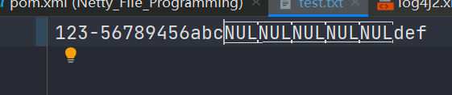

# NIO

## 三大组件

### Channel 和 Buffer

channel 有一点类似于 stream，它就是读写数据的**双向通道**，可以从 channel 将数据读入 buffer，也可以将 buffer 的数据写入 channel，而之前的 stream 要么是输入，要么是输出，channel 比 stream 更为底层


常见的 Channel 有

* FileChannel
* DatagramChannel
* SocketChannel
* ServerSocketChannel


buffer 则用来缓冲读写数据，常见的 buffer 有

* ByteBuffer
  * MappedByteBuffer
  * DirectByteBuffer
  * HeapByteBuffer
* ShortBuffer
* IntBuffer
* LongBuffer
* FloatBuffer
* DoubleBuffer
* CharBuffer


### Selector

选择器

selector 的作用就是配合一个线程来管理多个 channel，获取这些 channel 上发生的事件，这些 channel 工作在非阻塞模式下，不会让线程吊死在一个 channel 上。适合连接数特别多，但流量低的场景（low traffic）


调用 selector 的 select() 会阻塞直到 channel 发生了读写就绪事件，这些事件发生，select 方法就会返回这些事件交给 thread 来处理


## ByteBuffer

### 使用流程

1. 向 buffer 写入数据，例如调用 channel.read(buffer)
2. 调用 flip() 切换至**读模式**
3. 从 buffer 读取数据，例如调用 buffer.get()
4. 调用 clear() 或 compact() 切换至**写模式**
5. 重复 1~4 步骤


Buffer 是**非线程安全的**


### 入门

有一普通文本文件 data.txt，内容为

```sh
1234567890abcdef12345678

```


现在需要从文件里读取数据，要求：使用 FileChannel 来读取文件内容


```java
package mao.t1;

import org.slf4j.Logger;
import org.slf4j.LoggerFactory;

import java.io.RandomAccessFile;
import java.nio.ByteBuffer;
import java.nio.channels.FileChannel;

/**
 * Project name(项目名称)：Netty_ByteBuffer
 * Package(包名): mao.t1
 * Class(类名): FileChannelTest
 * Author(作者）: mao
 * Author QQ：1296193245
 * GitHub：https://github.com/maomao124/
 * Date(创建日期)： 2023/3/5
 * Time(创建时间)： 21:08
 * Version(版本): 1.0
 * Description(描述)： ByteBuffer入门，ByteBuffer一次读10个
 */

public class FileChannelTest
{
    /**
     * 日志
     */
    private static final Logger log = LoggerFactory.getLogger(FileChannelTest.class);

    /**
     * main方法
     *
     * @param args 参数
     */
    public static void main(String[] args)
    {
        //RandomAccessFile对象
        try (RandomAccessFile randomAccessFile = new RandomAccessFile("data.txt", "rw"))
        {
            //得到FileChannel
            FileChannel fileChannel = randomAccessFile.getChannel();
            //ByteBuffer，大小为10
            ByteBuffer byteBuffer = ByteBuffer.allocate(10);
            do
            {
                //写入，并记录长度
                int len = fileChannel.read(byteBuffer);
                log.debug("读到字节数：{}", len);
                //如果长度为-1，就是后面没有了
                if (len == -1)
                {
                    break;
                }
                //切换到读模式，开始打印
                byteBuffer.flip();
                //判断后面是否还有，如果有，打印
                while (byteBuffer.hasRemaining())
                {
                    log.debug("{}", (char) byteBuffer.get());
                }
                //ByteBuffer读到最后面了
                //切换到写模式
                byteBuffer.clear();
            }
            while (true);
        }
        catch (Exception e)
        {
            e.printStackTrace();
        }
    }
}

```


运行结果：

```sh
2023-03-05  21:28:08.337  [main] DEBUG mao.t1.FileChannelTest:  读到字节数：10
2023-03-05  21:28:08.338  [main] DEBUG mao.t1.FileChannelTest:  1
2023-03-05  21:28:08.338  [main] DEBUG mao.t1.FileChannelTest:  2
2023-03-05  21:28:08.338  [main] DEBUG mao.t1.FileChannelTest:  3
2023-03-05  21:28:08.338  [main] DEBUG mao.t1.FileChannelTest:  4
2023-03-05  21:28:08.338  [main] DEBUG mao.t1.FileChannelTest:  5
2023-03-05  21:28:08.338  [main] DEBUG mao.t1.FileChannelTest:  6
2023-03-05  21:28:08.339  [main] DEBUG mao.t1.FileChannelTest:  7
2023-03-05  21:28:08.339  [main] DEBUG mao.t1.FileChannelTest:  8
2023-03-05  21:28:08.339  [main] DEBUG mao.t1.FileChannelTest:  9
2023-03-05  21:28:08.339  [main] DEBUG mao.t1.FileChannelTest:  0
2023-03-05  21:28:08.339  [main] DEBUG mao.t1.FileChannelTest:  读到字节数：10
2023-03-05  21:28:08.339  [main] DEBUG mao.t1.FileChannelTest:  a
2023-03-05  21:28:08.339  [main] DEBUG mao.t1.FileChannelTest:  b
2023-03-05  21:28:08.339  [main] DEBUG mao.t1.FileChannelTest:  c
2023-03-05  21:28:08.339  [main] DEBUG mao.t1.FileChannelTest:  d
2023-03-05  21:28:08.339  [main] DEBUG mao.t1.FileChannelTest:  e
2023-03-05  21:28:08.339  [main] DEBUG mao.t1.FileChannelTest:  f
2023-03-05  21:28:08.339  [main] DEBUG mao.t1.FileChannelTest:  1
2023-03-05  21:28:08.339  [main] DEBUG mao.t1.FileChannelTest:  2
2023-03-05  21:28:08.339  [main] DEBUG mao.t1.FileChannelTest:  3
2023-03-05  21:28:08.339  [main] DEBUG mao.t1.FileChannelTest:  4
2023-03-05  21:28:08.340  [main] DEBUG mao.t1.FileChannelTest:  读到字节数：6
2023-03-05  21:28:08.340  [main] DEBUG mao.t1.FileChannelTest:  5
2023-03-05  21:28:08.340  [main] DEBUG mao.t1.FileChannelTest:  6
2023-03-05  21:28:08.340  [main] DEBUG mao.t1.FileChannelTest:  7
2023-03-05  21:28:08.340  [main] DEBUG mao.t1.FileChannelTest:  8
2023-03-05  21:28:08.340  [main] DEBUG mao.t1.FileChannelTest:  
2023-03-05  21:28:08.340  [main] DEBUG mao.t1.FileChannelTest:  

2023-03-05  21:28:08.340  [main] DEBUG mao.t1.FileChannelTest:  读到字节数：-1
```


### ByteBuffer 结构

ByteBuffer 有以下重要属性

* capacity
* position
* limit


一开始


写模式下，position 是写入位置，limit 等于容量

写入4字节后


flip 动作发生后，position 切换为读取位置，limit 切换为读取限制


读取 4 个字节后，状态


clear 动作发生后，状态


compact 方法，是把未读完的部分向前压缩，然后切换至写模式


### 工具类

需要两个依赖

```xml
<dependency>
    <groupId>io.netty</groupId>
    <artifactId>netty-all</artifactId>
    <version>4.1.39.Final</version>
</dependency>

<dependency>
    <groupId>com.google.guava</groupId>
    <artifactId>guava</artifactId>
    <version>20.0</version>
</dependency>
```


```java
package mao.utils;


import io.netty.util.internal.StringUtil;

import java.nio.ByteBuffer;

import static io.netty.util.internal.MathUtil.isOutOfBounds;
import static io.netty.util.internal.StringUtil.NEWLINE;

/**
 * Project name(项目名称)：Netty_ByteBuffer
 * Package(包名): mao.utils
 * Class(类名): ByteBufferUtil
 * Author(作者）: mao
 * Author QQ：1296193245
 * GitHub：https://github.com/maomao124/
 * Date(创建日期)： 2023/3/5
 * Time(创建时间)： 21:34
 * Version(版本): 1.0
 * Description(描述)： 工具类
 */

public class ByteBufferUtil
{
    private static final char[] BYTE2CHAR = new char[256];
    private static final char[] HEXDUMP_TABLE = new char[256 * 4];
    private static final String[] HEXPADDING = new String[16];
    private static final String[] HEXDUMP_ROWPREFIXES = new String[65536 >>> 4];
    private static final String[] BYTE2HEX = new String[256];
    private static final String[] BYTEPADDING = new String[16];

    static
    {
        final char[] DIGITS = "0123456789abcdef".toCharArray();
        for (int i = 0; i < 256; i++)
        {
            HEXDUMP_TABLE[i << 1] = DIGITS[i >>> 4 & 0x0F];
            HEXDUMP_TABLE[(i << 1) + 1] = DIGITS[i & 0x0F];
        }

        int i;

        // Generate the lookup table for hex dump paddings
        for (i = 0; i < HEXPADDING.length; i++)
        {
            int padding = HEXPADDING.length - i;
            StringBuilder buf = new StringBuilder(padding * 3);
            for (int j = 0; j < padding; j++)
            {
                buf.append("   ");
            }
            HEXPADDING[i] = buf.toString();
        }

        // Generate the lookup table for the start-offset header in each row (up to 64KiB).
        for (i = 0; i < HEXDUMP_ROWPREFIXES.length; i++)
        {
            StringBuilder buf = new StringBuilder(12);
            buf.append(NEWLINE);
            buf.append(Long.toHexString(i << 4 & 0xFFFFFFFFL | 0x100000000L));
            buf.setCharAt(buf.length() - 9, '|');
            buf.append('|');
            HEXDUMP_ROWPREFIXES[i] = buf.toString();
        }

        // Generate the lookup table for byte-to-hex-dump conversion
        for (i = 0; i < BYTE2HEX.length; i++)
        {
            BYTE2HEX[i] = ' ' + StringUtil.byteToHexStringPadded(i);
        }

        // Generate the lookup table for byte dump paddings
        for (i = 0; i < BYTEPADDING.length; i++)
        {
            int padding = BYTEPADDING.length - i;
            StringBuilder buf = new StringBuilder(padding);
            for (int j = 0; j < padding; j++)
            {
                buf.append(' ');
            }
            BYTEPADDING[i] = buf.toString();
        }

        // Generate the lookup table for byte-to-char conversion
        for (i = 0; i < BYTE2CHAR.length; i++)
        {
            if (i <= 0x1f || i >= 0x7f)
            {
                BYTE2CHAR[i] = '.';
            }
            else
            {
                BYTE2CHAR[i] = (char) i;
            }
        }
    }

    /**
     * 打印所有内容
     *
     * @param buffer 缓冲
     */
    public static void debugAll(ByteBuffer buffer)
    {
        int oldlimit = buffer.limit();
        buffer.limit(buffer.capacity());
        StringBuilder origin = new StringBuilder(256);
        appendPrettyHexDump(origin, buffer, 0, buffer.capacity());
        System.out.println("+--------+-------------------- all ------------------------+----------------+");
        System.out.printf("position: [%d], limit: [%d]\n", buffer.position(), oldlimit);
        System.out.println(origin);
        buffer.limit(oldlimit);
    }

    /**
     * 打印可读取内容
     *
     * @param buffer 缓冲
     */
    public static void debugRead(ByteBuffer buffer)
    {
        StringBuilder builder = new StringBuilder(256);
        appendPrettyHexDump(builder, buffer, buffer.position(), buffer.limit() - buffer.position());
        System.out.println("+--------+-------------------- read -----------------------+----------------+");
        System.out.printf("position: [%d], limit: [%d]\n", buffer.position(), buffer.limit());
        System.out.println(builder);
    }

    private static void appendPrettyHexDump(StringBuilder dump, ByteBuffer buf, int offset, int length)
    {
        if (isOutOfBounds(offset, length, buf.capacity()))
        {
            throw new IndexOutOfBoundsException(
                    "expected: " + "0 <= offset(" + offset + ") <= offset + length(" + length
                            + ") <= " + "buf.capacity(" + buf.capacity() + ')');
        }
        if (length == 0)
        {
            return;
        }
        dump.append("         +-------------------------------------------------+").append(NEWLINE).append("         |  0  1  2  3  4  5  6  7  8  9  a  b  c  d  e  f |").append(NEWLINE).append("+--------+-------------------------------------------------+----------------+");

        final int startIndex = offset;
        final int fullRows = length >>> 4;
        final int remainder = length & 0xF;

        // Dump the rows which have 16 bytes.
        for (int row = 0; row < fullRows; row++)
        {
            int rowStartIndex = (row << 4) + startIndex;

            // Per-row prefix.
            appendHexDumpRowPrefix(dump, row, rowStartIndex);

            // Hex dump
            int rowEndIndex = rowStartIndex + 16;
            for (int j = rowStartIndex; j < rowEndIndex; j++)
            {
                dump.append(BYTE2HEX[getUnsignedByte(buf, j)]);
            }
            dump.append(" |");

            // ASCII dump
            for (int j = rowStartIndex; j < rowEndIndex; j++)
            {
                dump.append(BYTE2CHAR[getUnsignedByte(buf, j)]);
            }
            dump.append('|');
        }

        // Dump the last row which has less than 16 bytes.
        if (remainder != 0)
        {
            int rowStartIndex = (fullRows << 4) + startIndex;
            appendHexDumpRowPrefix(dump, fullRows, rowStartIndex);

            // Hex dump
            int rowEndIndex = rowStartIndex + remainder;
            for (int j = rowStartIndex; j < rowEndIndex; j++)
            {
                dump.append(BYTE2HEX[getUnsignedByte(buf, j)]);
            }
            dump.append(HEXPADDING[remainder]);
            dump.append(" |");

            // Ascii dump
            for (int j = rowStartIndex; j < rowEndIndex; j++)
            {
                dump.append(BYTE2CHAR[getUnsignedByte(buf, j)]);
            }
            dump.append(BYTEPADDING[remainder]);
            dump.append('|');
        }

        dump.append(NEWLINE +
                "+--------+-------------------------------------------------+----------------+");
    }

    /**
     * 将十六进制转储行前缀
     *
     * @param dump          转储
     * @param row           行
     * @param rowStartIndex 行开始指数
     */
    private static void appendHexDumpRowPrefix(StringBuilder dump, int row, int rowStartIndex)
    {
        if (row < HEXDUMP_ROWPREFIXES.length)
        {
            dump.append(HEXDUMP_ROWPREFIXES[row]);
        }
        else
        {
            dump.append(NEWLINE);
            dump.append(Long.toHexString(rowStartIndex & 0xFFFFFFFFL | 0x100000000L));
            dump.setCharAt(dump.length() - 9, '|');
            dump.append('|');
        }
    }

    /**
     * 得到无符号字节
     *
     * @param buffer 缓冲
     * @param index  指数
     * @return short
     */
    public static short getUnsignedByte(ByteBuffer buffer, int index)
    {
        return (short) (buffer.get(index) & 0xFF);
    }
}
```


### ByteBuffer常见方法

#### 分配空间

可以使用 allocate 方法为 ByteBuffer 分配空间，其它 buffer 类也有该方法

```java
//ByteBuffer分配空间，大小为10
ByteBuffer byteBuffer = ByteBuffer.allocate(10);
```


#### 向ByteBuffer写入数据

有两种办法

* 调用 channel 的 read 方法
* 调用 buffer 自己的 put 方法


```java
package mao.t2;

import mao.utils.ByteBufferUtil;
import org.slf4j.Logger;
import org.slf4j.LoggerFactory;

import java.nio.ByteBuffer;

/**
 * Project name(项目名称)：Netty_ByteBuffer
 * Package(包名): mao.t2
 * Class(类名): ByteBufferPutTest
 * Author(作者）: mao
 * Author QQ：1296193245
 * GitHub：https://github.com/maomao124/
 * Date(创建日期)： 2023/3/5
 * Time(创建时间)： 21:50
 * Version(版本): 1.0
 * Description(描述)： 无
 */

public class ByteBufferPutTest
{
    private static final Logger log = LoggerFactory.getLogger(ByteBufferPutTest.class);

    public static void main(String[] args)
    {
        ByteBuffer byteBuffer = ByteBuffer.allocate(10);
        //调用put方法
        byteBuffer.put(new byte[]{'1', '2', '3', '4'});
        //打印
        ByteBufferUtil.debugAll(byteBuffer);

        //调用put方法
        byteBuffer.put(new byte[]{'5', '6'});
        //打印
        ByteBufferUtil.debugAll(byteBuffer);
    }
}

```


运行结果：

```sh
+--------+-------------------- all ------------------------+----------------+
position: [4], limit: [10]
         +-------------------------------------------------+
         |  0  1  2  3  4  5  6  7  8  9  a  b  c  d  e  f |
+--------+-------------------------------------------------+----------------+
|00000000| 31 32 33 34 00 00 00 00 00 00                   |1234......      |
+--------+-------------------------------------------------+----------------+
+--------+-------------------- all ------------------------+----------------+
position: [6], limit: [10]
         +-------------------------------------------------+
         |  0  1  2  3  4  5  6  7  8  9  a  b  c  d  e  f |
+--------+-------------------------------------------------+----------------+
|00000000| 31 32 33 34 35 36 00 00 00 00                   |123456....      |
+--------+-------------------------------------------------+----------------+
```


#### 从ByteBuffer读取数据

同样有两种办法

* 调用 channel 的 write 方法
* 调用 buffer 自己的 get 方法


```java
int writeBytes = channel.write(byteBuffer);
```

或者

```java
byte b = byteBuffer.get();
```


get 方法会让 position 读指针向后走，如果想重复读取数据

* 可以调用 rewind 方法将 position 重新置为 0
* 或者调用 get(int i) 方法获取索引 i 的内容，它不会移动读指针


```java
package mao.t2;

import mao.utils.ByteBufferUtil;
import org.slf4j.Logger;
import org.slf4j.LoggerFactory;

import java.nio.ByteBuffer;

/**
 * Project name(项目名称)：Netty_ByteBuffer
 * Package(包名): mao.t2
 * Class(类名): ByteBufferGetTest
 * Author(作者）: mao
 * Author QQ：1296193245
 * GitHub：https://github.com/maomao124/
 * Date(创建日期)： 2023/3/5
 * Time(创建时间)： 21:59
 * Version(版本): 1.0
 * Description(描述)： 无
 */

public class ByteBufferGetTest
{
    private static final Logger log = LoggerFactory.getLogger(ByteBufferPutTest.class);

    public static void main(String[] args)
    {
        ByteBuffer byteBuffer = ByteBuffer.allocate(10);
        //调用put方法
        byteBuffer.put(new byte[]{'1', '2', '3', '4'});

        //调用put方法
        byteBuffer.put(new byte[]{'5', '6'});

        //打印
        ByteBufferUtil.debugAll(byteBuffer);

        //按索引位置读取
        byte b = byteBuffer.get(2);
        System.out.println((char) b);
        //打印
        ByteBufferUtil.debugAll(byteBuffer);
        //按索引位置读取
        b = byteBuffer.get(4);
        System.out.println((char) b);
        //打印
        ByteBufferUtil.debugAll(byteBuffer);

        //调用get方法读取
        b = byteBuffer.get();
        System.out.println((char) b);
        //打印
        ByteBufferUtil.debugAll(byteBuffer);

        //调用get方法读取
        b = byteBuffer.get();
        System.out.println((char) b);
        //打印
        ByteBufferUtil.debugAll(byteBuffer);

        //调用rewind方法，将 position 重新置为 0
        byteBuffer.rewind();
        //打印
        ByteBufferUtil.debugAll(byteBuffer);

        //调用get方法读取
        b = byteBuffer.get();
        System.out.println((char) b);
        //打印
        ByteBufferUtil.debugAll(byteBuffer);
    }
}
```


运行结果：

```sh
+--------+-------------------- all ------------------------+----------------+
position: [6], limit: [10]
         +-------------------------------------------------+
         |  0  1  2  3  4  5  6  7  8  9  a  b  c  d  e  f |
+--------+-------------------------------------------------+----------------+
|00000000| 31 32 33 34 35 36 00 00 00 00                   |123456....      |
+--------+-------------------------------------------------+----------------+
3
+--------+-------------------- all ------------------------+----------------+
position: [6], limit: [10]
         +-------------------------------------------------+
         |  0  1  2  3  4  5  6  7  8  9  a  b  c  d  e  f |
+--------+-------------------------------------------------+----------------+
|00000000| 31 32 33 34 35 36 00 00 00 00                   |123456....      |
+--------+-------------------------------------------------+----------------+
5
+--------+-------------------- all ------------------------+----------------+
position: [6], limit: [10]
         +-------------------------------------------------+
         |  0  1  2  3  4  5  6  7  8  9  a  b  c  d  e  f |
+--------+-------------------------------------------------+----------------+
|00000000| 31 32 33 34 35 36 00 00 00 00                   |123456....      |
+--------+-------------------------------------------------+----------------+
 
+--------+-------------------- all ------------------------+----------------+
position: [7], limit: [10]
         +-------------------------------------------------+
         |  0  1  2  3  4  5  6  7  8  9  a  b  c  d  e  f |
+--------+-------------------------------------------------+----------------+
|00000000| 31 32 33 34 35 36 00 00 00 00                   |123456....      |
+--------+-------------------------------------------------+----------------+
 
+--------+-------------------- all ------------------------+----------------+
position: [8], limit: [10]
         +-------------------------------------------------+
         |  0  1  2  3  4  5  6  7  8  9  a  b  c  d  e  f |
+--------+-------------------------------------------------+----------------+
|00000000| 31 32 33 34 35 36 00 00 00 00                   |123456....      |
+--------+-------------------------------------------------+----------------+
+--------+-------------------- all ------------------------+----------------+
position: [0], limit: [10]
         +-------------------------------------------------+
         |  0  1  2  3  4  5  6  7  8  9  a  b  c  d  e  f |
+--------+-------------------------------------------------+----------------+
|00000000| 31 32 33 34 35 36 00 00 00 00                   |123456....      |
+--------+-------------------------------------------------+----------------+
1
+--------+-------------------- all ------------------------+----------------+
position: [1], limit: [10]
         +-------------------------------------------------+
         |  0  1  2  3  4  5  6  7  8  9  a  b  c  d  e  f |
+--------+-------------------------------------------------+----------------+
|00000000| 31 32 33 34 35 36 00 00 00 00                   |123456....      |
+--------+-------------------------------------------------+----------------+
```


#### mark 和 reset

mark 是在读取时，做一个标记，即使 position 改变，只要调用 reset 就能回到 mark 的位置


```java
package mao.t2;

import mao.utils.ByteBufferUtil;
import org.slf4j.Logger;
import org.slf4j.LoggerFactory;

import java.nio.ByteBuffer;

/**
 * Project name(项目名称)：Netty_ByteBuffer
 * Package(包名): mao.t2
 * Class(类名): ByteBufferMarkAndResetTest
 * Author(作者）: mao
 * Author QQ：1296193245
 * GitHub：https://github.com/maomao124/
 * Date(创建日期)： 2023/3/5
 * Time(创建时间)： 22:04
 * Version(版本): 1.0
 * Description(描述)： mark 和 reset
 */

public class ByteBufferMarkAndResetTest
{
    private static final Logger log = LoggerFactory.getLogger(ByteBufferPutTest.class);

    public static void main(String[] args)
    {
        ByteBuffer byteBuffer = ByteBuffer.allocate(10);
        //调用put方法
        byteBuffer.put(new byte[]{'1', '2', '3', '4'});
        //调用put方法
        byteBuffer.put(new byte[]{'5', '6'});

        //打印
        ByteBufferUtil.debugAll(byteBuffer);

        //调用mark方法
        byteBuffer.mark();

        //调用两次get方法
        byteBuffer.get();
        byteBuffer.get();

        //打印
        ByteBufferUtil.debugAll(byteBuffer);

        //调用reset方法
        byteBuffer.reset();

        //打印
        ByteBufferUtil.debugAll(byteBuffer);

    }
}
```


运行结果：

```sh
+--------+-------------------- all ------------------------+----------------+
position: [6], limit: [10]
         +-------------------------------------------------+
         |  0  1  2  3  4  5  6  7  8  9  a  b  c  d  e  f |
+--------+-------------------------------------------------+----------------+
|00000000| 31 32 33 34 35 36 00 00 00 00                   |123456....      |
+--------+-------------------------------------------------+----------------+
+--------+-------------------- all ------------------------+----------------+
position: [8], limit: [10]
         +-------------------------------------------------+
         |  0  1  2  3  4  5  6  7  8  9  a  b  c  d  e  f |
+--------+-------------------------------------------------+----------------+
|00000000| 31 32 33 34 35 36 00 00 00 00                   |123456....      |
+--------+-------------------------------------------------+----------------+
+--------+-------------------- all ------------------------+----------------+
position: [6], limit: [10]
         +-------------------------------------------------+
         |  0  1  2  3  4  5  6  7  8  9  a  b  c  d  e  f |
+--------+-------------------------------------------------+----------------+
|00000000| 31 32 33 34 35 36 00 00 00 00                   |123456....      |
+--------+-------------------------------------------------+----------------+
```


**rewind 和 flip 都会清除 mark 位置**


#### 字符串与ByteBuffer互转

```java
package mao.t2;

import mao.utils.ByteBufferUtil;

import java.nio.ByteBuffer;
import java.nio.charset.Charset;
import java.nio.charset.StandardCharsets;

/**
 * Project name(项目名称)：Netty_ByteBuffer
 * Package(包名): mao.t2
 * Class(类名): StringToByteBufferTest
 * Author(作者）: mao
 * Author QQ：1296193245
 * GitHub：https://github.com/maomao124/
 * Date(创建日期)： 2023/3/5
 * Time(创建时间)： 22:13
 * Version(版本): 1.0
 * Description(描述)： 字符串转ByteBuffer
 */

public class StringToByteBufferTest
{
    public static void main(String[] args)
    {
        String s = "hello\0你好";

        //第1种
        ByteBuffer byteBuffer1 = StandardCharsets.UTF_8.encode(s);
        //第2种
        ByteBuffer byteBuffer2 = Charset.forName("utf-8").encode(s);

        ByteBufferUtil.debugAll(byteBuffer1);
        ByteBufferUtil.debugAll(byteBuffer2);
    }
}
```


运行结果：

```sh
+--------+-------------------- all ------------------------+----------------+
position: [0], limit: [12]
         +-------------------------------------------------+
         |  0  1  2  3  4  5  6  7  8  9  a  b  c  d  e  f |
+--------+-------------------------------------------------+----------------+
|00000000| 68 65 6c 6c 6f 00 e4 bd a0 e5 a5 bd 00 00 00 00 |hello...........|
|00000010| 00                                              |.               |
+--------+-------------------------------------------------+----------------+
+--------+-------------------- all ------------------------+----------------+
position: [0], limit: [12]
         +-------------------------------------------------+
         |  0  1  2  3  4  5  6  7  8  9  a  b  c  d  e  f |
+--------+-------------------------------------------------+----------------+
|00000000| 68 65 6c 6c 6f 00 e4 bd a0 e5 a5 bd 00 00 00 00 |hello...........|
|00000010| 00                                              |.               |
+--------+-------------------------------------------------+----------------+
```


**ByteBuffer转String**

```java
package mao.t2;

import mao.utils.ByteBufferUtil;
import org.slf4j.Logger;
import org.slf4j.LoggerFactory;

import java.nio.ByteBuffer;
import java.nio.CharBuffer;
import java.nio.charset.Charset;
import java.nio.charset.StandardCharsets;

/**
 * Project name(项目名称)：Netty_ByteBuffer
 * Package(包名): mao.t2
 * Class(类名): ByteBufferToStringTest
 * Author(作者）: mao
 * Author QQ：1296193245
 * GitHub：https://github.com/maomao124/
 * Date(创建日期)： 2023/3/5
 * Time(创建时间)： 22:22
 * Version(版本): 1.0
 * Description(描述)： ByteBuffer转String
 */

public class ByteBufferToStringTest
{
    private static final Logger log = LoggerFactory.getLogger(ByteBufferToStringTest.class);

    public static void main(String[] args)
    {
        String s = "1234 hello 你好";

        //第1种
        ByteBuffer byteBuffer1 = StandardCharsets.UTF_8.encode(s);
        //第2种
        ByteBuffer byteBuffer2 = Charset.forName("utf-8").encode(s);

        ByteBufferUtil.debugAll(byteBuffer1);
        ByteBufferUtil.debugAll(byteBuffer2);

        CharBuffer charBuffer1 = StandardCharsets.UTF_8.decode(byteBuffer1);
        CharBuffer charBuffer2 = StandardCharsets.UTF_8.decode(byteBuffer2);

        String s1 = charBuffer1.toString();
        String s2 = charBuffer2.toString();

        log.info(s1);
        log.info(s2);
    }
}
```


运行结果：

```sh
+--------+-------------------- all ------------------------+----------------+
position: [0], limit: [17]
         +-------------------------------------------------+
         |  0  1  2  3  4  5  6  7  8  9  a  b  c  d  e  f |
+--------+-------------------------------------------------+----------------+
|00000000| 31 32 33 34 20 68 65 6c 6c 6f 20 e4 bd a0 e5 a5 |1234 hello .....|
|00000010| bd 00 00 00 00 00 00 00 00 00 00 00 00          |.............   |
+--------+-------------------------------------------------+----------------+
+--------+-------------------- all ------------------------+----------------+
position: [0], limit: [17]
         +-------------------------------------------------+
         |  0  1  2  3  4  5  6  7  8  9  a  b  c  d  e  f |
+--------+-------------------------------------------------+----------------+
|00000000| 31 32 33 34 20 68 65 6c 6c 6f 20 e4 bd a0 e5 a5 |1234 hello .....|
|00000010| bd 00 00 00 00 00 00 00 00 00 00 00 00          |.............   |
+--------+-------------------------------------------------+----------------+
2023-03-05  22:26:02.809  [main] INFO  mao.t2.ByteBufferToStringTest:  1234 hello 你好
2023-03-05  22:26:02.810  [main] INFO  mao.t2.ByteBufferToStringTest:  1234 hello 你好
```


### Scattering Reads

现在有以下文件data2.txt，文件内容为：

```sh
onetwothreefour
```


现在要将这4个单词读按顺序读到4个ByteBuffer里，已知每个单词的长度


```java
package mao.t3;

import mao.utils.ByteBufferUtil;

import java.io.RandomAccessFile;
import java.nio.ByteBuffer;
import java.nio.channels.FileChannel;

/**
 * Project name(项目名称)：Netty_ByteBuffer
 * Package(包名): mao.t3
 * Class(类名): ScatteringReadsTest
 * Author(作者）: mao
 * Author QQ：1296193245
 * GitHub：https://github.com/maomao124/
 * Date(创建日期)： 2023/3/5
 * Time(创建时间)： 22:39
 * Version(版本): 1.0
 * Description(描述)： Scattering Reads
 */

public class ScatteringReadsTest
{
    public static void main(String[] args)
    {
        try (RandomAccessFile randomAccessFile = new RandomAccessFile("data2.txt", "rw"))
        {
            FileChannel fileChannel = randomAccessFile.getChannel();

            //构建4个ByteBuffer
            ByteBuffer byteBuffer1 = ByteBuffer.allocate(3);
            ByteBuffer byteBuffer2 = ByteBuffer.allocate(3);
            ByteBuffer byteBuffer3 = ByteBuffer.allocate(5);
            ByteBuffer byteBuffer4 = ByteBuffer.allocate(4);

            //ByteBuffer数组
            ByteBuffer[] byteBuffers = new ByteBuffer[]{byteBuffer1, byteBuffer2, byteBuffer3, byteBuffer4};

            //读取，并写入到4个ByteBuffer中
            fileChannel.read(byteBuffers);

            //打印
            ByteBufferUtil.debugAll(byteBuffer1);
            ByteBufferUtil.debugAll(byteBuffer2);
            ByteBufferUtil.debugAll(byteBuffer3);
            ByteBufferUtil.debugAll(byteBuffer4);

        }
        catch (Exception e)
        {
            e.printStackTrace();
        }
    }
}
```


运行结果：

```sh
+--------+-------------------- all ------------------------+----------------+
position: [3], limit: [3]
         +-------------------------------------------------+
         |  0  1  2  3  4  5  6  7  8  9  a  b  c  d  e  f |
+--------+-------------------------------------------------+----------------+
|00000000| 6f 6e 65                                        |one             |
+--------+-------------------------------------------------+----------------+
+--------+-------------------- all ------------------------+----------------+
position: [3], limit: [3]
         +-------------------------------------------------+
         |  0  1  2  3  4  5  6  7  8  9  a  b  c  d  e  f |
+--------+-------------------------------------------------+----------------+
|00000000| 74 77 6f                                        |two             |
+--------+-------------------------------------------------+----------------+
+--------+-------------------- all ------------------------+----------------+
position: [5], limit: [5]
         +-------------------------------------------------+
         |  0  1  2  3  4  5  6  7  8  9  a  b  c  d  e  f |
+--------+-------------------------------------------------+----------------+
|00000000| 74 68 72 65 65                                  |three           |
+--------+-------------------------------------------------+----------------+
+--------+-------------------- all ------------------------+----------------+
position: [4], limit: [4]
         +-------------------------------------------------+
         |  0  1  2  3  4  5  6  7  8  9  a  b  c  d  e  f |
+--------+-------------------------------------------------+----------------+
|00000000| 66 6f 75 72                                     |four            |
+--------+-------------------------------------------------+----------------+
```


### Gathering Writes

需求：将多个 ByteBuffer 的数据填充至 channel


```java
package mao.t3;

import mao.utils.ByteBufferUtil;

import java.io.RandomAccessFile;
import java.nio.ByteBuffer;
import java.nio.channels.FileChannel;
import java.nio.charset.StandardCharsets;

/**
 * Project name(项目名称)：Netty_ByteBuffer
 * Package(包名): mao.t3
 * Class(类名): GatheringWritesTest
 * Author(作者）: mao
 * Author QQ：1296193245
 * GitHub：https://github.com/maomao124/
 * Date(创建日期)： 2023/3/5
 * Time(创建时间)： 22:47
 * Version(版本): 1.0
 * Description(描述)： Gathering Writes
 */

public class GatheringWritesTest
{
    public static void main(String[] args)
    {
        try (RandomAccessFile randomAccessFile = new RandomAccessFile("data4.txt", "rw"))
        {
            FileChannel fileChannel = randomAccessFile.getChannel();

            ByteBuffer byteBuffer1 = ByteBuffer.allocate(4);
            ByteBuffer byteBuffer2 = ByteBuffer.allocate(3);

            byteBuffer1.put("five".getBytes(StandardCharsets.UTF_8));
            byteBuffer2.put("six".getBytes(StandardCharsets.UTF_8));

            ByteBuffer[] byteBuffers = new ByteBuffer[]{byteBuffer1, byteBuffer2};

            ByteBufferUtil.debugAll(byteBuffer1);
            ByteBufferUtil.debugAll(byteBuffer2);

            //切换到读模式
            byteBuffer1.flip();
            byteBuffer2.flip();

            ByteBufferUtil.debugAll(byteBuffer1);
            ByteBufferUtil.debugAll(byteBuffer2);

            //写入
            fileChannel.write(byteBuffers);
        }
        catch (Exception e)
        {
            e.printStackTrace();
        }
    }
}
```


运行结果：

```sh
+--------+-------------------- all ------------------------+----------------+
position: [4], limit: [4]
         +-------------------------------------------------+
         |  0  1  2  3  4  5  6  7  8  9  a  b  c  d  e  f |
+--------+-------------------------------------------------+----------------+
|00000000| 66 69 76 65                                     |five            |
+--------+-------------------------------------------------+----------------+
+--------+-------------------- all ------------------------+----------------+
position: [3], limit: [3]
         +-------------------------------------------------+
         |  0  1  2  3  4  5  6  7  8  9  a  b  c  d  e  f |
+--------+-------------------------------------------------+----------------+
|00000000| 73 69 78                                        |six             |
+--------+-------------------------------------------------+----------------+
+--------+-------------------- all ------------------------+----------------+
position: [0], limit: [4]
         +-------------------------------------------------+
         |  0  1  2  3  4  5  6  7  8  9  a  b  c  d  e  f |
+--------+-------------------------------------------------+----------------+
|00000000| 66 69 76 65                                     |five            |
+--------+-------------------------------------------------+----------------+
+--------+-------------------- all ------------------------+----------------+
position: [0], limit: [3]
         +-------------------------------------------------+
         |  0  1  2  3  4  5  6  7  8  9  a  b  c  d  e  f |
+--------+-------------------------------------------------+----------------+
|00000000| 73 69 78                                        |six             |
+--------+-------------------------------------------------+----------------+
```


文件内容：

```sh
fivesix
```


### 黏包和半包

#### 说明

网络上有多条数据发送给服务端，数据之间使用 \n 进行分隔
但由于某种原因这些数据在接收时，被进行了重新组合，例如原始数据有3条为

* Hello,world\n
* I'm zhangsan\n
* How are you?\n

变成了下面的两个 byteBuffer (黏包，半包)

* Hello,world\nI'm zhangsan\nHo
* w are you?\n


现在要求你编写程序，将错乱的数据恢复成原始的按 \n 分隔的数据


#### 解决

```java
package mao.t4;

import mao.utils.ByteBufferUtil;
import org.slf4j.Logger;
import org.slf4j.LoggerFactory;

import java.nio.ByteBuffer;
import java.nio.charset.StandardCharsets;

/**
 * Project name(项目名称)：Netty_ByteBuffer
 * Package(包名): mao.t4
 * Class(类名): StickyAndHalfPackedTest
 * Author(作者）: mao
 * Author QQ：1296193245
 * GitHub：https://github.com/maomao124/
 * Date(创建日期)： 2023/3/8
 * Time(创建时间)： 21:41
 * Version(版本): 1.0
 * Description(描述)： 黏包和半包
 */

public class StickyAndHalfPackedTest
{

    private static final Logger log = LoggerFactory.getLogger(StickyAndHalfPackedTest.class);

    public static void main(String[] args)
    {
        ByteBuffer byteBuffer = ByteBuffer.allocate(64);
        byteBuffer.put("Hello,world\nI'm zhangsan\nHo".getBytes(StandardCharsets.UTF_8));
        split(byteBuffer);
        byteBuffer.put("w are you?\nhaha!\n".getBytes(StandardCharsets.UTF_8));
        split(byteBuffer);
    }


    /**
     * 分割
     *
     * @param byteBuffer 字节缓冲区
     */
    private static void split(ByteBuffer byteBuffer)
    {
        //切换到读模式
        byteBuffer.flip();
        //得到limit
        int limit = byteBuffer.limit();
        for (int i = 0; i < limit; i++)
        {
            //判断是否遇到了换换行符
            if (byteBuffer.get(i) == '\n')
            {
                //换行符
                log.debug(String.valueOf(i));
                //开辟一个一行长度的ByteBuffer
                ByteBuffer target = ByteBuffer.allocate(i + 1 - byteBuffer.position());
                //设置limit
                byteBuffer.limit(i + 1);
                //从byteBuffer读，向target写
                target.put(byteBuffer);
                //打印
                ByteBufferUtil.debugAll(target);
                byteBuffer.limit(limit);
            }
        }
        //切换到写模式，未读完的部分继续
        byteBuffer.compact();
    }
}
```


运行结果：

```sh
+--------+-------------------- all ------------------------+----------------+
position: [12], limit: [12]
         +-------------------------------------------------+
         |  0  1  2  3  4  5  6  7  8  9  a  b  c  d  e  f |
+--------+-------------------------------------------------+----------------+
|00000000| 48 65 6c 6c 6f 2c 77 6f 72 6c 64 0a             |Hello,world.    |
+--------+-------------------------------------------------+----------------+
2023-03-08  21:58:18.919  [main] DEBUG mao.t4.StickyAndHalfPackedTest:  24
+--------+-------------------- all ------------------------+----------------+
position: [13], limit: [13]
         +-------------------------------------------------+
         |  0  1  2  3  4  5  6  7  8  9  a  b  c  d  e  f |
+--------+-------------------------------------------------+----------------+
|00000000| 49 27 6d 20 7a 68 61 6e 67 73 61 6e 0a          |I'm zhangsan.   |
+--------+-------------------------------------------------+----------------+
2023-03-08  21:58:18.919  [main] DEBUG mao.t4.StickyAndHalfPackedTest:  12
+--------+-------------------- all ------------------------+----------------+
position: [13], limit: [13]
         +-------------------------------------------------+
         |  0  1  2  3  4  5  6  7  8  9  a  b  c  d  e  f |
+--------+-------------------------------------------------+----------------+
|00000000| 48 6f 77 20 61 72 65 20 79 6f 75 3f 0a          |How are you?.   |
+--------+-------------------------------------------------+----------------+
2023-03-08  21:58:18.920  [main] DEBUG mao.t4.StickyAndHalfPackedTest:  18
+--------+-------------------- all ------------------------+----------------+
position: [6], limit: [6]
         +-------------------------------------------------+
         |  0  1  2  3  4  5  6  7  8  9  a  b  c  d  e  f |
+--------+-------------------------------------------------+----------------+
|00000000| 68 61 68 61 21 0a                               |haha!.          |
+--------+-------------------------------------------------+----------------+
```


## 文件编程

### FileChannel

FileChannel 只能工作在阻塞模式下


#### 获取

不能直接打开 FileChannel，必须通过 FileInputStream、FileOutputStream 或者 RandomAccessFile 来获取 FileChannel，它们都有 getChannel 方法

* 通过 FileInputStream 获取的 channel 只能读
* 通过 FileOutputStream 获取的 channel 只能写
* 通过 RandomAccessFile 是否能读写根据构造 RandomAccessFile 时的读写模式决定


```java
package mao.t1;

import mao.utils.ByteBufferUtil;
import org.slf4j.Logger;
import org.slf4j.LoggerFactory;

import java.io.FileInputStream;
import java.io.FileOutputStream;
import java.io.RandomAccessFile;
import java.nio.ByteBuffer;
import java.nio.channels.FileChannel;
import java.nio.charset.StandardCharsets;

/**
 * Project name(项目名称)：Netty_File_Programming
 * Package(包名): mao.t1
 * Class(类名): FileChannelGetTest
 * Author(作者）: mao
 * Author QQ：1296193245
 * GitHub：https://github.com/maomao124/
 * Date(创建日期)： 2023/3/8
 * Time(创建时间)： 22:10
 * Version(版本): 1.0
 * Description(描述)： 得到FileChannel
 */

public class FileChannelGetTest
{
    /**
     * 日志
     */
    private static final Logger log = LoggerFactory.getLogger(FileChannelGetTest.class);

    /**
     * main方法
     *
     * @param args 参数
     */
    public static void main(String[] args)
    {
        //第一种方法，通过 FileInputStream 获取
        try (FileInputStream fileInputStream = new FileInputStream("test.txt"))
        {
            FileChannel fileChannel = fileInputStream.getChannel();
            log.debug(fileChannel.toString());
            //尝试读
            ByteBuffer byteBuffer = ByteBuffer.allocate(10);
            fileChannel.read(byteBuffer);
            byteBuffer.flip();
            byte b = byteBuffer.get(2);
            log.debug(String.valueOf((char) b));
            //打印
            ByteBufferUtil.debugAll(byteBuffer);

            //尝试写
            byteBuffer.clear();
            byteBuffer.put("abc".getBytes(StandardCharsets.UTF_8));
            //打印
            ByteBufferUtil.debugAll(byteBuffer);
            try
            {
                fileChannel.write(byteBuffer);
            }
            catch (Exception e)
            {
                log.error("写入失败：", e);
            }
        }
        catch (Exception e)
        {
            e.printStackTrace();
        }


        //第二种方法，通过 FileOutputStream 获取
        try (FileOutputStream fileOutputStream = new FileOutputStream("test.txt"))
        {
            FileChannel fileChannel = fileOutputStream.getChannel();
            log.debug(fileChannel.toString());
            //尝试读
            ByteBuffer byteBuffer = ByteBuffer.allocate(10);
            try
            {
                fileChannel.read(byteBuffer);
                byteBuffer.flip();
                byte b = byteBuffer.get(2);
                log.debug(String.valueOf((char) b));
                //打印
                ByteBufferUtil.debugAll(byteBuffer);
            }
            catch (Exception e)
            {
                log.error("读失败：", e);
            }

            //尝试写
            byteBuffer.clear();
            byteBuffer.put("abc".getBytes(StandardCharsets.UTF_8));
            //打印
            ByteBufferUtil.debugAll(byteBuffer);
            try
            {
                //切换读模式
                byteBuffer.flip();
                fileChannel.write(byteBuffer);
            }
            catch (Exception e)
            {
                log.error("写入失败：", e);
            }
        }
        catch (Exception e)
        {
            e.printStackTrace();
        }


       //第三种方法，通过 FileInputStream 获取
        try (RandomAccessFile randomAccessFile = new RandomAccessFile("test.txt","rw"))
        {
            FileChannel fileChannel = randomAccessFile.getChannel();
            log.debug(fileChannel.toString());
            //尝试读
            ByteBuffer byteBuffer = ByteBuffer.allocate(10);
            try
            {
                fileChannel.read(byteBuffer);
                byteBuffer.flip();
                byte b = byteBuffer.get(2);
                log.debug(String.valueOf((char) b));
                //打印
                ByteBufferUtil.debugAll(byteBuffer);
            }
            catch (Exception e)
            {
                log.error("读失败：", e);
            }

            //尝试写
            byteBuffer.clear();
            byteBuffer.put("abcdefg".getBytes(StandardCharsets.UTF_8));
            //打印
            ByteBufferUtil.debugAll(byteBuffer);
            try
            {
                //切换读模式
                byteBuffer.flip();
                fileChannel.write(byteBuffer);
            }
            catch (Exception e)
            {
                log.error("写入失败：", e);
            }
        }
        catch (Exception e)
        {
            e.printStackTrace();
        }
    }
}
```


运行结果：

```sh
2023-03-08  22:36:45.992  [main] DEBUG mao.t1.FileChannelGetTest:  sun.nio.ch.FileChannelImpl@22ef9844
2023-03-08  22:36:45.993  [main] DEBUG mao.t1.FileChannelGetTest:  3
2023-03-08  22:36:45.995  [main] DEBUG io.netty.util.internal.logging.InternalLoggerFactory:  Using SLF4J as the default logging framework
+--------+-------------------- all ------------------------+----------------+
position: [0], limit: [8]
         +-------------------------------------------------+
         |  0  1  2  3  4  5  6  7  8  9  a  b  c  d  e  f |
+--------+-------------------------------------------------+----------------+
|00000000| 31 32 33 34 35 36 0d 0a 00 00                   |123456....      |
+--------+-------------------------------------------------+----------------+
+--------+-------------------- all ------------------------+----------------+
position: [3], limit: [10]
         +-------------------------------------------------+
         |  0  1  2  3  4  5  6  7  8  9  a  b  c  d  e  f |
+--------+-------------------------------------------------+----------------+
|00000000| 61 62 63 34 35 36 0d 0a 00 00                   |abc456....      |
+--------+-------------------------------------------------+----------------+
2023-03-08  22:36:45.999  [main] ERROR mao.t1.FileChannelGetTest:  写入失败：
java.nio.channels.NonWritableChannelException: null
	at sun.nio.ch.FileChannelImpl.write(FileChannelImpl.java:273) ~[?:?]
	at mao.t1.FileChannelGetTest.main(FileChannelGetTest.java:62) [classes/:?]
2023-03-08  22:36:46.007  [main] DEBUG mao.t1.FileChannelGetTest:  sun.nio.ch.FileChannelImpl@73e9cf30
2023-03-08  22:36:46.007  [main] ERROR mao.t1.FileChannelGetTest:  读失败：
java.nio.channels.NonReadableChannelException: null
	at sun.nio.ch.FileChannelImpl.read(FileChannelImpl.java:217) ~[?:?]
	at mao.t1.FileChannelGetTest.main(FileChannelGetTest.java:86) [classes/:?]
+--------+-------------------- all ------------------------+----------------+
position: [3], limit: [10]
         +-------------------------------------------------+
         |  0  1  2  3  4  5  6  7  8  9  a  b  c  d  e  f |
+--------+-------------------------------------------------+----------------+
|00000000| 61 62 63 00 00 00 00 00 00 00                   |abc.......      |
+--------+-------------------------------------------------+----------------+
2023-03-08  22:36:46.007  [main] DEBUG mao.t1.FileChannelGetTest:  sun.nio.ch.FileChannelImpl@242b836
2023-03-08  22:36:46.008  [main] DEBUG mao.t1.FileChannelGetTest:  c
+--------+-------------------- all ------------------------+----------------+
position: [0], limit: [3]
         +-------------------------------------------------+
         |  0  1  2  3  4  5  6  7  8  9  a  b  c  d  e  f |
+--------+-------------------------------------------------+----------------+
|00000000| 61 62 63 00 00 00 00 00 00 00                   |abc.......      |
+--------+-------------------------------------------------+----------------+
+--------+-------------------- all ------------------------+----------------+
position: [7], limit: [10]
         +-------------------------------------------------+
         |  0  1  2  3  4  5  6  7  8  9  a  b  c  d  e  f |
+--------+-------------------------------------------------+----------------+
|00000000| 61 62 63 64 65 66 67 00 00 00                   |abcdefg...      |
+--------+-------------------------------------------------+----------------+
```


#### 读取

会从 channel 读取数据填充 ByteBuffer，返回值表示读到了多少字节，-1 表示到达了文件的末尾


```java
package mao.t1;

import mao.utils.ByteBufferUtil;
import org.slf4j.Logger;
import org.slf4j.LoggerFactory;

import java.io.RandomAccessFile;
import java.nio.ByteBuffer;
import java.nio.channels.FileChannel;

/**
 * Project name(项目名称)：Netty_File_Programming
 * Package(包名): mao.t1
 * Class(类名): FileChannelReadTest
 * Author(作者）: mao
 * Author QQ：1296193245
 * GitHub：https://github.com/maomao124/
 * Date(创建日期)： 2023/3/8
 * Time(创建时间)： 22:39
 * Version(版本): 1.0
 * Description(描述)： FileChannel读
 */

public class FileChannelReadTest
{
    /**
     * 日志
     */
    private static final Logger log = LoggerFactory.getLogger(FileChannelReadTest.class);


    public static void main(String[] args)
    {
        try (RandomAccessFile randomAccessFile = new RandomAccessFile("test.txt", "rw"))
        {
            FileChannel fileChannel = randomAccessFile.getChannel();
            ByteBuffer byteBuffer = ByteBuffer.allocate(16);
            //读
            int length = fileChannel.read(byteBuffer);
            log.debug("长度：" + length);
            ByteBufferUtil.debugAll(byteBuffer);
            length = fileChannel.read(byteBuffer);
            log.debug("长度：" + length);
        }
        catch (Exception e)
        {
            e.printStackTrace();
        }
    }
}
```


运行结果：

```sh
2023-03-10  22:51:57.481  [main] DEBUG mao.t1.FileChannelReadTest:  长度：10
2023-03-10  22:51:57.484  [main] DEBUG io.netty.util.internal.logging.InternalLoggerFactory:  Using SLF4J as the default logging framework
+--------+-------------------- all ------------------------+----------------+
position: [10], limit: [16]
         +-------------------------------------------------+
         |  0  1  2  3  4  5  6  7  8  9  a  b  c  d  e  f |
+--------+-------------------------------------------------+----------------+
|00000000| 61 62 63 61 62 63 64 65 66 67 00 00 00 00 00 00 |abcabcdefg......|
+--------+-------------------------------------------------+----------------+
2023-03-10  22:51:57.490  [main] DEBUG mao.t1.FileChannelReadTest:  长度：-1
```


#### 写入

```java
package mao.t1;

import mao.utils.ByteBufferUtil;
import org.slf4j.Logger;
import org.slf4j.LoggerFactory;

import java.io.RandomAccessFile;
import java.nio.ByteBuffer;
import java.nio.channels.FileChannel;
import java.nio.charset.StandardCharsets;

/**
 * Project name(项目名称)：Netty_File_Programming
 * Package(包名): mao.t1
 * Class(类名): FileChannelWriteTest
 * Author(作者）: mao
 * Author QQ：1296193245
 * GitHub：https://github.com/maomao124/
 * Date(创建日期)： 2023/3/10
 * Time(创建时间)： 22:54
 * Version(版本): 1.0
 * Description(描述)： 无
 */

public class FileChannelWriteTest
{

    /**
     * 日志
     */
    private static final Logger log = LoggerFactory.getLogger(FileChannelWriteTest.class);

    public static void main(String[] args)
    {
        try (RandomAccessFile randomAccessFile = new RandomAccessFile("test.txt", "rw"))
        {
            FileChannel fileChannel = randomAccessFile.getChannel();
            ByteBuffer byteBuffer = ByteBuffer.allocate(16);
            byteBuffer.put("hello.".getBytes(StandardCharsets.UTF_8));
            ByteBufferUtil.debugAll(byteBuffer);
            //切换读模式
            byteBuffer.flip();
            ByteBufferUtil.debugAll(byteBuffer);
            //写
            if (byteBuffer.hasRemaining())
            {
                fileChannel.write(byteBuffer);
            }
        }
        catch (Exception e)
        {
            e.printStackTrace();
        }
    }
}
```


运行结果：

```sh
+--------+-------------------- all ------------------------+----------------+
position: [6], limit: [16]
         +-------------------------------------------------+
         |  0  1  2  3  4  5  6  7  8  9  a  b  c  d  e  f |
+--------+-------------------------------------------------+----------------+
|00000000| 68 65 6c 6c 6f 2e 00 00 00 00 00 00 00 00 00 00 |hello...........|
+--------+-------------------------------------------------+----------------+
+--------+-------------------- all ------------------------+----------------+
position: [0], limit: [6]
         +-------------------------------------------------+
         |  0  1  2  3  4  5  6  7  8  9  a  b  c  d  e  f |
+--------+-------------------------------------------------+----------------+
|00000000| 68 65 6c 6c 6f 2e 00 00 00 00 00 00 00 00 00 00 |hello...........|
+--------+-------------------------------------------------+----------------+
```


文件内容：

```sh
hello.defg
```


#### 关闭

channel 必须关闭，不过调用了 FileInputStream、FileOutputStream 或者 RandomAccessFile 的 close 方法会间接地调用 channel 的 close 方法


#### 位置

获取当前位置

```sh
channel.position();
```


设置当前位置

```sh
channel.position(newPos);
```


设置当前位置时，如果设置为文件的末尾

* 这时读取会返回 -1 
* 这时写入，会追加内容，但要注意如果 position 超过了文件末尾，再写入时在新内容和原末尾之间会有空洞（00）


```java
package mao.t1;

import mao.utils.ByteBufferUtil;
import org.slf4j.Logger;
import org.slf4j.LoggerFactory;

import java.io.RandomAccessFile;
import java.nio.ByteBuffer;
import java.nio.channels.FileChannel;
import java.nio.charset.StandardCharsets;

/**
 * Project name(项目名称)：Netty_File_Programming
 * Package(包名): mao.t1
 * Class(类名): FileChannelPositionTest
 * Author(作者）: mao
 * Author QQ：1296193245
 * GitHub：https://github.com/maomao124/
 * Date(创建日期)： 2023/3/10
 * Time(创建时间)： 23:01
 * Version(版本): 1.0
 * Description(描述)： 位置操作
 */

public class FileChannelPositionTest
{
    /**
     * 日志
     */
    private static final Logger log = LoggerFactory.getLogger(FileChannelPositionTest.class);

    public static void main(String[] args)
    {
        try (RandomAccessFile randomAccessFile = new RandomAccessFile("test.txt", "rw"))
        {
            FileChannel fileChannel = randomAccessFile.getChannel();
            ByteBuffer byteBuffer = ByteBuffer.allocate(16);
            System.out.println("当前位置：" + fileChannel.position());
            byteBuffer.put("123456789456".getBytes(StandardCharsets.UTF_8));
            ByteBufferUtil.debugAll(byteBuffer);
            byteBuffer.flip();
            fileChannel.write(byteBuffer);
            System.out.println("当前位置：" + fileChannel.position());

            byteBuffer = ByteBuffer.allocate(16);
            byteBuffer.put("abc".getBytes(StandardCharsets.UTF_8));
            ByteBufferUtil.debugAll(byteBuffer);
            byteBuffer.flip();
            fileChannel.write(byteBuffer);
            System.out.println("当前位置：" + fileChannel.position());

            //设置位置
            fileChannel.position(20);

            byteBuffer = ByteBuffer.allocate(16);
            byteBuffer.put("def".getBytes(StandardCharsets.UTF_8));
            ByteBufferUtil.debugAll(byteBuffer);
            byteBuffer.flip();
            fileChannel.write(byteBuffer);
            System.out.println("当前位置：" + fileChannel.position());

            //设置位置
            fileChannel.position(3);

            byteBuffer = ByteBuffer.allocate(16);
            byteBuffer.put("-".getBytes(StandardCharsets.UTF_8));
            ByteBufferUtil.debugAll(byteBuffer);
            byteBuffer.flip();
            fileChannel.write(byteBuffer);
            System.out.println("当前位置：" + fileChannel.position());
        }
        catch (Exception e)
        {
            e.printStackTrace();
        }
    }
}
```


运行结果：

```sh
当前位置：0
2023-03-10  23:11:23.139  [main] DEBUG io.netty.util.internal.logging.InternalLoggerFactory:  Using SLF4J as the default logging framework
+--------+-------------------- all ------------------------+----------------+
position: [12], limit: [16]
         +-------------------------------------------------+
         |  0  1  2  3  4  5  6  7  8  9  a  b  c  d  e  f |
+--------+-------------------------------------------------+----------------+
|00000000| 31 32 33 34 35 36 37 38 39 34 35 36 00 00 00 00 |123456789456....|
+--------+-------------------------------------------------+----------------+
当前位置：12
+--------+-------------------- all ------------------------+----------------+
position: [3], limit: [16]
         +-------------------------------------------------+
         |  0  1  2  3  4  5  6  7  8  9  a  b  c  d  e  f |
+--------+-------------------------------------------------+----------------+
|00000000| 61 62 63 00 00 00 00 00 00 00 00 00 00 00 00 00 |abc.............|
+--------+-------------------------------------------------+----------------+
当前位置：15
+--------+-------------------- all ------------------------+----------------+
position: [3], limit: [16]
         +-------------------------------------------------+
         |  0  1  2  3  4  5  6  7  8  9  a  b  c  d  e  f |
+--------+-------------------------------------------------+----------------+
|00000000| 64 65 66 00 00 00 00 00 00 00 00 00 00 00 00 00 |def.............|
+--------+-------------------------------------------------+----------------+
当前位置：23
+--------+-------------------- all ------------------------+----------------+
position: [1], limit: [16]
         +-------------------------------------------------+
         |  0  1  2  3  4  5  6  7  8  9  a  b  c  d  e  f |
+--------+-------------------------------------------------+----------------+
|00000000| 2d 00 00 00 00 00 00 00 00 00 00 00 00 00 00 00 |-...............|
+--------+-------------------------------------------------+----------------+
当前位置：4
```


文件内容：

```sh
123-56789456abc     def
```





#### 大小

```java
package mao.t1;

import mao.utils.ByteBufferUtil;
import org.slf4j.Logger;
import org.slf4j.LoggerFactory;

import java.io.RandomAccessFile;
import java.nio.ByteBuffer;
import java.nio.channels.FileChannel;
import java.nio.charset.StandardCharsets;

/**
 * Project name(项目名称)：Netty_File_Programming
 * Package(包名): mao.t1
 * Class(类名): FileChannelSizeTest
 * Author(作者）: mao
 * Author QQ：1296193245
 * GitHub：https://github.com/maomao124/
 * Date(创建日期)： 2023/3/10
 * Time(创建时间)： 23:13
 * Version(版本): 1.0
 * Description(描述)： 无
 */

public class FileChannelSizeTest
{
    /**
     * 日志
     */
    private static final Logger log = LoggerFactory.getLogger(FileChannelSizeTest.class);

    public static void main(String[] args)
    {
        try (RandomAccessFile randomAccessFile = new RandomAccessFile("test.txt", "rw"))
        {
            FileChannel fileChannel = randomAccessFile.getChannel();
            ByteBuffer byteBuffer = ByteBuffer.allocate(16);

            log.debug("文件大小：" + fileChannel.size());

            byteBuffer.put("def".getBytes(StandardCharsets.UTF_8));
            ByteBufferUtil.debugAll(byteBuffer);
            byteBuffer.flip();
            fileChannel.write(byteBuffer);
            log.debug("文件大小：" + fileChannel.size());


            //设置位置
            fileChannel.position(30);

            byteBuffer = ByteBuffer.allocate(16);
            byteBuffer.put("-".getBytes(StandardCharsets.UTF_8));
            ByteBufferUtil.debugAll(byteBuffer);
            byteBuffer.flip();
            fileChannel.write(byteBuffer);
            log.debug("文件大小：" + fileChannel.size());
        }
        catch (Exception e)
        {
            e.printStackTrace();
        }
    }
}
```


运行结果：

```sh
2023-03-10  23:16:55.236  [main] DEBUG mao.t1.FileChannelSizeTest:  文件大小：0
2023-03-10  23:16:55.239  [main] DEBUG io.netty.util.internal.logging.InternalLoggerFactory:  Using SLF4J as the default logging framework
+--------+-------------------- all ------------------------+----------------+
position: [3], limit: [16]
         +-------------------------------------------------+
         |  0  1  2  3  4  5  6  7  8  9  a  b  c  d  e  f |
+--------+-------------------------------------------------+----------------+
|00000000| 64 65 66 00 00 00 00 00 00 00 00 00 00 00 00 00 |def.............|
+--------+-------------------------------------------------+----------------+
2023-03-10  23:16:55.243  [main] DEBUG mao.t1.FileChannelSizeTest:  文件大小：3
+--------+-------------------- all ------------------------+----------------+
position: [1], limit: [16]
         +-------------------------------------------------+
         |  0  1  2  3  4  5  6  7  8  9  a  b  c  d  e  f |
+--------+-------------------------------------------------+----------------+
|00000000| 2d 00 00 00 00 00 00 00 00 00 00 00 00 00 00 00 |-...............|
+--------+-------------------------------------------------+----------------+
2023-03-10  23:16:55.243  [main] DEBUG mao.t1.FileChannelSizeTest:  文件大小：31
```


#### 强制写入

操作系统出于性能的考虑，会将数据缓存，不是立刻写入磁盘。可以调用 force(true)  方法将文件内容和元数据（文件的权限等信息）立刻写入磁盘


### 两个 Channel 传输数据


```java
package mao.t2;

import org.slf4j.Logger;
import org.slf4j.LoggerFactory;

import java.io.FileInputStream;
import java.io.FileOutputStream;
import java.nio.channels.FileChannel;
import java.nio.charset.StandardCharsets;

/**
 * Project name(项目名称)：Netty_File_Programming
 * Package(包名): mao.t2
 * Class(类名): FileChannelTransferToTest
 * Author(作者）: mao
 * Author QQ：1296193245
 * GitHub：https://github.com/maomao124/
 * Date(创建日期)： 2023/3/10
 * Time(创建时间)： 23:25
 * Version(版本): 1.0
 * Description(描述)： 文件拷贝测试
 */

public class FileChannelTransferToTest
{
    private static final Logger log = LoggerFactory.getLogger(FileChannelTransferToTest.class);

    public static void main(String[] args)
    {
        String inputFilePath = "./input.txt";
        String outputFilePath = "./output.txt";

        //准备输入文件
        writeInputFile(inputFilePath);

        try (FileChannel fileInputChannel = new FileInputStream(inputFilePath).getChannel();
             FileChannel fileOutputChannel = new FileOutputStream(outputFilePath).getChannel())
        {
            log.info("开始拷贝");
            long start = System.currentTimeMillis();
            //拷贝
            fileInputChannel.transferTo(0, fileInputChannel.size(), fileOutputChannel);
            log.info("拷贝完成，耗时" + (System.currentTimeMillis() - start) + "毫秒");
        }
        catch (Exception e)
        {
            e.printStackTrace();
        }
    }


    /**
     * 写输入文件
     *
     * @param inputFilePath 输入文件路径
     */
    private static void writeInputFile(String inputFilePath)
    {
        long start = System.currentTimeMillis();
        try (FileOutputStream fileOutputStream = new FileOutputStream(inputFilePath))
        {
            byte[] bytes = "1234567890".getBytes(StandardCharsets.UTF_8);
            for (int i = 0; i < 1000000; i++)
            {
                fileOutputStream.write(bytes);
            }
            log.info("文件准备完成，耗时" + (System.currentTimeMillis() - start) + "毫秒");
        }
        catch (Exception e)
        {
            log.error("失败：", e);
        }
    }
}
```


运行结果：

```sh
2023-03-10  23:41:02.050  [main] INFO  mao.t2.FileChannelTransferToTest:  文件准备完成，耗时1301毫秒
2023-03-10  23:41:02.064  [main] INFO  mao.t2.FileChannelTransferToTest:  开始拷贝
2023-03-10  23:41:02.069  [main] INFO  mao.t2.FileChannelTransferToTest:  拷贝完成，耗时5毫秒
```


**注意：一次不能拷贝超过2个G的大小**，如果文件超过2G，可以考虑分多次拷贝


### Path

jdk7 引入了 Path 和 Paths 类

* Path 用来表示文件路径
* Paths 是工具类，用来获取 Path 实例


```java
package mao.t3;

import java.nio.file.Path;
import java.nio.file.Paths;

/**
 * Project name(项目名称)：Netty_File_Programming
 * Package(包名): mao.t3
 * Class(类名): PathTest
 * Author(作者）: mao
 * Author QQ：1296193245
 * GitHub：https://github.com/maomao124/
 * Date(创建日期)： 2023/3/11
 * Time(创建时间)： 21:28
 * Version(版本): 1.0
 * Description(描述)： 无
 */

public class PathTest
{
    public static void main(String[] args)
    {
        //得到path
        Path path = Paths.get("./test.txt");
        System.out.println(path);
        Path path2 = Paths.get("./", "test.txt");
        System.out.println(path2);
        //文件系统
        System.out.println(path.getFileSystem());
        //比较
        System.out.println(path.compareTo(path2));
        //判断文件名
        System.out.println(path.endsWith("test.txt"));
        System.out.println(path.endsWith("est.txt"));
        System.out.println(path.endsWith("txt"));

        System.out.println(path.startsWith("./"));
        System.out.println(path.startsWith("D:\\"));

        //得到文件名
        System.out.println(path.getFileName());

        //路径中的元素数，如果此路径仅表示根组件，则为 0
        System.out.println(path.getNameCount());

        //得到上级
        System.out.println(path.getParent());

        //将此路径的根组件作为 Path 对象返回，如果此路径没有根组件，则返回 null。
        System.out.println(path.getRoot());

        //说明此路径是否为绝对路径。
        //绝对路径是完整的，因为它不需要与其他路径信息组合即可找到文件。
        System.out.println(path.isAbsolute());

        //转绝对路径
        System.out.println(path = path.toAbsolutePath());

        //说明此路径是否为绝对路径。
        //绝对路径是完整的，因为它不需要与其他路径信息组合即可找到文件。
        System.out.println(path.isAbsolute());

        //正常化路径
        System.out.println(path.normalize());
    }
}
```


运行结果：

```sh
.\test.txt
.\test.txt
sun.nio.fs.WindowsFileSystem@2d98a335
0
true
false
false
true
false
test.txt
2
.
null
false
D:\程序\大四下期\Netty_File_Programming\.\test.txt
true
D:\程序\大四下期\Netty_File_Programming\test.txt
```


### Files

#### 检查文件是否存在

```java
Files.exists(path)
```


```java
package mao.t4;


import java.nio.file.Files;
import java.nio.file.Path;
import java.nio.file.Paths;

/**
 * Project name(项目名称)：Netty_File_Programming
 * Package(包名): mao.t4
 * Class(类名): FilesTest1
 * Author(作者）: mao
 * Author QQ：1296193245
 * GitHub：https://github.com/maomao124/
 * Date(创建日期)： 2023/3/11
 * Time(创建时间)： 21:48
 * Version(版本): 1.0
 * Description(描述)： 检查文件是否存在
 */

public class FilesTest1
{
    public static void main(String[] args)
    {
        Path path1 = Paths.get("./test.txt");
        Path path2 = Paths.get("./test2.txt");
        //检查文件是否存在
        System.out.println(Files.exists(path1));
        System.out.println(Files.exists(path2));
    }
}
```


运行结果：

```sh
true
false
```


#### 创建一级目录

```java
Files.createDirectory(path);
```


```java
package mao.t4;

import java.io.IOException;
import java.nio.file.Files;
import java.nio.file.Path;
import java.nio.file.Paths;

/**
 * Project name(项目名称)：Netty_File_Programming
 * Package(包名): mao.t4
 * Class(类名): FilesTest2
 * Author(作者）: mao
 * Author QQ：1296193245
 * GitHub：https://github.com/maomao124/
 * Date(创建日期)： 2023/3/11
 * Time(创建时间)： 21:51
 * Version(版本): 1.0
 * Description(描述)： 创建一级目录
 */

public class FilesTest2
{
    public static void main(String[] args) throws IOException
    {
        Path path = Paths.get("./abc");
        //创建一级目录
        Path directory = Files.createDirectory(path);
        System.out.println(directory);
    }
}
```


运行结果：

```sh
.\abc
```


* 如果目录已存在，会抛异常 FileAlreadyExistsException
* 不能一次创建多级目录，否则会抛异常 NoSuchFileException


```java
package mao.t4;

import java.io.IOException;
import java.nio.file.Files;
import java.nio.file.Path;
import java.nio.file.Paths;

/**
 * Project name(项目名称)：Netty_File_Programming
 * Package(包名): mao.t4
 * Class(类名): FilesTest2
 * Author(作者）: mao
 * Author QQ：1296193245
 * GitHub：https://github.com/maomao124/
 * Date(创建日期)： 2023/3/11
 * Time(创建时间)： 21:51
 * Version(版本): 1.0
 * Description(描述)： 创建一级目录
 */

public class FilesTest2
{
    public static void main(String[] args) throws IOException
    {
        Path path = Paths.get("./abc");
        //创建一级目录
        Path directory = Files.createDirectory(path);
        System.out.println(directory);

        try
        {
            //如果目录已存在，会抛异常 FileAlreadyExistsException
            path = Paths.get("./abc");
            //创建一级目录
            directory = Files.createDirectory(path);
            System.out.println(directory);
        }
        catch (Exception e)
        {
            e.printStackTrace();
        }

        try
        {
            //不能一次创建多级目录，否则会抛异常NoSuchFileException
            path = Paths.get("./abc/de/f/gh");
            //创建一级目录
            directory = Files.createDirectory(path);
            System.out.println(directory);
        }
        catch (Exception e)
        {
            e.printStackTrace();
        }
    }
}
```


运行结果：

```sh
.\abc
java.nio.file.FileAlreadyExistsException: .\abc
	at java.base/sun.nio.fs.WindowsException.translateToIOException(WindowsException.java:87)
	at java.base/sun.nio.fs.WindowsException.rethrowAsIOException(WindowsException.java:103)
	at java.base/sun.nio.fs.WindowsException.rethrowAsIOException(WindowsException.java:108)
	at java.base/sun.nio.fs.WindowsFileSystemProvider.createDirectory(WindowsFileSystemProvider.java:519)
	at java.base/java.nio.file.Files.createDirectory(Files.java:694)
	at mao.t4.FilesTest2.main(FilesTest2.java:35)
java.nio.file.NoSuchFileException: .\abc\de\f\gh
	at java.base/sun.nio.fs.WindowsException.translateToIOException(WindowsException.java:85)
	at java.base/sun.nio.fs.WindowsException.rethrowAsIOException(WindowsException.java:103)
	at java.base/sun.nio.fs.WindowsException.rethrowAsIOException(WindowsException.java:108)
	at java.base/sun.nio.fs.WindowsFileSystemProvider.createDirectory(WindowsFileSystemProvider.java:519)
	at java.base/java.nio.file.Files.createDirectory(Files.java:694)
	at mao.t4.FilesTest2.main(FilesTest2.java:48)
```


#### 创建多级目录

```java
Files.createDirectories(path);
```


```java
package mao.t4;

import java.io.IOException;
import java.nio.file.Files;
import java.nio.file.Path;
import java.nio.file.Paths;

/**
 * Project name(项目名称)：Netty_File_Programming
 * Package(包名): mao.t4
 * Class(类名): FilesTest3
 * Author(作者）: mao
 * Author QQ：1296193245
 * GitHub：https://github.com/maomao124/
 * Date(创建日期)： 2023/3/11
 * Time(创建时间)： 21:58
 * Version(版本): 1.0
 * Description(描述)： 创建多级目录
 */

public class FilesTest3
{
    public static void main(String[] args) throws IOException
    {
        Path path = Paths.get("./abc/d/e/f/g/h");
        //创建多级目录
        Path directories = Files.createDirectories(path);
        System.out.println(directories);

        //再次创建
        path = Paths.get("./abc/d/e/f/g/h");
        directories = Files.createDirectories(path);
        System.out.println(directories);
    }
}
```


运行结果：

```sh
D:\程序\大四下期\Netty_File_Programming\.\abc\d\e\f\g\h
.\abc\d\e\f\g\h
```


#### 拷贝文件

```sh
Files.copy(source, target);
```


如果文件已存在，会抛异常 FileAlreadyExistsException


如果希望用 source 覆盖掉 target，需要用 StandardCopyOption 来控制

```sh
Files.copy(source, target, StandardCopyOption.REPLACE_EXISTING);
```


```java
package mao.t4;

import java.io.IOException;
import java.nio.file.Files;
import java.nio.file.Path;
import java.nio.file.Paths;
import java.nio.file.StandardCopyOption;

/**
 * Project name(项目名称)：Netty_File_Programming
 * Package(包名): mao.t4
 * Class(类名): FilesTest4
 * Author(作者）: mao
 * Author QQ：1296193245
 * GitHub：https://github.com/maomao124/
 * Date(创建日期)： 2023/3/11
 * Time(创建时间)： 22:02
 * Version(版本): 1.0
 * Description(描述)： 拷贝文件
 */

public class FilesTest4
{
    public static void main(String[] args) throws InterruptedException
    {
        Path path1 = Paths.get("./test.txt");
        Path path2 = Paths.get("./test2.txt");

        try
        {
            //拷贝文件
            Path path = Files.copy(path1, path2);
            System.out.println(path);
        }
        catch (IOException e)
        {
            e.printStackTrace();
        }

        try
        {
            //再次尝试拷贝文件，如果文件已存在，会抛异常 FileAlreadyExistsException
            Files.copy(path1, path2);
        }
        catch (IOException e)
        {
            e.printStackTrace();
        }

        Thread.sleep(100);

        try
        {
            //拷贝文件
            Path path = Files.copy(path1, path2, StandardCopyOption.REPLACE_EXISTING);
            System.out.println("文件覆盖成功");
            System.out.println(path);
        }
        catch (IOException e)
        {
            e.printStackTrace();
        }
    }
}

```


运行结果：

```sh
.\test2.txt
java.nio.file.FileAlreadyExistsException: .\test2.txt
	at java.base/sun.nio.fs.WindowsFileCopy.copy(WindowsFileCopy.java:123)
	at java.base/sun.nio.fs.WindowsFileSystemProvider.copy(WindowsFileSystemProvider.java:284)
	at java.base/java.nio.file.Files.copy(Files.java:1299)
	at mao.t4.FilesTest4.main(FilesTest4.java:43)
文件覆盖成功
.\test2.txt
```


#### 移动文件

```java
Files.move(path, path1);
```

StandardCopyOption.ATOMIC_MOVE 保证文件移动的原子性


```java
package mao.t4;

import org.slf4j.Logger;
import org.slf4j.LoggerFactory;

import java.io.IOException;
import java.nio.file.Files;
import java.nio.file.Path;
import java.nio.file.Paths;

/**
 * Project name(项目名称)：Netty_File_Programming
 * Package(包名): mao.t4
 * Class(类名): FilesTest6
 * Author(作者）: mao
 * Author QQ：1296193245
 * GitHub：https://github.com/maomao124/
 * Date(创建日期)： 2023/3/12
 * Time(创建时间)： 14:28
 * Version(版本): 1.0
 * Description(描述)： 移动文件
 */

public class FilesTest6
{
    private static final Logger log = LoggerFactory.getLogger(FilesTest6.class);

    public static void main(String[] args) throws IOException
    {
        Path path = Paths.get("test.txt");
        Path path1 = Paths.get("test3.txt");
        log.info(path.toString() + " to " + path1.toString());
        Path path2 = Files.move(path, path1);
        log.info(path2.toString());
    }
}
```


运行结果：

```sh
2023-03-12  14:31:35.995  [main] INFO  mao.t4.FilesTest6:  test.txt to test3.txt
2023-03-12  14:31:35.997  [main] INFO  mao.t4.FilesTest6:  test3.txt
```


#### 删除文件

```java
Files.delete(target);
```


如果文件不存在，会抛异常 NoSuchFileException


```java
package mao.t4;

import org.slf4j.Logger;
import org.slf4j.LoggerFactory;

import java.nio.file.Files;
import java.nio.file.Path;
import java.nio.file.Paths;

/**
 * Project name(项目名称)：Netty_File_Programming
 * Package(包名): mao.t4
 * Class(类名): FilesTest7
 * Author(作者）: mao
 * Author QQ：1296193245
 * GitHub：https://github.com/maomao124/
 * Date(创建日期)： 2023/3/12
 * Time(创建时间)： 14:34
 * Version(版本): 1.0
 * Description(描述)： 删除文件
 */

public class FilesTest7
{
    /**
     * 日志
     */
    private static final Logger log = LoggerFactory.getLogger(FilesTest7.class);

    /**
     * main方法
     *
     * @param args 参数
     */
    public static void main(String[] args)
    {
        Path path = Paths.get("./test3.txt");
        try
        {
            Files.delete(path);
            log.info("第一次删除成功");
        }
        catch (Exception e)
        {
            e.printStackTrace();
        }

        try
        {
            //如果文件不存在，会抛异常 NoSuchFileException
            Files.delete(path);
            log.info("第二次删除成功");
        }
        catch (Exception e)
        {
            log.info("第二次删除失败");
            e.printStackTrace();
        }
    }
}
```


运行结果：

```sh
2023-03-12  14:37:43.127  [main] INFO  mao.t4.FilesTest7:  第一次删除成功
2023-03-12  14:37:43.129  [main] INFO  mao.t4.FilesTest7:  第二次删除失败
java.nio.file.NoSuchFileException: .\test3.txt
	at java.base/sun.nio.fs.WindowsException.translateToIOException(WindowsException.java:85)
	at java.base/sun.nio.fs.WindowsException.rethrowAsIOException(WindowsException.java:103)
	at java.base/sun.nio.fs.WindowsException.rethrowAsIOException(WindowsException.java:108)
	at java.base/sun.nio.fs.WindowsFileSystemProvider.implDelete(WindowsFileSystemProvider.java:275)
	at java.base/sun.nio.fs.AbstractFileSystemProvider.delete(AbstractFileSystemProvider.java:105)
	at java.base/java.nio.file.Files.delete(Files.java:1146)
	at mao.t4.FilesTest7.main(FilesTest7.java:51)
```


#### 遍历目录文件

```java
Files.walkFileTree(path, new SimpleFileVisitor<Path>()
```


```java
package mao.t4;

import org.slf4j.Logger;
import org.slf4j.LoggerFactory;

import java.io.IOException;
import java.nio.file.*;
import java.nio.file.attribute.BasicFileAttributes;

/**
 * Project name(项目名称)：Netty_File_Programming
 * Package(包名): mao.t4
 * Class(类名): FilesTest8
 * Author(作者）: mao
 * Author QQ：1296193245
 * GitHub：https://github.com/maomao124/
 * Date(创建日期)： 2023/3/12
 * Time(创建时间)： 14:39
 * Version(版本): 1.0
 * Description(描述)： 遍历目录文件
 */

public class FilesTest8
{

    private static final Logger log = LoggerFactory.getLogger(FilesTest8.class);

    public static void main(String[] args) throws IOException
    {
        Path path = Paths.get("./");
        path = path.toAbsolutePath();
        path = path.normalize();
        log.info("遍历的目录：" + path);
        Files.walkFileTree(path, new SimpleFileVisitor<Path>()
        {
            /**
             * 访问目录之前的回调方法
             *
             * @param dir   dir
             * @param attrs attrs
             * @return {@link FileVisitResult}
             * @throws IOException ioexception
             */
            @Override
            public FileVisitResult preVisitDirectory(Path dir, BasicFileAttributes attrs) throws IOException
            {
                if (dir.endsWith(".git"))
                {
                    log.info("去除.git目录：" + dir);
                    return FileVisitResult.SKIP_SUBTREE;
                }
                log.info("-------进入目录：" + dir);
                return FileVisitResult.CONTINUE;
            }

            /**
             * 访问文件
             *
             * @param file  文件
             * @param attrs attrs
             * @return {@link FileVisitResult}
             * @throws IOException ioexception
             */
            @Override
            public FileVisitResult visitFile(Path file, BasicFileAttributes attrs) throws IOException
            {
                log.info(file.toString());
                return FileVisitResult.CONTINUE;
            }

            /**
             * 访问文件失败
             *
             * @param file 文件
             * @param exc  exc
             * @return {@link FileVisitResult}
             * @throws IOException ioexception
             */
            @Override
            public FileVisitResult visitFileFailed(Path file, IOException exc) throws IOException
            {
                log.warn("访问文件失败:" + file);
                return FileVisitResult.CONTINUE;
            }

            /**
             * 访问目录之后的回调方法
             *
             * @param dir dir
             * @param exc exc
             * @return {@link FileVisitResult}
             * @throws IOException ioexception
             */
            @Override
            public FileVisitResult postVisitDirectory(Path dir, IOException exc) throws IOException
            {
                log.info("-------退出目录：" + dir);
                return FileVisitResult.CONTINUE;
            }
        });
    }
}
```


运行结果：

```sh
2023-03-12  14:54:23.163  [main] INFO  mao.t4.FilesTest8:  遍历的目录：D:\程序\大四下期\Netty_File_Programming
2023-03-12  14:54:23.174  [main] INFO  mao.t4.FilesTest8:  -------进入目录：D:\程序\大四下期\Netty_File_Programming
2023-03-12  14:54:23.174  [main] INFO  mao.t4.FilesTest8:  去除.git目录：D:\程序\大四下期\Netty_File_Programming\.git
2023-03-12  14:54:23.174  [main] INFO  mao.t4.FilesTest8:  -------进入目录：D:\程序\大四下期\Netty_File_Programming\.idea
2023-03-12  14:54:23.175  [main] INFO  mao.t4.FilesTest8:  D:\程序\大四下期\Netty_File_Programming\.idea\.gitignore
2023-03-12  14:54:23.175  [main] INFO  mao.t4.FilesTest8:  D:\程序\大四下期\Netty_File_Programming\.idea\compiler.xml
2023-03-12  14:54:23.175  [main] INFO  mao.t4.FilesTest8:  D:\程序\大四下期\Netty_File_Programming\.idea\dictionaries
2023-03-12  14:54:23.175  [main] INFO  mao.t4.FilesTest8:  D:\程序\大四下期\Netty_File_Programming\.idea\encodings.xml
2023-03-12  14:54:23.175  [main] INFO  mao.t4.FilesTest8:  D:\程序\大四下期\Netty_File_Programming\.idea\git_toolbox_prj.xml
2023-03-12  14:54:23.175  [main] INFO  mao.t4.FilesTest8:  D:\程序\大四下期\Netty_File_Programming\.idea\intellij-javadocs-4.0.1.xml
2023-03-12  14:54:23.175  [main] INFO  mao.t4.FilesTest8:  D:\程序\大四下期\Netty_File_Programming\.idea\jarRepositories.xml
2023-03-12  14:54:23.175  [main] INFO  mao.t4.FilesTest8:  D:\程序\大四下期\Netty_File_Programming\.idea\misc.xml
2023-03-12  14:54:23.175  [main] INFO  mao.t4.FilesTest8:  D:\程序\大四下期\Netty_File_Programming\.idea\runConfigurations.xml
2023-03-12  14:54:23.175  [main] INFO  mao.t4.FilesTest8:  D:\程序\大四下期\Netty_File_Programming\.idea\vcs.xml
2023-03-12  14:54:23.175  [main] INFO  mao.t4.FilesTest8:  D:\程序\大四下期\Netty_File_Programming\.idea\workspace.xml
2023-03-12  14:54:23.176  [main] INFO  mao.t4.FilesTest8:  -------退出目录：D:\程序\大四下期\Netty_File_Programming\.idea
2023-03-12  14:54:23.176  [main] INFO  mao.t4.FilesTest8:  -------进入目录：D:\程序\大四下期\Netty_File_Programming\abc
2023-03-12  14:54:23.176  [main] INFO  mao.t4.FilesTest8:  -------进入目录：D:\程序\大四下期\Netty_File_Programming\abc\d
2023-03-12  14:54:23.176  [main] INFO  mao.t4.FilesTest8:  -------进入目录：D:\程序\大四下期\Netty_File_Programming\abc\d\e
2023-03-12  14:54:23.176  [main] INFO  mao.t4.FilesTest8:  -------进入目录：D:\程序\大四下期\Netty_File_Programming\abc\d\e\f
2023-03-12  14:54:23.176  [main] INFO  mao.t4.FilesTest8:  -------进入目录：D:\程序\大四下期\Netty_File_Programming\abc\d\e\f\g
2023-03-12  14:54:23.177  [main] INFO  mao.t4.FilesTest8:  -------进入目录：D:\程序\大四下期\Netty_File_Programming\abc\d\e\f\g\h
2023-03-12  14:54:23.177  [main] INFO  mao.t4.FilesTest8:  -------退出目录：D:\程序\大四下期\Netty_File_Programming\abc\d\e\f\g\h
2023-03-12  14:54:23.177  [main] INFO  mao.t4.FilesTest8:  -------退出目录：D:\程序\大四下期\Netty_File_Programming\abc\d\e\f\g
2023-03-12  14:54:23.177  [main] INFO  mao.t4.FilesTest8:  -------退出目录：D:\程序\大四下期\Netty_File_Programming\abc\d\e\f
2023-03-12  14:54:23.177  [main] INFO  mao.t4.FilesTest8:  -------退出目录：D:\程序\大四下期\Netty_File_Programming\abc\d\e
2023-03-12  14:54:23.177  [main] INFO  mao.t4.FilesTest8:  -------退出目录：D:\程序\大四下期\Netty_File_Programming\abc\d
2023-03-12  14:54:23.177  [main] INFO  mao.t4.FilesTest8:  -------退出目录：D:\程序\大四下期\Netty_File_Programming\abc
2023-03-12  14:54:23.177  [main] INFO  mao.t4.FilesTest8:  D:\程序\大四下期\Netty_File_Programming\pom.xml
2023-03-12  14:54:23.177  [main] INFO  mao.t4.FilesTest8:  -------进入目录：D:\程序\大四下期\Netty_File_Programming\src
2023-03-12  14:54:23.178  [main] INFO  mao.t4.FilesTest8:  -------进入目录：D:\程序\大四下期\Netty_File_Programming\src\main
2023-03-12  14:54:23.178  [main] INFO  mao.t4.FilesTest8:  -------进入目录：D:\程序\大四下期\Netty_File_Programming\src\main\java
2023-03-12  14:54:23.178  [main] INFO  mao.t4.FilesTest8:  -------进入目录：D:\程序\大四下期\Netty_File_Programming\src\main\java\mao
2023-03-12  14:54:23.178  [main] INFO  mao.t4.FilesTest8:  -------进入目录：D:\程序\大四下期\Netty_File_Programming\src\main\java\mao\t1
2023-03-12  14:54:23.178  [main] INFO  mao.t4.FilesTest8:  D:\程序\大四下期\Netty_File_Programming\src\main\java\mao\t1\FileChannelGetTest.java
2023-03-12  14:54:23.178  [main] INFO  mao.t4.FilesTest8:  D:\程序\大四下期\Netty_File_Programming\src\main\java\mao\t1\FileChannelPositionTest.java
2023-03-12  14:54:23.178  [main] INFO  mao.t4.FilesTest8:  D:\程序\大四下期\Netty_File_Programming\src\main\java\mao\t1\FileChannelReadTest.java
2023-03-12  14:54:23.178  [main] INFO  mao.t4.FilesTest8:  D:\程序\大四下期\Netty_File_Programming\src\main\java\mao\t1\FileChannelSizeTest.java
2023-03-12  14:54:23.178  [main] INFO  mao.t4.FilesTest8:  D:\程序\大四下期\Netty_File_Programming\src\main\java\mao\t1\FileChannelWriteTest.java
2023-03-12  14:54:23.178  [main] INFO  mao.t4.FilesTest8:  -------退出目录：D:\程序\大四下期\Netty_File_Programming\src\main\java\mao\t1
2023-03-12  14:54:23.178  [main] INFO  mao.t4.FilesTest8:  -------进入目录：D:\程序\大四下期\Netty_File_Programming\src\main\java\mao\t2
2023-03-12  14:54:23.178  [main] INFO  mao.t4.FilesTest8:  D:\程序\大四下期\Netty_File_Programming\src\main\java\mao\t2\FileChannelTransferToTest.java
2023-03-12  14:54:23.178  [main] INFO  mao.t4.FilesTest8:  -------退出目录：D:\程序\大四下期\Netty_File_Programming\src\main\java\mao\t2
2023-03-12  14:54:23.180  [main] INFO  mao.t4.FilesTest8:  -------进入目录：D:\程序\大四下期\Netty_File_Programming\src\main\java\mao\t3
2023-03-12  14:54:23.180  [main] INFO  mao.t4.FilesTest8:  D:\程序\大四下期\Netty_File_Programming\src\main\java\mao\t3\PathTest.java
2023-03-12  14:54:23.180  [main] INFO  mao.t4.FilesTest8:  -------退出目录：D:\程序\大四下期\Netty_File_Programming\src\main\java\mao\t3
2023-03-12  14:54:23.180  [main] INFO  mao.t4.FilesTest8:  -------进入目录：D:\程序\大四下期\Netty_File_Programming\src\main\java\mao\t4
2023-03-12  14:54:23.180  [main] INFO  mao.t4.FilesTest8:  D:\程序\大四下期\Netty_File_Programming\src\main\java\mao\t4\FilesTest1.java
2023-03-12  14:54:23.180  [main] INFO  mao.t4.FilesTest8:  D:\程序\大四下期\Netty_File_Programming\src\main\java\mao\t4\FilesTest2.java
2023-03-12  14:54:23.180  [main] INFO  mao.t4.FilesTest8:  D:\程序\大四下期\Netty_File_Programming\src\main\java\mao\t4\FilesTest3.java
2023-03-12  14:54:23.180  [main] INFO  mao.t4.FilesTest8:  D:\程序\大四下期\Netty_File_Programming\src\main\java\mao\t4\FilesTest4.java
2023-03-12  14:54:23.180  [main] INFO  mao.t4.FilesTest8:  D:\程序\大四下期\Netty_File_Programming\src\main\java\mao\t4\FilesTest5.java
2023-03-12  14:54:23.180  [main] INFO  mao.t4.FilesTest8:  D:\程序\大四下期\Netty_File_Programming\src\main\java\mao\t4\FilesTest6.java
2023-03-12  14:54:23.180  [main] INFO  mao.t4.FilesTest8:  D:\程序\大四下期\Netty_File_Programming\src\main\java\mao\t4\FilesTest7.java
2023-03-12  14:54:23.180  [main] INFO  mao.t4.FilesTest8:  D:\程序\大四下期\Netty_File_Programming\src\main\java\mao\t4\FilesTest8.java
2023-03-12  14:54:23.181  [main] INFO  mao.t4.FilesTest8:  -------退出目录：D:\程序\大四下期\Netty_File_Programming\src\main\java\mao\t4
2023-03-12  14:54:23.181  [main] INFO  mao.t4.FilesTest8:  -------进入目录：D:\程序\大四下期\Netty_File_Programming\src\main\java\mao\utils
2023-03-12  14:54:23.181  [main] INFO  mao.t4.FilesTest8:  D:\程序\大四下期\Netty_File_Programming\src\main\java\mao\utils\ByteBufferUtil.java
2023-03-12  14:54:23.181  [main] INFO  mao.t4.FilesTest8:  -------退出目录：D:\程序\大四下期\Netty_File_Programming\src\main\java\mao\utils
2023-03-12  14:54:23.181  [main] INFO  mao.t4.FilesTest8:  -------退出目录：D:\程序\大四下期\Netty_File_Programming\src\main\java\mao
2023-03-12  14:54:23.181  [main] INFO  mao.t4.FilesTest8:  -------退出目录：D:\程序\大四下期\Netty_File_Programming\src\main\java
2023-03-12  14:54:23.181  [main] INFO  mao.t4.FilesTest8:  -------进入目录：D:\程序\大四下期\Netty_File_Programming\src\main\resources
2023-03-12  14:54:23.181  [main] INFO  mao.t4.FilesTest8:  D:\程序\大四下期\Netty_File_Programming\src\main\resources\log4j2.xml
2023-03-12  14:54:23.181  [main] INFO  mao.t4.FilesTest8:  -------退出目录：D:\程序\大四下期\Netty_File_Programming\src\main\resources
2023-03-12  14:54:23.182  [main] INFO  mao.t4.FilesTest8:  -------退出目录：D:\程序\大四下期\Netty_File_Programming\src\main
2023-03-12  14:54:23.182  [main] INFO  mao.t4.FilesTest8:  -------进入目录：D:\程序\大四下期\Netty_File_Programming\src\test
2023-03-12  14:54:23.182  [main] INFO  mao.t4.FilesTest8:  -------进入目录：D:\程序\大四下期\Netty_File_Programming\src\test\java
2023-03-12  14:54:23.182  [main] INFO  mao.t4.FilesTest8:  -------退出目录：D:\程序\大四下期\Netty_File_Programming\src\test\java
2023-03-12  14:54:23.182  [main] INFO  mao.t4.FilesTest8:  -------退出目录：D:\程序\大四下期\Netty_File_Programming\src\test
2023-03-12  14:54:23.182  [main] INFO  mao.t4.FilesTest8:  -------退出目录：D:\程序\大四下期\Netty_File_Programming\src
2023-03-12  14:54:23.183  [main] INFO  mao.t4.FilesTest8:  -------进入目录：D:\程序\大四下期\Netty_File_Programming\target
2023-03-12  14:54:23.183  [main] INFO  mao.t4.FilesTest8:  -------进入目录：D:\程序\大四下期\Netty_File_Programming\target\classes
2023-03-12  14:54:23.183  [main] INFO  mao.t4.FilesTest8:  D:\程序\大四下期\Netty_File_Programming\target\classes\log4j2.xml
2023-03-12  14:54:23.183  [main] INFO  mao.t4.FilesTest8:  -------进入目录：D:\程序\大四下期\Netty_File_Programming\target\classes\mao
2023-03-12  14:54:23.183  [main] INFO  mao.t4.FilesTest8:  -------进入目录：D:\程序\大四下期\Netty_File_Programming\target\classes\mao\t1
2023-03-12  14:54:23.183  [main] INFO  mao.t4.FilesTest8:  D:\程序\大四下期\Netty_File_Programming\target\classes\mao\t1\FileChannelGetTest.class
2023-03-12  14:54:23.183  [main] INFO  mao.t4.FilesTest8:  D:\程序\大四下期\Netty_File_Programming\target\classes\mao\t1\FileChannelPositionTest.class
2023-03-12  14:54:23.183  [main] INFO  mao.t4.FilesTest8:  D:\程序\大四下期\Netty_File_Programming\target\classes\mao\t1\FileChannelReadTest.class
2023-03-12  14:54:23.183  [main] INFO  mao.t4.FilesTest8:  D:\程序\大四下期\Netty_File_Programming\target\classes\mao\t1\FileChannelSizeTest.class
2023-03-12  14:54:23.183  [main] INFO  mao.t4.FilesTest8:  D:\程序\大四下期\Netty_File_Programming\target\classes\mao\t1\FileChannelWriteTest.class
2023-03-12  14:54:23.184  [main] INFO  mao.t4.FilesTest8:  -------退出目录：D:\程序\大四下期\Netty_File_Programming\target\classes\mao\t1
2023-03-12  14:54:23.184  [main] INFO  mao.t4.FilesTest8:  -------进入目录：D:\程序\大四下期\Netty_File_Programming\target\classes\mao\t2
2023-03-12  14:54:23.184  [main] INFO  mao.t4.FilesTest8:  D:\程序\大四下期\Netty_File_Programming\target\classes\mao\t2\FileChannelTransferToTest.class
2023-03-12  14:54:23.184  [main] INFO  mao.t4.FilesTest8:  -------退出目录：D:\程序\大四下期\Netty_File_Programming\target\classes\mao\t2
2023-03-12  14:54:23.184  [main] INFO  mao.t4.FilesTest8:  -------进入目录：D:\程序\大四下期\Netty_File_Programming\target\classes\mao\t3
2023-03-12  14:54:23.184  [main] INFO  mao.t4.FilesTest8:  D:\程序\大四下期\Netty_File_Programming\target\classes\mao\t3\PathTest.class
2023-03-12  14:54:23.184  [main] INFO  mao.t4.FilesTest8:  -------退出目录：D:\程序\大四下期\Netty_File_Programming\target\classes\mao\t3
2023-03-12  14:54:23.185  [main] INFO  mao.t4.FilesTest8:  -------进入目录：D:\程序\大四下期\Netty_File_Programming\target\classes\mao\t4
2023-03-12  14:54:23.185  [main] INFO  mao.t4.FilesTest8:  D:\程序\大四下期\Netty_File_Programming\target\classes\mao\t4\FilesTest1.class
2023-03-12  14:54:23.185  [main] INFO  mao.t4.FilesTest8:  D:\程序\大四下期\Netty_File_Programming\target\classes\mao\t4\FilesTest2.class
2023-03-12  14:54:23.185  [main] INFO  mao.t4.FilesTest8:  D:\程序\大四下期\Netty_File_Programming\target\classes\mao\t4\FilesTest3.class
2023-03-12  14:54:23.185  [main] INFO  mao.t4.FilesTest8:  D:\程序\大四下期\Netty_File_Programming\target\classes\mao\t4\FilesTest4.class
2023-03-12  14:54:23.185  [main] INFO  mao.t4.FilesTest8:  D:\程序\大四下期\Netty_File_Programming\target\classes\mao\t4\FilesTest5.class
2023-03-12  14:54:23.185  [main] INFO  mao.t4.FilesTest8:  D:\程序\大四下期\Netty_File_Programming\target\classes\mao\t4\FilesTest6.class
2023-03-12  14:54:23.185  [main] INFO  mao.t4.FilesTest8:  D:\程序\大四下期\Netty_File_Programming\target\classes\mao\t4\FilesTest7.class
2023-03-12  14:54:23.185  [main] INFO  mao.t4.FilesTest8:  D:\程序\大四下期\Netty_File_Programming\target\classes\mao\t4\FilesTest8$1.class
2023-03-12  14:54:23.185  [main] INFO  mao.t4.FilesTest8:  D:\程序\大四下期\Netty_File_Programming\target\classes\mao\t4\FilesTest8.class
2023-03-12  14:54:23.185  [main] INFO  mao.t4.FilesTest8:  -------退出目录：D:\程序\大四下期\Netty_File_Programming\target\classes\mao\t4
2023-03-12  14:54:23.186  [main] INFO  mao.t4.FilesTest8:  -------进入目录：D:\程序\大四下期\Netty_File_Programming\target\classes\mao\utils
2023-03-12  14:54:23.186  [main] INFO  mao.t4.FilesTest8:  D:\程序\大四下期\Netty_File_Programming\target\classes\mao\utils\ByteBufferUtil.class
2023-03-12  14:54:23.186  [main] INFO  mao.t4.FilesTest8:  -------退出目录：D:\程序\大四下期\Netty_File_Programming\target\classes\mao\utils
2023-03-12  14:54:23.186  [main] INFO  mao.t4.FilesTest8:  -------退出目录：D:\程序\大四下期\Netty_File_Programming\target\classes\mao
2023-03-12  14:54:23.186  [main] INFO  mao.t4.FilesTest8:  -------退出目录：D:\程序\大四下期\Netty_File_Programming\target\classes
2023-03-12  14:54:23.186  [main] INFO  mao.t4.FilesTest8:  -------进入目录：D:\程序\大四下期\Netty_File_Programming\target\generated-sources
2023-03-12  14:54:23.186  [main] INFO  mao.t4.FilesTest8:  -------进入目录：D:\程序\大四下期\Netty_File_Programming\target\generated-sources\annotations
2023-03-12  14:54:23.186  [main] INFO  mao.t4.FilesTest8:  -------退出目录：D:\程序\大四下期\Netty_File_Programming\target\generated-sources\annotations
2023-03-12  14:54:23.186  [main] INFO  mao.t4.FilesTest8:  -------退出目录：D:\程序\大四下期\Netty_File_Programming\target\generated-sources
2023-03-12  14:54:23.186  [main] INFO  mao.t4.FilesTest8:  -------退出目录：D:\程序\大四下期\Netty_File_Programming\target
2023-03-12  14:54:23.187  [main] INFO  mao.t4.FilesTest8:  D:\程序\大四下期\Netty_File_Programming\test2.txt
2023-03-12  14:54:23.187  [main] INFO  mao.t4.FilesTest8:  -------退出目录：D:\程序\大四下期\Netty_File_Programming
```


#### 统计某一类型文件的数目


```java
package mao.t4;

import org.slf4j.Logger;
import org.slf4j.LoggerFactory;

import java.io.IOException;
import java.nio.file.*;
import java.nio.file.attribute.BasicFileAttributes;
import java.util.concurrent.atomic.AtomicInteger;

/**
 * Project name(项目名称)：Netty_File_Programming
 * Package(包名): mao.t4
 * Class(类名): FilesTest9
 * Author(作者）: mao
 * Author QQ：1296193245
 * GitHub：https://github.com/maomao124/
 * Date(创建日期)： 2023/3/12
 * Time(创建时间)： 14:59
 * Version(版本): 1.0
 * Description(描述)： 统计某一类型文件的数目
 */

public class FilesTest9
{
    /**
     * 日志
     */
    private static final Logger log = LoggerFactory.getLogger(FilesTest9.class);

    /**
     * main方法
     *
     * @param args 参数
     */
    public static void main(String[] args) throws IOException
    {
        Path path = Paths.get("./");
        path = path.toAbsolutePath();
        path = path.normalize();
        log.info("统计.java文件的数量");
        AtomicInteger atomicInteger = new AtomicInteger();

        Files.walkFileTree(path, new FileVisitor<Path>()
        {
            @Override
            public FileVisitResult preVisitDirectory(Path dir, BasicFileAttributes attrs) throws IOException
            {
                return FileVisitResult.CONTINUE;
            }

            /**
             * 访问文件
             *
             * @param file  文件
             * @param attrs attrs
             * @return {@link FileVisitResult}
             * @throws IOException ioexception
             */
            @Override
            public FileVisitResult visitFile(Path file, BasicFileAttributes attrs) throws IOException
            {
                if (file.toFile().getName().endsWith(".java"))
                {
                    log.debug(file.toString());
                    atomicInteger.incrementAndGet();
                }
                return FileVisitResult.CONTINUE;
            }

            @Override
            public FileVisitResult visitFileFailed(Path file, IOException exc) throws IOException
            {
                return FileVisitResult.CONTINUE;
            }

            @Override
            public FileVisitResult postVisitDirectory(Path dir, IOException exc) throws IOException
            {
                return FileVisitResult.CONTINUE;
            }
        });

        log.info("总数量：" + atomicInteger.get());
    }
}
```


运行结果：

```sh
2023-03-12  15:03:41.242  [main] INFO  mao.t4.FilesTest9:  统计.java文件的数量
2023-03-12  15:03:41.262  [main] DEBUG mao.t4.FilesTest9:  D:\程序\大四下期\Netty_File_Programming\src\main\java\mao\t1\FileChannelGetTest.java
2023-03-12  15:03:41.262  [main] DEBUG mao.t4.FilesTest9:  D:\程序\大四下期\Netty_File_Programming\src\main\java\mao\t1\FileChannelPositionTest.java
2023-03-12  15:03:41.262  [main] DEBUG mao.t4.FilesTest9:  D:\程序\大四下期\Netty_File_Programming\src\main\java\mao\t1\FileChannelReadTest.java
2023-03-12  15:03:41.262  [main] DEBUG mao.t4.FilesTest9:  D:\程序\大四下期\Netty_File_Programming\src\main\java\mao\t1\FileChannelSizeTest.java
2023-03-12  15:03:41.262  [main] DEBUG mao.t4.FilesTest9:  D:\程序\大四下期\Netty_File_Programming\src\main\java\mao\t1\FileChannelWriteTest.java
2023-03-12  15:03:41.262  [main] DEBUG mao.t4.FilesTest9:  D:\程序\大四下期\Netty_File_Programming\src\main\java\mao\t2\FileChannelTransferToTest.java
2023-03-12  15:03:41.262  [main] DEBUG mao.t4.FilesTest9:  D:\程序\大四下期\Netty_File_Programming\src\main\java\mao\t3\PathTest.java
2023-03-12  15:03:41.262  [main] DEBUG mao.t4.FilesTest9:  D:\程序\大四下期\Netty_File_Programming\src\main\java\mao\t4\FilesTest1.java
2023-03-12  15:03:41.262  [main] DEBUG mao.t4.FilesTest9:  D:\程序\大四下期\Netty_File_Programming\src\main\java\mao\t4\FilesTest2.java
2023-03-12  15:03:41.263  [main] DEBUG mao.t4.FilesTest9:  D:\程序\大四下期\Netty_File_Programming\src\main\java\mao\t4\FilesTest3.java
2023-03-12  15:03:41.263  [main] DEBUG mao.t4.FilesTest9:  D:\程序\大四下期\Netty_File_Programming\src\main\java\mao\t4\FilesTest4.java
2023-03-12  15:03:41.263  [main] DEBUG mao.t4.FilesTest9:  D:\程序\大四下期\Netty_File_Programming\src\main\java\mao\t4\FilesTest5.java
2023-03-12  15:03:41.263  [main] DEBUG mao.t4.FilesTest9:  D:\程序\大四下期\Netty_File_Programming\src\main\java\mao\t4\FilesTest6.java
2023-03-12  15:03:41.263  [main] DEBUG mao.t4.FilesTest9:  D:\程序\大四下期\Netty_File_Programming\src\main\java\mao\t4\FilesTest7.java
2023-03-12  15:03:41.263  [main] DEBUG mao.t4.FilesTest9:  D:\程序\大四下期\Netty_File_Programming\src\main\java\mao\t4\FilesTest8.java
2023-03-12  15:03:41.263  [main] DEBUG mao.t4.FilesTest9:  D:\程序\大四下期\Netty_File_Programming\src\main\java\mao\t4\FilesTest9.java
2023-03-12  15:03:41.263  [main] DEBUG mao.t4.FilesTest9:  D:\程序\大四下期\Netty_File_Programming\src\main\java\mao\utils\ByteBufferUtil.java
2023-03-12  15:03:41.264  [main] INFO  mao.t4.FilesTest9:  总数量：17
```


#### 删除多级目录

先删除目录中的文件，再删除目录

```java
package mao.t4;

import org.slf4j.Logger;
import org.slf4j.LoggerFactory;

import java.io.IOException;
import java.nio.file.*;
import java.nio.file.attribute.BasicFileAttributes;

/**
 * Project name(项目名称)：Netty_File_Programming
 * Package(包名): mao.t4
 * Class(类名): FilesTest10
 * Author(作者）: mao
 * Author QQ：1296193245
 * GitHub：https://github.com/maomao124/
 * Date(创建日期)： 2023/3/12
 * Time(创建时间)： 15:11
 * Version(版本): 1.0
 * Description(描述)： 删除多级目录
 */

public class FilesTest10
{
    /**
     * 日志
     */
    private static final Logger log = LoggerFactory.getLogger(FilesTest10.class);

    /**
     * main方法
     *
     * @param args 参数
     */
    public static void main(String[] args) throws IOException
    {
        Path path = Paths.get("./0/");
        path = path.toAbsolutePath();
        path = path.normalize();
        log.info("删除目录：" + path);
        Files.walkFileTree(path, new FileVisitor<Path>()
        {
            @Override
            public FileVisitResult preVisitDirectory(Path dir, BasicFileAttributes attrs) throws IOException
            {
                return FileVisitResult.CONTINUE;
            }

            @Override
            public FileVisitResult visitFile(Path file, BasicFileAttributes attrs) throws IOException
            {
                log.debug("删除文件：" + file);
                Files.delete(file);
                return FileVisitResult.CONTINUE;
            }

            @Override
            public FileVisitResult visitFileFailed(Path file, IOException exc) throws IOException
            {
                return FileVisitResult.CONTINUE;
            }

            @Override
            public FileVisitResult postVisitDirectory(Path dir, IOException exc) throws IOException
            {
                log.debug("删除目录：" + dir);
                Files.delete(dir);
                return FileVisitResult.CONTINUE;
            }
        });
    }
}
```


运行结果：

```sh
2023-03-12  15:15:09.996  [main] INFO  mao.t4.FilesTest10:  删除目录：D:\程序\大四下期\Netty_File_Programming\0
2023-03-12  15:15:10.007  [main] DEBUG mao.t4.FilesTest10:  删除目录：D:\程序\大四下期\Netty_File_Programming\0\0\0\0\0
2023-03-12  15:15:10.007  [main] DEBUG mao.t4.FilesTest10:  删除目录：D:\程序\大四下期\Netty_File_Programming\0\0\0\0\1
2023-03-12  15:15:10.008  [main] DEBUG mao.t4.FilesTest10:  删除目录：D:\程序\大四下期\Netty_File_Programming\0\0\0\0
2023-03-12  15:15:10.008  [main] DEBUG mao.t4.FilesTest10:  删除目录：D:\程序\大四下期\Netty_File_Programming\0\0\0\1\0
2023-03-12  15:15:10.008  [main] DEBUG mao.t4.FilesTest10:  删除目录：D:\程序\大四下期\Netty_File_Programming\0\0\0\1\1
2023-03-12  15:15:10.008  [main] DEBUG mao.t4.FilesTest10:  删除目录：D:\程序\大四下期\Netty_File_Programming\0\0\0\1
2023-03-12  15:15:10.008  [main] DEBUG mao.t4.FilesTest10:  删除目录：D:\程序\大四下期\Netty_File_Programming\0\0\0
2023-03-12  15:15:10.008  [main] DEBUG mao.t4.FilesTest10:  删除目录：D:\程序\大四下期\Netty_File_Programming\0\0\1\0\0
2023-03-12  15:15:10.008  [main] DEBUG mao.t4.FilesTest10:  删除文件：D:\程序\大四下期\Netty_File_Programming\0\0\1\0\1\test2.txt
2023-03-12  15:15:10.010  [main] DEBUG mao.t4.FilesTest10:  删除目录：D:\程序\大四下期\Netty_File_Programming\0\0\1\0\1
2023-03-12  15:15:10.010  [main] DEBUG mao.t4.FilesTest10:  删除文件：D:\程序\大四下期\Netty_File_Programming\0\0\1\0\test2.txt
2023-03-12  15:15:10.010  [main] DEBUG mao.t4.FilesTest10:  删除目录：D:\程序\大四下期\Netty_File_Programming\0\0\1\0
2023-03-12  15:15:10.010  [main] DEBUG mao.t4.FilesTest10:  删除目录：D:\程序\大四下期\Netty_File_Programming\0\0\1\1\0
2023-03-12  15:15:10.010  [main] DEBUG mao.t4.FilesTest10:  删除目录：D:\程序\大四下期\Netty_File_Programming\0\0\1\1\1
2023-03-12  15:15:10.010  [main] DEBUG mao.t4.FilesTest10:  删除目录：D:\程序\大四下期\Netty_File_Programming\0\0\1\1
2023-03-12  15:15:10.010  [main] DEBUG mao.t4.FilesTest10:  删除目录：D:\程序\大四下期\Netty_File_Programming\0\0\1
2023-03-12  15:15:10.010  [main] DEBUG mao.t4.FilesTest10:  删除目录：D:\程序\大四下期\Netty_File_Programming\0\0
2023-03-12  15:15:10.011  [main] DEBUG mao.t4.FilesTest10:  删除文件：D:\程序\大四下期\Netty_File_Programming\0\1\0\0\0\test2.txt
2023-03-12  15:15:10.011  [main] DEBUG mao.t4.FilesTest10:  删除目录：D:\程序\大四下期\Netty_File_Programming\0\1\0\0\0
2023-03-12  15:15:10.011  [main] DEBUG mao.t4.FilesTest10:  删除目录：D:\程序\大四下期\Netty_File_Programming\0\1\0\0\1
2023-03-12  15:15:10.011  [main] DEBUG mao.t4.FilesTest10:  删除目录：D:\程序\大四下期\Netty_File_Programming\0\1\0\0
2023-03-12  15:15:10.012  [main] DEBUG mao.t4.FilesTest10:  删除目录：D:\程序\大四下期\Netty_File_Programming\0\1\0\1\0
2023-03-12  15:15:10.012  [main] DEBUG mao.t4.FilesTest10:  删除目录：D:\程序\大四下期\Netty_File_Programming\0\1\0\1\1
2023-03-12  15:15:10.012  [main] DEBUG mao.t4.FilesTest10:  删除目录：D:\程序\大四下期\Netty_File_Programming\0\1\0\1
2023-03-12  15:15:10.012  [main] DEBUG mao.t4.FilesTest10:  删除文件：D:\程序\大四下期\Netty_File_Programming\0\1\0\test2.txt
2023-03-12  15:15:10.013  [main] DEBUG mao.t4.FilesTest10:  删除目录：D:\程序\大四下期\Netty_File_Programming\0\1\0
2023-03-12  15:15:10.013  [main] DEBUG mao.t4.FilesTest10:  删除目录：D:\程序\大四下期\Netty_File_Programming\0\1\1\0\0
2023-03-12  15:15:10.013  [main] DEBUG mao.t4.FilesTest10:  删除目录：D:\程序\大四下期\Netty_File_Programming\0\1\1\0\1
2023-03-12  15:15:10.013  [main] DEBUG mao.t4.FilesTest10:  删除目录：D:\程序\大四下期\Netty_File_Programming\0\1\1\0
2023-03-12  15:15:10.014  [main] DEBUG mao.t4.FilesTest10:  删除目录：D:\程序\大四下期\Netty_File_Programming\0\1\1\1\0
2023-03-12  15:15:10.014  [main] DEBUG mao.t4.FilesTest10:  删除目录：D:\程序\大四下期\Netty_File_Programming\0\1\1\1\1
2023-03-12  15:15:10.014  [main] DEBUG mao.t4.FilesTest10:  删除目录：D:\程序\大四下期\Netty_File_Programming\0\1\1\1
2023-03-12  15:15:10.014  [main] DEBUG mao.t4.FilesTest10:  删除目录：D:\程序\大四下期\Netty_File_Programming\0\1\1
2023-03-12  15:15:10.014  [main] DEBUG mao.t4.FilesTest10:  删除目录：D:\程序\大四下期\Netty_File_Programming\0\1
2023-03-12  15:15:10.015  [main] DEBUG mao.t4.FilesTest10:  删除文件：D:\程序\大四下期\Netty_File_Programming\0\test2.txt
2023-03-12  15:15:10.015  [main] DEBUG mao.t4.FilesTest10:  删除目录：D:\程序\大四下期\Netty_File_Programming\0
```


## 网络编程

### 非阻塞和阻塞

#### 阻塞

* 阻塞模式下，相关方法都会导致线程暂停
  * ServerSocketChannel.accept 会在没有连接建立时让线程暂停
  * SocketChannel.read 会在没有数据可读时让线程暂停
  * 阻塞的表现其实就是线程暂停了，暂停期间不会占用 cpu，但线程相当于闲置
* 单线程下，阻塞方法之间相互影响，几乎不能正常工作，需要多线程支持
* 但多线程下，有新的问题，体现在以下方面
  * 32 位 jvm 一个线程 320k，64 位 jvm 一个线程 1024k，如果连接数过多，必然导致 OOM，并且线程太多，反而会因为频繁上下文切换导致性能降低
  * 可以采用线程池技术来减少线程数和线程上下文切换，但治标不治本，如果有很多连接建立，但长时间 inactive，会阻塞线程池中所有线程，因此不适合长连接，只适合短连接


服务器端

```java
package mao.t1;

import mao.utils.ByteBufferUtil;
import org.slf4j.Logger;
import org.slf4j.LoggerFactory;

import java.io.IOException;
import java.net.InetSocketAddress;
import java.nio.ByteBuffer;
import java.nio.channels.ServerSocketChannel;
import java.nio.channels.SocketChannel;
import java.util.ArrayList;
import java.util.List;

/**
 * Project name(项目名称)：Netty_Net_Programming
 * Package(包名): mao.t1
 * Class(类名): Server
 * Author(作者）: mao
 * Author QQ：1296193245
 * GitHub：https://github.com/maomao124/
 * Date(创建日期)： 2023/3/13
 * Time(创建时间)： 19:28
 * Version(版本): 1.0
 * Description(描述)： 阻塞模式 - 服务器端
 */

public class Server
{

    /**
     * 日志
     */
    private static final Logger log = LoggerFactory.getLogger(Server.class);

    /**
     * main方法
     *
     * @param args 参数
     */
    public static void main(String[] args) throws IOException
    {
        ByteBuffer byteBuffer = ByteBuffer.allocate(16);
        //创建服务器
        ServerSocketChannel serverSocketChannel = ServerSocketChannel.open();
        //绑定
        serverSocketChannel.bind(new InetSocketAddress(8080));
        //连接集合
        List<SocketChannel> socketChannelList = new ArrayList<>();

        while (true)
        {
            log.debug("等待客户端连接...");
            SocketChannel socketChannel = serverSocketChannel.accept();
            log.debug("客户端已连接：" + socketChannel);
            //放入连接集合
            socketChannelList.add(socketChannel);

            //遍历连接集合
            for (SocketChannel channel : socketChannelList)
            {
                log.debug("等待读：" + channel);
                int read = channel.read(byteBuffer);
                byteBuffer.flip();
                ByteBufferUtil.debugAll(byteBuffer);
                byteBuffer.clear();
                log.debug("读取成功：" + channel);
            }
        }
    }
}
```


客户端

```java
package mao.t1;

import org.slf4j.Logger;
import org.slf4j.LoggerFactory;

import java.io.IOException;
import java.net.InetSocketAddress;
import java.nio.ByteBuffer;
import java.nio.channels.SocketChannel;
import java.nio.charset.StandardCharsets;
import java.util.Scanner;

/**
 * Project name(项目名称)：Netty_Net_Programming
 * Package(包名): mao.t1
 * Class(类名): Client
 * Author(作者）: mao
 * Author QQ：1296193245
 * GitHub：https://github.com/maomao124/
 * Date(创建日期)： 2023/3/13
 * Time(创建时间)： 19:29
 * Version(版本): 1.0
 * Description(描述)： 阻塞模式 - 客户端
 */

public class Client
{
    /**
     * 日志
     */
    private static final Logger log = LoggerFactory.getLogger(Client.class);

    /**
     * main方法
     *
     * @param args 参数
     */
    public static void main(String[] args) throws IOException
    {
        SocketChannel socketChannel = SocketChannel.open();
        socketChannel.connect(new InetSocketAddress("127.0.0.1", 8080));
        Scanner input = new Scanner(System.in);
        input.nextLine();
        socketChannel.write(ByteBuffer.wrap("hello".getBytes(StandardCharsets.UTF_8)));
        input.nextLine();
        socketChannel.close();
    }
}
```


运行结果：

```sh
2023-03-13  19:55:29.913  [main] DEBUG mao.t1.Server:  等待客户端连接...
2023-03-13  19:55:34.369  [main] DEBUG mao.t1.Server:  客户端已连接：java.nio.channels.SocketChannel[connected local=/127.0.0.1:8080 remote=/127.0.0.1:52287]
2023-03-13  19:55:34.369  [main] DEBUG mao.t1.Server:  等待读：java.nio.channels.SocketChannel[connected local=/127.0.0.1:8080 remote=/127.0.0.1:52287]
2023-03-13  19:55:47.916  [main] DEBUG io.netty.util.internal.logging.InternalLoggerFactory:  Using SLF4J as the default logging framework
+--------+-------------------- all ------------------------+----------------+
position: [0], limit: [5]
         +-------------------------------------------------+
         |  0  1  2  3  4  5  6  7  8  9  a  b  c  d  e  f |
+--------+-------------------------------------------------+----------------+
|00000000| 68 65 6c 6c 6f 00 00 00 00 00 00 00 00 00 00 00 |hello...........|
+--------+-------------------------------------------------+----------------+
2023-03-13  19:55:47.924  [main] DEBUG mao.t1.Server:  读取成功：java.nio.channels.SocketChannel[connected local=/127.0.0.1:8080 remote=/127.0.0.1:52287]
2023-03-13  19:55:47.924  [main] DEBUG mao.t1.Server:  等待客户端连接...
```


如果在等待客户端读的过程中有另一个客户端建立连接，那么必须要等到第一个客户端发送数据后才能建立连接


```sh
2023-03-13  19:56:50.020  [main] DEBUG mao.t1.Server:  等待客户端连接...
2023-03-13  19:56:55.019  [main] DEBUG mao.t1.Server:  客户端已连接：java.nio.channels.SocketChannel[connected local=/127.0.0.1:8080 remote=/127.0.0.1:52309]
2023-03-13  19:56:55.019  [main] DEBUG mao.t1.Server:  等待读：java.nio.channels.SocketChannel[connected local=/127.0.0.1:8080 remote=/127.0.0.1:52309]
2023-03-13  19:57:14.891  [main] DEBUG io.netty.util.internal.logging.InternalLoggerFactory:  Using SLF4J as the default logging framework
+--------+-------------------- all ------------------------+----------------+
position: [0], limit: [5]
         +-------------------------------------------------+
         |  0  1  2  3  4  5  6  7  8  9  a  b  c  d  e  f |
+--------+-------------------------------------------------+----------------+
|00000000| 68 65 6c 6c 6f 00 00 00 00 00 00 00 00 00 00 00 |hello...........|
+--------+-------------------------------------------------+----------------+
2023-03-13  19:57:14.895  [main] DEBUG mao.t1.Server:  读取成功：java.nio.channels.SocketChannel[connected local=/127.0.0.1:8080 remote=/127.0.0.1:52309]
2023-03-13  19:57:14.895  [main] DEBUG mao.t1.Server:  等待客户端连接...
2023-03-13  19:57:14.895  [main] DEBUG mao.t1.Server:  客户端已连接：java.nio.channels.SocketChannel[connected local=/127.0.0.1:8080 remote=/127.0.0.1:52314]
2023-03-13  19:57:14.895  [main] DEBUG mao.t1.Server:  等待读：java.nio.channels.SocketChannel[connected local=/127.0.0.1:8080 remote=/127.0.0.1:52309]
```


#### 非阻塞

* 非阻塞模式下，相关方法都会不会让线程暂停
  * 在 ServerSocketChannel.accept 在没有连接建立时，会返回 null，继续运行
  * SocketChannel.read 在没有数据可读时，会返回 0，但线程不必阻塞，可以去执行其它 SocketChannel 的 read 或是去执行 ServerSocketChannel.accept 
  * 写数据时，线程只是等待数据写入 Channel 即可，无需等 Channel 通过网络把数据发送出去
* 但非阻塞模式下，即使没有连接建立，和可读数据，线程仍然在不断运行，白白浪费了 cpu
* 数据复制过程中，线程实际还是阻塞的（AIO 改进的地方）


服务器端

```java
package mao.t2;

import mao.utils.ByteBufferUtil;
import org.slf4j.Logger;
import org.slf4j.LoggerFactory;

import java.io.IOException;
import java.net.InetSocketAddress;
import java.nio.ByteBuffer;
import java.nio.channels.ServerSocketChannel;
import java.nio.channels.SocketChannel;
import java.util.ArrayList;
import java.util.List;

/**
 * Project name(项目名称)：Netty_Net_Programming
 * Package(包名): mao.t2
 * Class(类名): Server
 * Author(作者）: mao
 * Author QQ：1296193245
 * GitHub：https://github.com/maomao124/
 * Date(创建日期)： 2023/3/13
 * Time(创建时间)： 20:08
 * Version(版本): 1.0
 * Description(描述)： 非阻塞模式 - 服务器端
 */

public class Server
{
    /**
     * 日志
     */
    private static final Logger log = LoggerFactory.getLogger(mao.t1.Server.class);

    /**
     * main方法
     *
     * @param args 参数
     */
    public static void main(String[] args) throws IOException, InterruptedException
    {
        ByteBuffer byteBuffer = ByteBuffer.allocate(16);
        //创建服务器
        ServerSocketChannel serverSocketChannel = ServerSocketChannel.open();
        //设置成非阻塞模式
        serverSocketChannel.configureBlocking(false);
        //绑定
        serverSocketChannel.bind(new InetSocketAddress(8080));
        //连接集合
        List<SocketChannel> socketChannelList = new ArrayList<>();


        while (true)
        {
            //log.debug("等待客户端连接...");
            SocketChannel socketChannel = serverSocketChannel.accept();
            if (socketChannel != null)
            {
                log.debug("客户端已连接：" + socketChannel);
                //设置成非阻塞模式
                socketChannel.configureBlocking(false);
                //放入连接集合
                socketChannelList.add(socketChannel);
            }

            //遍历连接集合
            for (SocketChannel channel : socketChannelList)
            {
                int read = channel.read(byteBuffer);
                if (read > 0)
                {
                    log.debug("等待读：" + channel);
                    byteBuffer.flip();
                    ByteBufferUtil.debugAll(byteBuffer);
                    byteBuffer.clear();
                    log.debug("读取成功：" + channel);
                }
            }
        }
    }
}
```


运行结果：

```sh
2023-03-13  20:21:36.165  [main] DEBUG mao.t1.Server:  客户端已连接：java.nio.channels.SocketChannel[connected local=/127.0.0.1:8080 remote=/127.0.0.1:52663]
2023-03-13  20:22:00.145  [main] DEBUG mao.t1.Server:  客户端已连接：java.nio.channels.SocketChannel[connected local=/127.0.0.1:8080 remote=/127.0.0.1:52674]
2023-03-13  20:22:15.488  [main] DEBUG mao.t1.Server:  等待读：java.nio.channels.SocketChannel[connected local=/127.0.0.1:8080 remote=/127.0.0.1:52663]
2023-03-13  20:22:15.490  [main] DEBUG io.netty.util.internal.logging.InternalLoggerFactory:  Using SLF4J as the default logging framework
+--------+-------------------- all ------------------------+----------------+
position: [0], limit: [5]
         +-------------------------------------------------+
         |  0  1  2  3  4  5  6  7  8  9  a  b  c  d  e  f |
+--------+-------------------------------------------------+----------------+
|00000000| 68 65 6c 6c 6f 00 00 00 00 00 00 00 00 00 00 00 |hello...........|
+--------+-------------------------------------------------+----------------+
2023-03-13  20:22:15.494  [main] DEBUG mao.t1.Server:  读取成功：java.nio.channels.SocketChannel[connected local=/127.0.0.1:8080 remote=/127.0.0.1:52663]
2023-03-13  20:22:28.888  [main] DEBUG mao.t1.Server:  客户端已连接：java.nio.channels.SocketChannel[connected local=/127.0.0.1:8080 remote=/127.0.0.1:52683]
2023-03-13  20:22:35.359  [main] DEBUG mao.t1.Server:  等待读：java.nio.channels.SocketChannel[connected local=/127.0.0.1:8080 remote=/127.0.0.1:52683]
+--------+-------------------- all ------------------------+----------------+
position: [0], limit: [5]
         +-------------------------------------------------+
         |  0  1  2  3  4  5  6  7  8  9  a  b  c  d  e  f |
+--------+-------------------------------------------------+----------------+
|00000000| 68 65 6c 6c 6f 00 00 00 00 00 00 00 00 00 00 00 |hello...........|
+--------+-------------------------------------------------+----------------+
2023-03-13  20:22:35.359  [main] DEBUG mao.t1.Server:  读取成功：java.nio.channels.SocketChannel[connected local=/127.0.0.1:8080 remote=/127.0.0.1:52683]
2023-03-13  20:22:47.549  [main] DEBUG mao.t1.Server:  等待读：java.nio.channels.SocketChannel[connected local=/127.0.0.1:8080 remote=/127.0.0.1:52674]
+--------+-------------------- all ------------------------+----------------+
position: [0], limit: [5]
         +-------------------------------------------------+
         |  0  1  2  3  4  5  6  7  8  9  a  b  c  d  e  f |
+--------+-------------------------------------------------+----------------+
|00000000| 68 65 6c 6c 6f 00 00 00 00 00 00 00 00 00 00 00 |hello...........|
+--------+-------------------------------------------------+----------------+
2023-03-13  20:22:47.549  [main] DEBUG mao.t1.Server:  读取成功：java.nio.channels.SocketChannel[connected local=/127.0.0.1:8080 remote=/127.0.0.1:52674]
```


#### 多路复用

单线程可以配合 Selector 完成对多个 Channel 可读写事件的监控，这称之为多路复用

* 多路复用仅针对网络 IO、普通文件 IO 没法利用多路复用
* 如果不用 Selector 的非阻塞模式，线程大部分时间都在做无用功，而 Selector 能够保证
  * 有可连接事件时才去连接
  * 有可读事件才去读取
  * 有可写事件才去写入
    * 限于网络传输能力，Channel 未必时时可写，一旦 Channel 可写，会触发 Selector 的可写事件


### Selector

